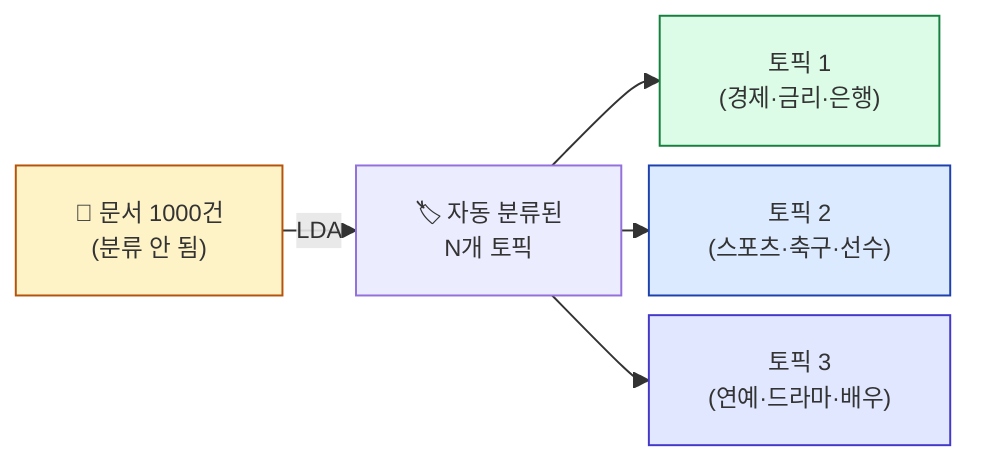
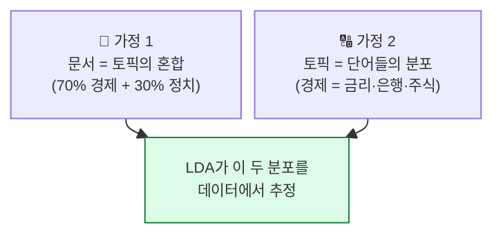
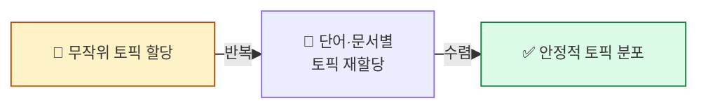
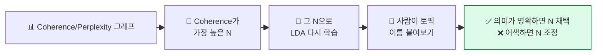

## 학습 목표

- **토픽 모델링**이 무엇을 하는 기술인지 안다
- **LDA(Latent Dirichlet Allocation)** 의 직관을 비유로 이해한다
- gensim으로 LDA를 학습하고 결과를 해석한다
- **Coherence / Perplexity** 점수로 토픽 수를 결정한다

<a id="toc"></a>

## 진행 순서

1. [토픽 모델링이 뭐예요?](#part1)
2. [LDA — 도서관 사서 비유](#part2)
3. [LDA의 동작 원리 직관](#part3)
4. [gensim 실습 — 토픽 추출](#part4)
5. [토픽 수 결정 — Coherence와 Perplexity](#part5)
6. [pyLDAvis 시각화](#part6)
7. [실습 노트북 안내](#part7)
8. [정리](#part8)

---

# 08장. LDA 토픽 모델링

<a id="part1"></a>

## 1. 토픽 모델링이 뭐예요? [↑](#toc)

### 자동 폴더 분류 비유

> 책상 위에 신문 기사 1000장이 뒤섞여 있습니다.
> 일일이 읽고 "정치, 경제, 스포츠, 연예"로 분류하라면 며칠 걸립니다.
>
> **토픽 모델링은 컴퓨터에게 "5개 폴더로 자동 분류해줘"** 라고 시키는 것.
> 결과: 폴더1=정치 기사, 폴더2=경제 기사, ... 같은 단어가 자주 나오는 기사끼리 자동으로 묶임.



### 토픽 모델링의 특징

- **비지도 학습(unsupervised)**: 정답 라벨 없이도 가능
- **잠재(latent) 주제**: 명시되지 않은 숨겨진 주제 발견
- **문서 = 여러 토픽의 혼합**: 한 기사가 "70% 경제 + 30% 정치" 일 수 있음

> 💡 **"잠재"의 의미**: 우리가 보기엔 그냥 신문 기사들이지만, 컴퓨터가 보기엔 그 안에 **숨겨진 주제의 분포**가 있다는 가정.

---

<a id="part2"></a>

## 2. LDA — 도서관 사서 비유 [↑](#toc)

> **사서**에게 책 100권과 빈 선반 5개를 주고 말합니다:
> "비슷한 주제끼리 5개 선반에 나눠 정리해주세요."
>
> 사서는 책을 한 권씩 들춰보며:
> 1. 자주 같이 등장하는 단어들을 묶음 ("축구, 선수, 골 → 스포츠")
> 2. 그 묶음(주제)을 갖는 책끼리 같은 선반에
> 3. 두 가지 주제를 다 다루는 책은 두 선반에 걸침 (혼합)
>
> **LDA는 이 사서의 작업을 자동으로 합니다.**

### LDA의 두 가정



### 다른 분류와 비교

| 방식 | 정답 라벨 필요? | 1문서 = 1주제? |
|------|--------------|--------------|
| 분류 (Classification) | **필수** | Yes |
| 클러스터링 (Clustering) | 불필요 | Yes |
| **LDA 토픽 모델링** | 불필요 | **No (혼합 가능)** |

---

<a id="part3"></a>

## 3. LDA의 동작 원리 직관 [↑](#toc)

### 학습 과정 (간단 버전)

```
1. 각 문서에 N개 토픽이 무작위로 할당
2. 각 단어에 임의의 토픽이 할당
3. 반복:
   a) 각 단어를 보고 "이 단어는 어느 토픽인가?" 재할당
      └─ "함께 자주 등장하는 단어들은 같은 토픽"
   b) 각 문서를 보고 "이 문서는 어느 토픽인가?" 재할당
      └─ "비슷한 단어 분포를 가진 문서는 같은 토픽"
4. 충분히 반복하면 안정적인 분포 도달
```



> 💡 **수학적 배경**: 디리클레 분포(Dirichlet Distribution)를 사용하므로 "LDA". 비전공자는 **이름의 유래** 정도만 알고, 동작은 "반복 재할당"으로 이해하면 충분.

### LDA 입력과 출력

| 입력 | 출력 |
|------|------|
| 문서 모음 (Bag of Words) | 토픽 N개 |
| 토픽 수 N (사용자 지정) | 각 토픽의 단어 분포 |
| 학습 반복 횟수 | 각 문서의 토픽 분포 |

---

<a id="part4"></a>

## 4. gensim 실습 — 토픽 추출 [↑](#toc)

### Step 1: 데이터 준비 (토큰화)

```python
from gensim import corpora, models
from kiwipiepy import Kiwi
import pandas as pd

kiwi = Kiwi()
stopwords = set(pd.read_csv("ko-stopwords.csv")["stopwords"])

def tokenize(text):
    return [t.form for t in kiwi.tokenize(kiwi.space(text))
            if t.tag in ("NNG", "NNP")
            and t.form not in stopwords
            and len(t.form) > 1]

documents = [tokenize(d) for d in raw_docs]   # 100건 정도
```

### Step 2: 어휘 사전과 BoW 변환

```python
# 어휘 사전 만들기
dictionary = corpora.Dictionary(documents)
dictionary.filter_extremes(no_below=2, no_above=0.5)
#  ├─ no_below: 2번 미만 등장 단어 제거
#  └─ no_above: 50% 이상 문서에 등장하는 단어 제거 (너무 흔함)

# 문서를 BoW로 변환
corpus = [dictionary.doc2bow(doc) for doc in documents]
```

### Step 3: LDA 학습

```python
NUM_TOPICS = 5

lda = models.LdaModel(
    corpus=corpus,
    id2word=dictionary,
    num_topics=NUM_TOPICS,
    passes=10,           # 학습 반복 횟수
    random_state=42      # 결과 재현용
)
```

### Step 4: 결과 해석

```python
# 각 토픽의 상위 단어
for idx, topic in lda.print_topics(num_words=8):
    print(f"\n토픽 {idx}:")
    print(topic)
```

**예상 출력**:
```
토픽 0:  0.04*"경제" + 0.03*"금리" + 0.03*"은행" + 0.02*"주식" + 0.02*"투자" + ...
토픽 1:  0.05*"축구" + 0.04*"선수" + 0.03*"경기" + 0.03*"감독" + 0.02*"리그" + ...
토픽 2:  0.04*"영화" + 0.03*"배우" + 0.03*"드라마" + 0.02*"방송" + 0.02*"감독" + ...
토픽 3:  0.04*"정부" + 0.03*"정치" + 0.03*"국회" + 0.02*"법안" + 0.02*"여당" + ...
토픽 4:  0.05*"코로나" + 0.04*"백신" + 0.03*"확진" + 0.02*"의료" + 0.02*"병원" + ...
```

| 출력 | 의미 |
|------|------|
| `0.04*"경제"` | 토픽 0에서 "경제"의 비중이 0.04 (4%) |
| 상위 단어들 | 사람이 해석해서 토픽 이름 붙임 ("경제·금융") |

### Step 5: 문서별 토픽 분포

```python
for i, doc_bow in enumerate(corpus[:3]):
    print(f"\n문서 {i}의 토픽 분포:")
    print(lda.get_document_topics(doc_bow))
```

**예상 출력**:
```
문서 0의 토픽 분포:
[(0, 0.682), (2, 0.187), (3, 0.094), ...]
  └─ 토픽 0 (경제)이 68%, 토픽 2가 19%, 나머지는 작음
```

> 💡 **이 문서는 경제 관련이지만 정치(토픽 3)와도 약간 연관이 있다** 같은 해석 가능. **혼합 분포**가 LDA의 묘미.

---

<a id="part5"></a>

## 5. 토픽 수 결정 — Coherence와 Perplexity [↑](#toc)

### 가장 어려운 결정 — N은 몇 개?

LDA를 돌리려면 **토픽 수 N** 을 미리 정해야 합니다. 너무 적으면 너무 큰 토픽, 너무 많으면 잘게 쪼개짐.

### Coherence — "토픽이 일관성 있나?"

```
높을수록 좋음 (음수 -1 ~ +1 정도 범위)
```

각 토픽의 상위 단어들이 **얼마나 함께 잘 등장하는지** 측정. 일관성 있는 토픽일수록 점수 높음.

### Perplexity — "모델이 잘 맞췄나?"

```
낮을수록 좋음 (작은 양수)
```

모델이 새 데이터를 얼마나 "놀라지 않고" 예측하나. 낮을수록 좋음.

### 최적 N 찾기 — Grid Search

```python
import matplotlib.pyplot as plt
from gensim.models.coherencemodel import CoherenceModel

scores = []
for n in range(2, 11):
    lda = models.LdaModel(corpus, id2word=dictionary, num_topics=n, passes=5, random_state=42)
    coh = CoherenceModel(model=lda, texts=documents, dictionary=dictionary, coherence="c_v")
    perp = lda.log_perplexity(corpus)
    scores.append((n, coh.get_coherence(), perp))

# 그래프
ns, cohs, perps = zip(*scores)
fig, ax1 = plt.subplots(figsize=(10, 4))
ax1.plot(ns, cohs, "o-", color="green", label="Coherence (↑)")
ax1.set_xlabel("토픽 수 N")
ax1.set_ylabel("Coherence", color="green")
ax2 = ax1.twinx()
ax2.plot(ns, perps, "s-", color="red", label="Perplexity (↓)")
ax2.set_ylabel("Perplexity", color="red")
plt.title("토픽 수에 따른 모델 평가")
plt.show()
```

### 해석 가이드



> 💡 **점수만으로는 결정 불가**. 결국 **사람이 토픽 단어를 보고 "이 토픽은 무엇이다"라고 이름 붙일 수 있는지**가 진짜 기준.

---

<a id="part6"></a>

## 6. pyLDAvis 시각화 [↑](#toc)

### 인터랙티브 토픽 탐색

```python
import pyLDAvis.gensim_models

vis = pyLDAvis.gensim_models.prepare(lda, corpus, dictionary)
pyLDAvis.display(vis)
```

**기능**:
- 좌측: 토픽들이 2D 공간에 원으로 표시 (원 크기 = 토픽 비중)
- 우측: 선택한 토픽의 상위 단어 막대그래프
- 두 토픽이 가까이 있으면 비슷한 토픽

> 💡 발표·보고서에 임팩트 있는 시각화. 학생들 "와" 하는 순간 1위.

---

<a id="part7"></a>

## 7. 실습 노트북 안내 [↑](#toc)

### 노트북 위치

```
docs/06_AI/03_TextMining/notebook/(완)07_LDA_쥬피터_실습.ipynb
```

### 노트북에서 다룰 내용

1. 영어 리뷰 데이터 전처리
2. gensim `LdaModel` 학습
3. 토픽별 상위 단어 출력
4. 문서별 토픽 분포
5. Coherence/Perplexity로 토픽 수 결정
6. pyLDAvis 시각화

### 실습 후 도전 과제 (선택)

본인이 관심 있는 한국어 데이터(블로그 글 100개 등):

```python
# 1) 데이터 수집·전처리
# 2) N=3~10 그리드 서치
# 3) 최적 N의 LDA로 토픽 추출
# 4) 각 토픽에 직접 이름 붙이기 ("이 토픽은 ___이다")
```

**관찰 포인트**: Coherence 점수 1위 N과 본인이 "이름 붙이기 쉬운" N이 같은가? 다르면 어느 쪽이 더 의미 있나?

---

<a id="part8"></a>

## 8. 정리 [↑](#toc)

### 이 장 한 줄 요약

> **LDA = 문서를 자동으로 N개 토픽으로 분류.** 도서관 사서가 책을 선반에 정리하는 작업의 자동화.

### 자가 진단 체크리스트

| 항목 | 확인 |
|------|:---:|
| 토픽 모델링이 무엇을 하는지 안다 | ☐ |
| LDA의 두 가정(문서=토픽 혼합, 토픽=단어 분포)을 안다 | ☐ |
| gensim `LdaModel` 학습 코드를 짤 수 있다 | ☐ |
| `print_topics()` 출력을 해석한다 | ☐ |
| Coherence와 Perplexity의 방향(↑/↓)을 안다 | ☐ |
| pyLDAvis로 시각화할 수 있다 | ☐ |
| 토픽 수 결정에 "사람의 판단"이 필요한 이유를 안다 | ☐ |

### 다음 모듈 미리보기

**[09. 감성분석](/textmining/sentiment)** — 텍스트의 **긍정/부정**을 자동으로 판별. 리뷰 분석의 핵심 도구.
