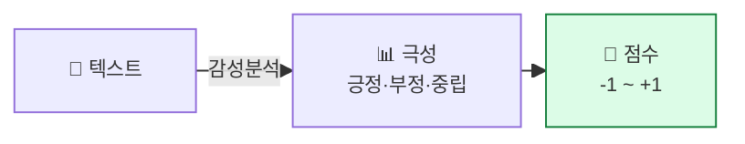
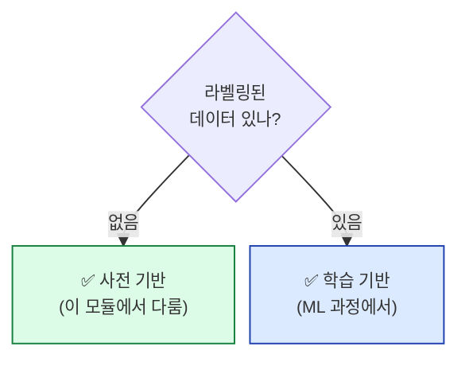

## 학습 목표

- **감성분석(Sentiment Analysis)** 의 정의와 활용 사례를 안다
- **사전 기반 vs 학습 기반** 접근의 차이를 안다
- TextBlob(영어)으로 즉시 감성을 판별한다
- 한국어 감성사전 기반 분석을 직접 구현한다

<a id="toc"></a>

## 진행 순서

1. [감성분석이 뭐예요?](#part1)
2. [두 가지 접근 — 사전 vs 학습](#part2)
3. [TextBlob — 영어 감성분석 (5줄)](#part3)
4. [한국어 감성사전 기반 분석](#part4)
5. [실습 — 영화 리뷰 감성분석](#part5)
6. [실습 노트북 안내](#part6)
7. [정리](#part7)

---

# 09장. 감성분석

<a id="part1"></a>

## 1. 감성분석이 뭐예요? [↑](#toc)

### 리뷰 별점 비유

> 쇼핑몰 리뷰를 봤을 때, **별점이 없어도** 글만 읽으면 "긍정/부정"이 보입니다.
> 감성분석은 **컴퓨터에게 그 일을 시키는 것**.

```
"이 식당 정말 맛있었어요! 강추!" → 😊 긍정
"음식이 차게 식어서 왔어요... 별로" → 😞 부정
"가격은 적당하고 맛은 그저그래요"   → 😐 중립
```

### 어디 쓰나?

| 분야 | 활용 |
|------|------|
| **쇼핑몰** | 리뷰 자동 분류 → 별점 추정 |
| **SNS 마케팅** | 브랜드 언급에 대한 반응 모니터링 |
| **금융** | 뉴스 감성으로 주가 예측 |
| **고객센터** | VOC(고객의 소리) 자동 분류 |
| **정치 분석** | 후보·정책에 대한 여론 측정 |



---

<a id="part2"></a>

## 2. 두 가지 접근 — 사전 vs 학습 [↑](#toc)

### 사전 기반 (Lexicon-based)

> **감성 사전**(긍정어/부정어 목록)을 미리 만들어 두고 매칭.

```
긍정어 사전: ['좋다', '훌륭하다', '맛있다', '추천', ...]
부정어 사전: ['나쁘다', '실망', '별로', '최악', ...]

문장: "음식이 맛있고 분위기도 좋다"
  → 긍정어 2개, 부정어 0개 → 긍정
```

| 장점 | 단점 |
|------|------|
| 학습 데이터 불필요 | 사전에 없는 단어 처리 못함 |
| 즉시 사용 가능 | 부정어("안 좋다"), 강조, 비꼬기 약함 |
| 해석 명확 | 도메인 한정 (영화 사전이 음식점에선 부정확) |

### 학습 기반 (ML/DL)

> **라벨링된 데이터**(긍정/부정 정답)로 모델을 학습.

```
학습 데이터:
  "맛있어요" → 1 (긍정)
  "최악입니다" → 0 (부정)
  ... 수천 건

→ 모델이 단어 패턴 학습 → 새 텍스트도 예측
```

| 장점 | 단점 |
|------|------|
| 미묘한 표현·부정어·비꼬기에 강함 | 학습 데이터 필요 |
| 도메인 적응 가능 | 해석이 덜 명확 |
| 정확도 높음 | 라벨링 비용 |

### 비교



> 💡 **본 과정에서는 사전 기반**에 집중합니다. 학습 기반은 ML 과정에서 분류 모델로 다룸.

---

<a id="part3"></a>

## 3. TextBlob — 영어 감성분석 (5줄) [↑](#toc)

영어 텍스트라면 **TextBlob**로 한 줄에 감성 점수가 나옵니다.

### 설치 + 코드

```python
!pip install -q textblob
from textblob import TextBlob

reviews = [
    "I love this product. It's amazing!",
    "Worst purchase ever. Total waste of money.",
    "It's okay, nothing special.",
]

for r in reviews:
    blob = TextBlob(r)
    p = blob.sentiment.polarity        # -1(부정) ~ +1(긍정)
    s = blob.sentiment.subjectivity    # 0(객관) ~ 1(주관)
    label = "😊 긍정" if p > 0.1 else "😞 부정" if p < -0.1 else "😐 중립"
    print(f"{label} ({p:+.2f})  '{r}'")
```

**예상 출력**:
```
😊 긍정 (+0.62)  'I love this product. It's amazing!'
😞 부정 (-0.65)  'Worst purchase ever. Total waste of money.'
😐 중립 (+0.10)  'It's okay, nothing special.'
```

| 출력 | 의미 |
|------|------|
| `polarity` | -1(매우 부정) ~ +1(매우 긍정) |
| `subjectivity` | 0(사실) ~ 1(의견) |

> 💡 TextBlob은 **영어용**. 한국어는 직접 사전을 만들거나 KNU 감성사전 같은 공개 자료를 씁니다.

---

<a id="part4"></a>

## 4. 한국어 감성사전 기반 분석 [↑](#toc)

### 간단한 감성사전 만들기

```python
positive_words = {
    "좋다", "훌륭하다", "맛있다", "최고", "추천", "행복",
    "만족", "감동", "친절", "빠르다", "편리하다", "예쁘다",
    "사랑", "기쁘다", "재미있다", "유익", "깔끔하다"
}

negative_words = {
    "나쁘다", "별로", "실망", "최악", "느리다", "불편",
    "비싸다", "더럽다", "짜증", "화나다", "후회", "끔찍",
    "지루하다", "어렵다", "복잡하다", "차갑다", "딱딱하다"
}
```

### 감성 점수 계산 함수

```python
from kiwipiepy import Kiwi
kiwi = Kiwi()

def sentiment_score(text):
    """텍스트의 감성 점수를 -1~+1 사이로 반환"""
    tokens = [t.form for t in kiwi.tokenize(kiwi.space(text))
              if t.tag in ("VA", "NNG", "NNP", "VV")]
    pos = sum(1 for t in tokens if t in positive_words)
    neg = sum(1 for t in tokens if t in negative_words)
    total = pos + neg
    if total == 0:
        return 0.0, "중립"
    score = (pos - neg) / total
    label = "긍정" if score > 0.1 else "부정" if score < -0.1 else "중립"
    return score, label

# 테스트
reviews = [
    "음식이 정말 맛있고 서비스도 친절했어요",
    "기다림이 너무 길고 음식도 차게 식어 왔습니다",
    "그럭저럭 무난한 식당입니다",
]

for r in reviews:
    score, label = sentiment_score(r)
    emoji = "😊" if label == "긍정" else "😞" if label == "부정" else "😐"
    print(f"{emoji} {label} ({score:+.2f})  '{r}'")
```

**예상 출력**:
```
😊 긍정 (+1.00)  '음식이 정말 맛있고 서비스도 친절했어요'
😞 부정 (-1.00)  '기다림이 너무 길고 음식도 차게 식어 왔습니다'
😐 중립 (+0.00)  '그럭저럭 무난한 식당입니다'
```

### 더 정교한 처리 — 부정어 처리

```
"맛있지 않다"  → "맛있다" 매칭되지만 실제는 부정

해결책: 부정어 패턴 감지
```


```python
import re

def has_negation_before(text, target):
    """target 단어 앞 3단어 안에 부정어가 있나?"""
    pattern = rf"(안|않|못|없|아니)\S{{0,10}}\s*{target}"
    return bool(re.search(pattern, text))

# 예
text = "정말 맛있지 않아요"
print(has_negation_before(text, "맛있"))  # True → 점수 반전
```


> 💡 **사전 기반의 한계가 여기서 드러납니다.** 한국어 부정어·강조·비꼬기는 학습 기반(ML/DL)이 훨씬 강함.

### KNU 한국어 감성사전 (공개 자료)

> **KNU 감성사전** = 군산대에서 공개한 한국어 감성어 사전 (약 14,000 단어).
> 단어별 polarity 점수(-2 ~ +2)를 부여.

```python
import pandas as pd

# 공개된 SentiWord_info.json (KNU 감성사전) 사용 예시
# (Colab에서 직접 다운로드 후 사용)
df_senti = pd.read_json("SentiWord_info.json")
# 컬럼: word, word_root, polarity
print(df_senti.head())
```

> 📌 실제 사용은 노트북 실습에서 자세히. **본 강의 페이지에서는 "사전 기반의 직관"** 까지.

---

<a id="part5"></a>

## 5. 실습 — 영화 리뷰 감성분석 [↑](#toc)

### NSMC (Naver Sentiment Movie Corpus) 데모

```python
import pandas as pd

# NSMC 일부 예시
sample = pd.DataFrame({
    "review": [
        "정말 재미있는 영화입니다. 강추!",
        "스토리가 너무 지루하고 산만해요. 시간 낭비.",
        "배우 연기는 좋았는데 결말이 별로",
        "최고의 명작! 다시 보고싶다",
    ],
    "label_true": [1, 0, 0, 1]   # 1=긍정, 0=부정
})

# 우리가 만든 감성분석 적용
sample["score"] = sample["review"].apply(lambda x: sentiment_score(x)[0])
sample["label_pred"] = (sample["score"] > 0).astype(int)
print(sample)
```

**예상 출력**:
```
                                  review  label_true  score  label_pred
0          정말 재미있는 영화입니다. 강추!           1   +1.00           1
1  스토리가 너무 지루하고 산만해요. 시간 낭비.            0   -1.00           0
2     배우 연기는 좋았는데 결말이 별로            0   -0.50           0
3            최고의 명작! 다시 보고싶다            1   +1.00           1
```

### 정확도 계산

```python
accuracy = (sample["label_pred"] == sample["label_true"]).mean()
print(f"정확도: {accuracy:.2f}")
```

> 💡 **사전 기반 정확도가 작은 데이터에서는 괜찮아 보이지만**, NSMC 전체(15만 건)에선 70% 정도. ML 분류 모델은 85%+. → ML 과정의 동기.

### 시각화 — 감성 분포

```python
import matplotlib.pyplot as plt

scores = sample["score"]
plt.hist(scores, bins=10)
plt.title("리뷰 감성 점수 분포")
plt.xlabel("감성 점수")
plt.ylabel("리뷰 수")
plt.axvline(0, color="red", linestyle="--", label="중립선")
plt.legend()
plt.show()
```

```python
# 긍정/부정/중립 비율
labels = sample["score"].apply(
    lambda s: "긍정" if s > 0.1 else "부정" if s < -0.1 else "중립"
)
labels.value_counts().plot.pie(autopct="%1.1f%%")
plt.title("감성 분포")
plt.ylabel("")
plt.show()
```

---

<a id="part6"></a>

## 6. 실습 노트북 안내 [↑](#toc)

### 노트북 위치 (신규 작성)

```
docs/06_AI/03_TextMining/notebook/09_감성분석_실습.ipynb  (신규 작성 예정)
```

### 노트북에서 다룰 내용

1. TextBlob으로 영어 리뷰 감성분석
2. 직접 만든 한국어 감성사전으로 분석
3. 부정어 처리 기초
4. 영화 리뷰 데이터셋 (또는 직접 수집한 리뷰)에 적용
5. 결과 시각화 (히스토그램, 파이차트)
6. 정확도 측정

### 실습 후 도전 과제 (선택)

본인이 자주 가는 음식점·카페·앱의 **리뷰 10건**을 수집해서:

```python
my_reviews = ["...", "...", ...]

# 1) 감성 점수 계산
# 2) 본인 판단(긍정/부정/중립)과 비교
# 3) 모델이 틀린 리뷰 분석 → 사전에 추가할 단어 찾기
```

**관찰 포인트**: 모델이 어떤 리뷰에서 실수하나? 부정어·비꼬기·도메인 단어 중 어느 패턴이 문제?

---

<a id="part7"></a>

## 7. 정리 [↑](#toc)

### 이 장 한 줄 요약

> **감성분석 = 텍스트의 긍정/부정 자동 판별.** 사전 기반은 즉시 가능하나 한계 있고, ML 기반은 정확하나 학습 데이터 필요.

### 자가 진단 체크리스트

| 항목 | 확인 |
|------|:---:|
| 감성분석의 활용 사례 3개를 든다 | ☐ |
| 사전 기반 vs 학습 기반의 차이를 안다 | ☐ |
| TextBlob의 polarity 출력을 해석한다 | ☐ |
| 한국어 감성사전 함수를 직접 짤 수 있다 | ☐ |
| 부정어 처리의 어려움을 안다 | ☐ |
| 감성 분포를 히스토그램·파이차트로 그린다 | ☐ |

### 다음 모듈 미리보기

**[10. 종합 프로젝트](/textmining/project)** — 지금까지 배운 모든 도구를 사용해 **한국어 리뷰 데이터 전체 파이프라인**을 수행. 본 과정의 졸업 작품.
