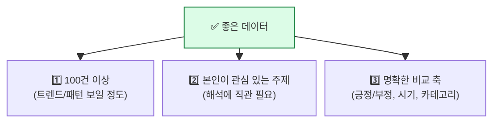
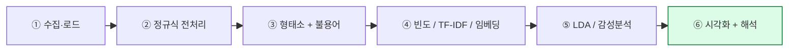
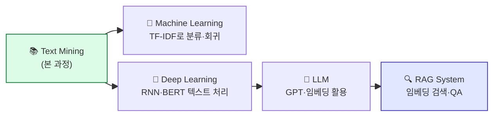
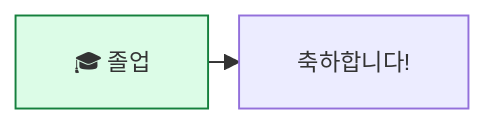

## 학습 목표

- 본 과정의 모든 도구를 **하나의 파이프라인**으로 통합한다
- 한국어 리뷰 데이터로 **수집 → 전처리 → 분석 → 시각화** 전 과정을 직접 수행한다
- 결과를 **3분 발표**로 정리할 수 있다
- 본 과정 이후의 **다음 학습 단계**를 안다

<a id="toc"></a>

## 진행 순서

1. [프로젝트 개요](#part1)
2. [데이터 선택 가이드](#part2)
3. [표준 파이프라인 — 6단계](#part3)
4. [코드 템플릿 — 한 노트북에 끝내기](#part4)
5. [발표 자료 가이드](#part5)
6. [평가 기준](#part6)
7. [다음 학습 로드맵](#part7)

---

# 10장. 종합 프로젝트

<a id="part1"></a>

## 1. 프로젝트 개요 [↑](#toc)

### 목표

> **한국어 리뷰 데이터** 한 종을 골라, 본 과정에서 배운 모든 도구를 사용해 **인사이트**를 뽑아내고 발표.

### 형식

- **팀 구성**: 3~4명
- **시간**: 3시간 (전처리·분석·시각화 2시간 + 발표 자료 1시간)
- **결과물**:
  - Jupyter 노트북 1개 (재현 가능)
  - 발표 자료 (슬라이드 또는 노트북 핵심 시각화)
  - 발표 (3~5분)

### 권장 도메인

| 도메인 | 데이터 출처 |
|--------|----------|
| **영화 리뷰** | NSMC (Naver Sentiment Movie Corpus, 공개) |
| **쇼핑몰 리뷰** | 쿠팡·11번가 등 (직접 수집 또는 공개 데이터셋) |
| **음식점 리뷰** | 네이버 플레이스, 카카오맵 |
| **앱 리뷰** | Google Play Store / App Store |
| **뉴스 댓글** | 네이버 뉴스 (정치·연예·스포츠 등 분야 선택) |
| **유튜브 댓글** | 특정 채널·영상 |

> 💡 **데이터 수집 자체가 어려우면 NSMC를 추천**합니다. 15만 건 라벨링된 영화 리뷰가 공개되어 있어 분석에 집중 가능.

---

<a id="part2"></a>

## 2. 데이터 선택 가이드 [↑](#toc)

### 좋은 프로젝트 데이터의 3조건



### NSMC 예시 — Colab에서 1줄 다운로드

```python
import pandas as pd

url_train = "https://raw.githubusercontent.com/e9t/nsmc/master/ratings_train.txt"
df = pd.read_csv(url_train, sep="\t").dropna()
print(df.head())
print(f"전체: {len(df)}건, 긍정 {df['label'].sum()}건, 부정 {(df['label']==0).sum()}건")
```

| id | document | label |
|----|----------|-------|
| 9976970 | 아 더빙.. 진짜 짜증나네요 목소리 | 0 |
| 3819312 | 흠...포스터보고 초딩영화줄....오버연기조차 가볍지 않구나 | 1 |
| 10265843 | 너무재밓었다그래서보는것을추천한다 | 0 |

### 직접 크롤링 (40시간 옵션 시)

본 과정에서는 크롤링을 다루지 않지만, 익숙한 분은 BeautifulSoup·Selenium으로 수집 가능.

> ⚠️ **저작권/이용약관 주의**. 학습 목적의 소량 수집은 일반적으로 허용되나, 대량/상업 이용은 사이트별 정책 확인 필수.

---

<a id="part3"></a>

## 3. 표준 파이프라인 — 6단계 [↑](#toc)



### 각 단계의 산출물

| 단계 | 산출물 | 사용 모듈 |
|------|--------|---------|
| ① 수집·로드 | DataFrame (review, label?) | — |
| ② 정규식 전처리 | 깨끗한 텍스트 컬럼 | 모듈 2 |
| ③ 형태소 + 불용어 | 명사 리스트 컬럼 | 모듈 1 |
| ④ 표현 | TF-IDF / Word2Vec / BoW | 모듈 4·5·6 |
| ⑤ 분석 | LDA 토픽 / 감성 점수 | 모듈 8·9 |
| ⑥ 시각화 | 워드클라우드 / 트리맵 / 차트 | 모듈 3 |

---

<a id="part4"></a>

## 4. 코드 템플릿 — 한 노트북에 끝내기 [↑](#toc)

### 셀 1: 환경 셋업 (00장 셋업 셀)

```python
!pip install -q kiwipiepy konlpy wordcloud squarify gensim nltk pyldavis textblob
!apt-get -qq install default-jdk fonts-nanum > /dev/null

import nltk
for d in ["punkt", "punkt_tab", "stopwords", "wordnet"]:
    nltk.download(d, quiet=True)

import matplotlib as mpl
mpl.rcParams["font.family"] = "NanumGothic"
mpl.rcParams["axes.unicode_minus"] = False
print("✅ 셋업 완료")
```

### 셀 2: 데이터 로드

```python
import pandas as pd

# NSMC 예시
url = "https://raw.githubusercontent.com/e9t/nsmc/master/ratings_train.txt"
df = pd.read_csv(url, sep="\t").dropna()
df = df.sample(2000, random_state=42).reset_index(drop=True)  # 데모용 2000건
print(df.head())
print(f"긍정: {df['label'].sum()}, 부정: {(df['label']==0).sum()}")
```

### 셀 3: 전처리 함수

```python
import re
from kiwipiepy import Kiwi

kiwi = Kiwi()
stopwords = set(pd.read_csv("ko-stopwords.csv")["stopwords"])

def clean(text):
    text = re.sub(r"<[^>]+>", " ", text)
    text = re.sub(r"https?://\S+", " ", text)
    text = re.sub(r"[^\w가-힣\s]", " ", text)
    return re.sub(r"\s+", " ", text).strip()

def tokenize_nouns(text):
    return [t.form for t in kiwi.tokenize(kiwi.space(clean(text)))
            if t.tag in ("NNG", "NNP")
            and t.form not in stopwords
            and len(t.form) > 1]

df["tokens"] = df["document"].apply(tokenize_nouns)
df["clean_text"] = df["tokens"].apply(lambda t: " ".join(t))
df.head()
```

### 셀 4: 빈도분석 + 워드클라우드

```python
from collections import Counter
from wordcloud import WordCloud
import matplotlib.pyplot as plt

all_tokens = [t for tokens in df["tokens"] for t in tokens]
top30 = Counter(all_tokens).most_common(30)
print(top30[:10])

# 워드클라우드
wc = WordCloud(
    font_path="/usr/share/fonts/truetype/nanum/NanumGothic.ttf",
    background_color="white", width=900, height=500
).generate_from_frequencies(dict(top30))
plt.figure(figsize=(12, 6))
plt.imshow(wc); plt.axis("off"); plt.title("전체 리뷰 워드클라우드")
plt.show()
```

### 셀 5: 긍정 vs 부정 비교

```python
def tokens_to_counter(label_value):
    return Counter([t for tokens in df.loc[df["label"]==label_value, "tokens"] for t in tokens])

pos_words = tokens_to_counter(1).most_common(20)
neg_words = tokens_to_counter(0).most_common(20)
print("긍정 상위:", pos_words[:5])
print("부정 상위:", neg_words[:5])
```

### 셀 6: TF-IDF — 긍정/부정 군집별

```python
from sklearn.feature_extraction.text import TfidfVectorizer

pos_texts = df.loc[df["label"]==1, "clean_text"].tolist()
neg_texts = df.loc[df["label"]==0, "clean_text"].tolist()

tfidf = TfidfVectorizer(max_features=50)
tfidf.fit([" ".join(pos_texts), " ".join(neg_texts)])
mat = tfidf.transform([" ".join(pos_texts), " ".join(neg_texts)]).toarray()

import numpy as np
words = tfidf.get_feature_names_out()
print("긍정에 더 많이 나오는 단어 TOP 10:")
diff_pos = mat[0] - mat[1]
for i in np.argsort(diff_pos)[::-1][:10]:
    print(f"  {words[i]}  (+{diff_pos[i]:.3f})")
print("\n부정에 더 많이 나오는 단어 TOP 10:")
diff_neg = mat[1] - mat[0]
for i in np.argsort(diff_neg)[::-1][:10]:
    print(f"  {words[i]}  (+{diff_neg[i]:.3f})")
```

### 셀 7: LDA 토픽 모델링

```python
from gensim import corpora, models

dictionary = corpora.Dictionary(df["tokens"])
dictionary.filter_extremes(no_below=5, no_above=0.5)
corpus = [dictionary.doc2bow(toks) for toks in df["tokens"]]

lda = models.LdaModel(corpus=corpus, id2word=dictionary, num_topics=5, passes=10, random_state=42)
for idx, topic in lda.print_topics(num_words=6):
    print(f"토픽 {idx}: {topic}\n")
```

### 셀 8: 감성 점수 (사전 기반)

```python
positive_words = {"좋다", "재미있다", "최고", "감동", "추천", "명작"}
negative_words = {"별로", "지루하다", "실망", "최악", "후회", "산만"}

def sentiment(tokens):
    pos = sum(1 for t in tokens if t in positive_words)
    neg = sum(1 for t in tokens if t in negative_words)
    if pos + neg == 0: return 0.0
    return (pos - neg) / (pos + neg)

df["sent_score"] = df["tokens"].apply(sentiment)
print(df[["document", "label", "sent_score"]].head(10))

# 정확도 추정 (label과 sent_score 부호 일치율)
pred = (df["sent_score"] > 0).astype(int)
mask = df["sent_score"] != 0
acc = (pred[mask] == df.loc[mask, "label"]).mean()
print(f"\n사전 기반 감성분석 정확도 (점수 0 제외): {acc:.2%}")
```

### 셀 9: 최종 시각화 + 인사이트 요약

```python
import squarify
from matplotlib import pyplot as plt

fig, axes = plt.subplots(2, 2, figsize=(14, 10))

# (1) 전체 워드클라우드
axes[0, 0].imshow(wc); axes[0, 0].axis("off")
axes[0, 0].set_title("전체 단어 워드클라우드")

# (2) 긍부정 비교 바차트
labels_, sizes_ = zip(*[("긍정", df["label"].sum()), ("부정", (df["label"]==0).sum())])
axes[0, 1].pie(sizes_, labels=labels_, autopct="%1.1f%%", colors=["#86efac", "#fca5a5"])
axes[0, 1].set_title("리뷰 라벨 분포")

# (3) 감성 점수 히스토그램
axes[1, 0].hist(df["sent_score"], bins=20, color="#60a5fa")
axes[1, 0].axvline(0, color="red", linestyle="--")
axes[1, 0].set_title("감성 점수 분포")

# (4) 부정 트리맵
neg_top = dict(neg_words[:15])
squarify.plot(sizes=list(neg_top.values()), label=list(neg_top.keys()),
              color=plt.cm.Reds_r.colors, ax=axes[1, 1])
axes[1, 1].axis("off")
axes[1, 1].set_title("부정 리뷰 핵심 단어 (트리맵)")

plt.tight_layout()
plt.show()
```

---

<a id="part5"></a>

## 5. 발표 자료 가이드 [↑](#toc)

### 권장 슬라이드 구성 (3~5분)

1. **표지** — 팀명·도메인·데이터 종류
2. **데이터 소개** — 출처·건수·기간
3. **전처리 과정** — 정규식·형태소·불용어 (1슬라이드)
4. **빈도분석 결과** — 상위 단어 + 워드클라우드
5. **LDA 토픽** — 5개 토픽과 이름
6. **감성분석 결과** — 긍/부정 분포 + 핵심 단어
7. **인사이트 3가지** — 데이터에서 발견한 흥미로운 점
8. **한계와 향후 과제** — 더 정확하려면?

### 좋은 발표의 3원칙

| 원칙 | 의미 |
|------|------|
| **그림 1장 = 슬라이드 1장** | 글로 설명하지 말고 그래프로 |
| **숫자보다 비교** | "정확도 72%" 보다 "긍정 리뷰는 부정의 1.5배" |
| **결론을 처음에** | "오늘의 결론: ___ 입니다. 자세히 보면..." |

---

<a id="part6"></a>

## 6. 평가 기준 [↑](#toc)

| 항목 | 비중 | 평가 기준 |
|------|:---:|---------|
| **재현성** | 25% | 노트북을 그대로 실행하면 같은 결과가 나오나? |
| **파이프라인 완성도** | 25% | 6단계가 모두 빠짐없이 들어갔나? |
| **시각화 품질** | 20% | 한글 폰트, 라벨, 제목, 색감 적절한가? |
| **인사이트** | 20% | "남이 모르는 발견"이 있나? |
| **발표** | 10% | 시간 안에 핵심 전달 |

### 자가 평가 체크리스트

| 항목 | 확인 |
|------|:---:|
| 노트북이 처음부터 끝까지 에러 없이 실행됨 | ☐ |
| 정규식 전처리 단계가 있음 | ☐ |
| 형태소 분석 + 불용어 제거 적용 | ☐ |
| 빈도분석 + 워드클라우드/트리맵 시각화 | ☐ |
| TF-IDF 또는 LDA 중 하나 이상 적용 | ☐ |
| 감성분석 시도 (사전 기반) | ☐ |
| 결과에 대한 자기 해석 한 문단 작성 | ☐ |
| 발표 자료 5장 이내로 정리 | ☐ |

---

<a id="part7"></a>

## 7. 다음 학습 로드맵 [↑](#toc)

### 본 과정 → 다음 단계



| 다음 자료 | 본 과정의 어느 모듈이 연결되나 |
|---------|---------------------------|
| [**Machine Learning**](/machinelearning) | 모듈 5(TF-IDF) → 텍스트 분류 / 모듈 6(임베딩) → ML 입력 |
| [**Deep Learning**](/deeplearning) | 모듈 6(임베딩) → 신경망 입력 / 모듈 9(감성분석) → 분류 모델 |
| [**LLM**](/llm) | 모듈 7(Local vs Distributed) → BERT/GPT 임베딩 |
| [**RAG System**](/rag-system) | 모듈 6(임베딩) → 의미 검색 + LLM 결합 |

### 본 과정에서 다루지 않은 토픽 (향후 학습 권장)

- **NER (명명개체인식)** — 텍스트에서 인물·지명·날짜 추출
- **BERTopic** — BERT 기반 토픽 모델링 (LDA의 현대 버전)
- **Sentence-Transformers** — 문장 의미 유사도
- **크롤링** — BeautifulSoup, Selenium으로 데이터 직접 수집
- **한국어 PLM** — KoBERT, KoBART, KoGPT 등

> 💡 본 과정의 텍스트마이닝 기초가 있으면 위 토픽 모두 자료를 읽고 따라할 수 있습니다.

---

## 8. 마치며

> **본 과정을 마친 여러분은 이제 한국어 텍스트 데이터를 자유롭게 다룰 수 있는 기초를 갖췄습니다.**
> 정규식으로 정리하고, 형태소를 나누고, 빈도와 TF-IDF로 핵심을 뽑고, 임베딩으로 의미를 잡고, LDA로 분류하고, 감성을 판단하는 — 이 흐름이 모든 텍스트 기반 AI 응용의 출발점입니다.
>
> 다음 자료(`/ml`, `/deeplearning`, `/llm`, `/rag-system`)에서 만나요.


