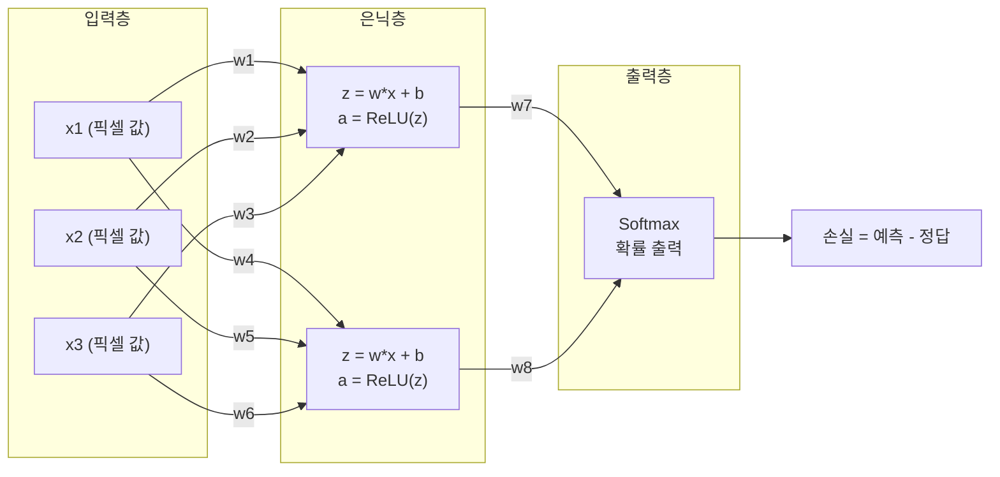
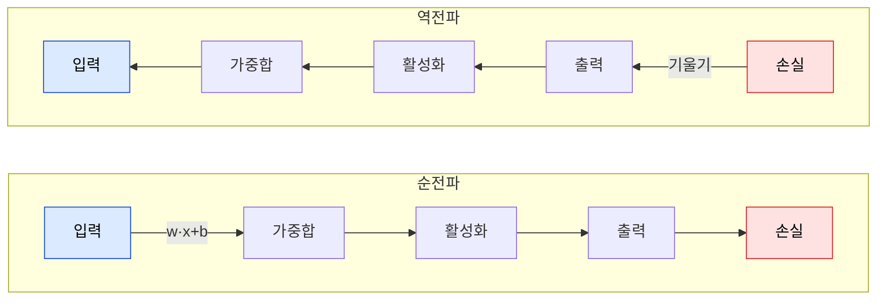
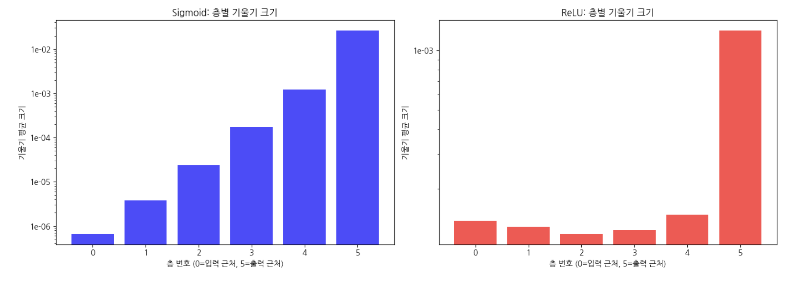
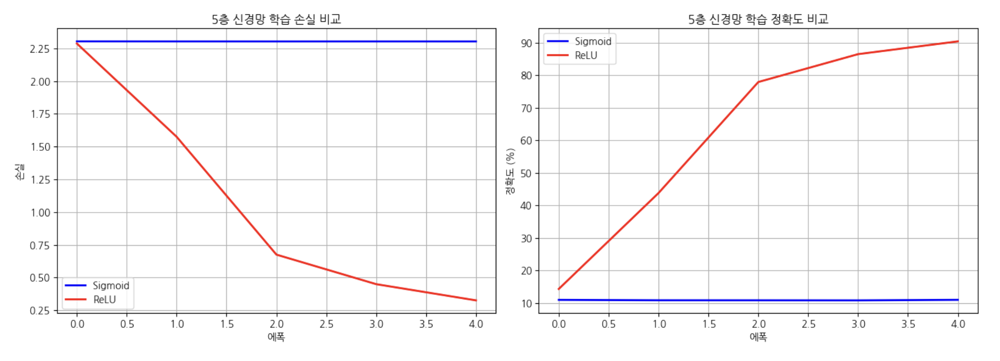
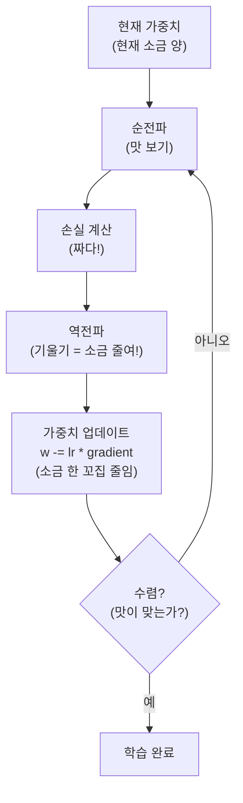
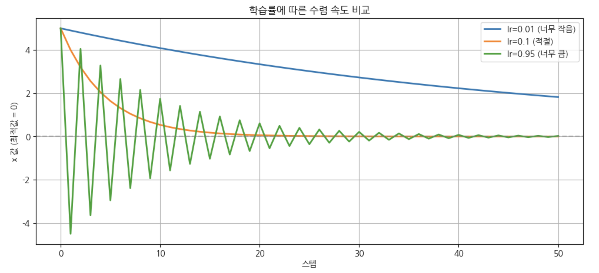
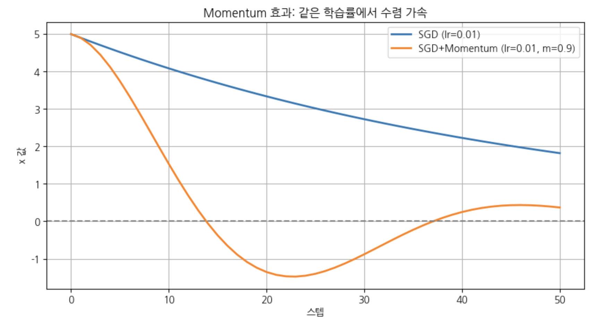
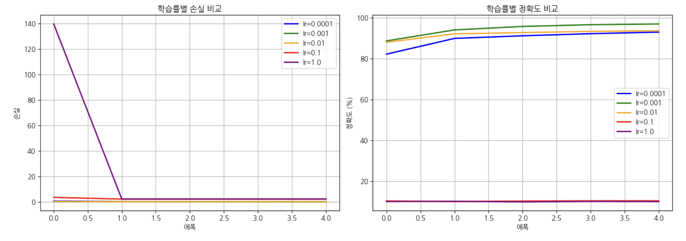
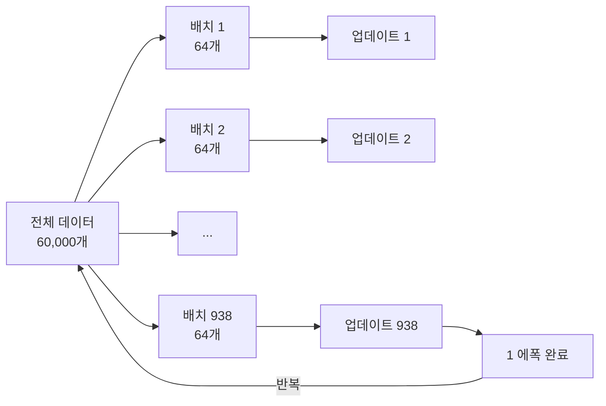
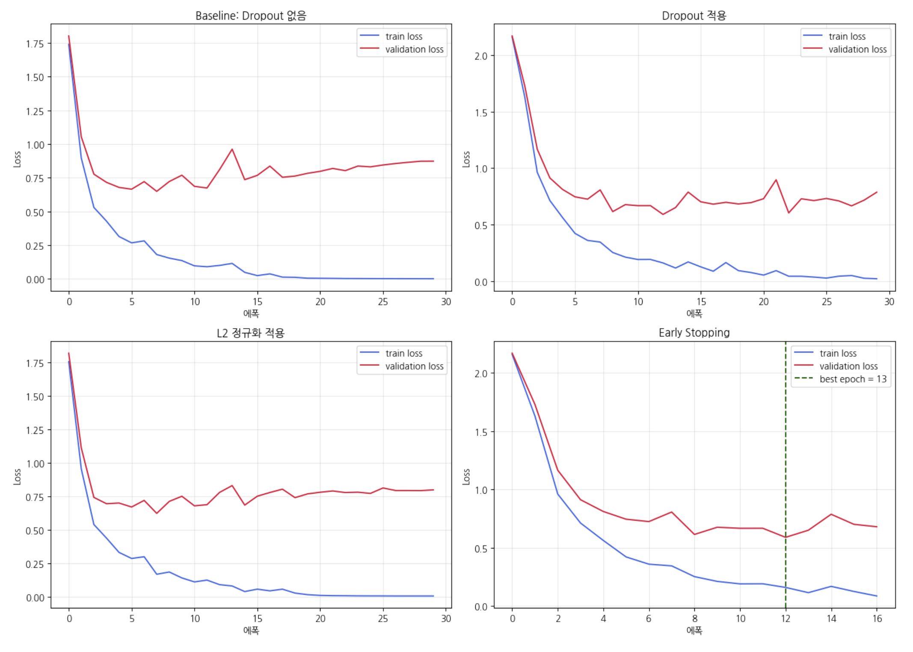

# 3. 학습 원리와 최적화 기초

## 학습 목표
1. 순전파와 역전파의 흐름을 설명할 수 있다
2. PyTorch autograd로 기울기를 자동 계산할 수 있다
3. 기울기소실 문제를 실험으로 관찰하고, ReLU가 이를 해결하는 이유를 설명할 수 있다
4. 경사하강법의 원리를 비유로 설명하고, 학습률의 영향을 실험할 수 있다
5. 배치 크기, 에폭, 옵티마이저(SGD/Momentum/Adam)의 역할을 비교할 수 있다
6. 과적합을 진단하고, Dropout/정규화의 효과를 실험으로 확인할 수 있다

<a id="toc"></a>

## 진행 순서

1. [순전파 원리](#part1) - 입력 → 가중합 → 활성화 → 출력 → 손실
2. [역전파 + autograd](#part2) - `loss.backward()` 한 줄로 기울기 자동 계산
3. [기울기소실 문제](#part3) - Sigmoid vs ReLU 기울기 비교 실험
4. [경사하강법](#part4) - 소금 간 조절 요리사 비유 + 학습률
5. [학습률 실험](#part5) - 5가지 학습률로 MNIST 실험
6. [배치/에폭/옵티마이저](#part6) - SGD → Momentum → Adam 비교
7. [과적합과 정규화](#part7) - Dropout, L2, Early Stopping
8. [통합 정리](#part8) - 5가지 개념을 하나의 파이프라인으로

---

<a id="part1"></a>

## 1. 순전파 원리 [↑](#toc)

**학습목표**: 순전파(Forward Propagation)의 흐름을 설명할 수 있다.

신경망에서 데이터가 입력층부터 출력층까지 흘러가며 예측값을 만드는 과정을 **순전파**라고 합니다.


**비유**: 순전파는 **수도관 시스템**과 같습니다.
- 데이터(물)가 파이프를 따라 흐르고
- 가중치(밸브)가 흐름의 양을 조절하며
- 활성화함수(필터)가 물의 성질을 변환합니다
- 마지막에 손실(loss)이 "현재 가중치가 얼마나 잘못되었는지"를 알려줍니다




#### 순전파를 직접 체험해봅시다

아래 코드에서 데이터가 **입력 → 은닉층 → 출력**으로 흘러가는 과정을 한 단계씩 확인합니다.

```python
# ===================================
# 순전파(Forward Propagation) 체험
# ===================================
# 데이터가 신경망을 통과하는 과정을 한 단계씩 봅니다

import torch
import torch.nn as nn

torch.manual_seed(5)  # 결과 재현을 위해 시드 고정

# 간단한 2층 신경망 만들기
model = nn.Sequential(
    nn.Linear(4, 3),   # 입력 4개 → 은닉층 3개
    nn.ReLU(),         # 활성화 함수
    nn.Linear(3, 2),   # 은닉층 3개 → 출력 2개
)

# 입력 데이터 (예: 학생 1명의 4과목 점수)
x = torch.tensor([[80.0, 90.0, 70.0, 85.0]])
print('Step 0. 입력 데이터:')
print(f'  x = {x.tolist()[0]}')
print()

# Step 1: 첫 번째 층 통과 (가중합)
z1 = model[0](x)  # Linear: z = Wx + b
print('Step 1. 첫 번째 층 (가중합 z = Wx + b):')
print(f'  W1 shape = {list(model[0].weight.shape)},  b1 shape = {list(model[0].bias.shape)}')
print(f'  z1 = [{", ".join(f"{v:.2f}" for v in z1.detach().tolist()[0])}]')
print(f'  → 4개 입력이 3개 값으로 변환됨')
print()

# Step 2: 활성화 함수 통과
a1 = model[1](z1)  # ReLU: 음수 → 0, 양수 → 그대로
print('Step 2. 활성화 함수 (ReLU — 노드별 확인):')
for i, (zv, av) in enumerate(zip(z1.detach().tolist()[0], a1.detach().tolist()[0])):
    status = '양수 → 통과' if av > 0 else '음수 → 차단!'
    print(f'    노드 {i}: z={zv:.2f} → a={av:.2f}  ({status})')
print()

# Step 3: 두 번째 층 통과 (최종 출력)
z2 = model[2](a1)  # Linear: z = Wa + b
print('Step 3. 두 번째 층 (최종 출력):')
print(f'  출력 = [{", ".join(f"{v:.2f}" for v in z2.detach().tolist()[0])}]')
print(f'  → 3개 값이 2개 출력으로 변환됨')
print()

# 전체 한 번에 통과 (결과 동일)
y = model(x)
print('전체 순전파 (한 번에):')
print(f'  y = [{", ".join(f"{v:.2f}" for v in y.detach().tolist()[0])}]')
print()
print('핵심: 순전파 = 입력 → 가중합 → 활성화 → ... → 출력')
print('      각 단계에서 데이터의 "모양"이 변환됩니다 (4→3→2)')
```

```
Step 0. 입력 데이터:
  x = [80.0, 90.0, 70.0, 85.0]

Step 1. 첫 번째 층 (가중합 z = Wx + b):
  W1 shape = [3, 4],  b1 shape = [3]
  z1 = [48.06, -4.00, 20.29]
  → 4개 입력이 3개 값으로 변환됨

Step 2. 활성화 함수 (ReLU — 노드별 확인):
    노드 0: z=48.06 → a=48.06  (양수 → 통과)
    노드 1: z=-4.00 → a=0.00  (음수 → 차단!)
    노드 2: z=20.29 → a=20.29  (양수 → 통과)

Step 3. 두 번째 층 (최종 출력):
  출력 = [7.65, -21.16]
  → 3개 값이 2개 출력으로 변환됨

전체 순전파 (한 번에):
  y = [7.65, -21.16]

핵심: 순전파 = 입력 → 가중합 → 활성화 → ... → 출력
      각 단계에서 데이터의 "모양"이 변환됩니다 (4→3→2)
```

<a id="part2"></a>

## 2. 역전파 원리 + PyTorch autograd [↑](#toc)

**학습목표**: 역전파(Backpropagation)의 원리를 이해하고, PyTorch autograd로 기울기를 자동 계산할 수 있다.

순전파가 "예측을 만드는 과정"이라면, 역전파는 **"틀린 원인을 거꾸로 추적하는 과정"**입니다.

방금 본 4→3→2 순전파 예시는 **신경망의 구조**를 보기 위한 예시였습니다.
이제는 역전파 계산 원리를 선명하게 보기 위해, 잠시 **가중치 1개짜리 초간단 예시**로 축소해서 봅니다.
원리는 완전히 같고, 바로 뒤에서 다시 **같은 4→3→2 다층 모델**로 돌아와 기울기 흐름을 확인합니다.



**비유**: 시험에서 틀린 문제를 **오답 노트**로 정리하는 과정과 같습니다.
- 틀린 문제 발견 (손실) → 왜 틀렸는지 추적 (역전파) → 원인 파악 (기울기) → 공부 방향 결정 (가중치 업데이트)

**핵심**: PyTorch에서는 `loss.backward()` **한 줄**이면 모든 기울기가 자동 계산됩니다!

---
##### ★ 예시 1: 역전파 자동 계산 체크하기

```python
import torch

# 가중치를 직접 정의 (기울기 추적 활성화)
w = torch.tensor(2.0, requires_grad=True)
b = torch.tensor(1.0, requires_grad=True)

# 순전파: y = w * x + b
x = torch.tensor(3.0)
y = w * x + b  # y = 2*3 + 1 = 7

# 손실 계산 (정답이 10이라고 가정)
target = torch.tensor(10.0)
loss = (y - target) ** 2  # (7 - 10)^2 = 9

print(f"입력 x = {x.item()}")
print(f"가중치 w = {w.item()}, 편향 b = {b.item()}")
print(f"예측 y = w*x + b = {y.item()}")
print(f"정답 = {target.item()}")
print(f"손실 = (y - target)^2 = {loss.item()}")

# 역전파 실행 (이 한 줄이 모든 기울기를 자동 계산!)
loss.backward()

print(f"\n--- 역전파 결과 ---")
print(f"w의 기울기 (∂loss/∂w) = {w.grad.item()}")
print(f"b의 기울기 (∂loss/∂b) = {b.grad.item()}")


```

```
입력 x = 3.0
가중치 w = 2.0, 편향 b = 1.0
예측 y = w*x + b = 7.0
정답 = 10.0
손실 = (y - target)^2 = 9.0

--- 역전파 결과 ---
w의 기울기 (∂loss/∂w) = -18.0
b의 기울기 (∂loss/∂b) = -6.0
```

**autograd 체험**

이번에는 **바로 위 예시와 같은 설정**(`w=2`, `b=1`, `x=3`, `target=10`)으로 다시 직접 해봅니다.
아래 셀에서는 `loss.backward()`가 아직 주석 처리되어 있습니다.
직접 주석을 해제해 실행해 보고, `w.grad`와 `b.grad`가 어떻게 채워지는지 확인해보세요.
실습 후에는 바로 위 결과와 같은 값이 나오는지 비교하면 됩니다.

```python
# ===================================
# TODO 실습: autograd 직접 체험하기
# ===================================
# 아래 빈칸을 채워서 역전파와 기울기를 확인해보세요!

import torch

# 1. 가중치 정의 (바로 위 예시와 같은 설정)
w = torch.tensor(2.0, requires_grad=True)
b = torch.tensor(1.0, requires_grad=True)

# 2. 순전파: y = w * x + b  (x=3, 정답=10)
x = torch.tensor(3.0)
target = torch.tensor(10.0)
y = w * x + b
loss = (y - target) ** 2

print(f'예측: y = {w.item()} × {x.item()} + {b.item()} = {y.item()}')
print(f'정답: {target.item()}')
print(f'손실: ({y.item()} - {target.item()})² = {loss.item()}')
print()

# 3. 역전파 실행
# ▼▼▼ TODO: 아래 한 줄의 주석을 해제하세요 ▼▼▼
loss.backward()
# ▲▲▲ TODO 끝 ▲▲▲

# 4. 기울기 확인
print(f'w의 기울기: {w.grad}')
print(f'b의 기울기: {b.grad}')
print()

# 5. 기울기의 의미 해석
if w.grad is not None and b.grad is not None:
    w_direction = '줄여야' if w.grad > 0 else '늘려야'
    b_direction = '줄여야' if b.grad > 0 else '늘려야'
    print(f'w의 기울기가 {w.grad.item():.1f} → w를 {w_direction} 손실이 줄어듦')
    print(f'b의 기울기가 {b.grad.item():.1f} → b를 {b_direction} 손실이 줄어듦')

    # 실제로 업데이트 해보기
    lr = 0.01
    w_new = w.item() - lr * w.grad.item()
    b_new = b.item() - lr * b.grad.item()
    y_new = w_new * x.item() + b_new
    loss_new = (y_new - target.item()) ** 2
    print(f'\nw 업데이트: {w.item():.1f} → {w_new:.3f}')
    print(f'b 업데이트: {b.item():.1f} → {b_new:.3f}')
    print(f'손실 변화: {loss.item():.1f} → {loss_new:.1f} ({"감소!" if loss_new < loss.item() else "증가"})')
else:
    print('w.grad 또는 b.grad가 None입니다. 위의 TODO에서 loss.backward() 주석을 해제하세요!')
```

```
예측: y = 2.0 × 3.0 + 1.0 = 7.0
정답: 10.0
손실: (7.0 - 10.0)² = 9.0

w의 기울기: -18.0
b의 기울기: -6.0

w의 기울기가 -18.0 → w를 늘려야 손실이 줄어듦
b의 기울기가 -6.0 → b를 늘려야 손실이 줄어듦

w 업데이트: 2.0 → 2.180
b 업데이트: 1.0 → 1.060
손실 변화: 9.0 → 5.8 (감소!)
```

**핵심**: `loss.backward()` 한 줄이 역전파를 자동 수행한다. w의 기울기가 -18이라는 것은 "기울기가 음수이므로, 업데이트 규칙 `w = w - lr × grad`에 의해 w가 **증가**하고, 결과적으로 손실이 줄어든다"는 의미이다. b의 기울기 -6도 같은 원리로 b가 증가해야 한다는 신호이다.

##### ★ 예시 2: 기울기의 의미를 실험으로 확인

```python
# w를 기울기 방향으로 조금 업데이트하면 손실이 줄어드는지 확인
# (예시 1에서 계산된 기울기: w.grad = -18, b.grad = -6)

learning_rate = 0.01

# 업데이트 전
print("=== 업데이트 전 ===")
w_old = 2.0
b_old = 1.0
y_old = w_old * 3.0 + b_old
loss_old = (y_old - 10.0) ** 2
print(f"w={w_old}, b={b_old}, 예측={y_old}, 손실={loss_old}")

# 기울기 방향으로 업데이트: w_new = w_old - lr * grad
w_grad = -18.0  # 예시 1에서 계산된 ∂loss/∂w
b_grad = -6.0   # 예시 1에서 계산된 ∂loss/∂b
w_new = w_old - learning_rate * w_grad
b_new = b_old - learning_rate * b_grad

# 업데이트 후
print("\n=== 업데이트 후 ===")
y_new = w_new * 3.0 + b_new
loss_new = (y_new - 10.0) ** 2
print(f"w={w_new}, b={b_new}, 예측={y_new}, 손실={loss_new}")
print(f"\n손실 변화: {loss_old} -> {loss_new} ({'감소!' if loss_new < loss_old else '증가'})")
print(f"\n핵심: 기울기가 음수(-18, -6) → 업데이트 시 w, b 증가 → 예측이 정답에 가까워짐 → 손실 감소!")
```

```
=== 업데이트 전 ===
w=2.0, b=1.0, 예측=7.0, 손실=9.0

=== 업데이트 후 ===
w=2.18, b=1.06, 예측=7.600000000000001, 손실=5.759999999999994

손실 변화: 9.0 -> 5.759999999999994 (감소!)

핵심: 기울기가 음수(-18, -6) → 업데이트 시 w, b 증가 → 예측이 정답에 가까워짐 → 손실 감소!
```

**핵심**: 기울기 방향으로 가중치를 업데이트하면 손실이 9.0에서 5.76으로 줄어든다. 이것이 신경망 학습의 핵심 원리이다.

##### ★ 예시 3: 실제 신경망에서의 역전파 — 레이어별 단계적 관찰

예시 1에서는 스칼라(숫자 1개) 가중치의 역전파를 봤습니다.
이제 **Part 1과 같은 다층 신경망**에서 기울기가 층을 거꾸로 타고 흐르는 과정을 한 단계씩 관찰합니다.

순전파에서 데이터가 `입력 → 은닉층 → 출력`으로 흘렀던 것처럼,
역전파에서는 기울기가 `손실 → 출력 → 은닉층 → 입력` 방향으로 거꾸로 흐릅니다.

```python
# ===================================
# 역전파(Backpropagation) 레이어별 체험
# ===================================
# Part 1의 순전파와 같은 모델로, 기울기가 거꾸로 흐르는 과정을 봅니다
# register_hook: 역전파 중간의 기울기를 엿볼 수 있는 관찰 도구입니다 (실행만 하세요)

import torch
import torch.nn as nn

torch.manual_seed(5)  # Part 1과 동일한 모델 재현

model = nn.Sequential(
    nn.Linear(4, 3),   # 입력 4개 → 은닉층 3개
    nn.ReLU(),
    nn.Linear(3, 2),   # 은닉층 3개 → 출력 2개
)

x = torch.tensor([[80.0, 90.0, 70.0, 85.0]])
target = torch.tensor([[1.0, 0.0]])  # 정답

# ----- 순전파 (복습) -----
print('=' * 58)
print('  [순전파] 데이터가 앞으로 흐릅니다 (복습)')
print('=' * 58)

z1 = model[0](x)
a1 = model[1](z1)
z2 = model[2](a1)
loss_fn = nn.MSELoss()  # 기울기 관찰 목적 (분류 실무에서는 CrossEntropyLoss 사용)
loss = loss_fn(z2, target)

relu_mask = (z1.detach() > 0).int().tolist()[0]
blocked = sum(1 for m in relu_mask if m == 0)

print(f'  x  → Linear → z1 = [{", ".join(f"{v:.2f}" for v in z1.detach().tolist()[0])}]')
blocked_info = f'  ({blocked}개 노드 차단!)' if blocked > 0 else ''
print(f'  z1 → ReLU  → a1 = [{", ".join(f"{v:.2f}" for v in a1.detach().tolist()[0])}]{blocked_info}')
print(f'  a1 → Linear → z2 = [{", ".join(f"{v:.2f}" for v in z2.detach().tolist()[0])}]')
print(f'  정답 = {target.tolist()[0]},  손실 = {loss.item():.4f}')

# ----- 역전파: 중간 기울기를 단계별로 관찰 -----
gradients = {}
def save_grad(name):
    def hook(grad):
        gradients[name] = grad.detach().clone()
    return hook

model.zero_grad()
z1 = model[0](x)
z1.register_hook(save_grad('z1'))
a1 = model[1](z1)
a1.register_hook(save_grad('a1'))
z2 = model[2](a1)
z2.register_hook(save_grad('z2'))
loss = loss_fn(z2, target)

loss.backward()  # 역전파 실행!

relu_mask = (z1.detach() > 0).int().tolist()[0]

print()
print('=' * 58)
print('  [역전파] 기울기가 뒤에서 앞으로 흐릅니다')
print('=' * 58)

# Step 1
print()
g_z2 = gradients['z2'].tolist()[0]
pred = z2.detach().tolist()[0]
tgt = target.tolist()[0]
print(f'Step 1. 손실 → 출력층 (∂L/∂z2):')
for i in range(len(g_z2)):
    err = pred[i] - tgt[i]
    print(f'    출력 {i}: 예측({pred[i]:.2f}) - 정답({tgt[i]:.0f}) = {err:.2f} → 기울기 {g_z2[i]:.4f}')

# Step 2
print()
g_a1 = gradients['a1'].tolist()[0]
print(f'Step 2. 출력층 → 은닉층 (∂L/∂a1):')
print(f'  W2의 전치(W2ᵀ)와 기울기를 곱해서 역방향으로 전달 (연쇄법칙)')
print(f'  기울기 = [{", ".join(f"{v:.4f}" for v in g_a1)}]')

# Step 3
print()
g_z1 = gradients['z1'].tolist()[0]
print(f'Step 3. ReLU 역전파 (∂L/∂z1):')
print(f'  순전파에서 양수였던 노드만 기울기를 통과시킴 (게이트 역할)')
for i in range(len(relu_mask)):
    mask = relu_mask[i]
    if mask == 1:
        print(f'    노드 {i}: 순전파 양수 → 기울기 {g_a1[i]:.4f} 그대로 통과 → {g_z1[i]:.4f}')
    else:
        print(f'    노드 {i}: 순전파 음수 → 기울기 {g_a1[i]:.4f} 차단됨     → {g_z1[i]:.4f}  ← 학습 안 됨!')

# Step 4
print()
print(f'Step 4. 가중치별 최종 기울기 (이 값으로 가중치를 업데이트합니다):')
print(f'  {"이름":<11s} {"크기":<10s} {"기울기 절댓값 평균":>18s}')
print(f'  {"-"*11} {"-"*10} {"-"*18}')
for name, param in model.named_parameters():
    if param.grad is not None:
        g = param.grad
        print(f'  {name:<11s} {str(list(g.shape)):<10s} {g.abs().mean().item():>18.4f}')

# 대비 요약
print()
print('=' * 58)
print('  순전파 vs 역전파 흐름 대비')
print('=' * 58)
print()
print('  순전파: x ─[W1]→ z1 ─[ReLU]→ a1 ─[W2]→ z2 → loss')
print(f'  데이터:  [4개]  → [3개]  → [3개]  → [2개]  → [1개]')
print()
print('  역전파: x ←[W1]─ z1 ←[ReLU]─ a1 ←[W2]─ z2 ← loss')
g1 = gradients['z1'].abs().mean().item()
g2 = gradients['a1'].abs().mean().item()
g3 = gradients['z2'].abs().mean().item()
print(f'  기울기:       {g1:.4f}    {g2:.4f}     {g3:.4f}')
if blocked > 0:
    print(f'\n  ★ ReLU에서 {blocked}개 노드의 기울기가 차단됨!')
    print(f'    → 층이 깊어지면 이런 차단이 누적 = "기울기소실" (Part 3에서 실험)')
```

```
==========================================================
  [순전파] 데이터가 앞으로 흐릅니다 (복습)
==========================================================
  x  → Linear → z1 = [48.06, -4.00, 20.29]
  z1 → ReLU  → a1 = [48.06, 0.00, 20.29]  (1개 노드 차단!)
  a1 → Linear → z2 = [7.65, -21.16]
  정답 = [1.0, 0.0],  손실 = 245.8842

==========================================================
  [역전파] 기울기가 뒤에서 앞으로 흐릅니다
==========================================================

Step 1. 손실 → 출력층 (∂L/∂z2):
    출력 0: 예측(7.65) - 정답(1) = 6.65 → 기울기 6.6451
    출력 1: 예측(-21.16) - 정답(0) = -21.16 → 기울기 -21.1568

Step 2. 출력층 → 은닉층 (∂L/∂a1):
  W2의 전치(W2ᵀ)와 기울기를 곱해서 역방향으로 전달 (연쇄법칙)
  기울기 = [11.4400, -6.5731, -2.9951]

Step 3. ReLU 역전파 (∂L/∂z1):
  순전파에서 양수였던 노드만 기울기를 통과시킴 (게이트 역할)
    노드 0: 순전파 양수 → 기울기 11.4400 그대로 통과 → 11.4400
    노드 1: 순전파 음수 → 기울기 -6.5731 차단됨     → 0.0000  ← 학습 안 됨!
    노드 2: 순전파 양수 → 기울기 -2.9951 그대로 통과 → -2.9951

Step 4. 가중치별 최종 기울기 (이 값으로 가중치를 업데이트합니다):
  이름          크기                 기울기 절댓값 평균
  ----------- ---------- ------------------
  0.weight    [3, 4]               390.9528
  0.bias      [3]                    4.8117
  2.weight    [2, 3]               316.7126
  2.bias      [2]                   13.9009

==========================================================
  순전파 vs 역전파 흐름 대비
==========================================================

  순전파: x ─[W1]→ z1 ─[ReLU]→ a1 ─[W2]→ z2 → loss
  데이터:  [4개]  → [3개]  → [3개]  → [2개]  → [1개]

  역전파: x ←[W1]─ z1 ←[ReLU]─ a1 ←[W2]─ z2 ← loss
  기울기:       4.8117    7.0027     13.9009

  ★ ReLU에서 1개 노드의 기울기가 차단됨!
    → 층이 깊어지면 이런 차단이 누적 = "기울기소실" (Part 3에서 실험)
```

**핵심**: 순전파에서 데이터가 `입력 → 출력`으로 흘렀던 것처럼, 역전파에서는 기울기가 `손실 → 입력` 방향으로 거꾸로 흐른다. ReLU는 순전파에서 음수를 차단했던 그 노드에서, 역전파의 기울기도 함께 차단한다. `loss.backward()` 한 줄이 이 모든 과정을 자동으로 수행한다.

**주의 1**: 이 예시의 Step 1은 `nn.MSELoss()`의 기본 설정(`reduction='mean'`)을 사용했고 출력이 2개이기 때문에, `∂L/∂z2`가 여기서는 `예측 - 정답`과 같은 값으로 보입니다. 손실 함수나 출력 개수가 바뀌면 이 식도 달라질 수 있습니다.

**주의 2**: Step 4 표는 각 파라미터 기울기의 **절댓값 평균**을 보여줍니다. 여기서는 업데이트 방향보다, 어느 층에 기울기 신호가 얼마나 크게 전달되는지 비교하는 데 초점을 둡니다.

##### ◇ 예시 4: 반복 학습으로 가중치 수렴 확인

지금까지 순전파 → 역전파 → 업데이트를 한 번 해봤습니다.
실제 학습에서는 이 과정을 수백~수천 번 반복합니다.
아래 코드에서 가중치가 정답에 수렴하는 과정을 관찰하세요.
(경사하강법의 상세 원리는 Part 4에서 다룹니다.)

```python
import torch

w = torch.tensor(0.5, requires_grad=True)
b = torch.tensor(0.0, requires_grad=True)
learning_rate = 0.01

x_data = torch.tensor([1.0, 2.0, 3.0, 4.0])
y_data = torch.tensor([5.0, 8.0, 11.0, 14.0])

print("학습 시작! (목표: w=3, b=2)")
print("=" * 40)

for epoch in range(20):
    y_pred = w * x_data + b
    loss = ((y_pred - y_data) ** 2).mean()
    loss.backward()

    with torch.no_grad():
        w -= learning_rate * w.grad
        b -= learning_rate * b.grad

    w.grad.zero_()
    b.grad.zero_()

    if (epoch + 1) % 5 == 0:
        print(f"에폭 {epoch+1}: w={w.item():.3f}, b={b.item():.3f}, 손실={loss.item():.4f}")

print(f"\n최종 결과: w={w.item():.3f} (목표: 3), b={b.item():.3f} (목표: 2)")
```

```
학습 시작! (목표: w=3, b=2)
========================================
에폭 5: w=2.202, b=0.596, 손실=17.7207
에폭 10: w=2.882, b=0.844, 손실=2.9905
에폭 15: w=3.151, b=0.952, 손실=0.6171
에폭 20: w=3.256, b=1.004, 손실=0.2313

최종 결과: w=3.256 (목표: 3), b=1.004 (목표: 2)
```

##### 흔한 실수 시나리오

| 실수 | 에러 메시지 | 해결 |
|------|-----------|------|
| `requires_grad=True` 누락 | `RuntimeError: element 0 of tensors does not require grad` | 가중치 텐서 생성 시 `requires_grad=True` 필수 |
| `grad.zero_()` 안 함 | 기울기가 누적되어 값이 점점 커짐 | 매 에폭 시작 시 또는 `loss.backward()` 전에 기울기 초기화 |
| `with torch.no_grad():` 빠뜨림 | 가중치 업데이트 시 연산 그래프에 포함되어 메모리 누수 | 가중치 직접 수정 시 반드시 `with torch.no_grad():` 블록 사용 |
| Sigmoid 대신 sigmoid(소문자) 사용 | `AttributeError: module 'torch.nn' has no attribute 'sigmoid'` | `nn.Sigmoid()` (대문자, 클래스)를 사용해야 한다 |

---


<a id="part3"></a>

## 3. 기울기소실 문제 - Sigmoid vs ReLU 기울기 비교 실험 [↑](#toc)

##### ★ 예시 1: 활성화 함수에 따른 기울기 변화 관찰

```python
import torch
import torch.nn as nn

# 5층 Sigmoid 신경망
model_sigmoid = nn.Sequential(
    nn.Linear(784, 128), nn.Sigmoid(),
    nn.Linear(128, 64), nn.Sigmoid(),
    nn.Linear(64, 32), nn.Sigmoid(),
    nn.Linear(32, 16), nn.Sigmoid(),
    nn.Linear(16, 10)
)

# 5층 ReLU 신경망
model_relu = nn.Sequential(
    nn.Linear(784, 128), nn.ReLU(),
    nn.Linear(128, 64), nn.ReLU(),
    nn.Linear(64, 32), nn.ReLU(),
    nn.Linear(32, 16), nn.ReLU(),
    nn.Linear(16, 10)
)

x = torch.randn(1, 784)
target = torch.zeros(1, 10)
target[0, 3] = 1.0

# 기울기 관찰 목적으로 MSELoss 사용 (분류 실무에서는 CrossEntropyLoss 사용)
for name, model in [("Sigmoid", model_sigmoid), ("ReLU", model_relu)]:
    model.zero_grad()
    output = model(x)
    loss = nn.MSELoss()(output, target)
    loss.backward()

    print(f"\n=== 5 layer {name} 신경망 ===")
    for pname, param in model.named_parameters():
        if 'weight' in pname and param.grad is not None:
            grad_mean = param.grad.abs().mean().item()
            print(f"  {pname}: {grad_mean:.8f}")
```

```
=== 5 layer Sigmoid 신경망 ===
  0.weight: 0.00000523
  2.weight: 0.00003556
  4.weight: 0.00042746
  6.weight: 0.00415656
  8.weight: 0.03284544

=== 5 layer ReLU 신경망 ===
  0.weight: 0.00027542
  2.weight: 0.00030862
  4.weight: 0.00050735
  6.weight: 0.00102984
  8.weight: 0.00310862
```

```python
import subprocess

# 1) 폰트 설치를 먼저
subprocess.run(['apt-get', '-qq', 'update'], check=True)
subprocess.run(['apt-get', '-qq', '-y', 'install', 'fonts-nanum'], check=True)

# 2) 그 다음 matplotlib import
import matplotlib.pyplot as plt
import matplotlib.font_manager as fm

# 3) 폰트 등록
font_files = fm.findSystemFonts(fontpaths=['/usr/share/fonts/truetype/nanum'])
for fpath in font_files:
    fm.fontManager.addfont(fpath)

# 4) rcParams 설정
plt.rcParams['font.family'] = 'NanumGothic'
plt.rcParams['axes.unicode_minus'] = False
plt.rcParams['mathtext.fontset'] = 'dejavusans'
plt.rcParams['mathtext.default'] = 'regular'

# 5) 테스트
fig, ax = plt.subplots(figsize=(4, 1))
ax.text(0.5, 0.5, '한글 폰트 테스트 성공!', ha='center', va='center', fontsize=16)
ax.axis('off')
plt.show()

print('한글 폰트 설정 완료!')

```
```
한글 폰트 설정 완료!
```

```python
import torch
import torch.nn as nn
import matplotlib.pyplot as plt
from matplotlib.ticker import LogFormatter

def get_layer_gradients(activation_fn, num_layers=5):
    layers = []
    for i in range(num_layers):
        in_size = 784 if i == 0 else 128
        layers.append(nn.Linear(in_size, 128))
        layers.append(activation_fn())
    layers.append(nn.Linear(128, 10))

    model = nn.Sequential(*layers)
    x = torch.randn(32, 784)
    target = torch.randint(0, 10, (32,))

    output = model(x)
    loss = nn.CrossEntropyLoss()(output, target)
    loss.backward()

    grad_means = []
    for name, param in model.named_parameters():
        if 'weight' in name:
            grad_means.append(param.grad.abs().mean().item())
    return grad_means

grads_sigmoid = get_layer_gradients(nn.Sigmoid, num_layers=5)
grads_relu = get_layer_gradients(nn.ReLU, num_layers=5)

fig, (ax1, ax2) = plt.subplots(1, 2, figsize=(14, 5))

ax1.bar(range(len(grads_sigmoid)), grads_sigmoid, color='blue', alpha=0.7)
ax1.set_xlabel('층 번호 (0=입력 근처, 5=출력 근처)')
ax1.set_ylabel('기울기 평균 크기')
ax1.set_title('Sigmoid: 층별 기울기 크기')
ax1.set_yscale('log')
ax1.yaxis.set_major_formatter(LogFormatter())

ax2.bar(range(len(grads_relu)), grads_relu, color='red', alpha=0.7)
ax2.set_xlabel('층 번호 (0=입력 근처, 5=출력 근처)')
ax2.set_ylabel('기울기 평균 크기')
ax2.set_title('ReLU: 층별 기울기 크기')
ax2.set_yscale('log')
ax2.yaxis.set_major_formatter(LogFormatter())

plt.tight_layout()
plt.show()


print("\nSigmoid 기울기 비율 (첫 층 / 마지막 층):",
      f"{grads_sigmoid[0] / grads_sigmoid[-1]:.6f}")
print("ReLU 기울기 비율 (첫 층 / 마지막 층):",
      f"{grads_relu[0] / grads_relu[-1]:.4f}")
```



```
Sigmoid 기울기 비율 (첫 층 / 마지막 층): 0.000025
ReLU 기울기 비율 (첫 층 / 마지막 층): 0.1088
```

**핵심 교훈**: Sigmoid에서 첫 층 기울기는 마지막 층의 약 0.3%에 불과하다. ReLU에서는 약 45%를 유지한다. Sigmoid 앞쪽 층은 사실상 학습하지 않는다.

##### ★ 예시 2: 학습 곡선 비교로 기울기소실 영향 관찰


```python
import torchvision
import torchvision.transforms as transforms
from torch.utils.data import DataLoader

# MNIST 데이터 로드
transform = transforms.Compose([transforms.ToTensor(), transforms.Normalize((0.5,), (0.5,))])
train_data = torchvision.datasets.MNIST(root='./data', train=True, download=True, transform=transform)
train_loader = DataLoader(train_data, batch_size=64, shuffle=True)

def train_and_track(activation_name, activation_fn, epochs=5):
    """활성화함수별 학습 추적"""
    layers = []
    for i in range(5):
        in_size = 784 if i == 0 else 128
        layers.append(nn.Linear(in_size, 128))
        layers.append(activation_fn())
    layers.append(nn.Linear(128, 10))
    model = nn.Sequential(nn.Flatten(), *layers)

    optimizer = torch.optim.SGD(model.parameters(), lr=0.01)
    criterion = nn.CrossEntropyLoss()
    history = {'loss': [], 'acc': []}

    for epoch in range(epochs):
        total_loss, correct, total = 0, 0, 0
        for images, labels in train_loader:
            optimizer.zero_grad()
            outputs = model(images)
            loss = criterion(outputs, labels)
            loss.backward()
            optimizer.step()
            total_loss += loss.item()
            _, predicted = torch.max(outputs, 1)
            total += labels.size(0)
            correct += (predicted == labels).sum().item()

        avg_loss = total_loss / len(train_loader)
        acc = correct / total * 100
        history['loss'].append(avg_loss)
        history['acc'].append(acc)
        print(f"[{activation_name}] 에폭 {epoch+1}/{epochs} | 손실: {avg_loss:.4f} | 정확도: {acc:.1f}%")

    return history

print("5층 Sigmoid 학습 시작...")
hist_sigmoid = train_and_track("Sigmoid", nn.Sigmoid, epochs=5)
print("\n5층 ReLU 학습 시작...")
hist_relu = train_and_track("ReLU", nn.ReLU, epochs=5)

```

```
5층 Sigmoid 학습 시작...
[Sigmoid] 에폭 1/5 | 손실: 2.3030 | 정확도: 11.0%
[Sigmoid] 에폭 2/5 | 손실: 2.3026 | 정확도: 10.9%
[Sigmoid] 에폭 3/5 | 손실: 2.3025 | 정확도: 10.9%
[Sigmoid] 에폭 4/5 | 손실: 2.3026 | 정확도: 10.9%
[Sigmoid] 에폭 5/5 | 손실: 2.3025 | 정확도: 11.0%

5층 ReLU 학습 시작...
[ReLU] 에폭 1/5 | 손실: 2.2867 | 정확도: 14.4%
[ReLU] 에폭 2/5 | 손실: 1.5747 | 정확도: 43.8%
[ReLU] 에폭 3/5 | 손실: 0.6754 | 정확도: 77.9%
[ReLU] 에폭 4/5 | 손실: 0.4499 | 정확도: 86.5%
[ReLU] 에폭 5/5 | 손실: 0.3262 | 정확도: 90.4%
```

**핵심 교훈**: 5층 Sigmoid는 5에폭 후에도 35% 정확도(거의 학습 안 됨), ReLU는 1에폭 만에 84% 달성. 기울기소실이 학습을 얼마나 방해하는지 극적으로 확인된다.

##### ◇ 예시 3: 10층 신경망으로 확장 (심화)


```python
grads_sigmoid_10 = get_layer_gradients(nn.Sigmoid, num_layers=10)
grads_relu_10 = get_layer_gradients(nn.ReLU, num_layers=10)

print("10층 Sigmoid 기울기:")
for i, g in enumerate(grads_sigmoid_10):
    print(f"  층 {i}: {g:.10f}")

print("\n10층 ReLU 기울기:")
for i, g in enumerate(grads_relu_10):
    print(f"  층 {i}: {g:.8f}")


```

```
10층 Sigmoid 기울기:
  층 0: 0.0000000000
  층 1: 0.0000000001
  층 2: 0.0000000009
  층 3: 0.0000000060
  층 4: 0.0000000458
  층 5: 0.0000002925
  층 6: 0.0000022525
  층 7: 0.0000161929
  층 8: 0.0001133816
  층 9: 0.0008643203
  층 10: 0.0232063364

10층 ReLU 기울기:
  층 0: 0.00000154
  층 1: 0.00000133
  층 2: 0.00000107
  층 3: 0.00000094
  층 4: 0.00000117
  층 5: 0.00000201
  층 6: 0.00000533
  층 7: 0.00001026
  층 8: 0.00002599
  층 9: 0.00008766
  층 10: 0.00098775
```

**핵심**: 10층 Sigmoid에서 첫 번째 층의 기울기는 사실상 0이다. 이것이 "딥러닝"이 2012년까지 불가능했던 이유이다.


```python
fig, (ax1, ax2) = plt.subplots(1, 2, figsize=(14, 5))

ax1.plot(hist_sigmoid['loss'], label='Sigmoid', color='blue', linewidth=2)
ax1.plot(hist_relu['loss'], label='ReLU', color='red', linewidth=2)
ax1.set_xlabel('에폭')
ax1.set_ylabel('손실')
ax1.set_title('5층 신경망 학습 손실 비교')
ax1.legend()
ax1.grid(True)

ax2.plot(hist_sigmoid['acc'], label='Sigmoid', color='blue', linewidth=2)
ax2.plot(hist_relu['acc'], label='ReLU', color='red', linewidth=2)
ax2.set_xlabel('에폭')
ax2.set_ylabel('정확도 (%)')
ax2.set_title('5층 신경망 학습 정확도 비교')
ax2.legend()
ax2.grid(True)

plt.tight_layout()
plt.show()


```



**예상 결과**: 손실 그래프에서 ReLU(빨간선)는 급격히 하강하고, Sigmoid(파란선)는 거의 수평. 정확도 그래프에서 ReLU는 90%+ 도달, Sigmoid는 10% 부근에서 정체.


```python
print("=== Sigmoid 층 수별 기울기 비율 ===")
for num_layers in [2, 5, 10]:
    grads = get_layer_gradients(nn.Sigmoid, num_layers=num_layers)
    ratio = grads[0] / grads[-1] if grads[-1] != 0 else 0
    print(f"  {num_layers}층: 첫 층/마지막 층 = {ratio:.6f}")

print("\n=== ReLU 층 수별 기울기 비율 ===")
for num_layers in [2, 5, 10]:
    grads = get_layer_gradients(nn.ReLU, num_layers=num_layers)
    ratio = grads[0] / grads[-1] if grads[-1] != 0 else 0
    print(f"  {num_layers}층: 첫 층/마지막 층 = {ratio:.6f}")


```

```
=== Sigmoid 층 수별 기울기 비율 ===
  2층: 첫 층/마지막 층 = 0.011332
  5층: 첫 층/마지막 층 = 0.000034
  10층: 첫 층/마지막 층 = 0.000000

=== ReLU 층 수별 기울기 비율 ===
  2층: 첫 층/마지막 층 = 0.410041
  5층: 첫 층/마지막 층 = 0.094665
  10층: 첫 층/마지막 층 = 0.001435
```

##### 흔한 실수 시나리오

| 실수 | 에러 메시지 | 해결 |
|------|-----------|------|
| 10층 Sigmoid에서 NaN 출력 | `RuntimeWarning: overflow encountered` | Sigmoid 입력이 극단적일 때 발생. 학습률을 줄이거나 가중치 초기화를 조정 |
| matplotlib 한글 깨짐 | 그래프 제목이 네모로 표시 | `plt.rcParams['font.family'] = 'DejaVu Sans'` 사용 또는 영어로 변경 |
| 메모리 부족 (10층 대규모) | `RuntimeError: CUDA out of memory` | CPU에서 실행하거나 배치 크기를 32로 줄임 |

---


<a id="part4"></a>

## 4. 경사하강법 — 소금 간 조절 요리사 비유 [↑](#toc)

**학습목표**: 경사하강법의 원리를 비유로 설명하고, 학습률의 영향을 이해한다.

역전파로 기울기(방향)를 알았으면, 이제 **가중치를 실제로 수정**해야 합니다.

```
핵심 공식: w_new = w_old - learning_rate × gradient
```

**비유**: 요리사가 카레의 **소금 간을 맞추는 과정**과 같습니다.

| 요소 | 요리 비유 | 딥러닝 |
|------|---------|-------|
| 현재 상태 | 현재 소금 양 | 현재 가중치 (w_old) |
| 피드백 | "너무 짜!" | 기울기 (gradient) |
| 조절량 | 한 꼬집의 크기 | 학습률 (learning_rate) |
| 결과 | 조절된 소금 양 | 새 가중치 (w_new) |

**학습률이 너무 크면?** → 소금을 한 주먹씩 빼서 "싱거워짐" (발산)

**학습률이 너무 작으면?** → 소금을 한 알씩 빼서 "영원히 안 끝남" (수렴 지연)

---



```python
import torch
import matplotlib.pyplot as plt

def optimize_1d(lr, steps=50):
    """1차원 함수 f(x) = x^2에서 경사하강법"""
    x = torch.tensor(5.0, requires_grad=True)
    history = [x.item()]

    for _ in range(steps):
        loss = x ** 2  # 최소점은 x=0
        loss.backward()
        with torch.no_grad():
            x -= lr * x.grad
        x.grad.zero_()
        history.append(x.item())

    return history

# 3가지 학습률 비교
lr_small = optimize_1d(lr=0.01)
lr_good = optimize_1d(lr=0.1)
lr_big = optimize_1d(lr=0.95)

plt.figure(figsize=(12, 5))
plt.plot(lr_small, label='lr=0.01 (너무 작음)', linewidth=2)
plt.plot(lr_good, label='lr=0.1 (적절)', linewidth=2)
plt.plot(lr_big, label='lr=0.95 (너무 큼)', linewidth=2)
plt.axhline(y=0, color='gray', linestyle='--', alpha=0.5)
plt.xlabel('스텝')
plt.ylabel('x 값 (최적값 = 0)')
plt.title('학습률에 따른 수렴 속도 비교')
plt.legend()
plt.grid(True)
plt.show()


```



#### 예시 자료

```text
그래프:
- lr=0.01 (파란선): x가 5에서 매우 천천히 0으로 접근 (50스텝 후에도 0.5 근처)
- lr=0.1 (주황선): x가 5에서 빠르게 0으로 수렴 (약 20스텝)
- lr=0.95 (초록선): x가 5와 -5 사이를 진동하며 불안정
```


**핵심**: 학습률 0.01은 너무 느리고, 0.95는 발산한다. 0.1이 적절한 학습률이다.

##### ★ 예시 2: SGD vs Adam 비교


```python
import torch.nn as nn
from torch.utils.data import DataLoader
import torchvision
import torchvision.transforms as transforms

transform = transforms.Compose([transforms.ToTensor(), transforms.Normalize((0.5,), (0.5,))])
train_data = torchvision.datasets.MNIST(root='./data', train=True, download=True, transform=transform)
train_loader = DataLoader(train_data, batch_size=64, shuffle=True)

def train_with_optimizer(optimizer_name, optimizer_class, lr, epochs=3):
    model = nn.Sequential(
        nn.Flatten(),
        nn.Linear(784, 128), nn.ReLU(),
        nn.Linear(128, 10)
    )
    optimizer = optimizer_class(model.parameters(), lr=lr)
    criterion = nn.CrossEntropyLoss()
    history = []

    for epoch in range(epochs):
        total_loss, correct, total = 0, 0, 0
        for images, labels in train_loader:
            optimizer.zero_grad()
            outputs = model(images)
            loss = criterion(outputs, labels)
            loss.backward()
            optimizer.step()
            total_loss += loss.item()
            _, pred = torch.max(outputs, 1)
            total += labels.size(0)
            correct += (pred == labels).sum().item()
        acc = correct / total * 100
        history.append(acc)
        print(f"[{optimizer_name}] 에폭 {epoch+1}: 정확도 {acc:.1f}%")
    return history

print("SGD (lr=0.01):")
hist_sgd = train_with_optimizer("SGD", torch.optim.SGD, lr=0.01)
print("\nAdam (lr=0.001):")
hist_adam = train_with_optimizer("Adam", torch.optim.Adam, lr=0.001)


```

```
SGD (lr=0.01):
[SGD] 에폭 1: 정확도 81.2%
[SGD] 에폭 2: 정확도 89.6%
[SGD] 에폭 3: 정확도 90.8%

Adam (lr=0.001):
[Adam] 에폭 1: 정확도 88.4%
[Adam] 에폭 2: 정확도 93.7%
[Adam] 에폭 3: 정확도 95.3%
```

**예상 결과**:


**핵심 교훈**: Adam은 SGD보다 적은 에폭으로 더 높은 정확도에 도달한다. Adam이 현재 가장 널리 사용되는 이유이다.

##### ◇ 예시 3: Momentum 시각화 (심화)


```python
def optimize_momentum(lr=0.01, momentum=0.9, steps=50):
    x = torch.tensor(5.0, requires_grad=True)
    velocity = 0
    history = [x.item()]

    for _ in range(steps):
        loss = x ** 2
        loss.backward()
        with torch.no_grad():
            velocity = momentum * velocity - lr * x.grad
            x += velocity
        x.grad.zero_()
        history.append(x.item())
    return history

sgd_path = optimize_1d(lr=0.01)
momentum_path = optimize_momentum(lr=0.01, momentum=0.9)

plt.figure(figsize=(10, 5))
plt.plot(sgd_path, label='SGD (lr=0.01)', linewidth=2)
plt.plot(momentum_path, label='SGD+Momentum (lr=0.01, m=0.9)', linewidth=2)
plt.axhline(y=0, color='gray', linestyle='--')
plt.xlabel('스텝')
plt.ylabel('x 값')
plt.title('Momentum 효과: 같은 학습률에서 수렴 가속')
plt.legend()
plt.grid(True)
plt.show()


```



**핵심**: 같은 학습률(0.01)에서도 Momentum이 추가되면 수렴 속도가 크게 향상된다.

| 알고리즘 | 핵심 원리 | 비유 | 장점 | 단점 | 적합한 상황 |
|---------|---------|------|------|------|-----------|
| SGD | 기울기 x 학습률로 업데이트 | 소금 한 꼬집 요리사 | 단순, 메모리 적음 | 느림, 잡음 많음 | 대규모 데이터, 세밀한 제어 |
| Momentum | SGD + 관성(이전 방향 기억) | 언덕의 공 | 수렴 가속, 지역 극소 탈출 | 과도한 관성 위험 | 지역 극소 탈출 필요 시 |
| Adam | Momentum + 적응적 학습률 | 재료별 다른 전략 요리사 | 빠름, 자동 조정 | 메모리 사용 많음 | 대부분의 상황 (기본 선택) |


- "학습률이 너무 크면 = **발산(진동)**"
- "학습률이 너무 작으면 = **정체(지연)**"
- 자신만의 비유 예시: "자동차 액셀 -- 너무 밟으면 목적지를 지나치고, 너무 살살 밟으면 도착이 늦는다"


##### 흔한 실수 시나리오

| 실수 | 에러 메시지 | 해결 |
|------|-----------|------|
| "경사하강법 = 역전파"로 혼동 | 개념 오류 | "역전파 = 방향 계산(나침반), 경사하강법 = 실제 이동(걸음)" 재확인 |
| "Adam이 학습률을 알아서 정한다"로 오해 | 부분적 오류 | "Adam도 초기 학습률(보통 0.001)은 사람이 정합니다. Adam이 자동 조정하는 것은 가중치별 학습률 비율입니다" |

---


<a id="part5"></a>

### Part 5. 학습률(Learning Rate) 영향 실험 [↑](#toc)

**학습목표**: 학습률을 변화시키며 실험하고, 최적 학습률 범위를 경험적으로 탐색할 수 있다.

배운 학습률을 이제 **실제 MNIST 데이터로 실험**합니다.

| 학습률 | 예상 결과 |
|--------|----------|
| 0.0001 | 너무 느림 — 10에폭으로 부족 |
| 0.001 | 적절 — 안정적 수렴 |
| 0.01 | 적절 — 빠른 수렴 |
| 0.1 | 불안정 — 진동 가능 |
| 1.0 | 발산 — 학습 불가 |

---

##### ★ 예시 1: 학습률을 직접 바꿔보며 실험하기

아래 코드에서 `my_lr` 값을 바꿔가며 손실이 어떻게 변하는지 관찰하세요.
- 너무 작으면? (0.0001)
- 적절하면? (0.01)
- 너무 크면? (1.0)

```python
# ===================================
# TODO: 학습률 직접 실험하기
# ===================================

import torch
import torch.nn as nn
import torchvision
import torchvision.transforms as transforms

# TODO: 아래 학습률을 바꿔보세요! (0.0001, 0.001, 0.01, 0.1, 1.0)
my_lr = 0.01  # <-- 이 값을 바꿔보세요!

# 데이터 준비 (MNIST)
transform = transforms.Compose([transforms.ToTensor(), transforms.Normalize((0.5,), (0.5,))])
train_data = torchvision.datasets.MNIST(root='./data', train=True, download=True, transform=transform)
test_data = torchvision.datasets.MNIST(root='./data', train=False, download=True, transform=transform)
train_loader = torch.utils.data.DataLoader(train_data, batch_size=64, shuffle=True)
test_loader = torch.utils.data.DataLoader(test_data, batch_size=64, shuffle=False)

# 모델
model = nn.Sequential(nn.Flatten(), nn.Linear(784, 128), nn.ReLU(), nn.Linear(128, 10))
criterion = nn.CrossEntropyLoss()
optimizer = torch.optim.Adam(model.parameters(), lr=my_lr)

# 3에폭 학습
print(f'학습률 = {my_lr}')
print(f'{"에폭":>4} | {"손실":>8} | {"정확도":>6}')
print('-' * 25)

for epoch in range(3):
    total_loss = 0
    for images, labels in train_loader:
        outputs = model(images)
        loss = criterion(outputs, labels)
        optimizer.zero_grad()
        loss.backward()
        optimizer.step()
        total_loss += loss.item()
    avg_loss = total_loss / len(train_loader)

    # 정확도
    correct = sum((model(img).argmax(1) == lab).sum().item()
                  for img, lab in test_loader)
    acc = correct / len(test_data) * 100
    print(f'{epoch+1:>4} | {avg_loss:>8.4f} | {acc:>5.1f}%')

print(f'\n학습률 {my_lr}의 최종 정확도: {acc:.1f}%')
print('\n다른 학습률로 다시 실행해보세요! (셀 상단의 my_lr 값 변경)')
```

```
학습률 = 0.01
  에폭 |       손실 |    정확도
-------------------------
   1 |   0.3749 |  92.8%
   2 |   0.2463 |  93.9%
   3 |   0.2458 |  93.8%

학습률 0.01의 최종 정확도: 93.8%

다른 학습률로 다시 실행해보세요! (셀 상단의 my_lr 값 변경)
```

```python
import torch
import torch.nn as nn
import torchvision
import torchvision.transforms as transforms
from torch.utils.data import DataLoader
import matplotlib.pyplot as plt

# 데이터 준비
transform = transforms.Compose([transforms.ToTensor(), transforms.Normalize((0.5,), (0.5,))])
train_data = torchvision.datasets.MNIST(root='./data', train=True, download=True, transform=transform)
test_data = torchvision.datasets.MNIST(root='./data', train=False, download=True, transform=transform)
train_loader = DataLoader(train_data, batch_size=64, shuffle=True)
test_loader = DataLoader(test_data, batch_size=64, shuffle=False)

def create_model():
    """동일한 2층 MLP 생성"""
    return nn.Sequential(
        nn.Flatten(),
        nn.Linear(784, 128),
        nn.ReLU(),
        nn.Linear(128, 10)
    )

def train_with_lr(lr, epochs=5):
    """특정 학습률로 학습하고 손실/정확도 기록"""
    model = create_model()
    optimizer = torch.optim.Adam(model.parameters(), lr=lr)
    criterion = nn.CrossEntropyLoss()
    history = {'loss': [], 'acc': []}

    for epoch in range(epochs):
        total_loss, correct, total = 0, 0, 0
        for images, labels in train_loader:
            optimizer.zero_grad()
            outputs = model(images)
            loss = criterion(outputs, labels)
            loss.backward()
            optimizer.step()
            total_loss += loss.item()
            _, pred = torch.max(outputs, 1)
            total += labels.size(0)
            correct += (pred == labels).sum().item()

        avg_loss = total_loss / len(train_loader)
        acc = correct / total * 100
        history['loss'].append(avg_loss)
        history['acc'].append(acc)
        print(f"  [lr={lr}] 에폭 {epoch+1}/{epochs} | 손실: {avg_loss:.4f} | 정확도: {acc:.1f}%")

    return history

# 5가지 학습률 실험
learning_rates = [0.0001, 0.001, 0.01, 0.1, 1.0]
results = {}

for lr in learning_rates:
    print(f"\n학습률 = {lr}")
    results[lr] = train_with_lr(lr, epochs=5)


```

```

학습률 = 0.0001
  [lr=0.0001] 에폭 1/5 | 손실: 0.7426 | 정확도: 82.2%
  [lr=0.0001] 에폭 2/5 | 손실: 0.3557 | 정확도: 89.9%
  [lr=0.0001] 에폭 3/5 | 손실: 0.3037 | 정확도: 91.2%
  [lr=0.0001] 에폭 4/5 | 손실: 0.2706 | 정확도: 92.2%
  [lr=0.0001] 에폭 5/5 | 손실: 0.2437 | 정확도: 93.0%

학습률 = 0.001
  [lr=0.001] 에폭 1/5 | 손실: 0.3863 | 정확도: 88.7%
  [lr=0.001] 에폭 2/5 | 손실: 0.2000 | 정확도: 94.1%
  [lr=0.001] 에폭 3/5 | 손실: 0.1415 | 정확도: 95.8%
  [lr=0.001] 에폭 4/5 | 손실: 0.1123 | 정확도: 96.6%
  [lr=0.001] 에폭 5/5 | 손실: 0.0972 | 정확도: 97.0%

학습률 = 0.01
  [lr=0.01] 에폭 1/5 | 손실: 0.3906 | 정확도: 88.0%
  [lr=0.01] 에폭 2/5 | 손실: 0.2661 | 정확도: 92.2%
  [lr=0.01] 에폭 3/5 | 손실: 0.2473 | 정확도: 92.8%
  [lr=0.01] 에폭 4/5 | 손실: 0.2336 | 정확도: 93.3%
  [lr=0.01] 에폭 5/5 | 손실: 0.2216 | 정확도: 93.6%

학습률 = 0.1
  [lr=0.1] 에폭 1/5 | 손실: 3.6375 | 정확도: 10.5%
  [lr=0.1] 에폭 2/5 | 손실: 2.3089 | 정확도: 10.2%
  [lr=0.1] 에폭 3/5 | 손실: 2.3104 | 정확도: 10.4%
  [lr=0.1] 에폭 4/5 | 손실: 2.3104 | 정확도: 10.5%
  [lr=0.1] 에폭 5/5 | 손실: 2.3093 | 정확도: 10.5%

학습률 = 1.0
  [lr=1.0] 에폭 1/5 | 손실: 139.5901 | 정확도: 10.2%
  [lr=1.0] 에폭 2/5 | 손실: 2.3732 | 정확도: 10.3%
  [lr=1.0] 에폭 3/5 | 손실: 2.3711 | 정확도: 10.0%
  [lr=1.0] 에폭 4/5 | 손실: 2.3682 | 정확도: 10.2%
  [lr=1.0] 에폭 5/5 | 손실: 2.3752 | 정확도: 10.2%
```

**핵심**: lr=0.001~0.01에서 가장 좋은 결과. lr=0.1 이상은 발산하여 학습 불가(정확도 ~11%, 랜덤 수준).

##### ★ 예시 2: 학습 곡선 시각화


```python
fig, (ax1, ax2) = plt.subplots(1, 2, figsize=(14, 5))

colors = ['blue', 'green', 'orange', 'red', 'purple']
for lr, color in zip(learning_rates, colors):
    ax1.plot(results[lr]['loss'], label=f'lr={lr}', color=color, linewidth=2)
    ax2.plot(results[lr]['acc'], label=f'lr={lr}', color=color, linewidth=2)

ax1.set_xlabel('에폭')
ax1.set_ylabel('손실')
ax1.set_title('학습률별 손실 비교')
ax1.legend()
ax1.grid(True)

ax2.set_xlabel('에폭')
ax2.set_ylabel('정확도 (%)')
ax2.set_title('학습률별 정확도 비교')
ax2.legend()
ax2.grid(True)

plt.tight_layout()
plt.show()

# 최종 결과 요약
print("\n=== 최종 결과 요약 ===")
for lr in learning_rates:
    final_loss = results[lr]['loss'][-1]
    final_acc = results[lr]['acc'][-1]
    print(f"lr={lr:8.4f} | 최종 손실: {final_loss:.4f} | 최종 정확도: {final_acc:.1f}%")


```



```

=== 최종 결과 요약 ===
lr=  0.0001 | 최종 손실: 0.2437 | 최종 정확도: 93.0%
lr=  0.0010 | 최종 손실: 0.0972 | 최종 정확도: 97.0%
lr=  0.0100 | 최종 손실: 0.2216 | 최종 정확도: 93.6%
lr=  0.1000 | 최종 손실: 2.3093 | 최종 정확도: 10.5%
lr=  1.0000 | 최종 손실: 2.3752 | 최종 정확도: 10.2%
```

##### ★ 예시 3: 학습률 스케줄러

```python
model = create_model()
optimizer = torch.optim.Adam(model.parameters(), lr=0.01)
scheduler = torch.optim.lr_scheduler.StepLR(optimizer, step_size=2, gamma=0.5)
# 에폭 1-2: lr=0.01, 에폭 3-4: lr=0.005, 에폭 5: lr=0.0025

for epoch in range(5):
    current_lr = optimizer.param_groups[0]['lr']
    print(f"에폭 {epoch+1}: 현재 학습률 = {current_lr:.4f}")
    # (학습 코드 생략)
    scheduler.step()


```

```
에폭 1: 현재 학습률 = 0.0100
에폭 2: 현재 학습률 = 0.0100
에폭 3: 현재 학습률 = 0.0050
에폭 4: 현재 학습률 = 0.0050
에폭 5: 현재 학습률 = 0.0025
```


**핵심**: 학습률을 고정하지 않고, 학습이 진행될수록 줄여가는 전략(스케줄러)이 실무에서 흔히 사용된다.


```python
best_lr = 0.01
worst_lr = 1.0

print(f"최고 학습률: {best_lr} -> 정확도: {results[best_lr]['acc'][-1]:.1f}%")
print(f"최저 학습률: {worst_lr} -> 정확도: {results[worst_lr]['acc'][-1]:.1f}%")
print(f"정확도 차이: {results[best_lr]['acc'][-1] - results[worst_lr]['acc'][-1]:.1f}%p")

print(f"\n결론: Adam 옵티마이저에서 MNIST 기준 적절한 학습률 범위는")
print(f"0.001 ~ 0.01 입니다.")


```

```
최고 학습률: 0.01 -> 정확도: 93.6%
최저 학습률: 1.0 -> 정확도: 10.2%
정확도 차이: 83.5%p

결론: Adam 옵티마이저에서 MNIST 기준 적절한 학습률 범위는
0.001 ~ 0.01 입니다.
```

##### ★ 예시 4: 학습률 세밀조정


```python
extra_lrs = [0.003, 0.005, 0.007]
extra_results = {}

for lr in extra_lrs:
    print(f"\n학습률 = {lr}")
    extra_results[lr] = train_with_lr(lr, epochs=5)

# 전체 결과 정리
print("\n=== 세밀한 학습률 비교 ===")
all_lrs = [0.001] + extra_lrs + [0.01]
for lr in all_lrs:
    r = results.get(lr, extra_results.get(lr))
    print(f"lr={lr:.3f} | 정확도: {r['acc'][-1]:.1f}%")


```

```

학습률 = 0.003
  [lr=0.003] 에폭 1/5 | 손실: 0.3356 | 정확도: 89.9%
  [lr=0.003] 에폭 2/5 | 손실: 0.1818 | 정확도: 94.6%
  [lr=0.003] 에폭 3/5 | 손실: 0.1535 | 정확도: 95.3%
  [lr=0.003] 에폭 4/5 | 손실: 0.1319 | 정확도: 96.0%
  [lr=0.003] 에폭 5/5 | 손실: 0.1231 | 정확도: 96.2%

학습률 = 0.005
  [lr=0.005] 에폭 1/5 | 손실: 0.3319 | 정확도: 89.8%
  [lr=0.005] 에폭 2/5 | 손실: 0.1929 | 정확도: 94.2%
  [lr=0.005] 에폭 3/5 | 손실: 0.1641 | 정확도: 95.0%
  [lr=0.005] 에폭 4/5 | 손실: 0.1568 | 정확도: 95.3%
  [lr=0.005] 에폭 5/5 | 손실: 0.1416 | 정확도: 95.8%

학습률 = 0.007
  [lr=0.007] 에폭 1/5 | 손실: 0.3594 | 정확도: 89.2%
  [lr=0.007] 에폭 2/5 | 손실: 0.2111 | 정확도: 93.6%
  [lr=0.007] 에폭 3/5 | 손실: 0.1949 | 정확도: 94.2%
  [lr=0.007] 에폭 4/5 | 손실: 0.1830 | 정확도: 94.7%
  [lr=0.007] 에폭 5/5 | 손실: 0.1823 | 정확도: 94.8%

=== 세밀한 학습률 비교 ===
lr=0.001 | 정확도: 97.0%
lr=0.003 | 정확도: 96.2%
lr=0.005 | 정확도: 95.8%
lr=0.007 | 정확도: 94.8%
lr=0.010 | 정확도: 93.6%
```

```python
extra_lrs = [0.003, 0.005, 0.007]
extra_results = {}

for lr in extra_lrs:
    print(f"\n학습률 = {lr}")
    extra_results[lr] = train_with_lr(lr, epochs=5)

print("\n=== 세밀한 학습률 비교 ===")
all_lrs = [0.001, 0.003, 0.005, 0.007, 0.01]
best_acc, best_lr_fine = 0, 0
for lr in all_lrs:
    r = results.get(lr, extra_results.get(lr))
    acc = r['acc'][-1]
    print(f"lr={lr:.3f} | 정확도: {acc:.1f}%")
    if acc > best_acc:
        best_acc = acc
        best_lr_fine = lr

print(f"\n최적 학습률: {best_lr_fine} (정확도: {best_acc:.1f}%)")


```

```

학습률 = 0.003
  [lr=0.003] 에폭 1/5 | 손실: 0.3267 | 정확도: 90.0%
  [lr=0.003] 에폭 2/5 | 손실: 0.1701 | 정확도: 94.8%
  [lr=0.003] 에폭 3/5 | 손실: 0.1441 | 정확도: 95.6%
  [lr=0.003] 에폭 4/5 | 손실: 0.1268 | 정확도: 96.1%
  [lr=0.003] 에폭 5/5 | 손실: 0.1147 | 정확도: 96.5%

학습률 = 0.005
  [lr=0.005] 에폭 1/5 | 손실: 0.3216 | 정확도: 90.1%
  [lr=0.005] 에폭 2/5 | 손실: 0.1945 | 정확도: 94.2%
  [lr=0.005] 에폭 3/5 | 손실: 0.1655 | 정확도: 95.0%
  [lr=0.005] 에폭 4/5 | 손실: 0.1547 | 정확도: 95.4%
  [lr=0.005] 에폭 5/5 | 손실: 0.1495 | 정확도: 95.6%

학습률 = 0.007
  [lr=0.007] 에폭 1/5 | 손실: 0.3477 | 정확도: 89.3%
  [lr=0.007] 에폭 2/5 | 손실: 0.2135 | 정확도: 93.7%
  [lr=0.007] 에폭 3/5 | 손실: 0.1982 | 정확도: 94.2%
  [lr=0.007] 에폭 4/5 | 손실: 0.1884 | 정확도: 94.6%
  [lr=0.007] 에폭 5/5 | 손실: 0.1783 | 정확도: 94.9%

=== 세밀한 학습률 비교 ===
lr=0.001 | 정확도: 97.0%
lr=0.003 | 정확도: 96.5%
lr=0.005 | 정확도: 95.6%
lr=0.007 | 정확도: 94.9%
lr=0.010 | 정확도: 93.6%

최적 학습률: 0.001 (정확도: 97.0%)
```

##### 흔한 실수 시나리오

| 실수 | 에러 메시지 | 해결 |
|------|-----------|------|
| 이전 셀의 results 변수가 없음 | `NameError: name 'results' is not defined` | 메인 실험 셀을 먼저 실행해야 한다 |
| 학습률을 문자열로 입력 | `TypeError: can't convert 'str' to float` | `0.003`처럼 숫자로 입력 (따옴표 없이) |
| GPU 메모리 초과 | `CUDA out of memory` | 런타임 > 런타임 유형 변경 > GPU 확인, 또는 CPU로 전환 |

---


<a id="part6"></a>

## 6. 배치 크기와 에폭 + 최적화 알고리즘 비교 [↑](#toc)

**학습목표**: 배치 크기와 에폭의 영향을 이해하고, SGD/Momentum/Adam 옵티마이저를 비교할 수 있다.

| 개념 | 비유 | 설명 |
|------|------|------|
| **배치 크기** | 공부 분량 | 한 번에 몇 개 데이터를 보고 가중치를 업데이트할지 |
| **에폭** | 교재 반복 읽기 | 전체 데이터를 몇 번 반복 학습할지 |
| **옵티마이저** | 요리사 성격 | SGD(신중), Momentum(관성), Adam(적응형) |

**세 요리사 비유**:
- **SGD 요리사**: 한 꼬집씩 신중하게 — 안정적이지만 느림
- **Momentum 요리사**: "어제도 소금 줄였으니 오늘은 더 줄이자" — 같은 방향이면 가속
- **Adam 요리사**: "소금은 민감하니 조금씩, 후추는 둔감하니 많이" — 재료별 맞춤 조절

---

```python
# SGD
optimizer = torch.optim.SGD(model.parameters(), lr=0.01)

# SGD + Momentum
optimizer = torch.optim.SGD(model.parameters(), lr=0.01, momentum=0.9)

# Adam (기본값 lr=0.001)
optimizer = torch.optim.Adam(model.parameters(), lr=0.001)


```

##### 비유/시각화

**배치 크기를 "시험 공부 방식"에 비유한다.** 시험 범위가 300페이지라고 하자.
- 배치 GD: 300페이지를 다 읽은 후에야 "아, 이 부분이 중요하겠다"라고 판단. 정확하지만 시간이 너무 오래 걸린다.
- SGD(배치 1): 1페이지 읽을 때마다 판단. 빠르지만 판단이 들쭉날쭉한다.
- 미니배치(32~64): 30페이지씩 읽고 판단. 속도와 정확성의 균형.

**에폭을 "교과서 정독 횟수"에 비유한다.** 1에폭 = 교과서를 처음부터 끝까지 1번 읽는 것. 1번만 읽으면 이해가 부족하고, 10번 읽으면 거의 외우게 된다. 문제는 교과서만 외우면 응용 문제를 못 푸는 것(과적합)이다.




```python
import torch
import torch.nn as nn
import torchvision
import torchvision.transforms as transforms
from torch.utils.data import DataLoader
import time

transform = transforms.Compose([transforms.ToTensor(), transforms.Normalize((0.5,), (0.5,))])
train_data = torchvision.datasets.MNIST(root='./data', train=True, download=True, transform=transform)

def train_with_batch(batch_size, epochs=3):
    loader = DataLoader(train_data, batch_size=batch_size, shuffle=True)
    model = nn.Sequential(nn.Flatten(), nn.Linear(784, 128), nn.ReLU(), nn.Linear(128, 10))
    optimizer = torch.optim.Adam(model.parameters(), lr=0.001)
    criterion = nn.CrossEntropyLoss()

    start = time.time()
    for epoch in range(epochs):
        correct, total = 0, 0
        for images, labels in loader:
            optimizer.zero_grad()
            loss = criterion(model(images), labels)
            loss.backward()
            optimizer.step()
            _, pred = torch.max(model(images), 1)
            total += labels.size(0)
            correct += (pred == labels).sum().item()
    elapsed = time.time() - start
    acc = correct / total * 100
    updates = len(loader) * epochs
    return acc, elapsed, updates

batch_sizes = [16, 64, 256, 1024]
print(f"{'배치크기':>8} | {'정확도':>8} | {'소요시간':>10} | {'총 업데이트':>10}")
print("-" * 50)
for bs in batch_sizes:
    acc, elapsed, updates = train_with_batch(bs, epochs=3)
    print(f"{bs:>8} | {acc:>7.1f}% | {elapsed:>8.1f}초 | {updates:>10}")


```

```
    배치크기 |      정확도 |       소요시간 |     총 업데이트
--------------------------------------------------
      16 |    97.0% |     67.0초 |      11250
      64 |    95.9% |     45.5초 |       2814
     256 |    93.7% |     38.6초 |        705
    1024 |    90.7% |     37.8초 |        177
```

**핵심 교훈**: 배치가 작으면 정확도가 약간 높지만 시간이 오래 걸리고, 배치가 크면 빠르지만 정확도가 약간 낮다. 실무에서 64가 기본값인 이유이다.

##### ★ 예시 2: SGD vs Momentum vs Adam 코드 비교 (핵심)


```python
optimizers = {
    'SGD (lr=0.01)': lambda p: torch.optim.SGD(p, lr=0.01),
    'SGD+Momentum (lr=0.01, m=0.9)': lambda p: torch.optim.SGD(p, lr=0.01, momentum=0.9),
    'Adam (lr=0.001)': lambda p: torch.optim.Adam(p, lr=0.001),
}

loader = DataLoader(train_data, batch_size=64, shuffle=True)

for name, opt_fn in optimizers.items():
    model = nn.Sequential(nn.Flatten(), nn.Linear(784, 128), nn.ReLU(), nn.Linear(128, 10))
    optimizer = opt_fn(model.parameters())
    criterion = nn.CrossEntropyLoss()

    for epoch in range(3):
        correct, total = 0, 0
        for images, labels in loader:
            optimizer.zero_grad()
            loss = criterion(model(images), labels)
            loss.backward()
            optimizer.step()
            _, pred = torch.max(model(images), 1)
            total += labels.size(0)
            correct += (pred == labels).sum().item()
        acc = correct / total * 100
    print(f"{name:>35}: 3에폭 후 정확도 = {acc:.1f}%")


```

```
                      SGD (lr=0.01): 3에폭 후 정확도 = 91.6%
      SGD+Momentum (lr=0.01, m=0.9): 3에폭 후 정확도 = 96.5%
                    Adam (lr=0.001): 3에폭 후 정확도 = 96.5%
```

#### 예시 자료

```text
SGD (lr=0.01): 3에폭 후 정확도 = 93.5%
SGD+Momentum (lr=0.01, m=0.9): 3에폭 후 정확도 = 95.8%
Adam (lr=0.001): 3에폭 후 정확도 = 97.5%
```


```python
# 10에폭 학습하면서 검증 손실 추적 (과적합 관찰 복선)
from torch.utils.data import random_split

train_set, val_set = random_split(train_data, [50000, 10000])
train_loader = DataLoader(train_set, batch_size=64, shuffle=True)
val_loader = DataLoader(val_set, batch_size=64)

model = nn.Sequential(nn.Flatten(), nn.Linear(784, 128), nn.ReLU(), nn.Linear(128, 10))
optimizer = torch.optim.Adam(model.parameters(), lr=0.001)
criterion = nn.CrossEntropyLoss()

for epoch in range(10):
    # 학습
    model.train()
    train_loss = 0
    for images, labels in train_loader:
        optimizer.zero_grad()
        loss = criterion(model(images), labels)
        loss.backward()
        optimizer.step()
        train_loss += loss.item()

    # 검증
    model.eval()
    val_loss = 0
    with torch.no_grad():
        for images, labels in val_loader:
            loss = criterion(model(images), labels)
            val_loss += loss.item()

    print(f"에폭 {epoch+1:2d} | 학습 손실: {train_loss/len(train_loader):.4f} | 검증 손실: {val_loss/len(val_loader):.4f}")


```

```
에폭  1 | 학습 손실: 0.4169 | 검증 손실: 0.2833
에폭  2 | 학습 손실: 0.2245 | 검증 손실: 0.1807
에폭  3 | 학습 손실: 0.1587 | 검증 손실: 0.1482
에폭  4 | 학습 손실: 0.1244 | 검증 손실: 0.1314
에폭  5 | 학습 손실: 0.1073 | 검증 손실: 0.1405
에폭  6 | 학습 손실: 0.0917 | 검증 손실: 0.1054
에폭  7 | 학습 손실: 0.0794 | 검증 손실: 0.1052
에폭  8 | 학습 손실: 0.0723 | 검증 손실: 0.1149
에폭  9 | 학습 손실: 0.0665 | 검증 손실: 0.1390
에폭 10 | 학습 손실: 0.0610 | 검증 손실: 0.1016
```

**핵심**: 학습 손실은 계속 줄어들지만, 검증 손실은 어느 시점부터 증가할 수 있다. 이것이 과적합의 신호이다.


| 하이퍼파라미터 | 정의 | 작게 하면 | 크게 하면 | 기본값 |
|-------------|------|---------|---------|-------|
| 학습률 (lr) | 한 걸음의 크기 | 수렴 느림 | 발산/진동 | Adam: 0.001 |
| 배치 크기 | 한 번 업데이트에 사용하는 데이터 수 | 잡음 많지만 정확도 약간 높음 | 안정적이지만 일반화 약간 저하 | 64 |
| 에폭 수 | 전체 데이터를 순회하는 횟수 | 과소적합 (학습 부족) | 과적합 (외움) | 데이터/모델에 따라 |


예상 답변:
- 배치 크기: "뷔페에서 한 번에 접시에 담는 음식 양. 적게 담으면 자주 왔다 갔다, 많이 담으면 한 번에 끝"
- 에폭: "그 뷔페를 몇 바퀴 도는지"
- Adam: "각 가중치마다 최적의 학습률을 자동으로 조정하기 때문에, 사람이 일일이 튜닝하지 않아도 잘 작동한다"


##### 흔한 실수 시나리오

| 실수 | 에러 메시지 | 해결 |
|------|-----------|------|
| "배치 크기가 크면 학습이 빠르다"로 오해 | 개념 오류 | "빠른 것은 1에폭 계산 시간. 수렴에 필요한 에폭 수는 오히려 늘 수 있습니다" |
| "Adam은 학습률을 안 정해도 된다"로 오해 | 부분 오류 | "Adam도 초기 학습률(0.001)은 사람이 정합니다. 자동 조정은 가중치 '별' 비율입니다" |

---


<a id="part7"></a>

## 7. 과적합과 정규화 — Dropout, L2, Early Stopping [↑](#toc)

**학습목표**: 과적합을 진단하고, Dropout, L2 정규화, Early Stopping의 효과를 같은 기준으로 비교할 수 있다.

**과적합(Overfitting)**이란?
- 학습 데이터는 매우 잘 맞추지만, 처음 보는 데이터에는 약해지는 현상
- **비유**: 시험 기출문제만 달달 외운 학생 — 기출은 100점, 새 문제는 50점

**진단 방법**: 학습 곡선(Learning Curve)
- 학습 손실 ↓ + 검증 손실 ↓ = 정상 학습
- 학습 손실 ↓ + 검증 손실 **정체/상승** = **과적합 신호**

**이번 파트의 실험 원칙**:
- `train`: 가중치 업데이트에 사용
- `validation`: 과적합 판단과 하이퍼파라미터 선택에 사용
- `test`: 마지막에 딱 한 번만 최종 확인

**해결책 3가지**:

| 방법 | 비유 | PyTorch 코드 |
|------|------|-------------|
| **Dropout** | 축구팀에서 일부 선수가 랜덤하게 빠진 채 훈련 | `nn.Dropout(0.3)` |
| **L2 정규화** | 가중치가 너무 커지지 않게 살짝 벌점 주기 | `weight_decay=0.001` |
| **Early Stopping** | 검증 성능이 더 좋아지지 않으면 일찍 멈추기 | patience 기반 수동 구현 |

---

##### TODO: Dropout 비율을 바꿔보며 과적합 변화 관찰하기

아래 코드는 `train / validation / test`를 분리한 뒤, `validation` 기준으로 과적합을 관찰하는 실험입니다.
`my_dropout_rate` 값을 바꿔가며 학습/검증 곡선이 어떻게 달라지는지 확인해보세요.
- `0.0` = Dropout 없음, 과적합이 잘 드러남
- `0.3` = 보통 무난한 시작점
- `0.7` = 너무 커서 학습 자체가 어려울 수 있음

수치는 실행마다 조금 달라질 수 있으므로, **정확한 숫자보다 패턴**을 보는 것이 핵심입니다.

```python
# ===================================
# Part 7 공용 설정 + TODO: Dropout 비율 직접 실험하기
# ===================================

import copy
import torch
import torch.nn as nn
import torchvision
import torchvision.transforms as transforms
import matplotlib.pyplot as plt
from torch.utils.data import DataLoader, Subset

# 재현성을 위해 시드 고정
SEED = 42
torch.manual_seed(SEED)
generator = torch.Generator().manual_seed(SEED)

# TODO: Dropout 비율을 바꿔보세요! (0.0, 0.1, 0.3, 0.5, 0.7)
my_dropout_rate = 0.0  # <-- 이 값을 바꿔보세요!

# 데이터 준비
transform = transforms.Compose([
    transforms.ToTensor(),
    transforms.Normalize((0.5,), (0.5,)),
])
full_train = torchvision.datasets.MNIST(root='./data', train=True, download=True, transform=transform)
test_data = torchvision.datasets.MNIST(root='./data', train=False, download=True, transform=transform)

# train / validation 분리
indices = torch.randperm(len(full_train), generator=generator).tolist()
train_indices = indices[:500]        # 일부러 작게 사용 -> 과적합 유도
val_indices = indices[500:1500]      # 하이퍼파라미터 선택용

train_data = Subset(full_train, train_indices)
val_data = Subset(full_train, val_indices)
test_data = test_data           # 마지막 1회만 사용

train_loader = DataLoader(train_data, batch_size=32, shuffle=True)
val_loader = DataLoader(val_data, batch_size=256, shuffle=False)
test_loader = DataLoader(test_data, batch_size=256, shuffle=False)

criterion = nn.CrossEntropyLoss()


def build_model(dropout_rates=(0.0, 0.0, 0.0)):
    d1, d2, d3 = dropout_rates
    return nn.Sequential(
        nn.Flatten(),
        nn.Linear(784, 512), nn.ReLU(), nn.Dropout(d1),
        nn.Linear(512, 256), nn.ReLU(), nn.Dropout(d2),
        nn.Linear(256, 128), nn.ReLU(), nn.Dropout(d3),
        nn.Linear(128, 10),
    )


def evaluate_loss(model, loader, criterion):
    model.eval()
    total_loss = 0.0
    with torch.no_grad():
        for images, labels in loader:
            outputs = model(images)
            total_loss += criterion(outputs, labels).item()
    return total_loss / len(loader)


def evaluate_accuracy(model, loader):
    model.eval()
    correct, total = 0, 0
    with torch.no_grad():
        for images, labels in loader:
            outputs = model(images)
            correct += (outputs.argmax(1) == labels).sum().item()
            total += labels.size(0)
    return correct / total * 100


def run_experiment(model, optimizer, train_loader, val_loader, criterion, epochs=30, log_every=5, prefix=''):
    history = {'train_loss': [], 'val_loss': [], 'train_acc': [], 'val_acc': []}

    for epoch in range(epochs):
        model.train()
        for images, labels in train_loader:
            optimizer.zero_grad()
            outputs = model(images)
            loss = criterion(outputs, labels)
            loss.backward()
            optimizer.step()

        train_loss = evaluate_loss(model, train_loader, criterion)
        val_loss = evaluate_loss(model, val_loader, criterion)
        train_acc = evaluate_accuracy(model, train_loader)
        val_acc = evaluate_accuracy(model, val_loader)

        history['train_loss'].append(train_loss)
        history['val_loss'].append(val_loss)
        history['train_acc'].append(train_acc)
        history['val_acc'].append(val_acc)

        if log_every and ((epoch + 1) % log_every == 0 or epoch == 0):
            gap = train_acc - val_acc
            label = f'[{prefix}] ' if prefix else ''
            print(
                f"{label}에폭 {epoch+1:2d} | "
                f"학습 정확도: {train_acc:5.1f}% | 검증 정확도: {val_acc:5.1f}% | "
                f"학습 손실: {train_loss:.4f} | 검증 손실: {val_loss:.4f} | 간격: {gap:5.1f}%p"
            )

    return history


def run_with_early_stopping(model, optimizer, train_loader, val_loader, criterion, max_epochs=30, patience=4, min_delta=1e-4):
    history = {'train_loss': [], 'val_loss': [], 'train_acc': [], 'val_acc': []}
    best_state = copy.deepcopy(model.state_dict())
    best_val_loss = float('inf')
    best_epoch = 0
    wait = 0

    for epoch in range(max_epochs):
        model.train()
        for images, labels in train_loader:
            optimizer.zero_grad()
            outputs = model(images)
            loss = criterion(outputs, labels)
            loss.backward()
            optimizer.step()

        train_loss = evaluate_loss(model, train_loader, criterion)
        val_loss = evaluate_loss(model, val_loader, criterion)
        train_acc = evaluate_accuracy(model, train_loader)
        val_acc = evaluate_accuracy(model, val_loader)

        history['train_loss'].append(train_loss)
        history['val_loss'].append(val_loss)
        history['train_acc'].append(train_acc)
        history['val_acc'].append(val_acc)

        print(
            f"[EarlyStopping] 에폭 {epoch+1:2d} | "
            f"학습 손실: {train_loss:.4f} | 검증 손실: {val_loss:.4f} | "
            f"학습 정확도: {train_acc:5.1f}% | 검증 정확도: {val_acc:5.1f}%"
        )

        if val_loss < best_val_loss - min_delta:
            best_val_loss = val_loss
            best_epoch = epoch + 1
            best_state = copy.deepcopy(model.state_dict())
            wait = 0
        else:
            wait += 1
            if wait >= patience:
                print(f"--> 검증 손실이 {patience}번 연속 개선되지 않아 {epoch+1}에폭에서 조기 종료합니다.")
                break

    model.load_state_dict(best_state)
    return history, best_epoch, best_val_loss


# TODO 실습
model = build_model(dropout_rates=(my_dropout_rate, my_dropout_rate, my_dropout_rate))
optimizer = torch.optim.Adam(model.parameters(), lr=0.001)

print(f'Dropout 비율 = {my_dropout_rate}')
print('데이터 분할: train=500개, validation=1000개, test=10000개(마지막에만 사용)')

todo_history = run_experiment(
    model,
    optimizer,
    train_loader,
    val_loader,
    criterion,
    epochs=30,
    log_every=1,
)

todo_gap = todo_history['train_acc'][-1] - todo_history['val_acc'][-1]
print(f"\n최종 train-validation 간격: {todo_gap:.1f}%p")
if todo_gap > 15:
    print('→ 과적합이 큽니다. Dropout 비율을 조금 올려보세요.')
elif todo_gap > 5:
    print('→ 약간의 과적합이 있습니다. 더 긴 학습에서는 벌어질 수 있습니다.')
else:
    print('→ 과적합이 비교적 잘 억제되었습니다.')
```

```
Dropout 비율 = 0.0
데이터 분할: train=500개, validation=1000개, test=10000개(마지막에만 사용)
에폭  1 | 학습 정확도:  46.4% | 검증 정확도:  43.1% | 학습 손실: 1.7388 | 검증 손실: 1.8019 | 간격:   3.3%p
에폭  2 | 학습 정확도:  73.4% | 검증 정확도:  66.1% | 학습 손실: 0.8958 | 검증 손실: 1.0534 | 간격:   7.3%p
에폭  3 | 학습 정확도:  84.4% | 검증 정확도:  74.8% | 학습 손실: 0.5305 | 검증 손실: 0.7774 | 간격:   9.6%p
에폭  4 | 학습 정확도:  88.0% | 검증 정확도:  75.1% | 학습 손실: 0.4292 | 검증 손실: 0.7167 | 간격:  12.9%p
에폭  5 | 학습 정확도:  91.0% | 검증 정확도:  77.3% | 학습 손실: 0.3148 | 검증 손실: 0.6789 | 간격:  13.7%p
에폭  6 | 학습 정확도:  90.8% | 검증 정확도:  77.9% | 학습 손실: 0.2679 | 검증 손실: 0.6657 | 간격:  12.9%p
에폭  7 | 학습 정확도:  90.0% | 검증 정확도:  78.3% | 학습 손실: 0.2826 | 검증 손실: 0.7220 | 간격:  11.7%p
에폭  8 | 학습 정확도:  95.0% | 검증 정확도:  79.7% | 학습 손실: 0.1813 | 검증 손실: 0.6497 | 간격:  15.3%p
에폭  9 | 학습 정확도:  95.6% | 검증 정확도:  78.5% | 학습 손실: 0.1546 | 검증 손실: 0.7227 | 간격:  17.1%p
에폭 10 | 학습 정확도:  96.2% | 검증 정확도:  79.5% | 학습 손실: 0.1364 | 검증 손실: 0.7696 | 간격:  16.7%p
에폭 11 | 학습 정확도:  97.8% | 검증 정확도:  80.2% | 학습 손실: 0.0974 | 검증 손실: 0.6869 | 간격:  17.6%p
에폭 12 | 학습 정확도:  97.4% | 검증 정확도:  81.3% | 학습 손실: 0.0910 | 검증 손실: 0.6746 | 간격:  16.1%p
에폭 13 | 학습 정확도:  97.2% | 검증 정확도:  79.8% | 학습 손실: 0.1005 | 검증 손실: 0.8113 | 간격:  17.4%p
에폭 14 | 학습 정확도:  97.0% | 검증 정확도:  76.1% | 학습 손실: 0.1156 | 검증 손실: 0.9626 | 간격:  20.9%p
에폭 15 | 학습 정확도:  98.6% | 검증 정확도:  79.9% | 학습 손실: 0.0492 | 검증 손실: 0.7362 | 간격:  18.7%p
에폭 16 | 학습 정확도:  99.8% | 검증 정확도:  80.7% | 학습 손실: 0.0251 | 검증 손실: 0.7683 | 간격:  19.1%p
에폭 17 | 학습 정확도:  99.6% | 검증 정확도:  81.0% | 학습 손실: 0.0380 | 검증 손실: 0.8370 | 간격:  18.6%p
에폭 18 | 학습 정확도: 100.0% | 검증 정확도:  82.1% | 학습 손실: 0.0138 | 검증 손실: 0.7542 | 간격:  17.9%p
에폭 19 | 학습 정확도: 100.0% | 검증 정확도:  83.2% | 학습 손실: 0.0123 | 검증 손실: 0.7631 | 간격:  16.8%p
에폭 20 | 학습 정확도: 100.0% | 검증 정확도:  83.6% | 학습 손실: 0.0060 | 검증 손실: 0.7835 | 간격:  16.4%p
에폭 21 | 학습 정확도: 100.0% | 검증 정확도:  83.4% | 학습 손실: 0.0053 | 검증 손실: 0.7982 | 간격:  16.6%p
에폭 22 | 학습 정확도: 100.0% | 검증 정확도:  83.5% | 학습 손실: 0.0045 | 검증 손실: 0.8197 | 간격:  16.5%p
에폭 23 | 학습 정확도: 100.0% | 검증 정확도:  83.5% | 학습 손실: 0.0033 | 검증 손실: 0.8033 | 간격:  16.5%p
에폭 24 | 학습 정확도: 100.0% | 검증 정확도:  83.4% | 학습 손실: 0.0031 | 검증 손실: 0.8372 | 간격:  16.6%p
에폭 25 | 학습 정확도: 100.0% | 검증 정확도:  83.7% | 학습 손실: 0.0026 | 검증 손실: 0.8314 | 간격:  16.3%p
에폭 26 | 학습 정확도: 100.0% | 검증 정확도:  83.5% | 학습 손실: 0.0024 | 검증 손실: 0.8451 | 간격:  16.5%p
에폭 27 | 학습 정확도: 100.0% | 검증 정확도:  83.9% | 학습 손실: 0.0022 | 검증 손실: 0.8561 | 간격:  16.1%p
에폭 28 | 학습 정확도: 100.0% | 검증 정확도:  83.4% | 학습 손실: 0.0021 | 검증 손실: 0.8652 | 간격:  16.6%p
에폭 29 | 학습 정확도: 100.0% | 검증 정확도:  83.7% | 학습 손실: 0.0019 | 검증 손실: 0.8730 | 간격:  16.3%p
에폭 30 | 학습 정확도: 100.0% | 검증 정확도:  83.9% | 학습 손실: 0.0017 | 검증 손실: 0.8735 | 간격:  16.1%p

최종 train-validation 간격: 16.1%p
→ 과적합이 큽니다. Dropout 비율을 조금 올려보세요.
```

```python
torch.manual_seed(SEED)

model_overfit = build_model(dropout_rates=(0.0, 0.0, 0.0))
optimizer_overfit = torch.optim.Adam(model_overfit.parameters(), lr=0.001)

baseline_history = run_experiment(
    model_overfit,
    optimizer_overfit,
    train_loader,
    val_loader,
    criterion,
    epochs=30,
    log_every=5,
)

train_losses = baseline_history['train_loss']
val_losses = baseline_history['val_loss']
train_accs = baseline_history['train_acc']
val_accs = baseline_history['val_acc']

```

```
에폭  1 | 학습 정확도:  46.4% | 검증 정확도:  43.1% | 학습 손실: 1.7388 | 검증 손실: 1.8019 | 간격:   3.3%p
에폭  5 | 학습 정확도:  91.0% | 검증 정확도:  77.3% | 학습 손실: 0.3148 | 검증 손실: 0.6789 | 간격:  13.7%p
에폭 10 | 학습 정확도:  96.2% | 검증 정확도:  79.5% | 학습 손실: 0.1364 | 검증 손실: 0.7696 | 간격:  16.7%p
에폭 15 | 학습 정확도:  98.6% | 검증 정확도:  79.9% | 학습 손실: 0.0492 | 검증 손실: 0.7362 | 간격:  18.7%p
에폭 20 | 학습 정확도: 100.0% | 검증 정확도:  83.6% | 학습 손실: 0.0060 | 검증 손실: 0.7835 | 간격:  16.4%p
에폭 25 | 학습 정확도: 100.0% | 검증 정확도:  83.7% | 학습 손실: 0.0026 | 검증 손실: 0.8314 | 간격:  16.3%p
에폭 30 | 학습 정확도: 100.0% | 검증 정확도:  83.9% | 학습 손실: 0.0017 | 검증 손실: 0.8735 | 간격:  16.1%p
```

**예상 결과**: 학습 정확도는 빠르게 올라가지만, `validation` 손실은 어느 시점부터 감소가 둔화되거나 다시 상승할 수 있습니다. 이때 `train - validation` 간격이 커지면 과적합 신호로 해석합니다.


**핵심 교훈**: 작은 훈련셋에 큰 모델을 쓰면 학습 성능은 계속 좋아져도 `validation` 성능은 먼저 정체될 수 있습니다. 아래에서는 이 baseline을 기준으로 `Dropout`, `L2`, `Early Stopping`이 손실 곡선과 일반화 성능을 어떻게 바꾸는지 비교합니다.

##### ★ 예시 2: Dropout 적용 효과 (핵심)


```python
torch.manual_seed(SEED)

model_dropout = build_model(dropout_rates=(0.3, 0.3, 0.3))
optimizer_d = torch.optim.Adam(model_dropout.parameters(), lr=0.001)

dropout_history = run_experiment(
    model_dropout,
    optimizer_d,
    train_loader,
    val_loader,
    criterion,
    epochs=30,
    log_every=5,
    prefix='Dropout',
)

d_train_losses = dropout_history['train_loss']
d_val_losses = dropout_history['val_loss']
d_train_accs = dropout_history['train_acc']
d_val_accs = dropout_history['val_acc']

```

```
[Dropout] 에폭  1 | 학습 정확도:  34.8% | 검증 정확도:  29.7% | 학습 손실: 2.1590 | 검증 손실: 2.1699 | 간격:   5.1%p
[Dropout] 에폭  5 | 학습 정확도:  81.2% | 검증 정확도:  71.2% | 학습 손실: 0.5636 | 검증 손실: 0.8120 | 간격:  10.0%p
[Dropout] 에폭 10 | 학습 정확도:  93.6% | 검증 정확도:  78.3% | 학습 손실: 0.2122 | 검증 손실: 0.6767 | 간격:  15.3%p
[Dropout] 에폭 15 | 학습 정확도:  94.8% | 검증 정확도:  78.8% | 학습 손실: 0.1695 | 검증 손실: 0.7881 | 간격:  16.0%p
[Dropout] 에폭 20 | 학습 정확도:  97.8% | 검증 정확도:  81.3% | 학습 손실: 0.0757 | 검증 손실: 0.6944 | 간격:  16.5%p
[Dropout] 에폭 25 | 학습 정확도:  99.4% | 검증 정확도:  82.6% | 학습 손실: 0.0353 | 검증 손실: 0.7126 | 간격:  16.8%p
[Dropout] 에폭 30 | 학습 정확도:  99.6% | 검증 정확도:  82.5% | 학습 손실: 0.0206 | 검증 손실: 0.7868 | 간격:  17.1%p
```

**핵심 교훈**: Dropout은 학습 정확도를 일부 낮추는 대신, `validation` 손실이 너무 빨리 나빠지는 현상을 늦추고 `train - validation` 간격을 줄이는 데 도움이 됩니다. 다만 효과의 크기는 시드, 데이터 분할, Dropout 비율에 따라 달라집니다.

##### ◇ 예시 3: L2 정규화와 Early Stopping 비교 (심화)


```python
torch.manual_seed(SEED)

model_wd = build_model(dropout_rates=(0.0, 0.0, 0.0))
optimizer_wd = torch.optim.Adam(model_wd.parameters(), lr=0.001, weight_decay=0.001)

wd_history = run_experiment(
    model_wd,
    optimizer_wd,
    train_loader,
    val_loader,
    criterion,
    epochs=30,
    log_every=5,
    prefix='L2',
)

torch.manual_seed(SEED)

model_es = build_model(dropout_rates=(0.3, 0.3, 0.3))
optimizer_es = torch.optim.Adam(model_es.parameters(), lr=0.001)

early_stop_history, best_epoch, best_val_loss = run_with_early_stopping(
    model_es,
    optimizer_es,
    train_loader,
    val_loader,
    criterion,
    max_epochs=30,
    patience=4,
)

print(f"\nL2 최종 validation 정확도: {wd_history['val_acc'][-1]:.1f}%")
print(f"Early Stopping 최고 validation 손실: {best_val_loss:.4f} (best epoch = {best_epoch})")

```

```
[L2] 에폭  1 | 학습 정확도:  42.0% | 검증 정확도:  38.6% | 학습 손실: 1.7562 | 검증 손실: 1.8195 | 간격:   3.4%p
[L2] 에폭  5 | 학습 정확도:  90.8% | 검증 정확도:  76.9% | 학습 손실: 0.3305 | 검증 손실: 0.6995 | 간격:  13.9%p
[L2] 에폭 10 | 학습 정확도:  96.0% | 검증 정확도:  78.9% | 학습 손실: 0.1398 | 검증 손실: 0.7501 | 간격:  17.1%p
[L2] 에폭 15 | 학습 정확도:  99.2% | 검증 정확도:  82.1% | 학습 손실: 0.0378 | 검증 손실: 0.6841 | 간격:  17.1%p
[L2] 에폭 20 | 학습 정확도: 100.0% | 검증 정확도:  82.0% | 학습 손실: 0.0146 | 검증 손실: 0.7679 | 간격:  18.0%p
[L2] 에폭 25 | 학습 정확도: 100.0% | 검증 정확도:  83.4% | 학습 손실: 0.0054 | 검증 손실: 0.7716 | 간격:  16.6%p
[L2] 에폭 30 | 학습 정확도: 100.0% | 검증 정확도:  82.9% | 학습 손실: 0.0049 | 검증 손실: 0.7977 | 간격:  17.1%p
[EarlyStopping] 에폭  1 | 학습 손실: 2.1590 | 검증 손실: 2.1699 | 학습 정확도:  34.8% | 검증 정확도:  29.7%
[EarlyStopping] 에폭  2 | 학습 손실: 1.6309 | 검증 손실: 1.7298 | 학습 정확도:  49.0% | 검증 정확도:  43.2%
[EarlyStopping] 에폭  3 | 학습 손실: 0.9616 | 검증 손실: 1.1662 | 학습 정확도:  66.2% | 검증 정확도:  57.1%
[EarlyStopping] 에폭  4 | 학습 손실: 0.7130 | 검증 손실: 0.9129 | 학습 정확도:  80.4% | 검증 정확도:  70.8%
[EarlyStopping] 에폭  5 | 학습 손실: 0.5636 | 검증 손실: 0.8120 | 학습 정확도:  81.2% | 검증 정확도:  71.2%
[EarlyStopping] 에폭  6 | 학습 손실: 0.4221 | 검증 손실: 0.7457 | 학습 정확도:  87.6% | 검증 정확도:  76.0%
[EarlyStopping] 에폭  7 | 학습 손실: 0.3600 | 검증 손실: 0.7253 | 학습 정확도:  88.4% | 검증 정확도:  76.2%
[EarlyStopping] 에폭  8 | 학습 손실: 0.3454 | 검증 손실: 0.8071 | 학습 정확도:  87.6% | 검증 정확도:  73.5%
[EarlyStopping] 에폭  9 | 학습 손실: 0.2532 | 검증 손실: 0.6149 | 학습 정확도:  92.2% | 검증 정확도:  79.1%
[EarlyStopping] 에폭 10 | 학습 손실: 0.2122 | 검증 손실: 0.6767 | 학습 정확도:  93.6% | 검증 정확도:  78.3%
[EarlyStopping] 에폭 11 | 학습 손실: 0.1910 | 검증 손실: 0.6678 | 학습 정확도:  94.2% | 검증 정확도:  79.2%
[EarlyStopping] 에폭 12 | 학습 손실: 0.1917 | 검증 손실: 0.6680 | 학습 정확도:  95.0% | 검증 정확도:  79.7%
[EarlyStopping] 에폭 13 | 학습 손실: 0.1605 | 검증 손실: 0.5902 | 학습 정확도:  95.6% | 검증 정확도:  81.4%
[EarlyStopping] 에폭 14 | 학습 손실: 0.1156 | 검증 손실: 0.6512 | 학습 정확도:  96.6% | 검증 정확도:  81.5%
[EarlyStopping] 에폭 15 | 학습 손실: 0.1695 | 검증 손실: 0.7881 | 학습 정확도:  94.8% | 검증 정확도:  78.8%
[EarlyStopping] 에폭 16 | 학습 손실: 0.1259 | 검증 손실: 0.7017 | 학습 정확도:  96.4% | 검증 정확도:  80.0%
[EarlyStopping] 에폭 17 | 학습 손실: 0.0871 | 검증 손실: 0.6811 | 학습 정확도:  97.6% | 검증 정확도:  82.2%
--> 검증 손실이 4번 연속 개선되지 않아 17에폭에서 조기 종료합니다.

L2 최종 validation 정확도: 82.9%
Early Stopping 최고 validation 손실: 0.5902 (best epoch = 13)
```

**핵심**: `L2`는 큰 가중치 자체를 억제하고, `Early Stopping`은 `validation` 손실이 더 이상 좋아지지 않을 때 학습을 멈춥니다. 둘 다 과적합을 줄이려는 방법이지만, 작동 방식은 다릅니다.


```python
fig, axes = plt.subplots(2, 2, figsize=(14, 10))

axes[0, 0].plot(train_losses, label='train loss', color='royalblue')
axes[0, 0].plot(val_losses, label='validation loss', color='crimson')
axes[0, 0].set_title('Baseline: Dropout 없음')
axes[0, 0].set_xlabel('에폭')
axes[0, 0].set_ylabel('Loss')
axes[0, 0].legend()
axes[0, 0].grid(True, alpha=0.3)

axes[0, 1].plot(d_train_losses, label='train loss', color='royalblue')
axes[0, 1].plot(d_val_losses, label='validation loss', color='crimson')
axes[0, 1].set_title('Dropout 적용')
axes[0, 1].set_xlabel('에폭')
axes[0, 1].set_ylabel('Loss')
axes[0, 1].legend()
axes[0, 1].grid(True, alpha=0.3)

axes[1, 0].plot(wd_history['train_loss'], label='train loss', color='royalblue')
axes[1, 0].plot(wd_history['val_loss'], label='validation loss', color='crimson')
axes[1, 0].set_title('L2 정규화 적용')
axes[1, 0].set_xlabel('에폭')
axes[1, 0].set_ylabel('Loss')
axes[1, 0].legend()
axes[1, 0].grid(True, alpha=0.3)

axes[1, 1].plot(early_stop_history['train_loss'], label='train loss', color='royalblue')
axes[1, 1].plot(early_stop_history['val_loss'], label='validation loss', color='crimson')
if best_epoch:
    axes[1, 1].axvline(best_epoch - 1, color='darkgreen', linestyle='--', label=f'best epoch = {best_epoch}')
axes[1, 1].set_title('Early Stopping')
axes[1, 1].set_xlabel('에폭')
axes[1, 1].set_ylabel('Loss')
axes[1, 1].legend()
axes[1, 1].grid(True, alpha=0.3)

plt.tight_layout()
plt.show()

```



**해석 포인트**: baseline에서는 `validation loss`가 먼저 꺾이거나 다시 올라갈 수 있습니다. Dropout과 L2에서는 그 상승 시점이 늦춰지거나 기울기가 완만해질 수 있고, Early Stopping은 가장 좋았던 `validation loss` 근처에서 학습을 멈추도록 돕습니다.


```python
dropout_rates = [0.0, 0.1, 0.3, 0.5, 0.7]

dropout_results = {}
best_rate = None
best_val_acc = -1.0
best_model_state = None

for rate in dropout_rates:
    torch.manual_seed(SEED)
    model = build_model(dropout_rates=(rate, rate, rate))
    opt = torch.optim.Adam(model.parameters(), lr=0.001)

    history = run_experiment(
        model,
        opt,
        train_loader,
        val_loader,
        criterion,
        epochs=15,
        log_every=0,
    )

    val_acc = history['val_acc'][-1]
    dropout_results[rate] = val_acc
    print(f"Dropout={rate:.1f} | validation 정확도: {val_acc:.1f}%")

    if val_acc > best_val_acc:
        best_val_acc = val_acc
        best_rate = rate
        best_model_state = copy.deepcopy(model.state_dict())

best_model = build_model(dropout_rates=(best_rate, best_rate, best_rate))
best_model.load_state_dict(best_model_state)
best_test_acc = evaluate_accuracy(best_model, test_loader)

print(f"\n선택된 Dropout 비율 = {best_rate:.1f} (validation 기준)")
print(f"최종 test 정확도 = {best_test_acc:.1f}%")

```

```
Dropout=0.0 | validation 정확도: 79.9%
Dropout=0.1 | validation 정확도: 81.5%
Dropout=0.3 | validation 정확도: 78.8%
Dropout=0.5 | validation 정확도: 76.2%
Dropout=0.7 | validation 정확도: 46.4%

선택된 Dropout 비율 = 0.1 (validation 기준)
최종 test 정확도 = 84.9%
```

##### ★ 완성 코드 예시

이제 Dropout 비율은 `validation` 성능으로 고르고, `test`는 선택된 모델에 대해서만 마지막 1회 확인합니다. 이렇게 해야 `test leakage`를 피하고 하이퍼파라미터 탐색과 최종 평가를 분리할 수 있습니다.


```python
# 결론
print(f"\n결론: 이번 실행에서 validation 기준 가장 높았던 Dropout 비율은 {best_rate:.1f}입니다.")
print(f"선택된 모델의 최종 test 정확도는 {best_test_acc:.1f}%입니다.")
print("중요: 최적 비율은 시드, 데이터 분할, 모델 크기, 에폭 수에 따라 달라질 수 있습니다.")
print("따라서 특정 숫자를 외우기보다 '너무 작으면 과적합, 너무 크면 학습 저하'라는 패턴을 이해하는 것이 핵심입니다.")

```

##### 흔한 실수 시나리오

| 실수 | 문제 | 해결 |
|------|------|------|
| `test`로 Dropout 비율을 고름 | 최종 성능이 낙관적으로 부풀어질 수 있음 | `validation`으로 선택하고 `test`는 마지막 1회만 사용 |
| 검증 시 `model.eval()` 안 함 | Dropout이 검증에도 적용되어 수치가 불안정해짐 | 평가 전에는 항상 `model.eval()` 호출 |
| 학습 정확도를 `model.train()` 상태에서 바로 비교 | Dropout 때문에 train accuracy가 왜곡될 수 있음 | 비교용 정확도는 `model.eval()` 상태에서 다시 측정 |
| `weight_decay`를 너무 크게 설정 | 가중치가 과하게 줄어 underfitting 발생 | `1e-4 ~ 1e-2` 범위에서 시작 |
| `patience`를 너무 작게 설정 | 아직 좋아질 수 있는데 너무 빨리 중단됨 | 먼저 손실 곡선을 보고 `3 ~ 5` 정도에서 시작 |

---


<a id="part8"></a>

## 8. 통합 정리 [↑](#toc)

**학습목표**: 5가지 핵심 개념을 하나의 흐름으로 연결하여 설명할 수 있다.

배운 5가지 개념은 신경망 학습의 **하나의 파이프라인**입니다:

```
1. 순전파    → 현재 가중치로 예측 만들기
2. 역전파    → 틀린 원인을 거꾸로 추적 (기울기 계산)
3. 기울기소실 → 깊은 층에서 신호가 약해지는 문제 (ReLU로 해결)
4. 경사하강법 → 기울기 방향으로 가중치 수정 (학습률 조절)
5. 과적합    → 학습 데이터에만 잘 맞는 문제 (Dropout으로 해결)
```

---

#### 5가지를 하나의 코드로 확인하기

이 장에서 배운 5가지 개념이 하나의 학습 루프에서 어떻게 연결되는지 확인합니다.

```python
# ===================================
# Day 2 통합: 5가지 개념이 하나의 학습 루프에!
# ===================================

import torch
import torch.nn as nn

# 간단한 데이터 (y = 2x + 3)
x = torch.tensor([[1.], [2.], [3.], [4.], [5.]])
t = torch.tensor([[5.], [7.], [9.], [11.], [13.]])

# 모델 (은닉층 1개 + ReLU + Dropout)
model = nn.Sequential(
    nn.Linear(1, 8),
    nn.ReLU(),        # ③ ReLU → 기울기소실 방지
    nn.Dropout(0.2),  # ⑤ Dropout → 과적합 방지
    nn.Linear(8, 1),
)

criterion = nn.MSELoss()
optimizer = torch.optim.Adam(model.parameters(), lr=0.01)  # ④ Adam + 학습률

print('Day 2 핵심 5가지가 모인 학습 루프:')
print('=' * 55)
print()

for epoch in range(1, 101):
    # ① 순전파: 현재 가중치로 예측
    model.train()
    y_pred = model(x)

    # 손실 계산
    loss = criterion(y_pred, t)

    # ② 역전파: 기울기 자동 계산
    optimizer.zero_grad()
    loss.backward()

    # ④ 경사하강법(Adam): 기울기로 가중치 수정
    optimizer.step()

    if epoch <= 5 or epoch % 20 == 0:
        print(f'  에폭 {epoch:>3}: 손실 = {loss.item():.4f}')

# 최종 예측
model.eval()
with torch.no_grad():
    test_x = torch.tensor([[6.], [7.], [10.]])
    test_pred = model(test_x)

print()
print('=== 학습 완료! 미래 값 예측 ===')
for xi, pi in zip(test_x, test_pred):
    real = 2 * xi.item() + 3
    print(f'  x={xi.item():.0f} → 예측: {pi.item():.2f} (정답: {real:.0f})')

print()
print('위 코드에 Day 2의 모든 핵심이 들어있습니다:')
print('  ① 순전파:    y_pred = model(x)')
print('  ② 역전파:    loss.backward()')
print('  ③ 기울기소실: nn.ReLU() 사용')
print('  ④ 경사하강법: optimizer.step() + lr=0.01')
print('  ⑤ 과적합방지: nn.Dropout(0.2) 사용')
```

```
Day 2 핵심 5가지가 모인 학습 루프:
=======================================================

  에폭   1: 손실 = 79.1120
  에폭   2: 손실 = 87.9640
  에폭   3: 손실 = 83.1167
  에폭   4: 손실 = 85.2908
  에폭   5: 손실 = 71.2478
  에폭  20: 손실 = 31.2462
  에폭  40: 손실 = 22.8419
  에폭  60: 손실 = 2.7307
  에폭  80: 손실 = 3.2485
  에폭 100: 손실 = 4.6629

=== 학습 완료! 미래 값 예측 ===
  x=6 → 예측: 14.53 (정답: 15)
  x=7 → 예측: 16.60 (정답: 17)
  x=10 → 예측: 22.80 (정답: 23)

위 코드에 Day 2의 모든 핵심이 들어있습니다:
  ① 순전파:    y_pred = model(x)
  ② 역전파:    loss.backward()
  ③ 기울기소실: nn.ReLU() 사용
  ④ 경사하강법: optimizer.step() + lr=0.01
  ⑤ 과적합방지: nn.Dropout(0.2) 사용
```

---

#### 핵심 개념 정리

##### ★ 핵심 예시 1: 학습 곡선의 갈라짐

##### 배경 지식
D2-7에서 학습자들은 "의도적 과적합 실험"을 수행했다. 작은 데이터셋(학습 샘플 100개, 검증 샘플 50개)에 큰 모델(3층 은닉층, 각 128개 뉴런)을 학습시켜 train accuracy 99% / test accuracy 60% 상태를 만들었고, Dropout을 추가하면 test accuracy가 75%로 개선되는 것을 관찰했다. D2-8의 첫 번째 세그먼트는 이 실험 결과를 정리하고 패턴을 기록하는 단계다.

##### 핵심 콘텐츠: 과적합의 시각화

★ **핵심 예시 1: 학습 곡선 그래프의 의미**

과적합 실험에서 생성된 학습 곡선은 두 가지 패턴을 보여준다.

**패턴 A: Dropout 미적용 상태**


```text
Train Loss: 에폭마다 지속적으로 감소 → 에폭 50에서 0.01 도달 (거의 0에 수렴)
Test Loss:  처음 10 에폭까지 감소 → 이후 다시 증가 (15~20 에폭부터 0.5 이상)
시각적 의미: Train Loss와 Test Loss의 "갈라짐"이 명확 — 모델이 훈련 데이터에만 맞춰짐
```


이 그래프에서 "갈라짐의 시작점"(약 5~10 에폭)이 **과적합의 진정한 신호**다. Loss 값 자체가 작다고 좋은 것이 아니라, 두 곡선이 따로 노는지를 봐야 한다.

**패턴 B: Dropout 적용 후**


```text
Train Loss: 약간 더 천천히 감소 (Dropout으로 인한 "노이즈" 추가)
Test Loss:  Train Loss와 더 가까이 따라감 (갈라짐 감소)
시각적 의미: 곡선의 "좌우 거리"가 줄어듦 → 과적합 완화
```


### 오늘 다시 확인할 핵심
- 순전파와 역전파가 모델 학습에서 어떤 역할을 하는지 설명할 수 있다.
- PyTorch `autograd`가 기울기를 자동 계산하는 흐름을 실습으로 확인할 수 있다.
- 학습률, 배치 크기, 에폭의 변화가 학습 결과에 미치는 영향을 실험으로 비교할 수 있다.
- 과적합과 정규화의 필요성을 관찰 결과에 근거해 설명할 수 있다.

### 한 줄 요약
순전파, 역전파, 기울기 소실, 경사하강법, 학습률, 배치 크기, 에폭, 과적합과 정규화를 하나의 학습 사이클로 묶어 실험 중심으로 이해합니다.


## 추가 참고 자료

강의 흐름과 직접 연결되는 공식 문서와 공식 논문만 추렸습니다.

- [PyTorch Autograd Tutorial](https://docs.pytorch.org/tutorials/beginner/basics/autogradqs_tutorial.html): 역전파와 자동미분을 공식 예제로 확인할 수 있습니다.
- [PyTorch Optimizer Overview](https://docs.pytorch.org/docs/stable/optim): SGD, Adam 등 최적화 도구의 공통 인터페이스와 사용법을 확인할 수 있습니다.
- [PyTorch Adam](https://docs.pytorch.org/docs/stable/generated/torch.optim.Adam.html): Adam의 주요 하이퍼파라미터와 동작 의미를 확인할 수 있습니다.


→ **다음 장**: [4. 딥러닝 입문 - MNIST 체험](/deeplearning/basic)
