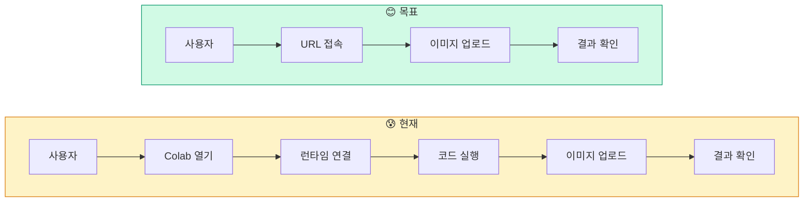
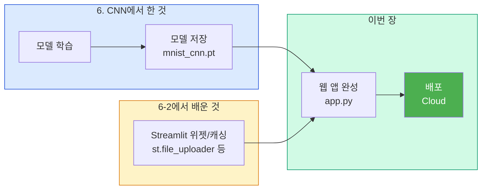

# 6-3. 웹서비스 배포: MNIST 숫자 인식 앱

## 학습 목표

1. 학습된 CNN 모델을 Streamlit 웹 앱으로 감싸서 서비스할 수 있다
2. @st.cache_resource로 모델을 캐싱하는 이유를 설명할 수 있다
3. Streamlit Community Cloud에 앱을 배포할 수 있다

<a id="toc"></a>
## 진행 순서

1. [왜 웹 서비스로 만드는가?](#part1)
2. [프로젝트 구조](#part2)
3. [app.py 코드 해설](#part3)
4. [로컬에서 실행하기](#part4)
5. [직접 수정해보기](#part5)
6. [Streamlit Community Cloud 배포](#part6)
7. [통합 정리](#part7)

> **선수 학습**: 이 수업은 [6. CNN](/deeplearning/cnn)에서 학습한 MNIST 모델과 [6-2. Streamlit 기초](/deeplearning/streamlit-basics)에서 배운 위젯·캐싱 지식을 결합합니다.

---

<a id="part1"></a>
## 1. 왜 웹 서비스로 만드는가? [↑](#toc)

CNN 수업에서 MNIST 모델을 만들고, 직접 이미지를 넣어 예측까지 해봤습니다.

하지만 현재 상태로는 **Colab 노트북이 있는 사람만** 사용할 수 있습니다.



### 모델 → 서비스까지의 흐름



Streamlit 기초에서 배운 요소들이 어떻게 사용되는지 봅시다.

| 6-2에서 배운 것 | 이번 장에서 활용 |
|---------------|---------------|
| `st.title()`, `st.write()` | 앱 제목과 안내 문구 |
| `st.file_uploader()` | 숫자 이미지 업로드 |
| `st.columns()` | 원본/전처리 이미지 나란히 표시 |
| `st.image()` | 업로드한 이미지 표시 |
| `st.success()` | 판독 결과 표시 |
| `st.bar_chart()` | 숫자별 확률 막대 그래프 |
| `@st.cache_resource` | 모델을 한 번만 로드 |

---

<a id="part2"></a>
## 2. 프로젝트 구조 [↑](#toc)

```
streamlit-mnist/
├── app.py              ← Streamlit 앱 코드 (1개 파일로 완결)
├── mnist_cnn.pt        ← CNN 수업에서 학습한 모델 가중치
└── requirements.txt    ← 패키지 목록 (배포 시 필요)
```

- `app.py`: 모델 정의 + 로드 + 전처리 + UI 모두 포함
- `mnist_cnn.pt`: CNN 수업에서 `torch.save()`로 저장한 파일. Google Drive에서 다운로드
- `requirements.txt`: Streamlit Cloud가 패키지를 설치할 때 사용

---

<a id="part3"></a>
## 3. app.py 코드 해설 [↑](#toc)

**학습목표**: 앱 코드의 각 부분이 어떤 역할을 하는지 이해할 수 있다

### 전체 코드

```python
import streamlit as st
import torch
import torch.nn as nn
import torch.nn.functional as F
from PIL import Image
from torchvision import transforms
import torchvision.transforms.functional as TF

# ===== 1. 모델 정의 (학습할 때와 동일한 구조) =====
class CNN(nn.Module):
    def __init__(self):
        super(CNN, self).__init__()
        self.conv1 = nn.Conv2d(1, 32, 3, 1)
        self.conv2 = nn.Conv2d(32, 64, 3, 1)
        self.dropout1 = nn.Dropout2d(0.25)
        self.dropout2 = nn.Dropout2d(0.5)
        self.fc1 = nn.Linear(9216, 128)
        self.fc2 = nn.Linear(128, 10)

    def forward(self, x):
        x = self.conv1(x)
        x = F.relu(x)
        x = self.conv2(x)
        x = F.relu(x)
        x = F.max_pool2d(x, 2)
        x = self.dropout1(x)
        x = torch.flatten(x, 1)
        x = self.fc1(x)
        x = F.relu(x)
        x = self.dropout2(x)
        x = self.fc2(x)
        return F.log_softmax(x, dim=1)

# ===== 2. 모델 로드 (@st.cache_resource로 1회만 실행) =====
@st.cache_resource
def load_model():
    model = CNN()
    model.load_state_dict(torch.load("mnist_cnn.pt", map_location="cpu"))
    model.eval()
    return model

# ===== 3. 이미지 전처리 (MNIST 형식에 맞게 변환) =====
def preprocess_image(image):
    """업로드된 이미지를 MNIST 입력 형식(1, 1, 28, 28)으로 변환"""
    preprocess = transforms.Compose([
        transforms.Grayscale(num_output_channels=1),  # 흑백 변환
        transforms.Resize((28, 28)),                   # 28x28 크기 조정
        transforms.ToTensor(),                         # 텐서 변환 (0~1)
    ])
    image = TF.invert(image)               # 색상 반전 (흰 바탕→검은 바탕)
    return preprocess(image).unsqueeze(0)   # 배치 차원 추가 (1, 1, 28, 28)

# ===== 4. Streamlit UI =====
st.set_page_config(page_title="MNIST 숫자 인식", page_icon="✍️")
st.title("✍️ MNIST 숫자 인식")
st.write("숫자가 적힌 이미지를 업로드하면 AI가 판독합니다.")

model = load_model()

uploaded = st.file_uploader(
    "이미지를 선택하세요",
    type=["png", "jpg", "jpeg"],
    help="0~9 숫자가 적힌 이미지를 업로드하세요"
)

if uploaded is not None:
    image = Image.open(uploaded).convert("RGB")

    col1, col2 = st.columns(2)
    with col1:
        st.subheader("업로드 이미지")
        st.image(image, width=200)

    tensor = preprocess_image(image)
    with col2:
        st.subheader("전처리 결과")
        st.image(tensor.squeeze().numpy(), width=200, caption="28x28 흑백 변환")

    with torch.inference_mode():
        output = model(tensor)
        probabilities = torch.exp(output)   # log_softmax → 확률 변환
        predicted = torch.argmax(output, dim=1).item()
        confidence = probabilities[0][predicted].item()

    st.divider()
    st.success(f"### 판독 결과: **{predicted}**  (확신도: {confidence:.1%})")

    st.subheader("숫자별 확률")
    prob_data = probabilities[0].detach().numpy()
    st.bar_chart({str(i): float(prob_data[i]) for i in range(10)})
else:
    st.info("👆 위 버튼을 클릭하여 숫자 이미지를 업로드하세요.")
    st.markdown("""
    **참고:**
    - 흰 바탕에 검은 숫자로 쓴 이미지가 가장 잘 인식됩니다
    - 손글씨, 인쇄체 모두 가능합니다
    - 이 모델은 MNIST 데이터셋(28x28 흑백)으로 학습되었습니다
    """)
```

### 구간별 해설

#### 구간 1: 모델 정의 (10~33줄)

CNN 수업에서 만든 것과 **완전히 동일한 구조**입니다. 모델 가중치(`mnist_cnn.pt`)는 이 구조에 맞춰 저장되었으므로, 구조가 다르면 로드에 실패합니다.

> **왜 모델 정의를 app.py에 다시 쓰나요?** `torch.save(model.state_dict())`로 저장하면 가중치만 저장되고 구조는 저장되지 않기 때문입니다. 불러올 때 구조(클래스)가 필요합니다.

#### 구간 2: 모델 로드 (35~40줄)

```python
@st.cache_resource   # ← 핵심!
def load_model():
    model = CNN()
    model.load_state_dict(torch.load("mnist_cnn.pt", map_location="cpu"))
    model.eval()
    return model
```

6-2에서 배운 `@st.cache_resource`가 여기서 사용됩니다.

| 캐싱 없을 때 | 캐싱 있을 때 |
|-------------|------------|
| 이미지 업로드할 때마다 모델 다시 로드 | 최초 1회만 로드, 이후 즉시 |
| 매번 ~2초 대기 | 0.001초 미만 |

`map_location="cpu"`는 GPU에서 학습한 모델을 CPU 환경(Streamlit Cloud)에서 실행할 수 있게 합니다.

#### 구간 3: 이미지 전처리 (42~53줄)

CNN 수업의 `preprocess_image()`와 동일한 로직이지만, **파일 경로 대신 PIL Image 객체**를 받습니다.

```python
TF.invert(image)  # 색상 반전: 흰 바탕 검은 글씨 → 검은 바탕 흰 글씨
```

MNIST 데이터셋은 **검은 바탕에 흰 글씨**이므로, 사용자가 올리는 "흰 바탕 검은 글씨" 이미지를 반전시켜야 합니다.

#### 구간 4: Streamlit UI (55~89줄)

| 코드 | 6-2에서 배운 것 | 역할 |
|------|---------------|------|
| `st.set_page_config()` | §1 | 브라우저 탭 제목, 아이콘 |
| `st.file_uploader()` | §3 위젯 5종 | 이미지 업로드 받기 |
| `st.columns(2)` | §4 레이아웃 | 원본/전처리 나란히 |
| `st.image()` | §4 출력 위젯 | 이미지 표시 |
| `st.success()` | §3 위젯 | 판독 결과 강조 |
| `st.bar_chart()` | §4 출력 위젯 | 확률 시각화 |

`if uploaded is not None:` — 파일이 업로드되었을 때만 예측을 실행합니다. Streamlit의 재실행 모델 덕분에 파일을 올리는 순간 스크립트가 재실행되면서 이 조건이 `True`가 됩니다.

---

<a id="part4"></a>
## 4. 로컬에서 실행하기 [↑](#toc)

### 준비물

1. CNN 수업에서 저장한 `mnist_cnn.pt` 파일 (Google Drive에서 다운로드)
2. Python 환경 (pip 사용 가능)

### 설치 및 실행

```bash
# 1. 프로젝트 생성 (가상환경 자동 생성)
uv init streamlit-mnist
cd streamlit-mnist

# 2. 패키지 설치
uv add streamlit torch torchvision Pillow

# 3. app.py 저장 (위의 코드를 복사)
# 4. mnist_cnn.pt를 같은 폴더에 복사

# 5. 실행!
uv run streamlit run app.py
```

브라우저가 자동으로 열리고 `http://localhost:8501`에서 앱이 동작합니다.

### 테스트

1. 종이에 숫자를 쓰고 사진을 찍거나
2. 그림판에서 숫자를 그려 저장하거나
3. 인터넷에서 손글씨 숫자 이미지를 다운로드

→ 앱에 업로드하면 AI가 판독합니다!

---

<a id="part5"></a>
## 5. 직접 수정해보기 [↑](#toc)

app.py를 수정하고 저장하면 Streamlit이 자동으로 감지하여 새로고침합니다.

### 수정 1: 판독 실패 안내 추가

확신도가 낮으면 사용자에게 경고를 표시합니다.

```python
# st.success(...) 줄 다음에 추가:
if confidence < 0.7:
    st.warning("⚠️ 확신도가 낮습니다. 더 선명한 이미지로 다시 시도해 보세요.")
```

### 수정 2: 사이드바로 정보 이동

```python
# st.sidebar에 앱 정보를 배치
st.sidebar.title("ℹ️ 앱 정보")
st.sidebar.write("MNIST CNN 모델 (6. CNN에서 학습)")
st.sidebar.write("입력: 28x28 흑백 이미지")
st.sidebar.write("출력: 0~9 숫자 분류")
```

### 수정 3: 여러 이미지 동시 업로드

`st.file_uploader`에 `accept_multiple_files=True`를 추가하면 여러 파일을 한 번에 업로드할 수 있습니다.

```python
uploaded_files = st.file_uploader(
    "이미지를 선택하세요",
    type=["png", "jpg", "jpeg"],
    accept_multiple_files=True  # ← 추가!
)

for uploaded in uploaded_files:
    # ... 각 파일에 대해 예측 수행
```

> **도전**: 위 수정 사항을 직접 적용해 보세요. Streamlit은 파일 저장 시 자동 새로고침되므로 결과를 바로 확인할 수 있습니다.

---

<a id="part6"></a>
## 6. Streamlit Community Cloud 배포 [↑](#toc)

**학습목표**: 만든 앱을 인터넷에 배포하여 누구나 접속할 수 있게 만들 수 있다

### 6-1. requirements.txt 작성

Streamlit Cloud가 패키지를 설치할 때 이 파일을 참고합니다.

```text
--extra-index-url https://download.pytorch.org/whl/cpu
torch
torchvision
streamlit
Pillow
```

> `--extra-index-url`은 CPU 전용 PyTorch를 설치하여 용량을 줄입니다 (GPU 버전은 ~2GB, CPU 버전은 ~200MB).

### 6-2. GitHub 저장소 준비

```
your-repo/
├── app.py
├── mnist_cnn.pt
└── requirements.txt
```

이 3개 파일을 GitHub 저장소에 push합니다.

```bash
git init
git add app.py mnist_cnn.pt requirements.txt
git commit -m "MNIST Streamlit app"
git remote add origin https://github.com/your-id/mnist-app.git
git push -u origin main
```

### 6-3. Streamlit Cloud 배포

1. [share.streamlit.io](https://share.streamlit.io/) 접속
2. GitHub 계정으로 로그인
3. **"New app"** 클릭
4. 저장소 / 브랜치 / 메인 파일(`app.py`) 선택
5. **"Deploy"** 클릭

약 2~3분 후 `https://[앱이름].streamlit.app` 형태의 **영구 URL**이 생성됩니다.

### 6-4. 배포 후 확인

| 항목 | 내용 |
|------|------|
| 무료 여부 | 완전 무료 (Community Cloud) |
| 자동 배포 | GitHub에 push하면 자동 재배포 |
| 모델 크기 | MNIST CNN ~5MB → 제한(1GB) 내 |
| 슬립 모드 | 며칠간 접속 없으면 슬립 → 재접속 시 ~30초 후 깨어남 |

> **참고**: 배포된 URL을 동료에게 공유해 보세요. "내가 만든 AI"를 누구나 사용할 수 있습니다!

---

<a id="part7"></a>
## 7. 통합 정리 [↑](#toc)

### 이 수업에서 만든 것

```
[CNN 수업]                  [Streamlit 기초]          [이번 시간]
모델 학습 → mnist_cnn.pt  +  위젯/캐싱 지식      →    웹 앱 완성 + 배포
                                                      ↓
                                                  https://my-app.streamlit.app
                                                  누구나 접속 가능!
```

### 복습 질문

**1. `@st.cache_resource`를 사용하지 않으면 어떤 문제가 발생하는가?**

Streamlit은 위젯이 변경될 때마다 스크립트 **전체를 재실행**합니다. `@st.cache_resource`가 없으면 이미지를 업로드할 때마다 `torch.load()`로 모델을 처음부터 다시 로드하게 됩니다. MNIST CNN은 ~5MB로 작지만 그래도 매번 ~1~2초씩 대기가 발생하고, ResNet 같은 큰 모델(~45MB)이면 체감 지연이 상당합니다. `@st.cache_resource`를 붙이면 최초 1회만 로드하고, 이후에는 메모리에 캐싱된 모델 객체를 즉시 반환합니다.

**2. `map_location="cpu"`는 왜 필요한가?**

Colab에서 모델을 학습할 때는 **GPU(cuda)**를 사용합니다. `torch.save()`는 모델이 어떤 디바이스에 있었는지도 함께 저장합니다. 그런데 Streamlit Cloud나 로컬 PC에는 GPU가 없는 경우가 많습니다. `map_location="cpu"`를 지정하면 "저장 당시 GPU에 있던 텐서를 CPU로 옮겨서 로드하라"는 의미이므로, GPU가 없는 환경에서도 에러 없이 모델을 불러올 수 있습니다.

**3. `TF.invert()`로 색상을 반전시키는 이유는 무엇인가?**

MNIST 데이터셋은 **검은 바탕(0)에 흰 글씨(255)** 형식입니다. 하지만 사용자가 업로드하는 이미지는 보통 **흰 종이에 검은 펜**으로 쓴 것입니다. 모델이 학습한 것과 입력의 색상이 반대이므로, `TF.invert()`로 반전시켜야 모델이 올바르게 인식합니다. 반전 없이 입력하면 모델은 "거의 빈 이미지"로 인식하여 엉뚱한 결과를 출력합니다.

**4. requirements.txt에서 `--extra-index-url`의 역할은 무엇인가?**

`--extra-index-url https://download.pytorch.org/whl/cpu`는 pip에게 "PyTorch를 설치할 때 이 URL에서 **CPU 전용 버전**을 찾아라"고 지시합니다. 기본 PyPI에서 설치하면 GPU(CUDA) 지원이 포함된 ~2GB짜리 패키지가 설치되지만, CPU 전용은 ~200MB입니다. Streamlit Cloud는 GPU가 없으므로 CPU 버전이면 충분하고, 설치 시간과 용량도 크게 절약됩니다.

**5. GitHub에 코드를 push하면 Streamlit Cloud에서 무슨 일이 일어나는가?**

Streamlit Cloud는 연결된 GitHub 저장소를 **감시(watch)** 하고 있습니다. push가 감지되면 자동으로 다음 과정이 실행됩니다:
1. 저장소의 최신 코드를 pull
2. `requirements.txt`를 읽어 패키지를 설치 (가상 환경 구축)
3. `app.py`를 `streamlit run`으로 실행
4. 새 버전의 앱이 기존 URL에서 서비스 시작

즉, **GitHub에 push하면 약 2~3분 후 자동으로 재배포**됩니다. 별도의 배포 명령이 필요 없습니다.

### 심화 과제

- app.py에 confidence threshold 슬라이더를 추가해 보기 (예: 70% 미만이면 "불확실")
- 여러 이미지를 동시에 업로드하여 한 번에 판독하는 기능 만들기
- 앱에 "예측 히스토리" 기능 추가하기 (업로드한 이미지와 결과를 리스트로 표시)
- Fashion-MNIST 모델로 바꿔서 옷 종류 분류 앱 만들어 보기

### 참고 자료

- [Streamlit 공식 문서](https://docs.streamlit.io/)
- [Streamlit Community Cloud](https://share.streamlit.io/)
- [Streamlit 배포 가이드](https://docs.streamlit.io/deploy/streamlit-community-cloud)


→ **다음 장**: [7. 전이학습 - Dogs vs Cats 실전 분류](/deeplearning/DogsVsCats)
