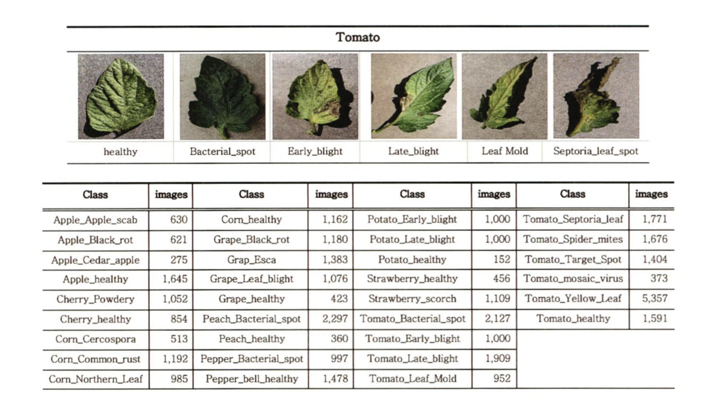
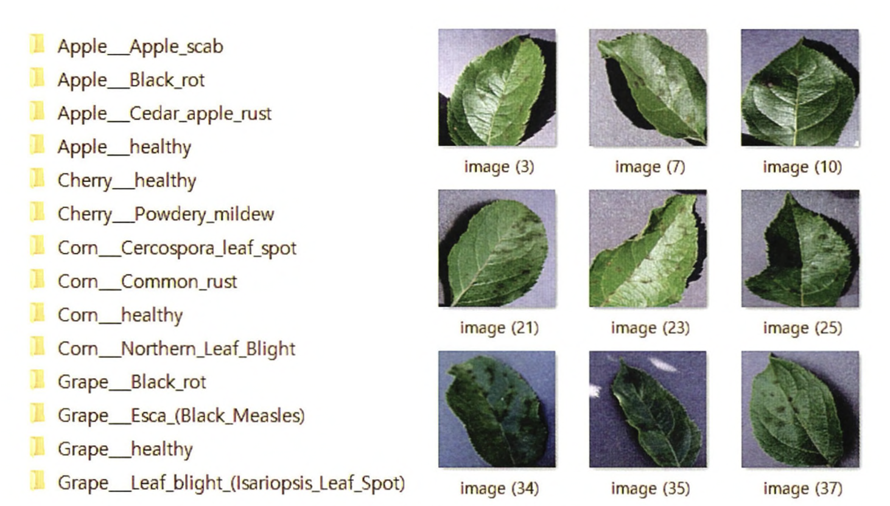
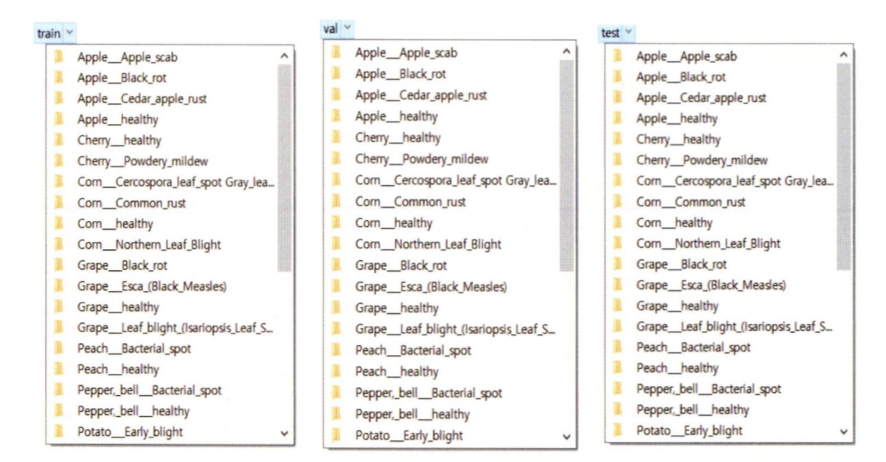
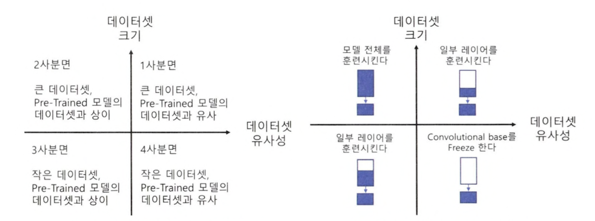

# 8. 전이학습 - 작물 잎 사진으로 질병 분류

## 학습 목표
1. 이미지 분류 데이터셋을 train / val / test로 분리할 수 있다
2. CNN 기본 구조로 베이스라인 모델을 설계하고 학습할 수 있다
3. 사전학습된 모델(ResNet50)을 활용한 전이학습의 원리를 설명할 수 있다
4. Layer Freeze와 Fine-tuning의 역할을 이해할 수 있다
5. 베이스라인 모델과 전이학습 모델의 성능을 비교할 수 있다

<a id="toc"></a>

## 진행 순서

1. [데이터 준비](#part1) - 데이터 다운로드 및 train / val / test 분리
2. [베이스라인 모델 학습](#part2) - CNN 기본 구조로 학습 파이프라인 구성
3. [Transfer Learning 모델 학습](#part3) - ResNet50 Fine-tuning
4. [모델 평가](#part4) - 베이스라인 vs 전이학습 성능 비교
5. [통합 정리](#part5) - 해석 가이드와 확장 과제

### 프로젝트 개요

이미지 분류 모델을 활용하여 작물 잎 사진의 종류와 질병 유무를 분류하는 프로젝트.
프로젝트에서 사용하는 총 데이터의 수는 약 40,000개
각 클래스의 이름은 작물의 종류와 질병 종류를 나타냄.
질병 이름이 'healthy'인 경우는 해당 작물이 건강함을 의미.
예를 들어, Potato의 경우 세 가지 클래스 Potato_Early_ blight, Potato_Late_blight, Potato_healthy
이 중에서 Potato_healthy로 분류된 경우가 질병이 없는 Potato를 의미.

두 가지의 모델을 구축한 후 성능 평가
CNN 기본 구조를 이용한 베이스 라인 모델
미리 학습된 모델을 이용한 전이학습(Transfer Learning)

---

<a id="part1"></a>

## 1. 데이터 준비 [↑](#toc)

**학습목표**: 이미지 분류 데이터셋을 ImageFolder 형식의 train / val / test로 분리할 수 있다.

### 분류 클래스와 각 클래스별 데이터수, 데이터 예시


### 학습 데이터 이해
학습에 사용할 데이터는 각 이미지의 분류 클래스가 폴더로 구분되어 있는 형태로 각 폴더 안에는 Train, Validation, Test 데이터가 구별되지 않은 상태로 저장되어 있음.


### 데이터 분리
Train, Validation, Test 데이터로 나누고 각각의 클래스에 해당하는 폴더에 저장


데이터 파일을 구글 드라이브에서 다운로드 받기 위한 함수 정의
다운로드 받은 파일을 저장할 폴더 생성 및 기존 폴더가 있을 경우 삭제 후 생성

```py
import gdown
import zipfile
import os
import shutil

def download_and_unzip_from_google_drive(file_id, output_dir, output_zip_name="downloaded.zip"):
    # 다운로드할 경로
    zip_file_path = os.path.join(output_dir, output_zip_name)

    # Google Drive 파일 다운로드
    gdown.download(f"https://drive.google.com/uc?id={file_id}", zip_file_path, quiet=False)

    # ZIP 파일 압축 해제
    with zipfile.ZipFile(zip_file_path, 'r') as zip_ref:
        zip_ref.extractall(output_dir)
        print(f"파일이 {output_dir}에 성공적으로 압축 해제되었습니다.")

    # ZIP 파일 삭제 (원한다면)
    os.remove(zip_file_path)
    print(f"ZIP 파일이 삭제되었습니다: {zip_file_path}")

def create_or_replace_directory(directory_path):
    # 디렉토리가 존재하는지 확인
    if os.path.exists(directory_path):
        # 디렉토리가 존재하면 삭제
        shutil.rmtree(directory_path)
        print(f"기존 디렉토리가 삭제되었습니다: {directory_path}")

    # 새로운 디렉토리 생성
    os.makedirs(directory_path)
    print(f"새로운 디렉토리가 생성되었습니다: {directory_path}")

# 사용 예시
file_id = "1uBY-JbXcPd-tikzFJcbwSR9_zEjYHHor"  # Google 드라이브 파일 ID
output_dir = "dataset"  # 압축을 풀 디렉토리 경로
create_or_replace_directory(output_dir)
download_and_unzip_from_google_drive(file_id, output_dir)

```

압축푼 데이터를 각 train, val, test 로 나누기 위한 splitted 폴더를 생성

```py
original_dataset_dir = './dataset'
classes_list = os.listdir(original_dataset_dir)

base_dir = './splitted'
create_or_replace_directory(base_dir)

train_dir = os.path.join(base_dir, 'train')
os.mkdir(train_dir)
validation_dir = os.path.join(base_dir, 'val')
os.mkdir(validation_dir)
test_dir = os.path.join(base_dir, 'test')
os.mkdir(test_dir)

for cls in classes_list:
    os.mkdir(os.path.join(train_dir, cls))
    os.mkdir(os.path.join(validation_dir, cls))
    os.mkdir(os.path.join(test_dir, cls))
```


### 데이터 분할과 클래스별 데이터 수 확인

데이터 분류별로 각각 train:60%, validation:20%, test:20% 로 분리해서 splitted폴더로 복사
```py
import math

for cls in classes_list:
    path = os.path.join(original_dataset_dir, cls)
    fnames = os.listdir(path)

    train_size = math.floor(len(fnames) * 0.6)
    validation_size = math.floor(len(fnames) * 0.2)
    test_size = math.floor(len(fnames) * 0.2)

    train_fnames = fnames[:train_size]
    print("Train size(",cls,"): ", len(train_fnames))
    for fname in train_fnames:
        src = os.path.join(path, fname)
        dst = os.path.join(os.path.join(train_dir, cls), fname)
        shutil.copyfile(src, dst)

    validation_fnames = fnames[train_size:(validation_size + train_size)]
    print("Validation size(",cls,"): ", len(validation_fnames))
    for fname in validation_fnames:
        src = os.path.join(path, fname)
        dst = os.path.join(os.path.join(validation_dir, cls), fname)
        shutil.copyfile(src, dst)

    test_fnames = fnames[(train_size+validation_size):(validation_size + train_size +test_size)]

    print("Test size(",cls,"): ", len(test_fnames))
    for fname in test_fnames:
        src = os.path.join(path, fname)
        dst = os.path.join(os.path.join(test_dir, cls), fname)
        shutil.copyfile(src, dst)
```

**핵심**: 데이터를 클래스별 폴더 구조로 나누면 ImageFolder가 자동으로 라벨을 인식한다. train:60%, val:20%, test:20%로 분리하여 공정한 평가를 보장한다.

---

<a id="part2"></a>

## 2. 베이스라인 모델 학습 [↑](#toc)

**학습목표**: CNN 기본 구조로 베이스라인 모델을 설계하고 학습 파이프라인을 구성할 수 있다.

### 운영체제별 디바이스 확인
각 운영체제별로 cpu, gpu 사용 여부를 체크
```py
def get_device():
    import platform
    # 운영체제 확인
    os_name = platform.system()

    if os_name == "Darwin":  # MacOS
        # MPS (Metal Performance Shaders) 지원 확인
        if torch.backends.mps.is_available():
            print("Using MPS (Metal Performance Shaders) on Mac")
            return torch.device("mps")
        else:
            print("MPS not available, using CPU on Mac")
            return torch.device("cpu")

    elif os_name == "Linux" or os_name == "Windows":
        # CUDA 지원 확인
        if torch.cuda.is_available():
            print(f"Using CUDA on {os_name}")
            return torch.device("cuda")
        else:
            print(f"CUDA not available, using CPU on {os_name}")
            return torch.device("cpu")

    else:
        # 기타 운영체제에서는 기본적으로 CPU 사용
        print(f"Unsupported OS: {os_name}, using CPU by default")
        return torch.device("cpu")

# 장치 자동 선택
# device = get_device()
```

### 베이스라인 모델 학습을 위한 준비

```py
import torch
import os

# USE_CUDA = torch.cuda.is_available()
# DEVICE = torch.device("cuda" if USE_CUDA else "cpu")
DEVICE = torch.device(get_device())
BATCH_SIZE = 256
EPOCH = 30
```

.ipynb_checkpoints 디렉토리의 값 때문에 문제가 생길 경우에만
```py
import shutil
import os
from torchvision import datasets, transforms

# .ipynb_checkpoints 디렉토리 삭제 함수
def remove_ipynb_checkpoints(directory):
    for root, dirs, files in os.walk(directory):
        for dir_name in dirs:
            if dir_name == ".ipynb_checkpoints":
                shutil.rmtree(os.path.join(root, dir_name))
                print(f"Removed: {os.path.join(root, dir_name)}")

# .ipynb_checkpoints 디렉토리 삭제
remove_ipynb_checkpoints('./splitted/train')
remove_ipynb_checkpoints('./splitted/val')

# 전처리 및 데이터 로드
transform_base = transforms.Compose([transforms.Resize((64,64)), transforms.ToTensor()])
train_dataset = datasets.ImageFolder(root='./splitted/train', transform=transform_base)
val_dataset = datasets.ImageFolder(root='./splitted/val', transform=transform_base)
```

```py
from torch.utils.data import DataLoader

train_loader = torch.utils.data.DataLoader(train_dataset, batch_size=BATCH_SIZE, shuffle=True)
val_loader = torch.utils.data.DataLoader(val_dataset, batch_size=BATCH_SIZE, shuffle=True)

images , labels = next(iter(train_loader))

import matplotlib.pyplot as plt
import torchvision.transforms.functional as F

F.to_pil_image(images[0]) # 이미지 확인
len(train_dataset.classes) # 클래스 값 확인
labels[0].item(),train_dataset.classes[labels[0].item()] # 레이블 값의 클래스 명을 확인
plt.imshow(F.to_pil_image(images[0]))
```

### 베이스라인 모델 설계하기

```py
import torch.nn as nn
import torch.nn.functional as F
import torch.optim as optim

class Net(nn.Module):

    def __init__(self):

        super(Net, self).__init__()
        # 이미지채널 3, 필터적용개수 32, 필터사이즈 3, 이미지의 입력은(3,64,64)
        self.conv1 = nn.Conv2d(3, 32, 3, padding=1)
        self.pool = nn.MaxPool2d(2,2)
        self.conv2 = nn.Conv2d(32, 64, 3, padding=1)
        self.conv3 = nn.Conv2d(64, 64, 3, padding=1)

        self.fc1 = nn.Linear(4096, 512)
        self.fc2 = nn.Linear(512, 33)

    def forward(self, x):

        x = self.conv1(x)
        x = F.relu(x)
        x = self.pool(x)
        x = F.dropout(x, p=0.25, training=self.training)

        x = self.conv2(x)
        x = F.relu(x)
        x = self.pool(x)
        x = F.dropout(x, p=0.25, training=self.training)

        x = self.conv3(x)
        x = F.relu(x)
        x = self.pool(x)
        x = F.dropout(x, p=0.25, training=self.training)

        x = x.view(-1, 4096) # 64*8*8
        x = self.fc1(x)
        x = F.relu(x)
        x = F.dropout(x, p=0.5, training=self.training)
        x = self.fc2(x)

        return F.log_softmax(x, dim=1)

model_base = Net().to(DEVICE)
optimizer = optim.Adam(model_base.parameters(), lr=0.001)
```

### 모델 학습을 위한 함수

```py
def train(model, train_loader, optimizer):
    model.train()
    for batch_idx, (data, target) in enumerate(train_loader):
        data, target = data.to(DEVICE), target.to(DEVICE)
        optimizer.zero_grad()
        output = model(data)
        loss = F.cross_entropy(output, target)
        loss.backward()
        optimizer.step()
```

### 모델 평가를 위한 함수

```py
def evaluate(model, test_loader):
    model.eval()
    test_loss = 0
    correct = 0

    with torch.no_grad():
        for data, target in test_loader:
            data, target = data.to(DEVICE), target.to(DEVICE)
            output = model(data)

            test_loss += F.cross_entropy(output,target, reduction='sum').item()


            pred = output.max(1, keepdim=True)[1] # 각 행별로 가장 큰값의 인덱스 값을 리턴
            correct += pred.eq(target.view_as(pred)).sum().item()

    test_loss /= len(test_loader.dataset)
    test_accuracy = 100. * correct / len(test_loader.dataset)
    return test_loss, test_accuracy
```
```py
import torch

# 예: 배치 크기 3, 클래스 수 4
output = torch.tensor([
    [0.2, 0.1, 0.6, 0.1],  # → 클래스 2 (0.6)
    [0.3, 0.4, 0.2, 0.1],  # → 클래스 1 (0.4)
    [0.05, 0.2, 0.3, 0.45] # → 클래스 3 (0.45)
])

pred = output.max(1, keepdim=True)[1]
print(pred)
```

### 모델 학습을 실행하기

```py
import time
import copy

def train_baseline(model ,train_loader, val_loader, optimizer, num_epochs = 30):
    best_acc = 0.0
    best_model_wts = copy.deepcopy(model.state_dict())

    for epoch in range(1, num_epochs + 1):
        since = time.time()
        train(model, train_loader, optimizer)
        train_loss, train_acc = evaluate(model, train_loader)
        val_loss, val_acc = evaluate(model, val_loader)

        if val_acc > best_acc:
            best_acc = val_acc
            best_model_wts = copy.deepcopy(model.state_dict())

        time_elapsed = time.time() - since
        print('-------------- epoch {} ----------------'.format(epoch))
        print('train Loss: {:.4f}, Accuracy: {:.2f}%'.format(train_loss, train_acc))
        print('val Loss: {:.4f}, Accuracy: {:.2f}%'.format(val_loss, val_acc))
        print('Completed in {:.0f}m {:.0f}s'.format(time_elapsed // 60, time_elapsed % 60))
    model.load_state_dict(best_model_wts)
    return model


base = train_baseline(model_base, train_loader, val_loader, optimizer, EPOCH)
```

학습된 모델을 저장한다.
저장 경로를 구글 드라이브로 할 경우 인스턴스가 종료되더라도 구글 드라이브에 남아 있음.
```py
torch.save(base,'baseline.pt')
```

**핵심**: 작은 CNN으로 베이스라인을 만들면, 이후 전이학습과의 성능 차이를 명확히 비교할 수 있다. best validation accuracy 기준으로 모델을 저장한다.

---

<a id="part3"></a>

## 3. Transfer Learning 모델 학습 [↑](#toc)

**학습목표**: 사전학습된 ResNet50을 불러와 Layer Freeze 후 Fine-tuning할 수 있다.

높은 성능의 이미지 분류 모델을 구축하기 위해서는 많은 수의 질 좋은 데이터 셋이 필요.
많은 경우에 양질의 데이터셋을 대량으로 구하기는 어려움.
대량의 데이터셋으로 미리 학습된 모델을 재활용한 후, 일부를 조정하여 다른 주제의 이미지 분류 모델에 사용이 효과적일수 있음.
미리 학습된 모델은 Pre-Trained Model, 이 모델을 조정하는 과정을 Fine-Tuning이라함.
이러한 기법을 통틀어서 전이학습(Transfer Learning)이라고함.



### Transfer Learning을 위한 준비
```py
data_transforms = {
    'train': transforms.Compose([transforms.Resize([64,64]),
        transforms.RandomHorizontalFlip(), transforms.RandomVerticalFlip(),
        transforms.RandomCrop(52), transforms.ToTensor(),
        transforms.Normalize([0.485, 0.456, 0.406], [0.229, 0.224, 0.225]) ]),

    'val': transforms.Compose([transforms.Resize([64,64]),
        transforms.RandomCrop(52), transforms.ToTensor(),
        transforms.Normalize([0.485, 0.456, 0.406], [0.229, 0.224, 0.225]) ])
}
```

```py
data_dir = './splitted'
image_datasets = {x: datasets.ImageFolder(root=os.path.join(data_dir, x), transform=data_transforms[x]) for x in ['train', 'val']}
dataloaders = {x: torch.utils.data.DataLoader(image_datasets[x], batch_size=BATCH_SIZE, shuffle=True) for x in ['train', 'val']}
dataset_sizes = {x: len(image_datasets[x]) for x in ['train', 'val']}

class_names = image_datasets['train'].classes
```

### Pre-Trained Model 불러오기

```py
from torchvision import models

resnet = models.resnet50(pretrained=True)
# print(resnet) 으로 구성 레이어를 확인할 수 있다.
#  (fc): Linear(in_features=2048, out_features=1000, bias=True)
# 마지막 레이어인 분류기 쪽에 출력값을 33으로 조정한다.
num_ftrs = resnet.fc.in_features
resnet.fc = nn.Linear(num_ftrs, 33)

resnet = resnet.to(DEVICE)

criterion = nn.CrossEntropyLoss()
optimizer_ft = optim.Adam(filter(lambda p: p.requires_grad, resnet.parameters()), lr=0.001)

from torch.optim import lr_scheduler

# 7 에폭마다 학습률에 0.1을 곱하여 학습률을 줄여나간다.
exp_lr_scheduler = lr_scheduler.StepLR(optimizer_ft, step_size=7, gamma=0.1)
```

### Pre-Trained Model의 일부 Layer Freeze하기
```py
ct = 0
for child in resnet.children():
    ct += 1
    print(ct)
    print(child)
    print('---------------------------------')
    if ct < 9:
        for param in child.parameters():
            param.requires_grad = False
```

### Transfer Learning 모델 학습과 검증을 위한 함수
```py
def train_resnet(model, criterion, optimizer, scheduler, num_epochs=25):

    best_model_wts = copy.deepcopy(model.state_dict())
    best_acc = 0.0

    for epoch in range(num_epochs):
        print('-------------- epoch {} ----------------'.format(epoch+1))
        since = time.time()
        for phase in ['train', 'val']:
            if phase == 'train':
                model.train()
            else:
                model.eval()

            running_loss = 0.0
            running_corrects = 0


            for inputs, labels in dataloaders[phase]:
                inputs = inputs.to(DEVICE)
                labels = labels.to(DEVICE)

                optimizer.zero_grad()

                with torch.set_grad_enabled(phase == 'train'):
                    outputs = model(inputs)
                    _, preds = torch.max(outputs, 1)
                    loss = criterion(outputs, labels)

                    if phase == 'train':
                        loss.backward()
                        optimizer.step()

                running_loss += loss.item() * inputs.size(0)
                running_corrects += torch.sum(preds == labels.data)
            if phase == 'train':
                scheduler.step()

            epoch_loss = running_loss/dataset_sizes[phase]
            # epoch_acc = running_corrects.double()/dataset_sizes[phase]
            epoch_acc = running_corrects.float() / dataset_sizes[phase]  # .double() 대신 .float()로 수정

            print('{} Loss: {:.4f} Acc: {:.4f}'.format(phase, epoch_loss, epoch_acc))


            if phase == 'val' and epoch_acc > best_acc:
                best_acc = epoch_acc
                best_model_wts = copy.deepcopy(model.state_dict())

        time_elapsed = time.time() - since
        print('Completed in {:.0f}m {:.0f}s'.format(time_elapsed // 60, time_elapsed % 60))
    print('Best val Acc: {:4f}'.format(best_acc))

    model.load_state_dict(best_model_wts)

    return model
```

### 모델 학습을 실행하기
```py
model_resnet50 = train_resnet(resnet, criterion, optimizer_ft, exp_lr_scheduler, num_epochs=EPOCH)
```

학습된 모델 저장
```py
torch.save(model_resnet50, 'resnet50.pt')
```

**핵심**: 사전학습된 ResNet50의 앞쪽 레이어는 freeze하고 마지막 분류기만 교체하여 학습한다. 학습률 스케줄러를 함께 사용하면 안정적인 수렴에 도움이 된다.

---

<a id="part4"></a>

## 4. 모델 평가 [↑](#toc)

**학습목표**: 동일한 테스트 데이터로 베이스라인 모델과 전이학습 모델의 성능을 비교할 수 있다.

### 베이스라인 모델 평가를 위한 전처리하기

```py
transform_base = transforms.Compose([transforms.Resize([64,64]),transforms.ToTensor()])
test_base = datasets.ImageFolder(root='./splitted/test',transform=transform_base)
test_loader_base = torch.utils.data.DataLoader(test_base, batch_size=BATCH_SIZE, shuffle=True)
```
### Transfer Learning 모델 평가를 위한 전처리하기

```py
transform_resNet = transforms.Compose([
        transforms.Resize([64,64]),
        transforms.RandomCrop(52),
        transforms.ToTensor(),
        transforms.Normalize([0.485, 0.456, 0.406], [0.229, 0.224, 0.225])
    ])

test_resNet = datasets.ImageFolder(root='./splitted/test', transform=transform_resNet)
test_loader_resNet = torch.utils.data.DataLoader(test_resNet, batch_size=BATCH_SIZE, shuffle=True)
```

### 베이스라인 모델 성능 평가하기
```py
baseline=torch.load('baseline.pt', weights_only=False)
baseline.eval()
test_loss, test_accuracy = evaluate(baseline, test_loader_base)

print('baseline test acc:  ', test_accuracy)
```

### Transfer Learning 모델 성능 평가하기

```py
resnet50=torch.load('resnet50.pt', weights_only=False)
resnet50.eval()
test_loss, test_accuracy = evaluate(resnet50, test_loader_resNet)

print('ResNet test acc:  ', test_accuracy)
```

**핵심**: 동일한 테스트 데이터로 두 모델을 비교하면, 전이학습의 효과를 정량적으로 확인할 수 있다. 전이학습 모델은 사전학습된 특징 표현 덕분에 베이스라인보다 높은 정확도를 보인다.

---

<a id="part5"></a>

## 5. 통합 정리 [↑](#toc)

아래 질문에 답해 보세요.

1. 베이스라인 CNN과 전이학습 모델의 test accuracy 차이는 얼마나 되었나요?
2. ResNet50의 앞쪽 레이어를 freeze한 이유는 무엇인가요?
3. 전이학습에서 증강(RandomHorizontalFlip, RandomVerticalFlip, RandomCrop)을 적용한 이유는 무엇인가요?
4. 베이스라인 모델에서는 증강을 사용하지 않았는데, 증강을 추가하면 어떤 변화가 있을까요?
5. 작물 질병 분류처럼 도메인이 특수한 경우, ImageNet 사전학습 모델이 효과적인 이유는 무엇인가요?
6. Layer Freeze 범위를 바꾸면 (예: layer 7까지만 freeze) 성능에 어떤 영향이 있을까요?

#### 선택 확장 과제

- 베이스라인 모델에도 증강을 적용해서 성능 변화 확인해 보기
- ResNet50 대신 ResNet18이나 EfficientNet으로 바꿔 보기
- Freeze 범위를 조정하여 성능 차이 비교해 보기
- 클래스별 정확도(classification report)를 출력하여 어떤 질병이 분류하기 어려운지 확인해 보기

#### 참고

- PyTorch Transfer Learning Tutorial
- Torchvision ImageFolder
- Torchvision models (ResNet50)


→ **다음 장**: [9. 객체 탐지와 YOLO26](/deeplearning/yolo26-guide)
