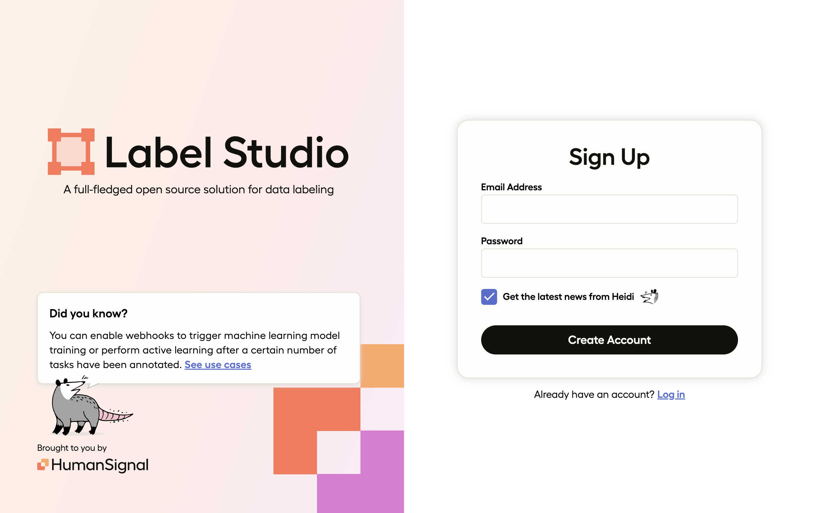
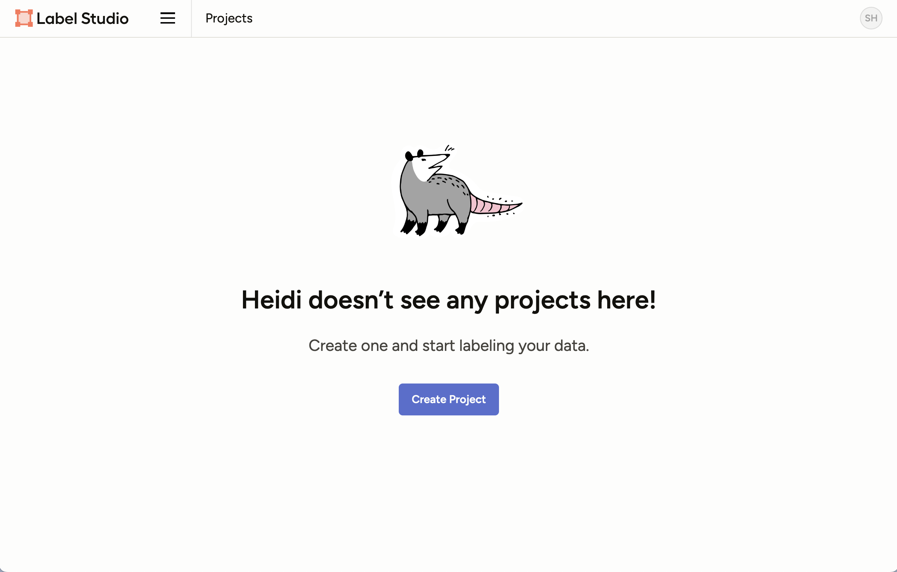
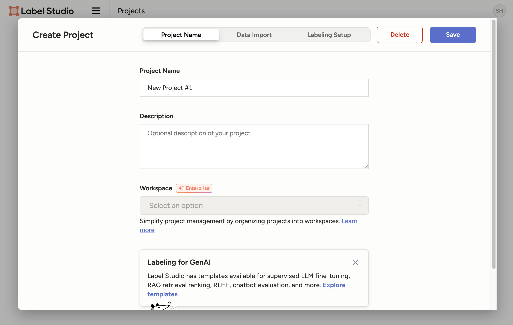
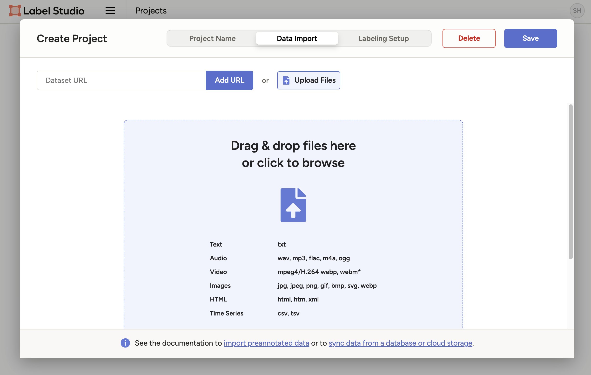
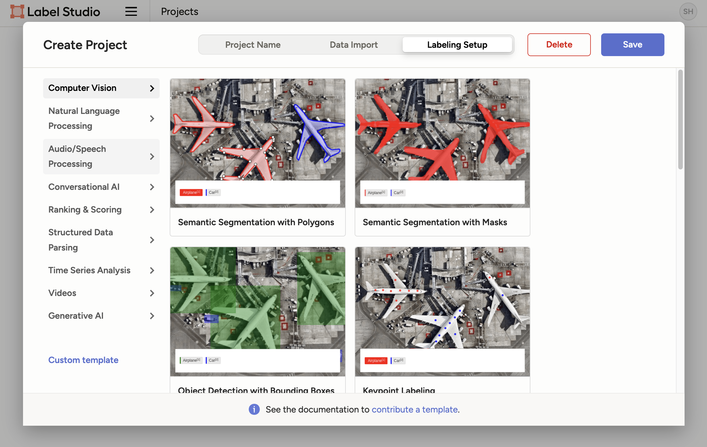
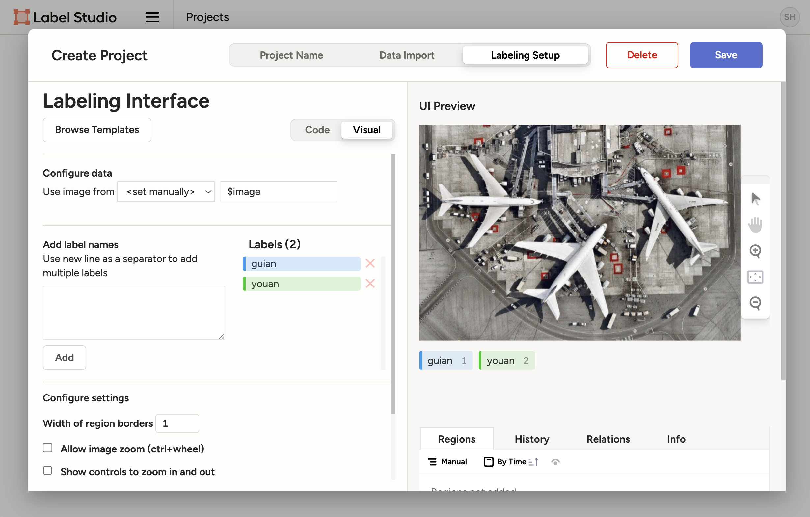

# Label Studio
## 1. 설치
```bash
pip install label-studio
```

## 2. 실행
```bash
label-studio start
```

## 3. 사용하기
### 계정생성 및 로그인


### 프로젝트 생성


### 프로젝트 이름 입력


### 데이터 import


### labeling 종류 선택


### label 설정 후 저장


