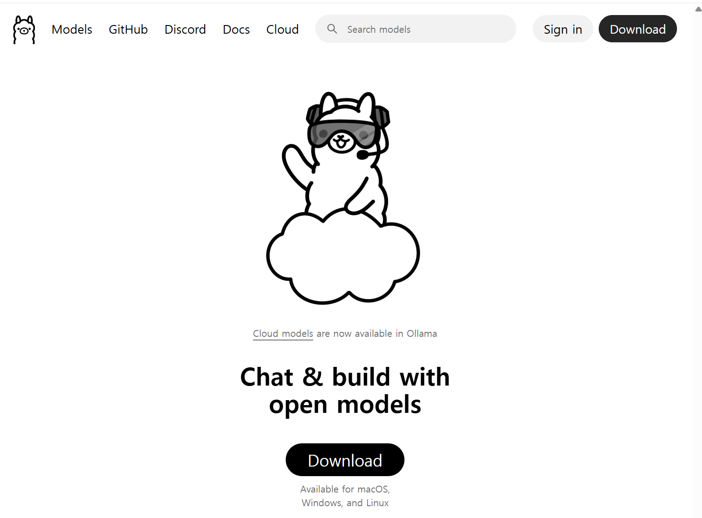
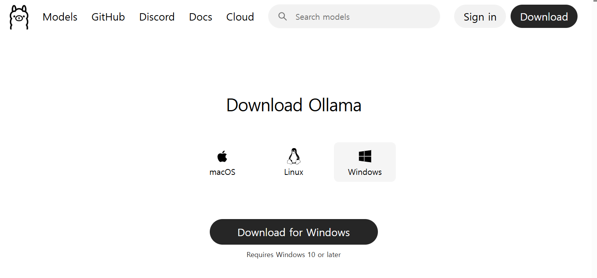
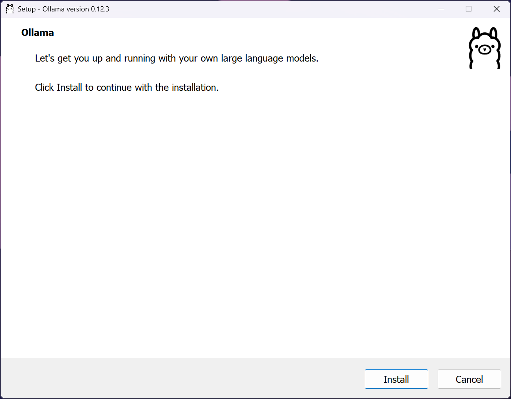
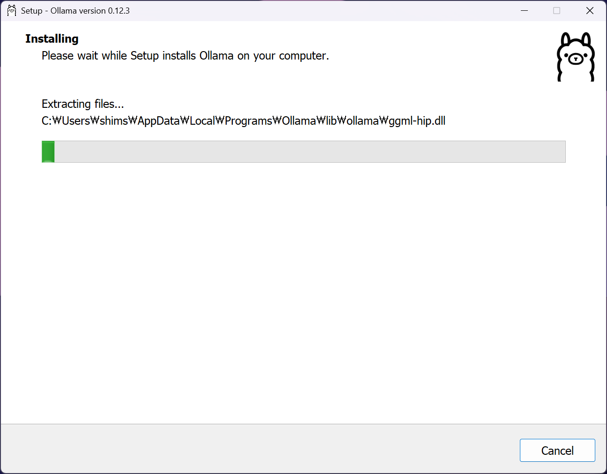
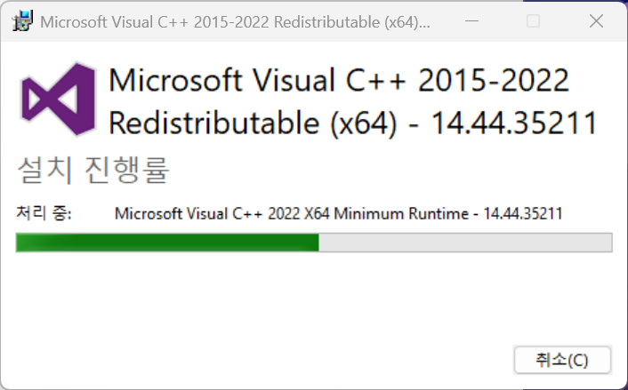
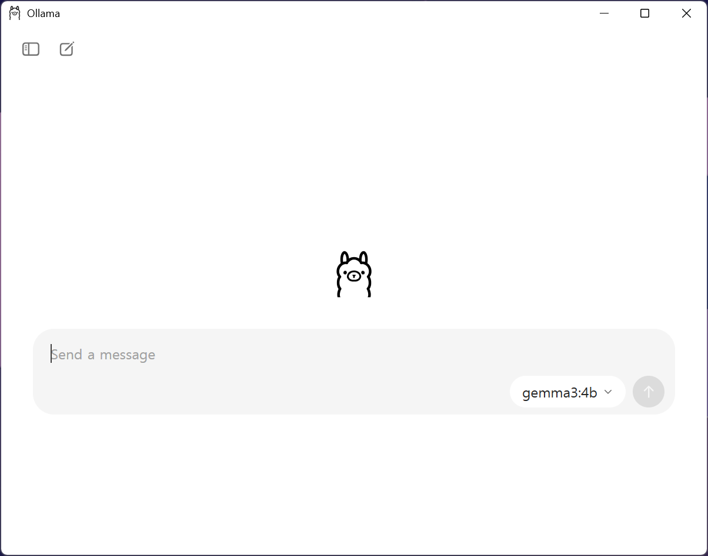
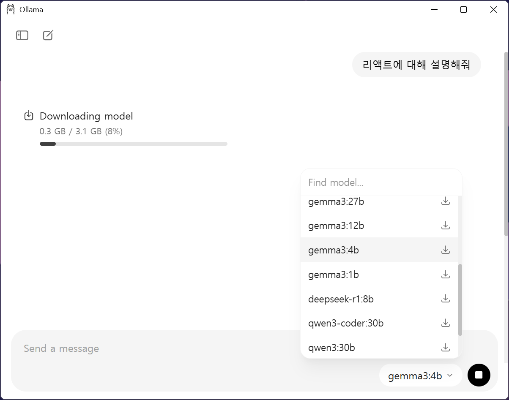
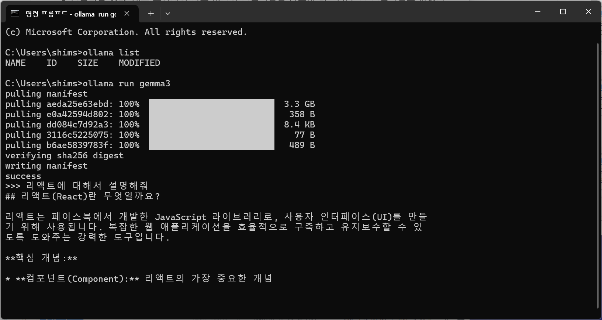

---
title: Ollama
layout: default
grand_parent: LLM
parent: model
nav_order: 1
permalink: /llm/model/ollama
--- 
# Ollama

## Ollama 설치
[Ollama](https://ollama.com/)

### 1. 다운로드 클릭


### 2. 운영체제에 맞춰 다운로드


### 3. 설치


{: width="400" height="auto" }


### 4. 모델 설치



터미널에서 명령어로 설치
```bash
ollama list
ollama run gemma3
```



### 5. ollama 실행
```bash
ollama serve
```
웹브라우저에서 127.0.0.1:11434 접속해서  Ollama is running 나오면 실행중임.

이미 실행중일 경우 아래의 오류 메시지
```bash
Error: listen tcp 127.0.0.1:11434: bind: address already in use 
```


