---
title: LM Studio
layout: default
grand_parent: LLM
parent: model
nav_order: 2
permalink: /llm/model/lmstudio
--- 

## LM Studio 설치
[LM Studio](https://lmstudio.ai/)

### 1. 다운로드 클릭
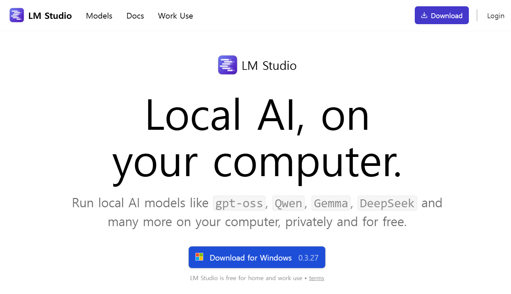

### 2. 기본값 선택하고 다음 버튼 클릭

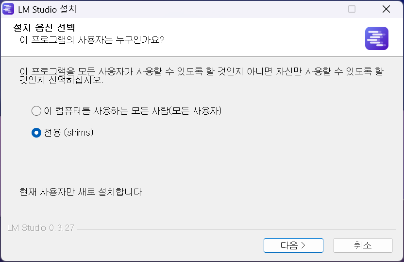

### 3. 설치 버튼 클릭

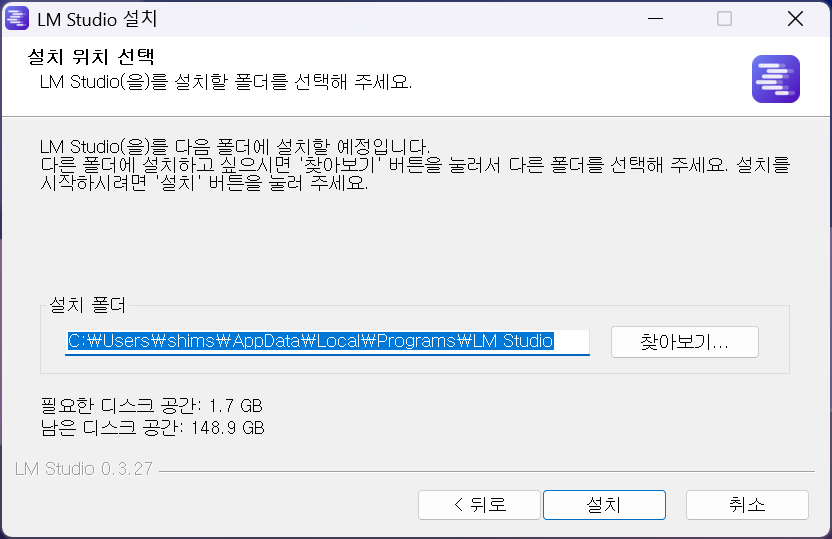

### 4. 마침 버튼 클릭

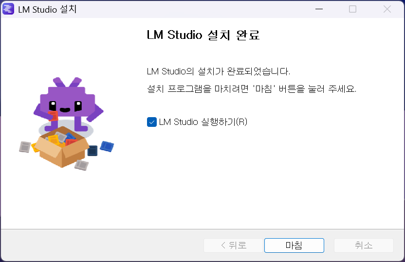

### 5. 오른쪽 상단 Skip 버튼 클릭

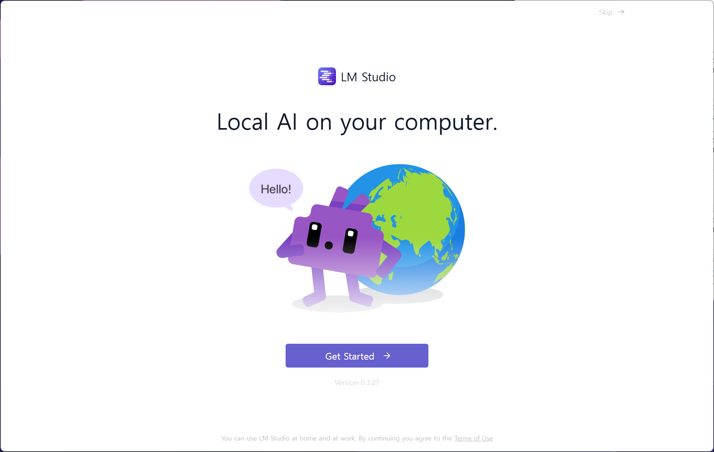

### 6. Continue 버튼 클릭

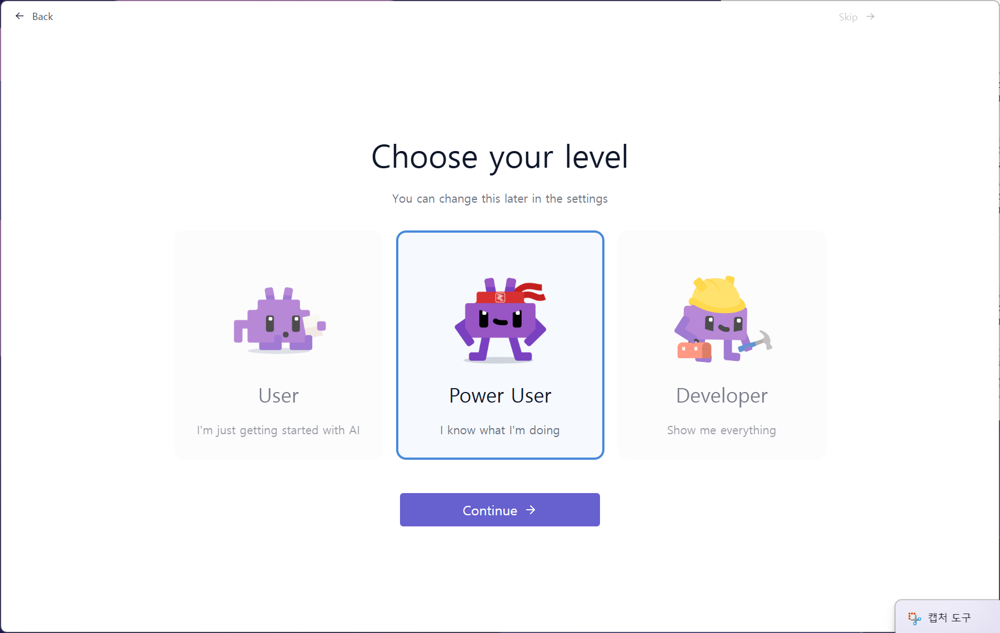

### 7. Skip 버튼 클릭

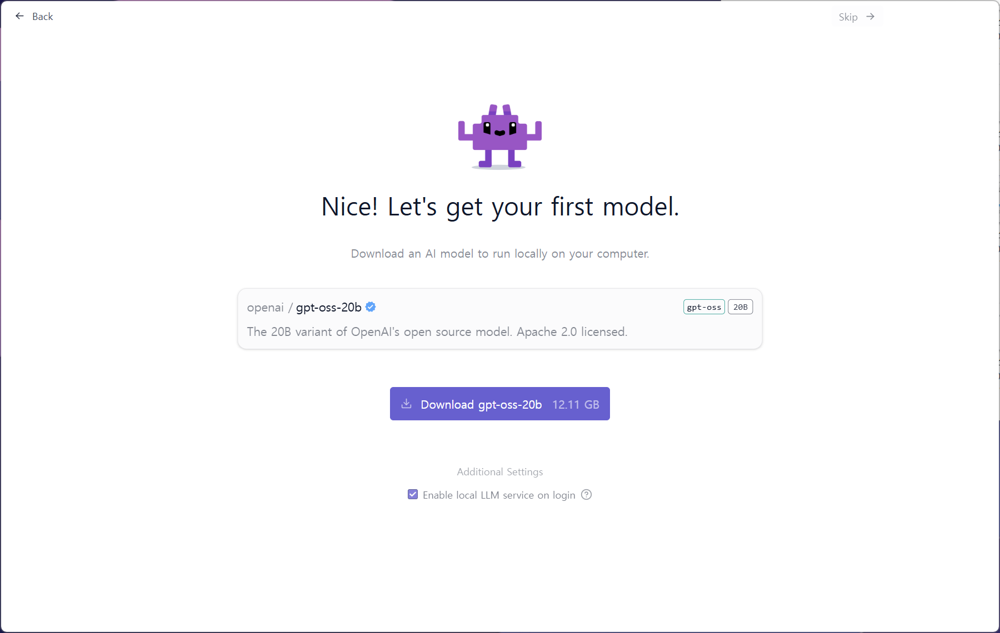

### 8. 사용할 모델 다운로드 (gemma-3-1b)

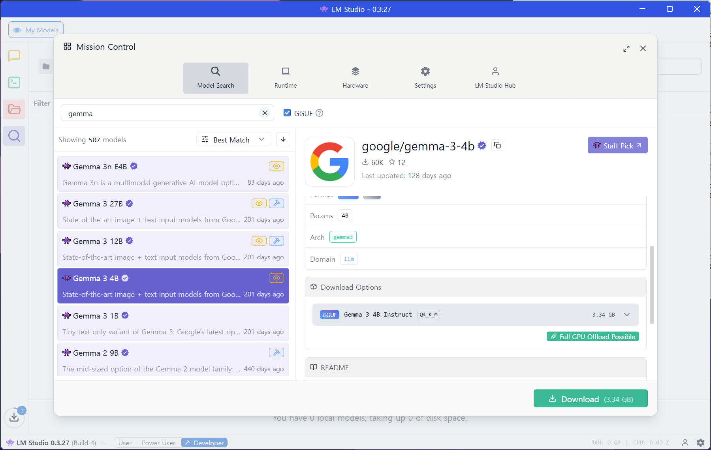

### 9. 모델 로드

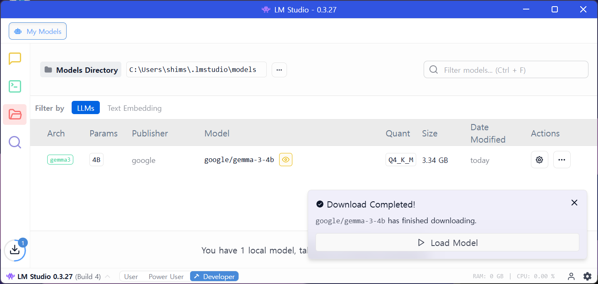

### 10. 테스트
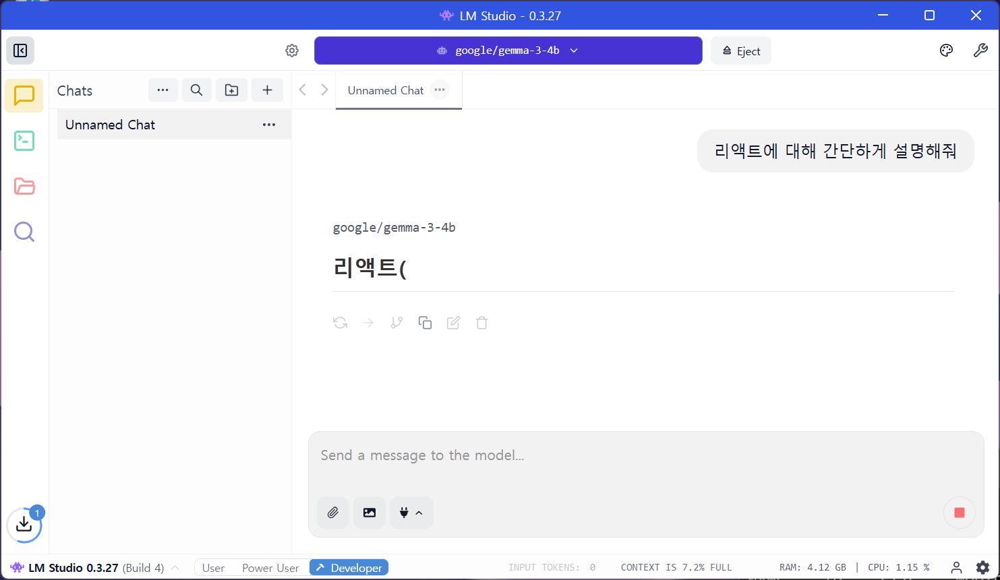
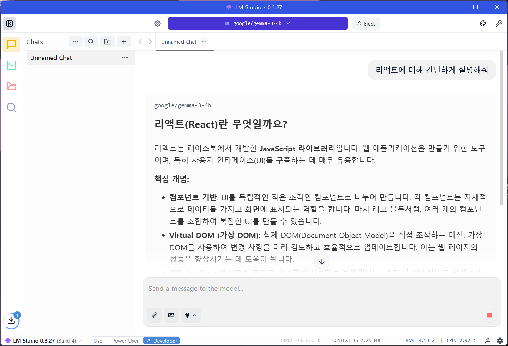

