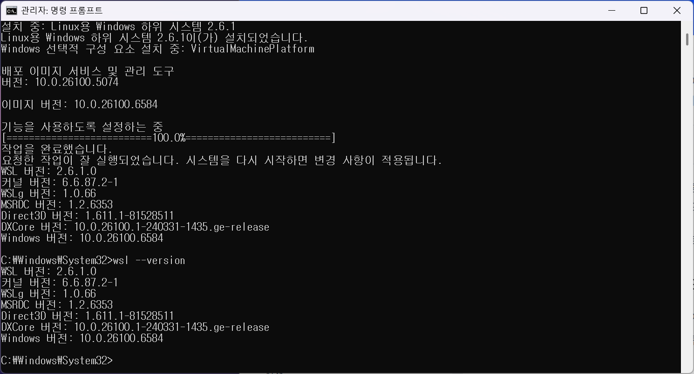
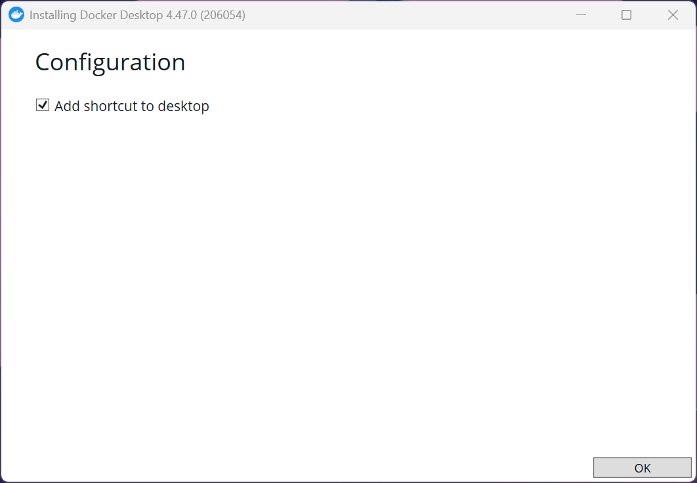
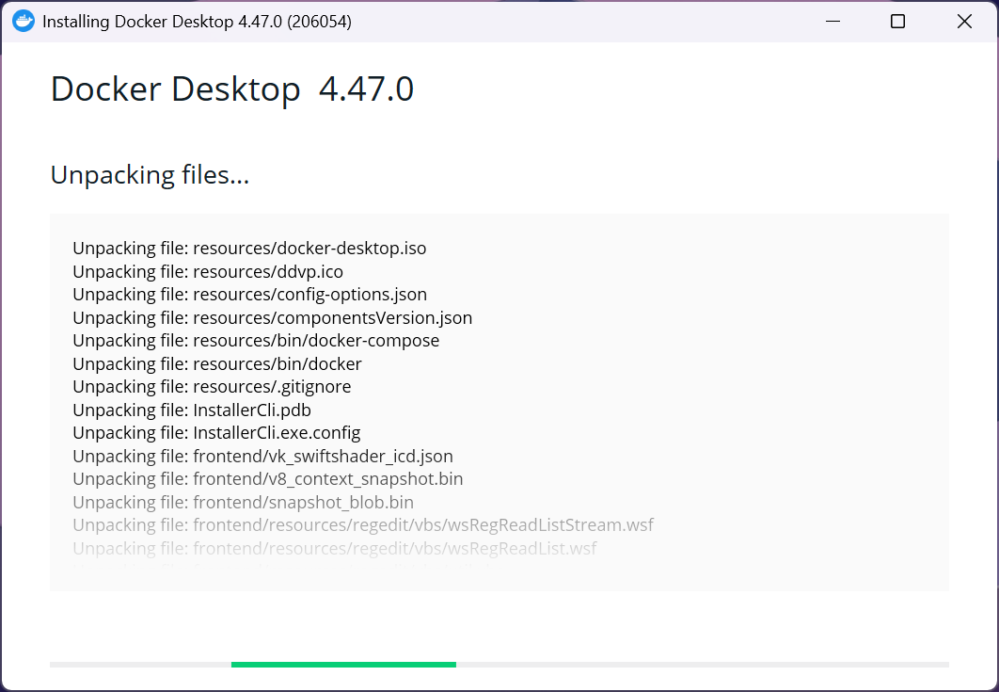
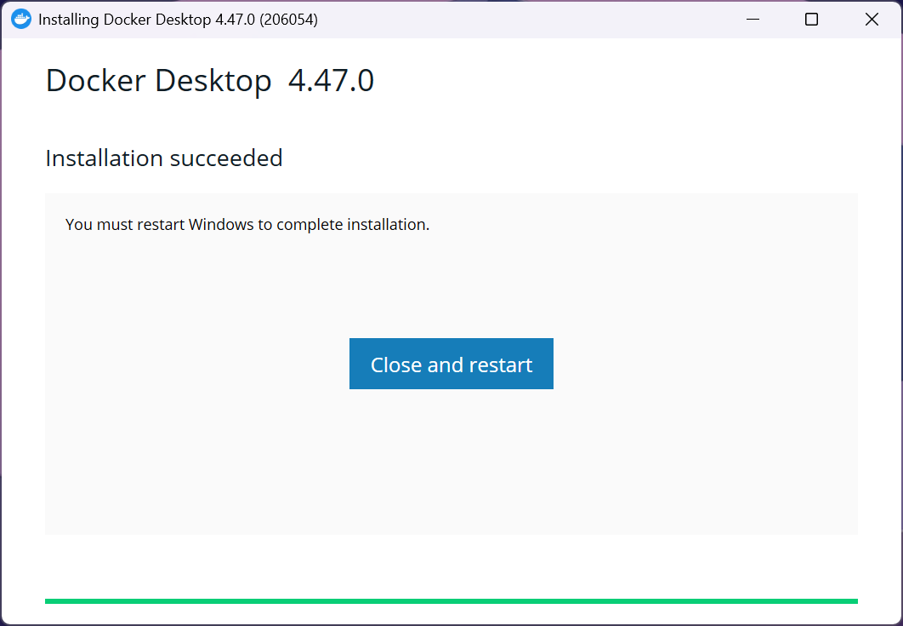
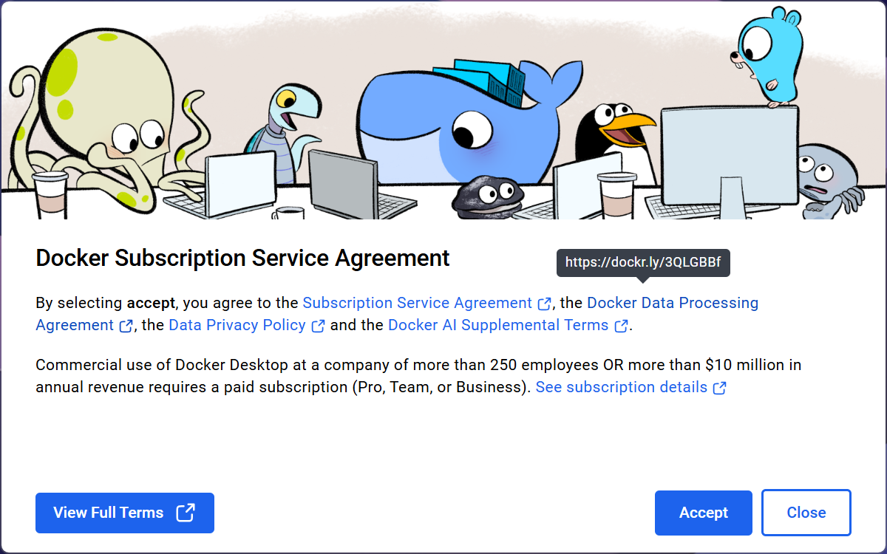
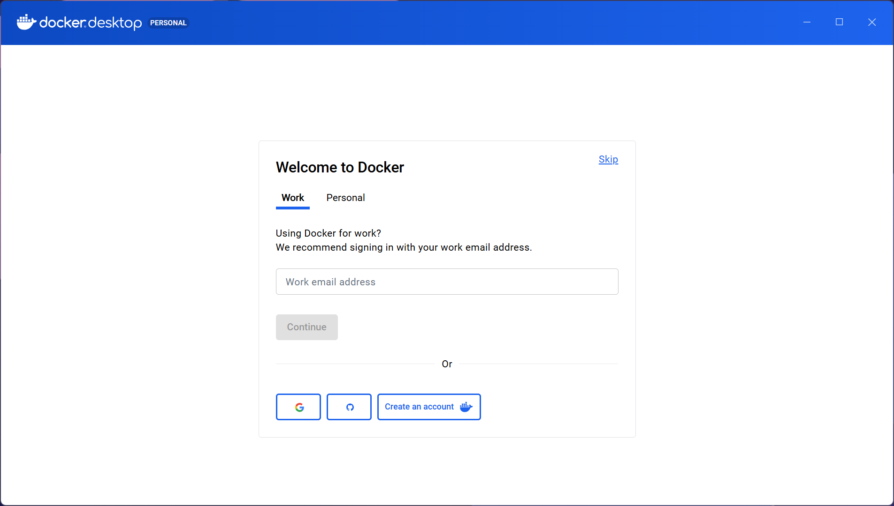
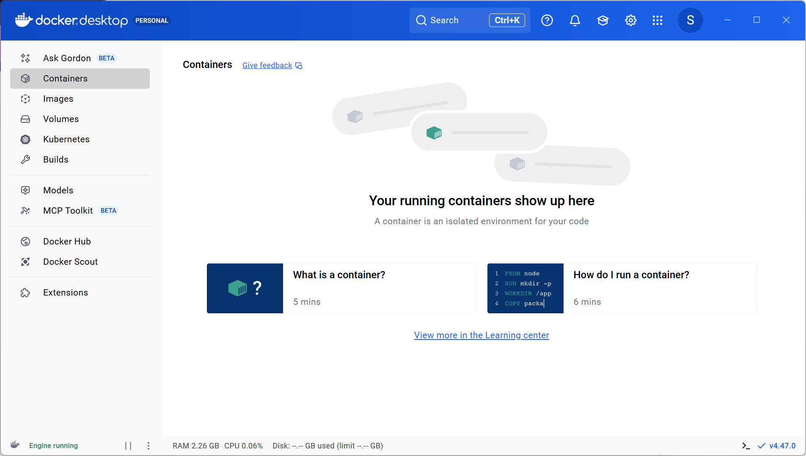
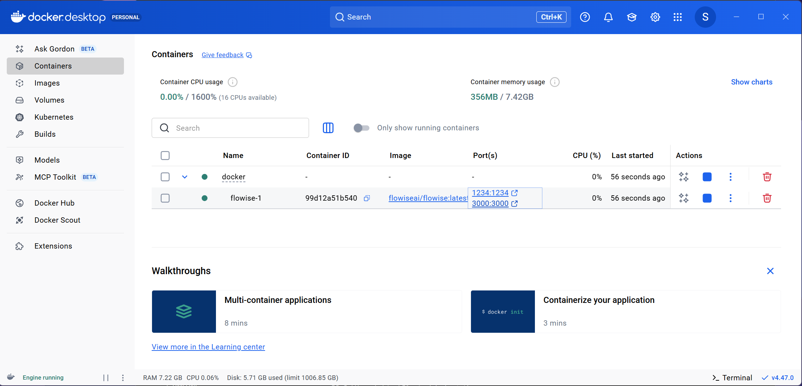
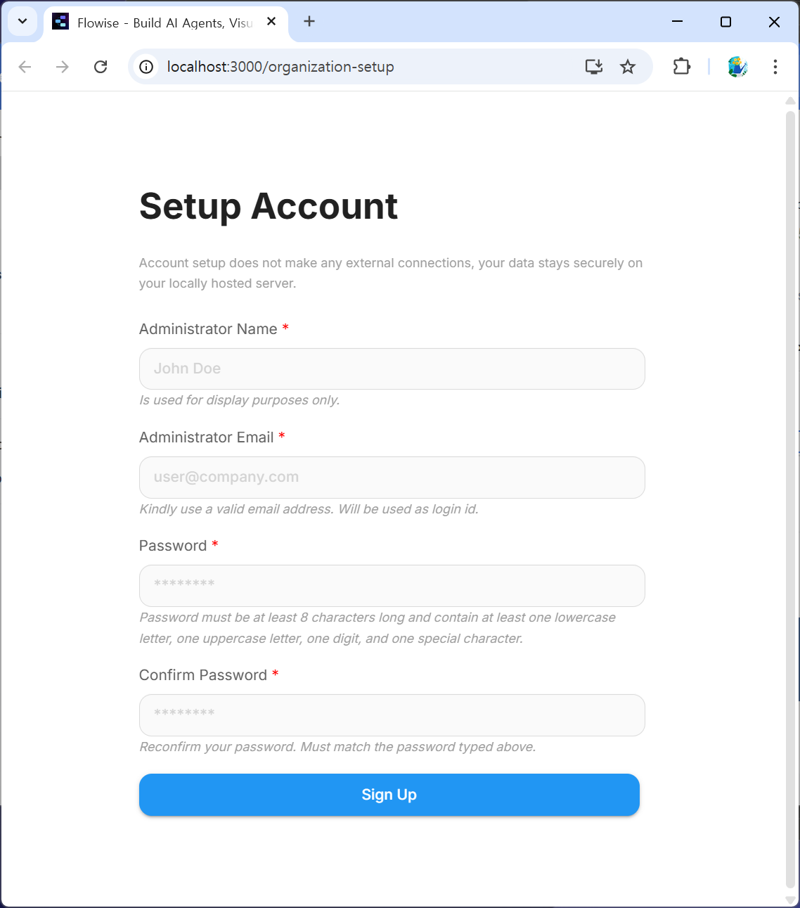
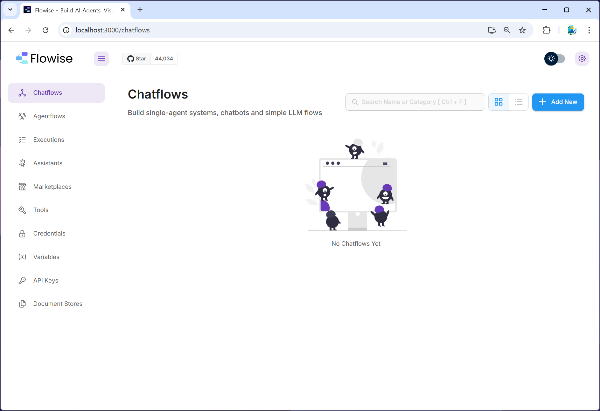

---
title: 1. Flowise 설치
layout: default
grand_parent: LLM
parent: Flowise
nav_order: 1
permalink: /llm/flowise/flowise_install
--- 

## FlowiseAI

### 1. Docker Desktop 설치

[Docker Desktop](https://docs.docker.com/desktop/)

**wsl 설치확인(관리자권한으로 cmd 실행)**


**docker 설치 및 재부팅**




**docker 실행 및 accept**


**계정생성 및 로그인**



### 3. FlowiseAI 설치

[FlowiseAI](https://flowiseai.com/)  
[github](https://github.com/FlowiseAI/Flowise)

#### 1) github clone

```bash
git clone https://github.com/FlowiseAI/Flowise.git
```

#### 2) docker 폴더로 이동

#### 3) .env.example 파일을 .env 로 복사

.env 파일에서 port의 기본내용은 3000, 다른 port 번호로 수정해야 할 경우 내용 수정  
CORS_ORIGINS, IFRAME_ORIGINS 주석 해제  

```bash
PORT=3000

CORS_ORIGINS=*
IFRAME_ORIGINS=*
```

#### 4) docker-compose.yml 수정

```yml
# ports 항목에 11434(ollama),1234(lmstudio) 포트 포워딩 추가
        ports:
            - '${PORT}:${PORT}'
            - 11434:11434
            - 1234:1234
```

#### 5) docker compose로 빌드 및 실행

서비스 시작

```bash
docker-compose up -d
```

서비스 종료

```bash
docker-compose stop
```

#### 6) localhost:3000 으로 접속


#### 7) 계정생성



#### 8) 버전 업데이트

서비스 종료

```bash
docker-compose stop
```

docker-compose.yml 안의 이미지 버전 수정:

```yaml
image: flowiseai/flowise:3.0.8
```

업데이트 적용

```bash
docker-compose pull
docker-compose up -d
```