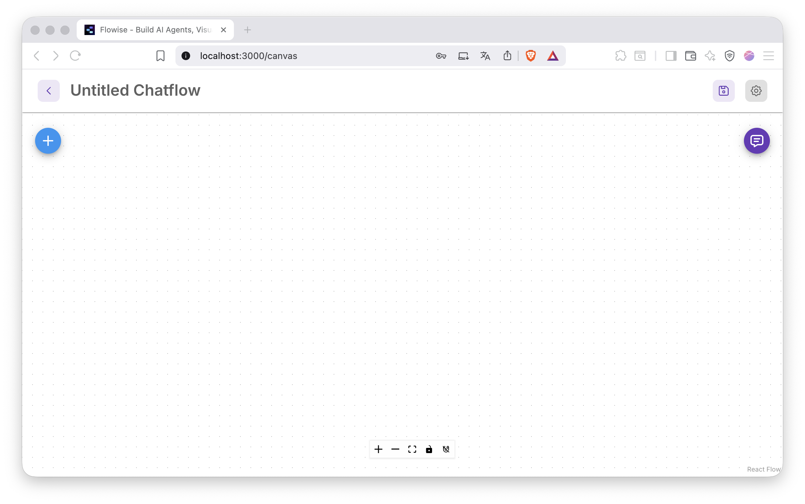
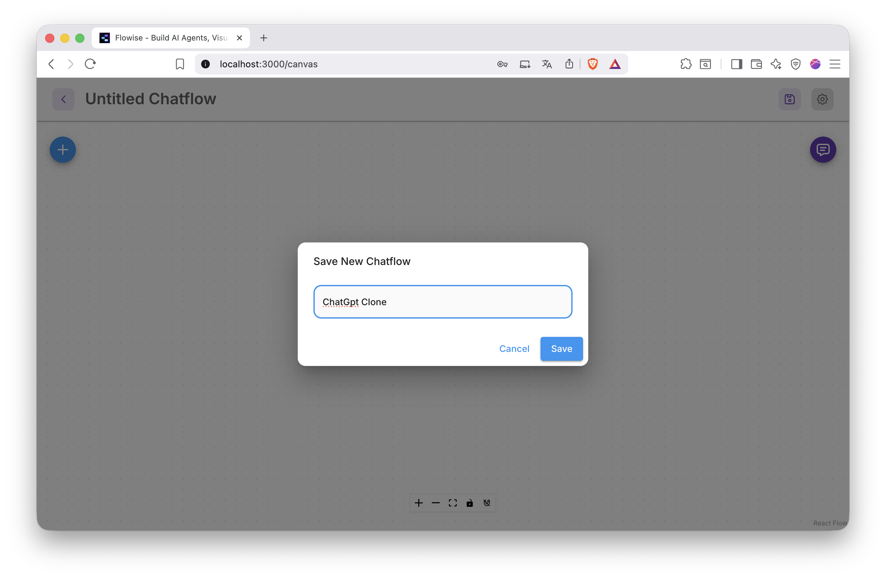
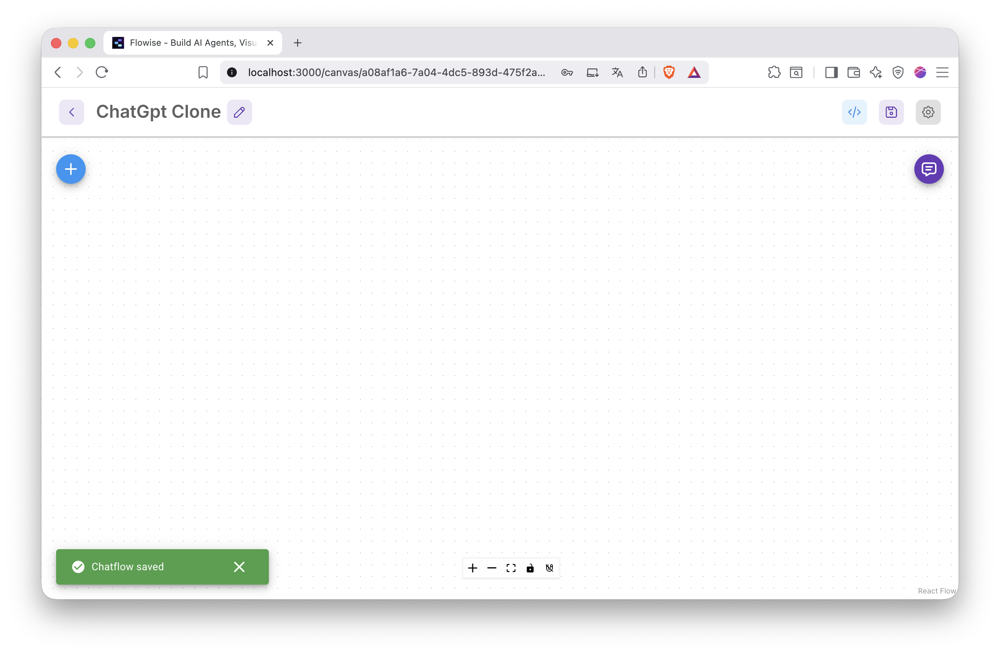
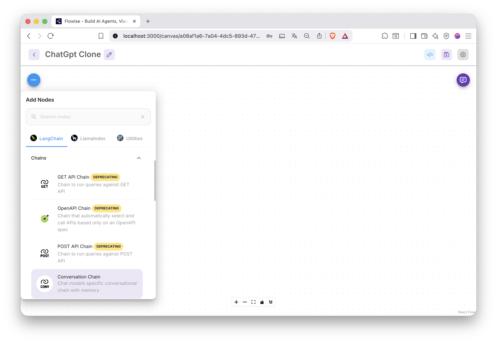
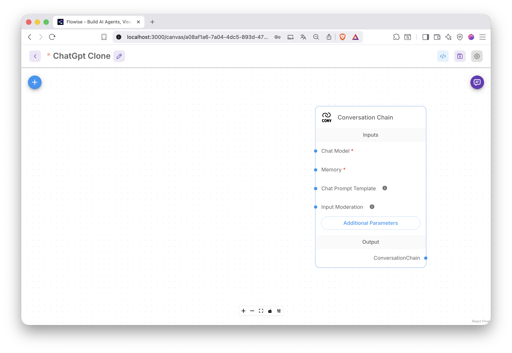
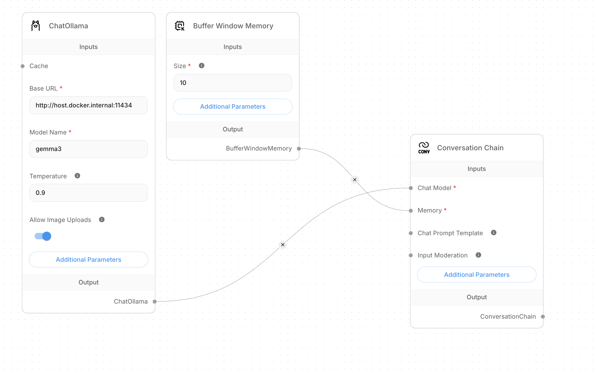
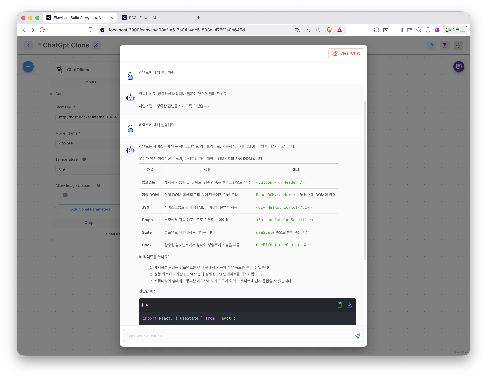

---
title: 2. Flowise ex1
layout: default
grand_parent: LLM
parent: Flowise
nav_order: 2
permalink: /llm/flowise/flowise_ex1
--- 

## FlowiseAI

### 2. FlowiseAI 사용하기

#### 1) chatflows 추가

#### 2) 저장 버튼 클릭

#### 3) 이름 입력후 저장

#### 4) + 버튼 클릭후 

#### 5) 해당 노드를 찾아서

#### 6) 끌어서 추가

#### 7) 각 노드 별로 설정후 저장

#### 8) 오른쪽 상단 말풍선 아이콘 클릭하고 동작여부 확인

