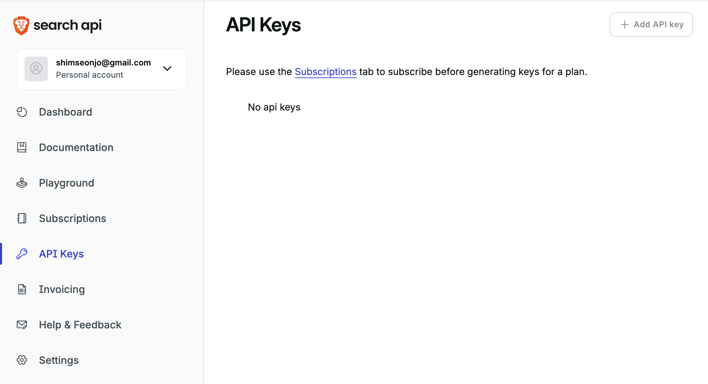
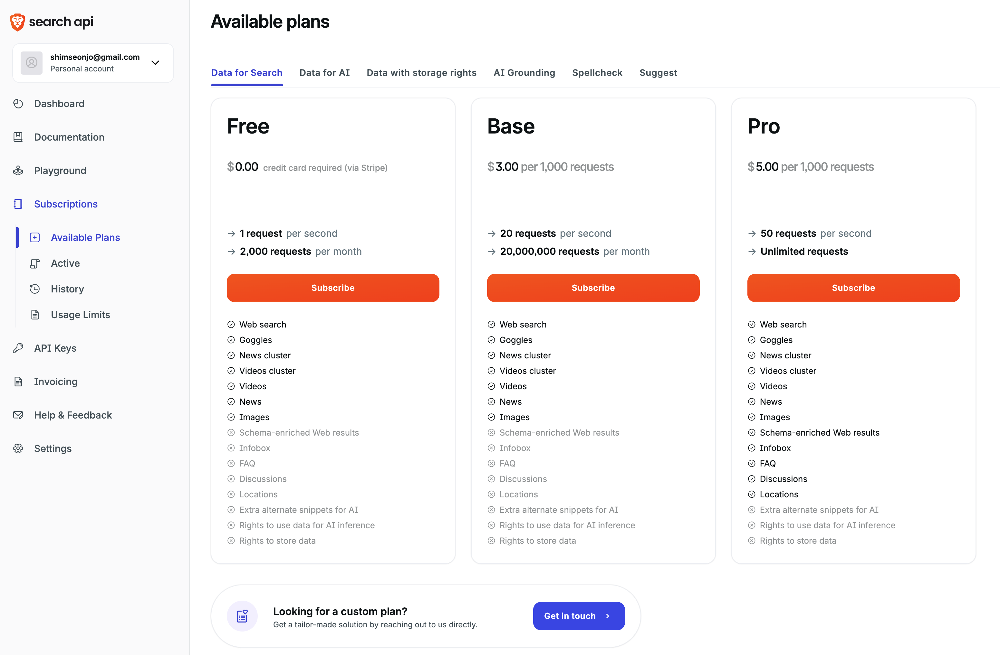
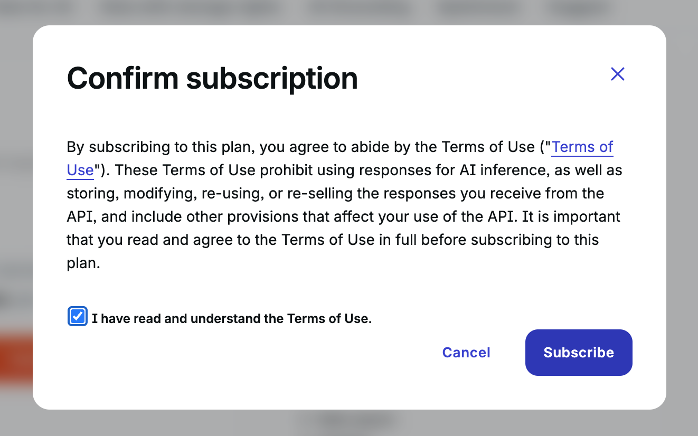
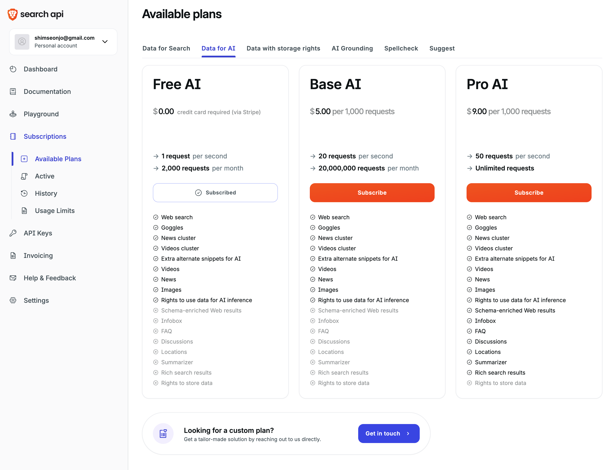
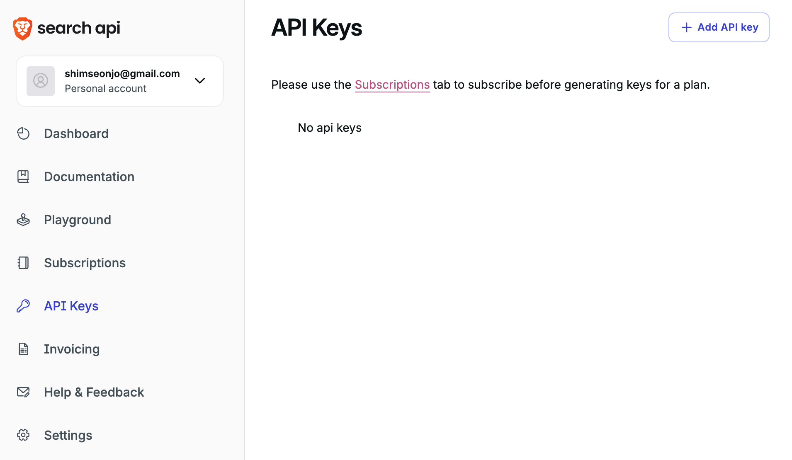
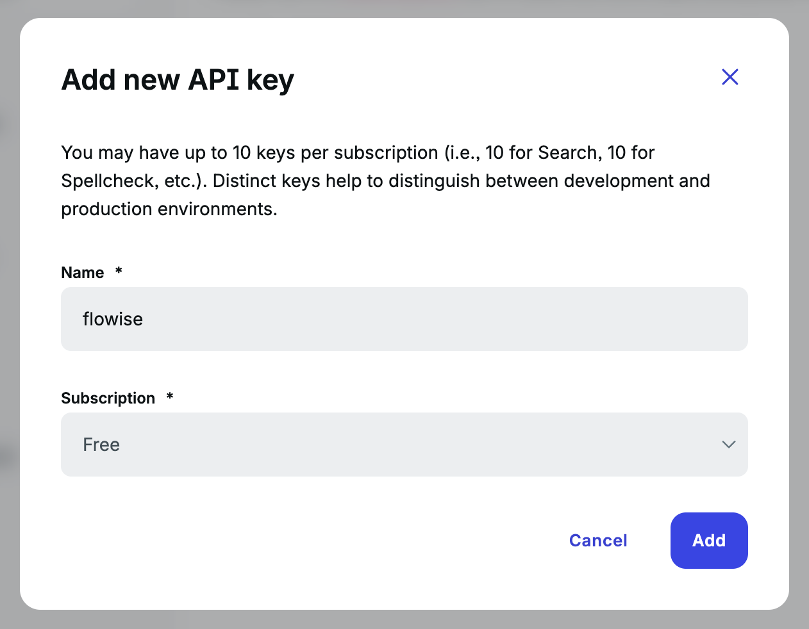
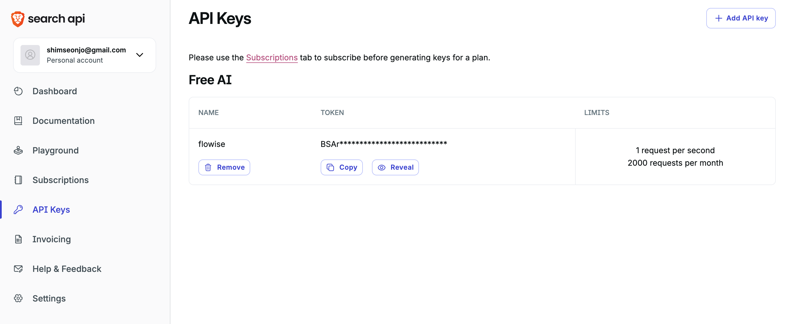
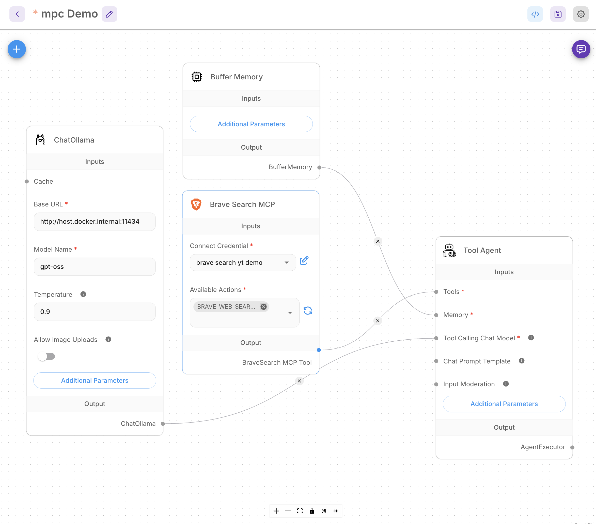
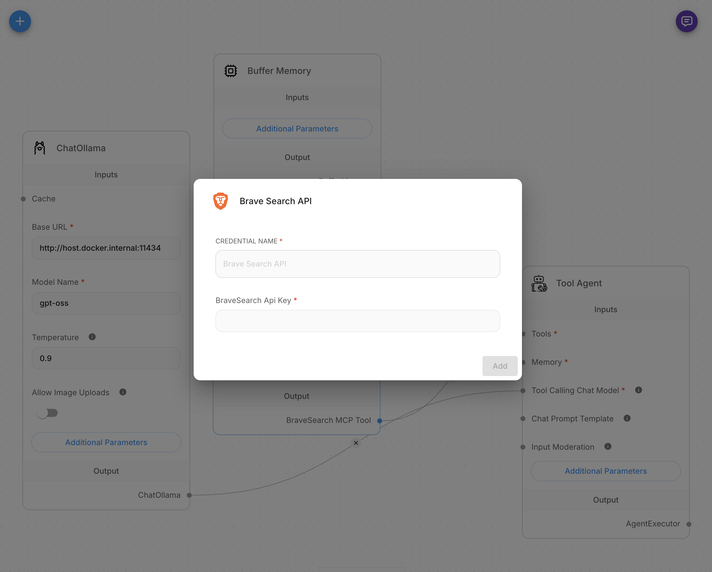
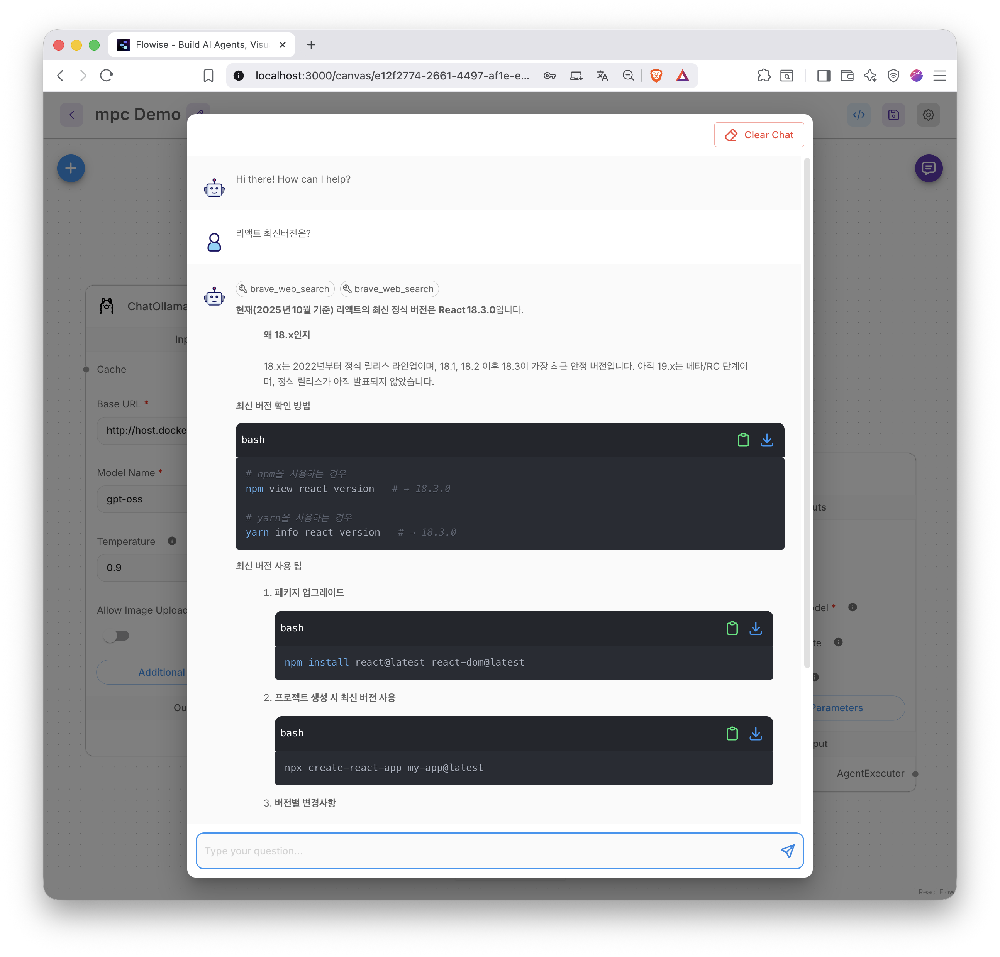

---
title: 3. Flowise ex2
layout: default
grand_parent: LLM
parent: Flowise
nav_order: 3
permalink: /llm/flowise/flowise_ex2
--- 

## FlowiseAI

### 2. FlowiseAI 사용하기

#### 1) chatflows 추가, 이름 'mcp Demo' 입력후 저장

#### 2) Brave에서 search api 발급을 위한 회원가입후 API Keys로 이동, **Subscriptions**클릭 

#### 3) Data for Search, Data for AI의 **Free**의 **Subscibe** 클릭

#### 4) 체크박스 체크후 **Subscibe** 클릭

#### 5) 

#### 6) **+ Add API key** 활성화 되면, 버튼 클릭

#### 7) 키를 생성
{: width="400" height="auto" }

#### 8) flowise chatflows에서 필요한 노드 추가, Brave Search MCP노드의 Connect Credential항목에서 -Create New- 클릭

#### 9) 새로운 키를 등록하고

#### 10) 

