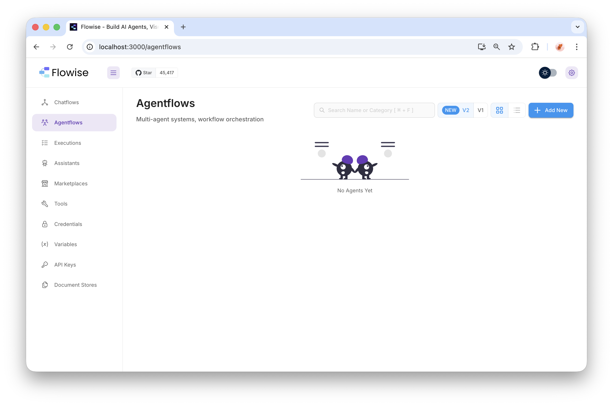
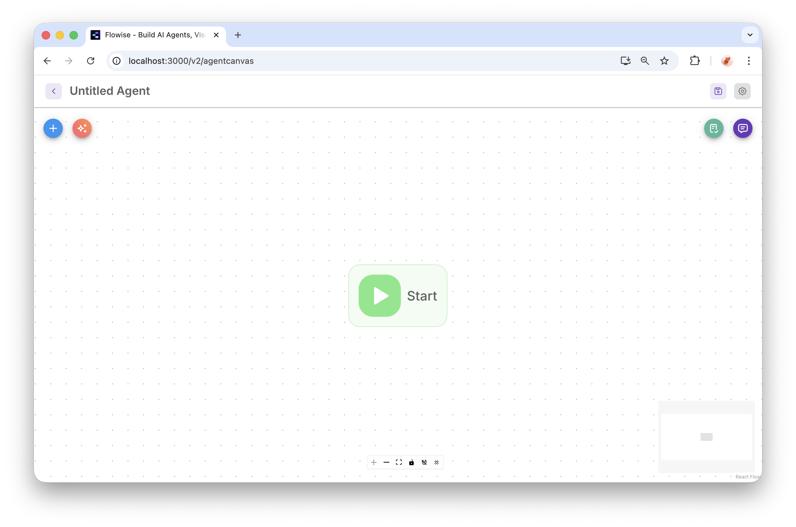
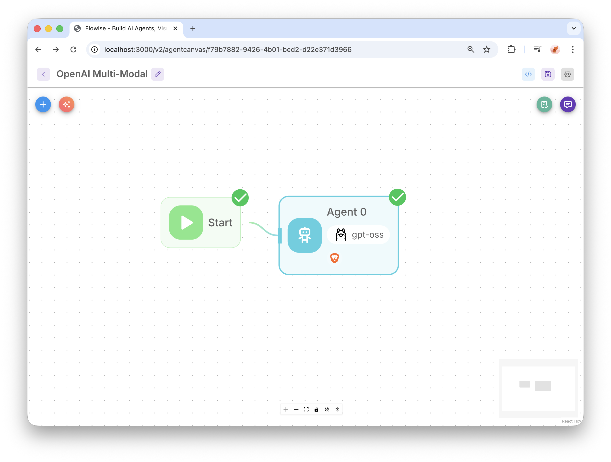
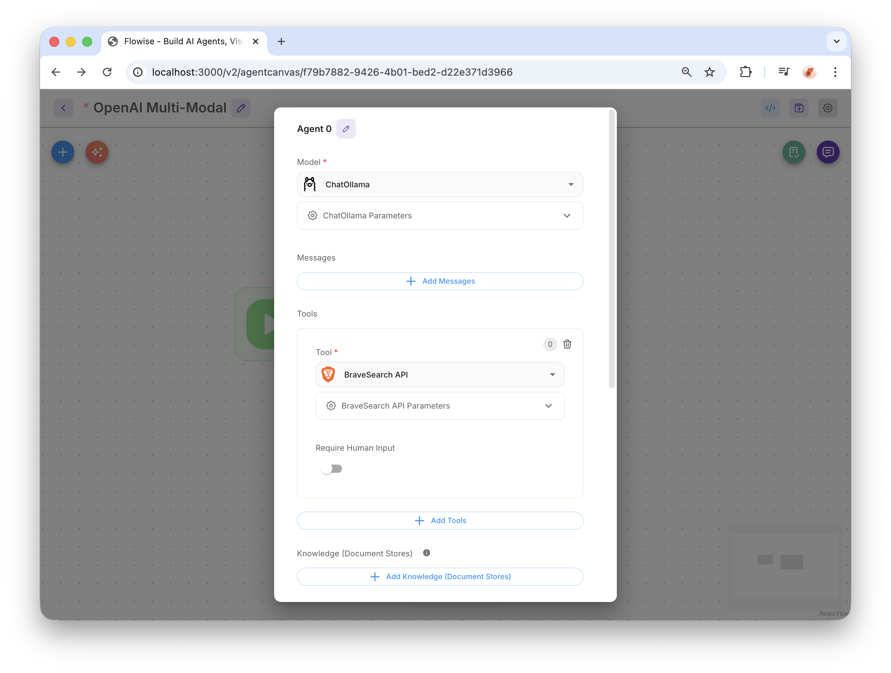
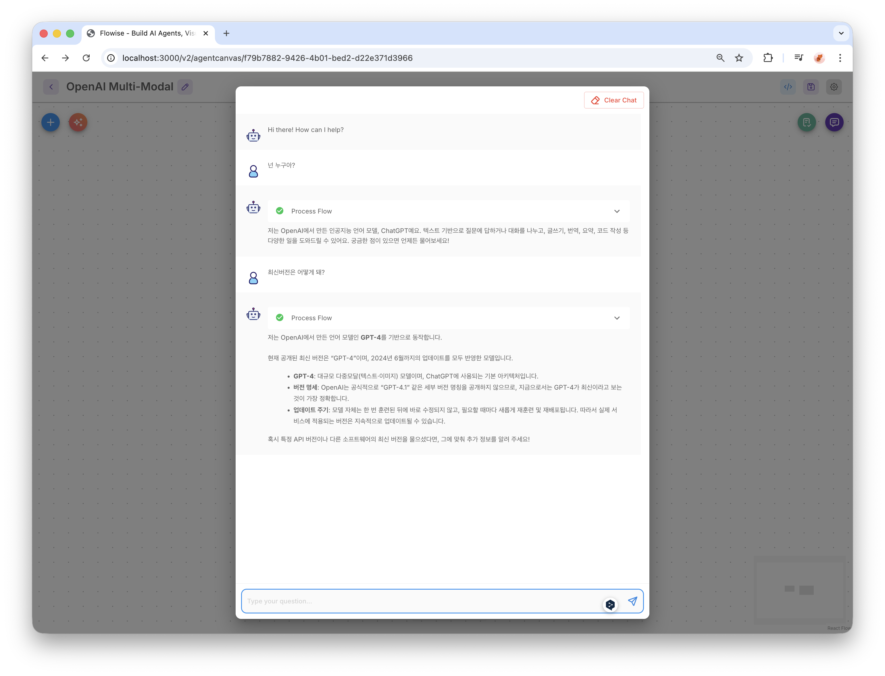

---
title: 4. Flowise ex3
layout: default
grand_parent: LLM
parent: Flowise
nav_order: 4
permalink: /llm/flowise/flowise_ex3
--- 

## FlowiseAI

### 2. FlowiseAI 사용하기

#### 1) Agentflows 추가

#### 2) 이름 입력후 저장

#### 3) Node 추가

#### 4) 설정

#### 5) 테스트
