---
title: 5. Flowise ex
layout: default
grand_parent: LLM
parent: Flowise
nav_order: 5
permalink: /llm/flowise/flowise_ex
--- 

## FlowiseAI

### 2. FlowiseAI 사용하기

#### 1) 로그인


#### 2) Document Store 클릭


#### 3) Add New 클릭하고 Name 입력하고 Add 버튼 클릭
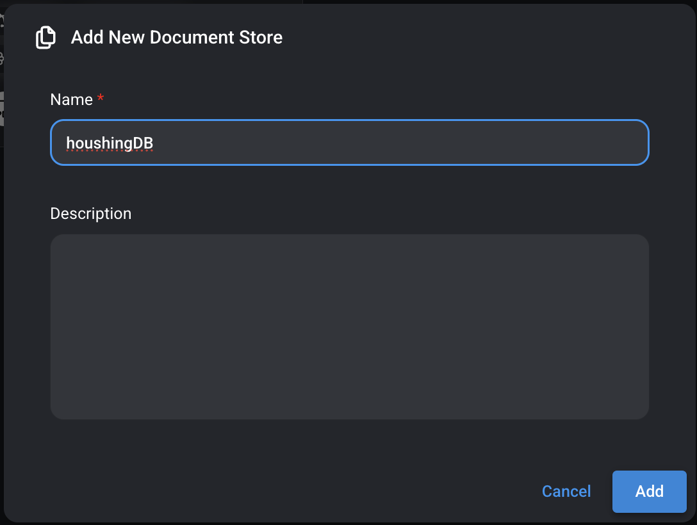

#### 4) 생성된 houshingDB Document Store 클릭
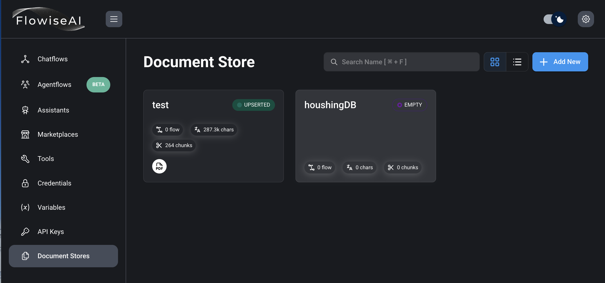

#### 5) Add Document Loader 버튼 클릭
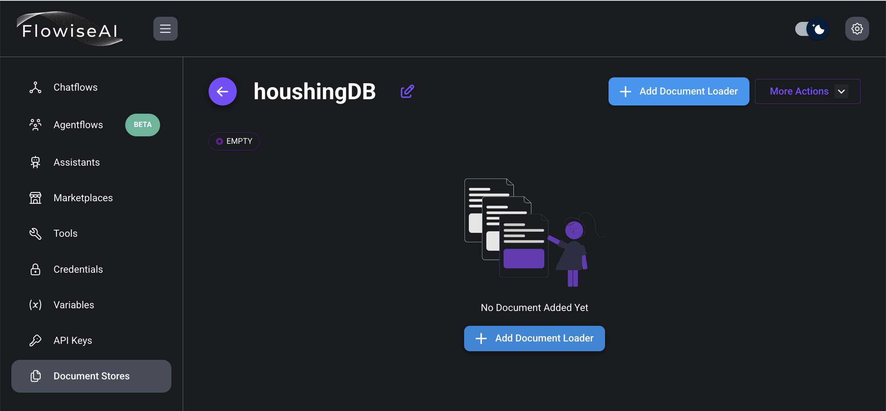

#### 6) 문서의 종류에 따라서 선택 후 등록


#### 7) pdf file upload,One document per page로 선택하고 Preview 클릭
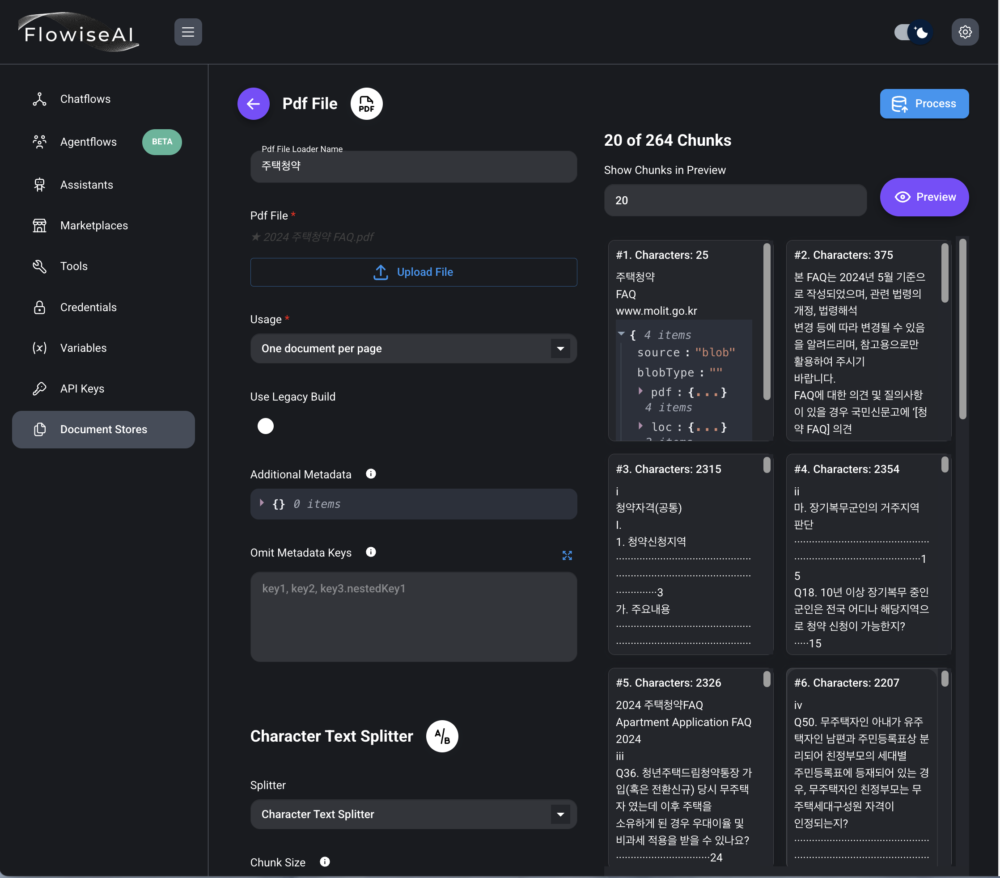

#### 8) Options 클릭, Upsert Chunks 클릭


#### 9) Select Embeddings, Vector Store는 Faiss 선택
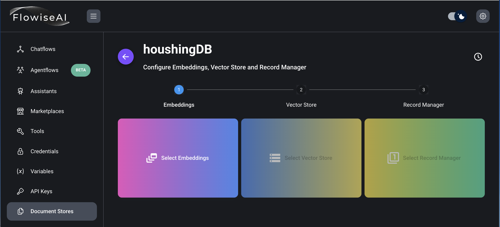

#### 10) Ollama Embeddings 선택 
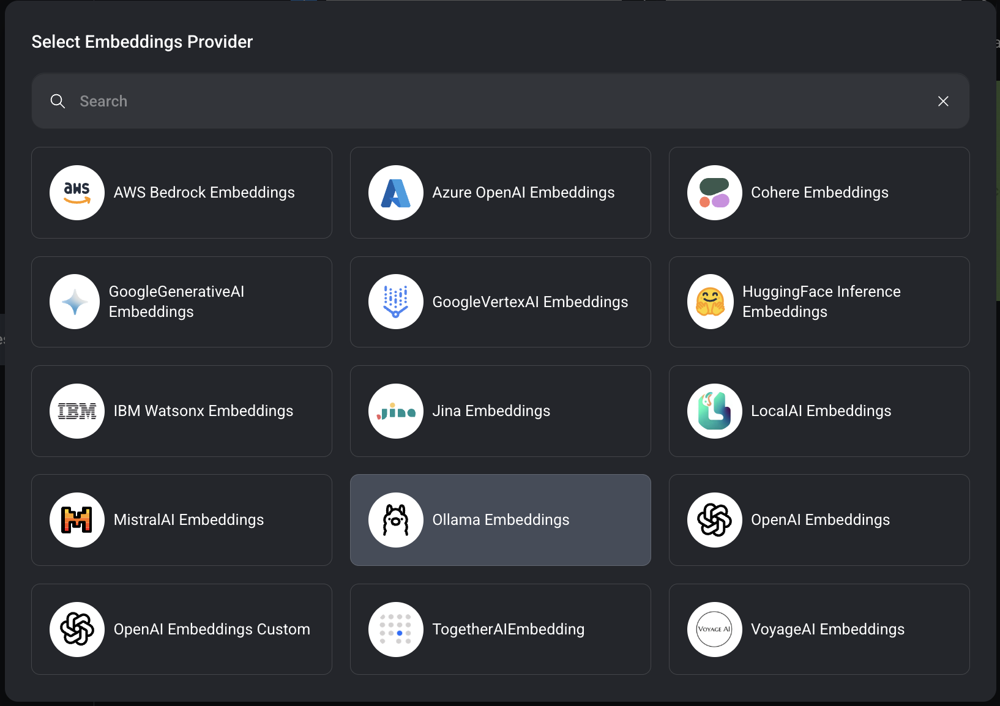

#### 11) 정보 입력 후 Upsert 클릭 
 
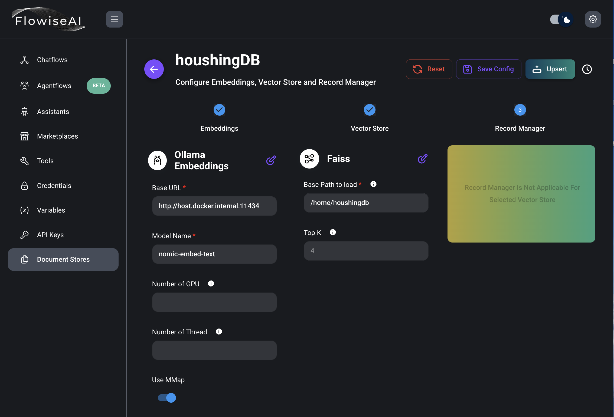

#### 12) Test Retrieval 버튼 클릭 


#### 13) 테스트 후 Save Config 버튼 클릭 
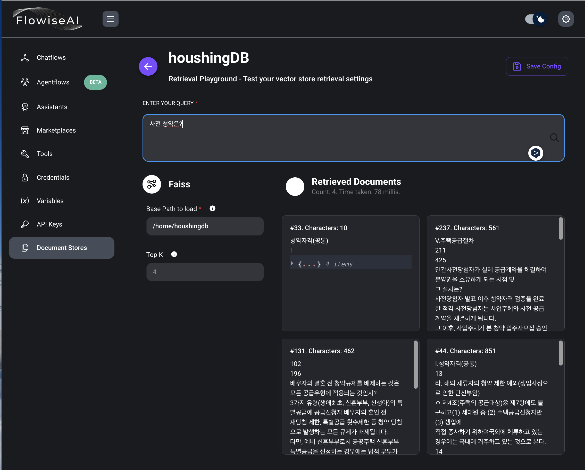

#### 14) Chatflows 선택 후, Add New 버튼 클릭.

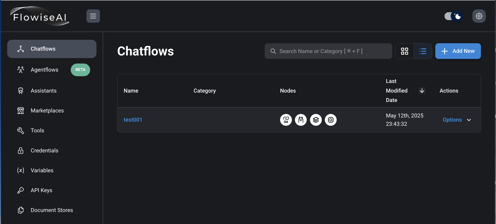

#### 15) Chatflows 저장
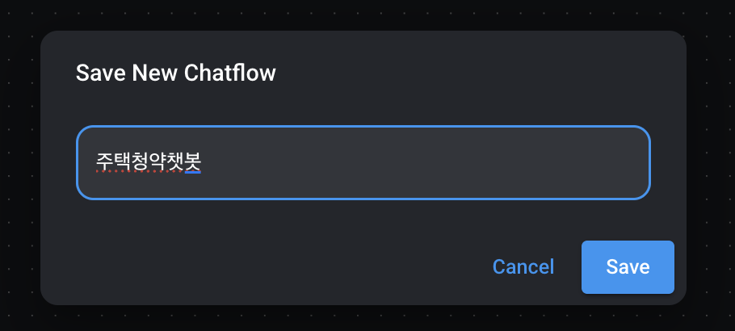

#### 16) Chatflows 작성 및 저장
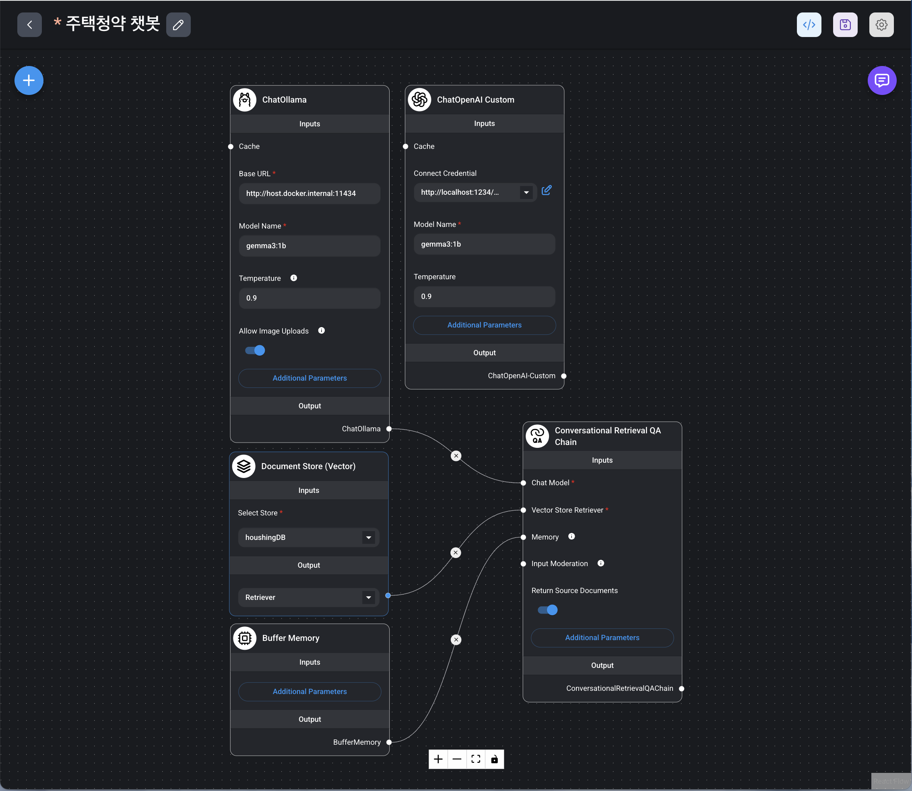

#### 17) 오른쪽 상단 말풍선 아이콘 클릭하고 동작여부 확인
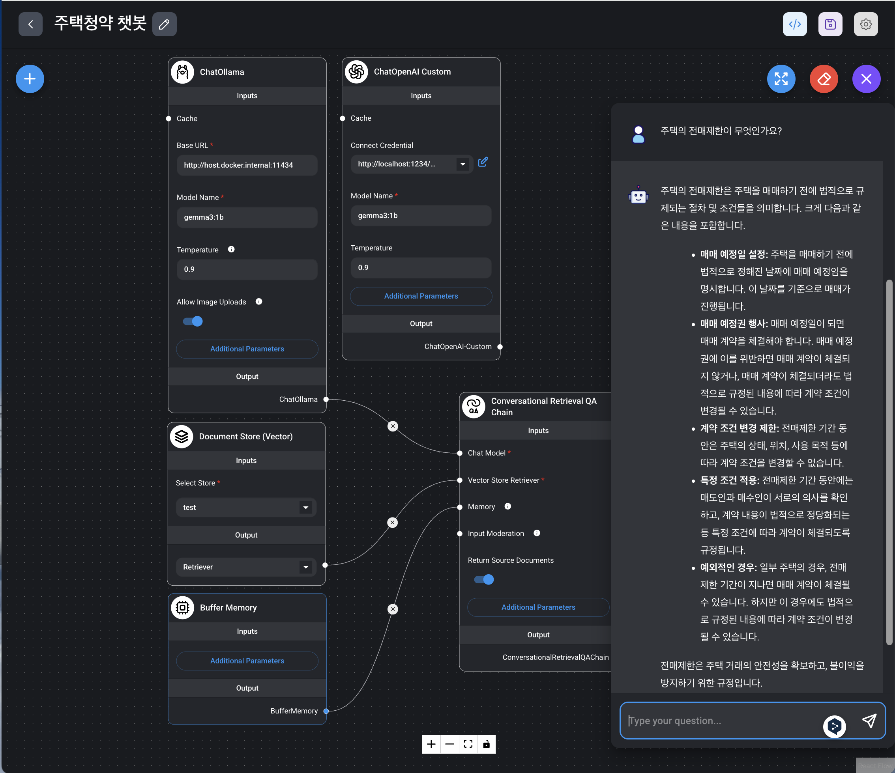

#### 18) LM Studio 와 연동
LM Studio 해당 모델 서버 서비스 실행 후, API Usage항목에 모델명과 서버 주소 확인
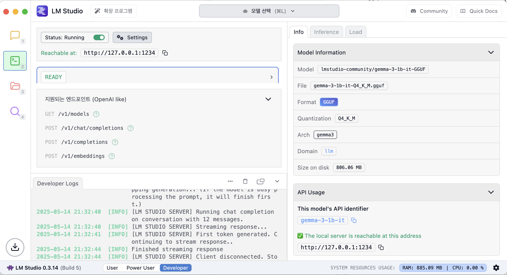

flowise Chatflows에서 ChatOpenAI Custom 노드 추가하고,  
Connect Credential에서 -Create New- 선택. 
NAME 항목에 이름 입력, Api Key는 아무거나 입력
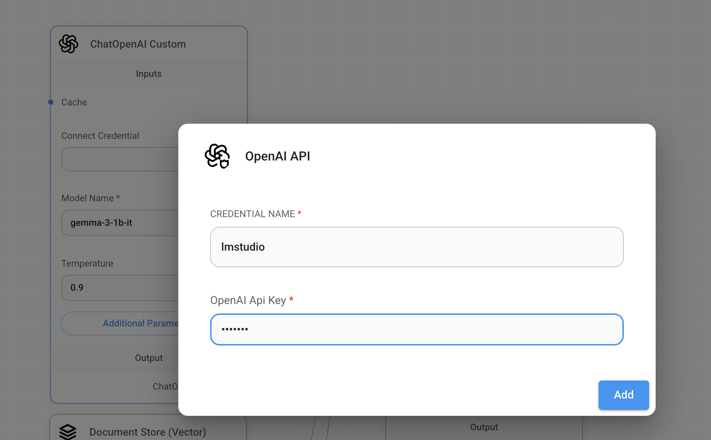

Additional Parameters클릭하고 입력
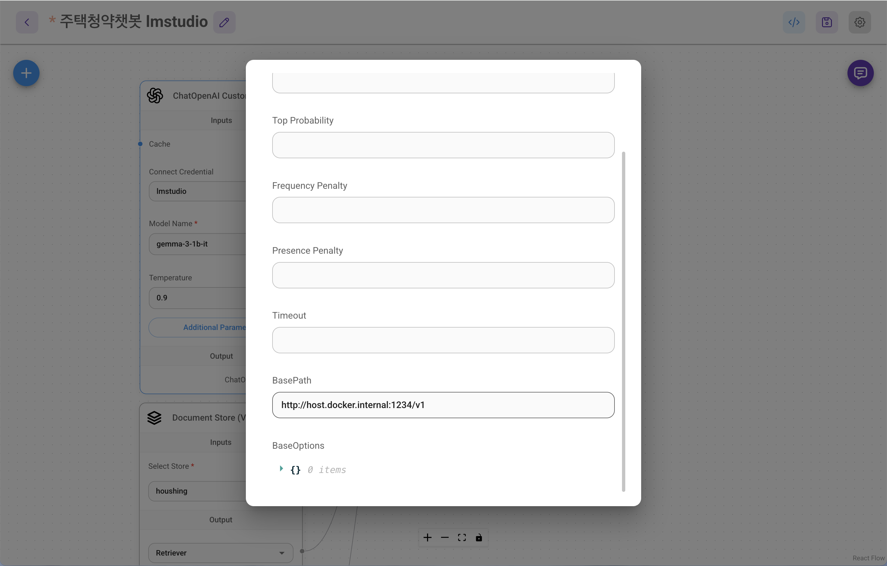

#### 19) streamlit으로 Flowise 연동해서 사용

`app.py`

```py
import streamlit as st
from flowise import Flowise, PredictionData
import json

# Flowise 서버가 실행 중인 주소
base_url="http://localhost:3030"

# Chatflow/Agentflow ID
# 해당 Chatflow의 웹페이지의 주소창을 확인한다.
flow_id = "fda11deb-e4a5-4a3e-a413-6daf0ab5a527"

st.title("💬 Flowise Streamlit Chat")
st.write(
    "This is a simple chatbot that uses Flowise Python SDK"
)

# Flowise 서버와 통신할 수 있는 클라이언트를 생성
client = Flowise(base_url=base_url)

# Streamlit의 세션 상태에 메시지를 저장하기 위한 리스트를 만듭니다. 이렇게 하면 페이지가 새로고침되어도 대화 내용이 유지
if "messages" not in st.session_state:
    st.session_state.messages = []

# 세션에 저장된 모든 메시지를 화면에 표시합니다. 각 메시지는 사용자("user") 또는 AI 비서("assistant")의 역할을 가집니다.
for message in st.session_state.messages:
    with st.chat_message(message["role"]):
        st.markdown(message["content"])

# 응답 생성 함수
# Flowise AI에 사용자의 질문(prompt)을 전송
# streaming=True로 설정하여 응답을 작은 조각(chunk)으로 받아서
# 각 조각을 파싱하고 'token' 이벤트가 있고 데이터가 비어있지 않은 경우에만 반환
# yield를 사용해 스트리밍 방식으로 데이터를 반환
def generate_response(prompt: str):
    print('generating response')
    completion = client.create_prediction(
        PredictionData(
            chatflowId=flow_id,
            question=prompt,
            overrideConfig={
                "sessionId": "session1234"
            },
            streaming=True
        )
    )

    for chunk in completion:
        print(chunk)
        parsed_chunk = json.loads(chunk)
        if (parsed_chunk['event'] == 'token' and parsed_chunk['data'] != ''):
            yield str(parsed_chunk['data'])


# 사용자가 입력란에 메시지를 입력했는지 확인
if prompt := st.chat_input("What is up?"):

    # 현재 프롬프트 저장하고 표시
    st.session_state.messages.append({"role": "user", "content": prompt})
    with st.chat_message("user"):
        st.markdown(prompt)

    # AI의 응답을 생성하고 스트리밍 방식으로 표시, 최종 응답을 세션 상태에 저장

    with st.chat_message("assistant"):
        response = generate_response(prompt)
        full_response = st.write_stream(response)
    st.session_state.messages.append({"role": "assistant", "content": full_response})

```

`streamlit 실행하기`

```bash
pip install streamlit
pip install flowise
streamlit run app.py
```