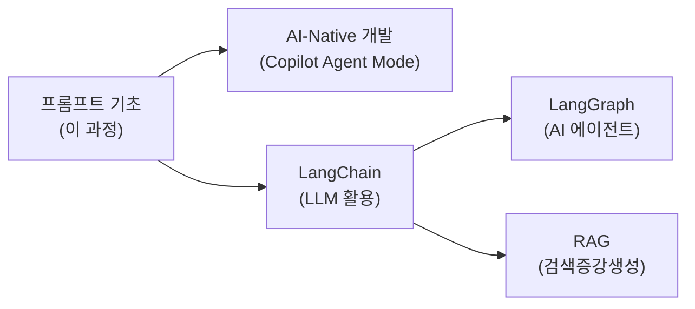

# 5. 미니프로젝트

## 학습 목표

1. CRAFT, CO-STAR 프레임워크를 실제 프롬프트에 적용하여 Streamlit 웹 서비스를 만들 수 있다
2. 프레임워크의 각 요소가 코드의 어디에 매핑되는지 설명할 수 있다
3. 프롬프트 엔지니어링에서 컨텍스트 엔지니어링으로 나아가는 방향을 이해한다

> **사전 설치**: `pip install streamlit openai python-dotenv` (또는 `uv pip install streamlit openai python-dotenv`)
>
> **실행**: `streamlit run app.py`

### .env 파일 생성

프로젝트 폴더에 `.env` 파일을 만들고 API 키를 저장합니다. 이 파일은 Git에 올리지 않도록 `.gitignore`에 추가하세요.

```
# .env
OPENAI_API_KEY=sk-여기에-발급받은-키를-붙여넣기
```

> **주의**: `.env` 파일에는 따옴표 없이 키 값만 적습니다. 이 파일은 절대 GitHub에 올리면 안 됩니다!

<a id="toc"></a>
## 진행 순서

1. [프로젝트 A: 역할 전환 AI 챗봇](#projectA)
2. [프로젝트 B: 자기소개서 첨삭 서비스](#projectB)
3. [프롬프트 → 컨텍스트 엔지니어링](#context)
4. [전체 과정 복습](#review)

---

<a id="projectA"></a>
## 프로젝트 A: 역할 전환 AI 챗봇 [↑](#toc)

**목표**: Streamlit으로 역할을 전환할 수 있는 멀티턴 챗봇 만들기

**사용 기법 — CRAFT 프레임워크 적용:**

| CRAFT 요소 | 프롬프트 적용 | 코드 위치 |
|-----------|-------------|----------|
| **C** (Context) | 학습자 수준과 배경 명시 | 각 역할의 1행 |
| **R** (Role) | 경력 + 전문분야 설정 | 각 역할의 2행 |
| **A** (Action) | 구체적 행동 지침 | 각 역할의 3~4행 |
| **F** (Format) | 답변 구조 지정 | 각 역할의 5행 |
| **T** (Tone) | 말투/대상 수준 | 각 역할의 6행 |
| 멀티턴 대화 | session_state로 히스토리 관리 | 112행 |

### 완성 코드

```python
# app_chatbot.py
# 실행: streamlit run app_chatbot.py
import streamlit as st
from openai import OpenAI
from dotenv import load_dotenv
import os

# .env 파일에서 OPENAI_API_KEY를 자동으로 읽어옴
load_dotenv()

# 참고: 한글 변수명은 학습 이해를 위한 것입니다. 실무에서는 영문 변수명을 사용하세요.

api_key = os.getenv("OPENAI_API_KEY")
if not api_key:
    st.error("API 키가 설정되지 않았습니다. .env 파일에 OPENAI_API_KEY를 추가하세요.")
    st.stop()

client = OpenAI(api_key=api_key)

# ===== 역할 정의 (CRAFT 프레임워크 적용) =====
ROLES = {
    "파이썬 튜터": """[Context] 파이썬을 처음 배우는 비전공자 학생이 프로그래밍 기초를 질문합니다.
[Role] 당신은 3년차 백엔드 개발자이고 신입 교육을 담당합니다.
[Action] 질문에 항상 실행 가능한 코드 예시를 포함해 답변합니다. 잘못된 코드를 보여주면 어디가 잘못인지 짚고 수정된 코드를 제시합니다.
[Format] 답변 구조: ① 핵심 설명 (2-3문장) → ② 코드 예시 (```python 블록) → ③ 한 줄 팁. 마지막에 항상 '더 궁금한 점이 있나요?'라고 묻습니다.
[Tone] 친절하고 격려하는 선배 개발자 말투. 전문 용어는 쉬운 비유와 함께 설명합니다.""",

    "딥러닝 멘토": """[Context] 딥러닝을 처음 접하는 학생이 개념을 질문합니다. 수학적 배경이 약합니다.
[Role] 당신은 5년차 ML 엔지니어입니다.
[Action] CNN, RNN, YOLO 등 딥러닝 개념을 실생활 비유로 설명합니다. 수학 공식은 필요할 때만 직관적 수준으로 사용합니다. 학습 로드맵과 추천 자료를 함께 제공합니다.
[Format] 답변 구조: ① 한 줄 요약 → ② 실생활 비유 → ③ 핵심 원리 → ④ 추천 자료
[Tone] 열정적이고 친근한 멘토. 학생의 궁금증을 환영하는 태도.""",

    "코드 리뷰어": """[Context] 프로그래밍을 배우는 학생이 작성한 파이썬 코드를 리뷰합니다.
[Role] 당신은 시니어 개발자이며 코드 리뷰 전문가입니다.
[Action] 코드의 문제점을 찾고 개선된 버전을 제시합니다. 버그보다 설계 문제를 먼저 지적하고, 개선 이유를 반드시 설명합니다.
[Format] 답변 구조: ① 전체 평가 (한 줄) → ② 개선 포인트 (번호 리스트) → ③ 수정된 코드
[Tone] 격려하되 핵심은 날카롭게. "잘 작성했네요! 여기만 더 좋아지면..." 패턴 사용.""",
}

# ===== Streamlit UI =====
st.set_page_config(page_title="역할 전환 AI 챗봇", page_icon="💬", layout="centered")
st.title("💬 프로그래밍 학습 AI 챗봇")
st.caption("역할을 선택하면 해당 전문가로 대화합니다.")

# 사이드바: 역할 선택
with st.sidebar:
    st.header("설정")
    선택_역할 = st.radio("대화 상대 선택", list(ROLES.keys()))

    # 역할 변경 시 대화 초기화
    if "현재_역할" not in st.session_state:
        st.session_state["현재_역할"] = 선택_역할
    if st.session_state["현재_역할"] != 선택_역할:
        st.session_state["현재_역할"] = 선택_역할
        st.session_state["messages"] = []
        st.rerun()

    st.divider()
    st.markdown(f"**현재 역할**: {선택_역할}")
    st.markdown(f"**대화 수**: {len(st.session_state.get('messages', []))} 턴")

    if st.button("대화 초기화", use_container_width=True):
        st.session_state["messages"] = []
        st.rerun()

# 대화 히스토리 초기화
if "messages" not in st.session_state:
    st.session_state["messages"] = []

# 이전 대화 표시
for msg in st.session_state["messages"]:
    with st.chat_message(msg["role"]):
        st.write(msg["content"])

# 사용자 입력 처리
if user_input := st.chat_input(f"{선택_역할}에게 말을 걸어보세요..."):
    # 사용자 메시지 표시 & 저장
    with st.chat_message("user"):
        st.write(user_input)
    st.session_state["messages"].append({"role": "user", "content": user_input})

    # API 호출 (system + 전체 히스토리)
    api_messages = [
        {"role": "system", "content": ROLES[선택_역할]},
    ] + st.session_state["messages"]

    with st.chat_message("assistant"):
        with st.spinner("생각 중..."):
            response = client.chat.completions.create(
                model="gpt-4.1-nano",
                messages=api_messages,
                temperature=0.7,
                stream=True,   # 실시간 스트리밍
            )
            전체_답변 = st.write_stream(response)

    # AI 응답 저장
    st.session_state["messages"].append({"role": "assistant", "content": 전체_답변})
```


---

<a id="projectB"></a>
## 프로젝트 B: 자기소개서 첨삭 서비스 [↑](#toc)

**목표**: Few-shot + Role Prompting으로 직무별 맞춤 피드백 제공

**사용 기법 — CO-STAR 프레임워크 적용:**

> 프로젝트 A에서 CRAFT를 사용했다면, 프로젝트 B에서는 **CO-STAR**를 사용합니다.
> 자소서 첨삭은 "읽는 사람(인사 담당자)"이 명확하므로, Audience를 별도로 지정하는 CO-STAR가 적합합니다.

| CO-STAR 요소 | 프롬프트 적용 | 코드 위치 |
|-------------|-------------|----------|
| **C** (Context) | 취업 준비생의 자소서 첨삭 상황 | system 1행 |
| **O** (Objective) | 합격 가능성을 높이는 수정안 제시 | system 2행 |
| **S** (Style) | 직무별 핵심 역량 기준 전문가 피드백 | system 3행 |
| **T** (Tone) | 격려하되 솔직한 멘토 어조 | system 4행 |
| **A** (Audience) | 자소서 작성 경험이 적은 취업 준비생 | system 5행 |
| **R** (Response) | 강점 3개 → 개선점 3개 → 수정된 자소서 | system 6행 |
| Few-shot | 직무별 입력-출력 예시 제공 | EXAMPLES dict |

### 완성 코드

```python
# app_resume.py
# 실행: streamlit run app_resume.py
import streamlit as st
from openai import OpenAI
from dotenv import load_dotenv
import os

# .env 파일에서 OPENAI_API_KEY를 자동으로 읽어옴
load_dotenv()

api_key = os.getenv("OPENAI_API_KEY")
if not api_key:
    st.error("API 키가 설정되지 않았습니다. .env 파일에 OPENAI_API_KEY를 추가하세요.")
    st.stop()

client = OpenAI(api_key=api_key)

# ===== 직무별 Few-shot 예시 =====
EXAMPLES = {
    "마케팅": [
        {"role": "user", "content": "자소서: '마케팅에 관심이 있고 열심히 하겠습니다.'\n직무: 마케팅"},
        {"role": "assistant", "content": """**강점**
1. 마케팅 직무에 대한 관심을 표현했습니다.
2. 열정과 의지를 보여주었습니다.
3. 간결한 표현을 사용했습니다.

**개선점**
1. 구체적인 경험이나 성과가 없어 역량 증명이 부족합니다. → 수치가 포함된 경험을 추가하세요.
2. '열심히 하겠습니다'는 모든 지원자가 쓰는 표현으로 차별화가 없습니다. → 구체적 계획으로 대체하세요.
3. 마케팅의 어떤 분야(디지털, 콘텐츠, 브랜딩)에 관심이 있는지 불명확합니다. → 특정 분야를 명시하세요.

**수정된 자소서**
대학 동아리에서 인스타그램 계정을 운영하며 팔로워를 500명에서 3,000명으로 성장시킨 경험이 있습니다.
콘텐츠 기획부터 성과 분석까지 직접 수행하며, 데이터 기반 마케팅의 중요성을 체감했습니다.
이 경험을 바탕으로 귀사의 디지털 마케팅 팀에서 실질적인 성과를 만들어내겠습니다."""},
    ],
    "개발": [
        {"role": "user", "content": "자소서: '코딩을 좋아하고 개발자가 되고 싶습니다.'\n직무: 개발"},
        {"role": "assistant", "content": """**강점**
1. 개발 직무에 대한 열의가 느껴집니다.
2. 직관적이고 솔직한 표현입니다.
3. 핵심 지원 동기가 명확합니다.

**개선점**
1. '코딩을 좋아한다'를 증명할 프로젝트 경험이 없습니다. → GitHub 포트폴리오나 프로젝트 성과를 추가하세요.
2. 어떤 개발 분야(프론트엔드, 백엔드, ML)인지 불명확합니다. → 지원 포지션에 맞는 기술 스택을 명시하세요.
3. 문제를 해결한 구체적 사례가 없습니다. → 디버깅, 성능 개선 등 기술적 문제 해결 경험을 추가하세요.

**수정된 자소서**
학부 캡스톤 프로젝트에서 Python/FastAPI 기반 REST API를 설계하고, 팀원 3명과 협업하여 배포까지 완료했습니다.
응답 속도가 느린 엔드포인트를 캐싱으로 개선하며 평균 응답 시간을 2초에서 0.3초로 단축한 경험이 있습니다.
이 과정에서 체득한 문제 분석-해결 사이클을 귀사의 백엔드 팀에서 발휘하겠습니다."""},
    ],
}

# ===== 첨삭 함수 (CO-STAR 프레임워크 적용) =====
def review_resume(job: str, content: str) -> str:
    system = f"""[Context] 취업 준비생이 {job} 직무에 지원하기 위해 자기소개서를 작성했습니다.
[Objective] 자소서의 강점과 개선점을 분석하고, 합격 가능성을 높이는 수정안을 제시합니다.
[Style] 채용 시장의 최신 트렌드와 직무별 핵심 역량을 기준으로 전문적으로 평가합니다.
[Tone] 격려하되 솔직한 멘토 어조. 강점을 먼저 언급한 뒤 개선점을 제시합니다.
[Audience] 자소서 작성 경험이 적은 대학생 또는 취업 준비생
[Response] 반드시 다음 형식으로 출력하세요:
**강점** (3개, 번호 리스트) → **개선점** (3개, 구체적 이유와 개선 방향 포함) → **수정된 자소서** (완성본, 원문 핵심 메시지 유지)

주의: 지원자가 경험하지 않은 허위 경험이나 성과를 날조하지 마세요."""

    few_shot = EXAMPLES.get(job, EXAMPLES["마케팅"])
    messages = [
        {"role": "system", "content": system},
        *few_shot,
        {"role": "user", "content": f"자소서: '{content}'\n직무: {job}"},
    ]

    try:
        response = client.chat.completions.create(
            model="gpt-4.1-nano",
            messages=messages,
            temperature=0.5,
        )
        return response.choices[0].message.content or "(응답을 생성하지 못했습니다)"
    except Exception as e:
        return f"API 호출 중 오류가 발생했습니다: {e}"

# ===== Streamlit UI =====
st.set_page_config(page_title="자소서 첨삭", page_icon="📝", layout="centered")
st.title("📝 자기소개서 첨삭 서비스")
st.caption("직무를 선택하고 자소서를 입력하면 맞춤 피드백을 드립니다.")

job_role = st.selectbox("지원 직무", ["마케팅", "기획/PM", "디자인", "개발", "영업"])
resume_input = st.text_area("자기소개서 입력", height=200, placeholder="첨삭받을 내용을 입력하세요.")

if resume_input:
    st.caption(f"입력 글자 수: {len(resume_input)}자")

if st.button("첨삭하기", type="primary", use_container_width=True):
    if not resume_input or len(resume_input.strip()) < 20:
        st.warning("최소 20자 이상 입력해주세요.")
    else:
        with st.spinner(f"{job_role} 직무 기준으로 첨삭 중..."):
            result = review_resume(job_role, resume_input)

        st.divider()
        st.subheader(f"첨삭 결과 — {job_role}")
        st.markdown(result)

        st.download_button(
            label="결과 저장 (.txt)",
            data=result,
            file_name=f"자소서_첨삭_{job_role}.txt",
        )
```

### 실행 방법

```bash
# 1) .env 파일이 있는지 확인
cat .env
# 출력: OPENAI_API_KEY=sk-...

# 2) 실행
streamlit run app_chatbot.py     # 프로젝트 A
streamlit run app_resume.py      # 프로젝트 B
```

> **참고**: `python-dotenv`가 `.env` 파일에서 API 키를 자동으로 읽어오므로, `export` 명령으로 환경 변수를 설정할 필요가 없습니다.


---

<a id="context"></a>
## 프롬프트 엔지니어링 → 컨텍스트 엔지니어링 [↑](#toc)

이 과정에서 배운 프롬프트 엔지니어링은 **"AI에게 잘 질문하는 기술"**이었습니다.

2026년 현재 업계는 이를 한 단계 발전시킨 **컨텍스트 엔지니어링**으로 나아가고 있습니다.

| | 프롬프트 엔지니어링 | 컨텍스트 엔지니어링 |
|---|---|---|
| **초점** | "어떻게 질문할까?" | "AI가 무엇을 알아야 하는가?" |
| **범위** | 질문 1개 | 전체 정보 아키텍처 |
| **비유** | 좋은 질문하기 | **좋은 브리핑 자료 만들기** |
| **적용** | ChatGPT 채팅, API 호출 | AI 에이전트, RAG, 자동화 파이프라인 |

> **다음 단계**: [AI-Native 개발](/llm/ai-native-dev) 과정에서 GitHub Copilot Agent Mode 커스터마이징을 통해 컨텍스트 엔지니어링을 실전으로 배울 수 있습니다.


---

<a id="review"></a>
## 전체 과정 복습 [↑](#toc)

### 복습 질문

1. CRAFT 프레임워크의 5가지 요소는 무엇인가?
2. Zero-shot과 Few-shot의 차이를 한 문장으로 설명하세요
3. Role Prompting에서 system 메시지의 역할은?
4. Chain-of-Thought가 효과적인 상황은 언제인가?
5. LLM이 멀티턴 대화에서 이전 내용을 "기억"하는 방법은?
6. temperature 0과 1의 차이는?
7. 프롬프트 평가의 4가지 기준은?
8. 프롬프트 엔지니어링과 컨텍스트 엔지니어링의 차이는?

### 심화 과제

- **기본**: 프로젝트 A 또는 B를 실행하고 역할/직무를 자신의 업무에 맞게 수정
- **중급**: 자신의 프롬프트에 대해 4가지 평가 기준으로 자기 평가표 작성
- **중급**: CoT + Role + Few-shot 3기법을 조합한 프롬프트를 CRAFT로 설계
- **심화**: Streamlit Cloud에 프로젝트 배포하고 URL 공유

### 학습 경로 안내



### 참고 자료

| 주제 | 링크 |
|------|------|
| OpenAI API 문서 | [platform.openai.com/docs](https://platform.openai.com/docs) |
| OpenAI Playground | [platform.openai.com/playground](https://platform.openai.com/playground) |
| Prompt Engineering Guide | [promptingguide.ai](https://www.promptingguide.ai/) |
| CRAFT 프레임워크 | [craftingaiprompts.org](https://craftingaiprompts.org/) |
| Streamlit 공식 문서 | [docs.streamlit.io](https://docs.streamlit.io/) |
| 컨텍스트 엔지니어링 (Gartner) | [gartner.com/en/articles/context-engineering](https://www.gartner.com/en/articles/context-engineering) |
