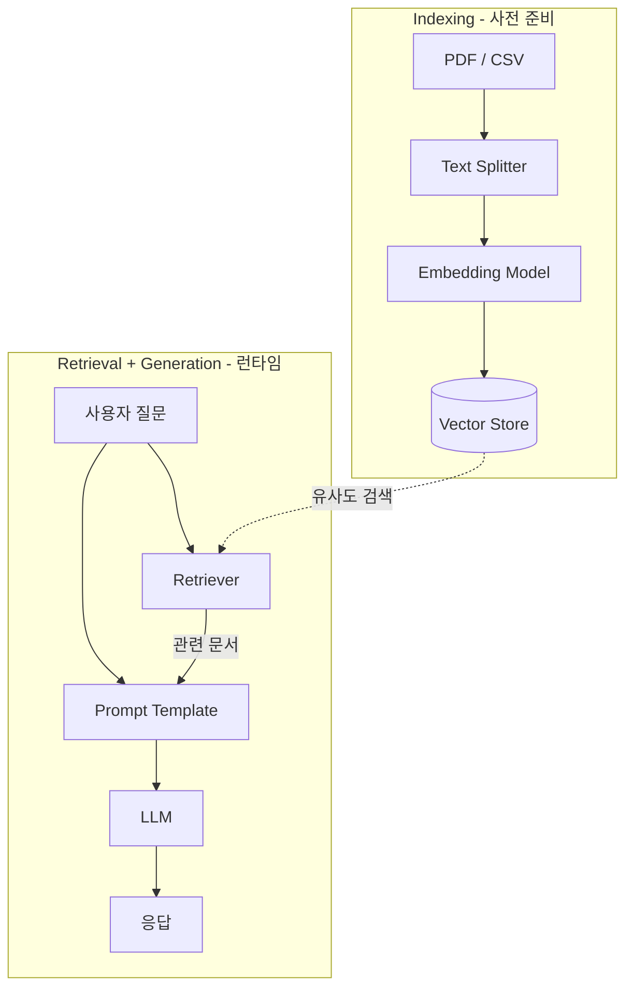

# LangChain

## LangChain이란?

LangChain은 **LLM(대규모 언어 모델) 기반 애플리케이션**을 만들기 위한 오픈소스 프레임워크입니다.

> **비전공자를 위한 용어 정리**
> - **LLM**: ChatGPT처럼 대화할 수 있는 AI 모델을 총칭합니다
> - **프레임워크**: 요리에 비유하면 레시피(프롬프트) + 재료(데이터) + 조리도구(모델)를 체계적으로 관리하는 주방 시스템입니다
> - **RAG**: 시험 볼 때 오픈북 허용하는 것과 같습니다. AI에게 참고자료를 함께 전달하는 기술입니다
> - **임베딩**: 단어나 문장을 숫자(벡터)로 변환하는 것입니다. 비슷한 의미의 문장은 비슷한 숫자가 됩니다
> - **토큰**: AI가 텍스트를 읽는 단위입니다. 대략 한글 1글자 ≈ 2~3토큰

프롬프트 설계, 모델 호출, 외부 도구 연결, RAG(검색 증강 생성), 에이전트까지 — LLM 앱 개발의 전 과정을 구조화된 추상화로 제공합니다.

---

## 패키지 구조

LangChain은 단일 패키지가 아니라 **역할별로 분리된 패키지 생태계**로 구성됩니다.

```
langchain-core          ← 핵심 추상화 (Runnable, LCEL, BaseMessage, BaseTool)
    │
    ├── langchain       ← 체인, 에이전트, 검색 전략 (메인 패키지)
    │
    ├── langchain-community  ← 커뮤니티 통합 (FAISS, PyMuPDF 등)
    │
    ├── langchain-openai     ← OpenAI 공식 통합
    ├── langchain-ollama     ← Ollama 공식 통합
    ├── langchain-pinecone   ← Pinecone 공식 통합
    ├── langchain-anthropic  ← Anthropic 공식 통합
    │   ...
    │
    └── langchain-text-splitters  ← 텍스트 분할 유틸리티
```

모든 통합 패키지는 `langchain-core`의 기본 클래스를 구현합니다.
예: `ChatOpenAI` → `BaseChatModel`, `FAISS` → `VectorStore`, `PyMuPDFLoader` → `BaseLoader`

---

## 핵심 개념

### LCEL (LangChain Expression Language)

LangChain의 핵심 설계 패턴. `|` (파이프) 연산자로 컴포넌트를 연결해 체인을 구성합니다.
모든 컴포넌트는 `Runnable` 인터페이스를 구현하며, `.invoke()`, `.stream()`, `.batch()`를 지원합니다.

```python
from dotenv import load_dotenv
load_dotenv()

from langchain_core.prompts import ChatPromptTemplate
from langchain_core.output_parsers import StrOutputParser
from langchain_openai import ChatOpenAI

prompt = ChatPromptTemplate.from_messages([
    ("system", "You are a helpful assistant."),
    ("human", "{input}"),
])
model = ChatOpenAI(model="gpt-4o-mini")
parser = StrOutputParser()

# 파이프 연산자로 체인 구성
chain = prompt | model | parser
chain.invoke({"input": "서버리스 컴퓨팅을 간단히 설명해줘"})
```

### 프롬프트 템플릿 (Prompt Template)

`ChatPromptTemplate`으로 시스템/사용자/AI 역할별 메시지를 구조화합니다. 변수 플레이스홀더로 재사용 가능한 프롬프트를 설계합니다.

```python
prompt = ChatPromptTemplate.from_messages([
    ("system", "당신은 {role} 전문가입니다."),
    ("human", "{question}"),
])
```

### Chat Model (채팅 모델)

메시지 리스트를 입력받아 `AIMessage`를 반환하는 LLM 래퍼.

| 패키지 | 클래스 | 대상 |
|---|---|---|
| `langchain-openai` | `ChatOpenAI` | GPT-4o, GPT-4o-mini |
| `langchain-ollama` | `ChatOllama` | Llama, Mistral 등 로컬 모델 |
| `langchain-anthropic` | `ChatAnthropic` | Claude |

### Output Parser (출력 파서)

LLM의 raw 출력을 구조화된 데이터로 변환합니다.

| 파서 | 용도 |
|---|---|
| `StrOutputParser` | 문자열 추출 (가장 기본) |
| `JsonOutputParser` | JSON 파싱 |
| `PydanticOutputParser` | 타입이 있는 Python 객체로 변환 |

### Retriever & Vector Store (검색기 & 벡터 저장소)

**Retriever**는 쿼리 문자열을 받아 관련 `Document` 리스트를 반환하는 인터페이스.
**Vector Store**는 임베딩 유사도로 문서를 검색하는 저장소이며, `.as_retriever()`로 Retriever로 변환됩니다.

```python
from langchain_community.vectorstores import FAISS
from langchain_openai import OpenAIEmbeddings

vector_store = FAISS.from_documents(documents, OpenAIEmbeddings())
retriever = vector_store.as_retriever(search_kwargs={"k": 3})
docs = retriever.invoke("청약 자격 조건이 뭔가요?")
```

이것이 **RAG (Retrieval-Augmented Generation)**의 기초다:

```
질문 → Retriever → 관련 문서 → 프롬프트에 주입 → LLM → 응답
```

### Tools & Agents (도구 & 에이전트)

**Tool**은 이름, 설명, 입력 스키마가 있는 함수 래퍼로, LLM이 필요에 따라 호출할 수 있습니다.
**Agent**는 LLM이 도구를 선택적으로 호출하며 반복적으로 추론하는 루프 구조다.

```
LLM 호출 → 도구 호출 필요? → Yes → 도구 실행 → 결과를 LLM에 전달 → 반복
                             → No  → 최종 응답 반환
```

### Memory (메모리)

대화 히스토리를 유지하는 메커니즘. 메시지 리스트를 프롬프트에 주입하는 방식으로 동작합니다.
기존에는 `RunnableWithMessageHistory`로 세션 기반 히스토리를 관리했으나, v1.0부터는 **LangGraph의 내장 상태 관리(persistence + middleware)**가 권장 패턴이다.

---

## RAG 파이프라인 전체 흐름

LangChain에서 가장 많이 사용되는 패턴인 RAG의 전체 흐름:



1. **문서 로드** — `PyMuPDFLoader`, `CSVLoader` 등으로 문서를 `Document` 객체로 변환
2. **텍스트 분할** — `RecursiveCharacterTextSplitter`로 청크 단위로 분할
3. **임베딩 & 저장** — 임베딩 모델로 벡터화 후 Vector Store(FAISS, Pinecone 등)에 저장
4. **검색** — 사용자 질문을 임베딩 → 유사도 검색으로 관련 문서 추출
5. **생성** — 검색된 문서를 컨텍스트로 프롬프트에 주입 → LLM이 응답 생성

---

## LangChain vs LangGraph

LangChain v1.0부터 에이전트 런타임은 내부적으로 LangGraph 위에 구축됩니다. 둘은 **추상화 수준이 다른 보완 관계**입니다.

| | LangChain | LangGraph |
|---|---|---|
| **추상화** | High-level, 간편 | Low-level, 유연 |
| **실행 모델** | 선형 체인 (DAG) | 그래프: 루프, 분기, 순환 가능 |
| **상태 관리** | 암묵적 (메시지 히스토리) | 명시적 `StateGraph` + 체크포인트 |
| **적합한 용도** | RAG, 간단한 챗봇, 프롬프트 엔지니어링 | 멀티 에이전트, 복잡한 워크플로우, Human-in-the-loop |

**실전 가이드:** LCEL 체인이나 `create_agent`로 시작하고, 루프/분기/멀티 에이전트가 필요해지면 LangGraph로 전환합니다.

---

## v1.0 주요 변경사항 (2025.10.17)

| 항목 | 내용 |
|---|---|
| **Python 버전** | 3.10+ 필수 (3.9 지원 종료) |
| **`langchain-classic`** | 레거시 체인(`LLMChain`, `AgentExecutor`)이 별도 패키지로 분리 |
| **`create_agent`** | 새로운 에이전트 생성 API (LangGraph 런타임 기반) |
| **표준 콘텐츠 블록** | 프로바이더 무관 메시지 포맷 (추론 트레이스, 인용, 도구 호출) |
| **안정성 보증** | [SemVer](https://semver.org/) 준수 — v1.x 동안 기존 API 호환 유지, breaking change는 v2.0에서만 허용 |

> 기존 `AgentExecutor`, `LLMChain` 코드는 `pip install langchain-classic`으로 유지 가능하며, LCEL 패턴으로 점진적 마이그레이션 권장.
