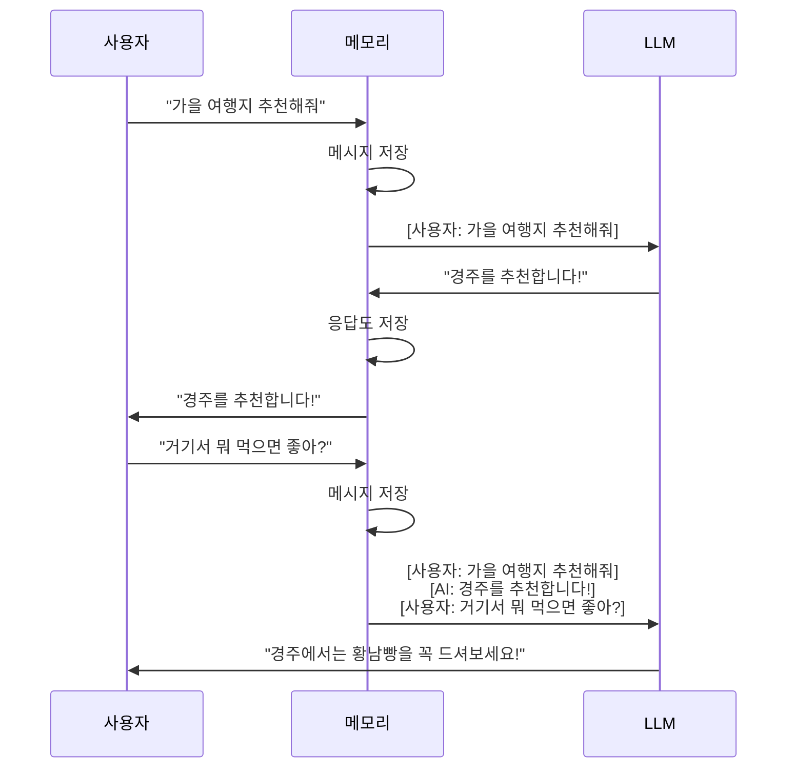

## 학습 목표

- RunnableWithMessageHistory로 대화 맥락을 유지할 수 있다
- 세션 기반 히스토리를 관리하여 여러 사용자를 지원할 수 있다

<a id="toc"></a>

## 진행 순서

1. [메모리의 개념](#part1) - 왜 메모리가 필요한가?
2. [메시지 히스토리 기초](#part2) - InMemoryChatMessageHistory로 대화 저장하기
3. [챗봇에 메모리 연결하기](#part3) - RunnableWithMessageHistory 단일 세션
4. [여러 사용자 지원하기](#part4) - session_id 기반 다중 세션
5. [대화형 챗봇 만들기](#part5) - while 루프로 연속 대화
6. [정리](#part6) - 핵심 요약 + 실습 미션

> **사전 준비:** [1장 개발환경](/llm/langchain/install)에서 `.env` 파일 설정과 패키지 설치를 완료한 상태에서 진행합니다. 모든 코드는 `.env`에 `OPENAI_API_KEY`가 설정되어 있어야 동작합니다.

---

# LangChain 메모리

이전 챕터에서 도구(Tool)로 LLM이 외부 세계와 상호작용하게 만들었습니다. 그런데 한 가지 문제가 있습니다 — **LLM은 기본적으로 이전 대화를 기억하지 못합니다.**

<a id="part1"></a>

## 1. 메모리의 개념 [↑](#toc)

### 메모장 비유로 이해하기

> 메모리는 **비서의 메모장**과 같습니다. 대화할 때마다 비서가 내용을 메모장에 적어두고, 다음 대화 때 꺼내봅니다. 메모장 없이는 매번 "처음 만나는 것처럼" 대화하게 됩니다.

```
❌ 메모리 없는 챗봇:
사용자: "가을 여행지 추천해줘"  → AI: "경주를 추천합니다!"
사용자: "거기서 뭐 먹으면 좋아?" → AI: "어디를 말씀하시는 건가요?" 😱

✅ 메모리 있는 챗봇:
사용자: "가을 여행지 추천해줘"  → AI: "경주를 추천합니다!"
사용자: "거기서 뭐 먹으면 좋아?" → AI: "경주에서는 황남빵을 꼭 드셔보세요!" 👍
```

### 메모리의 동작 원리

LangChain 메모리의 핵심은 단순합니다: **이전 대화 메시지를 저장해두었다가, 다음 질문 시 프롬프트에 함께 전달**하는 것입니다.



> 핵심: LLM이 "기억하는" 것이 아니라, **메모리가 이전 대화를 매번 함께 보내주는** 것입니다.

---

<a id="part2"></a>

## 2. 메시지 히스토리 기초 [↑](#toc)

메모리의 가장 기본은 **메시지를 저장하고 꺼내보는** 것입니다. `InMemoryChatMessageHistory`가 이 역할을 합니다.

```python
from langchain_core.chat_history import InMemoryChatMessageHistory
from langchain_core.messages import HumanMessage, AIMessage

# 1. 히스토리 객체 생성 (빈 메모장)
history = InMemoryChatMessageHistory()

# 2. 대화 저장
history.add_message(HumanMessage(content="안녕!"))
history.add_message(AIMessage(content="안녕하세요!"))
history.add_message(HumanMessage(content="오늘 날씨 어때?"))
history.add_message(AIMessage(content="서울은 맑아요."))

# 3. 저장된 대화 확인
for msg in history.messages:
    role = "사용자" if msg.type == "human" else "AI"
    print(f"{role}: {msg.content}")
```

**실행 결과:**
```
사용자: 안녕!
AI: 안녕하세요!
사용자: 오늘 날씨 어때?
AI: 서울은 맑아요.
```

> 이 자체로는 LLM과 연결되지 않습니다. 다음 단계에서 이 히스토리를 LLM 체인에 연결합니다.

### LLM은 이전 대화를 기억하지 못합니다

메모리를 연결하기 전에, **LLM이 정말로 이전 대화를 기억 못하는지** 직접 확인해봅시다.

```python
from dotenv import load_dotenv
load_dotenv()

from langchain_openai import ChatOpenAI
from langchain_core.messages import HumanMessage

llm = ChatOpenAI(model="gpt-4o-mini")

# 첫 번째 질문
response1 = llm.invoke([HumanMessage(content="제 이름은 민수입니다.")])
print("① AI:", response1.content)

# 두 번째 질문 — 이전 대화를 기억할까?
response2 = llm.invoke([HumanMessage(content="제 이름이 뭐였죠?")])
print("② AI:", response2.content)
```

**실행 결과 (예시):**
```
① AI: 안녕하세요 민수님! 만나서 반갑습니다.
② AI: 죄송합니다, 저는 이전 대화 내용을 기억하지 못합니다. 이름을 다시 알려주시겠어요?
```

> `invoke()`를 따로 호출하면 **매번 새로운 대화**가 됩니다. 이전에 "민수"라고 말한 것을 전혀 모릅니다. 이 문제를 해결하는 것이 3장의 `RunnableWithMessageHistory`입니다.

---

<a id="part3"></a>

## 3. 챗봇에 메모리 연결하기 [↑](#toc)

2장에서 히스토리에 메시지를 직접 `add_message()`로 저장했습니다. 하지만 매번 수동으로 저장하는 것은 번거롭습니다.

`RunnableWithMessageHistory`는 이 과정을 **자동화**해주는 도구입니다. 기존 LCEL 체인(`prompt | llm`)을 감싸면, 사용자가 질문할 때마다:
1. 히스토리에서 이전 대화를 꺼내서 프롬프트에 **자동 주입**
2. LLM이 응답하면 히스토리에 **자동 저장**

> 비유: 2장에서는 비서가 **메모장을 직접 펴고 적었다면**, `RunnableWithMessageHistory`는 **녹음기처럼 대화를 자동으로 기록**해주는 것입니다. 우리는 대화만 하면 되고, 기록은 알아서 됩니다.

코드를 단계별로 살펴봅니다.

### Step 1: 기존 LCEL 체인 만들기 (3장 LCEL에서 배운 것)

```python
from dotenv import load_dotenv
load_dotenv()

from langchain_openai import ChatOpenAI
from langchain_core.prompts import ChatPromptTemplate, MessagesPlaceholder

llm = ChatOpenAI(model="gpt-4o-mini")

prompt = ChatPromptTemplate.from_messages([
    ("system", "당신은 친절한 비서입니다."),
    MessagesPlaceholder("history"),   # ← 이전 대화가 삽입될 "빈칸"
    ("human", "{input}"),             # ← 현재 사용자 입력
])

chain = prompt | llm    # 3장에서 배운 LCEL 체인
```

> `MessagesPlaceholder("history")`는 프롬프트에 **빈칸**을 만들어둔 것입니다. 나중에 `RunnableWithMessageHistory`가 이 빈칸에 이전 대화를 자동으로 채워넣습니다.

### Step 2: 히스토리 저장소 준비 (2장에서 배운 것)

```python
from langchain_core.chat_history import InMemoryChatMessageHistory

history = InMemoryChatMessageHistory()   # 빈 메모장 준비
```

### Step 3: 체인에 메모리 연결 (이번 장의 핵심)

```python
from langchain_core.runnables.history import RunnableWithMessageHistory

chain_with_memory = RunnableWithMessageHistory(
    chain,                                     # ← Step 1에서 만든 체인
    get_session_history=lambda _: history,      # ← Step 2의 히스토리를 사용
    input_messages_key="input",                 # ← 사용자 입력이 담긴 키 이름
    history_messages_key="history",             # ← 프롬프트의 MessagesPlaceholder 이름과 동일해야 함
)
```

> 각 파라미터의 역할:
> - `chain` — 기존 LCEL 체인을 그대로 넣습니다
> - `get_session_history` — "히스토리를 어디서 가져올지" 알려주는 함수. 여기서는 항상 같은 `history` 객체를 반환
> - `input_messages_key="input"` — invoke할 때 `{"input": "질문"}` 형태로 보낼 것이라는 뜻
> - `history_messages_key="history"` — 프롬프트의 `MessagesPlaceholder("history")`에 이전 대화를 넣으라는 뜻

### Step 4: 대화 실행

```python
config = {"configurable": {"session_id": "test"}}  # 세션 식별자 (4장에서 자세히)

resp = chain_with_memory.invoke({"input": "가을 여행지 3곳만 추천해줘"}, config=config)
print("AI:", resp.content)

resp = chain_with_memory.invoke({"input": "거기서 뭐 먹으면 좋아?"}, config=config)
print("AI:", resp.content)

resp = chain_with_memory.invoke({"input": "그 음식 칼로리가 어떻게 돼?"}, config=config)
print("AI:", resp.content)

# 5. 저장된 전체 대화 확인
print(f"\n=== 저장된 대화 ({len(history.messages)}개 메시지) ===")
for msg in history.messages:
    role = "사용자" if msg.type == "human" else "AI"
    print(f"{role}: {msg.content[:50]}{'...' if len(msg.content) > 50 else ''}")
```

> 💡 **Ollama 사용 시:** `from langchain_ollama import ChatOllama` 후 `llm = ChatOllama(model="gemma3:1b")`로 교체할 수 있습니다.

**실행 결과 (예시):**
```
AI: 가을 여행지로 경주를 추천합니다! 불국사의 단풍이 아름답고...
AI: 경주에서는 황남빵을 꼭 드셔보세요! 경주 십원빵도 인기가 많습니다.
AI: 황남빵 1개는 약 150kcal 정도입니다. 십원빵은 약 200kcal...

=== 저장된 대화 (6개 메시지) ===
사용자: 가을 여행지 추천해줘
AI: 가을 여행지로 경주를 추천합니다! 불국사의 단풍이 아름답고...
사용자: 거기서 뭐 먹으면 좋아?
AI: 경주에서는 황남빵을 꼭 드셔보세요! 경주 십원빵도 인기가...
사용자: 그 음식 칼로리가 어떻게 돼?
AI: 황남빵 1개는 약 150kcal 정도입니다. 십원빵은 약 200kc...
```

> "거기서", "그 음식" — 앞 대화를 가리키는 질문인데, 메모리가 이전 대화를 함께 전달하기 때문에 LLM이 맥락을 이해합니다.

### MessagesPlaceholder의 역할

프롬프트에서 `MessagesPlaceholder("history")`는 **이전 대화가 삽입될 위치**를 지정합니다.

LLM에 실제 전달되는 프롬프트는 이렇게 구성됩니다:

```
[system] 당신은 친절한 비서입니다.
[human]  가을 여행지 추천해줘           ← 히스토리에서 꺼낸 1번째 대화
[ai]     경주를 추천합니다!              ← 히스토리에서 꺼낸 1번째 응답
[human]  거기서 뭐 먹으면 좋아?         ← 히스토리에서 꺼낸 2번째 대화
[ai]     황남빵을 드셔보세요!            ← 히스토리에서 꺼낸 2번째 응답
[human]  그 음식 칼로리가 어떻게 돼?    ← 현재 입력
```

> `"history"`라는 이름은 `MessagesPlaceholder("history")`와 `history_messages_key="history"`가 반드시 일치해야 합니다.

---

<a id="part4"></a>

## 4. 여러 사용자 지원하기 [↑](#toc)

3장의 코드는 `lambda _: history`로 모든 요청이 같은 히스토리를 사용합니다. 이러면 **사용자 A의 대화 내용이 사용자 B에게도 보이는** 문제가 생깁니다.

`session_id`로 사용자별 히스토리를 분리합니다.

```python
from dotenv import load_dotenv
load_dotenv()

from langchain_openai import ChatOpenAI
from langchain_core.prompts import ChatPromptTemplate, MessagesPlaceholder
from langchain_core.runnables.history import RunnableWithMessageHistory
from langchain_core.chat_history import InMemoryChatMessageHistory

llm = ChatOpenAI(model="gpt-4o-mini")
prompt = ChatPromptTemplate.from_messages([
    ("system", "당신은 친절한 비서입니다."),
    MessagesPlaceholder("history"),
    ("human", "{input}"),
])

# 핵심: 세션별 히스토리를 딕셔너리로 관리
store = {}

def get_session_history(session_id: str) -> InMemoryChatMessageHistory:
    if session_id not in store:
        store[session_id] = InMemoryChatMessageHistory()
    return store[session_id]

chain_with_memory = RunnableWithMessageHistory(
    prompt | llm,
    get_session_history,               # ← session_id에 따라 다른 히스토리 반환
    input_messages_key="input",
    history_messages_key="history",
)

# ===== user1과 대화 =====
config_user1 = {"configurable": {"session_id": "user1"}}

resp = chain_with_memory.invoke({"input": "가을 여행지 추천해줘"}, config=config_user1)
print("user1:", resp.content)

resp = chain_with_memory.invoke({"input": "거기서 뭐 먹으면 좋아?"}, config=config_user1)
print("user1:", resp.content)

# ===== user2와 대화 (user1의 대화를 모름) =====
config_user2 = {"configurable": {"session_id": "user2"}}

resp = chain_with_memory.invoke({"input": "겨울 여행지 추천해줘"}, config=config_user2)
print("user2:", resp.content)

# ===== 각 세션의 히스토리 확인 =====
for sid, hist in store.items():
    print(f"\n=== 세션: {sid} ({len(hist.messages)}개 메시지) ===")
    for msg in hist.messages:
        role = "사용자" if msg.type == "human" else "AI"
        print(f"  {role}: {msg.content[:60]}{'...' if len(msg.content) > 60 else ''}")
```

**실행 결과 (예시):**
```
user1: 가을 여행지로 경주를 추천합니다!...
user1: 경주에서는 황남빵을 꼭 드셔보세요!...
user2: 겨울 여행지로 강원도 평창을 추천합니다!...

=== 세션: user1 (4개 메시지) ===
  사용자: 가을 여행지 추천해줘
  AI: 가을 여행지로 경주를 추천합니다!...
  사용자: 거기서 뭐 먹으면 좋아?
  AI: 경주에서는 황남빵을 꼭 드셔보세요!...

=== 세션: user2 (2개 메시지) ===
  사용자: 겨울 여행지 추천해줘
  AI: 겨울 여행지로 강원도 평창을 추천합니다!...
```

> 핵심: user1의 "가을 여행지" 대화와 user2의 "겨울 여행지" 대화가 **완전히 분리**됩니다. `session_id`가 다르면 서로의 대화를 전혀 모릅니다.

### 3장 vs 4장 비교

| | 3장 (단일 세션) | 4장 (다중 세션) |
|---|---|---|
| 히스토리 관리 | `lambda _: history` (고정) | `get_session_history(session_id)` (분리) |
| 사용자 구분 | 불가 — 모든 대화가 섞임 | 가능 — session_id로 분리 |
| 적합한 용도 | 학습/테스트 | 실제 서비스, 다중 사용자 |

---

<a id="part5"></a>

## 5. 대화형 챗봇 만들기 [↑](#toc)

`while` 루프로 터미널에서 연속 대화가 가능한 챗봇을 만듭니다.

```python
from dotenv import load_dotenv
load_dotenv()

from langchain_openai import ChatOpenAI
from langchain_core.prompts import ChatPromptTemplate, MessagesPlaceholder
from langchain_core.runnables.history import RunnableWithMessageHistory
from langchain_core.chat_history import InMemoryChatMessageHistory

llm = ChatOpenAI(model="gpt-4o-mini")
prompt = ChatPromptTemplate.from_messages([
    ("system", "당신은 친절한 비서입니다."),
    MessagesPlaceholder("history"),
    ("human", "{input}"),
])

store = {}

def get_session_history(session_id: str) -> InMemoryChatMessageHistory:
    if session_id not in store:
        store[session_id] = InMemoryChatMessageHistory()
    return store[session_id]

chain_with_memory = RunnableWithMessageHistory(
    prompt | llm,
    get_session_history,
    input_messages_key="input",
    history_messages_key="history",
)

# 대화형 챗봇 시작
config = {"configurable": {"session_id": "interactive"}}

print("챗봇이 시작되었습니다. (종료: q)")
print("=" * 40)

while True:
    user_input = input("사용자: ").strip()
    if user_input.lower() in ["q", "quit", "종료"]:
        print("대화를 종료합니다.")
        break
    if not user_input:
        print("질문을 입력해주세요.")
        continue

    resp = chain_with_memory.invoke({"input": user_input}, config=config)
    print(f"AI: {resp.content}\n")
```

**실행 예시:**
```
챗봇이 시작되었습니다. (종료: q)
========================================
사용자: 제 이름은 민수입니다
AI: 안녕하세요 민수님! 만나서 반갑습니다. 무엇을 도와드릴까요?

사용자: 제 이름이 뭐였죠?
AI: 민수님이라고 하셨습니다!

사용자: q
대화를 종료합니다.
```

> 이름을 기억하는 것은 LLM이 똑똑해서가 아니라, **메모리가 이전 대화를 매번 함께 보내주기 때문**입니다.

---

<a id="part6"></a>

## 6. 정리 [↑](#toc)

### 이 장에서 배운 것

| 개념 | 역할 | 비유 |
|------|------|------|
| `InMemoryChatMessageHistory` | 대화 메시지를 저장하는 저장소 | 메모장 |
| `MessagesPlaceholder` | 프롬프트에서 이전 대화가 삽입될 위치 | 메모장을 펴놓는 자리 |
| `RunnableWithMessageHistory` | 체인에 메모리를 자동 연결하는 래퍼 | 비서가 메모장을 자동으로 관리 |
| `session_id` | 사용자별 대화를 분리하는 키 | 고객별 메모장 구분 |

### 메모리의 한계

| 한계 | 설명 | 해결 방법 |
|------|------|----------|
| 프로그램 종료 시 사라짐 | `InMemoryChatMessageHistory`는 메모리에만 저장 | Redis, SQLite 등 영구 저장소 사용 |
| 대화가 길어지면 토큰 초과 | 모든 대화를 매번 전송하므로 토큰 한도에 도달 | 요약 기능 또는 최근 N개만 유지 |
| 에이전트에서의 메모리 | `RunnableWithMessageHistory`는 LCEL 체인 전용 | [LangGraph](/langgraph)의 `MemorySaver` 사용 |

---

### 🎯 실습 과제

- **기본**: 3장의 코드를 실행하고, 3번 연속 대화한 뒤 `history.messages`로 전체 대화 기록을 확인해 보세요
- **중급**: 4장의 코드로 "user1"과 "user2" 두 세션을 만들고, 각 세션이 서로의 대화를 기억하지 않는 것을 확인해 보세요
- **심화**: system 메시지를 "당신은 영어 선생님입니다. 사용자가 한국어로 말하면 영어로 번역해서 알려주세요."로 바꾸고, 영어 회화 연습 챗봇을 만들어 보세요


→ **다음 장**: [8. Cache](/llm/langchain/cache)
