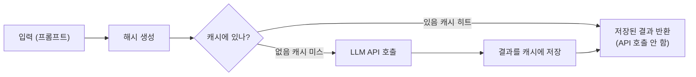

## 학습 목표

- LLM 캐싱으로 API 비용을 절감할 수 있다
- InMemoryCache와 SQLiteCache를 설정할 수 있다

<a id="toc"></a>

## 진행 순서

1. [왜 캐싱(Caching)이 필요한가?](#part1) - 캐싱의 필요성과 비용 절감 원리
2. [LangChain의 캐싱 구조](#part2) - InMemory, SQLite, Redis 비교
3. [기본 사용 예제](#part3) - InMemoryCache, SQLiteCache 실습
4. [LangChain 캐시의 동작 원리](#part4) - 해시 기반 캐시 흐름
5. [고급 사용법: 사용자 정의 캐시](#part5) - BaseCache 상속 커스텀 구현
6. [캐싱의 효과](#part6) - 비용/속도 비교
7. [정리 요약](#part7) - 핵심 키워드 정리

> **사전 준비:** [1장 개발환경](/llm/langchain/install)에서 `.env` 파일 설정과 패키지 설치를 완료한 상태에서 진행합니다. 모든 코드는 `.env`에 `OPENAI_API_KEY`가 설정되어 있어야 동작합니다.

---

# LangChain 모델 비용 & 캐싱

지금까지 프롬프트, 파서, 도구, 메모리를 배우면서 LLM을 여러 번 호출했습니다. 실습할수록 **API 비용**이 쌓이게 됩니다. 이번 챕터에서는 같은 질문에 대한 답변을 저장해서 비용을 절약하는 방법을 배웁니다.

### 단골 식당 비유

> 캐싱은 **자주 가는 식당의 단골 주문**과 같습니다. 처음 가면 메뉴를 보고 고르지만(API 호출), 매번 같은 메뉴를 시키면 사장님이 "아, 평소 그거요?"하고 바로 내줍니다(캐시 히트). 주문 시간(비용)이 절약됩니다.

---

<a id="part1"></a>

## 1. 왜 캐싱(Caching)이 필요한가? [↑](#toc)

LLM을 여러 번 호출하면 API 비용이 급격히 늘어납니다.  
LangChain은 동일한 요청에 대해 결과를 **자동으로 저장(Cache)** 하고,  
다음에 같은 입력이 들어올 때 API를 다시 호출하지 않도록 합니다.

> 💡 **핵심 개념:** "같은 질문에 같은 답변이면, 굳이 모델을 다시 부를 필요가 없다!"

---

<a id="part2"></a>

## 2. LangChain의 캐싱 구조 [↑](#toc)

LangChain의 캐싱은 `langchain_core.caches`(InMemoryCache)와 `langchain_community.cache`(SQLiteCache) 모듈에 구현되어 있습니다.

| 캐시 클래스 | 설명 | 저장 위치 |
|--------------|------|-------------|
| **InMemoryCache** | 메모리 기반 | Python 프로세스 내부 |
| **SQLiteCache** | 파일 기반 | 로컬 SQLite DB |
| **RedisCache** | 서버 기반 | Redis 서버 |

---

<a id="part3"></a>

## 3. 기본 사용 예제 [↑](#toc)

### ✅ (1) InMemoryCache 예시
```python
from dotenv import load_dotenv
load_dotenv()

from langchain_core.globals import set_llm_cache, get_llm_cache
from langchain_core.caches import InMemoryCache
from langchain_openai import ChatOpenAI
import time

# ✅ 전역 캐시 설정
cache = InMemoryCache()
set_llm_cache(cache)

llm = ChatOpenAI(model="gpt-4o-mini", temperature=0)  # temperature=0: 동일 입력 → 동일 출력 보장

prompt = "한국의 수도는 어디인가요?"

# 1️⃣ 첫 번째 호출 (API 요청 발생)
start = time.time()
response_1 = llm.invoke(prompt)
print(f"① 첫 번째 응답: {response_1.content}")
print(f"   (소요 시간: {time.time() - start:.2f}초)")

# 2️⃣ 두 번째 호출 (캐시에서 불러옴)
start = time.time()
response_2 = llm.invoke(prompt)
print(f"② 두 번째 응답: {response_2.content}")
print(f"   (소요 시간: {time.time() - start:.2f}초)")

# 3️⃣ 캐시 히트 여부 판별
if get_llm_cache():
    print("✅ LangChain 전역 캐시 활성화됨")
else:
    print("❌ 캐시 비활성 상태")

print("내용 동일 여부:", response_1.content == response_2.content)
```

> 💡 **Ollama 사용 시:** `from langchain_ollama import ChatOllama` 후 `llm = ChatOllama(model="gemma3:1b", temperature=0)`로 교체할 수 있습니다.

**실행 결과 (예시):**
```
① 첫 번째 응답: 한국의 수도는 서울입니다.
   (소요 시간: 1.23초)
② 두 번째 응답: 한국의 수도는 서울입니다.
   (소요 시간: 0.00초)
✅ LangChain 전역 캐시 활성화됨
내용 동일 여부: True
```

> 🧠 **포인트:** 첫 번째는 ~1초 걸리지만, 두 번째는 0.00초 — 실제 모델을 부르지 않고 캐시에서 즉시 반환합니다.
>
> **왜 `temperature=0`인가?** temperature가 0이 아니면 같은 질문에도 매번 다른 답변이 나올 수 있습니다. 캐시는 "같은 질문 = 같은 답변"일 때 의미가 있으므로 `temperature=0`을 권장합니다.

---

### ✅ (2) SQLiteCache 예시

```python
from dotenv import load_dotenv
load_dotenv()

import time
from langchain_core.globals import set_llm_cache, get_llm_cache
from langchain_community.cache import SQLiteCache
from langchain_openai import ChatOpenAI

# ✅ SQLite 캐시 파일 설정
cache = SQLiteCache(database_path=".langchain_cache.db")
set_llm_cache(cache)

llm = ChatOpenAI(model="gpt-4o-mini", temperature=0)

prompt = "한국의 수도는 어디인가요?"

# 1️⃣ 첫 번째 호출 (API 요청 발생)
start = time.time()
response_1 = llm.invoke(prompt)
print(f"① 첫 번째 응답: {response_1.content}")
print(f"   (소요 시간: {time.time() - start:.2f}초)")

# 2️⃣ 두 번째 호출 (캐시에서 불러옴)
start = time.time()
response_2 = llm.invoke(prompt)
print(f"② 두 번째 응답: {response_2.content}")
print(f"   (소요 시간: {time.time() - start:.2f}초)")

# 3️⃣ 캐시 확인
if get_llm_cache():
    print("✅ LangChain 전역 캐시 활성화됨")
else:
    print("❌ 캐시 비활성 상태")

print("내용 동일 여부:", response_1.content == response_2.content)

# 4️⃣ SQLite 파일 확인 안내
print("\n🗄️ '.langchain_cache.db' 파일이 현재 디렉토리에 생성되었습니다.")
print("   이 파일을 열어보면 동일한 프롬프트가 캐시에 저장된 것을 확인할 수 있습니다.")
```

**실행 결과 (예시):**
```
① 첫 번째 응답: 한국의 수도는 서울입니다.
   (소요 시간: 1.15초)
② 두 번째 응답: 한국의 수도는 서울입니다.
   (소요 시간: 0.01초)
✅ LangChain 전역 캐시 활성화됨
내용 동일 여부: True

🗄️ '.langchain_cache.db' 파일이 현재 디렉토리에 생성되었습니다.
   이 파일을 열어보면 동일한 프롬프트가 캐시에 저장된 것을 확인할 수 있습니다.
```

> ✅ InMemoryCache와 달리 **프로그램을 재시작해도** `.langchain_cache.db` 파일에 캐시가 남아있어 다시 같은 질문을 하면 API 호출 없이 즉시 응답합니다.

---

<a id="part4"></a>

## 4. LangChain 캐시의 동작 원리 [↑](#toc)

1️⃣ 입력(프롬프트)을 문자열로 변환 →  
2️⃣ 해당 문자열을 해시(Hash) 처리 →  
3️⃣ 캐시 저장소(InMemory / SQLite / Redis)에 Key-Value 형태로 저장 →  
4️⃣ 동일한 입력이 들어오면 저장된 결과를 즉시 반환



---

{: .warning }
> **여기부터 심화 내용입니다.** InMemoryCache와 SQLiteCache만으로도 실습에 충분합니다. 아래 내용은 필요할 때 돌아와서 학습해도 됩니다.

<a id="part5"></a>

## 5. 고급 사용법: 사용자 정의 캐시 [↑](#toc)

직접 커스텀 캐시를 구현하려면 `BaseCache` 클래스를 상속합니다.

```python
from dotenv import load_dotenv
load_dotenv()

from langchain_core.globals import set_llm_cache
from langchain_core.caches import BaseCache
from langchain_openai import ChatOpenAI

# 🧩 1️⃣ BaseCache를 상속받아 나만의 캐시 클래스 정의
class MyCache(BaseCache):
    def __init__(self):
        self.data = {}

    def lookup(self, prompt, llm_string):
        key = (prompt, llm_string)
        value = self.data.get(key)
        # prompt는 직렬화된 긴 문자열이므로, 앞 30자만 표시
        short = prompt[:30].replace('\n', ' ')
        if value:
            print(f"✅ 캐시 히트! (prompt: {short}...)")
        else:
            print(f"❌ 캐시 미스! (prompt: {short}...)")
        return value

    def update(self, prompt, llm_string, value):
        key = (prompt, llm_string)
        self.data[key] = value
        short = prompt[:30].replace('\n', ' ')
        print(f"💾 캐시 저장 완료 (prompt: {short}...)")

    def clear(self):
        """캐시 전체를 초기화하는 메서드"""
        self.data.clear()
        print("🧹 캐시 전체 초기화 완료")

# 🧠 2️⃣ 전역 캐시로 등록
set_llm_cache(MyCache())

# 🔹 테스트용 LLM
llm = ChatOpenAI(model="gpt-4o-mini", temperature=0)

prompt = "한국의 수도는 어디인가요?"

# 🔸 첫 번째 호출 → API 요청 + 캐시에 저장
response_1 = llm.invoke(prompt)
print("① 응답:", response_1.content)

# 🔸 두 번째 호출 → 캐시에서 불러옴
response_2 = llm.invoke(prompt)
print("② 응답:", response_2.content)

# 🔸 캐시 작동 여부 확인
print("내용 동일 여부:", response_1.content == response_2.content)
```

**실행 결과 (예시):**
```
❌ 캐시 미스! (prompt: [{"lc": 1, "type": "constru...)
💾 캐시 저장 완료 (prompt: [{"lc": 1, "type": "constru...)
① 응답: 한국의 수도는 서울입니다.
✅ 캐시 히트! (prompt: [{"lc": 1, "type": "constru...)
② 응답: 한국의 수도는 서울입니다.
내용 동일 여부: True
```

> 💡 `prompt`에 긴 직렬화 문자열이 표시되는 이유: LangChain은 프롬프트를 JSON으로 직렬화한 후 캐시 키로 사용합니다. 모델 이름, temperature 등의 설정도 키에 포함되어, 설정이 다르면 다른 캐시로 취급됩니다.

### 활용 예시: JSON 파일 캐시

위의 `MyCache`를 확장하면 JSON 파일에 캐시를 저장할 수 있습니다. SQLiteCache보다 단순하고, 파일을 직접 열어 내용을 확인할 수 있어 학습에 유용합니다.

```python
from dotenv import load_dotenv
load_dotenv()

import json
import hashlib
from langchain_core.globals import set_llm_cache
from langchain_core.caches import BaseCache
from langchain_openai import ChatOpenAI

CACHE_FILE = "llm_cache.json"

class JsonFileCache(BaseCache):
    """JSON 파일에 캐시를 저장하는 간단한 구현"""

    def __init__(self, file_path=CACHE_FILE):
        self.file_path = file_path
        try:
            with open(file_path, "r", encoding="utf-8") as f:
                self._data = json.load(f)
            print(f"📂 기존 캐시 로드: {len(self._data)}개 항목")
        except FileNotFoundError:
            self._data = {}
            print("📂 새 캐시 파일 생성")

    def _make_key(self, prompt, llm_string):
        raw = f"{prompt}||{llm_string}"
        return hashlib.md5(raw.encode()).hexdigest()

    def _save(self):
        with open(self.file_path, "w", encoding="utf-8") as f:
            json.dump(self._data, f, ensure_ascii=False, indent=2)

    def lookup(self, prompt, llm_string):
        key = self._make_key(prompt, llm_string)
        if key in self._data:
            print("✅ 캐시 히트!")
            from langchain_core.outputs import Generation
            return [Generation(text=self._data[key])]
        print("❌ 캐시 미스 — API 호출")
        return None

    def update(self, prompt, llm_string, return_val):
        key = self._make_key(prompt, llm_string)
        self._data[key] = return_val[0].text
        self._save()
        print("💾 캐시 저장 완료 → llm_cache.json")

    def clear(self, **kwargs):
        self._data = {}
        self._save()

# 캐시 등록
set_llm_cache(JsonFileCache())

llm = ChatOpenAI(model="gpt-4o-mini", temperature=0)

import time

# 첫 번째 호출 → API 호출 + JSON 파일에 저장
start = time.time()
resp1 = llm.invoke("한국의 수도는?")
print(f"① 응답: {resp1.content}")
print(f"   (소요 시간: {time.time() - start:.2f}초)")

# 두 번째 호출 → JSON 파일에서 불러옴
start = time.time()
resp2 = llm.invoke("한국의 수도는?")
print(f"② 응답: {resp2.content}")
print(f"   (소요 시간: {time.time() - start:.2f}초)")
```

**실행 결과 (예시):**
```
📂 새 캐시 파일 생성
❌ 캐시 미스 — API 호출
💾 캐시 저장 완료 → llm_cache.json
① 응답: 한국의 수도는 서울입니다.
   (소요 시간: 1.18초)
✅ 캐시 히트!
② 응답: 한국의 수도는 서울입니다.
   (소요 시간: 0.00초)
```

프로젝트 폴더에 생성된 `llm_cache.json`을 열어보면:

```json
{
  "a1b2c3d4e5f6...": "한국의 수도는 서울입니다."
}
```

> 💡 **활용 포인트:** `lookup`에서 저장소를 읽고, `update`에서 저장소에 쓰는 **두 메서드만 구현**하면 어떤 저장소든 캐시로 사용할 수 있습니다. JSON 파일 대신 Redis, MongoDB, 스프레드시트 등으로 교체하면 실서비스용 캐시가 됩니다.

---

<a id="part6"></a>

## 6. 캐싱의 효과 [↑](#toc)

| 항목 | 캐싱 미사용 | 캐싱 사용 |
|------|------------|----------|
| 같은 질문 재호출 시 | API 호출 발생 (비용 + 1~2초) | 캐시에서 즉시 반환 (무료 + 0.00초) |
| 프로그램 재시작 후 | 항상 API 재호출 | SQLiteCache: 캐시 유지 / InMemoryCache: 초기화 |
| 적합한 상황 | — | 반복 질문, 테스트, 동일 프롬프트 배치 처리 |

✅ **효과:** 실습 중 같은 질문을 여러 번 실행할 때 API 비용을 절감하고, 응답 속도가 즉시 반환으로 개선됩니다.

---

<a id="part7"></a>

## 7. 정리 요약 [↑](#toc)

| 키워드 | 설명 |
|---------|------|
| **set_llm_cache()** | LangChain 전역 캐시 설정 함수 |
| **InMemoryCache** | 메모리 기반 캐시, 간단한 실습용 |
| **SQLiteCache** | 파일 기반 캐시, 실제 환경에 적합 |
| **RedisCache** | 서버 캐시, 다중 사용자 환경에 적합 |
| **효과** | API 호출 감소, 속도 향상, 비용 절감 |

✅ **한 줄 요약:**
LangChain의 캐싱 기능은 *같은 질문엔 더 이상 요금이 청구되지 않게 만드는 강력한 절약 장치*입니다.

---

### 실습 과제

- **기본**: InMemoryCache를 설정하고, 같은 질문을 2번 호출하여 소요 시간 차이를 확인해 보세요
- **중급**: SQLiteCache로 변경 후, 프로그램을 재시작해도 캐시가 유지되는지 확인해 보세요
- **심화**: 자주 묻는 질문 5개를 미리 호출하여 캐시를 워밍업하는 스크립트를 만들어 보세요


→ **다음 장**: [9. 통합 실습](/llm/langchain/practice)
