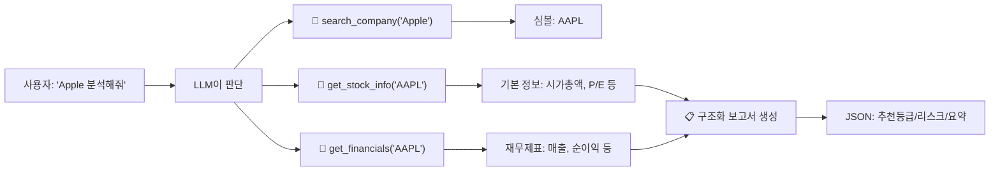

## 학습 목표

- yfinance 데이터를 LangChain 도구(@tool)로 연동하여 LLM이 자동으로 데이터를 수집하게 할 수 있다
- with_structured_output으로 구조화된 투자 보고서(JSON)를 생성할 수 있다
- Streamlit으로 투자보고서 생성 서비스를 배포할 수 있다

<a id="toc"></a>

## 진행 순서

1. [프로젝트 개요](#part1) - 전체 흐름 + 1~8장 개념 매핑
2. [환경 설정](#part2) - 패키지 설치, .env, 캐싱
3. [데이터 수집 도구 만들기](#part3) - yfinance를 @tool로 감싸기
4. [투자 보고서 체인 구성](#part4) - 프롬프트 + LCEL + 구조화 출력
5. [터미널에서 테스트](#part5) - bind_tools로 전체 흐름 확인
6. [Streamlit 웹 앱](#part6) - 투자보고서 생성 서비스
7. [실습 미션](#part7)

> **사전 준비:** [1장 개발환경](/llm/langchain/install)에서 `.env` 파일 설정과 패키지 설치를 완료한 상태에서 진행합니다.

---

# AI 투자보고서 생성 프로젝트

회사명을 입력하면 LLM이 **자동으로 주식 데이터를 수집**하고, **구조화된 투자 보고서(JSON)**를 생성하는 서비스를 만듭니다.

<a id="part1"></a>

## 1. 프로젝트 개요 [↑](#toc)

### 전체 흐름



### 1~8장 개념 매핑

| 개념 (장) | 이 프로젝트에서의 역할 |
|---|---|
| 1장: 환경 설정 | `.env`에서 API 키 로드 |
| 2장: LLM | `ChatOpenAI`로 보고서 생성 |
| 3장: LCEL | `prompt \| llm \| parser` 체인 |
| 4장: 프롬프트 | 금융 분석가 시스템 프롬프트 + 데이터 변수 |
| 5장: 파서 | `with_structured_output` → JSON 보고서 |
| 6장: 도구 | yfinance 조회를 `@tool`로 — LLM이 필요한 데이터를 판단 |
| 8장: 캐싱 | `SQLiteCache`로 같은 회사 재분석 시 비용 절감 |

---

<a id="part2"></a>

## 2. 환경 설정 [↑](#toc)

### 패키지 설치

```bash
uv add yfinance tabulate langchain langchain-openai langchain-community python-dotenv streamlit
```

### .env 파일

```
OPENAI_API_KEY=본인의_OpenAI_API키
```

> 💡 **Ollama 사용 시:** `OPENAI_API_KEY` 대신 Ollama를 사용할 수 있습니다. 코드에서 `ChatOpenAI` → `ChatOllama(model="gemma3:1b")` 로 교체하세요.

---

<a id="part3"></a>

## 3. 데이터 수집 도구 만들기 [↑](#toc)

기존에는 `Stock` 클래스를 직접 호출하여 데이터를 수집했습니다. 이번에는 **`@tool`로 감싸서 LLM이 필요한 데이터를 스스로 판단**하여 호출하게 합니다.

`tools_stock.py`
```python
import yfinance as yf                    # Yahoo Finance 데이터 라이브러리
import pandas as pd                      # 데이터 처리 (to_markdown 변환에 필요)
from langchain_core.tools import tool    # @tool 데코레이터 — 함수를 LLM 도구로 등록

# ========== 도구 1: 회사명 → 심볼 검색 ==========
# "Apple" 같은 회사명을 입력하면 "AAPL" 같은 주식 심볼을 찾아줍니다.
# LLM이 사용자 질문에서 회사명을 추출 → 이 도구를 호출하여 심볼 획득

@tool
def search_company(query: str) -> str:
    """회사명으로 주식 심볼(ticker)을 검색합니다. 예: 'Apple' → 'AAPL'"""
    try:
        # yf.Search: Yahoo Finance의 자동완성 검색 API
        results = yf.Search(query, max_results=5).quotes
        if not results:
            return f"'{query}'에 대한 검색 결과가 없습니다."
        lines = []
        for r in results:
            symbol = r.get("symbol", "")            # 심볼 (예: AAPL)
            name = r.get("longname") or r.get("shortname", "")  # 회사명
            exchange = r.get("exchange", "")         # 거래소 (예: NMS)
            lines.append(f"- {symbol}: {name} ({exchange})")
        return "검색 결과:\n" + "\n".join(lines)
    except Exception as e:
        return f"검색 실패: {e}"

# ========== 도구 2: 심볼 → 기본 정보 조회 ==========
# 시가총액, P/E, 현재가 등 회사의 핵심 지표를 가져옵니다.

@tool
def get_stock_info(symbol: str) -> str:
    """주식 심볼로 회사 기본 정보(시가총액, P/E, 업종 등)를 조회합니다."""
    try:
        info = yf.Ticker(symbol).info    # Yahoo Finance에서 회사 정보 딕셔너리 가져오기
        if not info or len(info) < 5:    # 데이터가 너무 적으면 실패 처리
            return f"'{symbol}'의 정보를 가져올 수 없습니다."
        # .get(key, default)로 안전하게 접근 — Yahoo가 키를 제거해도 에러 안 남
        return (
            f"회사명: {info.get('longName', 'N/A')}\n"
            f"업종: {info.get('industry', 'N/A')}\n"
            f"부문: {info.get('sector', 'N/A')}\n"
            f"시가총액: ${info.get('marketCap', 0):,.0f}\n"        # :,.0f → 쉼표 포함 정수
            f"현재가: ${info.get('currentPrice', 0):,.2f}\n"       # :,.2f → 소수점 2자리
            f"P/E (trailing): {info.get('trailingPE', 'N/A')}\n"   # 주가수익비율
            f"P/B: {info.get('priceToBook', 'N/A')}\n"             # 주가순자산비율
            f"EPS: {info.get('trailingEps', 'N/A')}\n"             # 주당순이익
            f"52주 최고: ${info.get('fiftyTwoWeekHigh', 0):,.2f}\n"
            f"52주 최저: ${info.get('fiftyTwoWeekLow', 0):,.2f}"
        )
    except Exception as e:
        return f"정보 조회 실패: {e}"

# ========== 도구 3: 심볼 → 재무제표 조회 ==========
# 분기별 손익계산서, 대차대조표, 현금흐름표를 마크다운 표로 반환합니다.

@tool
def get_financials(symbol: str) -> str:
    """주식 심볼로 분기별 재무제표(손익계산서, 대차대조표, 현금흐름표)를 조회합니다."""
    try:
        ticker = yf.Ticker(symbol)
        parts = []    # 각 재무제표를 문자열로 모아둘 리스트

        # --- 손익계산서 ---
        income = ticker.quarterly_income_stmt       # 분기별 손익계산서 DataFrame
        if not income.empty:
            rows = ["Total Revenue", "Gross Profit", "Operating Income", "Net Income"]
            available = [r for r in rows if r in income.index]   # 실제 존재하는 항목만
            if available:
                parts.append("### 분기별 손익계산서\n" + income.loc[available].to_markdown())

        # --- 대차대조표 ---
        balance = ticker.quarterly_balance_sheet
        if not balance.empty:
            rows = ["Total Assets", "Total Liabilities Net Minority Interest", "Stockholders Equity"]
            available = [r for r in rows if r in balance.index]
            if available:
                parts.append("### 분기별 대차대조표\n" + balance.loc[available].to_markdown())

        # --- 현금흐름표 ---
        cashflow = ticker.quarterly_cash_flow
        if not cashflow.empty:
            rows = ["Operating Cash Flow", "Investing Cash Flow", "Financing Cash Flow"]
            available = [r for r in rows if r in cashflow.index]
            if available:
                parts.append("### 분기별 현금흐름표\n" + cashflow.loc[available].to_markdown())

        # 모든 재무제표를 합쳐서 반환
        return "\n\n".join(parts) if parts else f"'{symbol}'의 재무제표를 가져올 수 없습니다."
    except Exception as e:
        return f"재무제표 조회 실패: {e}"

# 도구 리스트 — 다른 파일에서 import하여 사용
tools = [search_company, get_stock_info, get_financials]
```

> 💡 **@tool의 역할:** LLM이 사용자 질문을 보고 "이 도구를 써야겠다"고 판단합니다. 예를 들어 "Apple 분석해줘"라고 하면 `search_company("Apple")` → `get_stock_info("AAPL")` → `get_financials("AAPL")` 순서로 자동 호출합니다.

> 💡 **yfinance 주의:** Yahoo Finance API가 간헐적으로 일부 키를 반환하지 않을 수 있습니다. 모든 데이터 접근에 `.get(key, default)` 방어 코드를 사용합니다.

### 도구 개별 테스트

LLM에 연결하기 전에, 각 도구가 제대로 동작하는지 **직접 호출하여 확인**합니다.

```python
from tools_stock import search_company, get_stock_info, get_financials

# 도구 1: 회사명 → 심볼 검색
print("=== search_company ===")
print(search_company.invoke({"query": "Microsoft"}))

# 도구 2: 심볼 → 기본 정보
print("\n=== get_stock_info ===")
print(get_stock_info.invoke({"symbol": "MSFT"}))

# 도구 3: 심볼 → 재무제표
print("\n=== get_financials ===")
result = get_financials.invoke({"symbol": "MSFT"})
print(result[:300], "...")   # 길어서 앞 300자만 출력
```

**실행 결과 (예시):**
```
=== search_company ===
검색 결과:
- MSFT: Microsoft Corporation (NMS)
- MSFT.BA: Microsoft Corporation (BUE)
- MSF.DE: Microsoft Corporation (GER)

=== get_stock_info ===
회사명: Microsoft Corporation
업종: Software - Infrastructure
부문: Technology
시가총액: $3,100,000,000,000
현재가: $420.50
P/E (trailing): 35.2
P/B: 12.8
EPS: 11.95
52주 최고: $468.35
52주 최저: $344.79

=== get_financials ===
### 분기별 손익계산서
|                   | 2025-03-31   | 2024-12-31   | ...
| Total Revenue     | 69,632,000   | 65,585,000   | ...
| Net Income        | 24,108,000   | 21,870,000   | ...
```

> 3개 도구 모두 정상 동작하면, 다음 단계에서 LLM에 연결합니다. 에러가 나면 `.env`의 API 키나 네트워크 연결을 확인하세요.

---

<a id="part4"></a>

## 4. 투자 보고서 체인 구성 [↑](#toc)

### 구조화 출력 스키마 정의

`report_schema.py`
```python
from pydantic import BaseModel, Field    # Pydantic — JSON 스키마를 Python 클래스로 정의
from typing import Literal               # Literal — 허용 값을 제한 ("매수"/"보유"/"매도" 중 하나만)

# LLM의 응답을 이 구조에 맞춰 JSON으로 반환하게 합니다 (5장 with_structured_output)
# 각 Field의 description은 LLM이 "이 필드에 뭘 넣어야 하는지" 판단하는 데 사용됩니다

class InvestmentReport(BaseModel):
    """구조화된 투자 분석 보고서"""
    symbol: str = Field(description="주식 심볼 (예: AAPL)")
    company_name: str = Field(description="회사명")
    recommendation: Literal["매수", "보유", "매도"] = Field(
        description="투자 추천 의견"
    )
    risk_level: Literal["낮음", "보통", "높음"] = Field(
        description="리스크 수준"
    )
    current_price: str = Field(description="현재 주가")
    pe_ratio: str = Field(description="P/E 비율")
    summary: str = Field(description="2~3문장의 투자 요약")
    key_strengths: list[str] = Field(description="핵심 강점 3가지")
    key_risks: list[str] = Field(description="핵심 리스크 3가지")
    conclusion: str = Field(description="최종 결론 한 문장")
```

> `Literal["매수", "보유", "매도"]`는 LLM이 이 3개 값 중 하나만 선택하게 강제합니다. "적극 매수" 같은 임의 값이 들어오지 않습니다.

### 보고서 생성 서비스

`reporting_service.py`
```python
from dotenv import load_dotenv
load_dotenv()                                          # .env에서 OPENAI_API_KEY 로드

from langchain_openai import ChatOpenAI                # OpenAI LLM
from langchain_core.prompts import ChatPromptTemplate  # 프롬프트 템플릿 (4장)
from langchain_core.output_parsers import StrOutputParser  # 텍스트 출력 파서 (5장)
from langchain_core.globals import set_llm_cache       # 전역 캐시 설정 (8장)
from langchain_community.cache import SQLiteCache      # SQLite 파일 캐시 (8장)

from report_schema import InvestmentReport             # 위에서 정의한 JSON 스키마

# ===== [8장] 캐싱 설정 =====
# 같은 회사를 다시 분석하면 LLM을 호출하지 않고 캐시에서 즉시 반환
# report_cache.db 파일이 프로젝트 폴더에 자동 생성됩니다
set_llm_cache(SQLiteCache(database_path="report_cache.db"))

# ===== [2장] LLM 초기화 =====
# temperature=0.2: 사실 기반 분석이므로 낮은 창의성
llm = ChatOpenAI(model="gpt-4o-mini", temperature=0.2)

# ===== [4장] 프롬프트 =====
# {company}, {symbol}, {stock_info}, {financials} — 4개의 변수를 받는 템플릿
# system: LLM의 역할 설정 (금융 분석가)
# human: 사용자 요청 + 도구가 수집한 데이터를 변수로 전달
report_prompt = ChatPromptTemplate.from_messages([
    ("system",
     "당신은 경험이 풍부한 금융 분석가입니다.\n"
     "제공된 기업 기본 정보와 재무제표를 바탕으로 투자 보고서를 작성합니다.\n"
     "데이터에 기반한 객관적인 분석을 하고, 근거 없는 추측은 하지 마세요.\n"
     "한국어로 작성합니다."),
    ("human",
     "{company} ({symbol}) 주식에 대한 투자 보고서를 작성해주세요.\n\n"
     "기본 정보:\n{stock_info}\n\n"
     "재무제표:\n{financials}"),
])

# ===== [3장] LCEL 체인 2개 =====

# 체인 A: 마크다운 보고서 — 프롬프트 → LLM → 텍스트 출력
# 사람이 읽기 좋은 형태 (Streamlit 왼쪽에 표시)
markdown_chain = report_prompt | llm | StrOutputParser()

# 체인 B: 구조화(JSON) 보고서 — 프롬프트 → LLM(스키마 강제) → Pydantic 객체
# 프로그램이 처리하기 좋은 형태 (Streamlit 오른쪽에 표시)
structured_chain = report_prompt | llm.with_structured_output(InvestmentReport)


# ===== 외부에서 호출할 함수 2개 =====

def generate_markdown_report(company: str, symbol: str, stock_info: str, financials: str) -> str:
    """마크다운 형식의 투자 보고서를 생성합니다."""
    return markdown_chain.invoke({
        "company": company,        # 회사명 (예: "Microsoft")
        "symbol": symbol,          # 심볼 (예: "MSFT")
        "stock_info": stock_info,  # get_stock_info 도구의 결과 문자열
        "financials": financials,  # get_financials 도구의 결과 문자열
    })


def generate_structured_report(company: str, symbol: str, stock_info: str, financials: str) -> InvestmentReport:
    """구조화된(JSON) 투자 보고서를 생성합니다. InvestmentReport 객체 반환."""
    return structured_chain.invoke({
        "company": company,
        "symbol": symbol,
        "stock_info": stock_info,
        "financials": financials,
    })
```

---

<a id="part5"></a>

## 5. 터미널에서 테스트 [↑](#toc)

도구 + 보고서 생성 전체 흐름을 터미널에서 확인합니다.

`test_report.py`
```python
from dotenv import load_dotenv
load_dotenv()

import json
import time
from langchain_openai import ChatOpenAI
from langchain_core.messages import HumanMessage, ToolMessage  # 메시지 타입 (6장)

# 다른 파일에서 도구와 보고서 함수 가져오기
from tools_stock import tools, search_company, get_stock_info, get_financials
from reporting_service import generate_markdown_report, generate_structured_report

# ===== [6장] bind_tools — LLM에 도구 연결 =====
llm = ChatOpenAI(model="gpt-4o-mini", temperature=0)
llm_with_tools = llm.bind_tools(tools)                 # LLM에 3개 도구 바인딩
tools_by_name = {t.name: t for t in tools}             # {"search_company": 함수, ...} 딕셔너리

def collect_data(query: str) -> dict:
    """
    LLM이 도구를 사용하여 회사 데이터를 수집합니다.
    6장에서 배운 bind_tools + 수동 실행 루프를 사용합니다.

    흐름: 사용자 질문 → LLM이 도구 선택 → 도구 실행 → 결과를 LLM에 반환 → 반복
    """
    # 첫 메시지: LLM에게 "심볼 검색 → 기본 정보 → 재무제표 순서로 조회하라"고 지시
    messages = [HumanMessage(content=f"{query} 회사의 심볼을 검색하고, 기본 정보와 재무제표를 조회해주세요.")]

    # 수집된 데이터를 담을 딕셔너리
    collected = {"company": query, "symbol": "", "stock_info": "", "financials": ""}

    # 도구 호출 루프 — LLM이 "더 이상 도구가 필요 없다"고 판단할 때까지 반복 (최대 5회)
    for _ in range(5):
        ai_msg = llm_with_tools.invoke(messages)       # LLM에게 현재 대화 전달
        messages.append(ai_msg)                        # LLM 응답을 대화에 추가

        if not ai_msg.tool_calls:                      # 도구 호출 요청이 없으면 → 종료
            break

        # LLM이 요청한 도구들을 하나씩 실행
        for tc in ai_msg.tool_calls:
            tool_fn = tools_by_name[tc["name"]]        # 도구 이름으로 함수 찾기
            result = tool_fn.invoke(tc["args"])         # 도구 실행 (yfinance API 호출)
            # 실행 결과를 ToolMessage로 변환하여 대화에 추가 → LLM이 다음 판단에 사용
            messages.append(ToolMessage(content=str(result), tool_call_id=tc["id"]))
            print(f"  🔧 {tc['name']}({tc['args']}) 완료")

            # 결과를 collected 딕셔너리에 저장 (나중에 보고서 생성에 사용)
            if tc["name"] == "get_stock_info":
                collected["stock_info"] = str(result)
                if "symbol" in tc["args"]:
                    collected["symbol"] = tc["args"]["symbol"]
            elif tc["name"] == "get_financials":
                collected["financials"] = str(result)
            elif tc["name"] == "search_company":
                collected["symbol"] = tc["args"].get("query", query)

    return collected


# ===== 테스트 실행 =====
print("=" * 50)
print("  AI 투자보고서 생성 테스트")
print("=" * 50)

company = "Microsoft"
print(f"\n📊 '{company}' 데이터 수집 중...")
data = collect_data(company)           # Step 1: LLM이 도구로 데이터 수집

print(f"\n📝 마크다운 보고서 생성 중...")
start = time.time()
md_report = generate_markdown_report(**data)   # Step 2: 마크다운 보고서 생성
print(f"   ⏱️ {time.time() - start:.2f}초")
print(f"\n{md_report[:500]}...\n")             # 앞 500글자만 미리보기

print(f"📋 구조화 보고서(JSON) 생성 중...")
start = time.time()
json_report = generate_structured_report(**data)  # Step 3: JSON 보고서 생성
print(f"   ⏱️ {time.time() - start:.2f}초")
# .model_dump() → Pydantic 객체를 딕셔너리로 변환 → json.dumps로 예쁘게 출력
print(json.dumps(json_report.model_dump(), ensure_ascii=False, indent=2))
```

```bash
python test_report.py
```

**실행 결과 (예시):**
```
==================================================
  AI 투자보고서 생성 테스트
==================================================

📊 'Microsoft' 데이터 수집 중...
  🔧 search_company({'query': 'Microsoft'}) 완료
  🔧 get_stock_info({'symbol': 'MSFT'}) 완료
  🔧 get_financials({'symbol': 'MSFT'}) 완료

📝 마크다운 보고서 생성 중...
   ⏱️ 3.42초

# Microsoft (MSFT) 투자 분석 보고서

## 1. 기업 개요
Microsoft Corporation은 글로벌 기술 기업으로, 클라우드 서비스(Azure),
생산성 도구(Office 365), AI 사업을 주력으로 하고 있습니다...

📋 구조화 보고서(JSON) 생성 중...
   ⏱️ 2.18초
{
  "symbol": "MSFT",
  "company_name": "Microsoft Corporation",
  "recommendation": "매수",
  "risk_level": "보통",
  "current_price": "$420.50",
  "pe_ratio": "35.2",
  "summary": "Microsoft는 클라우드와 AI 사업의 강한 성장세를 보이고 있으며...",
  "key_strengths": [
    "Azure 클라우드 매출 30% 이상 성장",
    "OpenAI 투자를 통한 AI 시장 선점",
    "안정적인 Office 365 구독 매출"
  ],
  "key_risks": [
    "높은 P/E 비율로 인한 밸류에이션 부담",
    "AI 투자 비용 증가로 인한 단기 수익성 압박",
    "글로벌 경기 둔화 시 기업 IT 지출 감소 가능성"
  ],
  "conclusion": "Microsoft는 AI와 클라우드 성장에 기반한 장기 투자 매력이 높으며, 현재 가격에서 매수를 권장합니다."
}
```

---

<a id="part6"></a>

## 6. Streamlit 웹 앱 [↑](#toc)

`app.py`
```python
import streamlit as st
import yfinance as yf
import json
import time

from dotenv import load_dotenv
load_dotenv()

# 다른 파일에서 도구와 보고서 함수 가져오기
from tools_stock import get_stock_info, get_financials
from reporting_service import generate_markdown_report, generate_structured_report

# ===== 페이지 기본 설정 =====
st.set_page_config(page_title="AI 투자보고서", page_icon="📊", layout="wide")
st.title("📊 AI 투자보고서 생성 서비스")
st.caption("1~8장 개념 적용 | 도구 + LCEL + 구조화 출력 + 캐싱")

# ===== 사이드바: 회사 검색 + 심볼 선택 =====
with st.sidebar:
    st.header("회사 검색")
    query = st.text_input("회사명을 입력하세요", "Apple")

    # [검색] 버튼 → yf.Search로 Yahoo Finance 검색 → 결과를 session_state에 저장
    if st.button("🔍 검색", use_container_width=True):
        with st.spinner("검색 중..."):
            try:
                results = yf.Search(query, max_results=10).quotes  # Yahoo 자동완성 API
                # 검색 결과에서 심볼과 회사명만 추출하여 저장
                st.session_state.search_results = [
                    {"symbol": r.get("symbol", ""), "name": r.get("longname") or r.get("shortname", "")}
                    for r in results if r.get("symbol")
                ]
            except Exception as e:
                st.error(f"검색 실패: {e}")
                st.session_state.search_results = []

    # 검색 결과가 있으면 → selectbox(드롭다운)로 선택
    # 검색 결과가 없으면 → 심볼 직접 입력 (한국 종목 등)
    search_results = st.session_state.get("search_results", [])
    if search_results:
        options = [f"{r['symbol']}: {r['name']}" for r in search_results]
        selected = st.selectbox("검색 결과에서 선택하세요", options)
        selected_symbol = selected.split(":")[0].strip() if selected else ""
    else:
        selected_symbol = st.text_input("심볼을 직접 입력하세요", "AAPL")

    st.markdown(f"**선택된 심볼:** `{selected_symbol}`")

    # [보고서 생성] 버튼 → 메인 영역에서 처리
    if st.button("📊 보고서 생성", use_container_width=True, disabled=not selected_symbol):
        st.session_state.target_symbol = selected_symbol
        st.session_state.generate = True     # 메인 영역의 if문을 트리거

# ===== 메인 영역: 보고서 생성 =====
if st.session_state.get("generate"):
    symbol = st.session_state.target_symbol
    st.session_state.generate = False        # 한 번만 실행되도록 리셋

    col1, col2 = st.columns([1, 1])         # 왼쪽: 마크다운, 오른쪽: JSON

    # ---- 데이터 수집 (tools_stock.py의 도구 직접 호출) ----
    with st.status("데이터 수집 중...", expanded=True) as status:
        st.write(f"🔧 {symbol} 기본 정보 조회...")
        stock_info = get_stock_info.invoke({"symbol": symbol})    # 도구 직접 호출

        st.write(f"🔧 {symbol} 재무제표 조회...")
        financials = get_financials.invoke({"symbol": symbol})    # 도구 직접 호출

        status.update(label="데이터 수집 완료!", state="complete", expanded=False)

    # ---- 왼쪽: 마크다운 보고서 ----
    with col1:
        st.header("📝 투자 보고서")
        start = time.time()
        with st.spinner("보고서 생성 중..."):
            md_report = generate_markdown_report(
                company=symbol, symbol=symbol,
                stock_info=str(stock_info), financials=str(financials),
            )
        st.caption(f"⏱️ {time.time() - start:.2f}초")
        st.markdown(md_report)               # 마크다운 렌더링

    # ---- 오른쪽: 구조화 보고서 (JSON) ----
    with col2:
        st.header("📋 구조화 분석 (JSON)")
        start = time.time()
        with st.spinner("구조화 보고서 생성 중..."):
            try:
                structured = generate_structured_report(
                    company=symbol, symbol=symbol,
                    stock_info=str(stock_info), financials=str(financials),
                )
                st.caption(f"⏱️ {time.time() - start:.2f}초")

                # 추천 등급을 색상으로 표시 (매수=초록, 보유=주황, 매도=빨강)
                rec_color = {"매수": "green", "보유": "orange", "매도": "red"}
                st.markdown(f"### 추천: :{rec_color.get(structured.recommendation, 'gray')}[{structured.recommendation}]")
                st.markdown(f"**리스크:** {structured.risk_level}")
                st.markdown(f"**요약:** {structured.summary}")

                st.subheader("핵심 강점")
                for s in structured.key_strengths:
                    st.markdown(f"- ✅ {s}")

                st.subheader("핵심 리스크")
                for r in structured.key_risks:
                    st.markdown(f"- ⚠️ {r}")

                st.markdown(f"**결론:** {structured.conclusion}")

                # JSON 원본을 접을 수 있는 패널로 표시
                with st.expander("원본 JSON 보기"):
                    st.json(structured.model_dump())    # Pydantic → dict → JSON 표시
            except Exception as e:
                st.error(f"구조화 보고서 생성 실패: {e}")

    # ---- 하단: 수집된 원본 데이터 (디버깅용) ----
    with st.expander("📄 수집된 원본 데이터"):
        st.subheader("기본 정보")
        st.text(stock_info)
        st.subheader("재무제표")
        st.text(financials)
```

```bash
streamlit run app.py --server.port 8501
```

### 프로젝트 파일 구조

```
투자보고서_프로젝트/
├── .env                      ← API 키
├── tools_stock.py            ← [6장] @tool — yfinance 도구 3개
├── report_schema.py          ← [5장] Pydantic 스키마 — InvestmentReport
├── reporting_service.py      ← [3장][4장][8장] 체인 + 프롬프트 + 캐싱
├── test_report.py            ← [6장] bind_tools 테스트 (터미널)
├── app.py                    ← Streamlit 웹 앱
└── report_cache.db           ← [8장] SQLite 캐시 (자동 생성)
```

---

<a id="part7"></a>

## 7. 실습 미션 [↑](#toc)

### 기본

- `test_report.py`를 실행하고, Microsoft 외에 Apple, NVIDIA 등 다른 회사의 보고서를 생성해보세요. 한국 종목(삼성전자 등)은 `yf.Search`로 검색되지 않으므로, 심볼(`005930.KS`)을 직접 입력하세요
- 같은 회사를 두 번 실행하여 캐시 효과(응답 시간 차이)를 확인해보세요
- Streamlit 앱에서 여러 회사를 검색하고 보고서를 비교해보세요

### 중급

- `InvestmentReport` 스키마에 `target_price: str` (목표 주가) 필드를 추가하고, 보고서에 포함되도록 수정해보세요
- `tools_stock.py`에 `get_news(symbol)` 도구를 추가하여 최근 뉴스도 보고서에 반영되도록 해보세요 (힌트: `yfinance.Ticker(symbol).news`)
- Streamlit 앱에 보고서 다운로드 버튼(`st.download_button`)을 추가해보세요

### 심화

- `reporting_service.py`에서 `ChatOpenAI` → `ChatOllama`로 교체하고, 보고서 품질을 비교해보세요
- 여러 회사를 한 번에 분석하여 비교 보고서를 생성하는 기능을 만들어보세요


→ **다음 장**: [11. Retrieval-Augmented Generation (RAG)](/llm/langchain/rag)
