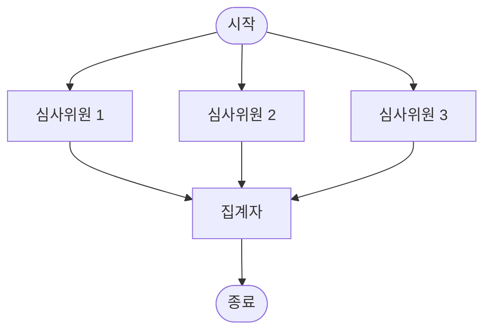

# 상태 관리 심화

LangGraph의 그래프에서 "상태(State)"는 노드 간에 공유되는 데이터입니다.
앞 단원에서는 `messages` 필드 하나만 다뤘지만, 실제 애플리케이션에서는 훨씬 다양한 데이터를 상태로 관리해야 합니다.
이 단원에서는 상태 필드의 값이 어떻게 업데이트되는지를 결정하는 **Reducer 패턴**과, 복잡한 상태를 설계하는 방법을 배웁니다.

## 학습 목표

- Reducer 패턴을 이해하고 사용할 수 있다
- 복잡한 상태를 설계할 수 있다
- MessagesState를 활용할 수 있다

<a id="toc"></a>

## 진행 순서

1. [Reducer란?](#part1)
2. [Reducer 패턴 실습](#part2)
3. [복잡한 상태 설계](#part3)
4. [MessagesState 활용하기](#part4)
5. [실습: 투표 집계 그래프](#part5)
6. [정리](#part6)

<a id="part1"></a>

## 1️⃣ Reducer란? [↑](#toc)

### 비유: 여러 사람이 같은 노트에 적는 방식

여러 사람이 같은 공유 문서에 글을 쓴다고 상상해 보세요.

- **덮어쓰기 방식**: A가 "사과"라고 적고, B가 "바나나"라고 적으면 문서에는 "바나나"만 남습니다.
- **추가 방식**: A가 "사과"라고 적고, B가 "바나나"라고 적으면 문서에는 "사과, 바나나" 둘 다 남습니다.

LangGraph의 기본 동작은 **덮어쓰기**입니다. 노드가 상태 필드 값을 반환하면, 기존 값을 새 값으로 완전히 교체합니다.

**Reducer**를 사용하면 "어떻게 합칠지"를 직접 정의할 수 있습니다. 가장 흔한 Reducer는 리스트에 새 항목을 추가하는 것입니다.

### 기본 동작 vs Reducer 비교

| 항목 | 기본 (덮어쓰기) | Reducer (누적) |
|------|----------------|----------------|
| 노드 A 반환값 | `{"score": 10}` | `{"score": 10}` |
| 노드 B 반환값 | `{"score": 20}` | `{"score": 20}` |
| 최종 `score` | `20` (덮어씌워짐) | `30` (합산됨) |
| 사용 방법 | `score: int` | `score: Annotated[int, operator.add]` |
| 적합한 경우 | 단일 값 업데이트 | 여러 노드가 값을 누적할 때 |

### Reducer를 사용하는 이유

병렬로 실행되는 여러 노드가 같은 필드에 값을 추가하려 할 때, 기본 덮어쓰기 방식을 사용하면 마지막에 실행된 노드의 값만 남습니다. Reducer를 사용하면 모든 노드의 결과를 하나로 합칠 수 있습니다.

> 💡 **`add_messages`도 Reducer입니다.** 앞 단원에서 사용한 `Annotated[list, add_messages]`는 메시지 리스트를 누적하는 Reducer였습니다. 같은 원리로 다른 타입에도 Reducer를 적용할 수 있습니다.

<a id="part2"></a>

## 2️⃣ Reducer 패턴 실습 [↑](#toc)

### 예제 1: 리스트 누적 — `operator.add`

`operator.add`를 Reducer로 사용하면 여러 노드에서 반환한 리스트가 하나로 합쳐집니다.

```python
import operator
from typing import Annotated
from typing_extensions import TypedDict
from langgraph.graph import StateGraph, START, END

# Annotated[list, operator.add] — 리스트를 이어붙이는 Reducer
class State(TypedDict):
    items: Annotated[list, operator.add]

def node_a(state: State):
    print("노드 A 실행")
    return {"items": ["사과"]}

def node_b(state: State):
    print("노드 B 실행")
    return {"items": ["바나나"]}

def node_c(state: State):
    print("노드 C 실행")
    return {"items": ["체리"]}

# 그래프 구성
builder = StateGraph(State)
builder.add_node("node_a", node_a)
builder.add_node("node_b", node_b)
builder.add_node("node_c", node_c)

# START -> node_a -> node_b -> node_c -> END 순서로 실행
builder.add_edge(START, "node_a")
builder.add_edge("node_a", "node_b")
builder.add_edge("node_b", "node_c")
builder.add_edge("node_c", END)

graph = builder.compile()
result = graph.invoke({"items": []})
print("최종 상태:", result["items"])
```

**실행 결과 (예시):**
```
노드 A 실행
노드 B 실행
노드 C 실행
최종 상태: ['사과', '바나나', '체리']
```

> 💡 **기본 동작이었다면?** Reducer 없이 `items: list`로 선언했다면 최종 결과는 `['체리']`만 남았을 것입니다.

### 예제 2: 숫자 누적 — `operator.add`

리스트뿐만 아니라 숫자에도 `operator.add`를 사용할 수 있습니다.

```python
import operator
from typing import Annotated
from typing_extensions import TypedDict
from langgraph.graph import StateGraph, START, END

class State(TypedDict):
    total_score: Annotated[int, operator.add]

def judge_1(state: State):
    score = 85
    print(f"심사위원 1 점수: {score}")
    return {"total_score": score}

def judge_2(state: State):
    score = 90
    print(f"심사위원 2 점수: {score}")
    return {"total_score": score}

def judge_3(state: State):
    score = 78
    print(f"심사위원 3 점수: {score}")
    return {"total_score": score}

builder = StateGraph(State)
builder.add_node("judge_1", judge_1)
builder.add_node("judge_2", judge_2)
builder.add_node("judge_3", judge_3)

builder.add_edge(START, "judge_1")
builder.add_edge("judge_1", "judge_2")
builder.add_edge("judge_2", "judge_3")
builder.add_edge("judge_3", END)

graph = builder.compile()
result = graph.invoke({"total_score": 0})
print(f"총합: {result['total_score']}")
print(f"평균: {result['total_score'] / 3:.1f}")
```

**실행 결과 (예시):**
```
심사위원 1 점수: 85
심사위원 2 점수: 90
심사위원 3 점수: 78
총합: 253
평균: 84.3
```

### 예제 3: 커스텀 Reducer — 중복 제거

기본 제공 함수 대신 직접 정의한 함수를 Reducer로 사용할 수 있습니다.

```python
import operator
from typing import Annotated
from typing_extensions import TypedDict
from langgraph.graph import StateGraph, START, END

# 중복을 제거하는 커스텀 Reducer 함수
def deduplicate(existing: list, new: list) -> list:
    """기존 리스트와 새 리스트를 합치되 중복은 제거합니다."""
    return list(set(existing + new))

class State(TypedDict):
    tags: Annotated[list, deduplicate]

def tagger_a(state: State):
    return {"tags": ["python", "langgraph", "ai"]}

def tagger_b(state: State):
    # "python"은 tagger_a와 중복 — 최종 결과에 한 번만 나타납니다
    return {"tags": ["python", "llm", "chatbot"]}

builder = StateGraph(State)
builder.add_node("tagger_a", tagger_a)
builder.add_node("tagger_b", tagger_b)

builder.add_edge(START, "tagger_a")
builder.add_edge("tagger_a", "tagger_b")
builder.add_edge("tagger_b", END)

graph = builder.compile()
result = graph.invoke({"tags": []})
print("태그 목록 (중복 없음):", sorted(result["tags"]))
```

**실행 결과 (예시):**
```
태그 목록 (중복 없음): ['ai', 'chatbot', 'langgraph', 'llm', 'python']
```

> ⚠️ **커스텀 Reducer 함수 시그니처:** Reducer 함수는 반드시 `(existing_value, new_value) -> merged_value` 형태여야 합니다. 첫 번째 인자는 현재 상태의 값, 두 번째 인자는 노드가 반환한 새 값입니다.

<a id="part3"></a>

## 3️⃣ 복잡한 상태 설계 [↑](#toc)

실제 애플리케이션에서는 단순한 문자열이나 리스트 하나가 아니라, 여러 필드를 가진 복잡한 상태를 관리해야 합니다.

### Nested TypedDict 패턴

TypedDict 안에 또 다른 TypedDict를 중첩하여 구조화된 상태를 표현할 수 있습니다.

```python
from typing import Optional
from typing_extensions import TypedDict

class UserProfile(TypedDict):
    name: str
    age: int
    preferences: list

class ConversationState(TypedDict):
    user: UserProfile           # 중첩된 TypedDict
    session_id: str
    turn_count: int
    is_resolved: bool
```

### Optional 필드와 기본값

모든 필드가 처음부터 값을 가지지 않아도 됩니다. `Optional`을 사용하면 `None`을 허용하는 필드를 선언할 수 있습니다.

```python
from typing import Optional, Annotated
import operator
from typing_extensions import TypedDict

class State(TypedDict):
    # 필수 필드
    query: str
    # Optional 필드 — 값이 없을 수 있음
    search_result: Optional[str]
    # Reducer 필드 — 누적됨
    visited_nodes: Annotated[list, operator.add]
    # 진행 상태 플래그
    is_complete: bool
```

> 💡 **`None` 체크를 잊지 마세요.** Optional 필드를 사용하는 노드에서는 `if state["search_result"] is not None:` 과 같이 반드시 None 체크를 해야 합니다.

### 상태 필드 설계 원칙

좋은 상태 설계를 위한 세 가지 원칙입니다.

1. **필요한 것만 담기**: 상태는 노드 간 전달이 필요한 데이터만 포함합니다. 한 노드 내부에서만 사용하는 임시 변수는 상태에 넣지 않아도 됩니다.
2. **명확한 이름 사용**: `data`나 `result` 같은 모호한 이름 대신 `search_result`, `user_query` 같이 의미가 분명한 이름을 사용합니다.
3. **적절한 타입 선택**: 여러 노드가 누적해야 하면 Reducer를, 하나의 노드만 설정하면 일반 타입을 사용합니다.

### 코드 예제: 음식 추천 시스템 상태 설계

```python
import operator
from typing import Annotated, Optional
from typing_extensions import TypedDict

class FoodRecommendation(TypedDict):
    """음식 추천 하나를 나타내는 구조"""
    name: str           # 음식 이름
    reason: str         # 추천 이유
    score: float        # 추천 점수 (0~10)

class FoodRecommenderState(TypedDict):
    # 사용자 입력
    user_query: str                         # "오늘 점심 뭐 먹을까?"
    dietary_restrictions: list              # ["채식주의", "견과류 알레르기"]
    
    # 노드들이 누적하는 추천 목록 (Reducer 사용)
    recommendations: Annotated[list, operator.add]
    
    # 최종 선택 (단일 노드가 설정)
    final_choice: Optional[FoodRecommendation]
    
    # 진행 상태
    is_complete: bool

# 상태 초기화 예시
initial_state: FoodRecommenderState = {
    "user_query": "오늘 점심 뭐 먹을까?",
    "dietary_restrictions": [],
    "recommendations": [],
    "final_choice": None,
    "is_complete": False,
}
```

<a id="part4"></a>

## 4️⃣ MessagesState 활용하기 [↑](#toc)

LangGraph는 챗봇 개발에 자주 쓰이는 패턴을 위해 `MessagesState`를 기본으로 제공합니다.

### MessagesState란?

`MessagesState`는 LangGraph가 미리 정의해 둔 상태 클래스입니다. `messages` 필드가 `add_messages` Reducer와 함께 자동으로 포함됩니다.

### 직접 정의한 State vs MessagesState 비교

**직접 정의하는 방식:**
```python
from langgraph.graph.message import add_messages
from typing import Annotated
from typing_extensions import TypedDict

class State(TypedDict):
    messages: Annotated[list, add_messages]
```

**MessagesState를 사용하는 방식:**
```python
from langgraph.graph import MessagesState

# 위의 State와 완전히 동일한 동작
# messages 필드가 add_messages Reducer와 함께 자동 포함됨
```

두 방식은 기능적으로 동일합니다. `MessagesState`는 타이핑을 줄여주는 편의 클래스입니다.

### MessagesState를 확장하여 추가 필드 포함하기

`MessagesState`를 상속하면 `messages` 필드는 그대로 유지하면서 추가 필드를 붙일 수 있습니다.

```python
from langgraph.graph import MessagesState
from typing import Optional

# MessagesState 상속으로 messages 필드 자동 포함
class ExtendedState(MessagesState):
    user_name: Optional[str]    # 사용자 이름 (처음에는 None)
    language: str               # 응답 언어 ("ko", "en" 등)
    session_count: int          # 이번 세션의 대화 횟수

# 그래프에서 사용 예시
from langgraph.graph import StateGraph, START, END
from langchain_openai import ChatOpenAI
import os
from dotenv import load_dotenv

load_dotenv()
openai_model = os.getenv("OPENAI_MODEL", "gpt-4o-mini")
llm = ChatOpenAI(model=openai_model)

def chatbot(state: ExtendedState):
    # 대화 횟수 증가 (덮어쓰기)
    new_count = state.get("session_count", 0) + 1
    response = llm.invoke(state["messages"])
    return {
        "messages": [response],
        "session_count": new_count,
    }

builder = StateGraph(ExtendedState)
builder.add_node("chatbot", chatbot)
builder.add_edge(START, "chatbot")
builder.add_edge("chatbot", END)
graph = builder.compile()

result = graph.invoke({
    "messages": [("user", "안녕하세요!")],
    "language": "ko",
    "session_count": 0,
})
print("응답:", result["messages"][-1].content)
print("대화 횟수:", result["session_count"])
```

**실행 결과 (예시):**
```
응답: 안녕하세요! 무엇을 도와드릴까요?
대화 횟수: 1
```

### 언제 각각을 사용할까?

| 상황 | 권장 방식 |
|------|-----------|
| 단순 챗봇, messages만 필요 | `MessagesState` 직접 사용 |
| messages + 추가 필드 필요 | `MessagesState` 상속 |
| messages 없이 커스텀 상태만 필요 | `TypedDict` 직접 정의 |
| 여러 종류의 Reducer가 필요 | `TypedDict` 직접 정의 |

<a id="part5"></a>

## 5️⃣ 실습: 투표 집계 그래프 [↑](#toc)

### 시나리오

3명의 심사위원이 각각 점수를 독립적으로 매기고, 마지막 집계 노드가 평균을 계산하여 최종 결과를 출력합니다.

### 그래프 구조



> 💡 **팬-아웃 / 팬-인 패턴:** 하나의 노드(시작)에서 여러 노드로 퍼지는 것을 "팬-아웃(fan-out)", 여러 노드의 결과가 하나의 노드로 모이는 것을 "팬-인(fan-in)"이라고 합니다. 이 패턴에서 Reducer가 필수적입니다.

### 전체 코드

```python
import operator
from typing import Annotated
from typing_extensions import TypedDict
from langgraph.graph import StateGraph, START, END

# 상태 정의: scores는 Reducer로 누적, result는 일반 덮어쓰기
class VoteState(TypedDict):
    candidate_name: str                     # 심사 대상 이름
    scores: Annotated[list, operator.add]   # 점수 누적 (Reducer)
    final_average: float                    # 최종 평균 점수

# 심사위원 노드들
def judge_1(state: VoteState):
    score = 88
    print(f"  [심사위원 1] {state['candidate_name']}에게 {score}점을 줍니다.")
    return {"scores": [score]}

def judge_2(state: VoteState):
    score = 92
    print(f"  [심사위원 2] {state['candidate_name']}에게 {score}점을 줍니다.")
    return {"scores": [score]}

def judge_3(state: VoteState):
    score = 85
    print(f"  [심사위원 3] {state['candidate_name']}에게 {score}점을 줍니다.")
    return {"scores": [score]}

# 집계 노드
def aggregator(state: VoteState):
    scores = state["scores"]
    average = sum(scores) / len(scores)
    print(f"\n  [집계자] 수집된 점수: {scores}")
    print(f"  [집계자] 평균 점수: {average:.1f}")
    return {"final_average": average}

# 그래프 구성
builder = StateGraph(VoteState)
builder.add_node("judge_1", judge_1)
builder.add_node("judge_2", judge_2)
builder.add_node("judge_3", judge_3)
builder.add_node("aggregator", aggregator)

# 팬-아웃: START -> 세 심사위원 노드 동시 실행
builder.add_edge(START, "judge_1")
builder.add_edge(START, "judge_2")
builder.add_edge(START, "judge_3")

# 팬-인: 세 심사위원 -> 집계자
builder.add_edge("judge_1", "aggregator")
builder.add_edge("judge_2", "aggregator")
builder.add_edge("judge_3", "aggregator")

builder.add_edge("aggregator", END)

graph = builder.compile()

# 실행
print("=== 투표 집계 시작 ===")
result = graph.invoke({
    "candidate_name": "LangGraph 프로젝트",
    "scores": [],
    "final_average": 0.0,
})

print("\n=== 최종 결과 ===")
print(f"후보: {result['candidate_name']}")
print(f"점수 내역: {result['scores']}")
print(f"최종 평균: {result['final_average']:.1f}점")
```

**실행 결과 (예시):**
```
=== 투표 집계 시작 ===
  [심사위원 1] LangGraph 프로젝트에게 88점을 줍니다.
  [심사위원 2] LangGraph 프로젝트에게 92점을 줍니다.
  [심사위원 3] LangGraph 프로젝트에게 85점을 줍니다.

  [집계자] 수집된 점수: [88, 92, 85]
  [집계자] 평균 점수: 88.3

=== 최종 결과 ===
후보: LangGraph 프로젝트
점수 내역: [88, 92, 85]
최종 평균: 88.3점
```

> ⚠️ **실행 순서 주의:** 팬-아웃 패턴에서 세 심사위원 노드의 **실행 순서는 보장되지 않습니다.** 하지만 Reducer 덕분에 어떤 순서로 실행되든 모든 점수가 `scores`에 누적됩니다. 단, 집계 노드(`aggregator`)는 세 노드가 모두 완료된 후에 실행됩니다.

### 심화: 조건부 로직 추가

점수가 90점 이상이면 "우수", 미만이면 "보통"으로 분류하는 노드를 추가해 볼 수 있습니다.

```python
from typing import Optional

class VoteStateV2(TypedDict):
    candidate_name: str
    scores: Annotated[list, operator.add]
    final_average: float
    grade: Optional[str]  # "우수" 또는 "보통"

def grade_calculator(state: VoteStateV2):
    avg = state["final_average"]
    grade = "우수" if avg >= 90 else "보통"
    print(f"  [등급 산정] {avg:.1f}점 → {grade}")
    return {"grade": grade}
```

<a id="part6"></a>

## 6️⃣ 정리 [↑](#toc)

### 핵심 개념 표

| 개념 | 설명 | 예시 |
|------|------|------|
| **기본 업데이트** | 노드 반환값이 기존 값을 덮어씀 | `name: str` |
| **Reducer** | 기존 값과 새 값을 합치는 함수 | `Annotated[list, operator.add]` |
| **operator.add** | 리스트/숫자를 누적하는 내장 Reducer | `Annotated[int, operator.add]` |
| **커스텀 Reducer** | 직접 정의한 합산 로직 | `Annotated[list, deduplicate]` |
| **add_messages** | 메시지 리스트 전용 Reducer (ID 기반 중복 처리) | `Annotated[list, add_messages]` |
| **MessagesState** | messages 필드가 내장된 편의 클래스 | `class State(MessagesState): ...` |
| **팬-아웃/팬-인** | 병렬 노드 실행 후 집계하는 패턴 | 투표 집계 예제 |

### 학습 체크리스트

- [ ] LangGraph의 기본 상태 업데이트 방식(덮어쓰기)을 설명할 수 있다
- [ ] `Annotated[list, operator.add]`로 리스트 누적 Reducer를 작성할 수 있다
- [ ] `Annotated[int, operator.add]`로 숫자 누적 Reducer를 작성할 수 있다
- [ ] 커스텀 Reducer 함수를 직접 정의하고 사용할 수 있다
- [ ] `MessagesState`와 직접 정의한 `TypedDict`의 차이를 설명할 수 있다
- [ ] `MessagesState`를 상속하여 추가 필드를 포함한 상태를 만들 수 있다
- [ ] 팬-아웃/팬-인 패턴에서 Reducer가 왜 필요한지 설명할 수 있다
- [ ] 투표 집계 그래프를 직접 구현하고 실행할 수 있다

→ **다음 장**: [7. 사람의 개입 통합하기](/llm/langgraph/chat_human)
