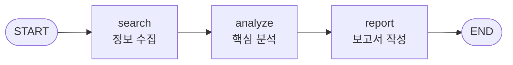

# 스트리밍 심화

LangGraph에서는 그래프 실행 중 실시간으로 결과를 전달받는 **스트리밍(Streaming)** 기능을 제공합니다. 여러 노드를 거치는 복잡한 워크플로우일수록, 사용자에게 진행 상황을 즉각적으로 알려주는 것이 중요합니다. 이 장에서는 세 가지 스트리밍 모드의 차이를 이해하고, 실제로 구현해봅니다.

## 학습 목표
- 3가지 스트리밍 모드(`values`, `updates`, `messages`)의 차이를 이해한다
- 실시간 토큰 단위 스트리밍(`astream_events`)을 구현할 수 있다
- 멀티 노드 그래프에서 현재 실행 중인 노드를 식별할 수 있다

<a id="toc"></a>

## 진행 순서

1. [왜 스트리밍이 중요한가?](#part1)
2. [stream_mode 3종 비교](#part2)
3. [토큰 단위 스트리밍 (astream_events)](#part3)
4. [멀티 노드 그래프 스트리밍](#part4)
5. [실습: 실시간 대화형 챗봇](#part5)
6. [정리](#part6)

---

<a id="part1"></a>

## 1️⃣ 왜 스트리밍이 중요한가? [↑](#toc)

### 택배 추적에 비유하기

물건을 주문했을 때 두 가지 경험을 상상해봅시다.

- **A 쇼핑몰**: "배송 중입니다. 도착까지 기다려주세요." — 이후 아무 소식 없음
- **B 쇼핑몰**: "출고 완료 → 배송 시작 → 가까운 물류센터 도착 → 배달원 출발 → 도착 예정 30분"

LLM 응답도 똑같습니다. 5초 동안 빈 화면을 보여주는 것(A)과 글자가 하나씩 나타나는 것(B) 중 어느 쪽이 더 나은 경험일까요?

**스트리밍이 없을 때의 문제:**
1. 사용자는 응답이 생성되는 동안 아무것도 볼 수 없습니다.
2. "이 서비스가 멈춘 건가?" 하는 불안감을 느낍니다.
3. 응답이 길수록 기다리는 시간이 길어집니다.

**스트리밍을 사용하면:**
1. 첫 번째 토큰이 즉시 화면에 나타납니다.
2. 사용자는 응답이 진행 중임을 실시간으로 확인합니다.
3. 긴 응답도 자연스럽게 읽으며 기다릴 수 있습니다.

### LangGraph에서 스트리밍이 특히 중요한 이유

단순한 LLM 호출은 하나의 모델만 거치지만, LangGraph는 여러 노드를 순서대로 실행합니다.

```
사용자 입력 → chatbot 노드 → tools 노드 → analyze 노드 → 최종 응답
```

각 노드가 몇 초씩 걸린다면 전체 응답까지 10초 이상이 걸릴 수 있습니다. 스트리밍 없이는 사용자가 10초 동안 빈 화면만 봅니다. 스트리밍을 통해 "지금 검색 중입니다...", "지금 분석 중입니다..." 등을 실시간으로 알려줄 수 있습니다.

---

<a id="part2"></a>

## 2️⃣ stream_mode 3종 비교 [↑](#toc)

LangGraph의 `.stream()` 메서드는 세 가지 모드를 지원합니다. 동일한 그래프를 세 가지 모드로 실행하며 차이를 직접 확인해봅시다.

### 기본 그래프 준비

먼저 비교에 사용할 2개 노드 그래프를 만듭니다.

```python
from langchain_openai import ChatOpenAI
from langchain_core.messages import HumanMessage, SystemMessage
from langgraph.graph import StateGraph, START, END
from langgraph.graph.message import add_messages
from typing_extensions import TypedDict
from typing import Annotated
from dotenv import load_dotenv
import os

load_dotenv()
openai_model = os.getenv("OPENAI_MODEL", "gpt-4o-mini")

class State(TypedDict):
    messages: Annotated[list, add_messages]
    summary: str

llm = ChatOpenAI(model=openai_model)

def chatbot(state: State):
    """첫 번째 노드: 사용자 질문에 답변"""
    response = llm.invoke(state["messages"])
    return {"messages": [response]}

def summarizer(state: State):
    """두 번째 노드: 대화 내용을 한 줄로 요약"""
    messages = state["messages"]
    summary_prompt = [
        SystemMessage(content="대화 내용을 한 문장으로 요약하세요."),
        *messages
    ]
    summary = llm.invoke(summary_prompt)
    return {"summary": summary.content}

workflow = StateGraph(State)
workflow.add_node("chatbot", chatbot)
workflow.add_node("summarizer", summarizer)
workflow.add_edge(START, "chatbot")
workflow.add_edge("chatbot", "summarizer")
workflow.add_edge("summarizer", END)

graph = workflow.compile()

inputs = {"messages": [HumanMessage(content="파이썬의 주요 특징 3가지를 알려주세요.")]}
```

---

### stream_mode="values" (기본값)

각 노드 실행이 끝날 때마다 **전체 상태**를 반환합니다. 마치 단계별 사진을 찍는 것과 같습니다.

```python
print("=== stream_mode='values' ===\n")

for chunk in graph.stream(inputs, stream_mode="values"):
    print("--- 새로운 상태 스냅샷 ---")
    if "messages" in chunk:
        print(f"  메시지 수: {len(chunk['messages'])}")
        last_msg = chunk["messages"][-1]
        print(f"  마지막 메시지 타입: {type(last_msg).__name__}")
        if hasattr(last_msg, "content") and last_msg.content:
            print(f"  내용 앞부분: {last_msg.content[:60]}...")
    if "summary" in chunk and chunk["summary"]:
        print(f"  요약: {chunk['summary']}")
    print()
```

**실행 결과 (예시):**
```
=== stream_mode='values' ===

--- 새로운 상태 스냅샷 ---
  메시지 수: 1
  마지막 메시지 타입: HumanMessage
  내용 앞부분: 파이썬의 주요 특징 3가지를 알려주세요....

--- 새로운 상태 스냅샷 ---
  메시지 수: 2
  마지막 메시지 타입: AIMessage
  내용 앞부분: 파이썬(Python)의 주요 특징 3가지는 다음과 같습니다:...

--- 새로운 상태 스냅샷 ---
  메시지 수: 2
  마지막 메시지 타입: AIMessage
  내용 앞부분: 파이썬(Python)의 주요 특징 3가지는 다음과 같습니다:...
  요약: 파이썬의 주요 특징으로는 간결한 문법, 광범위한 라이브러리, 다양한 패러다임 지원이 있습니다.
```

> 💡 `values` 모드에서는 초기 상태를 포함하여 노드 실행 후마다 전체 상태가 반환됩니다. 메시지 수가 누적되어 증가하는 것을 확인할 수 있습니다.

---

### stream_mode="updates"

각 노드가 **변경한 부분만** 반환합니다. 전체 상태 대신 "어떤 노드가 무엇을 바꿨는지"만 알려줍니다.

```python
print("=== stream_mode='updates' ===\n")

for update in graph.stream(inputs, stream_mode="updates"):
    print("--- 노드 업데이트 ---")
    for node_name, node_output in update.items():
        print(f"  노드: {node_name}")
        if "messages" in node_output:
            msg = node_output["messages"][-1]
            print(f"  새 메시지: {msg.content[:60]}...")
        if "summary" in node_output:
            print(f"  새 요약: {node_output['summary']}")
    print()
```

**실행 결과 (예시):**
```
=== stream_mode='updates' ===

--- 노드 업데이트 ---
  노드: chatbot
  새 메시지: 파이썬(Python)의 주요 특징 3가지는 다음과 같습니다:...

--- 노드 업데이트 ---
  노드: summarizer
  새 요약: 파이썬의 주요 특징으로는 간결한 문법, 광범위한 라이브러리, 다양한 패러다임 지원이 있습니다.
```

`updates` 모드는 노드 이름이 키로 포함되어 있어 **어떤 노드가 실행되었는지** 바로 알 수 있습니다.

---

### stream_mode="messages"

LLM이 생성하는 **토큰을 하나씩** 반환합니다. 글자가 실시간으로 타이핑되는 효과를 구현할 때 사용합니다.

```python
print("=== stream_mode='messages' ===\n")
print("실시간 생성 중: ", end="", flush=True)

for message_chunk, metadata in graph.stream(inputs, stream_mode="messages"):
    if hasattr(message_chunk, "content") and message_chunk.content:
        print(message_chunk.content, end="", flush=True)

print("\n\n--- 스트리밍 완료 ---")
```

**실행 결과 (예시):**
```
=== stream_mode='messages' ===

실시간 생성 중: 파이썬(Python)의 주요 특징 3가지는 다음과 같습니다:

1. **간결하고 읽기 쉬운 문법**: 파이썬은 영어와 유사한 문법을
사용하여 코드를 직관적으로 작성하고 읽을 수 있습니다...

--- 스트리밍 완료 ---
```

> ⚠️ `messages` 모드는 LLM이 텍스트를 직접 생성할 때만 토큰 단위 스트리밍이 됩니다. 도구(Tool) 호출 결과는 한 번에 반환됩니다.

---

### 세 가지 모드 비교 표

| 모드 | 반환 단위 | 포함 정보 | 주요 용도 |
|---|---|---|---|
| `values` | 노드 완료 후 전체 상태 | 누적된 전체 상태 | 디버깅, 상태 추적 |
| `updates` | 노드 완료 후 변경분 | 노드명 + 해당 노드의 출력 | 진행 상황 표시, 멀티 노드 추적 |
| `messages` | LLM 토큰 단위 | 개별 토큰 + 메타데이터 | 실시간 타이핑 효과 |

비유로 정리하면:
- **values**: 단계별로 찍은 **전체 사진**
- **updates**: 이전 사진과 **달라진 부분만** 표시
- **messages**: 사진이 **픽셀 단위로 천천히** 나타남

---

<a id="part3"></a>

## 3️⃣ 토큰 단위 스트리밍 (astream_events) [↑](#toc)

`stream_mode="messages"`보다 더 세밀한 제어가 필요할 때는 `astream_events`를 사용합니다. 이 메서드는 LLM의 생성 시작, 각 토큰, 생성 완료 등 다양한 이벤트를 개별적으로 전달합니다.

> 💡 `astream_events`는 **비동기(async)** 메서드입니다. 비동기 프로그래밍은 이후 장에서 자세히 다룹니다. 여기서는 실행 방법만 익히세요.

### astream_events 기본 사용법

```python
import asyncio
from langchain_openai import ChatOpenAI
from langchain_core.messages import HumanMessage
from langgraph.graph import StateGraph, START, END
from langgraph.graph.message import add_messages
from typing_extensions import TypedDict
from typing import Annotated
from dotenv import load_dotenv
import os

load_dotenv()
openai_model = os.getenv("OPENAI_MODEL", "gpt-4o-mini")

class State(TypedDict):
    messages: Annotated[list, add_messages]

llm = ChatOpenAI(model=openai_model)

def chatbot(state: State):
    return {"messages": [llm.invoke(state["messages"])]}

workflow = StateGraph(State)
workflow.add_node("chatbot", chatbot)
workflow.add_edge(START, "chatbot")
workflow.add_edge("chatbot", END)
graph = workflow.compile()

async def stream_tokens():
    config = {"configurable": {"thread_id": "stream_demo"}}
    inputs = {"messages": [HumanMessage(content="인공지능의 역사를 간략히 알려주세요.")]}

    print("실시간 스트리밍: ", end="", flush=True)

    async for event in graph.astream_events(
        inputs,
        config=config,
        version="v2"
    ):
        event_type = event["event"]

        if event_type == "on_chat_model_stream":
            # LLM이 토큰을 하나씩 생성할 때
            token = event["data"]["chunk"].content
            if token:
                print(token, end="", flush=True)

        elif event_type == "on_chat_model_start":
            # LLM 생성 시작
            print("\n[LLM 생성 시작]", flush=True)

        elif event_type == "on_chat_model_end":
            # LLM 생성 완료
            print("\n[LLM 생성 완료]", flush=True)

# Jupyter Notebook에서 실행
await stream_tokens()

# 일반 Python 스크립트에서 실행
# asyncio.run(stream_tokens())
```

**실행 결과 (예시):**
```
[LLM 생성 시작]
실시간 스트리밍: 인공지능(AI)의 역사는 1950년대로 거슬러 올라갑니다.

1950년: 앨런 튜링이 "기계가 생각할 수 있는가?"라는 질문을 제기하며
튜링 테스트를 제안했습니다.

1956년: 존 매카시가 다트머스 회의에서 '인공지능'이라는 용어를 처음
사용하며 AI 연구의 공식적인 시작을 알렸습니다...
[LLM 생성 완료]
```

### 이벤트 타입 정리

`astream_events`가 발생시키는 주요 이벤트는 다음과 같습니다.

| 이벤트 타입 | 발생 시점 | `event["data"]` 내용 |
|---|---|---|
| `on_chat_model_start` | LLM 생성 시작 | 입력 메시지 |
| `on_chat_model_stream` | 토큰 하나 생성될 때마다 | `chunk.content` (토큰 문자열) |
| `on_chat_model_end` | LLM 생성 완료 | 최종 출력 |
| `on_tool_start` | 도구 실행 시작 | 도구 이름, 입력 |
| `on_tool_end` | 도구 실행 완료 | 도구 출력 |
| `on_chain_start` | 노드(체인) 실행 시작 | 노드 이름 |
| `on_chain_end` | 노드(체인) 실행 완료 | 노드 출력 |

```python
async def watch_all_events():
    """모든 이벤트를 관찰하여 그래프 실행 흐름 파악"""
    inputs = {"messages": [HumanMessage(content="안녕하세요!")]}
    config = {"configurable": {"thread_id": "event_watch"}}

    async for event in graph.astream_events(inputs, config=config, version="v2"):
        event_type = event["event"]
        name = event.get("name", "")

        # 노드 실행 이벤트만 출력
        if event_type in ("on_chain_start", "on_chain_end"):
            if name not in ("LangGraph", ""):  # 최상위 그래프는 제외
                status = "시작" if "start" in event_type else "완료"
                print(f"  [{status}] 노드: {name}")

        elif event_type == "on_chat_model_stream":
            token = event["data"]["chunk"].content
            if token:
                print(token, end="", flush=True)

await watch_all_events()
```

**실행 결과 (예시):**
```
  [시작] 노드: chatbot
안녕하세요! 무엇을 도와드릴까요?
  [완료] 노드: chatbot
```

---

<a id="part4"></a>

## 4️⃣ 멀티 노드 그래프 스트리밍 [↑](#toc)

실제 AI 에이전트는 여러 노드를 거쳐 최종 응답을 만들어냅니다. `stream_mode="updates"`를 활용하면 각 노드의 실행 상황을 실시간으로 사용자에게 알려줄 수 있습니다.

### 3개 노드 그래프 구성

검색 → 분석 → 보고서 작성 순서로 실행되는 그래프를 만들어봅니다.

```python
from langchain_openai import ChatOpenAI
from langchain_core.messages import HumanMessage, SystemMessage
from langgraph.graph import StateGraph, START, END
from langgraph.graph.message import add_messages
from typing_extensions import TypedDict
from typing import Annotated
from dotenv import load_dotenv
import os

load_dotenv()
openai_model = os.getenv("OPENAI_MODEL", "gpt-4o-mini")

class ReportState(TypedDict):
    messages: Annotated[list, add_messages]
    search_result: str
    analysis: str
    report: str

llm = ChatOpenAI(model=openai_model)

def search_node(state: ReportState):
    """노드 1: 주제 관련 정보 수집 (시뮬레이션)"""
    query = state["messages"][-1].content
    # 실제 환경에서는 TavilySearch 등 검색 도구 사용
    search_result = f"'{query}'에 관한 검색 결과: 관련 최신 정보를 수집했습니다."
    return {"search_result": search_result}

def analyze_node(state: ReportState):
    """노드 2: 수집된 정보 분석"""
    prompt = [
        SystemMessage(content="수집된 정보를 바탕으로 핵심 인사이트 3가지를 도출하세요."),
        HumanMessage(content=f"분석할 내용: {state['search_result']}\n원래 질문: {state['messages'][-1].content}")
    ]
    analysis = llm.invoke(prompt)
    return {"analysis": analysis.content}

def report_node(state: ReportState):
    """노드 3: 최종 보고서 작성"""
    prompt = [
        SystemMessage(content="분석 결과를 바탕으로 명확하고 구조적인 보고서를 작성하세요."),
        HumanMessage(content=f"분석 결과: {state['analysis']}\n원래 질문: {state['messages'][-1].content}")
    ]
    report = llm.invoke(prompt)
    return {"report": report.content}

workflow = StateGraph(ReportState)
workflow.add_node("search", search_node)
workflow.add_node("analyze", analyze_node)
workflow.add_node("report", report_node)

workflow.add_edge(START, "search")
workflow.add_edge("search", "analyze")
workflow.add_edge("analyze", "report")
workflow.add_edge("report", END)

graph = workflow.compile()
```

그래프 구조를 다이어그램으로 확인합니다.



### 노드별 진행 상황 표시

```python
inputs = {"messages": [HumanMessage(content="LangGraph의 미래 전망에 대해 분석해주세요.")]}

# 노드별 표시 이름 매핑
node_labels = {
    "search": "정보 수집 중",
    "analyze": "핵심 분석 중",
    "report": "보고서 작성 중"
}

print("=== 보고서 생성 시작 ===\n")

for update in graph.stream(inputs, stream_mode="updates"):
    for node_name, node_output in update.items():
        label = node_labels.get(node_name, node_name)
        print(f"[{label}] {node_name} 노드 완료")

        # 각 노드의 출력 미리보기
        if "search_result" in node_output:
            print(f"  검색 결과: {node_output['search_result'][:50]}...")
        if "analysis" in node_output:
            print(f"  분석 완료: {node_output['analysis'][:50]}...")
        if "report" in node_output:
            print(f"\n=== 최종 보고서 ===")
            print(node_output["report"])
        print()
```

**실행 결과 (예시):**
```
=== 보고서 생성 시작 ===

[정보 수집 중] search 노드 완료
  검색 결과: 'LangGraph의 미래 전망에 대해 분석해주세요.'에 관한 검색 결...

[핵심 분석 중] analyze 노드 완료
  분석 완료: LangGraph의 미래 전망에 대한 핵심 인사이트: 1. AI 에이전트...

[보고서 작성 중] report 노드 완료

=== 최종 보고서 ===
# LangGraph 미래 전망 보고서

## 개요
LangGraph는 상태 기반 AI 에이전트 개발을 위한 프레임워크로...
```

### 진행률 표시 응용

```python
import time

nodes_in_order = ["search", "analyze", "report"]
total_nodes = len(nodes_in_order)

print("처리 진행률: ", end="", flush=True)

completed = 0
for update in graph.stream(inputs, stream_mode="updates"):
    for node_name in update:
        if node_name in nodes_in_order:
            completed += 1
            progress = int((completed / total_nodes) * 100)
            bar = "█" * (completed * 5) + "░" * ((total_nodes - completed) * 5)
            print(f"\r처리 진행률: [{bar}] {progress}% ({node_name} 완료)   ", end="", flush=True)

print("\n처리 완료!")
```

**실행 결과 (예시):**
```
처리 진행률: [█████░░░░░░░░░░] 33% (search 완료)   
처리 진행률: [██████████░░░░░] 67% (analyze 완료)  
처리 진행률: [███████████████] 100% (report 완료)  
처리 완료!
```

---

<a id="part5"></a>

## 5️⃣ 실습: 실시간 대화형 챗봇 [↑](#toc)

지금까지 배운 내용을 종합하여, 토큰 단위 스트리밍과 노드 진행 표시를 모두 갖춘 대화형 챗봇을 만들어봅니다.

### 완성 코드

```python
import asyncio
from langchain_openai import ChatOpenAI
from langchain_tavily import TavilySearch
from langchain_core.messages import HumanMessage
from langgraph.graph import StateGraph, START, END
from langgraph.graph.message import add_messages
from langgraph.prebuilt import ToolNode, tools_condition
from langgraph.checkpoint.memory import InMemorySaver
from typing_extensions import TypedDict
from typing import Annotated
from dotenv import load_dotenv
import os

load_dotenv()
openai_model = os.getenv("OPENAI_MODEL", "gpt-4o-mini")

# 상태 정의
class State(TypedDict):
    messages: Annotated[list, add_messages]

# 컴포넌트 설정
llm = ChatOpenAI(model=openai_model, streaming=True)  # streaming=True 필수
search_tool = TavilySearch(max_results=2)
tools = [search_tool]
llm_with_tools = llm.bind_tools(tools)

def chatbot(state: State):
    return {"messages": [llm_with_tools.invoke(state["messages"])]}

# 그래프 구성
memory = InMemorySaver()
tool_node = ToolNode(tools)

workflow = StateGraph(State)
workflow.add_node("chatbot", chatbot)
workflow.add_node("tools", tool_node)
workflow.add_conditional_edges("chatbot", tools_condition)
workflow.add_edge("tools", "chatbot")
workflow.add_edge(START, "chatbot")
graph = workflow.compile(checkpointer=memory)

async def chat_with_streaming(user_input: str, config: dict):
    """토큰 단위 스트리밍 + 노드 진행 표시를 포함한 대화 함수"""
    inputs = {"messages": [HumanMessage(content=user_input)]}

    current_node = None
    print("\n[응답 생성 중...]\n", flush=True)

    async for event in graph.astream_events(inputs, config=config, version="v2"):
        event_type = event["event"]
        name = event.get("name", "")

        # 노드 시작 알림
        if event_type == "on_chain_start" and name in ("chatbot", "tools"):
            if name != current_node:
                current_node = name
                node_label = "챗봇 응답 생성" if name == "chatbot" else "도구 실행"
                print(f"\n--- {node_label} ---", flush=True)

        # 토큰 단위 스트리밍 출력
        elif event_type == "on_chat_model_stream":
            token = event["data"]["chunk"].content
            if token:
                print(token, end="", flush=True)

        # 도구 실행 완료 알림
        elif event_type == "on_tool_end":
            tool_name = event.get("name", "")
            print(f"\n[도구 '{tool_name}' 실행 완료]", flush=True)

    print("\n")  # 응답 끝에 줄바꿈

async def main():
    """실시간 대화형 챗봇 메인 루프"""
    config = {"configurable": {"thread_id": "streaming_chat"}}

    print("=" * 50)
    print("  실시간 스트리밍 챗봇 (종료: 'quit' 입력)")
    print("=" * 50)

    while True:
        try:
            user_input = input("\n사용자: ").strip()
        except (EOFError, KeyboardInterrupt):
            print("\n챗봇을 종료합니다.")
            break

        if user_input.lower() in ("quit", "exit", "종료"):
            print("챗봇을 종료합니다.")
            break

        if not user_input:
            continue

        await chat_with_streaming(user_input, config)

# Jupyter Notebook에서 실행
await main()

# 일반 Python 스크립트에서 실행
# asyncio.run(main())
```

**실행 결과 (예시):**
```
==================================================
  실시간 스트리밍 챗봇 (종료: 'quit' 입력)
==================================================

사용자: 오늘 날씨 어때요?

[응답 생성 중...]

--- 챗봇 응답 생성 ---
--- 도구 실행 ---
[도구 'tavily_search' 실행 완료]

--- 챗봇 응답 생성 ---
오늘 날씨 정보를 검색해드렸습니다. 현재 서울은 맑고 기온은 약 20°C입니다.
자외선 지수가 높으니 외출 시 선크림을 챙기세요!


사용자: 고마워요!

[응답 생성 중...]

--- 챗봇 응답 생성 ---
천만에요! 다른 도움이 필요하시면 말씀해주세요.


사용자: quit
챗봇을 종료합니다.
```

### ChatOpenAI streaming=True 설명

```python
llm = ChatOpenAI(model=openai_model, streaming=True)
```

`streaming=True`를 설정하면 OpenAI API가 토큰을 생성하는 즉시 전송합니다. `astream_events`와 함께 사용할 때 각 토큰을 `on_chat_model_stream` 이벤트로 받을 수 있습니다.

> ⚠️ `streaming=True` 없이도 `astream_events`는 동작하지만, 토큰이 한 번에 모두 전달되어 스트리밍 효과가 나타나지 않습니다.

---

<a id="part6"></a>

## 6️⃣ 정리 [↑](#toc)

### 스트리밍 모드 최종 요약

| 방법 | 동기/비동기 | 반환 단위 | 권장 용도 |
|---|---|---|---|
| `graph.stream(..., stream_mode="values")` | 동기 | 노드 완료 후 전체 상태 | 디버깅, 상태 전체 추적 |
| `graph.stream(..., stream_mode="updates")` | 동기 | 노드 완료 후 변경분 | 진행률 표시, 멀티 노드 추적 |
| `graph.stream(..., stream_mode="messages")` | 동기 | LLM 토큰 | 간단한 실시간 출력 |
| `graph.astream_events(...)` | 비동기 | 세부 이벤트 단위 | 정교한 UI, 토큰+노드 동시 추적 |

### 언제 어떤 방법을 쓸까?

- **디버깅할 때** → `values` 모드로 각 단계의 전체 상태 확인
- **진행 상황을 표시할 때** → `updates` 모드로 노드명과 출력 확인
- **간단한 타이핑 효과** → `messages` 모드
- **정교한 실시간 UI** → `astream_events`로 토큰과 노드 동시 처리

### 학습 체크리스트

- [ ] `stream_mode="values"`로 전체 상태 스냅샷을 출력할 수 있다
- [ ] `stream_mode="updates"`로 노드 이름과 변경분을 출력할 수 있다
- [ ] `stream_mode="messages"`로 토큰 단위 출력을 구현할 수 있다
- [ ] `astream_events`로 `on_chat_model_stream` 이벤트를 처리할 수 있다
- [ ] 멀티 노드 그래프에서 현재 실행 중인 노드를 실시간으로 표시할 수 있다
- [ ] `streaming=True` 옵션이 필요한 이유를 설명할 수 있다

---

→ **다음 장**: [9. 서브그래프](/llm/langgraph/subgraph)
