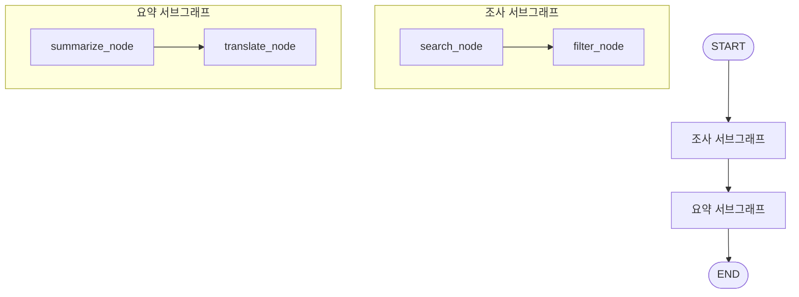
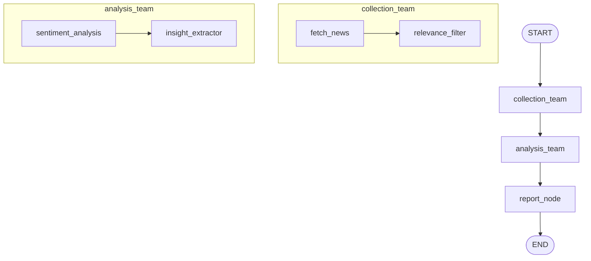

# 서브그래프 {: .no_toc }

LangGraph에서 **서브그래프(Subgraph)**는 복잡한 워크플로우를 관리 가능한 단위로 나누는 핵심 기능입니다. 노드가 10개, 20개로 늘어나면 하나의 거대한 그래프는 이해하기도, 테스트하기도 어려워집니다. 서브그래프를 사용하면 기능 단위로 분리하고, 각각 독립적으로 테스트하며, 여러 부모 그래프에서 재사용할 수 있습니다.

## 학습 목표

- 서브그래프의 개념과 필요성을 이해한다
- 서브그래프를 만들고 부모 그래프에 연결할 수 있다
- 부모-자식 상태 매핑 패턴을 적용할 수 있다
- 서브그래프를 언제 사용할지 판단할 수 있다

<a id="toc"></a>

## 진행 순서

1. [서브그래프란?](#part1)
2. [서브그래프 만들기](#part2)
3. [상태 전달과 매핑](#part3)
4. [서브그래프의 장점과 설계 원칙](#part4)
5. [실습: 뉴스 분석 파이프라인](#part5)
6. [정리](#part6)

---

<a id="part1"></a>

## 1️⃣ 서브그래프란? [↑](#toc)

### 회사 조직도에 비유하기

대기업을 상상해보세요. CEO 한 명이 직원 500명을 직접 관리할 수는 없습니다. 대신 팀 → 부서 → 사업부 구조로 계층화합니다.

- **개발팀**: 백엔드 개발자, 프론트엔드 개발자, QA
- **마케팅팀**: 콘텐츠 제작자, 광고 담당자
- **경영진**: 각 팀장에게 지시하고 결과를 받음

LangGraph의 서브그래프도 똑같습니다. **부모 그래프**는 큰 흐름을 관리하고, **서브그래프**는 각자의 전문 영역을 처리합니다.

```
[부모 그래프]
    ↓
[조사 서브그래프]  →  [요약 서브그래프]
 - 검색 노드           - 요약 노드
 - 필터 노드           - 번역 노드
```

### 왜 서브그래프가 필요한가?

노드가 많아질수록 단일 그래프는 아래 문제를 가집니다.

| 문제 | 설명 |
|------|------|
| 복잡성 | 노드 10개 이상이면 흐름을 한눈에 파악하기 어렵다 |
| 재사용 불가 | "검색 + 필터" 조합을 여러 프로젝트에 쓰고 싶어도 복사해야 한다 |
| 테스트 어려움 | 전체 그래프를 실행해야만 특정 부분을 테스트할 수 있다 |
| 팀 협업 어려움 | 동일 파일을 여러 사람이 수정하면 충돌이 잦다 |

서브그래프를 사용하면:
1. **모듈성**: 각 서브그래프는 독립된 파일/모듈로 관리
2. **재사용성**: 서브그래프를 여러 부모 그래프에서 노드로 활용
3. **독립 테스트**: 서브그래프만 단독 실행해서 검증 가능
4. **협업**: 팀원마다 담당 서브그래프를 분리해서 개발

### 구조 다이어그램



> 💡 Mermaid에서 `subgraph` 키워드를 사용하면 시각적으로 서브그래프 영역을 구분할 수 있습니다. LangGraph 코드의 구조와 일치합니다.

---

<a id="part2"></a>

## 2️⃣ 서브그래프 만들기 [↑](#toc)

서브그래프를 만드는 과정은 두 단계입니다.

1. **자식 StateGraph 정의 + 컴파일** — 완전히 독립된 작은 그래프
2. **부모 그래프에 자식 그래프를 노드로 추가** — `add_node(name, compiled_child)`

### Step 1: 자식 그래프 만들기

자식 그래프는 일반 그래프와 동일하게 만들고, 마지막에 `.compile()`을 호출합니다.

```python
from typing import TypedDict, Annotated
from langgraph.graph import StateGraph, START, END
from langgraph.graph.message import add_messages
from langchain_core.messages import HumanMessage, AIMessage

# ── 서브그래프 1: 조사 팀 ──────────────────────────────────────
# 자식 그래프만의 상태 정의
class ResearchState(TypedDict):
    query: str          # 검색할 키워드
    raw_results: list   # 검색 결과 (원본)
    filtered: list      # 필터링된 결과

def search_node(state: ResearchState) -> dict:
    """검색 노드: 키워드로 결과를 수집합니다."""
    query = state["query"]
    # 실제 환경에서는 Tavily 등을 사용합니다
    raw = [
        f"{query} 관련 기사 1: 최신 동향 보고서",
        f"{query} 관련 기사 2: 전문가 인터뷰",
        f"{query} 관련 기사 3: 스팸 광고 (필터 대상)",
        f"{query} 관련 기사 4: 심층 분석 리포트",
    ]
    print(f"  [search_node] '{query}' 검색 완료: {len(raw)}건")
    return {"raw_results": raw}

def filter_node(state: ResearchState) -> dict:
    """필터 노드: 스팸/광고 제거 후 품질 높은 결과만 남깁니다."""
    results = state["raw_results"]
    filtered = [r for r in results if "스팸" not in r and "광고" not in r]
    print(f"  [filter_node] 필터링 후: {len(filtered)}건 남음")
    return {"filtered": filtered}

# 자식 그래프 정의
research_builder = StateGraph(ResearchState)
research_builder.add_node("search_node", search_node)
research_builder.add_node("filter_node", filter_node)
research_builder.add_edge(START, "search_node")
research_builder.add_edge("search_node", "filter_node")
research_builder.add_edge("filter_node", END)

# 컴파일 — 이 시점에 서브그래프가 완성됩니다
research_graph = research_builder.compile()
print("조사 서브그래프 컴파일 완료")
```

**실행 결과 (예시):**
```
조사 서브그래프 컴파일 완료
```

서브그래프를 단독으로 테스트해봅니다.

```python
# 서브그래프 단독 테스트
test_result = research_graph.invoke({"query": "인공지능", "raw_results": [], "filtered": []})
print("단독 테스트 결과:", test_result["filtered"])
```

**실행 결과 (예시):**
```
  [search_node] '인공지능' 검색 완료: 4건
  [filter_node] 필터링 후: 3건 남음
단독 테스트 결과: ['인공지능 관련 기사 1: 최신 동향 보고서', '인공지능 관련 기사 2: 전문가 인터뷰', '인공지능 관련 기사 4: 심층 분석 리포트']
```

> 💡 서브그래프를 단독으로 테스트할 수 있다는 것이 큰 장점입니다. 부모 그래프 없이도 이 팀이 제대로 동작하는지 확인할 수 있습니다.

### Step 2: 두 번째 서브그래프 만들기

```python
# ── 서브그래프 2: 요약 팀 ──────────────────────────────────────
class SummaryState(TypedDict):
    filtered: list   # 조사 팀에서 받은 결과
    summary: str     # 최종 요약

def summarize_node(state: SummaryState) -> dict:
    """요약 노드: 수집된 자료를 하나의 요약문으로 만듭니다."""
    items = state["filtered"]
    # 실제 환경에서는 LLM을 사용합니다
    combined = " | ".join(items)
    summary = f"[요약] 총 {len(items)}건의 자료를 분석했습니다. 주요 내용: {combined[:80]}..."
    print(f"  [summarize_node] 요약 완료")
    return {"summary": summary}

summary_builder = StateGraph(SummaryState)
summary_builder.add_node("summarize_node", summarize_node)
summary_builder.add_edge(START, "summarize_node")
summary_builder.add_edge("summarize_node", END)

summary_graph = summary_builder.compile()
print("요약 서브그래프 컴파일 완료")
```

### Step 3: 부모 그래프에서 서브그래프를 노드로 연결

```python
# ── 부모 그래프 ────────────────────────────────────────────────
class ParentState(TypedDict):
    query: str       # 사용자 입력 키워드
    filtered: list   # 조사 팀 결과 (연결 고리)
    summary: str     # 최종 요약
    raw_results: list  # 조사 팀 내부 필드 (부모에도 선언)

parent_builder = StateGraph(ParentState)

# 서브그래프를 노드로 추가 — add_node(이름, 컴파일된_서브그래프)
parent_builder.add_node("research_team", research_graph)
parent_builder.add_node("summary_team", summary_graph)

# 흐름 연결
parent_builder.add_edge(START, "research_team")
parent_builder.add_edge("research_team", "summary_team")
parent_builder.add_edge("summary_team", END)

parent_graph = parent_builder.compile()
print("부모 그래프 컴파일 완료")

# ── 전체 실행 ──────────────────────────────────────────────────
print("\n=== 뉴스 파이프라인 실행 ===")
result = parent_graph.invoke({
    "query": "생성형 AI",
    "filtered": [],
    "summary": "",
    "raw_results": []
})

print("\n최종 결과:")
print(result["summary"])
```

**실행 결과 (예시):**
```
조사 서브그래프 컴파일 완료
요약 서브그래프 컴파일 완료
부모 그래프 컴파일 완료

=== 뉴스 파이프라인 실행 ===
  [search_node] '생성형 AI' 검색 완료: 4건
  [filter_node] 필터링 후: 3건 남음
  [summarize_node] 요약 완료

최종 결과:
[요약] 총 3건의 자료를 분석했습니다. 주요 내용: 생성형 AI 관련 기사 1: 최신 동향 보고서 | 생성형 AI 관련 기사 2: 전문가 인터뷰...
```

> ⚠️ 부모 그래프의 상태에는 자식 그래프가 읽고 쓰는 **모든 필드**가 포함되어야 합니다. `raw_results`처럼 자식 내부에서만 쓰는 필드도 부모 상태에 선언해야 자동 매핑이 작동합니다.

---

<a id="part3"></a>

## 3️⃣ 상태 전달과 매핑 [↑](#toc)

### 부모-자식 상태가 다를 때

앞 예제에서는 편의상 부모 상태에 자식 필드를 모두 포함시켰습니다. 하지만 자식 그래프의 내부 필드가 부모 상태를 오염시키는 것은 좋지 않습니다. 이럴 때 **입출력 키 매핑**을 사용합니다.

LangGraph는 서브그래프 노드를 추가할 때 입력을 변환하는 **래퍼 함수**를 사용하는 패턴을 권장합니다.

```python
from typing import TypedDict
from langgraph.graph import StateGraph, START, END

# ── 깔끔한 부모 상태: 자식 내부 필드 없음 ──────────────────────
class CleanParentState(TypedDict):
    topic: str        # 사용자가 입력한 주제
    articles: list    # 조사 팀이 돌려주는 결과 (이름이 다름)
    report: str       # 최종 보고서

# ── 자식 상태: 자체 네이밍 사용 ──────────────────────────────
class ChildResearchState(TypedDict):
    query: str          # topic → query 로 매핑 필요
    raw_results: list
    filtered: list

# 자식 그래프 (이전과 동일)
def child_search(state: ChildResearchState) -> dict:
    query = state["query"]
    results = [f"{query} 기사 {i}" for i in range(1, 4)]
    return {"raw_results": results, "filtered": results}

child_builder = StateGraph(ChildResearchState)
child_builder.add_node("search", child_search)
child_builder.add_edge(START, "search")
child_builder.add_edge("search", END)
child_subgraph = child_builder.compile()

# ── 래퍼 함수로 상태 매핑 ─────────────────────────────────────
def research_team_node(state: CleanParentState) -> dict:
    """
    부모 상태를 자식 상태로 변환하여 서브그래프를 호출하고,
    자식 결과를 다시 부모 상태 형식으로 변환합니다.
    """
    # 1. 부모 → 자식: 필드 이름 변환
    child_input = {
        "query": state["topic"],   # topic → query
        "raw_results": [],
        "filtered": []
    }

    # 2. 서브그래프 실행
    child_output = child_subgraph.invoke(child_input)

    # 3. 자식 → 부모: 결과 필드 변환
    return {
        "articles": child_output["filtered"]  # filtered → articles
    }

def write_report_node(state: CleanParentState) -> dict:
    articles = state["articles"]
    report = f"주제 '{state['topic']}' 분석 보고서\n"
    report += f"수집 기사 수: {len(articles)}건\n"
    for i, article in enumerate(articles, 1):
        report += f"  {i}. {article}\n"
    return {"report": report}

# ── 부모 그래프 조립 ──────────────────────────────────────────
clean_builder = StateGraph(CleanParentState)
clean_builder.add_node("research_team", research_team_node)  # 래퍼 함수 사용
clean_builder.add_node("write_report", write_report_node)
clean_builder.add_edge(START, "research_team")
clean_builder.add_edge("research_team", "write_report")
clean_builder.add_edge("write_report", END)

clean_graph = clean_builder.compile()

result = clean_graph.invoke({
    "topic": "블록체인",
    "articles": [],
    "report": ""
})
print(result["report"])
```

**실행 결과 (예시):**
```
주제 '블록체인' 분석 보고서
수집 기사 수: 3건
  1. 블록체인 기사 1
  2. 블록체인 기사 2
  3. 블록체인 기사 3
```

### 매핑 패턴 요약

| 상황 | 방법 |
|------|------|
| 부모-자식 필드 이름이 같음 | 서브그래프를 직접 `add_node`로 추가 |
| 부모-자식 필드 이름이 다름 | 래퍼 함수로 변환 후 `add_node`에 래퍼 등록 |
| 자식 결과 중 일부만 부모에 반영 | 래퍼 함수에서 필요한 키만 반환 |
| 여러 자식 결과를 합산 | 래퍼 함수에서 결합 로직 작성 |

### 주의사항: 상태 변경 반영 방식

```python
# ⚠️ 중요: 서브그래프는 자신의 상태를 변경하지만,
# 부모 상태에 반영되는 것은 서브그래프의 "출력(output)"입니다.

# 서브그래프가 반환하는 딕셔너리의 키만 부모 상태에 업데이트됩니다.
# 서브그래프가 반환하지 않은 필드는 부모 상태에서 변경되지 않습니다.

# 예: 서브그래프가 {"filtered": [...]}만 반환하면
# 부모의 "query", "raw_results" 등은 그대로 유지됩니다.
```

> 💡 래퍼 함수 패턴은 **인터페이스를 명확히 정의**합니다. "이 서브그래프는 X를 받아서 Y를 반환한다"는 계약을 코드로 표현하는 것입니다.

---

<a id="part4"></a>

## 4️⃣ 서브그래프의 장점과 설계 원칙 [↑](#toc)

### 장점 비교표

| 항목 | 단일 거대 그래프 | 서브그래프 분리 |
|------|----------------|----------------|
| 모듈성 | 낮음 — 모든 노드가 하나의 파일 | 높음 — 기능별 파일 분리 |
| 재사용성 | 없음 — 전체를 복사해야 함 | 있음 — 서브그래프만 import |
| 독립 테스트 | 불가 — 전체 실행 필요 | 가능 — `.invoke()`로 단독 실행 |
| 가독성 | 낮음 — 노드가 많을수록 혼란 | 높음 — 고수준 흐름만 보임 |
| 팀 협업 | 어려움 — 충돌 잦음 | 쉬움 — 담당 서브그래프 분리 |
| 디버깅 | 어려움 — 어디서 실패했는지 불분명 | 쉬움 — 서브그래프 단위로 확인 |

### 설계 원칙

**원칙 1: 하나의 서브그래프는 하나의 책임**

나쁜 예시:
```python
# ❌ "검색 + 요약 + 번역 + 저장"을 하나의 서브그래프에
class DoEverythingState(TypedDict):
    query: str
    results: list
    summary: str
    translation: str
    saved_path: str
```

좋은 예시:
```python
# ✅ 각 책임을 별도 서브그래프로 분리
# search_subgraph: 검색만
# summary_subgraph: 요약만
# translation_subgraph: 번역만
# storage_subgraph: 저장만
```

**원칙 2: 상태 인터페이스를 명확히 정의**

```python
# ✅ 서브그래프가 받는 것(입력)과 반환하는 것(출력)을 주석으로 명시
class SearchSubgraphState(TypedDict):
    # 입력: 부모가 제공해야 하는 필드
    query: str

    # 내부: 서브그래프 내에서만 사용
    raw_results: list

    # 출력: 부모에게 전달되는 필드
    filtered: list
```

**원칙 3: 서브그래프 단독으로 테스트 가능하게**

```python
# ✅ 각 서브그래프는 단독 실행 테스트를 포함
def test_research_subgraph():
    result = research_graph.invoke({
        "query": "테스트 키워드",
        "raw_results": [],
        "filtered": []
    })
    assert len(result["filtered"]) > 0
    print("조사 서브그래프 테스트 통과!")

test_research_subgraph()
```

### 언제 서브그래프를 쓰고, 언제 단순 노드로 충분한가?

| 상황 | 권장 선택 | 이유 |
|------|----------|------|
| 2~3개 노드로 단순한 작업 | 단순 노드 | 서브그래프 오버헤드 불필요 |
| 4개 이상 노드가 하나의 기능 단위 | 서브그래프 | 모듈화 가치 있음 |
| 동일 로직을 여러 그래프에서 재사용 | 서브그래프 | 재사용성이 핵심 이점 |
| 팀원이 담당 기능을 독립 개발 | 서브그래프 | 병렬 개발 가능 |
| 프로토타입 단계 | 단순 노드 | 빠른 실험이 우선 |
| 프로덕션 전환 시 | 서브그래프 리팩토링 | 장기 유지보수 고려 |

> 💡 경험칙: 노드 수가 5개를 넘어가거나, "이 부분만 따로 테스트하고 싶다"는 생각이 든다면 서브그래프를 고려할 시점입니다.

---

<a id="part5"></a>

## 5️⃣ 실습: 뉴스 분석 파이프라인 [↑](#toc)

사용자가 관심 키워드를 입력하면 두 서브그래프가 협업하여 분석 보고서를 생성하는 파이프라인을 만들어봅니다.

**시나리오:**
1. 사용자가 키워드 입력 (예: "전기차")
2. **수집 서브그래프**: 키워드 관련 뉴스 수집 + 관련성 필터링
3. **분석 서브그래프**: 각 기사의 감성 분석 + 종합 인사이트 도출
4. 부모 그래프가 최종 보고서 포맷으로 출력



```python
from typing import TypedDict, List
from langgraph.graph import StateGraph, START, END
from langchain_openai import ChatOpenAI
from langchain_core.messages import HumanMessage

# LLM 초기화 (실제 환경에서는 API 키 필요)
# llm = ChatOpenAI(model="gpt-4o-mini", temperature=0)

# 데모용 가짜 LLM (API 키 없이 실행 가능)
class FakeLLM:
    def invoke(self, messages):
        class FakeResponse:
            content = "긍정적"
        return FakeResponse()

llm = FakeLLM()

# ════════════════════════════════════════════
# 수집 서브그래프
# ════════════════════════════════════════════

class CollectionState(TypedDict):
    keyword: str
    raw_news: List[dict]
    relevant_news: List[dict]

def fetch_news(state: CollectionState) -> dict:
    """뉴스 수집 노드. 실제 환경에서는 Tavily API 사용."""
    keyword = state["keyword"]
    # 데모용 뉴스 데이터
    mock_news = [
        {"title": f"{keyword} 시장 점유율 30% 돌파", "source": "경제신문", "date": "2024-01-15"},
        {"title": f"{keyword} 관련 스타트업 투자 급증", "source": "IT뉴스", "date": "2024-01-14"},
        {"title": "오늘의 날씨 예보", "source": "날씨뉴스", "date": "2024-01-14"},  # 관련없는 기사
        {"title": f"{keyword} 기술 특허 출원 사상 최고", "source": "기술뉴스", "date": "2024-01-13"},
        {"title": f"{keyword} 가격 하락세 지속될 전망", "source": "산업뉴스", "date": "2024-01-12"},
    ]
    print(f"  [fetch_news] '{keyword}' 관련 뉴스 {len(mock_news)}건 수집")
    return {"raw_news": mock_news}

def relevance_filter(state: CollectionState) -> dict:
    """관련성 필터: 키워드가 제목에 포함된 기사만 선별."""
    keyword = state["keyword"]
    relevant = [
        news for news in state["raw_news"]
        if keyword in news["title"]
    ]
    print(f"  [relevance_filter] 관련 기사 {len(relevant)}건 선별")
    return {"relevant_news": relevant}

# 수집 서브그래프 빌드
collection_builder = StateGraph(CollectionState)
collection_builder.add_node("fetch_news", fetch_news)
collection_builder.add_node("relevance_filter", relevance_filter)
collection_builder.add_edge(START, "fetch_news")
collection_builder.add_edge("fetch_news", "relevance_filter")
collection_builder.add_edge("relevance_filter", END)
collection_subgraph = collection_builder.compile()

# ════════════════════════════════════════════
# 분석 서브그래프
# ════════════════════════════════════════════

class AnalysisState(TypedDict):
    relevant_news: List[dict]
    sentiments: List[dict]
    insight: str

def sentiment_analysis(state: AnalysisState) -> dict:
    """각 기사의 감성(긍정/중립/부정)을 분석합니다."""
    news_list = state["relevant_news"]
    sentiments = []

    for news in news_list:
        # 실제 환경에서는 LLM으로 감성 분석
        # prompt = f"다음 뉴스 제목의 감성을 긍정/중립/부정 중 하나로만 답하세요: {news['title']}"
        # response = llm.invoke([HumanMessage(content=prompt)])
        # sentiment = response.content.strip()

        # 데모: 키워드 기반 단순 분류
        title = news["title"]
        if "돌파" in title or "급증" in title or "최고" in title:
            sentiment = "긍정"
        elif "하락" in title or "위기" in title:
            sentiment = "부정"
        else:
            sentiment = "중립"

        sentiments.append({**news, "sentiment": sentiment})
        print(f"  [sentiment] '{news['title'][:20]}...' → {sentiment}")

    return {"sentiments": sentiments}

def insight_extractor(state: AnalysisState) -> dict:
    """감성 분석 결과를 종합하여 인사이트를 도출합니다."""
    sentiments = state["sentiments"]

    pos_count = sum(1 for s in sentiments if s["sentiment"] == "긍정")
    neg_count = sum(1 for s in sentiments if s["sentiment"] == "부정")
    neu_count = sum(1 for s in sentiments if s["sentiment"] == "중립")

    total = len(sentiments)
    if total == 0:
        insight = "분석할 기사가 없습니다."
    elif pos_count > total / 2:
        insight = f"전반적으로 긍정적인 분위기입니다. (긍정 {pos_count}/{total}건)"
    elif neg_count > total / 2:
        insight = f"전반적으로 부정적인 흐름입니다. (부정 {neg_count}/{total}건)"
    else:
        insight = f"혼조세를 보이고 있습니다. (긍정 {pos_count}, 중립 {neu_count}, 부정 {neg_count}건)"

    print(f"  [insight_extractor] 인사이트 도출 완료")
    return {"insight": insight}

# 분석 서브그래프 빌드
analysis_builder = StateGraph(AnalysisState)
analysis_builder.add_node("sentiment_analysis", sentiment_analysis)
analysis_builder.add_node("insight_extractor", insight_extractor)
analysis_builder.add_edge(START, "sentiment_analysis")
analysis_builder.add_edge("sentiment_analysis", "insight_extractor")
analysis_builder.add_edge("insight_extractor", END)
analysis_subgraph = analysis_builder.compile()

# ════════════════════════════════════════════
# 부모 그래프
# ════════════════════════════════════════════

class PipelineState(TypedDict):
    # 입력
    keyword: str
    # 수집 팀 결과
    raw_news: List[dict]
    relevant_news: List[dict]
    # 분석 팀 결과
    sentiments: List[dict]
    insight: str
    # 최종 출력
    final_report: str

def collection_team_node(state: PipelineState) -> dict:
    """수집 서브그래프 래퍼"""
    result = collection_subgraph.invoke({
        "keyword": state["keyword"],
        "raw_news": [],
        "relevant_news": []
    })
    return {
        "raw_news": result["raw_news"],
        "relevant_news": result["relevant_news"]
    }

def analysis_team_node(state: PipelineState) -> dict:
    """분석 서브그래프 래퍼"""
    result = analysis_subgraph.invoke({
        "relevant_news": state["relevant_news"],
        "sentiments": [],
        "insight": ""
    })
    return {
        "sentiments": result["sentiments"],
        "insight": result["insight"]
    }

def report_node(state: PipelineState) -> dict:
    """최종 보고서를 생성합니다."""
    keyword = state["keyword"]
    sentiments = state["sentiments"]
    insight = state["insight"]

    lines = [
        f"╔{'═'*50}╗",
        f"  뉴스 분석 보고서: [{keyword}]",
        f"╚{'═'*50}╝",
        f"",
        f"수집된 관련 기사: {len(sentiments)}건",
        f"",
        "[ 기사별 감성 분석 ]",
    ]
    for s in sentiments:
        lines.append(f"  • [{s['sentiment']}] {s['title']} ({s['date']})")

    lines += ["", "[ 종합 인사이트 ]", f"  {insight}", ""]
    report = "\n".join(lines)
    print("\n[report_node] 최종 보고서 생성 완료")
    return {"final_report": report}

# 부모 그래프 빌드
pipeline_builder = StateGraph(PipelineState)
pipeline_builder.add_node("collection_team", collection_team_node)
pipeline_builder.add_node("analysis_team", analysis_team_node)
pipeline_builder.add_node("report_node", report_node)
pipeline_builder.add_edge(START, "collection_team")
pipeline_builder.add_edge("collection_team", "analysis_team")
pipeline_builder.add_edge("analysis_team", "report_node")
pipeline_builder.add_edge("report_node", END)

pipeline = pipeline_builder.compile()

# ── 실행 ──────────────────────────────────────────────────────
print("=== 뉴스 분석 파이프라인 시작 ===\n")
final = pipeline.invoke({
    "keyword": "전기차",
    "raw_news": [],
    "relevant_news": [],
    "sentiments": [],
    "insight": "",
    "final_report": ""
})

print(final["final_report"])
```

**실행 결과 (예시):**
```
=== 뉴스 분석 파이프라인 시작 ===

  [fetch_news] '전기차' 관련 뉴스 5건 수집
  [relevance_filter] 관련 기사 4건 선별
  [sentiment] '전기차 시장 점유율 30% 돌파...' → 긍정
  [sentiment] '전기차 관련 스타트업 투자 급증...' → 긍정
  [sentiment] '전기차 기술 특허 출원 사상 최고...' → 긍정
  [sentiment] '전기차 가격 하락세 지속될 전망...' → 부정
  [insight_extractor] 인사이트 도출 완료

[report_node] 최종 보고서 생성 완료

╔══════════════════════════════════════════════════╗
  뉴스 분석 보고서: [전기차]
╚══════════════════════════════════════════════════╝

수집된 관련 기사: 4건

[ 기사별 감성 분석 ]
  • [긍정] 전기차 시장 점유율 30% 돌파 (2024-01-15)
  • [긍정] 전기차 관련 스타트업 투자 급증 (2024-01-14)
  • [긍정] 전기차 기술 특허 출원 사상 최고 (2024-01-13)
  • [부정] 전기차 가격 하락세 지속될 전망 (2024-01-12)

[ 종합 인사이트 ]
  전반적으로 긍정적인 분위기입니다. (긍정 3/4건)
```

---

<a id="part6"></a>

## 6️⃣ 정리 [↑](#toc)

### 핵심 개념 정리

| 개념 | 설명 | 핵심 코드 |
|------|------|----------|
| 서브그래프 생성 | 일반 `StateGraph` + `.compile()` | `child = builder.compile()` |
| 부모에 추가 | 컴파일된 서브그래프를 노드로 등록 | `parent.add_node("name", child)` |
| 상태 매핑 | 래퍼 함수로 필드 이름 변환 | `def wrapper(state): child.invoke(...)` |
| 단독 테스트 | 서브그래프를 직접 `.invoke()` | `child.invoke({"query": "..."})` |
| 설계 원칙 | 단일 책임, 명확한 인터페이스 | 입출력 필드를 주석으로 명시 |

### 학습 체크리스트

- [ ] 서브그래프가 왜 필요한지 설명할 수 있다
- [ ] `StateGraph` + `.compile()`로 서브그래프를 만들 수 있다
- [ ] `add_node(name, compiled_graph)`로 부모에 서브그래프를 연결할 수 있다
- [ ] 부모-자식 상태 필드가 다를 때 래퍼 함수로 매핑할 수 있다
- [ ] 서브그래프를 단독으로 `.invoke()`하여 테스트할 수 있다
- [ ] 언제 서브그래프를 쓰고 언제 단순 노드로 충분한지 판단할 수 있다

### 🎯 실습 미션

**미션 1 — 번역 서브그래프 추가**

뉴스 분석 파이프라인에 `translation_subgraph`를 추가하세요. 분석 팀 다음에 실행되며, 최종 보고서를 영어로 번역합니다.

```
START → collection_team → analysis_team → translation_team → report_node → END
```

**미션 2 — 서브그래프 단독 테스트 작성**

`collection_subgraph`와 `analysis_subgraph`를 각각 단독으로 테스트하는 함수를 작성하세요. assert 문을 사용해 결과를 검증합니다.

```python
def test_collection():
    result = collection_subgraph.invoke({...})
    assert "relevant_news" in result
    assert len(result["relevant_news"]) > 0
    print("✅ 수집 서브그래프 테스트 통과")
```

**미션 3 — 병렬 서브그래프 실행**

7장(커스텀 상태)에서 배운 병렬 실행과 서브그래프를 결합해보세요. `collection_team`이 끝난 후, `sentiment_analysis_team`과 `keyword_extraction_team` 두 서브그래프가 동시에 실행되도록 만들어봅니다.

---

→ **다음 장**: [10. 멀티 에이전트 패턴](/llm/langgraph/multi_agent)
