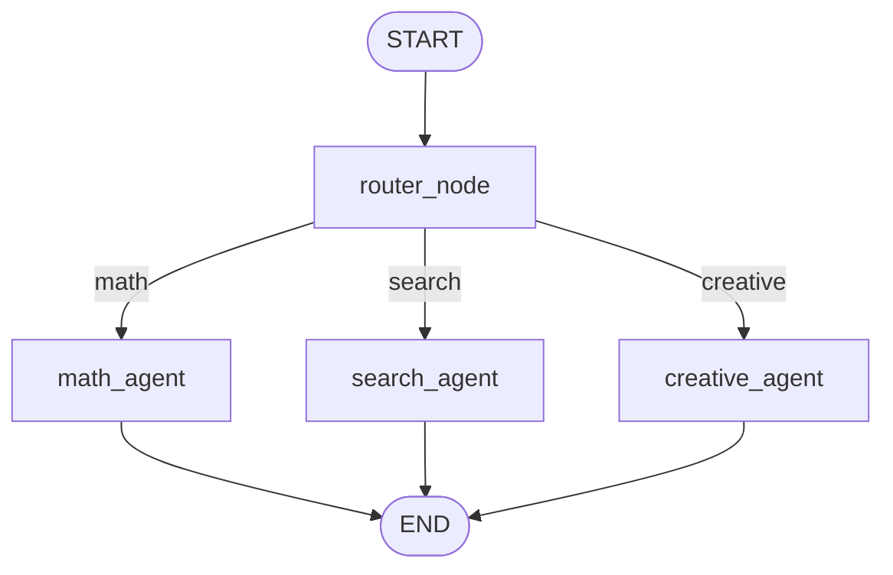
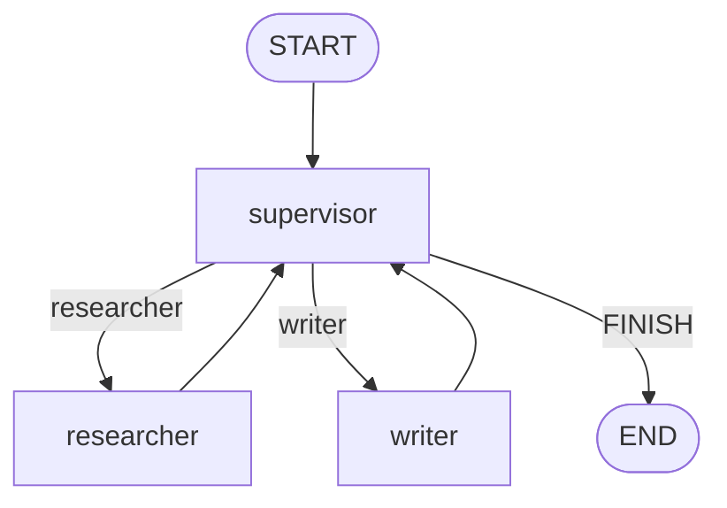
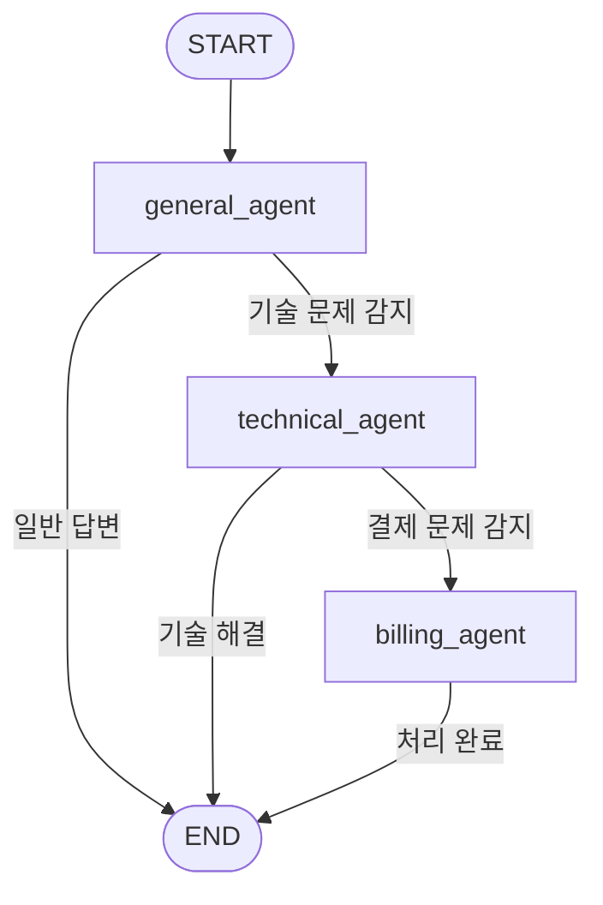

# 멀티 에이전트 패턴 {: .no_toc }

하나의 AI 에이전트가 모든 일을 처리하면 어떻게 될까요? 검색도 하고, 코드도 짜고, 글도 쓰고, 번역도 하고... 결국 어느 것 하나 제대로 못 하게 됩니다. **멀티 에이전트 패턴**은 역할을 분리하고 협업 구조를 만들어 이 문제를 해결합니다. 이 장에서는 LangGraph로 구현하는 세 가지 핵심 협업 패턴을 익힙니다.

## 학습 목표

- 멀티 에이전트 패턴이 필요한 이유를 이해한다
- Router, Supervisor, Handoff 세 가지 패턴을 구현할 수 있다
- 상황에 따라 적합한 패턴을 선택할 수 있다

<a id="toc"></a>

## 진행 순서

1. [멀티 에이전트란?](#part1)
2. [Router 패턴](#part2)
3. [Supervisor 패턴](#part3)
4. [Handoff 패턴](#part4)
5. [패턴 선택 가이드](#part5)
6. [정리](#part6)

---

<a id="part1"></a>

## 1️⃣ 멀티 에이전트란? [↑](#toc)

### 프로젝트 팀에 비유하기

스타트업 초창기에는 창업자 한 명이 개발, 영업, 마케팅, 디자인을 모두 합니다. 빠르게 시작할 수 있지만 품질이 떨어집니다. 회사가 커지면 전문가를 채용하고 역할을 분리합니다.

- **기획자**: 요구사항 분석, 우선순위 결정
- **개발자**: 코드 작성, 기술 문제 해결
- **디자이너**: UI/UX, 비주얼 작업

AI 에이전트도 똑같습니다. 하나의 에이전트에 모든 역할을 부여하면:

| 문제 | 설명 |
|------|------|
| 컨텍스트 오염 | 긴 대화 히스토리에 모든 작업 내용이 섞임 |
| 품질 저하 | 전문화되지 않은 프롬프트로 범용 결과만 생성 |
| 병목 현상 | 순차 처리로 복잡한 작업이 느려짐 |
| 오류 전파 | 한 단계 실수가 이후 모든 단계에 영향 |

### 단일 에이전트 vs 멀티 에이전트

```
[단일 에이전트]
User → 슈퍼 에이전트 (검색 + 분석 + 작성 + 번역) → 결과

[멀티 에이전트]
User → 라우터 → 검색 에이전트 → 분석 에이전트 → 작성 에이전트 → 결과
```

### 세 가지 핵심 패턴 개요

LangGraph로 구현할 수 있는 멀티 에이전트 협업 패턴은 크게 세 가지입니다.

| 패턴 | 핵심 아이디어 | 비유 |
|------|-------------|------|
| **Router** | 중앙 라우터가 요청을 적절한 전문가에게 전달 | 안내 데스크 → 해당 부서 |
| **Supervisor** | 관리자 LLM이 작업을 지시하고 결과를 평가 | 팀장이 팀원에게 업무 지시 |
| **Handoff** | 에이전트가 스스로 판단해 다음 에이전트에게 넘김 | 콜센터 부서 간 이관 |

---

<a id="part2"></a>

## 2️⃣ Router 패턴 [↑](#toc)

### 개념: 안내 데스크 모델

병원 접수 데스크를 떠올려보세요. "어디가 아프세요?"라고 물어보고 내과, 외과, 피부과 중 적절한 곳으로 안내합니다. **Router 패턴**은 이와 동일합니다. 중앙 라우터가 질문 유형을 판별하고 전문 에이전트에게 전달합니다.



### 완전한 구현 예시

```python
from typing import TypedDict, Literal
from langgraph.graph import StateGraph, START, END
from langchain_openai import ChatOpenAI
from langchain_core.messages import HumanMessage, SystemMessage

# LLM 초기화
# llm = ChatOpenAI(model="gpt-4o-mini", temperature=0)

# ── 데모용 가짜 LLM ───────────────────────────────────────────
class MockLLM:
    def __init__(self, fixed_response: str = ""):
        self.fixed_response = fixed_response

    def invoke(self, messages):
        class Response:
            def __init__(self, content):
                self.content = content
        # 질문에서 유형을 키워드로 판별 (실제는 LLM이 처리)
        text = messages[-1].content if hasattr(messages[-1], 'content') else str(messages)
        if "계산" in text or "수학" in text or any(c.isdigit() for c in text):
            return Response("math")
        elif "검색" in text or "찾아" in text or "뉴스" in text:
            return Response("search")
        else:
            return Response("creative")

router_llm = MockLLM()

# ── 상태 정의 ──────────────────────────────────────────────────
class RouterState(TypedDict):
    question: str           # 사용자 입력
    route: str              # 라우터 결정: math / search / creative
    answer: str             # 전문 에이전트의 최종 답변

# ── 라우터 노드 ────────────────────────────────────────────────
def router_node(state: RouterState) -> dict:
    """
    질문을 분석하고 어떤 전문 에이전트에게 보낼지 결정합니다.
    실제 환경에서는 LLM이 분류합니다.
    """
    question = state["question"]

    # LLM에게 분류 요청
    # system = "질문의 유형을 math, search, creative 중 하나의 단어로만 답하세요."
    # response = llm.invoke([SystemMessage(content=system), HumanMessage(content=question)])
    # route = response.content.strip().lower()

    # 데모: 키워드 기반 분류
    if any(kw in question for kw in ["계산", "수학", "더하기", "빼기", "+", "-", "*", "/"]):
        route = "math"
    elif any(kw in question for kw in ["검색", "찾아", "뉴스", "최신", "알려줘"]):
        route = "search"
    else:
        route = "creative"

    print(f"  [router] '{question[:30]}' → {route} 에이전트로 라우팅")
    return {"route": route}

# ── 전문 에이전트 노드들 ───────────────────────────────────────
def math_agent(state: RouterState) -> dict:
    """수학/계산 전문 에이전트"""
    question = state["question"]
    print(f"  [math_agent] 수식 계산 처리 중...")

    # 실제: llm.invoke([SystemMessage("당신은 수학 전문가입니다."), HumanMessage(question)])
    # 데모: 간단한 eval
    try:
        # 숫자와 연산자만 추출해서 계산
        import re
        expr = re.search(r'[\d\s\+\-\*\/\.]+', question)
        if expr:
            result = eval(expr.group().strip())
            answer = f"계산 결과: {result}"
        else:
            answer = "수학 에이전트: 계산식을 인식하지 못했습니다."
    except:
        answer = "수학 에이전트: 계산 중 오류가 발생했습니다."

    return {"answer": answer}

def search_agent(state: RouterState) -> dict:
    """검색/정보 수집 전문 에이전트"""
    question = state["question"]
    print(f"  [search_agent] 정보 검색 중...")

    # 실제: Tavily 검색 도구 + LLM 사용
    answer = (
        f"검색 에이전트 응답: '{question}'에 대해 검색한 결과입니다.\n"
        f"[검색결과 1] 관련 최신 정보를 찾았습니다.\n"
        f"[검색결과 2] 추가 참고 자료도 확인했습니다."
    )
    return {"answer": answer}

def creative_agent(state: RouterState) -> dict:
    """창의적 글쓰기/아이디어 전문 에이전트"""
    question = state["question"]
    print(f"  [creative_agent] 창의적 응답 생성 중...")

    # 실제: 창의성에 특화된 프롬프트 + 높은 temperature LLM 사용
    answer = (
        f"창의적 에이전트 응답:\n"
        f"'{question}'에 대한 아이디어를 제안합니다.\n"
        f"💡 아이디어 1: 독창적인 접근 방식을 시도해보세요.\n"
        f"💡 아이디어 2: 기존 틀을 벗어난 관점으로 생각해보세요."
    )
    return {"answer": answer}

# ── 조건부 엣지 함수 ───────────────────────────────────────────
def route_decision(state: RouterState) -> Literal["math_agent", "search_agent", "creative_agent"]:
    """라우터의 결정에 따라 다음 노드를 반환합니다."""
    route = state["route"]
    if route == "math":
        return "math_agent"
    elif route == "search":
        return "search_agent"
    else:
        return "creative_agent"

# ── 그래프 조립 ────────────────────────────────────────────────
router_builder = StateGraph(RouterState)
router_builder.add_node("router_node", router_node)
router_builder.add_node("math_agent", math_agent)
router_builder.add_node("search_agent", search_agent)
router_builder.add_node("creative_agent", creative_agent)

router_builder.add_edge(START, "router_node")
router_builder.add_conditional_edges(
    "router_node",
    route_decision,
    {
        "math_agent": "math_agent",
        "search_agent": "search_agent",
        "creative_agent": "creative_agent"
    }
)
router_builder.add_edge("math_agent", END)
router_builder.add_edge("search_agent", END)
router_builder.add_edge("creative_agent", END)

router_graph = router_builder.compile()

# ── 3가지 질문 타입 테스트 ─────────────────────────────────────
test_questions = [
    "25 + 37 * 2 계산해줘",
    "오늘 AI 관련 최신 뉴스 찾아줘",
    "우주 여행을 주제로 짧은 시 써줘"
]

print("=== Router 패턴 테스트 ===\n")
for q in test_questions:
    print(f"질문: {q}")
    result = router_graph.invoke({"question": q, "route": "", "answer": ""})
    print(f"답변: {result['answer']}\n{'─'*50}\n")
```

**실행 결과 (예시):**
```
=== Router 패턴 테스트 ===

질문: 25 + 37 * 2 계산해줘
  [router] '25 + 37 * 2 계산해줘' → math 에이전트로 라우팅
  [math_agent] 수식 계산 처리 중...
답변: 계산 결과: 99
──────────────────────────────────────────────────

질문: 오늘 AI 관련 최신 뉴스 찾아줘
  [router] '오늘 AI 관련 최신 뉴스 찾아줘' → search 에이전트로 라우팅
  [search_agent] 정보 검색 중...
답변: 검색 에이전트 응답: '오늘 AI 관련 최신 뉴스 찾아줘'에 대해 검색한 결과입니다.
[검색결과 1] 관련 최신 정보를 찾았습니다.
[검색결과 2] 추가 참고 자료도 확인했습니다.
──────────────────────────────────────────────────

질문: 우주 여행을 주제로 짧은 시 써줘
  [router] '우주 여행을 주제로 짧은 시 써줘' → creative 에이전트로 라우팅
  [creative_agent] 창의적 응답 생성 중...
답변: 창의적 에이전트 응답:
'우주 여행을 주제로 짧은 시 써줘'에 대한 아이디어를 제안합니다.
💡 아이디어 1: 독창적인 접근 방식을 시도해보세요.
💡 아이디어 2: 기존 틀을 벗어난 관점으로 생각해보세요.
──────────────────────────────────────────────────
```

> 💡 `add_conditional_edges`의 세 번째 인자(딕셔너리)는 반환값과 노드 이름을 매핑합니다. 반환값과 노드 이름이 같다면 딕셔너리 없이 함수만 전달해도 됩니다.

> ⚠️ Router 패턴에서 LLM이 라우팅 결정을 내릴 때, 예상치 못한 값을 반환할 수 있습니다. `route_decision` 함수에 `else` 분기를 항상 포함하여 폴백(fallback) 경로를 확보하세요.

---

<a id="part3"></a>

## 3️⃣ Supervisor 패턴 [↑](#toc)

### 개념: 팀장이 업무를 분배하고 검토하는 모델

Supervisor 패턴은 **관리자 LLM**이 워커 에이전트에게 작업을 지시하고, 결과를 평가하여 다음 단계를 결정합니다. 중요한 것은 Supervisor가 "지금 누가 일해야 하는가?"를 매번 판단한다는 점입니다.

```
Supervisor: "연구원, 'AI 트렌드'에 대해 조사해와"
Researcher: (조사 후 결과 반환)
Supervisor: "좋아. 이제 작가, 이 자료로 블로그 글 써줘"
Writer: (글 작성 후 반환)
Supervisor: "완성됐어. 마무리하자 (FINISH)"
```



### 완전한 구현 예시

```python
from typing import TypedDict, Literal, List
from langgraph.graph import StateGraph, START, END
from langchain_core.messages import HumanMessage, AIMessage, SystemMessage

# ── 상태 정의 ──────────────────────────────────────────────────
class SupervisorState(TypedDict):
    task: str               # 최초 작업 지시
    messages: List[dict]    # 작업 히스토리 (role + content)
    next_worker: str        # Supervisor의 다음 지시 대상
    research_result: str    # 연구원의 조사 결과
    draft: str              # 작가의 초안
    iteration: int          # 반복 횟수 (무한 루프 방지)

# ── Supervisor 노드 ────────────────────────────────────────────
def supervisor_node(state: SupervisorState) -> dict:
    """
    현재 상황을 파악하고 다음에 누가 일해야 할지 결정합니다.
    실제 환경에서는 LLM이 messages를 보고 결정합니다.
    """
    iteration = state.get("iteration", 0)
    research_result = state.get("research_result", "")
    draft = state.get("draft", "")

    print(f"\n  [supervisor] 상황 검토 중... (반복 {iteration}회)")

    # 무한 루프 방지: 최대 3회
    if iteration >= 3:
        print(f"  [supervisor] 최대 반복 횟수 도달. 마무리합니다.")
        return {"next_worker": "FINISH", "iteration": iteration + 1}

    # 결정 로직 (실제: LLM이 messages 전체를 보고 판단)
    if not research_result:
        print(f"  [supervisor] 조사가 필요합니다. → researcher")
        decision = "researcher"
    elif not draft:
        print(f"  [supervisor] 초안 작성이 필요합니다. → writer")
        decision = "writer"
    else:
        print(f"  [supervisor] 모든 작업 완료. → FINISH")
        decision = "FINISH"

    return {
        "next_worker": decision,
        "iteration": iteration + 1,
        "messages": state.get("messages", []) + [
            {"role": "supervisor", "content": f"다음 담당: {decision}"}
        ]
    }

# ── Researcher 노드 ────────────────────────────────────────────
def researcher_node(state: SupervisorState) -> dict:
    """
    Supervisor의 지시에 따라 조사를 수행합니다.
    실제 환경에서는 검색 도구(Tavily 등)를 사용합니다.
    """
    task = state["task"]
    print(f"  [researcher] '{task}' 주제 조사 중...")

    # 실제: search_tool.invoke(task) + LLM 정리
    research = (
        f"[조사 결과] '{task}' 관련 핵심 내용:\n"
        f"1. 최근 1년간 관련 특허 출원이 40% 증가했습니다.\n"
        f"2. 주요 기업들이 대규모 투자를 발표했습니다.\n"
        f"3. 전문가들은 3년 내 상용화를 예측하고 있습니다.\n"
        f"4. 국내에서도 정부 주도 R&D 프로젝트가 진행 중입니다."
    )

    return {
        "research_result": research,
        "messages": state.get("messages", []) + [
            {"role": "researcher", "content": "조사 완료"}
        ]
    }

# ── Writer 노드 ────────────────────────────────────────────────
def writer_node(state: SupervisorState) -> dict:
    """
    조사 결과를 바탕으로 글을 작성합니다.
    실제 환경에서는 LLM에 research_result를 포함한 프롬프트를 전달합니다.
    """
    task = state["task"]
    research = state["research_result"]
    print(f"  [writer] '{task}' 주제 글 작성 중...")

    # 실제: llm.invoke([SystemMessage("전문 작가입니다"), HumanMessage(research)])
    draft = (
        f"# {task}: 현황과 전망\n\n"
        f"최근 기술 업계에서 {task}는 가장 뜨거운 화두로 떠오르고 있다.\n\n"
        f"## 시장 현황\n"
        f"{research}\n\n"
        f"## 결론\n"
        f"{task}의 발전 속도는 예상을 뛰어넘고 있으며, "
        f"빠른 시일 내에 우리 일상에 깊숙이 자리 잡을 것으로 보인다."
    )

    return {
        "draft": draft,
        "messages": state.get("messages", []) + [
            {"role": "writer", "content": "초안 완성"}
        ]
    }

# ── 조건부 엣지 함수 ───────────────────────────────────────────
def supervisor_router(state: SupervisorState) -> Literal["researcher", "writer", "__end__"]:
    """Supervisor의 결정에 따라 다음 노드를 선택합니다."""
    next_worker = state["next_worker"]
    if next_worker == "FINISH":
        return "__end__"
    return next_worker

# ── 그래프 조립 ────────────────────────────────────────────────
supervisor_builder = StateGraph(SupervisorState)
supervisor_builder.add_node("supervisor", supervisor_node)
supervisor_builder.add_node("researcher", researcher_node)
supervisor_builder.add_node("writer", writer_node)

supervisor_builder.add_edge(START, "supervisor")
supervisor_builder.add_conditional_edges(
    "supervisor",
    supervisor_router,
    {
        "researcher": "researcher",
        "writer": "writer",
        "__end__": END
    }
)
# 워커들은 작업 후 항상 Supervisor에게 보고
supervisor_builder.add_edge("researcher", "supervisor")
supervisor_builder.add_edge("writer", "supervisor")

supervisor_graph = supervisor_builder.compile()

# ── 실행 ──────────────────────────────────────────────────────
print("=== Supervisor 패턴 실행 ===")
result = supervisor_graph.invoke({
    "task": "양자 컴퓨팅",
    "messages": [],
    "next_worker": "",
    "research_result": "",
    "draft": "",
    "iteration": 0
})

print("\n=== 최종 결과물 ===")
print(result["draft"])
print(f"\n총 반복 횟수: {result['iteration'] - 1}회")
print(f"작업 히스토리: {[m['role'] for m in result['messages']]}")
```

**실행 결과 (예시):**
```
=== Supervisor 패턴 실행 ===

  [supervisor] 상황 검토 중... (반복 0회)
  [supervisor] 조사가 필요합니다. → researcher
  [researcher] '양자 컴퓨팅' 주제 조사 중...

  [supervisor] 상황 검토 중... (반복 1회)
  [supervisor] 초안 작성이 필요합니다. → writer
  [writer] '양자 컴퓨팅' 주제 글 작성 중...

  [supervisor] 상황 검토 중... (반복 2회)
  [supervisor] 모든 작업 완료. → FINISH

=== 최종 결과물 ===
# 양자 컴퓨팅: 현황과 전망

최근 기술 업계에서 양자 컴퓨팅는 가장 뜨거운 화두로 떠오르고 있다.

## 시장 현황
[조사 결과] '양자 컴퓨팅' 관련 핵심 내용:
1. 최근 1년간 관련 특허 출원이 40% 증가했습니다.
...

총 반복 횟수: 2회
작업 히스토리: ['supervisor', 'researcher', 'supervisor', 'writer', 'supervisor']
```

> ⚠️ Supervisor 패턴은 **비용이 더 많이 듭니다.** Supervisor가 매번 LLM을 호출하여 판단하기 때문에 워커 에이전트 수 × LLM 호출 횟수만큼 추가 비용이 발생합니다. 반드시 최대 반복 횟수(`iteration >= N`) 제한을 설정하세요.

> 💡 실제 Supervisor 패턴에서는 `messages` 필드에 전체 대화 히스토리를 담고, LLM이 이를 보고 다음 워커를 선택합니다. 구조화된 출력(`structured_output`)을 사용하면 더 안정적입니다.

---

<a id="part4"></a>

## 4️⃣ Handoff 패턴 [↑](#toc)

### 개념: 자율적인 업무 이관 모델

고객센터를 상상해보세요.

1. **일반 상담사**: 간단한 문의를 처리합니다. 기술 문제가 생기면 → 기술 지원팀으로 이관
2. **기술 지원팀**: 기술 문제를 해결합니다. 환불 요청이 생기면 → 결제 담당팀으로 이관
3. **결제 담당팀**: 결제/환불 처리합니다. 처리 완료 후 종료

**Handoff 패턴**의 핵심은 에이전트가 **스스로 판단**하여 다른 에이전트에게 제어권을 넘긴다는 것입니다. Supervisor처럼 중앙 관리자가 없습니다.



### LangGraph의 `Command`를 사용한 Handoff

LangGraph는 노드 안에서 다음 노드를 동적으로 지정하는 `Command` 객체를 제공합니다.

```python
from typing import TypedDict, List, Optional
from langgraph.graph import StateGraph, START, END
from langgraph.types import Command

# ── 상태 정의 ──────────────────────────────────────────────────
class HandoffState(TypedDict):
    user_message: str           # 사용자 입력
    conversation: List[str]     # 대화 기록
    current_agent: str          # 현재 처리 에이전트
    resolved: bool              # 문제 해결 여부

# ── General Agent ─────────────────────────────────────────────
def general_agent(state: HandoffState) -> Command:
    """
    일반 문의를 처리합니다.
    기술 문제가 포함되면 technical_agent로 핸드오프합니다.
    """
    message = state["user_message"]
    conv = state.get("conversation", [])
    print(f"  [general_agent] 메시지 분석 중: '{message[:40]}'")

    # 기술 관련 키워드 감지
    tech_keywords = ["오류", "버그", "에러", "작동 안", "설치", "업데이트", "충돌"]
    has_tech_issue = any(kw in message for kw in tech_keywords)

    # 결제 관련 키워드 감지
    billing_keywords = ["환불", "결제", "청구", "구독 취소", "요금"]
    has_billing_issue = any(kw in message for kw in billing_keywords)

    if has_billing_issue:
        print(f"  [general_agent] 결제 문제 감지 → billing_agent로 직접 핸드오프")
        return Command(
            goto="billing_agent",
            update={
                "current_agent": "billing_agent",
                "conversation": conv + [
                    f"General: 결제 문제가 확인되었습니다. 결제 전담팀으로 연결합니다."
                ]
            }
        )
    elif has_tech_issue:
        print(f"  [general_agent] 기술 문제 감지 → technical_agent로 핸드오프")
        return Command(
            goto="technical_agent",
            update={
                "current_agent": "technical_agent",
                "conversation": conv + [
                    f"General: 기술적인 문제가 확인되었습니다. 기술 지원팀으로 연결합니다."
                ]
            }
        )
    else:
        # 직접 처리 가능한 일반 문의
        print(f"  [general_agent] 일반 문의 직접 처리 완료")
        return Command(
            goto=END,
            update={
                "resolved": True,
                "conversation": conv + [
                    f"General: 문의 주셔서 감사합니다. 안내드리겠습니다. (일반 답변 처리 완료)"
                ]
            }
        )

# ── Technical Agent ────────────────────────────────────────────
def technical_agent(state: HandoffState) -> Command:
    """
    기술 문제를 처리합니다.
    결제 문제가 함께 있으면 billing_agent로 핸드오프합니다.
    """
    message = state["user_message"]
    conv = state.get("conversation", [])
    print(f"  [technical_agent] 기술 문제 해결 중...")

    # 결제 관련 키워드 추가 감지
    billing_keywords = ["환불", "결제", "청구", "요금"]
    has_billing = any(kw in message for kw in billing_keywords)

    if has_billing:
        print(f"  [technical_agent] 결제 문제도 포함 → billing_agent로 핸드오프")
        return Command(
            goto="billing_agent",
            update={
                "current_agent": "billing_agent",
                "conversation": conv + [
                    "Technical: 기술 문제는 해결했습니다. 결제 관련 부분은 결제팀으로 연결합니다."
                ]
            }
        )
    else:
        print(f"  [technical_agent] 기술 문제 해결 완료")
        return Command(
            goto=END,
            update={
                "resolved": True,
                "conversation": conv + [
                    "Technical: 기술 문제를 확인하고 해결 방법을 안내드립니다. (기술 지원 완료)"
                ]
            }
        )

# ── Billing Agent ─────────────────────────────────────────────
def billing_agent(state: HandoffState) -> Command:
    """
    결제/환불 문제를 처리합니다. 항상 최종 처리합니다.
    """
    conv = state.get("conversation", [])
    print(f"  [billing_agent] 결제/환불 처리 중...")

    return Command(
        goto=END,
        update={
            "resolved": True,
            "conversation": conv + [
                "Billing: 결제 및 환불 처리를 완료했습니다. 3-5 영업일 내 처리됩니다."
            ]
        }
    )

# ── 그래프 조립 ────────────────────────────────────────────────
handoff_builder = StateGraph(HandoffState)
handoff_builder.add_node("general_agent", general_agent)
handoff_builder.add_node("technical_agent", technical_agent)
handoff_builder.add_node("billing_agent", billing_agent)

# Command를 사용하므로 add_edge 대신 노드만 등록
handoff_builder.add_edge(START, "general_agent")

handoff_graph = handoff_builder.compile()

# ── 다양한 시나리오 테스트 ─────────────────────────────────────
scenarios = [
    ("오늘 날씨는 어때요?", "일반 문의"),
    ("앱이 자꾸 오류가 나요. 어떻게 해야 하나요?", "기술 문제"),
    ("결제가 잘못 청구된 것 같아서 환불 요청드립니다.", "결제 문제"),
    ("업데이트 후 앱 충돌이 나고 지난달 요금도 이상해요.", "복합 문제"),
]

print("=== Handoff 패턴 테스트 ===\n")
for message, scenario_name in scenarios:
    print(f"[시나리오: {scenario_name}]")
    print(f"사용자: {message}")
    result = handoff_graph.invoke({
        "user_message": message,
        "conversation": [],
        "current_agent": "general_agent",
        "resolved": False
    })
    print("대화 흐름:")
    for conv_msg in result["conversation"]:
        print(f"  → {conv_msg}")
    print(f"해결 여부: {result['resolved']}\n{'─'*60}\n")
```

**실행 결과 (예시):**
```
=== Handoff 패턴 테스트 ===

[시나리오: 일반 문의]
사용자: 오늘 날씨는 어때요?
  [general_agent] 메시지 분석 중: '오늘 날씨는 어때요?'
  [general_agent] 일반 문의 직접 처리 완료
대화 흐름:
  → General: 문의 주셔서 감사합니다. 안내드리겠습니다. (일반 답변 처리 완료)
해결 여부: True
────────────────────────────────────────────────────────────

[시나리오: 기술 문제]
사용자: 앱이 자꾸 오류가 나요. 어떻게 해야 하나요?
  [general_agent] 메시지 분석 중: '앱이 자꾸 오류가 나요. 어떻게 해야 하나요?'
  [general_agent] 기술 문제 감지 → technical_agent로 핸드오프
  [technical_agent] 기술 문제 해결 중...
  [technical_agent] 기술 문제 해결 완료
대화 흐름:
  → General: 기술적인 문제가 확인되었습니다. 기술 지원팀으로 연결합니다.
  → Technical: 기술 문제를 확인하고 해결 방법을 안내드립니다. (기술 지원 완료)
해결 여부: True
────────────────────────────────────────────────────────────

[시나리오: 결제 문제]
사용자: 결제가 잘못 청구된 것 같아서 환불 요청드립니다.
  [general_agent] 메시지 분석 중: '결제가 잘못 청구된 것 같아서 환불 요청드립니다.'
  [general_agent] 결제 문제 감지 → billing_agent로 직접 핸드오프
  [billing_agent] 결제/환불 처리 중...
대화 흐름:
  → General: 결제 문제가 확인되었습니다. 결제 전담팀으로 연결합니다.
  → Billing: 결제 및 환불 처리를 완료했습니다. 3-5 영업일 내 처리됩니다.
해결 여부: True
────────────────────────────────────────────────────────────

[시나리오: 복합 문제]
사용자: 업데이트 후 앱 충돌이 나고 지난달 요금도 이상해요.
  [general_agent] 메시지 분석 중: '업데이트 후 앱 충돌이 나고 지난달 요금도 이상해요.'
  [general_agent] 기술 문제 감지 → technical_agent로 핸드오프
  [technical_agent] 기술 문제 해결 중...
  [technical_agent] 결제 문제도 포함 → billing_agent로 핸드오프
  [billing_agent] 결제/환불 처리 중...
대화 흐름:
  → General: 기술적인 문제가 확인되었습니다. 기술 지원팀으로 연결합니다.
  → Technical: 기술 문제는 해결했습니다. 결제 관련 부분은 결제팀으로 연결합니다.
  → Billing: 결제 및 환불 처리를 완료했습니다. 3-5 영업일 내 처리됩니다.
해결 여부: True
────────────────────────────────────────────────────────────
```

### Command 객체 정리

```python
# Command의 주요 파라미터
from langgraph.types import Command

Command(
    goto="next_node_name",  # 다음으로 이동할 노드 (또는 END)
    update={                # 상태 업데이트 (선택사항)
        "field": "value"
    }
)

# END로 이동하는 두 가지 방법
Command(goto=END, update={...})         # langgraph.graph의 END 상수
Command(goto="__end__", update={...})   # 문자열로도 가능
```

> 💡 `Command`를 사용하면 노드가 **상태 업데이트**와 **다음 노드 지정**을 동시에 반환할 수 있습니다. Supervisor 없이도 에이전트 스스로 흐름을 제어합니다.

> ⚠️ Handoff 패턴에서는 순환(A → B → A → B...)이 발생할 수 있습니다. 반드시 `resolved` 플래그나 `max_handoffs` 카운터로 무한 루프를 방지하세요.

---

<a id="part5"></a>

## 5️⃣ 패턴 선택 가이드 [↑](#toc)

### Decision Matrix

| 상황 | 추천 패턴 | 이유 |
|------|----------|------|
| 질문 유형별 분류가 명확하고 단순함 | Router | 가장 단순하고 효율적, LLM 호출 최소화 |
| 작업 품질을 반복적으로 검증해야 함 | Supervisor | 관리자가 품질 통제, 재시도 가능 |
| 대화 흐름에 따라 담당자가 자연스럽게 바뀜 | Handoff | 에이전트가 자율 판단, 자연스러운 전환 |
| 독립적인 하위 작업을 병렬로 수행 | 서브그래프 (9장) | 병렬 실행 + 모듈화 |
| 위 패턴을 조합해야 하는 복잡한 시스템 | 혼합 | Router가 Supervisor를 호출하는 등 중첩 가능 |

### 패턴 비교표

| 항목 | Router | Supervisor | Handoff |
|------|--------|------------|---------|
| 중앙 관리자 | 있음 (라우터) | 있음 (Supervisor LLM) | 없음 |
| 에이전트 자율성 | 낮음 | 중간 | 높음 |
| LLM 호출 횟수 | 적음 (라우팅 1회) | 많음 (매 단계 Supervisor) | 중간 (각 에이전트 판단) |
| 비용 | 낮음 | 높음 | 중간 |
| 구현 복잡도 | 낮음 | 중간 | 중간 |
| 확장성 | 좋음 (에이전트 추가 쉬움) | 보통 | 좋음 |
| 적합한 사례 | FAQ 분류, 챗봇 메뉴 | 보고서 생성, 코드 리뷰 | 고객 지원, 업무 이관 |
| 무한 루프 위험 | 없음 | 낮음 (FINISH 조건) | 있음 (핸드오프 체인) |

### 실전 선택 기준

```
질문 1: 에이전트를 선택하는 기준이 입력에만 의존하는가?
  → YES: Router 패턴

질문 2: 작업 결과를 검토하고 재시도하는 과정이 필요한가?
  → YES: Supervisor 패턴

질문 3: 처리 중에 새로운 문제가 발견되어 담당자가 바뀌어야 하는가?
  → YES: Handoff 패턴

질문 4: 여러 독립 기능을 병렬로 처리해야 하는가?
  → YES: 서브그래프 (9장 참고)
```

> 💡 실제 프로덕션 시스템에서는 패턴을 혼합해서 사용합니다. 예: Router가 질문 유형을 분류하고, 각 전문 에이전트 내부는 Supervisor 패턴으로 품질을 관리합니다.

---

<a id="part6"></a>

## 6️⃣ 정리 [↑](#toc)

### 핵심 개념 정리

| 패턴 | 핵심 코드 패턴 | 특징 |
|------|-------------|------|
| Router | `add_conditional_edges` + `route_decision()` | 진입점 단일, 분기 후 END |
| Supervisor | 루프 구조 + `FINISH` 조건 + `add_edge(worker, supervisor)` | 워커가 Supervisor에게 보고 |
| Handoff | `Command(goto="next_agent", update={...})` | 에이전트가 자율적으로 제어권 이관 |

### 학습 체크리스트

- [ ] 단일 에이전트의 한계와 멀티 에이전트가 필요한 이유를 설명할 수 있다
- [ ] Router 패턴을 `add_conditional_edges`로 구현할 수 있다
- [ ] Supervisor 패턴에서 루프와 FINISH 조건을 올바르게 설정할 수 있다
- [ ] `Command(goto=...)` 객체를 사용한 Handoff를 구현할 수 있다
- [ ] 각 패턴의 비용, 복잡도, 적합한 사용 사례를 비교할 수 있다
- [ ] 무한 루프 방지 장치(최대 반복 횟수, resolved 플래그)를 적용할 수 있다

### 🎯 실습 미션

**미션 1 — Router 패턴에 번역 에이전트 추가**

Router 패턴 예시에 `translation_agent`를 추가하세요. "번역", "영어로", "한국어로" 키워드가 포함된 질문은 번역 에이전트가 처리하도록 합니다.

```python
# 힌트: route_decision 함수에 분기 추가
def route_decision(state):
    route = state["route"]
    if route == "translation":
        return "translation_agent"
    # ... 기존 코드 ...

# translation_agent 노드 구현
def translation_agent(state: RouterState) -> dict:
    # 구현해보세요
    ...
```

**미션 2 — Supervisor 패턴에 최대 반복 제한 추가**

Supervisor 예시를 수정하여 **정확히 최대 3회** 반복하도록 제한하고, 반복 횟수를 초과하면 지금까지의 결과로 보고서를 작성하도록 합니다. `iteration >= 3`일 때 draft가 없어도 강제로 writer를 한 번 더 호출하는 대신 "불완전한 보고서" 메시지를 반환하도록 구현해보세요.

```python
def supervisor_node(state):
    if state["iteration"] >= 3:
        return {
            "next_worker": "FINISH",
            "draft": state.get("draft") or "⚠️ 최대 반복 횟수 초과: 보고서 생성 불완전"
        }
    # ... 기존 로직 ...
```

**미션 3 — Handoff 패턴으로 음식 추천 파이프라인 구성**

음식 추천 → 장소 검색 → 경로 안내 세 에이전트를 Handoff 패턴으로 연결하세요.

```
food_agent: 음식 취향 파악 → (장소 검색이 필요하면) place_agent로 핸드오프
place_agent: 근처 식당 검색 → (경로가 필요하면) route_agent로 핸드오프
route_agent: 경로 안내 제공 → END
```

사용자 메시지: `"근처에 파스타 맛있는 곳으로 어떻게 가는지 알려줘"`가 전체 파이프라인을 통과하도록 구현해보세요.

---

→ **다음 장**: [11. 에러 처리와 재시도](/llm/langgraph/error_handling)
