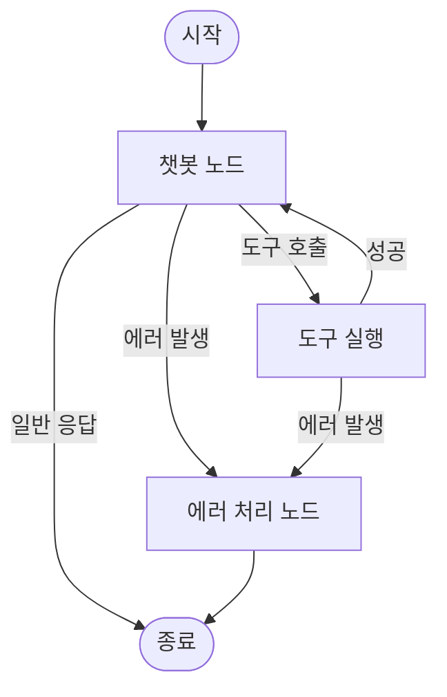


# 에러 처리와 재시도 {: .no_toc }

실제 운영 환경에서 AI 에이전트는 다양한 이유로 실패할 수 있습니다. API 서버가 잠시 다운되거나, 요금 한도를 초과하거나, LLM이 기대와 다른 형식으로 응답할 수도 있습니다. 이 장에서는 그래프가 실패해도 우아하게 복구하는 방법을 배웁니다.

## 학습 목표

- AI 에이전트에서 발생하는 대표적인 에러 유형을 이해한다
- 도구 함수 내부에서 try/except로 에러를 캡처하고 폴백 동작을 구현한다
- `tenacity`를 사용하여 일시적 에러에 대한 재시도 정책을 설정한다
- LLM 출력 파싱 실패 시 자동 수정 패턴을 적용한다
- 에러 처리 전용 노드를 그래프에 추가하는 방법을 이해한다

<a id="toc"></a>

## 진행 순서

1. [왜 에러 처리가 중요한가?](#part1)
2. [도구 실행 에러 처리](#part2)
3. [재시도 정책 (Retry)](#part3)
4. [LLM 출력 검증과 자동 수정](#part4)
5. [그래프 수준 에러 처리](#part5)
6. [정리](#part6)

---

<a id="part1"></a>

## 1️⃣ 왜 에러 처리가 중요한가? [↑](#toc)

### 비행기 조종에 비유하기

비행기 조종사는 엔진이 두 개입니다. 그 이유가 무엇일까요? 하나가 꺼졌을 때도 착륙할 수 있어야 하기 때문입니다. 승객은 그 사실조차 모를 수 있습니다. 조종사는 조용히 문제를 처리하고 비행을 이어나갑니다.

AI 에이전트도 마찬가지입니다. 내부에서 무언가 실패해도, 사용자에게는 "죄송합니다, 오류가 발생했습니다."라는 메시지 대신 적절한 폴백 응답을 제공해야 합니다.

### AI 에이전트에서 흔한 에러 유형

실제 운영 환경에서 자주 마주치는 에러를 살펴보겠습니다.

| 에러 유형 | 예시 | 특성 |
|-----------|------|------|
| API 타임아웃 | 검색 API가 10초 내에 응답하지 않음 | 일시적, 재시도 가능 |
| 요금 초과 | OpenAI API rate limit 초과 | 일시적, 대기 후 재시도 |
| JSON 파싱 실패 | LLM이 ```json 블록 없이 JSON을 반환 | 재프롬프팅으로 수정 |
| 네트워크 오류 | 인터넷 연결 불안정 | 일시적, 재시도 가능 |
| 인증 실패 | API 키 만료 또는 오류 | 영구적, 즉시 실패 |
| 입력 검증 실패 | 사용자가 너무 긴 텍스트를 입력 | 영구적, 즉시 실패 |

### 에러 처리가 없으면 어떻게 될까?

```python
# 에러 처리가 없는 취약한 코드
from langchain_community.tools.tavily_search import TavilySearchResults

def search_tool(query: str) -> str:
    result = TavilySearchResults(max_results=3).invoke(query)
    return str(result)
```

위 코드에서 Tavily API 서버가 응답하지 않으면:

1. `search_tool`이 예외를 던집니다.
2. 예외가 LangGraph 노드까지 전파됩니다.
3. **전체 그래프 실행이 중단됩니다.**
4. 사용자는 빈 응답 또는 500 에러를 받습니다.

사용자 입장에서는 "서비스가 고장났다"는 인상을 받게 됩니다. 단 하나의 부품 실패가 전체 시스템을 멈추는 것은 좋은 설계가 아닙니다.

> 💡 **원칙**: 예외는 가능한 한 발생 지점 가까이에서 잡아야 합니다. 에러가 위로 전파될수록 복구가 어려워집니다.

---

<a id="part2"></a>

## 2️⃣ 도구 실행 에러 처리 [↑](#toc)

### 기본 패턴: try/except로 에러를 메시지로 변환하기

도구 함수에서 에러가 발생하면, 예외를 던지는 대신 에러 내용을 담은 문자열을 반환합니다. LLM은 이 에러 메시지를 받아 자체 지식으로 폴백 응답을 생성합니다.

```python
from langchain_core.tools import tool
from langchain_community.tools.tavily_search import TavilySearchResults

@tool
def search_web(query: str) -> str:
    """웹에서 최신 정보를 검색합니다."""
    try:
        searcher = TavilySearchResults(max_results=3)
        result = searcher.invoke(query)
        return str(result)
    except Exception as e:
        return f"검색 중 오류가 발생했습니다: {str(e)}. 다른 방법으로 답변하겠습니다."
```

이 패턴의 핵심은 **에러를 LLM이 이해할 수 있는 메시지로 변환**하는 것입니다. LLM은 "검색 실패"라는 정보를 바탕으로 자신의 내부 지식을 활용해 답변을 이어갑니다.

### 폴백 동작이 포함된 완전한 예제

```python
from langchain_openai import ChatOpenAI
from langchain_core.tools import tool
from langchain_core.messages import HumanMessage
from langgraph.graph import StateGraph, START, END
from langgraph.graph.message import add_messages
from langgraph.prebuilt import ToolNode
from typing_extensions import TypedDict
from typing import Annotated, Literal
from dotenv import load_dotenv
import os

load_dotenv()
openai_model = os.getenv("OPENAI_MODEL", "gpt-4o-mini")

# --- 에러 처리가 포함된 도구 정의 ---

@tool
def search_web(query: str) -> str:
    """웹에서 최신 정보를 검색합니다."""
    try:
        from langchain_community.tools.tavily_search import TavilySearchResults
        searcher = TavilySearchResults(max_results=3)
        result = searcher.invoke(query)
        return str(result)
    except Exception as e:
        # 에러를 예외로 던지지 않고, 에러 메시지를 반환
        return (
            f"검색 중 오류가 발생했습니다: {str(e)}\n"
            "검색 결과 없이 기존 지식으로 답변합니다."
        )

@tool
def calculate(expression: str) -> str:
    """수학 표현식을 계산합니다. 예: '2 + 3 * 4'"""
    try:
        # eval은 위험할 수 있으므로 실제 운영에서는 safer 라이브러리 사용 권장
        allowed_chars = set("0123456789+-*/()., ")
        if not all(c in allowed_chars for c in expression):
            return f"허용되지 않는 문자가 포함되어 있습니다: {expression}"
        result = eval(expression)
        return f"계산 결과: {result}"
    except ZeroDivisionError:
        return "오류: 0으로 나눌 수 없습니다."
    except SyntaxError:
        return f"오류: '{expression}'은 유효한 수학 표현식이 아닙니다."
    except Exception as e:
        return f"계산 중 오류가 발생했습니다: {str(e)}"

tools = [search_web, calculate]
llm = ChatOpenAI(model=openai_model)
llm_with_tools = llm.bind_tools(tools)

# --- 그래프 정의 ---

class State(TypedDict):
    messages: Annotated[list, add_messages]

def chatbot(state: State):
    return {"messages": [llm_with_tools.invoke(state["messages"])]}

def route_tools(state: State) -> Literal["tools", END]:
    last_message = state["messages"][-1]
    if hasattr(last_message, "tool_calls") and last_message.tool_calls:
        return "tools"
    return END

workflow = StateGraph(State)
workflow.add_node("chatbot", chatbot)
workflow.add_node("tools", ToolNode(tools))
workflow.add_edge(START, "chatbot")
workflow.add_conditional_edges("chatbot", route_tools)
workflow.add_edge("tools", "chatbot")

graph = workflow.compile()

# --- 실행 (정상 시나리오) ---
print("=== 정상 시나리오 ===")
result = graph.invoke({
    "messages": [HumanMessage(content="파이썬이란 무엇인가요?")]
})
print(result["messages"][-1].content)

# --- 실행 (에러 시나리오: 잘못된 계산식) ---
print("\n=== 에러 시나리오 (잘못된 계산식) ===")
result = graph.invoke({
    "messages": [HumanMessage(content="abc + def를 계산해줘")]
})
print(result["messages"][-1].content)
```

**실행 결과 (예시):**
```
=== 정상 시나리오 ===
파이썬(Python)은 1991년 귀도 반 로섬이 개발한 고급 프로그래밍 언어입니다.
간결하고 읽기 쉬운 문법으로 초보자부터 전문가까지 널리 사용됩니다...

=== 에러 시나리오 (잘못된 계산식) ===
죄송합니다. 'abc + def'는 수학적으로 계산 가능한 표현식이 아닙니다.
계산기는 숫자와 연산자(+, -, *, /)로 구성된 표현식만 처리할 수 있습니다.
예를 들어 '3 + 5' 또는 '10 * 2 - 4' 형태로 입력해 주세요.
```

> 💡 LLM은 에러 메시지를 받으면 "아, 이 도구가 실패했구나"를 인식하고, 자동으로 사용자에게 적절한 안내를 제공합니다. 사용자 입장에서는 내부 에러가 발생했다는 사실을 알지 못합니다.

> ⚠️ **주의**: 에러 메시지를 너무 기술적으로 작성하면 LLM이 그대로 사용자에게 전달할 수 있습니다. "오류 코드: ECONNRESET" 보다는 "검색 서버에 일시적으로 연결할 수 없습니다"처럼 사용자 친화적으로 작성하세요.

---

<a id="part3"></a>

## 3️⃣ 재시도 정책 (Retry) [↑](#toc)

### 언제 재시도가 필요한가?

모든 에러에 재시도가 적합하지는 않습니다. 에러를 두 가지로 분류해봅시다.

| 구분 | 예시 | 재시도 전략 |
|------|------|-------------|
| **일시적 에러** | 네트워크 타임아웃, API 요금 초과, 서버 과부하 | 잠시 기다렸다가 재시도 |
| **영구적 에러** | 잘못된 API 키, 없는 URL, 잘못된 입력 형식 | 즉시 포기, 에러 보고 |

일시적 에러는 잠시 기다리면 성공할 가능성이 높습니다. 영구적 에러는 몇 번을 재시도해도 같은 결과입니다.

### tenacity 라이브러리

`tenacity`는 파이썬에서 가장 널리 쓰이는 재시도 라이브러리입니다. 데코레이터 하나로 재시도 정책을 적용할 수 있습니다.

```bash
pip install tenacity
```

### 기본 재시도 패턴

```python
from tenacity import (
    retry,
    stop_after_attempt,
    wait_exponential,
    retry_if_exception_type
)
import requests

@retry(
    stop=stop_after_attempt(3),           # 최대 3번 시도
    wait=wait_exponential(multiplier=1, min=1, max=10),  # 지수 백오프
    retry=retry_if_exception_type(requests.exceptions.Timeout)  # 타임아웃만 재시도
)
def call_api_with_retry(query: str) -> str:
    """타임아웃 발생 시 자동으로 재시도하는 API 호출"""
    response = requests.get(
        "https://api.example.com/search",
        params={"q": query},
        timeout=5
    )
    response.raise_for_status()
    return response.json()
```

### Exponential Backoff (지수 백오프) 이해하기

지수 백오프란 재시도할 때마다 대기 시간을 지수적으로 늘리는 전략입니다.

```
1번 실패 → 1초 대기 → 2번 시도
2번 실패 → 2초 대기 → 3번 시도
3번 실패 → 4초 대기 → 4번 시도 (또는 포기)
```

왜 대기 시간을 늘릴까요? 서버가 과부하 상태일 때 즉시 재시도하면 서버 부하를 더 높여 문제를 악화시킵니다. 잠시 기다려 서버가 회복할 시간을 주는 것이 현명합니다.

### LangGraph 도구에 재시도 적용하기

```python
from langchain_openai import ChatOpenAI
from langchain_core.tools import tool
from langchain_core.messages import HumanMessage
from langgraph.graph import StateGraph, START, END
from langgraph.graph.message import add_messages
from langgraph.prebuilt import ToolNode
from tenacity import retry, stop_after_attempt, wait_exponential, RetryError
from typing_extensions import TypedDict
from typing import Annotated, Literal
from dotenv import load_dotenv
import requests
import os

load_dotenv()
openai_model = os.getenv("OPENAI_MODEL", "gpt-4o-mini")

# --- 재시도 정책이 적용된 내부 함수 ---

@retry(
    stop=stop_after_attempt(3),
    wait=wait_exponential(multiplier=1, min=1, max=10)
)
def _fetch_weather_data(city: str) -> dict:
    """날씨 API 호출 (실패 시 최대 3회 재시도)"""
    response = requests.get(
        f"https://api.openweathermap.org/data/2.5/weather",
        params={
            "q": city,
            "appid": os.getenv("WEATHER_API_KEY", ""),
            "units": "metric",
            "lang": "kr"
        },
        timeout=5
    )
    response.raise_for_status()
    return response.json()

# --- 도구 함수: 재시도 실패 시에도 에러를 우아하게 처리 ---

@tool
def get_weather(city: str) -> str:
    """특정 도시의 현재 날씨를 가져옵니다."""
    try:
        data = _fetch_weather_data(city)
        temp = data["main"]["temp"]
        description = data["weather"][0]["description"]
        return f"{city}의 현재 날씨: {description}, 기온: {temp}°C"
    except RetryError:
        return f"{city}의 날씨 정보를 가져오지 못했습니다 (3회 시도 후 실패). 날씨 정보 없이 답변합니다."
    except requests.exceptions.HTTPError as e:
        if e.response.status_code == 404:
            return f"'{city}'를 찾을 수 없습니다. 도시 이름을 다시 확인해주세요."
        return f"날씨 API 오류: {str(e)}"
    except Exception as e:
        return f"날씨 정보를 가져오는 중 예상치 못한 오류가 발생했습니다: {str(e)}"

# --- 그래프 구성 ---

tools = [get_weather]
llm = ChatOpenAI(model=openai_model)
llm_with_tools = llm.bind_tools(tools)

class State(TypedDict):
    messages: Annotated[list, add_messages]

def chatbot(state: State):
    return {"messages": [llm_with_tools.invoke(state["messages"])]}

def route_tools(state: State) -> Literal["tools", END]:
    last_message = state["messages"][-1]
    if hasattr(last_message, "tool_calls") and last_message.tool_calls:
        return "tools"
    return END

workflow = StateGraph(State)
workflow.add_node("chatbot", chatbot)
workflow.add_node("tools", ToolNode(tools))
workflow.add_edge(START, "chatbot")
workflow.add_conditional_edges("chatbot", route_tools)
workflow.add_edge("tools", "chatbot")

graph = workflow.compile()

# --- 실행 ---
result = graph.invoke({
    "messages": [HumanMessage(content="서울 날씨 어때?")]
})
print(result["messages"][-1].content)
```

**실행 결과 (예시):**
```
현재 서울의 날씨 정보를 가져오지 못했습니다 (3회 시도 후 실패).
날씨 관련 질문에는 기상청 앱이나 날씨 웹사이트를 직접 확인하시길 권장합니다.
```

> 💡 재시도 횟수는 보통 3회가 적당합니다. 5회 이상 재시도하면 응답 지연이 너무 길어져 사용자 경험이 나빠집니다.

---

<a id="part4"></a>

## 4️⃣ LLM 출력 검증과 자동 수정 [↑](#toc)

### 문제: LLM의 JSON 응답이 깨질 때

LLM에게 "JSON 형식으로 응답해주세요"라고 요청해도, 가끔 다음과 같은 문제가 발생합니다.

```
# 기대한 응답
{"name": "김철수", "age": 30, "city": "서울"}

# 실제로 받은 응답
물론입니다! 다음은 JSON 형식입니다:
```json
{"name": "김철수", "age": 30, "city": "서울"}
```
```

또는 더 심각한 경우:
```
{"name": "김철수", "age": 30, city: "서울"}  # 따옴표 누락
```

### Pattern 1: 수동 재프롬프팅

실패할 때마다 "JSON 형식이 잘못됐습니다"라고 알려주고 다시 요청하는 방식입니다.

```python
from langchain_openai import ChatOpenAI
from langchain_core.messages import HumanMessage, SystemMessage
import json
from dotenv import load_dotenv
import os

load_dotenv()
openai_model = os.getenv("OPENAI_MODEL", "gpt-4o-mini")
llm = ChatOpenAI(model=openai_model)

def parse_with_retry(prompt: str, max_retries: int = 3) -> dict:
    """LLM 응답을 JSON으로 파싱하며, 실패 시 재프롬프팅"""
    messages = [
        SystemMessage(content="반드시 유효한 JSON만 응답하세요. 설명 없이 JSON 객체만 출력하세요."),
        HumanMessage(content=prompt)
    ]

    for attempt in range(max_retries):
        response = llm.invoke(messages)
        raw = response.content.strip()

        # ```json ... ``` 블록 제거 시도
        if raw.startswith("```"):
            lines = raw.split("\n")
            raw = "\n".join(lines[1:-1])

        try:
            return json.loads(raw)
        except json.JSONDecodeError as e:
            print(f"시도 {attempt + 1}: JSON 파싱 실패 - {e}")
            if attempt < max_retries - 1:
                # 실패 메시지를 대화에 추가하고 재시도
                messages.append(response)
                messages.append(HumanMessage(
                    content=(
                        f"이전 응답이 JSON 형식이 아니었습니다.\n"
                        f"오류: {e}\n"
                        f"반드시 유효한 JSON 객체만 출력해주세요. 예: {{\"key\": \"value\"}}"
                    )
                ))

    raise ValueError(f"JSON 파싱 {max_retries}회 실패")

# 사용 예시
try:
    result = parse_with_retry(
        "다음 정보를 JSON으로 정리해줘: 이름은 이영희, 나이는 28살, 직업은 개발자"
    )
    print("파싱 성공:", result)
except ValueError as e:
    print("파싱 최종 실패:", e)
```

**실행 결과 (예시):**
```
파싱 성공: {'name': '이영희', 'age': 28, 'occupation': '개발자'}
```

### Pattern 2: with_structured_output() 사용

LangChain의 `with_structured_output()`은 스키마를 정의하면 LLM이 항상 해당 형식으로 응답하도록 강제합니다. JSON 파싱 실패를 원천 차단하는 가장 안정적인 방법입니다.

```python
from langchain_openai import ChatOpenAI
from langchain_core.messages import HumanMessage
from pydantic import BaseModel, Field
from dotenv import load_dotenv
import os

load_dotenv()
openai_model = os.getenv("OPENAI_MODEL", "gpt-4o-mini")

# 1. Pydantic으로 스키마 정의
class PersonInfo(BaseModel):
    """사람의 기본 정보"""
    name: str = Field(description="이름")
    age: int = Field(description="나이 (숫자)")
    occupation: str = Field(description="직업")

# 2. structured_output LLM 생성
llm = ChatOpenAI(model=openai_model)
structured_llm = llm.with_structured_output(PersonInfo)

# 3. 스키마에 맞게 자동으로 파싱됨
result = structured_llm.invoke(
    "다음 정보를 정리해줘: 이름은 박민준, 나이는 35살, 직업은 디자이너"
)
print(f"이름: {result.name}")
print(f"나이: {result.age}")
print(f"직업: {result.occupation}")
```

**실행 결과 (예시):**
```
이름: 박민준
나이: 35
직업: 디자이너
```

### 두 방법 비교

| 항목 | 수동 재프롬프팅 | with_structured_output |
|------|---------------|------------------------|
| 구현 복잡도 | 높음 (직접 구현) | 낮음 (1줄) |
| 안정성 | 보통 (여전히 실패 가능) | 높음 |
| 유연성 | 높음 (커스텀 로직) | 낮음 (스키마 고정) |
| 모델 의존성 | 모든 모델 | function calling 지원 모델만 |
| 적합한 상황 | 복잡한 출력 형식 | 명확한 구조화 데이터 |

> 💡 구조화된 데이터가 필요하다면 `with_structured_output()`을 우선 사용하세요. 더 빠르고 안정적입니다.

---

<a id="part5"></a>

## 5️⃣ 그래프 수준 에러 처리 [↑](#toc)

### 노드 예외와 그래프 동작

앞서 도구 함수에서 예외를 잡는 방법을 배웠습니다. 하지만 도구 함수가 아닌 일반 노드에서 예외가 발생하면 어떻게 될까요? LangGraph는 노드 예외를 전파하여 전체 실행을 중단합니다.

이를 방지하는 방법은 **에러 상태를 그래프 State에 포함**시키고, 조건부 엣지로 에러 처리 노드에 분기하는 것입니다.

### 에러 처리 노드 패턴

```python
from langchain_openai import ChatOpenAI
from langchain_core.tools import tool
from langchain_core.messages import HumanMessage, AIMessage, SystemMessage
from langgraph.graph import StateGraph, START, END
from langgraph.graph.message import add_messages
from langgraph.prebuilt import ToolNode
from typing_extensions import TypedDict
from typing import Annotated, Literal, Optional
from dotenv import load_dotenv
import os

load_dotenv()
openai_model = os.getenv("OPENAI_MODEL", "gpt-4o-mini")

# --- State에 에러 필드 추가 ---

class State(TypedDict):
    messages: Annotated[list, add_messages]
    error: Optional[str]   # 에러 메시지를 저장하는 필드

# --- 에러를 발생시킬 수 있는 도구 ---

@tool
def risky_operation(data: str) -> str:
    """위험한 작업을 시뮬레이션합니다."""
    if "오류" in data:
        raise RuntimeError(f"작업 중 심각한 오류 발생: {data}")
    return f"작업 성공: {data}"

tools = [risky_operation]
llm = ChatOpenAI(model=openai_model)
llm_with_tools = llm.bind_tools(tools)

# --- 노드 정의 ---

def chatbot(state: State):
    """메인 챗봇 노드"""
    try:
        response = llm_with_tools.invoke(state["messages"])
        return {"messages": [response], "error": None}
    except Exception as e:
        return {"error": f"챗봇 노드 오류: {str(e)}"}

def safe_tool_node(state: State):
    """에러를 캡처하는 도구 실행 노드"""
    try:
        tool_executor = ToolNode(tools)
        return tool_executor.invoke(state)
    except Exception as e:
        error_message = f"도구 실행 중 오류: {str(e)}"
        return {
            "messages": [AIMessage(content=error_message)],
            "error": error_message
        }

def error_handler(state: State):
    """에러 처리 전용 노드"""
    error = state.get("error", "알 수 없는 오류")
    recovery_message = (
        f"작업 중 문제가 발생했습니다: {error}\n"
        "요청을 다시 시도하거나, 다른 방식으로 질문해 주세요."
    )
    return {
        "messages": [AIMessage(content=recovery_message)],
        "error": None  # 에러 처리 후 초기화
    }

# --- 라우팅 함수 ---

def route_after_chatbot(state: State) -> Literal["tools", "error_handler", END]:
    """에러 발생 시 에러 처리 노드로 분기"""
    if state.get("error"):
        return "error_handler"
    last_message = state["messages"][-1]
    if hasattr(last_message, "tool_calls") and last_message.tool_calls:
        return "tools"
    return END

def route_after_tools(state: State) -> Literal["chatbot", "error_handler"]:
    """도구 실행 후 에러 확인"""
    if state.get("error"):
        return "error_handler"
    return "chatbot"

# --- 그래프 구성 ---

workflow = StateGraph(State)
workflow.add_node("chatbot", chatbot)
workflow.add_node("tools", safe_tool_node)
workflow.add_node("error_handler", error_handler)

workflow.add_edge(START, "chatbot")
workflow.add_conditional_edges("chatbot", route_after_chatbot)
workflow.add_conditional_edges("tools", route_after_tools)
workflow.add_edge("error_handler", END)

graph = workflow.compile()

# --- 실행 ---
print("=== 정상 실행 ===")
result = graph.invoke({
    "messages": [HumanMessage(content="'성공 데이터'로 risky_operation을 실행해줘")],
    "error": None
})
print(result["messages"][-1].content)

print("\n=== 에러 처리 ===")
result = graph.invoke({
    "messages": [HumanMessage(content="'오류 데이터'로 risky_operation을 실행해줘")],
    "error": None
})
print(result["messages"][-1].content)
```

**실행 결과 (예시):**
```
=== 정상 실행 ===
risky_operation을 실행한 결과: 작업 성공: 성공 데이터

=== 에러 처리 ===
작업 중 문제가 발생했습니다: 도구 실행 중 오류: 작업 중 심각한 오류 발생: 오류 데이터
요청을 다시 시도하거나, 다른 방식으로 질문해 주세요.
```

### 그래프 흐름 시각화



> ⚠️ **주의**: `error_handler` 노드는 반드시 `error` 필드를 `None`으로 초기화해야 합니다. 그렇지 않으면 다음 실행에서도 에러 상태가 유지됩니다.

---

<a id="part6"></a>

## 6️⃣ 정리 [↑](#toc)

### 에러 처리 전략 요약

| 상황 | 권장 전략 |
|------|-----------|
| 도구 함수에서 예외 발생 | try/except로 잡고 에러 메시지를 문자열로 반환 |
| 일시적 API 오류 | tenacity로 지수 백오프 재시도 (최대 3회) |
| 영구적 API 오류 (인증 실패 등) | 즉시 실패, 사용자에게 명확한 안내 |
| LLM JSON 파싱 실패 | `with_structured_output()` 우선, 필요 시 재프롬프팅 |
| 그래프 전체 에러 처리 | State에 error 필드 + 에러 처리 전용 노드 |

### 학습 체크리스트

- [ ] try/except 패턴으로 도구 에러를 문자열로 변환하는 이유를 설명할 수 있다
- [ ] 지수 백오프가 일반 재시도보다 서버에 친화적인 이유를 안다
- [ ] 일시적 에러와 영구적 에러를 구분하여 처리할 수 있다
- [ ] `with_structured_output()`으로 JSON 파싱 실패를 방지할 수 있다
- [ ] 그래프 State에 에러 필드를 추가하고 조건부 엣지로 분기할 수 있다

### 🎯 실습 미션

**미션 1.** `search_web` 도구에 네트워크 오류(ConnectionError)와 타임아웃(Timeout) 에러를 별도로 처리하여, 각기 다른 안내 메시지를 반환하는 코드를 작성하세요.

**미션 2.** tenacity를 사용하여 최대 5번 재시도하되, 429 (요금 초과) 에러일 때만 재시도하고 나머지 HTTP 에러는 즉시 실패하는 데코레이터를 만들어보세요.

**미션 3.** 다음 구조의 Pydantic 모델을 정의하고, `with_structured_output()`으로 뉴스 기사 요약 정보를 추출하는 코드를 작성하세요:
```python
class NewsArticle(BaseModel):
    title: str         # 제목
    summary: str       # 한 줄 요약
    keywords: list[str]  # 핵심 키워드 3개
    sentiment: str     # 긍정/중립/부정
```

---

→ **다음 장**: [12. 비동기 패턴](/llm/langgraph/async)

