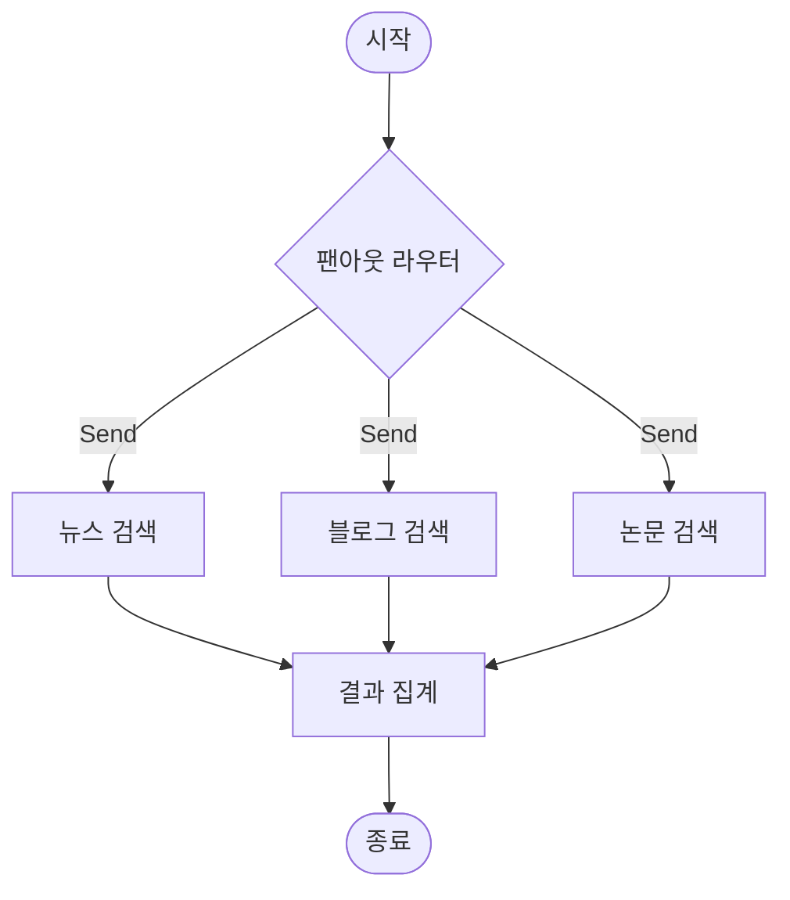

# 비동기 패턴 {: .no_toc }

LangGraph 에이전트는 API를 자주 호출합니다. API를 기다리는 동안 아무것도 하지 않는다면 큰 낭비입니다. 비동기(async) 프로그래밍을 사용하면 여러 작업을 동시에 처리하여 응답 시간을 획기적으로 줄일 수 있습니다.

## 학습 목표

- 동기와 비동기 프로그래밍의 차이를 직관적으로 이해한다
- `async def`와 `await`로 비동기 노드를 정의할 수 있다
- `ainvoke()`와 `astream()`으로 그래프를 비동기 실행할 수 있다
- `Send()` API로 여러 노드에 작업을 병렬로 분산시킬 수 있다
- 순차 실행과 병렬 실행의 성능 차이를 측정할 수 있다

<a id="toc"></a>

## 진행 순서

1. [동기 vs 비동기 이해하기](#part1)
2. [비동기 노드 정의](#part2)
3. [비동기 그래프 실행](#part3)
4. [병렬 실행: Send() API](#part4)
5. [실습: 비동기 멀티 검색](#part5)
6. [정리](#part6)

---

<a id="part1"></a>

## 1️⃣ 동기 vs 비동기 이해하기 [↑](#toc)

### 카페 주문에 비유하기

카페에서 두 가지 운영 방식을 상상해봅시다.

**동기 방식 (비효율적인 카페)**
- 손님 A가 아메리카노를 주문합니다.
- 바리스타는 A의 커피가 완성될 때까지 다른 손님을 받지 않습니다.
- 커피 제조 시간 3분 동안 뒷줄 손님들은 줄 서서 기다립니다.
- 손님 B, C, D는 각각 3분씩 기다린 후에야 주문할 수 있습니다.

**비동기 방식 (효율적인 카페)**
- 손님 A가 주문하면 진동벨을 줍니다. 바리스타는 즉시 다음 손님을 받습니다.
- 손님 B, C, D도 빠르게 주문하고 진동벨을 받습니다.
- 커피가 완성되면 진동벨이 울리고 손님이 직접 수령합니다.
- 바리스타는 기다리는 시간 없이 계속 일합니다.

**프로그래밍에서의 핵심**: API를 호출하면 서버가 응답할 때까지 기다려야 합니다. 동기 방식은 이 기다리는 시간 동안 아무것도 하지 않습니다. 비동기 방식은 이 시간을 활용해 다른 작업을 처리합니다.

### asyncio 기초

파이썬의 `asyncio`는 비동기 프로그래밍을 지원하는 표준 라이브러리입니다.

```python
import asyncio

# async def: 이 함수는 비동기 함수입니다
async def greet(name: str) -> str:
    await asyncio.sleep(1)  # 1초 대기 (API 호출 시뮬레이션)
    return f"안녕하세요, {name}님!"

# asyncio.run(): 비동기 함수를 실행하는 진입점
result = asyncio.run(greet("심선조"))
print(result)
```

**실행 결과 (예시):**
```
안녕하세요, 심선조님!
```

핵심 키워드 3가지:

| 키워드 | 의미 |
|--------|------|
| `async def` | 이 함수는 비동기 함수다 (코루틴을 반환한다) |
| `await` | 여기서 잠깐 기다리되, 기다리는 동안 다른 코드를 실행해도 된다 |
| `asyncio.run()` | 비동기 함수를 실행하는 최상위 진입점 |

### 동기 vs 비동기 실행 시간 비교

```python
import asyncio
import time

# 동기: 순서대로 3개 작업 실행
def sync_example():
    def task(name: str, seconds: int) -> str:
        time.sleep(seconds)  # API 호출 시뮬레이션
        return f"{name} 완료 ({seconds}초 소요)"

    start = time.time()
    results = [
        task("작업 A", 2),
        task("작업 B", 3),
        task("작업 C", 1),
    ]
    elapsed = time.time() - start
    print(f"동기 실행: {elapsed:.1f}초 소요")
    for r in results:
        print(f"  - {r}")

# 비동기: 3개 작업을 동시에 실행
async def async_example():
    async def task(name: str, seconds: int) -> str:
        await asyncio.sleep(seconds)  # await: 기다리는 동안 다른 작업 실행
        return f"{name} 완료 ({seconds}초 소요)"

    start = time.time()
    results = await asyncio.gather(
        task("작업 A", 2),
        task("작업 B", 3),
        task("작업 C", 1),
    )
    elapsed = time.time() - start
    print(f"비동기 실행: {elapsed:.1f}초 소요")
    for r in results:
        print(f"  - {r}")

# 실행
print("=== 동기 실행 ===")
sync_example()

print("\n=== 비동기 실행 ===")
asyncio.run(async_example())
```

**실행 결과 (예시):**
```
=== 동기 실행 ===
동기 실행: 6.0초 소요
  - 작업 A 완료 (2초 소요)
  - 작업 B 완료 (3초 소요)
  - 작업 C 완료 (1초 소요)

=== 비동기 실행 ===
비동기 실행: 3.0초 소요
  - 작업 A 완료 (2초 소요)
  - 작업 B 완료 (3초 소요)
  - 작업 C 완료 (1초 소요)
```

동기는 2 + 3 + 1 = 6초가 걸렸지만, 비동기는 가장 긴 작업인 3초만 걸렸습니다. 3개 작업을 동시에 시작했기 때문입니다.

> 💡 비동기는 마법이 아닙니다. I/O 대기 시간(API 호출, 파일 읽기, 네트워크 통신)을 겹쳐서 처리할 때만 빠릅니다. CPU를 많이 쓰는 작업(복잡한 계산)은 비동기로 빨라지지 않습니다.

---

<a id="part2"></a>

## 2️⃣ 비동기 노드 정의 [↑](#toc)

### 동기 노드 vs 비동기 노드

LangGraph는 동기 노드와 비동기 노드를 모두 지원합니다. 같은 로직을 두 가지 방식으로 구현해봅니다.

```python
from langchain_openai import ChatOpenAI
from langgraph.graph.message import add_messages
from typing_extensions import TypedDict
from typing import Annotated
from dotenv import load_dotenv
import os

load_dotenv()
openai_model = os.getenv("OPENAI_MODEL", "gpt-4o-mini")
llm = ChatOpenAI(model=openai_model)

class State(TypedDict):
    messages: Annotated[list, add_messages]

# 동기 노드: llm.invoke() 사용
def chatbot_sync(state: State):
    """동기 챗봇 노드 - 응답이 올 때까지 블로킹"""
    response = llm.invoke(state["messages"])
    return {"messages": [response]}

# 비동기 노드: llm.ainvoke() 사용
async def chatbot_async(state: State):
    """비동기 챗봇 노드 - 응답을 기다리는 동안 다른 작업 가능"""
    response = await llm.ainvoke(state["messages"])
    return {"messages": [response]}
```

차이는 딱 두 가지입니다:
1. `def` → `async def`
2. `llm.invoke()` → `await llm.ainvoke()`

LangChain의 모든 LLM과 도구는 동기 메서드(`invoke`, `stream`)와 비동기 메서드(`ainvoke`, `astream`) 쌍을 제공합니다.

### 비동기 메서드 대응표

| 동기 | 비동기 | 용도 |
|------|--------|------|
| `llm.invoke()` | `await llm.ainvoke()` | 단일 LLM 호출 |
| `llm.stream()` | `async for _ in llm.astream()` | 스트리밍 LLM 호출 |
| `graph.invoke()` | `await graph.ainvoke()` | 단일 그래프 실행 |
| `graph.stream()` | `async for _ in graph.astream()` | 스트리밍 그래프 실행 |
| `tool.invoke()` | `await tool.ainvoke()` | 단일 도구 실행 |

### 비동기 도구 정의

도구 함수도 `async def`로 정의할 수 있습니다.

```python
from langchain_core.tools import tool
import asyncio
import aiohttp  # pip install aiohttp

@tool
async def search_async(query: str) -> str:
    """비동기로 웹 검색을 수행합니다."""
    try:
        # aiohttp로 비동기 HTTP 요청
        async with aiohttp.ClientSession() as session:
            async with session.get(
                "https://api.example.com/search",
                params={"q": query},
                timeout=aiohttp.ClientTimeout(total=5)
            ) as response:
                data = await response.json()
                return str(data)
    except Exception as e:
        return f"검색 실패: {str(e)}"
```

> ⚠️ **주의**: 비동기 노드에서 동기 블로킹 함수(`time.sleep()`, 동기 HTTP 라이브러리 등)를 `await` 없이 호출하면 전체 이벤트 루프가 멈춥니다. 비동기 노드에서는 반드시 비동기 함수(`asyncio.sleep()`, `aiohttp` 등)를 사용하세요.

---

<a id="part3"></a>

## 3️⃣ 비동기 그래프 실행 [↑](#toc)

### ainvoke() — 비동기 단일 실행

```python
from langchain_openai import ChatOpenAI
from langchain_core.messages import HumanMessage
from langgraph.graph import StateGraph, START, END
from langgraph.graph.message import add_messages
from typing_extensions import TypedDict
from typing import Annotated
from dotenv import load_dotenv
import asyncio
import os

load_dotenv()
openai_model = os.getenv("OPENAI_MODEL", "gpt-4o-mini")
llm = ChatOpenAI(model=openai_model)

class State(TypedDict):
    messages: Annotated[list, add_messages]

async def chatbot(state: State):
    response = await llm.ainvoke(state["messages"])
    return {"messages": [response]}

workflow = StateGraph(State)
workflow.add_node("chatbot", chatbot)
workflow.add_edge(START, "chatbot")
workflow.add_edge("chatbot", END)
graph = workflow.compile()

# --- 비동기 단일 실행 ---
async def main():
    result = await graph.ainvoke(
        {"messages": [HumanMessage(content="파이썬이란 무엇인가요?")]}
    )
    print(result["messages"][-1].content)

asyncio.run(main())
```

**실행 결과 (예시):**
```
파이썬(Python)은 간결하고 읽기 쉬운 문법을 가진 고급 프로그래밍 언어입니다.
1991년 귀도 반 로섬(Guido van Rossum)이 개발했으며, 웹 개발, 데이터 과학,
인공지능, 자동화 등 다양한 분야에서 활용됩니다.
```

### astream() — 비동기 스트리밍

```python
async def main_stream():
    print("=== 비동기 스트리밍 ===")
    async for event in graph.astream(
        {"messages": [HumanMessage(content="파이썬의 장점 3가지를 알려주세요.")]},
        stream_mode="updates"
    ):
        for node_name, node_output in event.items():
            print(f"[{node_name}] 노드 완료")
            if "messages" in node_output:
                last = node_output["messages"][-1]
                if hasattr(last, "content") and last.content:
                    print(f"  응답: {last.content[:80]}...")

asyncio.run(main_stream())
```

**실행 결과 (예시):**
```
=== 비동기 스트리밍 ===
[chatbot] 노드 완료
  응답: 파이썬의 주요 장점 3가지는 다음과 같습니다: 1. 간결한 문법으로 빠른 개발...
```

### Jupyter/Colab에서의 차이점

Jupyter 노트북과 Google Colab은 이미 이벤트 루프가 실행 중입니다. `asyncio.run()`을 사용하면 오류가 발생할 수 있습니다.

```python
# 일반 Python 스크립트
asyncio.run(main())  # OK

# Jupyter / Colab에서는
await main()  # asyncio.run() 없이 바로 await 사용
```

Colab이나 Jupyter에서 실행한다면 셀에서 직접 `await`를 사용하세요.

```python
# Jupyter/Colab 셀에서
result = await graph.ainvoke(
    {"messages": [HumanMessage(content="안녕하세요!")]}
)
print(result["messages"][-1].content)
```

> 💡 Colab에서 `asyncio.run()`을 사용하면 "This event loop is already running" 오류가 납니다. `nest_asyncio` 라이브러리로 해결할 수도 있지만, 그냥 `await`를 직접 쓰는 것이 더 깔끔합니다.

---

<a id="part4"></a>

## 4️⃣ 병렬 실행: Send() API [↑](#toc)

### 팬아웃(Fan-out) 패턴

비동기에서 한 걸음 더 나아가, 한 노드가 여러 노드에 **동시에** 작업을 보낼 수 있습니다. 이를 팬아웃(fan-out)이라고 합니다.

비유: 팀장이 "A조는 뉴스 조사, B조는 블로그 조사, C조는 논문 조사"를 동시에 지시하고, 모든 조가 끝나면 결과를 종합하는 것과 같습니다.

### Send() 사용법

```python
from langgraph.types import Send

def router(state: State):
    """3개 소스에 동시 검색 요청"""
    return [
        Send("search_news", {"query": state["query"], "source": "뉴스"}),
        Send("search_blog", {"query": state["query"], "source": "블로그"}),
        Send("search_paper", {"query": state["query"], "source": "논문"}),
    ]
```

`Send(노드이름, 상태)` — 해당 노드에 지정한 상태를 전달하며 동시에 실행합니다. 반환값이 리스트이면 LangGraph가 자동으로 모두를 병렬 실행합니다.

### 병렬 검색 그래프 전체 예제

```python
from langchain_openai import ChatOpenAI
from langchain_core.messages import HumanMessage
from langgraph.graph import StateGraph, START, END
from langgraph.types import Send
from typing_extensions import TypedDict
from typing import Annotated, List
from dotenv import load_dotenv
import asyncio
import time
import os

load_dotenv()
openai_model = os.getenv("OPENAI_MODEL", "gpt-4o-mini")
llm = ChatOpenAI(model=openai_model)

# --- State 정의 ---

class SearchState(TypedDict):
    """각 검색 노드의 개별 상태"""
    query: str
    source: str
    result: str

class AggregateState(TypedDict):
    """전체 그래프의 상태"""
    query: str
    results: List[str]
    final_answer: str

# --- 검색 노드 (각 소스별) ---

async def search_source(state: SearchState) -> dict:
    """특정 소스에서 정보 검색 (실제로는 API 호출)"""
    source = state["source"]
    query = state["query"]

    # API 호출 시뮬레이션
    await asyncio.sleep(2)

    # 실제 구현에서는 각 소스별 API를 호출합니다
    mock_results = {
        "뉴스": f"[뉴스] '{query}' 관련 최신 기사: 오늘 발표된 연구에 따르면...",
        "블로그": f"[블로그] '{query}' 실전 경험 공유: 개발자 김철수 씨는...",
        "논문": f"[논문] '{query}' 학술 연구 요약: 2024년 Nature 게재 논문에서...",
    }
    return {"results": [mock_results.get(source, f"[{source}] 검색 결과 없음")]}

# --- 라우터: 팬아웃 ---

def fan_out_router(state: AggregateState):
    """3개 소스에 동시 검색 요청 (팬아웃)"""
    return [
        Send("search_source", {"query": state["query"], "source": "뉴스"}),
        Send("search_source", {"query": state["query"], "source": "블로그"}),
        Send("search_source", {"query": state["query"], "source": "논문"}),
    ]

# --- 집계 노드 ---

async def aggregate(state: AggregateState) -> dict:
    """모든 검색 결과를 LLM으로 종합"""
    results = state.get("results", [])
    combined = "\n".join(results)

    prompt = f"""다음 3개 소스의 검색 결과를 종합하여 '{state["query"]}'에 대해 답변해주세요.

검색 결과:
{combined}

간결하게 2-3문장으로 요약해주세요."""

    response = await llm.ainvoke([HumanMessage(content=prompt)])
    return {"final_answer": response.content}

# --- 그래프 구성 ---

workflow = StateGraph(AggregateState)
workflow.add_node("search_source", search_source)
workflow.add_node("aggregate", aggregate)
workflow.add_conditional_edges(START, fan_out_router, ["search_source"])
workflow.add_edge("search_source", "aggregate")
workflow.add_edge("aggregate", END)

graph = workflow.compile()

# --- 실행 및 성능 측정 ---

async def main():
    print("=== 병렬 검색 시작 ===")
    start = time.time()

    result = await graph.ainvoke({
        "query": "LangGraph 사용 사례",
        "results": [],
        "final_answer": ""
    })

    elapsed = time.time() - start
    print(f"소요 시간: {elapsed:.1f}초 (3개 소스를 병렬 검색)")
    print(f"\n종합 답변:\n{result['final_answer']}")

asyncio.run(main())
```

**실행 결과 (예시):**
```
=== 병렬 검색 시작 ===
소요 시간: 2.3초 (3개 소스를 병렬 검색)

종합 답변:
LangGraph는 AI 에이전트 구축에 널리 활용되며, 특히 멀티 에이전트 오케스트레이션과
복잡한 워크플로우 자동화에 강점을 보입니다. 뉴스와 블로그, 학술 자료 모두에서
LangGraph의 실용적 가치가 확인되고 있습니다.
```

### 그래프 흐름 시각화



### 성능 비교: 순차 vs 병렬

```python
import asyncio
import time

async def search_one_source(source: str, delay: float = 3.0) -> str:
    """단일 소스 검색 시뮬레이션 (3초 소요)"""
    await asyncio.sleep(delay)
    return f"{source} 검색 완료"

async def sequential_search():
    """순차 실행: 각 소스를 하나씩"""
    start = time.time()
    r1 = await search_one_source("뉴스")
    r2 = await search_one_source("블로그")
    r3 = await search_one_source("논문")
    elapsed = time.time() - start
    print(f"순차 실행: {elapsed:.1f}초")

async def parallel_search():
    """병렬 실행: 3개 소스를 동시에"""
    start = time.time()
    results = await asyncio.gather(
        search_one_source("뉴스"),
        search_one_source("블로그"),
        search_one_source("논문"),
    )
    elapsed = time.time() - start
    print(f"병렬 실행: {elapsed:.1f}초")

asyncio.run(sequential_search())
asyncio.run(parallel_search())
```

**실행 결과 (예시):**
```
순차 실행: 9.0초
병렬 실행: 3.0초
```

병렬 실행이 3배 빠릅니다. 소스가 늘어날수록 이 차이는 더 커집니다.

> ⚠️ **Send() 주의사항**: `search_source` 노드가 반환하는 딕셔너리의 키가 `AggregateState`의 필드와 일치해야 합니다. 또한 `results` 필드는 여러 노드가 동시에 추가하므로 `Annotated[List, operator.add]` 처럼 집계 함수를 지정해야 합니다.

---

<a id="part5"></a>

## 5️⃣ 실습: 비동기 멀티 검색 [↑](#toc)

### 완성된 비동기 멀티 검색 에이전트

앞서 배운 개념들을 하나로 합쳐 실제로 동작하는 에이전트를 만들어봅니다. 이 에이전트는 사용자 질문을 받아 3개 검색 엔진에서 동시에 검색하고, 결과를 종합합니다.

```python
from langchain_openai import ChatOpenAI
from langchain_core.messages import HumanMessage
from langgraph.graph import StateGraph, START, END
from langgraph.types import Send
from typing_extensions import TypedDict
from typing import Annotated, List
from dotenv import load_dotenv
import asyncio
import operator
import time
import os

load_dotenv()
openai_model = os.getenv("OPENAI_MODEL", "gpt-4o-mini")
llm = ChatOpenAI(model=openai_model)

# --- State 정의 ---

class SearchItemState(TypedDict):
    """개별 검색 작업 상태"""
    query: str
    engine: str

class MultiSearchState(TypedDict):
    """전체 멀티 검색 상태"""
    query: str
    # operator.add: 여러 노드가 동시에 results에 값을 추가할 수 있도록 설정
    results: Annotated[List[str], operator.add]
    final_answer: str

# --- 검색 노드 ---

async def search_engine_node(state: SearchItemState) -> dict:
    """특정 검색 엔진으로 검색"""
    engine = state["engine"]
    query = state["query"]

    # 각 엔진마다 다른 응답 시간 시뮬레이션
    delays = {"구글": 1.5, "빙": 2.0, "덕덕고": 1.0}
    await asyncio.sleep(delays.get(engine, 1.5))

    # 실제 구현에서는 각 엔진의 API를 호출합니다
    # 여기서는 LLM으로 시뮬레이션
    prompt = f"""검색 엔진 '{engine}'에서 '{query}'를 검색한 결과를 한 문장으로 요약해주세요.
결과 형식: [{engine}] 검색 결과 요약 내용"""

    response = await llm.ainvoke([HumanMessage(content=prompt)])
    return {"results": [response.content]}

# --- 팬아웃 라우터 ---

def multi_search_router(state: MultiSearchState):
    """3개 검색 엔진에 동시 검색 요청"""
    engines = ["구글", "빙", "덕덕고"]
    return [
        Send("search_engine", {"query": state["query"], "engine": engine})
        for engine in engines
    ]

# --- 집계 및 종합 노드 ---

async def synthesize(state: MultiSearchState) -> dict:
    """3개 검색 결과를 종합하여 최종 답변 생성"""
    results = state.get("results", [])

    if not results:
        return {"final_answer": "검색 결과를 가져오지 못했습니다."}

    combined = "\n".join(results)
    prompt = f"""다음은 '{state["query"]}'에 대한 3개 검색 엔진의 결과입니다.

{combined}

이 결과들을 종합하여 사용자에게 유용한 답변을 3-4문장으로 작성해주세요."""

    response = await llm.ainvoke([HumanMessage(content=prompt)])
    return {"final_answer": response.content}

# --- 그래프 구성 ---

workflow = StateGraph(MultiSearchState)
workflow.add_node("search_engine", search_engine_node)
workflow.add_node("synthesize", synthesize)
workflow.add_conditional_edges(START, multi_search_router, ["search_engine"])
workflow.add_edge("search_engine", "synthesize")
workflow.add_edge("synthesize", END)

graph = workflow.compile()

# --- 실행 및 성능 측정 ---

async def main():
    queries = [
        "파이썬 비동기 프로그래밍 장점",
        "LangGraph 사용법",
    ]

    for query in queries:
        print(f"\n{'='*50}")
        print(f"검색어: {query}")
        print('='*50)

        start = time.time()
        result = await graph.ainvoke({
            "query": query,
            "results": [],
            "final_answer": ""
        })
        elapsed = time.time() - start

        print(f"소요 시간: {elapsed:.1f}초 (3개 엔진 병렬 검색)")
        print(f"\n종합 답변:\n{result['final_answer']}")

asyncio.run(main())
```

**실행 결과 (예시):**
```
==================================================
검색어: 파이썬 비동기 프로그래밍 장점
==================================================
소요 시간: 2.8초 (3개 엔진 병렬 검색)

종합 답변:
파이썬 비동기 프로그래밍은 I/O 작업이 많은 애플리케이션에서 성능을 크게 향상시킵니다.
asyncio 라이브러리를 활용하면 여러 API 호출을 동시에 처리하여 응답 시간을 단축할 수 있습니다.
특히 웹 크롤링, API 서버, 채팅 애플리케이션 등에서 활용도가 높습니다.

==================================================
검색어: LangGraph 사용법
==================================================
소요 시간: 2.3초 (3개 엔진 병렬 검색)

종합 답변:
LangGraph는 상태 기반 그래프로 복잡한 AI 에이전트 워크플로우를 구성하는 라이브러리입니다.
StateGraph로 그래프를 정의하고 노드와 엣지를 추가하는 방식으로 사용하며,
체크포인트와 Human-in-the-loop 기능도 지원합니다.
```

### 비동기 스트리밍 토큰 출력

그래프 실행 중 토큰 단위로 실시간 출력하는 방법입니다.

```python
from langchain_openai import ChatOpenAI
from langchain_core.messages import HumanMessage
from langgraph.graph import StateGraph, START, END
from langgraph.graph.message import add_messages
from typing_extensions import TypedDict
from typing import Annotated
from dotenv import load_dotenv
import asyncio
import os

load_dotenv()
openai_model = os.getenv("OPENAI_MODEL", "gpt-4o-mini")
llm = ChatOpenAI(model=openai_model, streaming=True)

class State(TypedDict):
    messages: Annotated[list, add_messages]

async def chatbot(state: State):
    response = await llm.ainvoke(state["messages"])
    return {"messages": [response]}

workflow = StateGraph(State)
workflow.add_node("chatbot", chatbot)
workflow.add_edge(START, "chatbot")
workflow.add_edge("chatbot", END)
graph = workflow.compile()

async def stream_tokens():
    """astream_events로 토큰 단위 스트리밍"""
    print("응답: ", end="", flush=True)

    async for event in graph.astream_events(
        {"messages": [HumanMessage(content="파이썬을 한 문장으로 설명해주세요.")]},
        version="v2"
    ):
        kind = event["event"]
        # LLM이 토큰을 생성할 때마다 즉시 출력
        if kind == "on_chat_model_stream":
            content = event["data"]["chunk"].content
            if content:
                print(content, end="", flush=True)

    print()  # 줄바꿈

asyncio.run(stream_tokens())
```

**실행 결과 (예시):**
```
응답: 파이썬은 간결하고 읽기 쉬운 문법으로 다양한 분야에서 활용되는 고급 프로그래밍 언어입니다.
```

실제로 실행하면 단어가 하나씩 나타나는 것을 볼 수 있습니다.

---

<a id="part6"></a>

## 6️⃣ 정리 [↑](#toc)

### 동기 vs 비동기 비교 표

| 항목 | 동기 | 비동기 |
|------|------|--------|
| 함수 정의 | `def func()` | `async def func()` |
| LLM 호출 | `llm.invoke()` | `await llm.ainvoke()` |
| 그래프 실행 | `graph.invoke()` | `await graph.ainvoke()` |
| 스트리밍 | `graph.stream()` | `async for _ in graph.astream()` |
| 병렬 실행 | 불가 (기본) | `asyncio.gather()` or `Send()` |
| 적합한 상황 | 단순 스크립트, 디버깅 | 프로덕션, 멀티 검색, API 서버 |
| 성능 (I/O) | 느림 (대기 시간 누적) | 빠름 (대기 시간 겹침) |

### 언제 비동기를 써야 할까?

**비동기가 효과적인 경우:**
- 여러 API를 동시에 호출할 때 (멀티 검색, 멀티 LLM)
- FastAPI 등 비동기 웹 프레임워크와 통합할 때
- 스트리밍으로 토큰을 실시간 전달할 때
- 사용자 응답 속도가 중요한 프로덕션 환경

**동기가 충분한 경우:**
- 로컬 테스트 및 디버깅
- 단순 스크립트 (API 호출 1-2개)
- 순서가 중요한 파이프라인

### 학습 체크리스트

- [ ] `async def`와 `await`의 의미를 설명할 수 있다
- [ ] 비동기 노드를 `ainvoke()`로 실행할 수 있다
- [ ] `astream()`으로 노드 완료 이벤트를 스트리밍할 수 있다
- [ ] Jupyter/Colab에서 `await`를 직접 사용하는 방법을 안다
- [ ] `Send()` API로 팬아웃 패턴을 구현할 수 있다
- [ ] 순차 실행과 병렬 실행의 성능 차이를 측정할 수 있다

### 🎯 실습 미션

**미션 1.** 이전 장에서 만든 챗봇(동기 버전)을 비동기 버전으로 변환해보세요. `def` → `async def`, `invoke` → `ainvoke`로 변경하고 `asyncio.run()`으로 실행하세요.

**미션 2.** `Send()` API를 사용하여 같은 질문("파이썬이란?")을 gpt-4o-mini와 gpt-4o-mini(temperature=0.9)에 동시에 보내고, 두 응답을 나란히 출력하는 그래프를 만들어보세요.

**미션 3.** `astream_events`로 토큰 단위 스트리밍을 구현하되, 현재 실행 중인 노드 이름도 함께 출력하도록 `on_chain_start` 이벤트를 처리하세요.

---

→ **다음 장**: [13. LangGraph 실습](/llm/langgraph/chat_lab)
