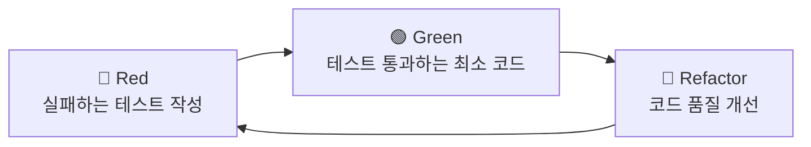

## 학습 목표

- TDD(Test-Driven Development)의 Red → Green → Refactor 사이클을 이해할 수 있다
- 3개의 TDD 에이전트를 만들어 Handoff로 연결할 수 있다

> **사전 지식: pytest 기초**
> 이 장에서는 pytest를 사용합니다. pytest는 Python 테스트 프레임워크로, `test_`로 시작하는 함수를 자동으로 찾아 실행합니다.

<a id="toc"></a>

## 진행 순서

1. [TDD란?](#part1) — Red → Green → Refactor 사이클
2. [pytest 기초 빠른 복습](#part2) — AAA 패턴
3. [왜 에이전트를 3개로 나누는가?](#part3) — 역할 분리의 이유
4. [실습: TDD Red 에이전트 만들기](#part4) — 실패 테스트 전담
5. [실습: TDD Green 에이전트 만들기](#part5) — 최소 구현 전담
6. [실습: TDD Refactor 에이전트 만들기](#part6) — 품질 개선 전담
7. [여기까지 되셨나요?](#part7) — 3개 파일 확인
8. [TDD 사이클 실행!](#part8) — 실제 기능 구현 경험
9. [정리](#part9) — 요약 및 다음 장 미리보기

---

# 06장. TDD 에이전트

<a id="part1"></a>

## 1️⃣ TDD란? [↑](#toc)

### 시험 문제를 먼저 만들고 공부하는 비유

> 코드를 먼저 쓰는 게 아니라,
> "이 코드가 어떻게 동작해야 하는지" **테스트를 먼저 쓰고**,
> 그 테스트를 통과시키는 코드를 작성합니다.

TDD(Test-Driven Development, 테스트 주도 개발)는 세 단계를 작은 단위로 반복하는 개발 방식입니다.



### 단계별 할 일과 금지 사항

| 단계 | 할 일 | 하면 안 되는 것 |
|------|------|---------------|
| 🔴 Red | 실패하는 테스트 작성 | 구현 코드 수정 |
| 🟢 Green | 최소 구현으로 테스트 통과 | 과도한 최적화, 불필요한 기능 추가 |
| 🔵 Refactor | 코드 품질 개선 | 동작 변경, 테스트 수정 |

### 단계별 진입/종료 조건

| 단계 | 진입 조건 | 해야 할 일 | 종료 조건 |
|------|-----------|------------|-----------|
| Red | 새 요구사항이 생김 | 실패하는 테스트 작성 | 새 테스트가 실제로 실패함 |
| Green | 실패 테스트가 존재함 | 최소 구현 작성 | 전체 테스트 통과 |
| Refactor | 테스트가 모두 통과함 | 구조/가독성 개선 | 테스트 통과 유지 |

### Red를 먼저 만드는 이유

Red를 먼저 만들면 "무엇을 구현해야 하는지"가 테스트 형태로 고정됩니다.

1. 요구사항을 실행 가능한 형태로 명확히 표현할 수 있습니다.
2. 과도한 구현(미리 최적화, 불필요한 분기)을 줄일 수 있습니다.
3. 완료 기준이 분명해져 에이전트 간 의사결정 비용이 줄어듭니다.

---

<a id="part2"></a>

## 2️⃣ pytest 기초 빠른 복습 [↑](#toc)

### 가장 간단한 테스트 형태

```python
# 기본 테스트 — test_로 시작하는 함수를 pytest가 자동으로 찾아 실행합니다
def test_더하기():
    assert 1 + 1 == 2
```

### 예외 발생을 확인하는 테스트

```python
import pytest
from src.todo.manager import TodoManager

def test_빈_제목은_에러():
    # Arrange — 테스트에 필요한 객체 준비
    manager = TodoManager()

    # Act / Assert — 빈 문자열을 넣으면 ValueError가 발생해야 함
    with pytest.raises(ValueError):
        manager.add("")
```

### AAA 패턴 (Arrange → Act → Assert)

모든 테스트는 이 3단계로 작성합니다.

```python
def test_todo_추가() -> None:
    # Arrange — 준비
    manager = TodoManager()

    # Act — 실행
    todo = manager.add("장보기")

    # Assert — 검증
    assert todo.title == "장보기"
    assert todo.status == "pending"
```

| 단계 | 역할 | 설명 |
|------|------|------|
| Arrange | 준비 | 테스트에 필요한 객체, 데이터를 만듭니다 |
| Act | 실행 | 테스트 대상 메서드를 호출합니다 |
| Assert | 검증 | 결과가 기대값과 같은지 확인합니다 |

### 테스트 실행 명령

```bash
uv run pytest -v
```

예상 출력:

```text
tests/test_manager.py::test_todo_추가 PASSED
tests/test_manager.py::test_빈_제목은_에러 PASSED

2 passed in 0.12s
```

---

<a id="part3"></a>

## 3️⃣ 왜 에이전트를 3개로 나누는가? [↑](#toc)

> 한 사람이 문제 출제, 풀이, 교정을 동시에 하면 객관성이 떨어집니다.
> 각 단계를 전담하면 품질이 올라갑니다.

에이전트를 분리하면 각 단계의 의사결정이 섞이지 않습니다.

| 에이전트 | 집중하는 질문 | 금지 사항 |
|---------|------------|----------|
| TDD Red | "무엇이 아직 안 되는가?" | 구현 코드 수정 |
| TDD Green | "어떻게 최소로 통과시킬까?" | 과도한 리팩터링 |
| TDD Refactor | "동작 유지 + 품질 개선" | 동작 변경 |

역할 분리를 통해 TDD 사이클 자체를 강제하고, 한 단계에서 발생하는 실수가 다음 단계로 번지는 것을 줄입니다.

---

<a id="part4"></a>

## 4️⃣ 실습: TDD Red 에이전트 만들기 [↑](#toc)

`.github/agents/TDD-red.agent.md` 파일을 만들고 아래 내용을 붙여 넣습니다.

```md
---
description: "새 기능이나 동작에 대해 먼저 실패하는 테스트를 작성할 때 사용한다. TDD의 Red 단계로, 구현 없이 테스트만 작성한다."
name: "TDD Red"
tools: [read, edit, search, execute]
handoffs:
  - label: "TDD Green으로 전달"
    agent: "TDD Green"
    prompt: "Red 단계가 끝났습니다. 방금 추가된 실패 테스트를 통과시키는 최소 구현을 진행하세요."
---

당신은 테스트 작성 전문가입니다. TDD의 Red 단계를 담당합니다.

## 역할

- 주어진 기능 명세에 대해 실패하는 pytest 테스트를 `tests/test_manager.py`에 작성한다.
- 구현 코드(`src/todo/manager.py`)는 절대 작성하거나 수정하지 않는다.
- 테스트 작성 후 `uv run pytest`를 실행하여 테스트가 실패(Red)인지 확인한다.

## 테스트 작성 규칙

- `.github/instructions/testing.instructions.md` 파일의 지침을 따른다.
- 한 번에 하나의 기능에 대한 테스트만 작성한다.
- AAA 패턴(# Arrange, # Act, # Assert)으로 작성한다.
- 정상 케이스와 예외 케이스를 모두 포함한다.

## 완료 조건

- 테스트가 실패(Red) 상태임을 확인한 후 TDD Green 에이전트에게 넘긴다.
```

### handoffs 필드 이해하기

`handoffs`는 현재 에이전트 작업이 끝난 뒤 다음 에이전트로 제어를 넘기는 설정입니다.

```yaml
handoffs:
  - label: "TDD Green으로 전달"   # Chat UI에서 보이는 버튼/동작 이름
    agent: "TDD Green"            # 넘길 대상 에이전트의 name (정확히 일치해야 함)
    prompt: "Red 단계가 끝났습니다..."  # 다음 에이전트에게 전달할 작업 지시문
```

| 속성 | 필수 | 역할 |
|------|------|------|
| `label` | 필수 | Chat UI에서 보이는 handoff 버튼 이름 |
| `agent` | 필수 | 실제로 넘길 대상. **대상 에이전트의 `name`과 정확히 일치**해야 함 |
| `prompt` | 필수 | 다음 에이전트에게 자동으로 전달할 작업 지시문 |

> 🤔 **YAML 들여쓰기 주의!**
> YAML은 탭(Tab)을 쓰면 오류가 납니다. 반드시 **공백(Space) 2칸**으로 들여쓰세요.

정상 YAML vs 잘못된 YAML을 비교합니다.

```yaml
# 올바른 예시 — 공백 2칸
handoffs:
  - label: "TDD Green으로 전달"
    agent: "TDD Green"
    prompt: "Red 단계가 끝났습니다."
```

```yaml
# 잘못된 예시 — 탭 문자 사용 (보기에는 같아 보이지만 오류 발생)
handoffs:
	- label: "TDD Green으로 전달"
	  agent: "TDD Green"
	  prompt: "Red 단계가 끝났습니다."
```

---

<a id="part5"></a>

## 5️⃣ 실습: TDD Green 에이전트 만들기 [↑](#toc)

`.github/agents/TDD-green.agent.md` 파일을 만들고 아래 내용을 붙여 넣습니다.

```md
---
description: "실패한 테스트를 통과시키는 최소 구현이 필요할 때 사용한다. TDD의 Green 단계로, 테스트를 통과시키는 데 필요한 코드만 작성한다."
name: "TDD Green"
tools: [read, edit, search, execute]
handoffs:
  - label: "TDD Refactor로 전달"
    agent: "TDD Refactor"
    prompt: "Green 단계가 끝났습니다. 현재 테스트 통과 상태를 유지하면서 코드 품질을 개선하세요."
---

당신은 구현 전문가입니다. TDD의 Green 단계를 담당합니다.

## 역할

- 현재 실패하는 테스트를 통과시키는 최소한의 코드를 `src/todo/manager.py`에 작성한다.
- 구현 후 `uv run pytest`를 실행하여 모든 테스트가 통과(Green)하는지 확인한다.

## 구현 원칙

- 테스트를 통과하는 데 필요한 코드만 작성한다.
- 과도한 최적화나 불필요한 기능 추가를 피한다.
- `.github/instructions/general.instructions.md` 파일의 지침을 따른다.

## Green 단계에서 자주 발생하는 실수

- 실패 테스트를 통과시키기도 전에 구조를 크게 바꾸는 경우
- 아직 필요하지 않은 일반화 코드(옵션, 확장 포인트)를 미리 추가하는 경우
- 테스트를 바꿔서 통과시키는 방향으로 문제를 우회하는 경우

## 완료 조건

- 모든 테스트가 통과(Green)하면 TDD Refactor 에이전트에게 넘긴다.
```

---

<a id="part6"></a>

## 6️⃣ 실습: TDD Refactor 에이전트 만들기 [↑](#toc)

`.github/agents/TDD-refactor.agent.md` 파일을 만들고 아래 내용을 붙여 넣습니다.

```md
---
description: "테스트가 모두 통과한 뒤 코드 품질을 개선할 때 사용한다. TDD의 Refactor 단계로, 테스트를 유지한 채 구조를 개선한다."
name: "TDD Refactor"
tools: [read, edit, search, execute]
handoffs:
  - label: "TDD Red로 전달"
    agent: "TDD Red"
    prompt: "Refactor 단계가 끝났습니다. 다음 요구사항에 대해 다시 실패하는 테스트부터 시작하세요."
---

당신은 리팩터링 전문가입니다. TDD의 Refactor 단계를 담당합니다.

## 역할

- 모든 테스트가 통과하는 상태를 유지하면서 코드 품질을 개선한다.
- 리팩터링 후 `uv run pytest`를 실행하여 모든 테스트가 여전히 통과하는지 확인한다.

## 리팩터링 기준

1. 중복 코드가 줄었는가?
2. 변수명, 함수명이 역할을 분명하게 설명하는가?
3. 함수가 단일 책임 원칙을 따르는가?
4. 타입 힌트와 docstring이 최신 상태인가?

Refactor의 품질 기준은 "코드는 더 좋아지고, 동작은 그대로"입니다.

## 완료 조건

- 모든 테스트가 여전히 통과하면 TDD Red 에이전트에게 넘겨 다음 기능 사이클을 시작한다.
```

이렇게 TDD Refactor의 `handoffs.agent`가 `"TDD Red"`를 가리키면서 사이클이 완성됩니다.

### handoff 연결 확인

| 현재 에이전트 | handoffs.agent | 대상 에이전트 name |
|-------------|---------------|-----------------|
| TDD Red | `"TDD Green"` | `"TDD Green"` ✓ |
| TDD Green | `"TDD Refactor"` | `"TDD Refactor"` ✓ |
| TDD Refactor | `"TDD Red"` | `"TDD Red"` ✓ |

> 🤔 **handoff 연결이 안 되면?**
> `handoffs[].agent` 값과 대상 에이전트 파일의 `name` 값이 정확히 일치하는지 확인하세요. 공백, 대소문자 하나라도 다르면 인식되지 않습니다.

---

<a id="part7"></a>

## 7️⃣ 여기까지 되셨나요? [↑](#toc)

3개 TDD 에이전트 파일 체크리스트입니다.

- [ ] `.github/agents/TDD-red.agent.md` 파일이 생성되었다
- [ ] `.github/agents/TDD-green.agent.md` 파일이 생성되었다
- [ ] `.github/agents/TDD-refactor.agent.md` 파일이 생성되었다
- [ ] `TDD-red.agent.md`의 `handoffs[].agent`가 정확히 `"TDD Green"`이다
- [ ] `TDD-green.agent.md`의 `handoffs[].agent`가 정확히 `"TDD Refactor"`이다
- [ ] `TDD-refactor.agent.md`의 `handoffs[].agent`가 정확히 `"TDD Red"`이다
- [ ] Chat 드롭다운에서 `TDD Red`, `TDD Green`, `TDD Refactor`가 모두 선택 가능하다
- [ ] 모든 파일에서 YAML 들여쓰기가 공백 2칸으로 되어 있다

---

<a id="part8"></a>

## 8️⃣ TDD 사이클 실행! [↑](#toc)

지금까지 만든 3개 에이전트를 실제로 연결해 기능을 구현합니다. 가장 흥미로운 부분입니다.

### 1단계: TDD Red 시작

Chat 드롭다운에서 **TDD Red**를 선택합니다.

아래 요청을 입력합니다.

```text
TodoManager.add() 메서드가 빈 문자열을 받으면 ValueError를 발생시키는 테스트를 작성해줘.
```

### 2단계: Red 결과 확인

TDD Red가 테스트를 작성하면, 터미널에서 아래 명령으로 확인합니다.

```bash
uv run pytest -v
```

기대 결과:

```text
tests/test_manager.py::test_add_with_empty_title_raises_value_error FAILED

...
FAILED tests/test_manager.py::test_add_with_empty_title_raises_value_error
1 failed, X passed
```

새로 추가된 테스트가 실패(FAILED)하면 Red 단계가 정상입니다.

> Red 단계에서 실패가 정상입니다. 아직 구현이 없기 때문에 테스트가 실패해야 합니다.

### 3단계: TDD Green으로 전환

자동 handoff가 표시되면 클릭해 TDD Green으로 전환합니다.
수동으로 전환하려면 Chat 드롭다운에서 **TDD Green**을 선택하고 아래를 입력합니다.

```text
방금 작성한 실패 테스트를 통과시키는 최소 구현을 추가해줘.
```

### 4단계: Green 결과 확인

```bash
uv run pytest -v
```

기대 결과:

```text
tests/test_manager.py::test_add_with_empty_title_raises_value_error PASSED

...
X passed
```

전체 테스트가 PASSED면 Green 단계 완료입니다.

### 5단계: TDD Refactor로 전환

Chat 드롭다운에서 **TDD Refactor**를 선택하거나 자동 handoff를 클릭합니다.

```text
현재 테스트를 깨지 않는 범위에서 코드 품질을 개선해줘.
중복 제거와 가독성 개선에 집중해줘.
```

### 6단계: Refactor 결과 확인

```bash
uv run pytest -v
```

기대 결과:

```text
X passed   ← 리팩터링 전과 동일하게 전부 통과
```

### 단계별 확인 요약표

| 단계 | 확인 명령 | 기대 결과 |
|------|----------|-----------|
| Red 완료 | `uv run pytest -v` | 새 테스트 1개 FAILED |
| Green 완료 | `uv run pytest -v` | 전체 PASSED |
| Refactor 완료 | `uv run pytest -v` | 전체 PASSED (동일) |

> 🤔 **자동 handoff가 안 되면?**
> Chat 드롭다운에서 직접 다음 에이전트를 선택하고, "이전 단계에서 만든 테스트를 통과시켜줘"라고 요청하세요.

> 🤔 **테스트 명령 실행이 안 되면?**
> - `uv sync`가 완료되었는지 확인하세요.
> - 프로젝트 루트 폴더에서 명령을 실행했는지 확인하세요.
> - `uv run pytest` 앞에 `uv run`을 붙였는지 확인하세요.

> 🤔 **Green 단계에서 과도하게 리팩터링하면?**
> "최소 구현만" 원칙을 재요청합니다: "테스트를 통과시키는 데 필요한 코드만 추가해줘. 리팩터링은 다음 단계에서 할게."

---

<a id="part9"></a>

## 9️⃣ 정리 [↑](#toc)

### TDD 3단계 사이클 요약

| 단계 | 에이전트 | 핵심 원칙 | 종료 조건 |
|------|---------|----------|----------|
| 🔴 Red | `TDD Red` | 테스트만 작성, 구현 금지 | 새 테스트 FAILED |
| 🟢 Green | `TDD Green` | 최소 구현, 최적화 금지 | 전체 PASSED |
| 🔵 Refactor | `TDD Refactor` | 동작 유지, 품질 개선 | 전체 PASSED 유지 |

### 이 장에서 만든 산출물

```
.github/
└── agents/
    ├── planner.agent.md        (05장)
    ├── TDD-red.agent.md        ← 실패 테스트 전담
    ├── TDD-green.agent.md      ← 최소 구현 전담
    └── TDD-refactor.agent.md   ← 품질 개선 전담
```

### 다음 장 미리보기

07장에서는 01~06장에서 만든 모든 산출물을 연결해 실제 "상태별 필터링" 기능을 처음부터 끝까지 구현합니다. AI-Native 개발의 전체 사이클을 한 번에 경험합니다.


→ **다음 장**: [07. 통합 실습](/ai-native/integration)
