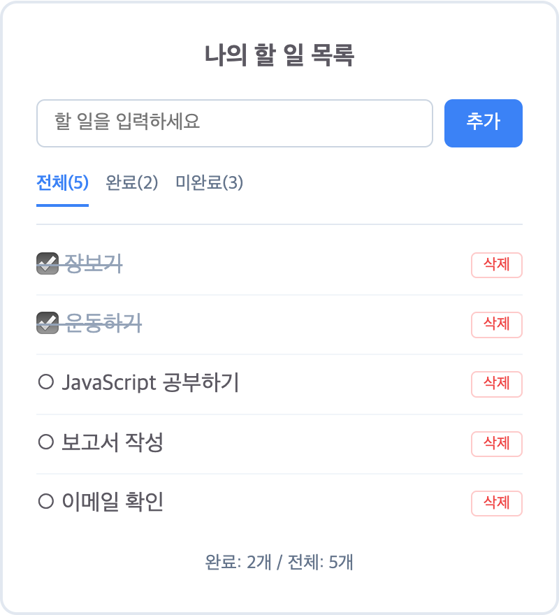

<!-- _class: title -->

# 11장. 미니 프로젝트
## AI 협업 ToDo 앱

**Phase 2 최종 관문**

요구사항 → AI 생성 → 테스트 검증 → Bug Hunt

---

## 이 장의 AI 사용 규칙

> **생성 + 검증 모드**

- AI(Copilot)가 **코드를 생성할 수 있습니다**
- 단, 반드시 생성된 코드를 **읽고, 이해하고, 테스트로 검증**해야 합니다
- AI 코드를 **이해 없이 복붙**하는 것은 <span class="danger">금지</span>

> 💡 강사 시연 → 함께 따라하기 → 혼자 변형해 보기

---

## 학습 목표

1. **요구사항 파일을 작성**하여 AI에게 코드 생성을 지시할 수 있다
2. AI가 생성한 코드(테스트, 로직, UI)를 **검증하고 수정**할 수 있다
3. 요구사항 → AI 생성 → 테스트 검증 → Bug Hunt의 **전체 사이클을 경험**한다

---

## 진행 순서 (9개 파트)

| # | 파트 | 핵심 |
|---|------|------|
| 1 | 프로젝트 소개 | 무엇을 만드는가 |
| 2 | ⭐ 요구사항 파일 작성 | 모든 것의 시작 |
| 3 | 프로젝트 구조 만들기 | 폴더와 파일 준비 |
| 4 | ⭐ AI에게 테스트 코드 요청 | 요구사항 → 테스트 |
| 5 | ⭐ AI에게 핵심 로직 요청 | 테스트를 통과하는 코드 |
| 6 | ⭐ AI에게 UI + DOM 요청 | 화면 만들기 |
| 7 | ⭐ Bug Hunt — 코드 검증 | 보안 문제 찾기 |
| 8 | Phase 2 관문 | 자기 점검 |
| 9 | 정리 | Phase 2 완주 |

---

<!-- _class: title -->

# Part 1
## 프로젝트 소개

---

## Phase 2 최종 관문

지금까지 배운 모든 것을 **하나의 프로젝트**에서 사용합니다.

| 장 | 사용하는 것 |
|----|-------------|
| 08장 | DOM 조작 |
| 09장 | AI 코드 평가 체크리스트 + Bug Hunt |
| 10장 | async/await + API 호출 |
| 07장 | Vitest 테스트 |

---

## 우리가 만들 것

### 브라우저 ToDo 앱



---

## 이 프로젝트의 핵심

> **요구사항이 모든 코드를 만든다**

이 프로젝트에서 여러분은 **코드를 직접 작성하지 않습니다.**

---

## 역할 분담

| 여러분이 하는 것 | AI가 하는 것 |
|------------------|--------------|
| 요구사항 파일 작성 | 테스트 코드 생성 |
| AI가 만든 테스트 검토 | 핵심 로직 구현 |
| 테스트 실행 + 결과 확인 | HTML/UI 생성 |
| Bug Hunt로 코드 검증 | DOM 연결 코드 생성 |
| 보안 문제 발견 + 수정 요청 | 수정 코드 생성 |

---

## 핵심 원칙

> 내가 **"무엇을 만들지"** 정의하면,
> AI가 **"어떻게 만들지"** 구현한다.

> 내 역할은 **설계자이자 검증자**이다.

---

<!-- _class: title -->

# Part 2 ⭐ 핵심
## 요구사항 파일 작성하기

---

## 왜 요구사항 파일인가?

AI-Native 개발의 첫 단계는
**요구사항 파일을 작성하는 것**입니다.

이 파일이 이후 모든 코드 생성의 **기준**이 됩니다.

> 건축가가 설계도 없이 집을 짓지 않듯이,
> AI-Native 개발자는 요구사항 없이
> AI에게 코드를 요청하지 않습니다.

---

## 나쁜 요구사항 vs 좋은 요구사항

### 나쁜 요구사항
```
할 일 앱 만들어줘
```
→ AI가 무엇을 만들지, 어떻게 동작해야 할지 알 수 없음

### 좋은 요구사항
- **기능**, **제약 조건**, **파일 구조**를 명확하게 정의
- 그런데 좋은 요구사항은 어떻게 만들까요?

---

## 4가지 질문 — requirements.md를 만드는 길

다음 4가지 질문을 **순서대로** 던져보세요.
답이 곧 requirements.md가 됩니다.

1. **사용자가 무엇을 할 수 있는가?** → 기능 요구사항
2. **안 만들 것은 무엇인가?** → 범위 밖
3. **지켜야 할 규칙은 무엇인가?** → 제약 + 금지
4. **어떤 도구로, 어떻게 구성하는가?** → 스택 + 구조

---

## 질문 1. 사용자가 무엇을 할 수 있는가?

> 화면 앞에 앉은 사용자가 되어 보세요. 무엇을 하고 싶나요?

- 할 일을 입력하고 추가한다
- 완료한 일을 체크한다
- 필요 없는 일을 삭제한다
- 완료/미완료를 골라서 본다

→ 이것이 **기능 요구사항**

---

## 질문 2. 안 만들 것은 무엇인가?

> "이것도 있으면 좋겠는데?"를 떠올린 뒤,
> **이번에는 안 한다**고 선을 긋습니다.

- 수정 기능? → 이번엔 안 한다
- 저장(localStorage)? → 이번엔 안 한다
- 드래그로 순서 바꾸기? → 이번엔 안 한다

→ 이것이 **범위 밖 (Out of Scope)**

> 이 선을 긋지 않으면 AI가 전부 만들어서 코드가 3배로 늘어남

---

## 질문 3. 지켜야 할 규칙은 무엇인가?

> 이 프로젝트에서 반드시 지켜야 할 **기술적 규칙**

- 순수 JavaScript만 쓴다 (jQuery 등 금지)
- 로직과 화면 코드를 분리한다
- 위험한 패턴(`var`, `eval`, `innerHTML`)을 쓰지 않는다

→ 이것이 **제약 조건** + **금지 사항**

---

## 질문 4. 어떤 도구로, 어떻게 구성하는가?

> 사용할 기술과 프로젝트 구조

- **기술 스택**: JavaScript + Vitest + Tailwind CSS (CDN)
- **파일 구조**: `todo.js` (로직), `app.js` (화면), `todo.test.js` (테스트)
- **AI 응답 언어**: 주석, 에러, UI 모두 한국어

→ **기술 스택**, **파일 구조**, **응답 언어**

> 💡 4가지 질문에 답하면 requirements.md의 모든 섹션이 자연스럽게 나옴

---

## requirements.md — 기능 요구사항

```markdown
# ToDo 앱 요구사항

## 기능 요구사항
1. 할 일을 텍스트로 입력하고 "추가" 버튼 또는 Enter 키로 추가
2. 체크박스 또는 텍스트 클릭으로 완료/미완료 토글
3. 각 항목에 "삭제" 버튼, 클릭 시 삭제
4. "전체/완료/미완료" 필터 탭으로 목록 걸러보기
5. 완료/미완료 개수(남은 항목) 표시
```

---

## requirements.md — 제약 조건

```markdown
## 제약 조건
- 핵심 로직은 순수 함수로 구현 (todo.js)
- DOM 조작 코드는 별도 파일에 분리 (app.js)
- 외부 JS 라이브러리 없이 순수 JavaScript만 사용
  (Tailwind CSS는 스타일링 전용이므로 예외)
- 빈 텍스트는 추가 불가 (공백만 있는 경우 포함)
- 원본 배열을 변경하지 않는다 (불변성 유지)
```

---

## requirements.md — 파일 구조

```markdown
## 파일 구조
- src/todo.js: 순수 함수
  (addTodo, toggleTodo, deleteTodo, filterTodos)
- src/app.js: DOM 연결 코드
- tests/todo.test.js: Vitest 테스트
- index.html: 사용자 인터페이스 (Tailwind CSS CDN 포함)
```

---

## requirements.md — 범위 밖

```markdown
## 범위 밖 (Out of Scope) — 구현하지 않을 것
- localStorage 저장
- 할 일 수정(편집) 기능
- 드래그앤드롭 정렬
- 날짜/시간 표시
- 카테고리/태그 분류
- 애니메이션/트랜지션
- 반응형 디자인
```

---

## requirements.md — 금지 사항

```markdown
## 금지 사항 (Don'ts)
- var 사용 금지 (let/const만)
- 전역 변수 사용 금지
- eval() 사용 금지
- jQuery 등 외부 JS 라이브러리 금지
- console.log 디버깅 코드를 최종 코드에 남기지 않기
- innerHTML에 사용자 입력 직접 넣지 않기 (XSS 방지)
```

---

## requirements.md — 언어 + 스택

```markdown
## 응답 언어
- 코드 주석, 에러 메시지, UI 텍스트, 테스트 설명
  → 모두 한국어로 작성

## 기술 스택
- JavaScript ES2022+ (ESM import/export)
- Vitest 테스트 프레임워크
- HTML5 + Tailwind CSS v4 (CDN)
```

> 💡 이 파일이 AI에게 코드를 요청할 때의 **기준 문서**

---

## "범위 밖"이 필요한 이유

AI는 "좋은 앱"을 만들려고 **요청하지 않은 기능을 추가**합니다.

```
여러분: "할 일 앱 만들어줘"
AI: (localStorage + 드래그앤드롭 + 애니메이션 + 반응형)
    300줄 코드 생성
여러분: "...이게 다 뭐지?"
```

---

## 명시 효과

| 명시하지 않으면 | 명시하면 |
|------------------|------------|
| AI가 localStorage 저장을 추가 | 추가하지 않음 → 코드 간결 |
| 드래그앤드롭까지 구현 | 핵심 기능에만 집중 |
| 코드 200줄 → 500줄로 부풀어남 | 읽고 검증 가능한 크기 유지 |

> 실무 PRD에도 항상 **"Out of Scope"** 섹션이 있음

---

## "금지 사항"이 필요한 이유

AI는 때때로 **안전하지 않거나 오래된 패턴**을 사용합니다.

| 금지 항목 | 왜 금지? |
|-----------|----------|
| `var` | 함수 스코프라 예측 어려움 |
| 전역 변수 | 다른 코드와 충돌 위험 |
| `eval()` | 보안 취약점 |
| 외부 JS 라이브러리 | 순수 JS 학습이 목적 |
| `innerHTML` + 사용자 입력 | <span class="danger">XSS 공격</span> |
| `console.log` 남기기 | 디버깅 흔적 |

---

## 핵심 메시지

> **"하지 말 것"을 정의하는 것은**
> **"할 것"을 정의하는 것만큼 중요합니다.**

이 습관이 Phase 3의 **Custom Instructions(12장)**로 자연스럽게 이어집니다.

---

## 다른 프로젝트에도 같은 패턴

requirements.md는 ToDo 앱만을 위한 것이 아닙니다.
**어떤 프로젝트든 같은 구조**로 작성 가능.

### 예시: 사다리 게임
- 같은 7개 섹션
- 기능 / 제약 / 파일 구조 / 범위 밖 / 금지 / 언어 / 스택

> **이 패턴을 익히면 어떤 프로젝트든 같은 방식으로 AI에게 요청 가능**

---

<!-- _class: title -->

# Part 3
## 프로젝트 구조 만들기

AI에게 맡기기

---

## 폴더 준비

```bash
mkdir todo-app
cd todo-app
```

수동으로 하나씩 입력하는 대신, **AI가 뼈대를 생성**하고
여러분이 **검증**합니다.

---

## AI에게 초기 설정 요청

Copilot Chat에 요청:

```
requirements.md 파일을 읽고
프로젝트의 초기 설정을 위한 작업을 검토하고 보고해줘.
지시하지 않는 작업은 진행하지마.
```

---

## 진행할 작업

보고사항 확인 후 아래의 작업만 진행:

- **npm 초기화**: `npm init -y`
  - `package.json`에 `"type":"module"` 추가
  - `"test":"vitest"` 스크립트 설정
- **개발의존성 설치**: `vitest`를 devDependency로
- **디렉토리 생성**: `src/`, `tests/`

---

## 검증 — AI가 생성한 설정

```
지금까지 작업한 내용을 요약 보고해줘
```

### 확인 체크리스트

```
□ "type": "module" 이 있는가?
  (ESM import/export를 위해 필수)
□ "vitest"가 devDependencies에 있는가?
□ scripts에 "test": "vitest run" 이 있는가?
□ src/ 폴더와 tests/ 폴더가 생성되었는가?
```

> 💡 AI가 생성해도 **내가 이해하고 검증해야 함**

---

## 최종 파일 구조

```
todo-app/
├── requirements.md     ← 요구사항 (내가 작성)
├── index.html          ← AI가 생성 (Tailwind CDN 포함)
├── src/
│   ├── todo.js         ← AI가 생성 (핵심 로직)
│   └── app.js          ← AI가 생성 (DOM 연결)
├── tests/
│   └── todo.test.js    ← AI가 생성 → 내가 검토
└── package.json        ← AI가 생성 → 내가 검증
```

> 포인트: `requirements.md`만 내가 작성, 나머지는 전부 AI

---

<!-- _class: title -->

# Part 4 ⭐ 핵심
## AI에게 테스트 코드 생성 요청

---

## 역할 구분 — requirements vs 프롬프트 규칙

| | 역할 | 적용 범위 |
|---|------|-----------|
| `requirements.md` | **무엇을** 만들지 (기능, 제약, 금지) | 프로젝트 전체 |
| 프롬프트의 `규칙:` | **이 파일을 어떻게** 생성할지 | 해당 요청만 |

> requirements.md에 이미 있는 내용은 프롬프트에서 반복하지 않음
> AI가 `#file:requirements.md`로 이미 읽었기 때문

---

## AI에게 테스트 요청

Copilot Chat에:

```
requirements.md 파일을 읽고
요구사항을 기반으로 tests/todo.test.js를 작성해줘.
```

→ AI가 `tests/todo.test.js`에 코드를 생성

---

## 검토 체크리스트

| 요구사항 | 테스트에 있는가? |
|----------|:---:|
| 할 일 추가 | ☐ |
| 빈 텍스트 추가 방지 | ☐ |
| 공백만 있는 텍스트 추가 방지 | ☐ |
| 완료/미완료 토글 | ☐ |
| 존재하지 않는 id 토글 시 안전 처리 | ☐ |
| 할 일 삭제 | ☐ |
| 필터링 (전체/완료/미완료) | ☐ |
| 원본 배열 불변성 | ☐ |

---

## 누락된 테스트 발견 시

> **먼저 requirements.md를 수정**하고,
> 수정된 요구사항을 기반으로 AI에게 재생성 요청

### Step 1. requirements.md 추가
```markdown
6. 할 일을 추가한 뒤 입력 필드가 비워진다
```

### Step 2. AI에게 요청
```
requirements.md가 업데이트되었습니다.
추가된 요구사항을 반영하여
tests/todo.test.js에 테스트를 추가해줘.
```

---

## 핵심 원칙

> **코드를 바꾸고 싶으면 먼저 요구사항을 바꾸세요.**

- requirements.md가 항상 **최신 상태**여야 "기준 문서" 역할
- 요구사항 없이 "이것도 추가해줘"라고 하면
  → 문서와 코드가 **불일치**

---

## 테스트 실행 — 당연히 실패합니다

```bash
npm test
```

```
FAIL  tests/todo.test.js
  Cannot find module '../src/todo.js'
```

구현 파일이 없으니 당연히 실패.
**이것이 정상입니다!**

---

<!-- _class: title -->

# Part 5 ⭐ 핵심
## AI에게 핵심 로직 구현 요청

---

## AI에게 요청

Copilot Chat에:

```
tests/todo.test.js의 모든 테스트를 통과하는
src/todo.js를 작성해줘.

#file:requirements.md
#file:tests/todo.test.js

규칙:
- 한국어 JSDoc 주석 포함
```

---

## 생성된 코드 읽기

AI가 `src/todo.js`에 코드를 생성하면,
바로 넘어가지 말고 **먼저 읽으세요.**

각 함수가 무엇을 하는지 **이해할 수 있어야 함**

---

## 읽으면서 확인할 것

- `addTodo`: text를 trim하고, 빈 문자열이면 원본 반환,
  아니면 새 배열 반환?
- `toggleTodo`: map으로 새 배열을 만들고,
  id가 일치하는 항목만 completed를 반전?
- `deleteTodo`: filter로 해당 id를 제외한 새 배열 반환?
- `filterTodos`: 필터 조건에 따라 적절히 걸러내기?

---

## 테스트 실행 — 통과 확인

```bash
npm test
```

모든 테스트가 통과하면
**핵심 로직이 요구사항대로 구현된 것**

---

## AI-Native 개발의 핵심 사이클

```
요구사항 작성
    ↓
AI가 테스트 생성
    ↓
AI가 구현
    ↓
테스트로 검증
```

> 💡 이 흐름(테스트 먼저 → 구현 → 통과 확인)은
> **TDD(테스트 주도 개발)**의 핵심.
> 15장에서 공식적으로 배움.

---

<!-- _class: title -->

# Part 6 ⭐ 핵심
## AI에게 UI + DOM 연결 요청

---

## AI에게 HTML 요청

```
requirements.md를 기반으로 index.html을 작성해줘.

#file:requirements.md
```

확인할 것:
- **Tailwind CDN 태그** 포함?
- **주요 id 속성** 포함?

> 💡 Tailwind 과정에서 배운 클래스들이 다시 등장
> AI가 생성한 클래스가 적절한지 여러분이 검증

---

## AI에게 DOM 연결 요청

```
requirements.md와 index.html을 기반으로
src/app.js를 작성해줘.
todo.js의 순수 함수들을 HTML UI와 연결하는 코드야.

#file:requirements.md
#file:index.html
#file:src/todo.js

규칙:
- async/await + try/catch
```

---

<!-- _class: title -->

# Part 7 ⭐ 핵심
## Bug Hunt — 생성된 코드 검증

---

## Bug Hunt 체크리스트

09장에서 배운 체크리스트를 `app.js`에 적용

```
□ 실행되는가?
  → index.html을 브라우저에서 열어 확인

□ 예상대로 동작하는가?
  → 추가, 토글, 삭제, 필터 각각 테스트
  → 빈 입력은 어떻게 처리?

□ 모르는 메서드/문법이 있는가?
  → e.stopPropagation()이 무엇인지 AI에게 질문
```

---

## Bug Hunt 체크리스트 (계속)

```
□ 보안 문제는 없는가?
  → innerHTML = `... ${todo.text} ...` 부분 확인
  → todo.text에 <script> 태그가 들어오면?

□ 더 간단한 방법이 있는가?
  → render 함수가 하는 일이 명확한가?
```

---

## XSS 취약점 — 발견했다면?

`innerHTML`에 사용자 입력을 직접 넣는 코드 발견 시:

```
app.js에서 innerHTML에 todo.text를 직접 넣는
부분이 XSS 취약점입니다.
textContent와 createElement를 사용하도록 수정해줘.

#file:src/app.js
```

---

## 수정 전 — 보안 취약

```javascript
li.innerHTML = `
  <span class="todo-text">${todo.text}</span>
  <button class="delete-btn">삭제</button>
`;
```

<span class="danger">⚠️ todo.text에 `<script>` 태그가 들어오면 실행됨</span>

---

## 수정 후 — 안전

```javascript
const span = document.createElement('span');
span.className = 'todo-text';
span.textContent = todo.text; // HTML 태그를 문자 그대로

const deleteBtn = document.createElement('button');
deleteBtn.className = 'delete-btn';
deleteBtn.textContent = '삭제';

li.appendChild(span);
li.appendChild(deleteBtn);
```

<span class="ok">✅ textContent 사용으로 XSS 방지</span>

---

## Phase 2의 핵심 역량

> **AI가 만든 코드에서**
> **문제를 _발견_하고,**
> **AI에게 _수정을 지시_하는 것**

---

<!-- _class: title -->

# Part 8
## Phase 2 관문 — 자기 점검

---

## 4가지 자기 점검 (1/2)

```
□ 요구사항 파일을 작성하여 AI에게 코드를 생성시킬 수 있다
  → requirements.md가 명확하게 작성?
  → AI에게 요청할 때 요구사항 파일을 참조?

□ AI가 생성한 코드를 한 줄씩 설명할 수 있다
  → todo.js의 각 함수를 보고 설명 가능?
  → app.js의 이벤트 처리 흐름을 설명 가능?
```

---

## 4가지 자기 점검 (2/2)

```
□ AI 생성 코드에서 버그 2개 이상을 찾을 수 있다
  → Bug Hunt 체크리스트를 app.js 전체에 적용?
  → 보안 문제(XSS)를 발견하고 수정 요청?

□ 테스트를 실행하고 결과를 해석할 수 있다
  → npm test로 모든 테스트가 통과?
  → 테스트 실패 시 어떤 기능에 문제가 있는지 판단 가능?
```

> **위 4개를 모두 체크하면 Phase 3으로 진행!** 🎉

---

## Phase 2 돌아보기

| 장 | 배운 것 |
|----|---------|
| 08장 | DOM과 이벤트 — Explain It Back |
| 09장 | AI 출력 평가법 — 체크리스트와 Bug Hunt |
| 10장 | 비동기 JavaScript — fetch, async/await |
| 11장 | **요구사항 → AI 생성 → 테스트 → Bug Hunt** |

---

<!-- _class: title -->

# Part 9
## 정리

Phase 2 완주 축하 🎉

---

## Phase 0–1 vs Phase 2

### Phase 0–1
> "코드가 무엇인지, 어떻게 쓰는지"

### Phase 2
> "**요구사항을 쓰고**,
> **AI가 만든 코드를 읽고**,
> **평가하고**,
> **고치는 방법**"

---

## AI 시대의 핵심 역량

> AI는 빠르게 초안을 만들지만,
> 그 초안이 올바른지 판단하는 것은
> **언제나 사람의 몫**입니다.

---

## 완료한 것들

- ✅ 요구사항 파일(requirements.md) 작성
- ✅ AI 생성 테스트 코드 검토 + 누락 케이스 확인
- ✅ AI 생성 핵심 로직을 테스트로 검증
- ✅ AI 생성 UI/DOM 코드에서 보안 문제 발견 + 수정 요청
- ✅ 브라우저에서 동작하는 ToDo 앱 완성

---

## 이 프로젝트의 전체 흐름

```
1. requirements.md 작성        ← 내가 설계
2. AI에게 테스트 생성 요청      ← AI가 구현
3. 테스트 검토                  ← 내가 검증
4. AI에게 핵심 로직 구현 요청   ← AI가 구현
5. 테스트 실행 → 통과 확인      ← 내가 검증
6. AI에게 UI + DOM 요청        ← AI가 구현
7. Bug Hunt → 문제 발견        ← 내가 검증
8. AI에게 수정 요청            ← AI가 수정
9. 최종 확인                    ← 내가 승인
```

> 이 흐름이 **Phase 3에서도 동일하게 반복**됩니다.

---

## 다음 장 미리보기 — Phase 3

> AI를 단순한 코드 생성기가 아닌
> **진정한 협업 파트너**로 활용

| 장 | 주제 |
|----|------|
| 12장 | Custom Instructions — 프로젝트 규칙 |
| 13장 | Prompt Files + Context Engineering |
| 14장 | Custom Agent — 전문가 역할 부여 |
| 15장 | TDD — 요구사항으로 테스트하고 AI가 구현 |
| 16장 | 통합 프로젝트 — 날씨 앱 |
| 17장 | 통합 프로젝트 — 영화 검색 앱 |

---

<!-- _class: title -->

# 🎉 Phase 2 완주

여러분은 이제
**설계자이자 검증자**입니다.

AI와 함께 진짜 개발을 시작할 준비가 됐습니다.

→ **다음**: 12. Custom Instructions
