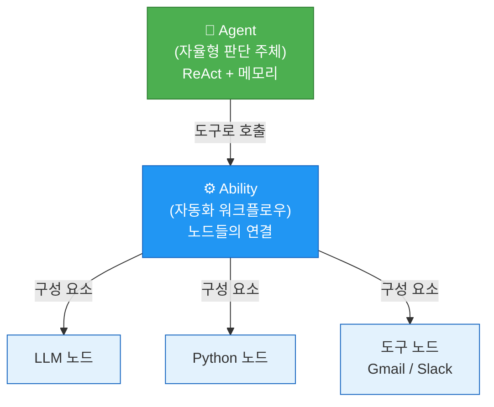

# Agentria 기반 AI 에이전트 부트캠프
{: .no_toc }

동의대학교 × 제네시스랩 AI 부트캠프 교육 과정입니다.

## 과정 구성

| 과정 | 시간 | 핵심 학습 범위 | 대상 |
|------|------|---------------|------|
| [중급 공통과정](/agentria/common) | 45시간 (5일×9시간) | Ability (워크플로우) 마스터 | 전공자 (AI Agent 비경험자) |
| [중급 전문(1) 과정](/agentria/advanced) | 45시간 (5일×9시간) | Agent (자율형) 고급 구축 | 공통과정 이수자 |

## Agentria 3계층 아키텍처

## 참고 자료

- [Agentria 공식 문서](https://agentria.ai/docs/about-agentria-ko)
- [교육설계 분석 보고서](/agentria/analysis)
