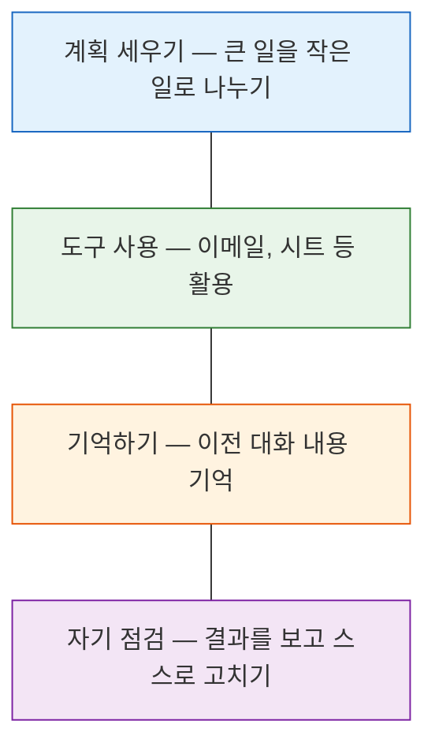
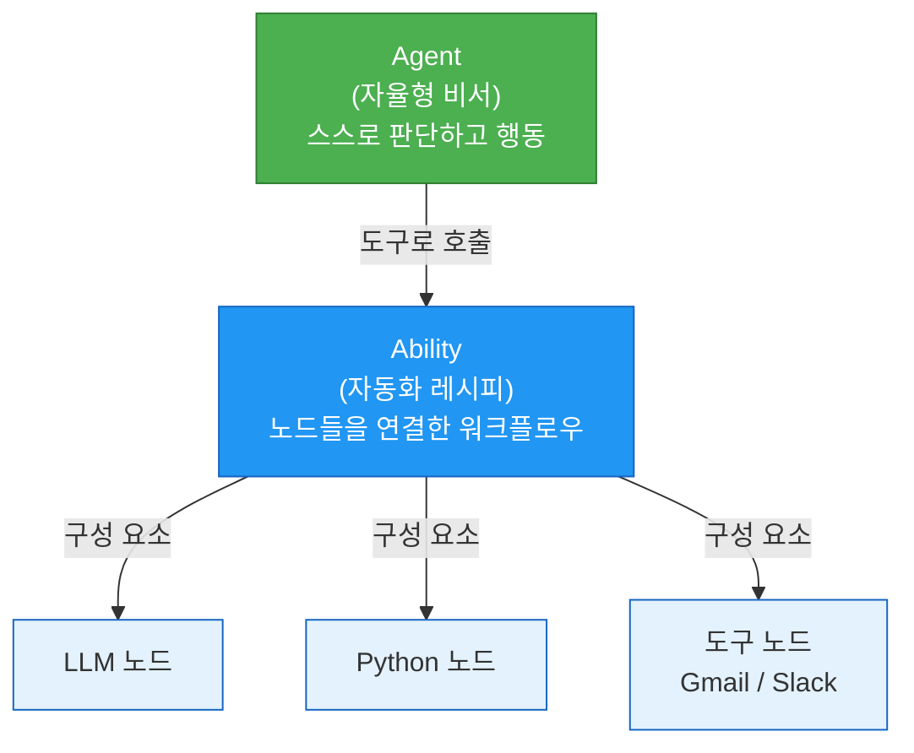
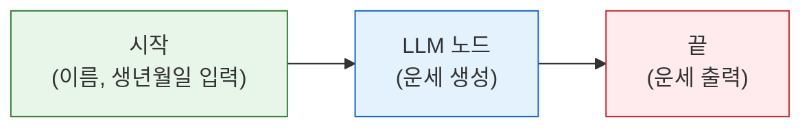
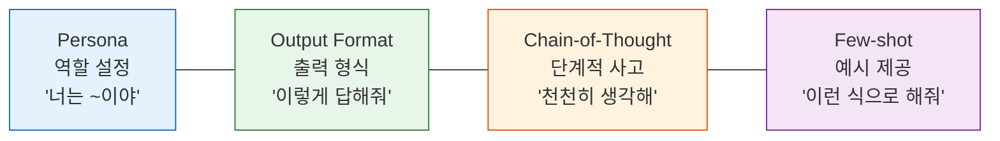
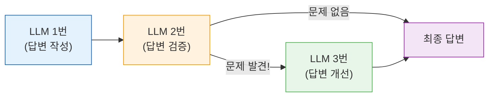
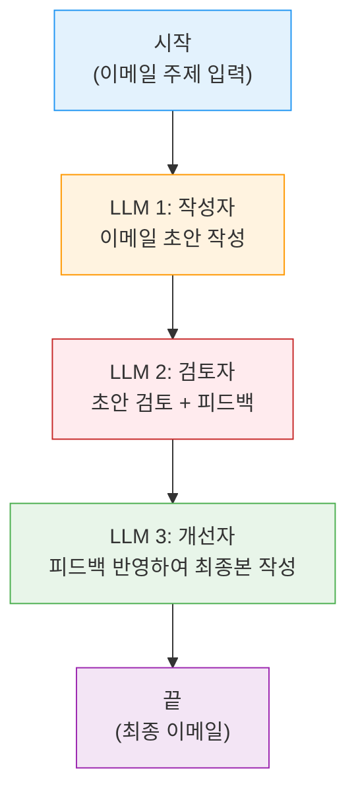

# Day 1 교안: AI 에이전트 입문과 프롬프트 엔지니어링

## 공통과정 | 2026-07-06 (월) | 09:00-19:00

---

## 일일 학습 목표

| 목표 | 설명 |
|------|------|
| AI 기본 개념 이해 | "AI란?", "LLM이란?", "에이전트란?"을 일상 언어로 설명할 수 있다 |
| Agentria 첫 Ability | 마우스 클릭만으로 첫 번째 AI 워크플로우를 만든다 |
| 프롬프트 엔지니어링 | AI에게 "말 잘 하는 법" 4가지 기법을 익힌다 |
| Reflection 패턴 | AI가 스스로 결과를 검토하는 자기 점검 흐름을 이해한다 |

---

# 1차시: AI 에이전트란 무엇인가? + Agentria 첫 걸음

## 09:00-12:00 (3시간)

---

### 09:00-09:30 | 아이스브레이커: Speed Networking (30분)

> 💡 **첫 만남, 어색함을 깨는 시간!**

#### 진행 방법

1. 전체가 원형으로 섭니다
2. 마주 보는 사람과 **1분간** 자기소개를 합니다
3. 소개 내용:
   - 이름, 학과
   - "AI로 자동화하고 싶은 귀찮은 일 하나"
   - "이번 주에 기대하는 것"
4. 종이 울리면 한 칸씩 이동, 새로운 사람과 대화!
5. 총 5번 반복 (5명과 인사)

> 💡 **Tip**: 어색해도 괜찮아요! 이번 주 동안 함께할 동료입니다. 편하게 이야기해 주세요.

---

### 09:30-10:30 | 개념: AI 기본기 다지기 (60분)

#### "AI"란 무엇일까요? (15분)

여러분은 이미 AI를 사용하고 있습니다.

| 여러분이 이미 쓰는 AI | 어떤 AI인가요? |
|----------------------|---------------|
| 네이버 스마트렌즈 | 사진을 보고 물건 이름을 알려주는 AI |
| 유튜브 추천 영상 | "이 사람은 이런 영상을 좋아하겠지" 예측하는 AI |
| 카카오톡 맞춤법 검사 | 문장을 읽고 틀린 부분을 찾는 AI |
| ChatGPT, Gemini | 대화를 나누고 글을 써주는 AI |

> 💡 **쉬운 설명**: AI = "사람처럼 생각하고 판단하도록 만든 컴퓨터 프로그램"입니다. 마법이 아니라, 엄청나게 많은 데이터를 학습한 결과물이에요.

#### "LLM"이란? (15분)

ChatGPT, Gemini, Claude 같은 AI 서비스의 핵심 기술이 바로 **LLM**입니다.

**LLM** = Large Language Model = 대규모 언어 모델

> 💡 **쉬운 설명**: LLM은 **"인터넷의 거의 모든 글을 읽고 공부한 초급 신입사원"**과 같습니다.
> - 일반 상식은 풍부합니다
> - 글쓰기, 번역, 요약을 잘합니다
> - 하지만 **우리 회사 내부 자료는 모릅니다**
> - 가끔 **모르는 걸 아는 척**합니다 (할루시네이션)

**LLM이 하는 일**: 여러분이 글을 입력하면, 다음에 올 가장 적절한 글을 만들어냅니다.

```
여러분이 입력: "내일 서울 날씨 어때?"
LLM이 생성:    "내일 서울은 맑은 날씨가 예상되며..."
```

#### "프롬프트"란? (10분)

> 💡 **쉬운 설명**: 프롬프트 = **AI에게 하는 지시/요청**입니다.

음식점에서 주문할 때를 생각해 보세요:
- 나쁜 주문: "아무거나 주세요" -> 원하는 음식이 안 나올 수 있음
- 좋은 주문: "매운 거 빼고, 밥 양 적게, 국물 많이 주세요" -> 원하는 대로 나옴

AI도 마찬가지입니다:
- 나쁜 프롬프트: "보고서 써줘" -> 엉뚱한 결과
- 좋은 프롬프트: "매출 데이터를 표로 정리하고, 전월 대비 변화를 분석해줘" -> 원하는 결과!

**프롬프트를 잘 쓰는 법**이 바로 오늘 오후에 배울 "프롬프트 엔지니어링"입니다.

#### "에이전트"란? (10분)

**기존 AI와 AI 에이전트의 차이**

| 구분 | 기존 AI (예: ChatGPT) | AI 에이전트 |
|------|----------------------|------------|
| 동작 방식 | 질문하면 답변 (1회) | 목표를 주면 알아서 여러 단계 실행 |
| 비유 | 질문에 답하는 **백과사전** | 지시하면 알아서 일하는 **비서** |
| 도구 사용 | 못 함 | 이메일 보내기, 시트 기록 등 가능 |
| 기억력 | 없음 (매번 새로 시작) | 있음 (이전 대화 기억) |
| 예시 | "이 문장 번역해줘" | "매일 아침 뉴스 요약해서 이메일로 보내줘" |

> 💡 **핵심**: ChatGPT에게 **질문하는 것**은 기존 AI, ChatGPT가 **알아서 이메일 보내고 시트에 기록하는 것**은 AI 에이전트입니다.

**AI 에이전트의 4가지 능력**



#### AI 에이전트 도구 비교 (10분)

| 종류 | 도구 이름 | 특징 | 누구에게 적합? |
|------|----------|------|---------------|
| **노코드** (코딩 불필요) | **Agentria**, n8n, Zapier | 마우스 클릭으로 만들기 | 비전공자, 빠른 자동화 |
| **로우코드** (약간의 코딩) | LangGraph, Dify | 화면 + 약간의 코드 | 기초 코딩 가능한 사람 |
| **풀코드** (전부 코딩) | LangChain, CrewAI | 코드로 모든 것을 제어 | 개발자 |

> 💡 **이번 수업에서는 Agentria(노코드)를 사용합니다.** 코딩 없이 마우스 클릭만으로 AI 에이전트를 만들 수 있어요!

---

### 10:30-10:40 | 쉬는 시간 (10분)

---

### 10:40-11:00 | 개념: Agentria 플랫폼 이해하기 (20분)

#### Agentria의 3가지 핵심 개념



| 개념 | 무엇인가요? | 일상 비유 |
|------|------------|----------|
| **Node (노드)** | 하나의 작업을 하는 최소 단위 | 레고 블록 하나 |
| **Ability (어빌리티)** | 노드들을 연결한 자동화 흐름 | 레고로 만든 자동차 |
| **Agent (에이전트)** | 스스로 판단하여 Ability를 실행하는 주체 | 레고 자동차를 운전하는 로봇 |
| **Storage (스토리지)** | AI가 읽을 수 있는 문서 보관함 | 도서관 |
| **Credential (크리덴셜)** | 외부 서비스 사용을 위한 인증 정보 | 출입증 |

> 💡 **쉬운 설명**: 이번 주에 우리가 만드는 것은 **Ability(자동화 레시피)**입니다. 레고 블록(Node)을 하나씩 연결해서 자동차(Ability)를 만드는 거예요!

> ✅ **자주 묻는 질문**
> - Q: "Ability와 Agent의 차이가 뭔가요?"
> - A: Ability는 **정해진 순서대로** 실행되는 자동화입니다. Agent는 **스스로 판단**해서 어떤 Ability를 쓸지 결정합니다. 이번 공통과정에서는 Ability를 만들고, 전문과정에서 Agent를 배웁니다.

---

### 11:00-12:00 | 따라하기 실습: Agentria에서 첫 Ability 만들기 (60분)

#### 실습 1.1: Agentria 환경 셋업 (15분)

> **강사가 화면을 보여주면서 함께 진행합니다. 천천히 따라와 주세요!**

**Step 1: 로그인**

1. Chrome 브라우저를 엽니다
2. 주소창에 `agentria.ai` 를 입력합니다
3. "로그인" 버튼을 클릭합니다
4. 사전에 만든 계정으로 로그인합니다

> ✅ **체크포인트**: 로그인이 되셨나요? 대시보드 화면이 보이면 손을 들어주세요!

> ⚠️ **주의**: 로그인이 안 되시는 분은 손을 들어주세요. 강사가 바로 도와드립니다.

**Step 2: 첫 프로젝트 만들기**

1. 화면에서 **"새 프로젝트"** 버튼을 찾아 클릭합니다
2. 프로젝트 이름을 입력합니다: `Day1_첫번째_Ability`
3. 컴포저(만들기 도구) 선택 화면이 나옵니다. **Ability**를 선택합니다

> 💡 **Tip**: "Ability"와 "Agent" 두 가지가 보일 텐데, 이번 주에는 항상 **Ability**를 선택하세요!

**Step 3: 화면 구성 알아보기**

Agentria 캔버스(작업 화면)는 이렇게 생겼습니다:

| 위치 | 역할 | 비유 |
|------|------|------|
| **왼쪽** | 노드 패널 (사용할 수 있는 블록 목록) | 레고 상자 |
| **가운데** | 캔버스 (블록을 배치하고 연결하는 공간) | 작업 테이블 |
| **오른쪽** | 편집기 (선택한 블록의 세부 설정) | 블록 설명서 |
| **위쪽** | 실행 버튼 (만든 것을 테스트) | 시작 버튼 |

#### 실습 1.2: 첫 Ability 만들기 — "운세 알려주기" (45분)

> 💡 **목표**: 이름과 생년월일을 입력하면 오늘의 운세를 알려주는 AI를 만듭니다!

**전체 구조**:



**Step 1: Start 노드 설정**

> Start 노드는 이미 캔버스에 있습니다. 사용자가 입력할 값을 정의하는 곳이에요.

1. Start 노드를 **클릭**합니다
2. 오른쪽 편집기에서 **"변수 추가"** 버튼을 클릭합니다
3. 첫 번째 변수:
   - 변수명: `UserName`
   - 타입: String (문자열)
4. 두 번째 변수:
   - 변수명: `BirthDate`
   - 타입: String (문자열)

> 💡 **"변수"란?** 사용자가 입력하는 값을 담는 **상자**입니다. "UserName"이라는 이름표가 붙은 상자에 사용자의 이름이 들어갑니다.

> ⚠️ **주의**: 변수 이름은 영어로 써야 합니다. 한글은 사용할 수 없어요!

**Step 2: LLM 노드 추가**

1. 왼쪽 노드 패널에서 **"AI"** 카테고리를 찾습니다
2. **"LLM"** 노드를 찾아서 캔버스 가운데로 **드래그(끌어서 놓기)**합니다
3. Start 노드의 오른쪽 동그라미(출력 핀) → LLM 노드의 왼쪽 동그라미(입력 핀)를 **마우스로 드래그하여 연결**합니다

> 💡 **Tip**: 연결할 때 선이 나타나면 성공입니다! 선이 안 나타나면 출력 핀에서 시작해서 입력 핀까지 끌어보세요.

**Step 3: LLM 노드 설정**

1. LLM 노드를 **클릭**합니다
2. 오른쪽 편집기에서 다음을 설정합니다:
   - **Credential**: Azure OpenAI LLM 선택
3. **System Prompt** 칸에 아래 내용을 **복사-붙여넣기** 하세요:

```
당신은 유쾌하고 긍정적인 운세 상담사입니다.
사용자의 이름과 생년월일을 기반으로 오늘의 운세를 알려주세요.
운세는 다음 형식으로 작성하세요:

## {이름}님의 오늘의 운세
- 전체운: (한 줄 요약)
- 금전운: (별 5개 만점)
- 연애운: (별 5개 만점)
- 건강운: (별 5개 만점)
- 행운의 색: (색상)
- 오늘의 조언: (한 문장)
```

4. **User Prompt** 칸에 입력:
   - `이름: {UserName}, 생년월일: {BirthDate}`
   - `{UserName}`과 `{BirthDate}`는 Start 노드에서 **드래그&드롭**으로 바인딩(연결)합니다

> 💡 **"System Prompt"란?** AI에게 미리 주는 **역할 설명서**입니다. "너는 운세 상담사야"라고 알려주는 것이에요.
>
> **"User Prompt"란?** 실제 사용자가 보내는 **메시지**입니다. 이름과 생년월일을 전달합니다.

5. **Output 변수** 추가:
   - 연필 아이콘 클릭 - 변수명: `FortuneMessage`, 타입: String

**Step 4: End 노드 연결**

1. LLM 노드의 오른쪽 핀 → End 노드의 왼쪽 핀을 **드래그하여 연결**
2. End 노드에서 출력 변수로 `FortuneMessage`를 선택합니다

**Step 5: 테스트 실행!**

1. 화면 상단의 **"RUN TEST"** 버튼을 클릭합니다
2. 입력값을 넣어봅시다:
   - UserName: `김민지`
   - BirthDate: `1999-03-15`
3. **실행** 클릭!
4. 결과를 확인합니다

> ✅ **체크포인트**: 운세 결과가 나왔나요? "전체운", "금전운" 등이 형식에 맞게 나오는지 확인하세요!

> 💡 **여러분이 해냈습니다!** 축하합니다. 첫 번째 AI Ability를 완성했어요!

**추가 미션** (시간이 남는 분):

- 미션 1: System Prompt의 역할을 "점잖은 동양 철학자"로 바꿔서 결과 비교
- 미션 2: 다른 친구의 이름과 생년월일로 테스트

> ✅ **자주 묻는 질문**
> - Q: "RUN TEST 버튼이 안 눌려요"
> - A: 노드 사이 연결선이 제대로 되어 있는지 확인하세요. Start → LLM → End가 모두 선으로 연결되어야 합니다.
> - Q: "결과가 영어로 나와요"
> - A: System Prompt에 "한국어로 답변하세요"를 추가해 보세요.

---

# 2차시: 프롬프트 엔지니어링 — AI에게 말 잘 하는 법

## 13:00-16:00 (3시간)

---

### 13:00-13:15 | 오후 에너자이저 (15분)

> 💡 **"AI야 맞춰봐" 게임**

1. 강사가 유명인/캐릭터의 특징을 3개 읽어줍니다
2. 여러분은 누구인지 맞춰보세요
3. 그런데! ChatGPT에게도 같은 힌트를 줘봅니다. AI가 맞출까요?

(점심 먹고 졸릴 수 있으니 재미있게 시작합시다!)

---

### 13:15-14:05 | 개념: 프롬프트 엔지니어링 4대 기법 (50분)

#### 프롬프트 엔지니어링이란?

> 💡 **쉬운 설명**: **AI에게 말 잘 하는 기술**입니다. 같은 질문이라도 어떻게 물어보느냐에 따라 AI의 답변 품질이 완전히 달라집니다.

**나쁜 프롬프트 vs 좋은 프롬프트**:

| 나쁜 프롬프트 | 좋은 프롬프트 |
|-------------|-------------|
| "보고서 써줘" | "마케팅 팀장으로서, 이번 분기 매출 데이터를 표로 정리하고 전월 대비 증감을 분석해줘" |
| "번역해줘" | "IT 기술 문서 번역 전문가로서, 아래 영문을 자연스러운 한국어로 번역하되 기술 용어는 영어를 병기해줘" |

이제 **4가지 핵심 기법**을 하나씩 배워봅시다!

#### 기법 1: Persona (역할 설정) — "너는 ~이야"

AI에게 **역할**을 부여하면 그 역할에 맞는 전문적인 답변을 합니다.

| 구분 | 설명 | 예시 |
|------|------|------|
| 역할 | AI가 맡을 직업 | "당신은 10년 경력의 마케팅 전문가입니다" |
| 전문성 | 어떤 분야인지 | "SNS 마케팅에 특화되어 있습니다" |
| 톤 | 말하는 스타일 | "친절하되 전문적으로 설명합니다" |

> 💡 **비유**: 음식점에서 "아무 요리사에게 부탁"하는 것 vs "한식 전문 셰프에게 부탁"하는 것의 차이입니다.

#### 기법 2: Output Format (출력 형식) — "이런 모양으로 답해줘"

AI에게 **답변의 형태**를 지정하면 원하는 구조로 결과를 받을 수 있습니다.

```
# 표 형식으로 달라고 하면:
| 항목 | 내용 |
|------|------|
| 장점 | ... |
| 단점 | ... |

# 목록 형식으로 달라고 하면:
1. 첫 번째 포인트
2. 두 번째 포인트
3. 세 번째 포인트
```

> 💡 **비유**: "대충 알려줘" vs "표로 정리해서 알려줘"의 차이입니다.

#### 기법 3: Chain-of-Thought (단계적 사고) — "천천히 생각해봐"

AI에게 **생각하는 순서**를 알려주면 복잡한 문제도 정확하게 풀 수 있습니다.

```
문제를 풀기 전에 다음 순서로 생각하세요:
1단계: 주어진 정보를 정리합니다
2단계: 핵심 포인트를 찾습니다
3단계: 각 포인트를 분석합니다
4단계: 결론을 내립니다
```

> 💡 **비유**: 시험 볼 때 "일단 답부터 쓰기" vs "문제를 천천히 읽고 단계별로 풀기"의 차이입니다. 단계별로 푸는 게 정확도가 높죠?

#### 기법 4: Few-shot (예시 제공) — "이런 식으로 해줘"

AI에게 **구체적인 예시**를 보여주면, 그 패턴대로 결과를 만들어냅니다.

```
다음 예시처럼 고객 리뷰를 분류해주세요:

[예시 1]
리뷰: "배송이 빨라서 좋았어요"
분류: 칭찬
카테고리: 배송

[예시 2]
리뷰: "상품이 파손되어 왔습니다"
분류: 불만
카테고리: 상품품질

이제 아래 리뷰를 같은 방식으로 분류해주세요:
리뷰: "(실제 리뷰)"
```

> 💡 **비유**: "이런 느낌으로 해줘"라고 견본을 보여주는 것입니다. 말로 설명하는 것보다 예시 하나 보여주는 게 빠르죠!

#### 4가지 기법 정리



> ✅ **자주 묻는 질문**
> - Q: "4가지를 항상 다 써야 하나요?"
> - A: 아닙니다! 상황에 맞게 필요한 것만 조합하면 됩니다. 보통 Persona + Output Format 조합을 가장 많이 씁니다.

---

### 14:05-14:15 | 쉬는 시간 (10분)

---

### 14:15-15:55 | 따라하기 실습: 프롬프트 4가지 변형 실험 (100분)

#### 실습 2.1: 역할(Persona) 3종 비교 (30분)

> 💡 **목표**: 같은 질문을 다른 역할의 AI에게 물어보고, 답변이 얼마나 달라지는지 체험합니다.

**공통 질문**: "우리 회사 매출이 지난 분기 대비 15% 감소했습니다. 어떻게 해야 할까요?"

**Ability 1: 친절한 경영 컨설턴트**

1. 새 Ability를 만듭니다 (이름: `역할비교_컨설턴트`)
2. Start → LLM → End 구조를 만듭니다
3. System Prompt에 **복사-붙여넣기**:

```
당신은 20년 경력의 경영 컨설턴트입니다.
고객사의 문제에 공감하면서도 실행 가능한 솔루션을 제시합니다.
항상 긍정적인 톤을 유지합니다.
```

**Ability 2: 깐깐한 CFO**

System Prompt:
```
당신은 대기업 CFO로, 숫자와 데이터에 기반한 냉철한 분석을 제공합니다.
감정적 판단을 배제하고, 효과가 검증된 방안만 제안합니다.
모든 제안에 예상 비용과 효과를 수치로 제시합니다.
```

**Ability 3: 스타트업 데이터 분석가**

System Prompt:
```
당신은 스타트업 전문 데이터 분석가입니다.
문제의 근본 원인을 데이터 관점에서 분석하고,
실험적 접근법을 제안합니다.
```

> **활동**: 3개 Ability를 만들어 같은 질문을 넣어보세요. 답변이 얼마나 다른가요? 옆 사람과 비교해 봅시다!

#### 실습 2.2: 출력 형식 제어 — 회의록 요약 에이전트 (40분)

> 💡 **목표**: 같은 회의록을 다른 형식으로 정리하는 AI를 만들어봅니다.

**입력 데이터** (이 텍스트를 Start 노드의 `MeetingNotes` 변수에 넣을 거예요):

```
김부장: 이번 분기 마케팅 예산을 20% 증액하는 건 어떨까요?
이과장: 동의합니다. 특히 SNS 광고에 집중하면 좋겠습니다.
박대리: 경쟁사 분석 결과, 인플루언서 마케팅이 효과가 좋더라고요.
김부장: 좋습니다. 그럼 SNS 광고 50%, 인플루언서 30%, 기존 채널 20%로 배분합시다.
이과장: 다음 주 수요일까지 세부 계획서를 작성해주실 수 있나요?
박대리: 네, 수요일까지 제출하겠습니다.
김부장: 참, 그리고 신규 CRM 도입 건은 IT팀과 미팅 후 다음 회의에서 논의합시다.
```

**미션 A**: 표 형식으로 정리하는 AI 만들기

System Prompt:
```
회의록을 분석하여 다음 표 형식으로 정리하세요:

| 구분 | 내용 |
|------|------|
| 결정사항 | ... |
| 할 일 | ... |
| 담당자 | ... |
| 기한 | ... |
| 다음에 논의할 것 | ... |
```

**미션 B**: 보고서 형식으로 정리하는 AI 만들기

System Prompt:
```
회의록을 분석하여 보고서 형식으로 정리하세요:
## 1. 핵심 결정 사항 (3줄 이내)
## 2. 할 일 목록 (체크리스트)
## 3. 아직 정해지지 않은 것
## 4. 다음 회의 때 논의할 것
```

> **비교해 봅시다**: 같은 회의록인데 표 형식 vs 보고서 형식, 어떤 게 더 읽기 좋나요? 상황에 따라 다르겠죠?

#### 실습 2.3: Chain-of-Thought + Few-shot 결합 (30분)

> 💡 **목표**: "단계적 사고"와 "예시 제공"을 함께 써서 AI의 정확도를 높여봅니다.

**과제**: 고객 리뷰 감성 분석 에이전트

**기본 프롬프트 (Before)**:
```
고객 리뷰를 분석하세요.
```

**최적화된 프롬프트 (After)** — 복사-붙여넣기:
```
당신은 고객 리뷰 분석 전문가입니다.

## 분석 순서 (이 순서대로 생각하세요)
1단계: 리뷰에서 감정을 나타내는 표현을 찾습니다
2단계: 긍정/부정/중립으로 분류합니다
3단계: 핵심 키워드를 3개 이내로 뽑습니다
4단계: 개선할 점이 있다면 정리합니다

## 출력 형식
| 항목 | 내용 |
|------|------|
| 감성 | 긍정/부정/중립 |
| 핵심 키워드 | (최대 3개) |
| 개선 제안 | (있는 경우만) |

## 예시
입력: "제품 품질은 좋은데 배송이 너무 느려요. 일주일이나 걸렸습니다."
| 항목 | 내용 |
|------|------|
| 감성 | 부정 |
| 핵심 키워드 | 배송 지연, 품질 만족, 개선 필요 |
| 개선 제안 | 배송 프로세스 점검 필요 |
```

> **활동**: Before(기본) 프롬프트와 After(최적화) 프롬프트로 같은 리뷰 3개를 분석해 보세요. 결과가 얼마나 달라지나요?

테스트할 리뷰:
1. "제품 너무 좋아요! 다음에도 꼭 구매할게요"
2. "색상이 사진과 달라요. 실망입니다"
3. "가격 대비 괜찮은 것 같아요"

---

### 15:55-16:00 | 쉬는 시간 준비

---

# 3차시: Reflection 패턴 입문 + 프롬프트 A/B 테스트

## 16:15-19:00 (2시간 45분)

---

### 16:15-16:35 | 개념: Reflection 패턴이란? (20분)

#### AI도 실수합니다. 그래서 "자기 점검"이 필요합니다!

여러분이 시험 답안지를 쓸 때를 생각해 보세요:
1. **첫 번째 작성**: 일단 답을 씁니다
2. **자기 점검**: 다시 읽어보면서 틀린 부분을 찾습니다
3. **수정**: 발견한 실수를 고칩니다

AI도 이렇게 할 수 있습니다! 이것이 **Reflection 패턴**입니다.



> 💡 **쉬운 설명**: Reflection = **"AI에게 자기가 쓴 답을 다시 검토하게 하는 것"**입니다.
> - 작성 AI: 글을 씁니다
> - 검증 AI: "이 글에 틀린 부분 없나?" 확인합니다
> - 개선 AI: 지적받은 부분을 고칩니다

> 💡 **왜 중요한가요?** AI가 한 번에 완벽한 답을 내놓는 경우는 드뭅니다. 자기 점검 단계를 추가하면 답변 품질이 크게 올라갑니다. 이것이 Agentic AI의 4대 요소 중 "Reflection(자기 점검)"입니다.

---

### 16:35-17:20 | 따라하기 실습: Reflection 패턴 Ability 만들기 (45분)

> 💡 **목표**: 이메일 초안을 작성하고, AI가 직접 검토하고, 개선하는 3단계 Ability를 만듭니다.

#### 전체 구조



#### Step 1: 새 Ability 만들기

1. Agentria에서 새 Ability를 만듭니다
2. 이름: `Reflection_이메일개선`
3. Start 노드에 변수 추가:
   - `EmailTopic` (String): 이메일 주제

#### Step 2: LLM 1번 — 작성자

LLM 노드를 추가하고 System Prompt에 **복사-붙여넣기**:

```
당신은 비즈니스 이메일 작성자입니다.
주어진 주제로 비즈니스 이메일을 작성하세요.

형식:
- 인사말
- 본문 (3-5문장)
- 마무리 인사

톤: 격식 있고 전문적
```

#### Step 3: LLM 2번 — 검토자

두 번째 LLM 노드를 추가하고 System Prompt에 **복사-붙여넣기**:

```
당신은 비즈니스 커뮤니케이션 전문 검토자입니다.
아래 이메일 초안을 검토하고 개선점을 찾아주세요.

검토 항목:
1. 문법과 맞춤법
2. 비즈니스 적절성
3. 명확성 (애매한 표현은 없는지)
4. 빠진 내용이 없는지

형식:
- 잘된 점: (1-2개)
- 개선할 점: (구체적으로)
- 수정 제안: (구체적인 대안)
```

#### Step 4: LLM 3번 — 개선자

세 번째 LLM 노드를 추가하고 System Prompt에 **복사-붙여넣기**:

```
당신은 이메일 개선 전문가입니다.
아래 원본 이메일과 검토 피드백을 참고하여
최종 개선된 이메일을 작성하세요.

규칙:
- 검토자의 모든 피드백을 반영하세요
- 원래 의미와 톤은 유지하세요
- 최종 이메일만 출력하세요
```

User Prompt에는 작성자 LLM의 출력과 검토자 LLM의 출력을 모두 연결합니다.

#### Step 5: End 노드 연결 + 테스트!

1. 모든 노드를 연결합니다: Start → LLM1 → LLM2 → LLM3 → End
2. 테스트 입력: `EmailTopic: 프로젝트 일정 변경 안내`
3. **실행!**

> ✅ **체크포인트**: 3단계를 거치면서 이메일이 어떻게 개선되었나요? 각 단계의 출력을 비교해 보세요!

> 💡 **관찰해 보세요**:
> - 1단계(작성): 기본적인 이메일
> - 2단계(검토): "이 부분이 애매합니다" 같은 피드백
> - 3단계(개선): 피드백이 반영된 더 좋은 이메일
>
> 이것이 Reflection 패턴의 힘입니다!

---

### 17:20-17:30 | 쉬는 시간 (10분)

---

### 17:30-17:50 | 개념: Bulk Run 기능 소개 (20분)

#### Bulk Run이란?

> 💡 **쉬운 설명**: **여러 입력을 한 번에 테스트**하는 기능입니다.

하나씩 테스트하면 시간이 오래 걸립니다. Bulk Run을 쓰면 10개 입력을 한꺼번에 실행해서 결과를 비교할 수 있어요.

**활용 상황**:
- 프롬프트 A와 B 중 어떤 게 더 정확한지 비교할 때
- AI 답변이 매번 같은 형식으로 나오는지 확인할 때
- 이상한 입력(빈 칸, 영어, 아주 긴 텍스트)에도 잘 동작하는지 테스트할 때

---

### 17:50-18:30 | 실습: 프롬프트 A/B/C 테스트 (40분)

#### 실습 3.1: 테스트 데이터 준비 (10분)

고객 리뷰 10개를 준비합니다:

| # | 리뷰 | 정답 |
|---|------|------|
| 1 | "제품 너무 좋아요! 다음에도 꼭 구매할게요" | 긍정 |
| 2 | "사이즈가 안 맞아서 교환했는데 절차가 복잡해요" | 부정 |
| 3 | "가격 대비 괜찮은 것 같아요" | 중립 |
| 4 | "배송은 빨랐는데 포장이 엉성했어요" | 부정 |
| 5 | "색상이 사진과 달라요. 실망입니다" | 부정 |
| 6 | "선물용으로 샀는데 받는 분이 좋아하셨어요" | 긍정 |
| 7 | "그냥 보통이에요. 특별한 건 없습니다" | 중립 |
| 8 | "AS가 너무 좋아서 감동했습니다" | 긍정 |
| 9 | "한 달 쓰니까 고장났어요. 내구성 최악" | 부정 |
| 10 | "이 가격에 이 정도면 합리적이라고 생각합니다" | 중립 |

#### 실습 3.2: 3가지 프롬프트로 비교 (20분)

**버전 A: 간단한 프롬프트**
```
고객 리뷰를 긍정/부정/중립으로 분류하세요.
```

**버전 B: 기준을 알려주는 프롬프트**
```
당신은 리뷰 분석 전문가입니다.
고객 리뷰를 다음 기준으로 분류하세요:
- 긍정: 만족, 추천, 재구매 의사 표현
- 부정: 불만, 문제 제기, 개선 요구
- 중립: 특별한 감정 없음, 객관적 서술
```

**버전 C: 예시까지 보여주는 프롬프트** (2차시에서 만든 최적화 프롬프트)

각 버전별로 10개 리뷰를 Bulk Run으로 실행하고, 정답과 비교합니다.

#### 실습 3.3: 결과 비교 (10분)

| 평가 항목 | 버전 A | 버전 B | 버전 C |
|-----------|--------|--------|--------|
| 정확도 (10개 중 맞힌 수) | /10 | /10 | /10 |
| 형식이 일정한가? | O/X | O/X | O/X |

> 💡 **보통 버전 C가 가장 정확합니다.** 하지만 항상 그렇지는 않아요. 여러분의 결과는 어떤가요?

---

### 18:30-18:45 | TIL 카드 작성 + 1인 1문장 공유 (15분)

#### TIL (Today I Learned) 카드

포스트잇이나 카드에 적어주세요:

```
+------------------------------+
|       Day 1 TIL 카드          |
+------------------------------+
| 오늘 배운 것 3가지:            |
| 1. ________________________   |
| 2. ________________________   |
| 3. ________________________   |
|                                |
| 가장 놀라웠던 것:              |
| _____________________________  |
|                                |
| 아직 궁금한 것:               |
| _____________________________  |
+------------------------------+
```

**1인 1문장 공유**: 돌아가면서 오늘 배운 것 중 가장 인상 깊었던 것을 **한 문장**으로 말해주세요.

---

### 18:45-19:00 | Daily 미니과제 안내 + 내일 예고 (15분)

#### Daily 미니과제 (1)

> **과제**: 오늘 만든 Ability 중 하나를 선택하여, 본인이 실생활에 적용할 수 있는 시나리오를 200자 이내로 작성하여 제출
>
> **제출 형식**:
> - Ability 이름:
> - 적용 시나리오: (학교 과제, 아르바이트, 동아리 등)
> - 기대 효과:

#### 내일 예고

> **"내일은 AI에게 판단력을 줍니다!"**
>
> 내일 배울 것:
> - AI가 텍스트를 자동으로 분류하는 법
> - "만약 ~이면 A, 아니면 B" 조건 분기
> - AI가 이메일과 Slack 메시지를 자동으로 보내는 법
>
> 기대해 주세요!

---

## Day 1 핵심 정리

| 시간 | 배운 것 | 한줄 요약 |
|------|---------|----------|
| 1차시 오전 | AI, LLM, 에이전트 + 첫 Ability | "AI는 마법이 아니라 잘 훈련된 프로그램이고, 우리는 노코드로 활용한다" |
| 2차시 오후 | 프롬프트 엔지니어링 4대 기법 | "AI에게 말 잘 하면 결과가 완전히 달라진다" |
| 3차시 저녁 | Reflection 패턴 + A/B 테스트 | "AI도 자기 점검을 하면 더 좋은 결과를 낸다" |

---

## Day 1 준비물 체크리스트 (강사용)

- [ ] Agentria 전체 계정 로그인 상태 확인
- [ ] 실습용 회의록 텍스트, 고객 리뷰 10개 데이터셋 사전 배포
- [ ] 아이스브레이커용 타이머 (1분 x 5라운드)
- [ ] 프로젝터/화면 공유 준비
- [ ] 수강생 이름표 준비
- [ ] TIL 카드용 포스트잇 또는 인덱스 카드
- [ ] "AI야 맞춰봐" 게임 문항 5개 (에너자이저용)
- [ ] 실습 가이드 인쇄물 (또는 온라인 링크 공유)
