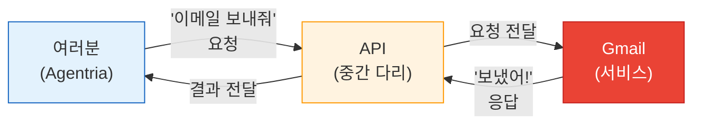
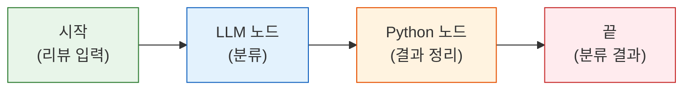
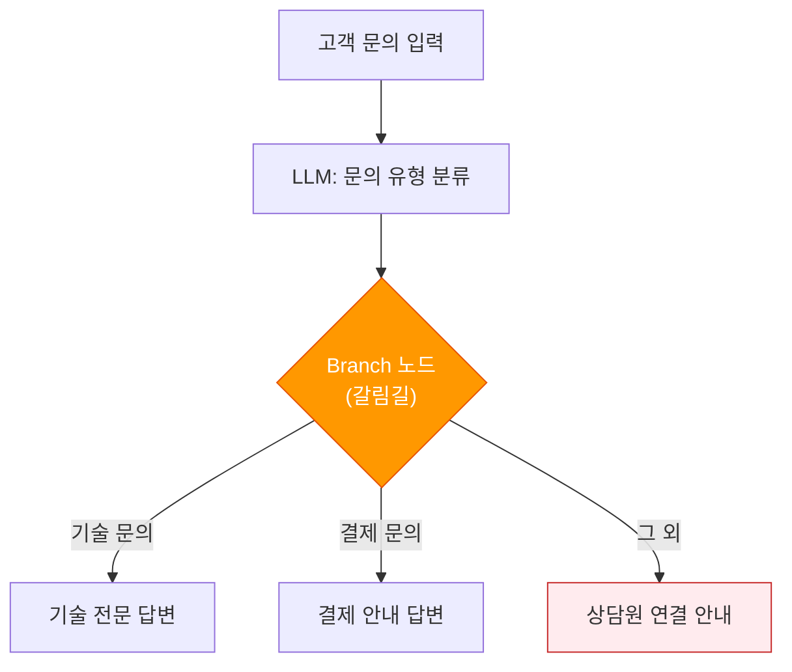
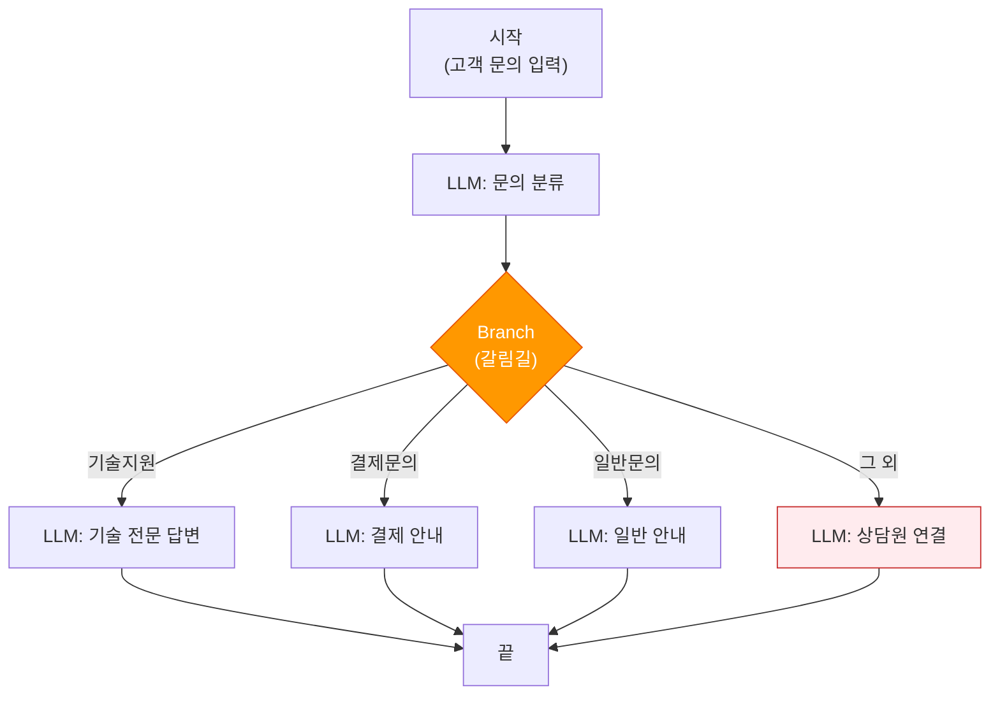
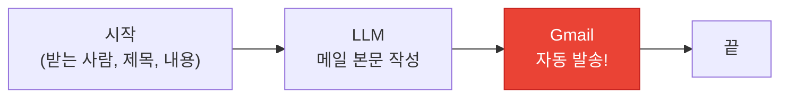
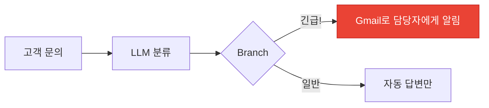
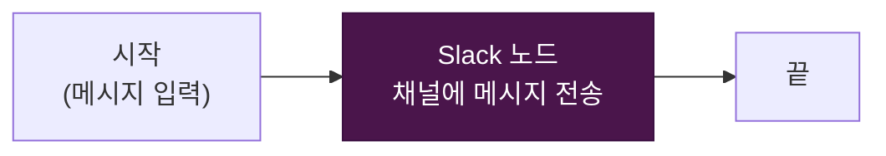
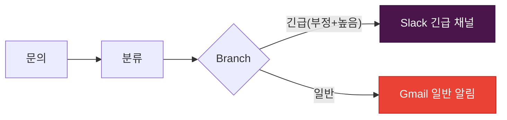

# Day 2 교안: 데이터 처리와 외부 서비스 연동

## 공통과정 | 2026-07-07 (화) | 09:00-19:00

---

## 일일 학습 목표

| 목표 | 설명 |
|------|------|
| 텍스트 분류 | AI가 글을 읽고 자동으로 분류하는 Ability를 만든다 |
| Python 노드 입문 | 코드를 복사-붙여넣기하여 데이터를 가공하는 방법을 배운다 |
| 조건 분기 | "만약 ~이면 A, 아니면 B" 논리를 만든다 |
| 외부 서비스 연동 | AI가 이메일과 Slack 메시지를 자동으로 보내게 한다 |

---

# 4차시: 텍스트 분류 + Python 노드 입문

## 09:00-12:00 (3시간)

---

### 09:00-09:10 | Daily Standup (10분)

> 💡 **진행 방법**: 한 사람씩 돌아가며 30초 이내로 이야기합니다.

오늘의 스탠딩 질문:
1. "어제 만든 Ability 중 기억나는 것 하나?"
2. "오늘 가장 배우고 싶은 것은?"

---

### 09:10-09:20 | Day1 복습 퀴즈 (10분)

> ✅ **퀴즈 시간!** 손을 들거나 채팅으로 답해주세요.

| # | 문제 | 정답 |
|---|------|------|
| 1 | AI에게 하는 지시/요청을 뭐라고 하나요? | 프롬프트 |
| 2 | AI에게 "너는 마케팅 전문가야"라고 역할을 주는 기법은? | Persona (역할 설정) |
| 3 | Agentria에서 노드들을 연결한 자동화 흐름을 뭐라고 하나요? | Ability |
| 4 | AI가 모르는 것을 아는 척 하는 현상은? | 할루시네이션 |
| 5 | AI에게 "이런 식으로 해줘"라고 예시를 보여주는 기법은? | Few-shot |

> 💡 **Tip**: 틀려도 괜찮아요! 어제 배운 것을 떠올리는 것 자체가 중요합니다.

---

### 09:20-10:10 | 개념: 텍스트 분류와 Python 노드, JSON 이해하기 (50분)

#### AI가 텍스트를 분류한다? (15분)

> 💡 **쉬운 설명**: AI에게 글을 읽게 하고, "이 글은 어떤 종류인지" 자동으로 판단하게 하는 것입니다.

**일상 속 텍스트 분류 예시**:
- 이메일: 스팸 / 중요 / 일반 → 자동 분류
- 고객 리뷰: 칭찬 / 불만 / 문의 → 자동 분류
- 뉴스 기사: 정치 / 경제 / 스포츠 → 자동 분류

**분류 프롬프트 잘 쓰는 3가지 원칙**:

| 원칙 | 설명 | 예시 |
|------|------|------|
| 1. 종류를 명확히 | 어떤 카테고리가 있는지 알려주기 | "칭찬, 불만, 문의 중 하나로 분류" |
| 2. 판단 기준 알려주기 | 각 카테고리의 기준 설명 | "불만: 문제 제기, 개선 요구 포함" |
| 3. 애매한 경우 정하기 | 애매할 때 어떻게 할지 규칙 | "판단 어려우면 '문의'로 분류" |

#### "JSON"이란? (15분)

앞으로 자주 볼 형식이 있어요. 바로 **JSON**입니다.

> 💡 **쉬운 설명**: JSON은 **"데이터 택배 상자"**입니다.

물건(데이터)을 정해진 규격의 상자에 담아서 보내면, 받는 쪽에서 쉽게 꺼내 쓸 수 있어요. 컴퓨터끼리 데이터를 주고받을 때 이 상자를 사용합니다.

```
{
  "이름": "홍길동",
  "나이": 25,
  "학과": "경영학과"
}
```

규칙은 간단합니다:
- `{ }` 중괄호로 감싸기
- `"이름": "값"` 형태로 쓰기 (콜론으로 구분)
- 여러 개면 쉼표로 구분

> 💡 **왜 알아야 하나요?** AI에게 "JSON으로 답해줘"라고 하면, 깔끔하게 정리된 데이터를 받을 수 있어요. 이 데이터를 다음 노드에서 활용하기 쉽습니다.

#### "Python 노드"란? (10분)

> 💡 **쉬운 설명**: Python 노드는 **계산기**입니다.

LLM 노드가 "국어 선생님" (문장을 잘 씀)이라면, Python 노드는 "수학 선생님" (계산을 정확히 함)입니다.

| LLM 노드 | Python 노드 |
|----------|------------|
| 글 쓰기, 번역, 요약 | 정확한 계산, 날짜 처리 |
| "대략" 맞는 결과 | "정확히" 맞는 결과 |
| 자연어 처리 | 데이터 가공 |

> ⚠️ **안심하세요!** Python(프로그래밍 언어)을 직접 배우는 것이 아닙니다. 강사가 주는 코드를 **복사-붙여넣기**만 하면 됩니다!

#### "API"란? (10분)

오후에 Gmail, Slack을 연동할 건데, 그 전에 "API"라는 말을 알아두면 좋습니다.

> 💡 **쉬운 설명**: API = **"프로그램끼리 대화하는 방법"**입니다.

음식점 비유로 설명하면:
- **여러분** = 손님 (요청하는 사람)
- **API** = 주문서 + 웨이터 (요청을 전달하는 중간 다리)
- **주방** = 서비스 (Gmail, Slack 등)



Agentria에서는 API를 직접 다룰 필요 없이, Gmail/Slack 노드를 연결하면 자동으로 API를 통해 소통합니다.

> ✅ **자주 묻는 질문**
> - Q: "API를 직접 코딩해야 하나요?"
> - A: 아닙니다! Agentria가 다 해줍니다. 여러분은 노드를 연결하고 설정만 하면 돼요.

---

### 10:10-10:20 | 쉬는 시간 (10분)

---

### 10:20-12:00 | 따라하기 실습: 텍스트 분류 파이프라인 (100분)

#### 실습 4.1: 고객 리뷰 자동 분류 Ability (60분)

> 💡 **목표**: 고객 리뷰를 입력하면 AI가 자동으로 "칭찬/불만/문의"로 분류하는 Ability를 만듭니다.

**전체 구조**:



**Step 1: 새 Ability 만들기**

1. Agentria에서 새 Ability를 만듭니다
2. 이름: `고객리뷰_자동분류`
3. Start 노드에 변수 추가:
   - `ReviewText` (String): 고객 리뷰 텍스트

**Step 2: LLM 노드 — 분류기**

LLM 노드를 추가하고 System Prompt에 **복사-붙여넣기**:

```
당신은 고객 리뷰 분류 전문가입니다.

입력된 리뷰를 분석하고 아래 JSON 형식으로 답하세요:
{
  "sentiment": "긍정 또는 부정 또는 중립",
  "category": "제품품질 또는 배송 또는 가격 또는 서비스 또는 기타",
  "urgency": "높음 또는 보통 또는 낮음",
  "keywords": ["키워드1", "키워드2"]
}

분류 기준:
- 긍정: 만족, 감사, 추천 표현
- 부정: 불만, 문제 제기, 실망 표현
- 중립: 객관적 서술, 특별한 감정 없음

긴급도 기준:
- 높음: 결제 오류, 제품 파손, 즉시 대응 필요
- 보통: 일반 불만, 개선 요구
- 낮음: 단순 문의, 칭찬

반드시 JSON 형식으로만 답하세요. 다른 설명은 쓰지 마세요.
```

**Step 3: Python 노드 — 결과 정리**

Python 노드를 추가하고 아래 코드를 **통째로 복사-붙여넣기**:

```python
import json  # JSON 데이터를 다루는 도구를 가져옵니다

# LLM이 분류한 결과를 읽어옵니다
try:
    analysis = json.loads(classification_result)  # JSON 텍스트를 데이터로 변환

    # 등급을 매깁니다 (긴급도에 따라)
    if analysis["sentiment"] == "부정" and analysis["urgency"] == "높음":
        analysis["grade"] = "A"  # 즉시 대응 필요!
    elif analysis["sentiment"] == "부정":
        analysis["grade"] = "B"  # 일반 대응
    else:
        analysis["grade"] = "C"  # 모니터링

    # 한줄 요약을 만듭니다
    analysis["summary"] = f"[{analysis['grade']}등급] {analysis['sentiment']} - {analysis['category']}"

    return {"output": json.dumps(analysis, ensure_ascii=False)}  # 결과를 내보냅니다
except:
    return {"output": json.dumps({"error": "분석 실패", "raw": classification_result})}
```

> 💡 **코드 설명** (이해 안 해도 괜찮아요!):
> - `json.loads(...)`: JSON 텍스트를 컴퓨터가 이해하는 데이터로 바꿈
> - `if ... elif ... else`: "만약 ~이면 / 아니면 ~이면 / 그 외에"
> - `return {"output": ...}`: 결과를 다음 노드로 보냄

**Step 4: 테스트!**

다음 리뷰로 테스트해 봅시다:

| # | 테스트 리뷰 | 예상 분류 |
|---|-----------|----------|
| 1 | "배송이 정말 빠르고 포장도 깔끔했어요!" | 긍정 |
| 2 | "결제가 2번 됐는데 환불이 안 돼요" | 부정 + 높음 |
| 3 | "보통이에요. 특별한 건 없습니다" | 중립 |

> ✅ **체크포인트**: JSON 형식으로 분류 결과가 나오나요? 등급(A/B/C)이 올바르게 매겨졌나요?

#### 실습 4.2: 분류 프롬프트 개선 실험 (40분)

> 💡 **목표**: 프롬프트를 바꿔가며 분류 정확도가 어떻게 달라지는지 실험합니다.

| 실험 | 변경 사항 | 해볼 것 |
|------|----------|---------|
| 실험 1 | Few-shot 예시 2개 추가 | 정확도가 올라가나? |
| 실험 2 | "먼저 핵심 감정 표현을 찾고..." CoT 추가 | 판단 근거가 더 좋아지나? |
| 실험 3 | 카테고리를 3개에서 6개로 늘리기 | 세분화하면 정확도가 떨어지나? |

> **활동**: 실험 결과를 옆 사람과 비교해 보세요. 어떤 변경이 가장 효과적이었나요?

---

# 5차시: 조건 분기 + 분류 정확도 대결

## 13:00-16:00 (3시간)

---

### 13:00-13:15 | 오후 에너자이저 (15분)

> 💡 **"분류 릴레이" 게임**

1. 강사가 단어를 하나 말합니다 (예: "사과")
2. 다음 사람이 그 단어의 **카테고리**를 말합니다 (예: "과일")
3. 그 다음 사람은 새 단어를 말합니다 (예: "축구")
4. 다음 사람이 카테고리를 말합니다 (예: "스포츠")
5. 3초 안에 못 말하면 탈락!

(AI도 이런 분류를 하는 거예요. 우리는 사람보다 빠르게 분류하는 AI를 만들 겁니다!)

---

### 13:15-13:45 | 개념: Branch 노드 = "만약 ~이면" (30분)

#### Branch 노드란?

> 💡 **쉬운 설명**: Branch 노드 = **"갈림길"**입니다.

일상에서의 "만약 ~이면":
- 만약 **비가 오면** → 우산을 가져간다
- 만약 **맑으면** → 선글라스를 가져간다
- 만약 **어느 쪽도 아니면** → 그냥 나간다

AI 에이전트에서도 마찬가지입니다:
- 만약 **기술 문의면** → 기술 전문 답변을 보낸다
- 만약 **결제 문의면** → 결제 안내 답변을 보낸다
- 만약 **어느 쪽도 아니면** → 상담원 연결 안내를 보낸다



#### Branch 노드 설정하는 법

조건식은 이렇게 씁니다:
- `classification == '기술지원'` → "분류 결과가 기술지원이면 이 길로"
- `classification == '결제문의'` → "분류 결과가 결제문의면 이 길로"
- **Else** → "위의 어디에도 해당하지 않으면 이 길로"

> ⚠️ **중요**: **Else(그 외) 경로**를 반드시 만들어야 합니다! AI가 예상치 못한 답을 내놓을 수 있기 때문이에요.

> ✅ **자주 묻는 질문**
> - Q: "조건식을 외워야 하나요?"
> - A: 아닙니다! `변수명 == '값'` 이 패턴만 기억하면 됩니다. 나머지는 복사-붙여넣기!

---

### 13:45-15:15 | 따라하기 실습: CS 자동 응답 에이전트 (90분)

> 💡 **목표**: 고객 문의를 받으면 자동으로 분류하고, 분류에 맞는 답변을 보내는 에이전트를 만듭니다.

#### 전체 구조



#### Step 1: 새 Ability 만들기

1. 새 Ability: `CS_자동응답`
2. Start 노드 변수: `CustomerInquiry` (String)

#### Step 2: 분류 LLM 노드

System Prompt에 **복사-붙여넣기**:

```
고객 문의를 정확히 하나의 카테고리로 분류하세요.
반드시 다음 중 하나만 출력하세요 (다른 텍스트 없이):
기술지원, 결제문의, 일반문의
```

> 💡 **왜 "다른 텍스트 없이"라고 했을까요?** Branch 노드가 AI의 답변을 읽어서 길을 정하는데, "네, 이 문의는 기술지원입니다"라고 답하면 Branch가 혼란스러워해요. 깔끔하게 "기술지원"만 답해야 합니다.

#### Step 3: Branch 노드 설정

1. Branch 노드를 추가합니다
2. 조건을 설정합니다:
   - 조건 1: `classification == '기술지원'`
   - 조건 2: `classification == '결제문의'`
   - 조건 3: `classification == '일반문의'`
   - Else: 기타 (상담원 연결)

#### Step 4: 각 경로별 LLM 노드

**기술지원 경로** — System Prompt:
```
당신은 친절한 IT 기술 지원 상담원입니다.
고객의 기술 문의에 대해 단계별 해결 방법을 안내합니다.
어려운 전문 용어는 쉬운 말로 바꿔서 설명합니다.
해결이 어려운 경우 원격 지원 신청 방법을 안내합니다.
```

**결제문의 경로** — System Prompt:
```
당신은 결제 담당 전문 상담원입니다.
결제, 환불, 구독 관련 문의에 정확한 절차를 안내합니다.
민감한 금융 정보(카드번호 등)는 절대 요청하지 않습니다.
```

**일반문의 경로** — System Prompt:
```
당신은 친절한 고객 서비스 상담원입니다.
일반적인 문의에 정확하고 친절하게 답변합니다.
```

**Else(폴백) 경로** — System Prompt:
```
고객의 질문이 분류하기 어려운 경우입니다.
다음과 같이 안내하세요:
"더 정확한 도움을 드리기 위해 전문 상담원을 연결해 드리겠습니다.
고객센터(1588-xxxx)로 연락해 주시면 빠르게 도와드리겠습니다."
```

#### Step 5: 테스트!

| # | 문의 내용 | 예상 분류 |
|---|----------|----------|
| 1 | "앱이 자꾸 꺼져요. 어떻게 하죠?" | 기술지원 |
| 2 | "환불 신청했는데 아직 안 됐어요" | 결제문의 |
| 3 | "영업시간이 어떻게 되나요?" | 일반문의 |
| 4 | "결제했는데 앱이 안 열려요" | ??? (애매한 경우!) |

> 💡 **4번 같은 애매한 경우를 관찰하세요!** 기술지원과 결제문의가 섞여 있죠? AI가 어떻게 분류하는지 보는 것이 중요합니다.

> ✅ **체크포인트**: 4개 경로(기술/결제/일반/Else) 모두 테스트해 보셨나요?

---

### 15:15-15:45 | 분류 정확도 대결 (30분)

> 💡 **재미있는 대결 시간!**

#### 규칙

1. **모든 팀(2인)이 같은 10개 문의**를 받습니다
2. 각 팀은 자기만의 **최적 분류 프롬프트**를 만듭니다
3. 10개 문의를 Bulk Run으로 실행합니다
4. 정답과 비교하여 **정확도가 가장 높은 팀이 우승!**

#### 테스트 문의 10개 (강사가 배포)

| # | 문의 | 정답 |
|---|------|------|
| 1 | "비밀번호를 잊어버렸어요" | 기술지원 |
| 2 | "이번 달 요금이 이상해요" | 결제문의 |
| 3 | "주차장이 어디에 있나요?" | 일반문의 |
| 4 | "앱 업데이트하니까 느려졌어요" | 기술지원 |
| 5 | "카드 결제가 안 돼요" | 결제문의 |
| 6 | "직원 추천 좀 해주세요" | 일반문의 |
| 7 | "환불 언제 입금되나요?" | 결제문의 |
| 8 | "화면이 깜빡거려요" | 기술지원 |
| 9 | "회원 탈퇴 어떻게 하나요?" | 일반문의 |
| 10 | "결제는 했는데 서비스가 안 켜져요" | ??? (팀별 판단) |

#### 결과 발표

| 팀 | 프롬프트 핵심 전략 | 정확도 |
|----|------------------|--------|
| 1팀 | | /10 |
| 2팀 | | /10 |
| ... | | /10 |

> 💡 **우승팀은 어떤 전략을 썼나요?** 전체 공유 시간을 가집니다.

---

### 15:45-16:00 | 쉬는 시간

---

# 6차시: 외부 서비스 연동 — Gmail + Slack + 트러블슈팅

## 16:15-19:00 (2시간 45분)

---

### 16:15-17:30 | 따라하기 실습: Gmail 연동 (75분)

#### "크리덴셜"이란?

> 💡 **쉬운 설명**: 크리덴셜 = **"출입증"**입니다.

Agentria가 여러분의 Gmail에 접근하려면 "이 사람이 허락했어요"라는 증명서가 필요합니다. 이것이 크리덴셜이에요.

> ⚠️ **사전 설정이 되어 있어야 합니다!** 수업 전에 Google Cloud OAuth 설정을 완료하셨죠? 안 되신 분은 강사에게 말씀해 주세요.

#### 크리덴셜 확인 체크리스트

- [ ] Google Cloud Console에서 OAuth 클라이언트 만들기 완료
- [ ] Client ID, Client Secret 확보
- [ ] Agentria에 Google Gmail 크리덴셜 등록 완료
- [ ] Gmail API 활성화 확인

> ⚠️ **주의**: 확인이 안 되는 항목이 있으면 바로 손을 들어주세요! 강사가 함께 해결합니다.

#### 실습 6.1: 자동 메일 발송 Ability (45분)

> 💡 **목표**: AI가 글을 작성하고, 자동으로 이메일까지 보내는 Ability를 만듭니다!

**전체 구조**:



**Step 1: 새 Ability 만들기**

1. 이름: `자동_이메일_발송`
2. Start 노드 변수:
   - `RecipientEmail` (String): 받는 사람 이메일
   - `Subject` (String): 메일 제목
   - `Content` (String): 요청 내용 키워드

**Step 2: LLM 노드 — 메일 본문 작성**

System Prompt에 **복사-붙여넣기**:
```
당신은 비즈니스 이메일 작성 전문가입니다.
주어진 키워드를 바탕으로 정중하고 명확한 이메일 본문을 작성하세요.

형식:
- 인사말
- 본문 (3-5문장)
- 마무리 인사
- 서명

톤: 격식있고 전문적
```

**Step 3: Gmail 노드 추가**

1. 왼쪽 패널에서 **"도구"** 카테고리 → **Gmail** 노드를 드래그
2. LLM 노드 → Gmail 노드 연결
3. Gmail 노드 설정:
   - **Operation**: Send Message (메일 보내기)
   - **Credential**: 사전 등록한 Google Gmail 선택
4. 변수 연결:
   - to: `RecipientEmail` (Start 노드에서)
   - subject: `Subject` (Start 노드에서)
   - message_body: LLM 출력 (LLM 노드에서)

**Step 4: 테스트!**

1. **본인 이메일**로 테스트합니다
   - RecipientEmail: `본인이메일@gmail.com`
   - Subject: `테스트 이메일입니다`
   - Content: `프로젝트 진행 상황 보고`
2. 실행 후 **Gmail 받은편지함**을 확인합니다

> ✅ **체크포인트**: 이메일이 도착했나요? AI가 작성한 본문이 들어있나요?

> 💡 **와, 대단해요!** AI가 글을 쓰고, 자동으로 이메일까지 보냈습니다. 이것이 자동화의 힘이에요!

#### 실습 6.2: 분류 결과에 따라 자동 메일 보내기 (30분)

> 💡 **목표**: 5차시에서 만든 CS 에이전트 + Gmail을 합칩니다.

4차시 분류 결과가 "긴급"이면 자동으로 담당자에게 알림 메일을 보내는 것입니다.



---

### 17:30-18:15 | 따라하기 실습: Slack 연동 (45분)

#### 실습 6.3: Slack 채널 알림 (30분)

> 💡 **목표**: AI가 Slack 채널에 자동으로 메시지를 보내는 Ability를 만듭니다.

**Step 1: Slack 크리덴셜 확인**

1. Agentria 크리덴셜 탭에서 Slack 항목을 확인합니다
2. 교육용 Slack 워크스페이스의 채널 ID를 복사합니다

> 💡 **Tip**: 채널 ID는 Slack 채널을 우클릭하면 볼 수 있어요. 모르겠으면 강사에게 물어보세요!

**Step 2: Slack 알림 Ability**



1. 새 Ability: `Slack_알림`
2. Start 노드: `AlertMessage` (String)
3. Slack 노드 추가:
   - Operation: Send Message
   - Channel: 교육용 채널 ID
   - Text: `AlertMessage` 바인딩

**Step 3: 테스트**

- AlertMessage: `안녕하세요! 이것은 AI가 보낸 메시지입니다.`
- 실행 후 Slack 채널을 확인합니다

> ✅ **체크포인트**: Slack 채널에 메시지가 도착했나요?

#### 실습 6.4 (보너스): 긴급도에 따라 Slack 또는 Gmail 보내기 (15분)



---

### 18:15-18:30 | 트러블슈팅 가이드 (15분)

> ⚠️ **외부 서비스 연동에서 자주 나타나는 오류와 해결법**

#### OAuth 관련 오류

| 오류 메시지 | 원인 | 해결 방법 |
|------------|------|----------|
| "인증 실패" | OAuth 토큰이 만료됨 | Agentria 크리덴셜에서 "재인증" 클릭 |
| "권한 없음" | Gmail API가 비활성화 | Google Cloud Console에서 Gmail API 활성화 |
| "Callback URL 불일치" | 리디렉션 URL이 다름 | Agentria 제공 URL과 Cloud Console URL 비교 확인 |

#### Gmail 관련 오류

| 증상 | 원인 | 해결 방법 |
|------|------|----------|
| 메일이 안 보내짐 | 받는 사람 이메일 형식 오류 | `@gmail.com` 등 형식 확인 |
| 메일이 스팸함에 들어감 | 제목이 스팸성 | 제목을 자연스럽게 변경 |
| 발송은 됐는데 내용이 비어있음 | 변수 바인딩 오류 | LLM 출력 → Gmail message_body 연결 확인 |

#### Slack 관련 오류

| 증상 | 원인 | 해결 방법 |
|------|------|----------|
| "channel_not_found" | 채널 ID가 잘못됨 | Slack에서 채널 ID 다시 복사 |
| "not_in_channel" | 봇이 채널에 초대 안 됨 | 채널에서 봇을 초대 |
| 메시지가 안 보임 | 다른 채널로 보냄 | 채널 ID 재확인 |

> 💡 **Tip**: 대부분의 오류는 크리덴셜을 다시 설정하면 해결됩니다. "재인증" 버튼을 먼저 눌러보세요!

---

### 18:30-18:45 | TIL 카드 작성 + 1인 1문장 공유 (15분)

#### TIL (Today I Learned) 카드

```
+------------------------------+
|       Day 2 TIL 카드          |
+------------------------------+
| 오늘 배운 것 3가지:            |
| 1. ________________________   |
| 2. ________________________   |
| 3. ________________________   |
|                                |
| 가장 신기했던 것:              |
| _____________________________  |
|                                |
| 아직 어려운 것:               |
| _____________________________  |
+------------------------------+
```

---

### 18:45-19:00 | Daily 미니과제 안내 + 내일 예고 (15분)

#### Daily 미니과제 (2)

> **과제**: 오늘 만든 CS 분류 에이전트에 **새로운 카테고리 1개를 추가**하고 (예: "교환/반품"), 해당 경로의 응답 프롬프트를 작성하여 스크린샷과 함께 제출
>
> **제출물**:
> 1. 추가한 카테고리명과 분류 기준
> 2. 해당 경로의 System Prompt
> 3. 테스트 결과 스크린샷 1장

#### 내일 예고

> **"내일은 AI에게 참고서를 줍니다!"**
>
> 내일 배울 것:
> - RAG: AI에게 우리 문서를 읽게 하는 방법
> - 구글 시트에 자동으로 기록하는 법
> - 미니 해커톤: 배운 것을 모두 합쳐서 나만의 에이전트 만들기!

---

## Day 2 핵심 정리

| 시간 | 배운 것 | 한줄 요약 |
|------|---------|----------|
| 4차시 오전 | 텍스트 분류 + Python 노드 | "AI가 자동으로 글을 분류하고, Python이 데이터를 정리한다" |
| 5차시 오후 | 조건 분기 + 대결 | "'만약 ~이면' 갈림길로 AI의 판단을 구현한다" |
| 6차시 저녁 | Gmail + Slack + 트러블슈팅 | "AI가 이메일과 Slack 메시지를 자동으로 보낸다" |

---

## Day 2 준비물 체크리스트 (강사용)

- [ ] 고객 리뷰 데이터셋 10개 (분류 테스트용)
- [ ] 고객 문의 데이터 10개 (대결용, 정답 포함)
- [ ] Gmail 크리덴셜 사전 설정 상태 확인
- [ ] Slack 워크스페이스 + 테스트 채널 준비
- [ ] 백업 크리덴셜 (OAuth 실패 시 대비)
- [ ] 대결 결과 기록판 (화이트보드 또는 공유 시트)
- [ ] TIL 카드용 포스트잇
