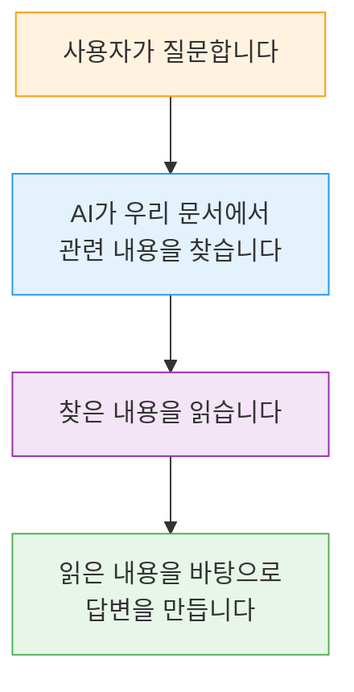
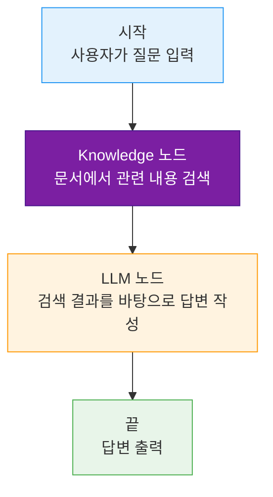
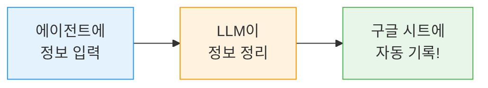
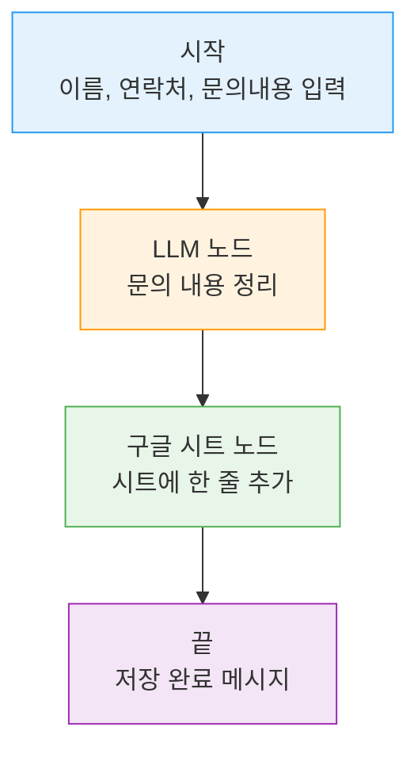
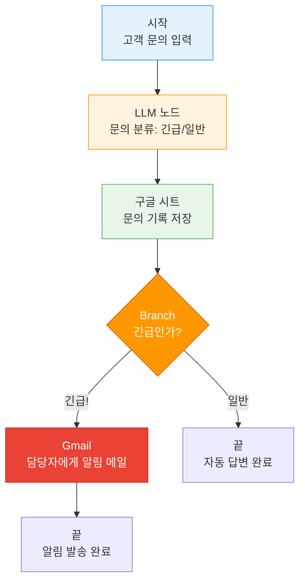
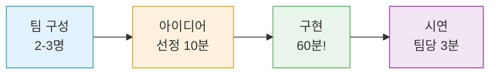

# Day 3 교안: RAG와 통합 파이프라인

## 공통과정 | 2026-07-08 (수) | 09:00-19:00

---

## 일일 학습 목표

| 목표 | 설명 |
|------|------|
| RAG 이해하기 | "AI에게 우리 회사 문서를 읽게 하는 방법"을 배운다 |
| 구글 시트 연동 | 에이전트가 구글 시트에 자동으로 기록하는 것을 만든다 |
| 통합 파이프라인 | Day1~2에서 배운 것을 모두 합쳐 하나의 자동화 흐름을 완성한다 |
| 미니 해커톤 | 팀을 이루어 나만의 에이전트를 만들고 발표한다 |

---

# 7차시: RAG 지식베이스 구축과 활용

## 09:00-12:00 (3시간)

---

### 09:00-09:10 | Daily Standup (10분)

> 💡 **진행 방법**: 한 사람씩 돌아가며 30초 이내로 이야기합니다.

오늘의 스탠딩 질문:
1. "어제 가장 신기했던 것 한 가지?"
2. "오늘 기대되는 것은?"

강사는 화이트보드에 키워드를 적으며 분위기를 띄웁니다.

---

### 09:10-09:20 | Day2 복습 퀴즈 (10분)

> ✅ **퀴즈 시간!** 손을 들거나 채팅으로 답해주세요.

| # | 문제 | 정답 |
|---|------|------|
| 1 | "만약 ~이면 A, 아니면 B"를 하는 노드 이름은? | Branch 노드 |
| 2 | Gmail 노드로 할 수 있는 일은? | 이메일 자동 발송 |
| 3 | Slack 알림을 보내려면 어떤 노드를 쓰나요? | Slack 노드 |
| 4 | LLM이 JSON 형식으로 답하게 하려면 어디에 지시를 쓰나요? | System Prompt |
| 5 | Branch 노드에서 "어디에도 해당 안 될 때" 가는 길은? | Else 경로 |

> 💡 **강사용 팁**: 틀려도 괜찮다는 분위기를 만들어 주세요. "아직 헷갈리는 게 당연해요!"

---

### 09:20-10:00 | "AI에게 우리 회사 문서를 읽게 하자" — RAG 개념 (40분)

#### 먼저, 문제를 느껴봅시다

> **강사 시연**: ChatGPT나 일반 AI에게 "우리 회사 연차 규정은 며칠인가요?"라고 물어봅니다.

AI가 뭐라고 답하나요? 아마 **일반적인 내용**을 말하거나, **아예 모르겠다**고 하거나, 심지어 **틀린 답을 자신 있게** 말할 겁니다.

이것이 바로 **할루시네이션(Hallucination)**입니다.

> ⚠️ **할루시네이션이란?** AI가 **모르면서 아는 척 하는 것**입니다. 마치 시험에서 모르는 문제를 그럴듯하게 지어내서 쓰는 것과 같습니다. AI는 "모릅니다"라고 말하는 대신, 그럴듯한 거짓말을 만들어냅니다.

#### RAG란 무엇인가요?

**RAG**는 어려운 영어 약자지만, 개념은 간단합니다.

> 💡 **일상 비유: 오픈북 시험**
> - **일반 AI** = 닫힌 책 시험. 외운 것만으로 답변 (기억이 틀릴 수 있음)
> - **RAG AI** = 오픈북 시험. 책을 보면서 답변 (정확한 근거가 있음)



**쉬운 설명**: RAG = "AI에게 참고서를 주고, 그 참고서를 보면서 답하게 하는 것"

#### 일반 AI vs RAG AI — 같은 질문, 다른 답변

> **강사 시연**: 같은 질문을 일반 AI와 RAG AI에게 합니다. 화면을 나란히 보여줍니다.

| 질문 | 일반 AI의 답변 | RAG AI의 답변 |
|------|---------------|--------------|
| "연차는 며칠?" | "한국 근로기준법에 따라 1년 미만 근로자는..." (일반 정보) | "당사 규정 제5조에 따르면 연차는 15일이며..." (우리 회사 규정) |
| "환불은 어떻게?" | "보통 7일 이내에..." (추측) | "환불 정책 2항에 따라 구매 후 14일 이내..." (정확한 정책) |
| "경조사 휴가는?" | "일반적으로 결혼 5일..." (부정확) | "규정집 제8조, 본인 결혼 시 7일..." (문서 기반) |

> ✅ **핵심 포인트**: RAG는 AI에게 "참고서"를 주는 것입니다. 참고서가 좋으면 답변도 좋아집니다!

#### 할루시네이션을 막는 방법

AI에게 이렇게 지시합니다:

```
"제공된 문서에 있는 내용만 답변하세요.
 문서에 없는 내용은 '해당 정보를 찾을 수 없습니다'라고 말하세요.
 절대로 추측하지 마세요."
```

이 지시를 나중에 **System Prompt**에 넣을 거예요.

> ✅ **자주 묻는 질문**
> - Q: "RAG를 쓰면 할루시네이션이 100% 사라지나요?"
> - A: 완전히 사라지지는 않지만, 크게 줄어듭니다. System Prompt에 "문서에 없으면 모른다고 답해"라고 강하게 지시하면 더 줄일 수 있어요.

---

### 10:00-10:15 | 쉬는시간

---

### 10:15-11:00 | 따라하기 실습: 지식베이스 만들기 (45분)

> 💡 **이번 실습 목표**: AI가 읽을 "참고서"(문서)를 업로드합니다.

#### 실습용 문서 안내

강사가 사전에 배포한 PDF 파일을 사용합니다:
- `회사_휴가규정.pdf` — 연차, 병가, 경조사 등
- `제품_FAQ.pdf` — 자주 묻는 질문 모음
- `환불_정책.pdf` — 환불/교환 절차

> ⚠️ **파일이 없으신 분?** 강사에게 말씀해 주세요. USB나 카카오톡으로 즉시 전달합니다.

#### Step 1: Agentria에 로그인

1. 브라우저를 엽니다 (크롬 권장)
2. Agentria 주소로 이동합니다
3. 어제 만든 **내 계정**으로 로그인합니다
4. 왼쪽 메뉴에서 **내 프로젝트**를 클릭합니다

> ✅ **체크포인트**: 프로젝트 목록 화면이 보이시나요? 보이면 손을 들어주세요!

#### Step 2: Storage 탭으로 이동

1. 프로젝트를 클릭해서 들어갑니다
2. 화면 상단 메뉴에서 **Storage** 탭을 찾습니다
3. Storage 탭을 클릭합니다

> 💡 **Storage란?** AI가 읽을 문서를 보관하는 **서류함** 같은 곳입니다.

#### Step 3: PDF 문서 업로드 (강사 화면 보면서 함께!)

> **강사가 먼저 시연합니다. 화면을 잘 보세요!**

1. **"비정형 데이터"** 영역을 찾습니다
2. **"파일 업로드"** 버튼을 클릭합니다
3. 내 컴퓨터에서 `회사_휴가규정.pdf`를 선택합니다
4. **업로드** 버튼을 클릭합니다
5. 업로드 진행 바가 100%가 될 때까지 기다립니다
6. 같은 방법으로 나머지 2개 파일도 업로드합니다

```
업로드할 파일 3개:
 회사_휴가규정.pdf
 제품_FAQ.pdf
 환불_정책.pdf
```

7. 업로드가 끝나면 **인덱싱 상태**를 확인합니다
   - "처리 중" → 잠시 기다립니다 (1-2분)
   - "완료" → 다음 단계로 넘어갑니다

> ✅ **체크포인트**: 3개 파일 모두 "완료" 상태인가요? 손을 들어주세요!

> ⚠️ **강사용 팁**: 업로드 실패 시 파일 크기(10MB 이하)와 PDF 형식 확인. 스캔본 PDF는 텍스트 추출이 안 될 수 있으므로 텍스트 기반 PDF를 사전 준비하세요.

---

### 11:00-11:45 | 따라하기 실습: RAG Q&A Ability 완성 (45분)

> 💡 **이번 실습 목표**: 업로드한 문서를 읽고 답변하는 AI를 만듭니다.

#### 전체 구조 이해하기

우리가 만들 것은 아래와 같습니다:



#### Step 1: 새 Ability 만들기

1. 왼쪽 메뉴에서 **Ability** 클릭
2. **"+ 새 Ability"** 버튼 클릭
3. 이름 입력: `회사규정 Q&A봇`
4. **만들기** 클릭

#### Step 2: Start 노드 설정

1. Start 노드를 클릭합니다
2. 입력 변수를 추가합니다:
   - 변수명: `UserQuestion`
   - 타입: String

> 💡 **변수란?** 사용자가 입력하는 값을 담는 **상자**입니다. 이름표(`UserQuestion`)를 붙여서 나중에 꺼내 쓸 수 있어요.

#### Step 3: Knowledge 노드 추가

1. 캔버스 빈 공간을 **우클릭** → **Knowledge 노드** 추가
2. Knowledge 노드 설정:
   - 아까 업로드한 **3개 문서를 모두 선택**합니다
   - 검색 쿼리: `{{UserQuestion}}` (사용자의 질문을 그대로 검색에 사용)
3. Start 노드의 출력 핀 → Knowledge 노드의 입력 핀을 **드래그해서 연결**

> 💡 `{{UserQuestion}}` 이 표시는 "UserQuestion 상자에 담긴 값을 여기에 넣어줘"라는 뜻입니다. 중괄호 두 개로 감싸면 변수 값이 들어갑니다.

#### Step 4: LLM 노드 추가 + System Prompt 작성

1. LLM 노드를 추가합니다
2. Knowledge 노드 → LLM 노드를 연결합니다
3. LLM 노드를 클릭하고 **System Prompt**에 아래 내용을 **복사-붙여넣기** 하세요:

```
당신은 사내 규정 안내 전문 상담원입니다.

## 중요한 규칙 (반드시 지켜주세요!)
1. 반드시 [참고 문서]에 있는 내용만 답변하세요
2. 문서에 없는 내용을 물어보면 이렇게 답하세요:
   "해당 정보는 규정에 명시되어 있지 않습니다. 인사팀(hr@company.com)에 문의해 주세요"
3. 답변 끝에 "참고: {문서명}"을 표시하세요
4. 절대로 추측하거나 일반 지식으로 답변하지 마세요

## 답변 형식
### 답변
(명확하고 간결한 답변)

### 관련 규정
(해당 규정의 원문 인용)

참고: {참고한 문서명}
```

> ⚠️ **왜 이런 규칙을 넣나요?** 이 규칙이 없으면 AI가 문서에 없는 내용도 "아는 척"할 수 있습니다. 규칙을 넣으면 AI가 모르는 건 솔직하게 모른다고 말합니다.

#### Step 5: End 노드 연결 + 테스트!

1. LLM 노드 → End 노드를 연결합니다
2. **테스트** 버튼을 클릭합니다
3. UserQuestion에 입력: `연차는 며칠인가요?`
4. **실행** 클릭!

> ✅ **체크포인트**: AI가 우리 문서 내용을 바탕으로 정확하게 답변했나요?

추가 테스트를 해봅시다:
- "환불 신청은 어떻게 하나요?"
- "경조사 휴가 기준은?"
- "회사 근처 맛집 추천해줘" (문서에 없는 질문 — 거절하는지 확인!)

> ⚠️ **강사용 팁**: Knowledge 노드 연결이 안 되는 경우, Storage에서 문서 인덱싱이 완료되었는지 다시 확인하세요.

---

### 11:45-12:00 | 일반 AI vs RAG 비교 체험 (15분)

#### 직접 느껴보는 시간!

같은 질문을 두 곳에 해봅시다:

| 질문 | 일반 AI (ChatGPT 등) | 우리가 만든 RAG 봇 | 느낀 점 |
|------|---------------------|-------------------|---------|
| "연차 휴가는 며칠?" | (직접 써보세요) | (직접 써보세요) | |
| "환불 절차 알려줘" | | | |
| "규정에 없는 것 질문" | | | |

> 💡 **서로 공유해 봅시다!** "와, 이렇게 다르구나!" 하는 부분이 있으면 발표해 주세요.

**핵심 정리**:
- 일반 AI: 학습 데이터에 의존 → 우리 회사 정보 모름 → 할루시네이션 위험
- RAG AI: 우리 문서를 직접 읽음 → 정확한 근거 기반 답변 → 할루시네이션 방지

---

# 8차시: 구글 시트 연동 + 통합 파이프라인

## 13:00-16:00 (3시간)

---

### 13:00-13:15 | 오후 에너자이저 (15분)

> 💡 **"AI vs 사람" 퀴즈 게임**

강사가 문장을 읽어줍니다. AI가 쓴 건지, 사람이 쓴 건지 맞춰보세요!
- 5문제, 각자 O/X로 답변
- 가장 많이 맞힌 분에게 작은 선물

(점심 식사 후 머리를 깨우는 시간입니다. 가볍게 즐겨주세요!)

---

### 13:15-13:45 | "구글 시트에 자동으로 기록하기" 개요 (30분)

#### 왜 구글 시트 연동이 필요할까요?

지금까지 만든 에이전트는 대화만 하고 끝이었습니다. 하지만 실무에서는 **기록**이 중요합니다.

> 💡 **일상 비유**: 전화 상담을 받을 때 상담원이 통화하면서 엑셀에 기록하죠? 에이전트가 **자동으로** 그걸 해주는 겁니다.

#### 구글 시트 노드란?

에이전트가 구글 시트(=엑셀 온라인 버전)를 읽거나 쓸 수 있게 해주는 도구입니다.

| 기능 | 무엇을 하나요? | 비유 |
|------|--------------|------|
| **Read** (읽기) | 시트에서 데이터를 가져옴 | "엑셀에서 값을 찾아보는 것" |
| **Write** (쓰기) | 시트에 새 줄을 추가함 | "엑셀 맨 아래에 한 줄 추가하는 것" |

#### 강사 데모: 에이전트가 시트에 자동 기록!

> **강사가 시연합니다. 화면을 잘 봐주세요!**

1. 에이전트에게 "이름: 김철수, 연락처: 010-1234-5678" 입력
2. 구글 시트를 열어봅니다
3. 새 줄이 자동으로 추가되어 있습니다!



---

### 13:45-14:30 | 따라하기 실습: 시트 Write — 대화 내용 자동 저장 (45분)

#### 사전 준비: 구글 시트 만들기

> **아래 과정을 강사와 함께 진행합니다.**

1. 새 탭에서 [구글 시트](https://sheets.google.com)를 엽니다
2. **"+ 빈 스프레드시트"** 클릭
3. 시트 이름을 `고객문의기록`으로 변경합니다
4. **첫 번째 행(A1~D1)**에 다음 헤더를 입력합니다:

```
A1: 이름
B1: 연락처
C1: 문의내용
D1: 접수시간
```

5. 브라우저 주소창의 URL을 **복사**합니다 (나중에 사용)

> ✅ **체크포인트**: 시트가 만들어지고 헤더 4개가 입력되었나요?

#### 만들 것: 입력 → 정리 → 시트 기록



#### Step 1: 새 Ability 만들기

1. Agentria → Ability → **"+ 새 Ability"**
2. 이름: `고객문의 자동기록`
3. Start 노드 입력 변수:
   - `CustomerName` (String) — 고객 이름
   - `Phone` (String) — 연락처
   - `Inquiry` (String) — 문의 내용

#### Step 2: LLM 노드 추가

1. LLM 노드를 추가하고 Start와 연결합니다
2. System Prompt에 **복사-붙여넣기**:

```
고객 문의를 한 줄로 깔끔하게 요약해 주세요.
원래 의미는 유지하되, 50자 이내로 줄여주세요.
```

3. User Prompt: `{{Inquiry}}`

#### Step 3: 구글 시트 노드 추가

1. 노드 추가 → **Google Sheets** → **Write**
2. LLM 노드 → 시트 노드 연결
3. 시트 노드 설정:
   - **Credential**: 강사가 안내하는 것을 선택
   - **Spreadsheet**: 아까 만든 `고객문의기록` 시트 선택
   - **Sheet 이름**: `Sheet1` (기본값)
4. 컬럼 매핑 (시트의 열 = 어떤 값을 넣을지):

```
A열 (이름)     ← {{CustomerName}}
B열 (연락처)    ← {{Phone}}
C열 (문의내용)  ← {{LLM 출력값}}
D열 (접수시간)  ← (다음 단계에서 추가)
```

#### Step 4: End 노드 연결 + 테스트!

1. 시트 노드 → End 노드 연결
2. **테스트** 실행:
   - CustomerName: `홍길동`
   - Phone: `010-9876-5432`
   - Inquiry: `제품이 3일 전에 도착했는데 교환하고 싶습니다. 사이즈가 안 맞아요.`
3. **실행** 클릭!

> ✅ **확인 방법**: 구글 시트 탭으로 가서 **새로고침** → 새 줄이 추가되었는지 확인!

**한 번 더 테스트**: 다른 이름과 내용으로 다시 실행해 보세요. 시트에 2번째 줄도 추가되나요?

> ⚠️ **강사용 팁**: 시트에 데이터가 안 들어오면 (1) Credential 연결 확인 (2) 시트 공유 설정 확인 (3) 컬럼 매핑 순서 확인. OAuth 인증 팝업이 뜨면 "허용"을 눌러야 합니다.

---

### 14:30-14:45 | 쉬는시간

---

### 14:45-15:30 | 따라하기 실습: 통합 파이프라인 (45분)

> 💡 **이번 실습 목표**: Day2에서 배운 것(Branch, Gmail, Slack)과 오늘 배운 것(시트)을 **모두 합치는** 큰 프로젝트입니다!

#### 시나리오: 고객 문의 자동 처리 시스템

고객이 문의를 보내면:
1. AI가 "긴급인지 일반인지" 판단합니다
2. 구글 시트에 자동 기록합니다
3. 긴급이면 → 담당자에게 이메일 알림
4. 일반이면 → 자동 답변만



#### Step 1: LLM 노드 — 문의 분류

System Prompt에 **복사-붙여넣기**:

```
고객 문의를 분석해서 다음 두 가지를 판단해 주세요:

1. 긴급도: "긴급" 또는 "일반"
   - 긴급: 결제 오류, 개인정보 유출, 서비스 장애, 즉시 해결 필요
   - 일반: 단순 문의, 사용 방법, 일반 불만

2. 한줄 요약: 문의 내용을 20자 이내로 요약

반드시 아래 형식으로만 답변하세요:
긴급도: (긴급 또는 일반)
요약: (한줄 요약)
```

> 💡 **"형식을 강제하는 이유"**: Branch 노드가 AI의 답변에서 "긴급"이라는 단어를 찾아야 하기 때문입니다. AI가 매번 다른 형식으로 답하면 Branch가 혼란스러워요.

#### Step 2: 구글 시트 노드 — 자동 기록

앞에서 배운 것과 동일합니다! 시트에 기록합니다.

#### Step 3: Branch 노드 — 긴급/일반 분기

- 조건: LLM 출력에 `긴급`이 포함되어 있으면 → 긴급 경로
- Else → 일반 경로

> 💡 **Day2에서 배운 Branch 복습!** "만약 ~이면 A, 아니면 B" 기억나시죠?

#### Step 4: Gmail 노드 — 긴급 시 알림

긴급 경로에 Gmail 노드를 연결합니다:
- 받는 사람: 담당자 이메일 (본인 이메일로 테스트)
- 제목: `[긴급] 고객 문의 알림`
- 내용: 문의 요약 + 고객 정보

#### 테스트!

1. **일반 문의 테스트**: "제품 사용법을 알고 싶어요"
   - 시트에 기록 O / 이메일 안 감 O
2. **긴급 문의 테스트**: "결제가 2번 되었어요! 이중결제입니다!"
   - 시트에 기록 O / 이메일 발송 O

> ✅ **체크포인트**: 두 가지 경우 모두 정상 동작하나요?

> ⚠️ **강사용 팁**: Branch 조건이 잘 안 먹히면 LLM의 출력 형식을 확인하세요. "긴급도: 긴급" 형식이 아닌 다른 형식으로 나오는 경우가 많습니다. System Prompt에 출력 예시를 추가하면 해결됩니다.

---

### 15:30-16:00 | Python 노드 기초 — 복사-붙여넣기 실습 (30분)

> ⚠️ **안심하세요!** Python을 배우는 게 아닙니다. 강사가 주는 코드를 **복사-붙여넣기**만 하면 됩니다!

#### Python 노드란?

LLM이 하기 어려운 **정확한 계산, 날짜 처리, 데이터 변환** 등을 해주는 도구입니다.

> 💡 **비유**: LLM은 "국어 선생님" (문장을 잘 씀), Python은 "수학 선생님" (계산을 정확히 함). 둘을 함께 쓰면 더 강력합니다!

#### 실습: 현재 날짜/시간 자동 생성

아까 만든 "고객문의 자동기록"에서 **접수시간**을 자동으로 넣어봅시다.

1. Python 노드를 추가합니다
2. 아래 코드를 **통째로 복사-붙여넣기** 하세요:

```python
from datetime import datetime  # 날짜 도구를 가져옵니다

# 현재 날짜와 시간을 "2026-07-08 14:30" 형식으로 만들기
current_time = datetime.now().strftime("%Y-%m-%d %H:%M")  # 지금 시간을 형식에 맞게 변환

return {"output": current_time}  # 결과를 다음 노드로 보냅니다
```

> 💡 **코드 설명** (이해 안 해도 괜찮아요!):
> - `from datetime import datetime`: "날짜 도구를 가져와"
> - `datetime.now()`: "지금 시간을 알려줘"
> - `.strftime(...)`: "이런 형식으로 보여줘"
> - `return {"output": ...}`: "결과를 내보내줘"

3. Python 노드의 출력을 → 구글 시트의 **D열(접수시간)**에 연결합니다
4. 테스트 실행! → 시트에 자동으로 현재 시간이 기록됩니다

> ✅ **체크포인트**: 시트의 D열에 오늘 날짜와 시간이 자동으로 들어갔나요?

---

# 9차시: 미니 해커톤

## 16:15-19:00 (2시간 45분)

---

### 16:15-16:30 | 에너자이저 (15분)

> 💡 **"스피드 브레인스토밍"**

1. 2명씩 짝을 짓습니다
2. 1분 안에 "AI 에이전트로 자동화하면 좋을 것" 최대한 많이 적기
3. 가장 많이 적은 팀 발표!

(이 활동이 바로 이어지는 해커톤 아이디어에 도움이 됩니다)

---

### 16:30-16:45 | 미니 해커톤 규칙 설명 (15분)

#### 미니 해커톤이란?

> **"배운 것을 자유롭게 조합해서 나만의 에이전트를 만드는 시간!"**



#### 규칙

| 항목 | 내용 |
|------|------|
| 팀 구성 | 2-3인 1팀 (옆 사람과!) |
| 시간 | 60분 (타이머 켜놓겠습니다!) |
| 필수 조건 | 최소 **3개 이상 노드** 사용 |
| 사용 가능 노드 | LLM, Branch, Python, Gmail, Slack, 구글 시트, Knowledge(RAG) — 전부 사용 가능! |
| 심사 기준 | 창의성 (30%) + 완성도 (40%) + 실용성 (30%) |

#### 추천 아이디어 카드

> 💡 **아이디어가 안 떠오르면 아래에서 골라도 됩니다!**

| # | 아이디어 | 사용 노드 | 난이도 |
|---|---------|-----------|--------|
| 1 | 고객 리뷰 분석기: 리뷰 입력 → 분류 → 시트 기록 | LLM + Branch + 시트 | 보통 |
| 2 | 이메일 뉴스레터봇: 주제 입력 → AI가 글 작성 → 이메일 발송 | LLM + Gmail | 쉬움 |
| 3 | 회사 규정 Q&A + 기록: 질문 → RAG 답변 → 시트에 저장 | Knowledge + LLM + 시트 | 보통 |
| 4 | 면접 질문 생성기: 직무 입력 → 질문 5개 생성 → 이메일로 발송 | LLM + Python + Gmail | 보통 |
| 5 | 긴급 알림 시스템: 메시지 분석 → 긴급도 판단 → Slack 또는 이메일 | LLM + Branch + Slack + Gmail | 어려움 |

---

### 16:45-17:45 | 미니 해커톤 구현 (60분)

#### 진행 가이드

**처음 10분**: 아이디어 정하기 + 역할 분담
- 누가 어떤 노드를 담당할지 정합니다
- 간단한 흐름도를 종이에 그려봅니다

**중간 40분**: 구현!
- Start → LLM → End 부터 먼저 만들기 (기본 동작 확인)
- 하나씩 노드 추가하기 (한 번에 다 만들지 마세요!)
- **10분마다 한 번씩 테스트**하세요

**마지막 10분**: 테스트 + 시연 준비
- 시연할 때 입력할 예시 데이터 준비
- 발표 담당 정하기

> ⚠️ **강사 순회 코칭**: 각 팀을 돌아다니며 도와줍니다. 막히면 바로 손 들어주세요!

> 💡 **강사용 팁**: 
> - 30분 경과 시 "이제 절반 지났습니다! 기본 동작이 되는 팀 손!"
> - 50분 경과 시 "10분 남았습니다! 마무리하세요!"
> - 완성 못해도 괜찮다고 격려해 주세요. 시도한 것 자체가 중요합니다.

---

### 17:45-18:15 | 팀별 시연 (30분)

#### 발표 형식 (팀당 3분)

1. **"무엇을 만들었나요?"** (30초) — 한 줄 소개
2. **"어떤 노드를 조합했나요?"** (30초) — 구조 설명
3. **라이브 시연** (2분) — 실제 동작 보여주기!

> 💡 **시연 중 에러가 나도 괜찮습니다!** "여기서 이런 문제가 있었는데, 이렇게 해결하려고 했습니다"라고 말해도 좋은 발표입니다.

#### 관객 참여

다른 팀 발표를 보면서 아래를 적어주세요:
- 가장 **창의적**이라고 느낀 팀
- 가장 **실무에 도움**이 될 것 같은 팀

---

### 18:15-18:30 | 투표 + 시상 (15분)

#### 투표 방법

1. 종이에 "창의성 1위", "실용성 1위" 적어서 제출
2. 강사가 즉석 개표

#### 시상

| 상 | 기준 |
|----|------|
| 창의성상 | 가장 독창적인 아이디어 |
| 완성도상 | 가장 깔끔하게 동작하는 에이전트 |
| 인기상 | 가장 많은 투표를 받은 팀 |

> 💡 모든 팀에게 박수! 3일간 배운 것을 60분 만에 조합해서 만들어낸 것 자체가 대단합니다.

---

### 18:30-18:45 | TIL 카드 + 1인 1문장 공유 (15분)

#### TIL (Today I Learned) 카드 작성

포스트잇이나 카드에 적어주세요:

```
+------------------------------+
|       Day 3 TIL 카드          |
+------------------------------+
| 오늘 배운 것 3가지:            |
| 1. ________________________   |
| 2. ________________________   |
| 3. ________________________   |
|                                |
| 가장 놀라웠던 것:              |
| _____________________________  |
|                                |
| 아직 궁금한 것:               |
| _____________________________  |
+------------------------------+
```

---

### 18:45-19:00 | Daily 미니과제 안내 + 내일 예고 (15분)

#### Daily 미니과제 (3)

> **과제**: 내일 팀 프로젝트를 위해 **자동화하고 싶은 업무 3가지**를 적어 제출하세요.

```
자동화 아이디어 카드
━━━━━━━━━━━━━━━━━━━━━━━━━━━━
1. 업무명: ____________________
   지금 하는 방식: _____________
   에이전트가 하면: _____________

2. 업무명: ____________________
   지금 하는 방식: _____________
   에이전트가 하면: _____________

3. 업무명: ____________________
   지금 하는 방식: _____________
   에이전트가 하면: _____________
━━━━━━━━━━━━━━━━━━━━━━━━━━━━
```

내일 팀 구성할 때 이 카드를 기반으로 비슷한 관심사끼리 팀을 만듭니다!

#### 내일 예고

> **"내일부터 진짜 팀 프로젝트가 시작됩니다!"**

내일은 3-4명이 한 팀을 이루어 **2일간** 프로젝트를 진행합니다. Day5에 최종 발표가 있어요!

**숙제**: 오늘 밤에 아래를 생각해 오세요.

> "자동화하고 싶은 업무 3가지를 적어오세요!"
>
> 예시:
> - 매일 아침 보고서 이메일 보내기
> - 고객 문의 분류해서 담당자에게 전달
> - 회의록 요약해서 시트에 기록

---

## Day 3 핵심 정리

| 시간 | 배운 것 | 한줄 요약 |
|------|---------|----------|
| 7차시 오전 | RAG | "AI에게 참고서를 주면 정확하게 답한다" |
| 8차시 오후 | 구글 시트 + 통합 | "기록도 자동, 알림도 자동, 다 연결!" |
| 9차시 저녁 | 미니 해커톤 | "배운 것을 조합하면 나만의 에이전트!" |

---

## Day 3 준비물 체크리스트 (강사용)

- [ ] 실습용 PDF 문서 3종 (휴가규정, FAQ, 환불정책) 사전 배포
- [ ] 구글 시트 템플릿 (고객 데이터 샘플) 공유 링크 준비
- [ ] RAG 데모용 백업 Knowledge 구성 (업로드 실패 대비)
- [ ] 해커톤 아이디어 카드 인쇄 (테이블당 1세트)
- [ ] 투표용 종이 + 상품 (시상용)
- [ ] 타이머 (해커톤 60분 카운트다운)
- [ ] TIL 카드용 포스트잇 또는 인덱스 카드
- [ ] "AI vs 사람" 퀴즈 문항 5개 (에너자이저용)
