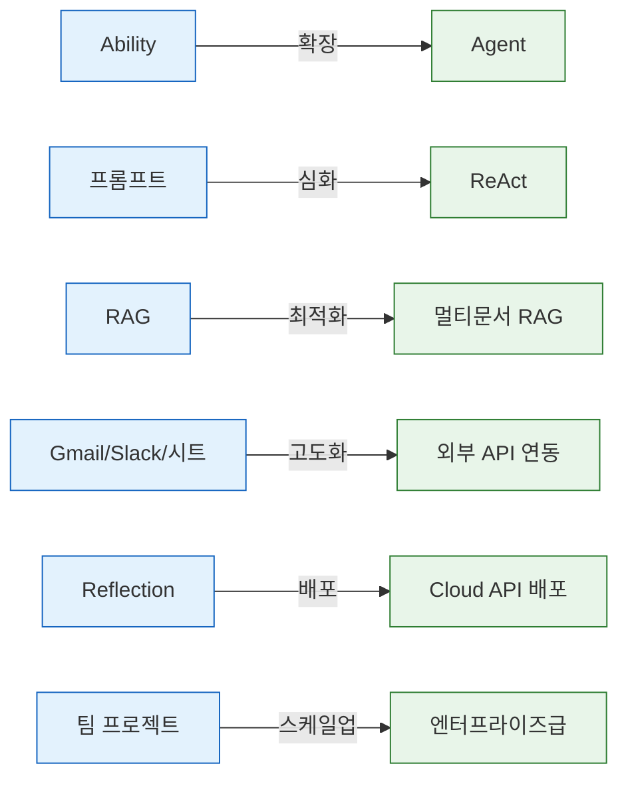
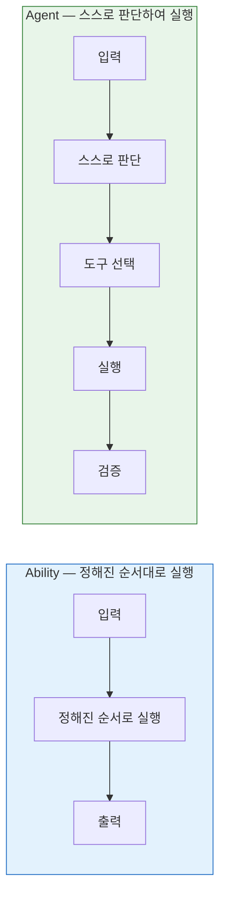

# Day 5 교안: 테스트, 발표, 수료

## 공통과정 | 2026-07-10 (금) | 09:00-19:00

---

## 일일 학습 목표

| 목표 | 설명 |
|------|------|
| 테스트 + 디버깅 | 다양한 시나리오로 Ability를 테스트하고 예외 처리를 완성한다 |
| 발표 준비 | 발표 자료를 준비하고 리허설을 진행한다 |
| 최종 발표 | 팀별 결과물을 발표하고 시연한다 |
| AI 윤리 토론 | AI 에이전트의 윤리적 사용에 대해 토론한다 |
| 수료 | 전체 과정을 회고하고 전문과정 브리지를 이해한다 |

---

# 13차시: [프로젝트] 테스트, 디버깅, UX 개선

## 09:00-12:00 (3시간)

---

### 09:00-09:10 | Daily Standup (10분)

오늘의 스탠딩 질문:
1. "어제 교차 해킹에서 발견된 가장 큰 문제는?"
2. "오늘 발표까지 꼭 해결할 것 한 가지?"

---

### 09:10-09:20 | Day4 복습 퀴즈 (10분)

> ✅ **마지막 퀴즈!**

| # | 문제 | 정답 |
|---|------|------|
| 1 | "지금 방식"과 "자동화 후"를 비교하는 분석법은? | As-Is/To-Be |
| 2 | 30분 단위로 목표-구현-공유하는 방식은? | 마이크로 스프린트 |
| 3 | 다른 팀 에이전트에 이상한 입력을 넣어보는 활동은? | 교차 해킹 챌린지 |
| 4 | Branch 노드에서 예상치 못한 입력을 처리하는 경로는? | Else (폴백) |
| 5 | 이번 주 배운 5가지 노드를 모두 말해보세요! | LLM, Python, Branch, Gmail, Slack (+ 시트, Knowledge) |

---

### 09:20-09:50 | 테스트 전략 가이드 (30분)

#### 테스트란?

> 💡 **쉬운 설명**: "우리 에이전트가 진짜로 잘 동작하는지 확인하는 것"입니다.

자동차를 만들면 도로 테스트를 하듯이, 에이전트도 다양한 상황에서 테스트해야 합니다.

#### 3가지 테스트 유형

| 유형 | 설명 | 비유 | 최소 수량 |
|------|------|------|----------|
| **정상 케이스** | 의도한 대로 입력 | 평탄한 도로에서 주행 | 3개 |
| **엣지 케이스** | 경계값, 극단적 입력 | 좁은 골목길에서 주행 | 2개 |
| **예외 케이스** | 잘못된/의도 밖 입력 | 공사 중인 도로에서 주행 | 2개 |

**예시**:

| 테스트 유형 | CS 봇 입력 예시 |
|------------|---------------|
| 정상 | "앱 사용법을 알고 싶어요" |
| 엣지 | 아주 긴 문장 (500자 이상) |
| 예외 | "오늘 점심 뭐 먹을까?" (관련 없는 질문) |

#### 테스트 기록 양식

| # | 테스트 시나리오 | 입력값 | 예상 결과 | 실제 결과 | 통과? | 조치 |
|---|---------------|--------|----------|----------|-------|------|
| 1 | 정상 기술 문의 | "앱이 안 열려요" | 기술지원 답변 | | | |
| 2 | 정상 결제 문의 | "환불해주세요" | 결제 안내 | | | |
| 3 | 엣지: 빈 입력 | (빈 칸) | 에러 안내 | | | |
| 4 | 예외: 영어 | "How are you?" | 한국어 안내 | | | |

#### UX 개선: 폴백(Fallback) 응답 추가

> 💡 **폴백이란?** 에이전트가 대응할 수 없는 상황에서 보여주는 "안전한 답변"입니다.

Branch의 Else 경로에 연결할 LLM 노드 — System Prompt:

```
사용자의 질문이 서비스 범위를 벗어났습니다.
다음과 같이 친절하게 안내하세요:

"죄송합니다. 해당 내용은 제가 도와드리기 어려운 영역입니다.
다음 중 해당하는 내용이 있으시면 다시 질문해 주세요:
1. 기술 지원 관련
2. 결제/환불 관련
3. 일반 문의

또는 고객센터(1588-xxxx)로 연락해 주시면
전문 상담원이 도움을 드리겠습니다."
```

---

### 09:50-12:00 | 마이크로 스프린트: 테스트 + 디버깅 (130분)

#### 스프린트 사이클 (30분 x 4회 + 정리 10분)

| 스프린트 | 시간 | 목표 |
|---------|------|------|
| **Sprint 9** | 09:50-10:20 | 테스트 시나리오 7개 이상 설계 + 정상 케이스 3개 테스트 |
| **Sprint 10** | 10:20-10:50 | 엣지/예외 케이스 테스트 + 발견된 버그 수정 |
| (쉬는 시간) | 10:50-11:00 | |
| **Sprint 11** | 11:00-11:30 | 폴백 응답 추가 + 프롬프트 최적화 |
| **Sprint 12** | 11:30-12:00 | 교차 테스트: 다른 팀 에이전트 사용해보고 피드백 |

#### 교차 테스트 피드백 양식

```
테스트한 팀: ___팀
테스터: ___

1. 첫인상 (사용하기 쉬운가?): ★★★★★
2. 정상 입력 처리: ★★★★★
3. 예외 처리 품질: ★★★★★
4. 좋았던 점:
5. 개선 제안:
```

---

# 14차시: [프로젝트] 최종 완성 + 발표 준비

## 13:00-16:00 (3시간)

---

### 13:00-13:15 | 오후 에너자이저 (15분)

> 💡 **"1분 발표 연습"**

1. 각 팀에서 한 명이 일어납니다
2. **1분 안에** 프로젝트를 소개합니다 (타이머 작동!)
3. 1분이 지나면 즉시 중단!
4. 전체 피드백: "더 추가하면 좋을 것" / "빼도 될 것"

(본격 발표 전에 워밍업하는 시간입니다!)

---

### 13:15-15:00 | 마이크로 스프린트: 최종 완성 + 발표 자료 (105분)

#### 스프린트 사이클

| 스프린트 | 시간 | 목표 |
|---------|------|------|
| **Sprint 13** | 13:15-13:45 | 교차 테스트 피드백 반영 + 최종 버그 수정 |
| **Sprint 14** | 13:45-14:15 | 전체 파이프라인 End-to-End 최종 확인 |
| **Sprint 15** | 14:15-14:45 | 발표 자료 작성 시작 |
| (쉬는 시간) | 14:45-15:00 | |

#### 발표 자료 구성 가이드 (10분 기준)

| 시간 | 내용 | 슬라이드 |
|------|------|---------|
| 0:00-1:30 | **문제 정의** | As-Is 상황 + "왜 자동화가 필요한가?" |
| 1:30-3:00 | **설계** | 워크플로우 흐름도 + 어떤 노드를 왜 선택했는지 |
| 3:00-7:00 | **라이브 시연** | 실제 Agentria 화면에서 동작 시연! |
| 7:00-8:30 | **결과 및 효과** | 정상/예외 테스트 결과 + 시간 절감 효과 |
| 8:30-10:00 | **배운 점 + 앞으로** | 어려웠던 점, 개선할 점, 전문과정 확장 아이디어 |

**시연 준비 체크리스트**:
- [ ] 시연용 입력 데이터 3세트 준비 (정상 1, 엣지 1, 예외 1)
- [ ] 시연 순서 리허설 1회 이상
- [ ] 네트워크 불안정 대비 스크린 녹화 백업
- [ ] 시연 담당자 + 발표 담당자 역할 분담

**비즈니스 가치 수치화 팁**:
```
예시:
- As-Is: 고객 문의 1건 처리에 평균 15분 소요
- To-Be: 에이전트 자동 처리 30초 + 사람 검토 2분 = 2.5분
- 효과: 건당 12.5분 절감, 하루 50건 기준 10시간+ 절감
```

> 💡 **Tip**: 숫자로 효과를 보여주면 발표가 더 설득력 있어요!

---

### 15:00-16:00 | 리허설 (60분)

#### 팀별 리허설 (팀당 15분)

1. **발표 연습** (10분): 실제 발표처럼 진행
2. **강사 피드백** (5분): 개선 포인트 제안

**리허설 체크포인트**:
- [ ] 10분 안에 끝나는가?
- [ ] 라이브 시연이 동작하는가?
- [ ] 모든 팀원이 역할이 있는가?
- [ ] 목소리가 충분히 크고 명확한가?

> 💡 **Tip**: 시연 중 에러가 나면 당황하지 마세요. "여기서 이런 에러가 발생할 수 있는데, 이렇게 해결했습니다"라고 말하면 오히려 좋은 발표가 됩니다!

---

# 15차시: 최종 발표 + AI 윤리 토론 + 수료

## 16:15-19:00 (2시간 45분)

---

### 16:15-17:45 | 최종 발표 (90분)

#### 진행 순서

- 팀당 **10분 발표** + **5분 Q&A** = 15분
- 발표 순서: 추첨 (강사가 제비뽑기)

#### 발표 평가 참여

**멘토 평가** (프로젝트 루브릭 기준):

| 평가 기준 (각 8점) | 점수 |
|---------------------|------|
| 문제 정의 | /8 |
| 설계 완성도 | /8 |
| 구현 품질 | /8 |
| 외부 연동 | /8 |
| 발표/시연 | /8 |
| **합계** | /40 |

**동료 평가** (팀 간 투표):
- 가장 인상 깊었던 팀에 투표

#### Q&A 가이드 질문 (멘토용)

1. "가장 어려웠던 기술적 문제는 무엇이었나요?"
2. "프롬프트를 몇 번 수정했고, 어떤 차이가 있었나요?"
3. "실제 업무에 도입한다면 추가로 필요한 기능은?"
4. "이 프로젝트를 전문과정에서 어떻게 확장할 수 있을까요?"

---

### 17:45-18:15 | AI 윤리 토론 (30분)

> 💡 **"AI가 대신해도 괜찮은 일 vs 안 되는 일"**

#### 토론 주제

이번 주에 여러분은 AI 에이전트가 자동으로 이메일을 보내고, 고객 문의에 답하고, 데이터를 기록하는 것을 만들었습니다. 그런데 생각해 봅시다:

**질문 1**: AI가 고객 응대를 대신하면, 고객은 그것이 AI인지 알아야 할까요?

| 입장 A: 알려야 한다 | 입장 B: 알릴 필요 없다 |
|---------------------|----------------------|
| 고객의 알 권리 | 서비스 품질이 같다면 상관없다 |
| 투명성이 신뢰를 만든다 | "AI입니다"라고 하면 불신할 수 있다 |

**질문 2**: AI가 잘못된 정보를 주고 고객이 피해를 입으면, 누구 책임인가요?
- AI를 만든 개발자?
- AI를 사용한 회사?
- AI 자체?

**질문 3**: AI 에이전트가 사람의 일자리를 대체할까요? 아니면 사람이 더 중요한 일에 집중하게 해줄까요?

#### 토론 진행 방법

1. 4-5명씩 그룹을 만듭니다
2. 위 질문 중 **하나를 선택**합니다
3. **5분간** 자유롭게 토론합니다
4. 그룹별로 **1분 발표**: "우리 그룹의 결론은 ___입니다"

> 💡 **정답은 없습니다.** 중요한 것은 이런 질문을 **생각해 보는 것** 자체입니다. AI를 만드는 사람은 이런 윤리적 책임에 대해 항상 고민해야 합니다.

---

### 18:15-18:45 | 시상 + 회고 + 전문과정 브리지 (30분)

#### 우수 프로젝트 시상 (10분)

| 상 | 기준 |
|----|------|
| 최우수 기획상 | 문제 정의와 설계가 가장 탁월한 팀 |
| 기술 구현상 | 가장 안정적이고 완성도 높은 구현 |
| 창의성상 | 가장 독창적인 아이디어와 접근 |

> 💡 모든 팀에게 박수! 5일간 열심히 달려온 여러분 모두가 수상자입니다.

#### 전체 회고 (10분)

한 사람씩 돌아가며 한 마디: **"이번 과정에서 가장 인상 깊었던 것"**

#### 전문과정 브리지 (10분)

##### 공통과정에서 배운 것 vs 전문과정에서 배울 것



##### Ability vs Agent 미리보기



**전문과정에서 다룰 핵심 기술**:
1. **ReAct 노드**: AI가 스스로 "어떤 도구를 쓸지" 판단
2. **에이전트 메모리**: 이전 대화를 기억하는 챗봇
3. **외부 API 연동**: 날씨, 뉴스 등 실시간 데이터 활용
4. **Cloud API 배포**: 만든 에이전트를 서비스로 공개
5. **모델 비교 실험**: GPT vs Gemini 성능/비용 비교

> 💡 **동기 부여**: "공통과정에서 만든 Ability는 전문과정에서 Agent의 '도구'로 활용됩니다. 여러분이 만든 CS 응답 Ability를 Agent가 스스로 판단하여 호출하는 것을 경험하게 될 겁니다."

---

### 18:45-19:00 | 수료 안내 (15분)

#### 수료 체크리스트

- [ ] 출석 확인 (5일간)
- [ ] Daily 미니과제 4회 제출 확인
- [ ] 최종 팀 프로젝트 발표 완료
- [ ] 동료 평가 제출

#### 수료증 배부

축하합니다! 5일간의 Agentria AI Agent 공통과정을 수료하셨습니다.

#### 전문과정 안내

- **일정**: 7/13(월) ~ 7/17(금)
- **내용**: Ability → Agent 확장, ReAct, 멀티 RAG, API 배포
- **사전 과제**:
  - 공통과정에서 만든 프로젝트 정리 (스크린샷 포함)
  - 전문과정 사전 읽기 자료 확인

> 💡 **마지막 한 마디**: 여러분은 이번 주에 **코딩 없이** AI 에이전트를 만들 수 있다는 것을 증명했습니다. 프롬프트를 쓰고, 노드를 연결하고, 이메일을 자동 발송하고, 문서 기반 Q&A를 만들었어요. 이것은 시작에 불과합니다. 전문과정에서 더 깊이 있는 내용을 배우게 될 겁니다. 수고하셨습니다!

---

## Day 5 핵심 정리

| 시간 | 배운 것 | 한줄 요약 |
|------|---------|----------|
| 13차시 오전 | 테스트 + 디버깅 | "다양한 입력으로 테스트해야 튼튼한 에이전트가 된다" |
| 14차시 오후 | 발표 준비 + 리허설 | "좋은 발표 = 문제 정의 + 라이브 시연 + 효과 수치화" |
| 15차시 저녁 | 최종 발표 + AI 윤리 | "AI를 만드는 사람은 윤리적 책임도 함께 진다" |

---

## Day 5 준비물 체크리스트 (강사용)

- [ ] 프로젝트 루브릭 평가지 (팀 수 x 평가자 수)
- [ ] 동료 평가 양식
- [ ] 교차 테스트 피드백 양식
- [ ] 시상 준비 (상장/상품)
- [ ] 수료증
- [ ] 전문과정 안내 자료
- [ ] 프로젝터/화면 공유 + 타이머 준비
- [ ] AI 윤리 토론 질문 카드 (그룹당 1세트)
- [ ] 제비뽑기 용품 (발표 순서 추첨)
