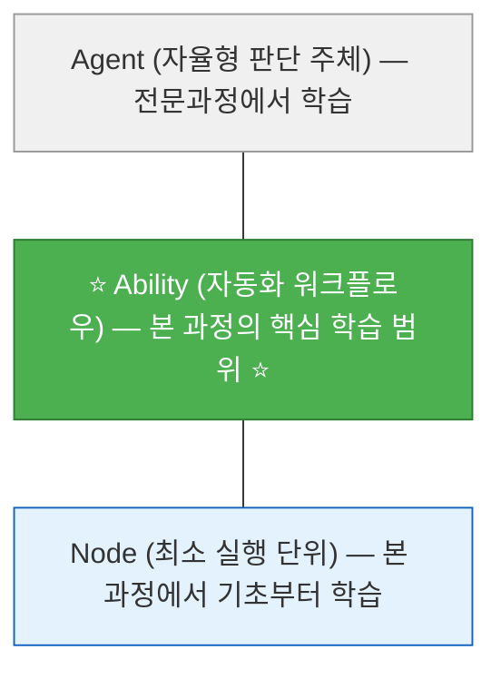

# 수업계획서 (Syllabus)

## [공통] Agentria 기반 AI Ability 워크플로우 설계와 구축

---

## 1. 과정 정보

| 항목 | 내용 |
|------|------|
| **과정명** | Agentria 기반 AI Ability 워크플로우 설계와 구축 |
| **과정 구분** | 공통과정 |
| **교육 기간** | 2026년 7월 6일(월) ~ 7월 10일(금), 5일간 |
| **교육 시간** | 45시간 (1일 9시간 x 5일) |
| **학점** | 3학점 |
| **강의 유형** | ABL (Activity-Based Learning, 실습 중심 학습) |
| **교육 대상** | 대학교 3-4학년 (전공 무관, 프로그래밍 경험 불필요) |
| **난이도** | 입문~중급 (비전공자도 따라할 수 있는 단계별 학습) |
| **교육 장소** | 오프라인 실습실 |
| **필요 장비** | 1인 1PC (인터넷 연결), Agentria 계정, Google 계정 |

---

## 2. 과정 개요

본 과정은 **프로그래밍 경험이 없어도** 누구나 따라할 수 있는 AI 에이전트 입문 교육입니다. Agentria라는 노코드(No-Code) 플랫폼에서 마우스 클릭과 드래그만으로 **AI 자동화 워크플로우(Ability)**를 만드는 방법을 배웁니다.

"AI란 무엇인가?"부터 시작하여, 프롬프트 작성법, 외부 서비스(이메일, 시트) 연동, 문서 기반 Q&A(RAG)까지 핵심 기술을 **하나씩 천천히** 익힙니다. 최종적으로 팀 프로젝트를 통해 실제 업무 문제를 자동화하는 Ability를 완성하고 발표합니다.

> 💡 **비전공자 여러분, 걱정 마세요!** 모든 실습은 "따라하기" 방식으로 진행됩니다. 코드를 직접 작성할 일은 없고, 강사가 제공하는 코드를 복사-붙여넣기하면 됩니다.

### Agentria 3계층 중 본 과정의 위치

---

## 3. 교육 목표

본 과정을 이수한 수강생은 다음을 수행할 수 있다:

1. **AI와 AI 에이전트의 개념**을 일상 언어로 설명할 수 있다 (LLM이란?, 프롬프트란?, API란?).
2. **프롬프트 엔지니어링 기법**(역할 설정, 출력형식, 단계적 사고, 예시 제공)을 적용하여 원하는 결과를 AI에게서 이끌어낼 수 있다.
3. **Agentria 플랫폼**에서 노드를 연결하여 자동화 워크플로우(Ability)를 만들 수 있다.
4. **조건 분기(Branch 노드)**를 활용하여 "만약 ~이면 A, 아니면 B" 로직을 구현할 수 있다.
5. **Gmail, Slack, Google Sheets** 등 외부 서비스를 연동하여 알림/기록 자동화를 구성할 수 있다.
6. **RAG 기반 지식베이스**를 구축하여 "우리 회사 문서를 읽고 답변하는 AI"를 만들 수 있다.
7. **Reflection(자기 검증) 패턴**을 이해하고, AI가 스스로 결과를 점검하는 흐름을 구성할 수 있다.
8. **팀 PBL 프로젝트**를 통해 실제 업무 문제를 자동화하는 Ability를 완성하고 발표할 수 있다.

---

## 4. 사전 요구사항

| 항목 | 필수/권장 | 설명 |
|------|----------|------|
| 컴퓨터 기본 조작 | 필수 | 인터넷 검색, 복사-붙여넣기, 파일 다운로드가 가능한 수준 |
| Agentria 계정 | 필수 | 사전 가입 및 로그인 테스트 완료 |
| Google 계정 | 필수 | Gmail 사용 가능한 계정 |
| Google Cloud OAuth | 필수 | 사전 설정 완료 (별도 가이드 배포, 강사 도움 가능) |
| 프로그래밍 경험 | 불필요 | Python 코드는 복사-붙여넣기만 합니다 |
| AI/ML 기초 지식 | 불필요 | 수업에서 처음부터 설명합니다 |

> 💡 **Tip**: Python, API, JSON 등 기술 용어를 몰라도 괜찮습니다. 수업 중에 일상적인 비유와 함께 하나씩 설명합니다.

---

## 5. 일일 운영 시간표

| 시간 | 구분 | 내용 |
|------|------|------|
| 09:00-09:10 | Daily Standup | 어제 배운 것, 오늘 목표, 막히는 점 공유 |
| 09:10-09:20 | 전일 복습 퀴즈 | Kahoot! 스타일 퀴즈 (Day1은 아이스브레이커) |
| 09:20-12:00 | **오전 세션** (차시 1) | 개념 설명 + 핵심 따라하기 실습 |
| 12:00-13:00 | 점심 | - |
| 13:00-13:15 | 오후 에너자이저 | 점심 후 머리 깨우기 활동 |
| 13:15-16:00 | **오후 세션 A** (차시 2) | 응용 실습 + 게임/대결 요소 |
| 16:00-16:15 | 쉬는 시간 | - |
| 16:15-18:30 | **오후 세션 B** (차시 3) | 팀 활동 / 프로젝트 / 챌린지 |
| 18:30-18:45 | TIL 카드 작성 | Today I Learned 1인 1문장 공유 |
| 18:45-19:00 | Daily 미니과제 + 내일 예고 | 과제 안내 및 다음날 학습 소개 |

---

## 6. 상세 교육 일정

### Day 1 (7/6 월) — AI 에이전트 입문과 프롬프트 엔지니어링

| 차시 | 시간 | 주제 | 학습 목표 | 학습 활동 |
|------|------|------|-----------|-----------|
| 1 | 09:00-12:00 | **AI 에이전트란 무엇인가? + Agentria 첫 걸음** | AI, LLM, 에이전트 개념을 이해하고 Agentria에서 첫 번째 Ability를 만든다 | [아이스브레이커 30분] Speed Networking / [개념 60분] AI란? LLM이란? 에이전트란? 일상 비유로 이해하기 / [따라하기 실습 90분] Agentria 가입, 화면 탐색, Start-LLM-End 첫 Ability 완성 |
| 2 | 13:00-16:00 | **프롬프트 엔지니어링: AI에게 말 잘 하는 법** | 역할 설정, 출력형식, 단계적 사고, 예시 제공 기법으로 AI 출력 품질을 높인다 | [개념 50분] 프롬프트 4대 기법을 일상 비유로 배우기 / [따라하기 실습 100분] 동일 질문에 프롬프트 변형 실험, 회의록 요약 에이전트 완성 |
| 3 | 16:15-19:00 | **Reflection 패턴 입문 + 프롬프트 A/B 테스트** | AI가 스스로 결과를 점검하는 Reflection 패턴을 이해하고, Bulk Run으로 프롬프트를 정량 비교한다 | [개념 20분] Reflection 패턴이란? / [실습 45분] LLM-검증LLM-개선 루프 만들기 / [실습 50분] Bulk Run으로 프롬프트 A/B/C 테스트 / [공유 20분] 최적 프롬프트 발표 / TIL + 미니과제 |

### Day 2 (7/7 화) — 데이터 처리와 외부 서비스 연동

| 차시 | 시간 | 주제 | 학습 목표 | 학습 활동 |
|------|------|------|-----------|-----------|
| 4 | 09:00-12:00 | **텍스트 분류 + Python 노드 입문** | LLM 기반 텍스트 분류와 Python 노드(복사-붙여넣기)를 결합한 파이프라인을 구성한다 | [복습 퀴즈 10분] / [개념 50분] LLM 분류 설계, Python 노드란?, JSON이란? / [따라하기 실습 120분] 고객 리뷰 자동 분류 Ability 완성 |
| 5 | 13:00-16:00 | **조건 분기 + 분류 정확도 대결** | Branch 노드로 "만약 ~이면" 분기 로직을 만들고, 팀 대결로 분류 정확도를 겨룬다 | [개념 30분] Branch 노드 = "만약~이면" / [따라하기 실습 90분] CS 문의 3경로 분기 에이전트 / [대결 30분] 분류 정확도 대결: 같은 입력, 최고 프롬프트가 이긴다! |
| 6 | 16:15-19:00 | **외부 서비스 연동: Gmail + Slack + 트러블슈팅** | Gmail/Slack을 연동하고, 연동 오류 발생 시 대처법을 익힌다 | [따라하기 실습 75분] Gmail 자동 메일 발송 Ability / [따라하기 실습 45분] Slack 채널 알림 / [트러블슈팅 가이드 30분] OAuth 오류, 크리덴셜 문제 해결법 / TIL + 미니과제 |

### Day 3 (7/8 수) — RAG와 통합 파이프라인

| 차시 | 시간 | 주제 | 학습 목표 | 학습 활동 |
|------|------|------|-----------|-----------|
| 7 | 09:00-12:00 | **RAG: AI에게 우리 문서를 읽게 하자** | 문서를 업로드하여 RAG 기반 Q&A Ability를 만들고 할루시네이션을 억제한다 | [복습 퀴즈 10분] / [개념 40분] RAG란? = 오픈북 시험, 할루시네이션이란? / [따라하기 실습 120분] PDF 업로드, Knowledge 노드 연결, Q&A 봇 완성, 일반 AI vs RAG 비교 체험 |
| 8 | 13:00-16:00 | **구글 시트 연동 + 통합 파이프라인** | 구글 시트 Read/Write를 연동하고 Day1~3 기술을 모두 합친 통합 파이프라인을 완성한다 | [개념 30분] 구글 시트 노드란? / [따라하기 실습 90분] 시트 Write(자동 기록) / [따라하기 실습 45분] 분류-시트저장-분기-이메일알림 통합 파이프라인 |
| 9 | 16:15-19:00 | **미니 해커톤** | Day1~8 기술을 자유 조합하여 팀별 미니 Ability를 완성하고 시연한다 | [브레인스토밍 15분] / [해커톤 구현 60분] 2-3인 팀, 최소 3개 노드 조합 / [시연 + 투표 + 시상 30분] / TIL + 미니과제 |

### Day 4 (7/9 목) — 팀 PBL 프로젝트

| 차시 | 시간 | 주제 | 학습 목표 | 학습 활동 |
|------|------|------|-----------|-----------|
| 10 | 09:00-12:00 | **팀 PBL 기획 + 업무 분석** | 팀을 구성하고 자동화 대상 업무를 분석하여 설계안을 완성한다 | [복습 퀴즈 10분] / [개념 40분] As-Is/To-Be 분석, 자동화 적합 업무 고르기 / [팀 활동 120분] 팀 빌딩, 아이디어 선정, 흐름도 스케치, 기획 발표 |
| 11 | 13:00-16:00 | **[프로젝트] 1차 구현: 핵심 Ability 완성** | 설계안 기반으로 핵심 동작을 구현하고 테스트한다 | [마이크로 스프린트 x 6] 30분 사이클(5분 계획 + 20분 구현 + 5분 스탠딩 데모) / [멘토링] 실시간 순회 코칭 |
| 12 | 16:15-19:00 | **[프로젝트] 외부 연동 + 교차 해킹 챌린지** | 외부 서비스를 추가하고, 다른 팀의 에이전트에 예외 입력을 시도한다 | [마이크로 스프린트 x 3] 외부 연동 구현 / [교차 해킹 챌린지 30분] 다른 팀 에이전트 깨뜨리기 시도 / TIL + 미니과제 |

### Day 5 (7/10 금) — 테스트, 발표, 수료

| 차시 | 시간 | 주제 | 학습 목표 | 학습 활동 |
|------|------|------|-----------|-----------|
| 13 | 09:00-12:00 | **[프로젝트] 테스트, 디버깅, UX 개선** | 다양한 시나리오로 테스트하고 예외 처리를 추가한다 | [복습 퀴즈 10분] / [마이크로 스프린트 x 5] 테스트 시나리오 설계, 실행, 버그 수정, 교차 테스트 |
| 14 | 13:00-16:00 | **[프로젝트] 최종 완성 + 발표 준비** | 최종 점검과 발표 자료를 준비한다 | [마이크로 스프린트 x 3] 최종 버그 수정 + 발표 자료 작성 / [리허설 45분] 시연 연습 |
| 15 | 16:15-19:00 | **최종 발표 + AI 윤리 토론 + 수료** | 팀별 결과물을 발표하고 AI 윤리를 토론한다 | [발표 90분] 팀당 10분 시연 + 5분 Q&A / [AI 윤리 토론 30분] "AI가 대신해도 괜찮은 일 vs 안 되는 일" / [시상 + 회고 + 전문과정 브리지 30분] |

---

## 7. 평가 기준

### 7.1 배점 구성

| 평가 항목 | 배점 | 평가 방법 |
|-----------|------|-----------|
| 출석 및 참여 | 10% | 일별 출석 + 수업 참여도 (퀴즈, 발표, 토론) |
| Daily 미니과제 (4회) | 20% | 매일 Wrap-up 시간에 제출 (5점 x 4회) |
| 개인 미니 Ability (Day3 해커톤) | 20% | 9차시 미니 해커톤 산출물 |
| 최종 팀 프로젝트 | 40% | 기획서 + 구현 + 발표 종합 (아래 루브릭 참조) |
| 동료 평가 | 10% | 팀 내 기여도 상호 평가 |
| **합계** | **100%** | |

### 7.2 최종 프로젝트 루브릭

| 평가 기준 (각 8점) | 상 (7-8점) | 중 (4-6점) | 하 (1-3점) |
|---------------------|-----------|-----------|-----------|
| **문제 정의** | 구체적 업무 문제 + 자동화 타당성 근거 제시 | 문제는 정의했으나 근거 약함 | 문제 정의 모호 |
| **설계 완성도** | 입력-처리-출력 완전 + 예외 경로 포함 | 기본 흐름 있으나 예외 처리 미흡 | 흐름도 불완전 |
| **구현 품질** | 5개+ 노드, 정상 동작, 프롬프트 최적화 | 3-4개 노드, 대부분 동작 | 2개 이하, 오류 다수 |
| **외부 연동** | 2개+ 서비스 정상 연동 | 1개 서비스 연동 | 연동 미시도 |
| **발표/시연** | 라이브 시연 성공 + 비즈니스 가치 설명 | 시연 성공 + 기본 설명 | 시연 실패 |

### 7.3 성적 등급

| 등급 | 점수 범위 | 기준 |
|------|----------|------|
| A+ | 95-100 | 탁월한 프로젝트 + 전 과정 적극 참여 |
| A | 90-94 | 우수한 프로젝트 + 높은 참여도 |
| B+ | 85-89 | 양호한 프로젝트 + 성실한 참여 |
| B | 80-84 | 기본 요구사항 충족 |
| C+ | 75-79 | 일부 요구사항 미달 |
| C | 70-74 | 다수 요구사항 미달 |
| F | 70 미만 | 과제 미제출 또는 출석 미달 |

---

## 8. 사전 준비 체크리스트 (수강생용)

수업 시작 **1주 전까지** 다음을 완료해 주세요:

- [ ] **Agentria 계정 가입**: [agentria.ai](https://agentria.ai) 접속 - 회원가입 - 로그인 확인
- [ ] **Google Cloud OAuth 설정**: 별도 배포된 가이드에 따라 Client ID, Client Secret 생성 완료
- [ ] **Gmail 테스트**: 실습용 Gmail 계정 로그인 확인
- [ ] **Slack 워크스페이스 가입**: 교육용 Slack 워크스페이스 초대 링크로 가입
- [ ] **Chrome 브라우저**: 최신 버전 설치

> 💡 **Tip**: OAuth 설정이 어려우시면 걱정하지 마세요. 수업 첫날 오전에 강사가 도와드립니다.

> ⚠️ **주의**: 위 준비사항 중 막히는 것이 있으면 사전에 교육 담당자에게 연락해 주세요. 수업 시작 전에 해결하면 실습 시간을 아낄 수 있습니다.

---

## 9. 참고 자료

### 공식 문서
- Agentria 공식 문서: https://agentria.ai/docs/about-agentria-ko
- Agentria Ability 가이드: https://agentria.ai/docs/ability-guide-ko
- Agentria 3-Step Core: https://agentria.ai/docs/3step-core-ko

### 핵심 개념
- Agentria Key Concepts: https://agentria.ai/docs/key-concepts-ko
- Node 가이드: https://agentria.ai/docs/node-ko
- Storage/RAG: https://agentria.ai/docs/storage-ko

### 노드별 가이드
- LLM 노드: https://agentria.ai/docs/llm-node-ko
- Python 노드: https://agentria.ai/docs/python-node-ko
- Branch 노드: https://agentria.ai/docs/branch-node-ko
- Gmail 노드: https://agentria.ai/docs/gmail-node-ko
- Slack 노드: https://agentria.ai/docs/slack-node-ko

### 크리덴셜 설정
- Google 크리덴셜: https://agentria.ai/docs/google-credential-ko
- Slack 크리덴셜: https://agentria.ai/docs/slack-credential-ko

---

## 10. 강사 정보

| 항목 | 내용 |
|------|------|
| **강사명** | (TBD) |
| **소속** | (TBD) |
| **연락처** | (TBD) |
| **오피스 아워** | 매일 점심시간 12:00-13:00 (개별 질문 가능) |

---

> **본 수업계획서는 교육 진행 상황에 따라 일부 내용이 조정될 수 있습니다.**
