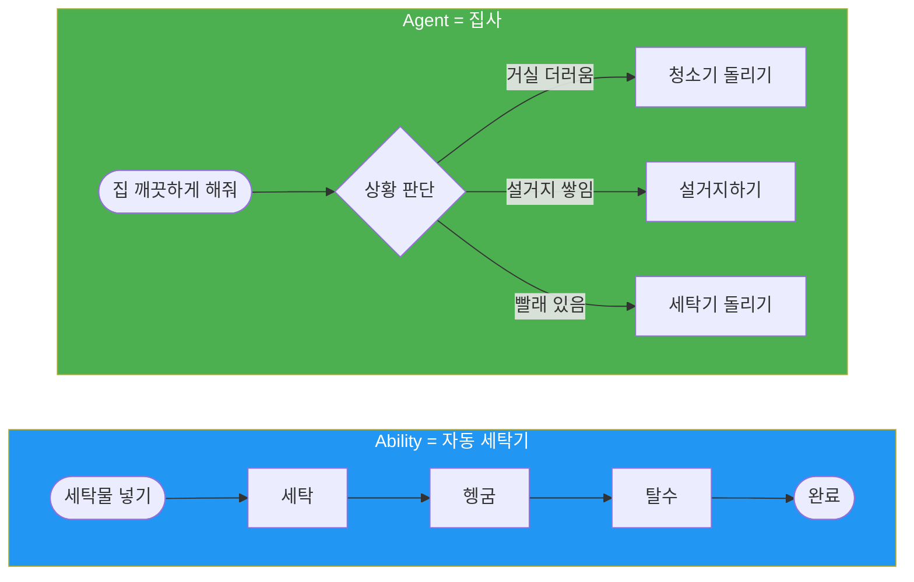
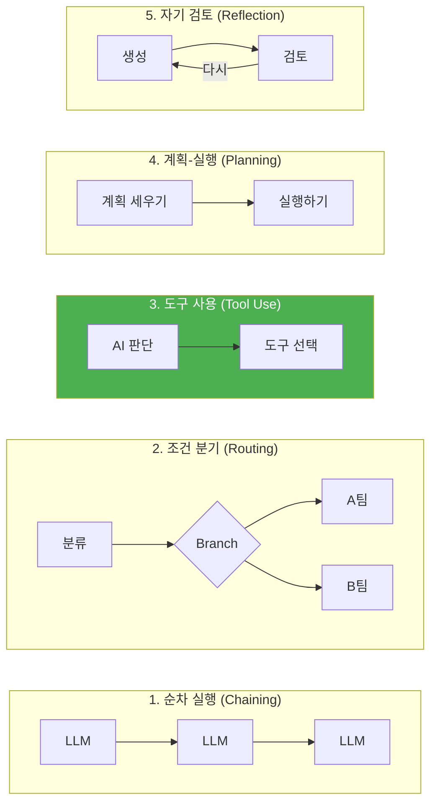
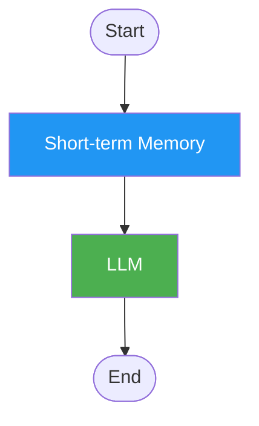
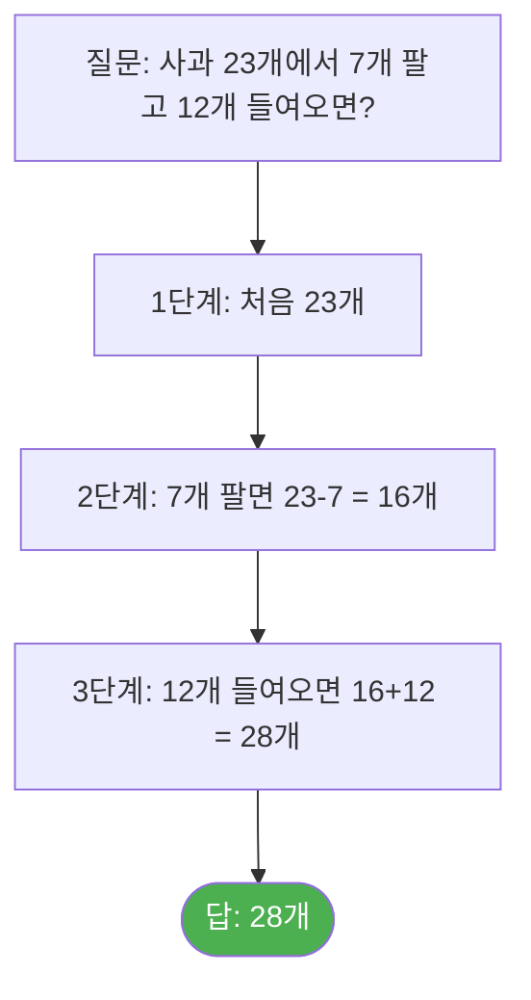
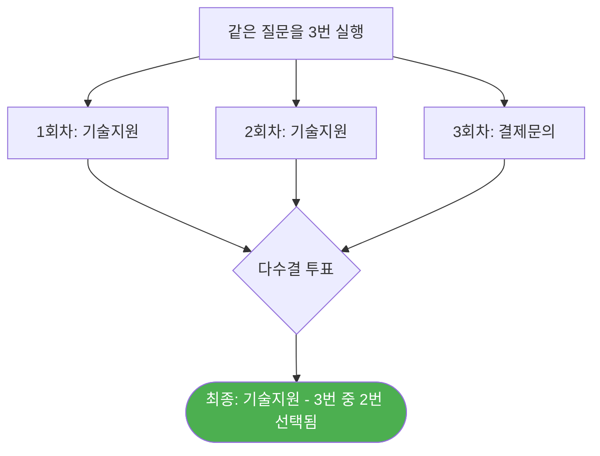
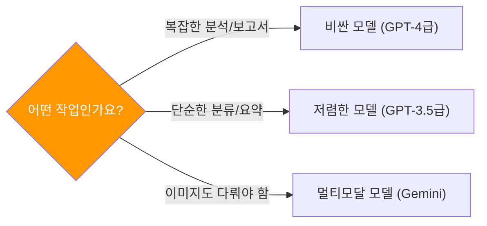
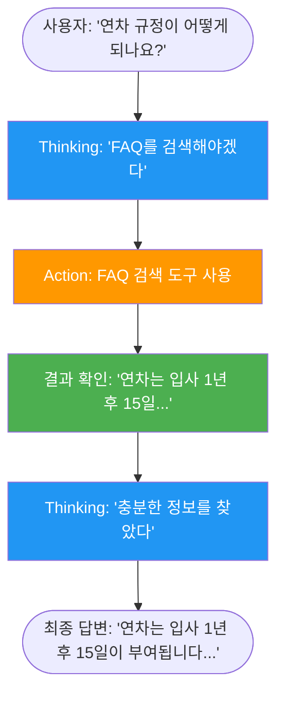
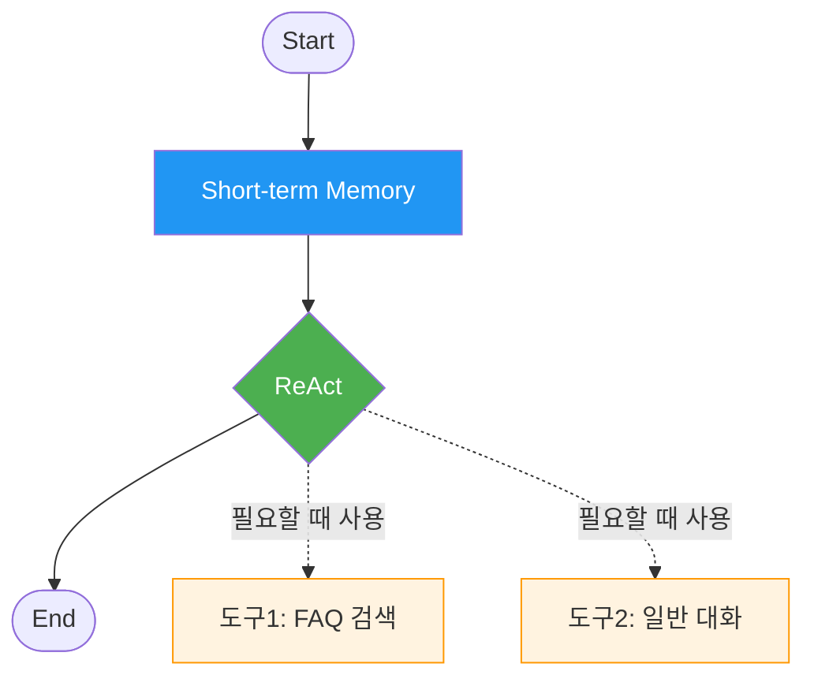
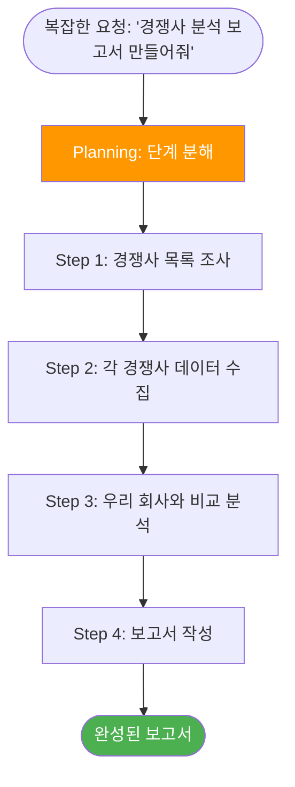

# Day 1 교안: Agent 아키텍처와 자율형 에이전트 기초
{: .no_toc }

## 전문과정 | 09:00-19:00 (9시간)
{: .no_toc }

---

## 일일 학습 목표

| 목표 | 핵심 키워드 |
|------|------------|
| 공통과정에서 배운 Ability와 새롭게 배울 Agent의 차이를 이해한다 | Ability vs Agent |
| 프롬프트 기법을 실습하고 모델별 차이를 체험한다 | CoT, 모델 비교 |
| ReAct 노드로 AI가 스스로 판단하는 에이전트를 만든다 | ReAct, 도구 선택 |
| Planning 패턴으로 복잡한 작업을 단계별로 분해한다 | Planning, 단계 분해 |

---

# 1차시: 공통과정 복습 + Ability vs Agent

## 09:00-12:00 (3시간)

---

### 09:00-09:10 Daily Standup (10분)

1. 한 줄 자기소개 (이름, 전공, 공통과정에서 만든 프로젝트)
2. 전문과정에서 기대하는 것 한 가지

---

### 09:10-09:40 Ability vs Agent 차이 이해하기 (30분)

**쉬운 비유로 시작합시다**

공통과정에서 여러분은 **Ability**를 만들었습니다. Ability는 **자동 세탁기**와 같습니다. 세탁 코스를 정해 놓으면 그 순서대로 빨래를 해줍니다.

오늘부터 배울 **Agent**는 **집사**와 같습니다. "집을 깨끗하게 해줘"라고 말하면, 상황을 보고 알아서 판단합니다.



| 비교 항목 | Ability (자동 세탁기) | Agent (집사) |
|-----------|---------------------|-------------|
| **만드는 곳** | Ability 컴포저 | Agent 컴포저 |
| **실행 방식** | 정해진 순서대로 실행 | 상황을 보고 스스로 판단 |
| **흐름 제어** | 우리가 Branch로 설계 | AI가 알아서 결정 |
| **기억력** | 없음 (매번 새로 시작) | 대화를 기억할 수 있음 |
| **사용 방식** | 1회 호출 (입력 → 결과) | 채팅 (대화형, 연속) |
| **잘하는 일** | 반복되는 정해진 업무 | 복잡한 질문, 상담 |

**강사 라이브 데모**: 같은 "FAQ 검색 → 답변" 기능을 Ability와 Agent로 각각 보여줍니다.

> ✅ **체크포인트**: "Ability는 정해진 순서, Agent는 상황 판단" — 이 차이가 느껴지시나요?

---

### 09:40-09:55 쉬는시간

---

### 09:55-10:20 AI 에이전트 생태계 간단 소개 (25분)

#### 도구 유형 비교

| 구분 | 예시 | 특징 | 우리 수업 |
|------|------|------|----------|
| **No-Code** | **Agentria** | 코딩 없이 화면에서 클릭으로 | 여기에 집중! |
| **Low-Code** | LangGraph 등 | 약간의 코딩 필요 | 참고만 |
| **Full Code** | LangChain, CrewAI | 전부 코딩 | 참고만 |

> 💡 **Tip**: Agentria에서 배운 개념이 코드 프레임워크에서도 그대로 쓰입니다!

#### 에이전트 패턴 5가지 (그림으로 보기)



- **패턴 1, 2**: 공통과정에서 이미 해봤어요! (LLM 연결, Branch 노드)
- **패턴 3**: 오늘 배울 **ReAct**가 바로 이것!
- **패턴 4**: 오늘 후반에 배울 **Planning 패턴**
- **패턴 5**: Day3에서 배울 **Reflection 패턴**

---

### 10:20-11:20 [따라하기] Agent 컴포저로 첫 에이전트 만들기 (60분)

#### Ability 컴포저 vs Agent 컴포저 차이

| 항목 | Ability 컴포저 | Agent 컴포저 |
|------|---------------|-------------|
| Start 노드 | 입력값 정의 | 대화 시작 |
| 사용 가능 노드 | LLM, Branch, Python 등 | 위 전부 + **Short-term Memory**, **ReAct** |
| 테스트 방식 | Run 버튼 (1회 실행) | **채팅창** (대화형) |

#### Step-by-Step: "대화를 기억하는 챗봇" 만들기



**Step 1**: 새 프로젝트 → **Agent 컴포저** 선택 → 이름: "나의 첫 에이전트"

**Step 2**: Short-term Memory 노드 추가 → 메시지 윈도우: `10`

> 💡 **Short-term Memory란?** 사람도 방금 한 대화는 기억하지만, 1년 전 대화는 잊죠? 이 노드를 넣으면 AI가 **최근 대화를 기억**합니다. 숫자 10은 "최근 10개의 주고받은 말을 기억해"라는 뜻입니다.

**Step 3**: LLM 노드 추가, System Prompt 입력:

```
당신은 친절한 대화 상대입니다.
사용자와 자연스럽게 대화하세요.
이전 대화 내용을 기억하고 활용하세요.
```

chat_histories 입력에 Short-term Memory 출력 연결

**Step 4**: End 노드 연결

**Step 5**: 테스트!

```
나: "안녕하세요! 저는 민지예요."
AI: "안녕하세요 민지님! 반갑습니다 :)"

나: "제가 좋아하는 음식은 떡볶이예요."
AI: "떡볶이 좋아하시는군요!"

나: "아까 제 이름이 뭐라고 했죠?"
AI: "민지님이라고 하셨어요!"  ← 기억합니다!
```

> ✅ **체크포인트**: AI가 이름과 좋아하는 음식을 기억하나요? 기억한다면 성공!

> ⚠️ **주의**: Ability로 만든 챗봇은 이전 대화를 기억하지 못합니다. Agent + Memory 조합이기에 가능한 기능입니다.

---

### 11:20-11:35 Ability vs Agent 동작 비교 체험 (15분)

| 테스트 | Ability (공통과정) | Agent (방금 만든 것) |
|--------|-------------------|---------------------|
| "안녕하세요" 인사 | 정해진 대로 응답 | 자연스럽게 인사 |
| 이름 말한 후 "내 이름 뭐였지?" | 기억 못 함 | 기억함! |
| 같은 질문을 두 번 하면 | 똑같은 답변 | 맥락에 맞게 다른 답변 |

---

### 11:35-12:00 Ability vs Agent 비교 실습 (25분)

**동일 FAQ 봇을 Ability와 Agent로 각각 만들고, 질문 5개로 비교합니다.**

| 질문 | Ability 답변 | Agent 답변 | 차이점 |
|------|-------------|-----------|--------|
| 정상 FAQ 질문 | | | |
| 후속 질문 (맥락 필요) | | | |
| FAQ에 없는 질문 | | | |
| 복합 질문 (2가지 주제) | | | |
| 잡담/인사 | | | |

> 💡 **핵심 발견**: Agent는 대화 맥락을 유지하고, 도구 사용 여부를 스스로 판단합니다.

---

# 2차시: 프롬프트 기법 + 모델 비교

## 13:00-16:00 (3시간)

---

### 13:00-13:15 오후 에너자이저 (15분)

**"AI에게 그림 설명하기" 게임**: 강사가 간단한 그림을 보여주면, 수강생들이 텍스트로 설명을 작성합니다. 그 설명을 LLM에 넣어서 원본과 비교하며 "프롬프트를 잘 쓰는 것"의 중요성을 체험합니다.

---

### 13:15-13:45 프롬프트 핵심 기법 (30분)

#### Chain-of-Thought: "단계별로 생각해 봅시다"

공통과정에서 배운 것을 한 단계 더 깊이 있게 살펴봅니다.



> 💡 **Tip**: 프롬프트 끝에 **"단계별로 생각해 봅시다"** 한 줄만 추가해도 분석 품질이 크게 향상됩니다!

#### Self-Consistency: "3번 물어보고 다수결"

같은 질문을 여러 번 물어보고 가장 많이 나온 답을 선택하는 방법입니다. 길을 물어볼 때 **세 명에게 물어보고 다수결**을 따르는 것과 같습니다.



---

### 13:45-14:30 [따라하기] 프롬프트 최적화 실습 (45분)

**동일 질문으로 기본/CoT/Few-shot 비교**

**실험 1 (기본)**: `고객 문의를 분류하세요: 기술지원, 결제, 배송, 일반`

**실험 2 (CoT)**: 위 + `다음 순서로 생각하세요: 1. 핵심 키워드 찾기 2. 카테고리 검토 3. 최적 선택`

**실험 3 (Few-shot)**: 위 + 예시 4개 제공

#### Bulk Run으로 10개 입력 일괄 테스트

| 번호 | 문의 내용 | 정답 |
|------|----------|------|
| 1 | "비밀번호를 잊어버렸어요" | 기술지원 |
| 2 | "환불 처리 해주세요" | 결제 |
| 3 | "배송 추적 번호 알려주세요" | 배송 |
| 4 | "제품 종류가 궁금해요" | 일반 |
| 5 | "앱이 자꾸 꺼져요" | 기술지원 |
| 6 | "이중 결제가 된 것 같아요" | 결제 |
| 7 | "해외 배송도 되나요?" | 배송 |
| 8 | "영업시간이 언제예요?" | 일반 |
| 9 | "화면이 안 나와요" | 기술지원 |
| 10 | "카드 변경하고 싶어요" | 결제 |

**결과 비교**:

| 프롬프트 유형 | 정답률 (/10) | 특이사항 |
|-------------|-------------|---------|
| 기본 | /10 | |
| CoT | /10 | |
| Few-shot | /10 | |

> ✅ **체크포인트**: 어떤 프롬프트가 가장 정확한가요? 옆 사람과 이야기해 보세요.

---

### 14:30-14:45 쉬는시간

---

### 14:45-15:30 모델 비교 체험 (45분)

#### "빠르지만 비싼 모델 vs 느리지만 저렴한 모델"

> **쉬운 설명**: AI 모델을 고르는 것은 **택시 vs 버스**를 고르는 것과 비슷합니다.

| 비유 | 모델 | 특징 | 언제 쓸까? |
|------|------|------|-----------|
| 택시 (비싸지만 정확) | GPT-4급 | 복잡한 분석 가능 | 중요한 보고서 |
| 버스 (저렴하지만 충분) | GPT-3.5급 | 간단한 작업 빠름 | 단순 분류/요약 |
| 자가용 (중간) | Gemini 계열 | 균형잡힌 성능 | 범용 작업 |

**[따라하기]** LLM 노드의 모델을 바꿔가며 같은 질문 실행:

```
다음 고객 리뷰를 분석하고, 감정(긍정/부정/중립)과 핵심 키워드 3개를 추출하세요.

리뷰: "배송은 빨랐는데 포장이 좀 아쉬웠어요. 제품 자체는 만족스럽습니다."
```

| 평가 항목 | GPT-4 | GPT-3.5 | Gemini |
|-----------|-------|---------|--------|
| 감정 분류 정확도 | | | |
| 키워드 추출 품질 | | | |
| 응답 속도 (체감) | | | |

> ⚠️ **주의**: 비싼 모델이 항상 좋은 것은 아닙니다! 단순한 작업에는 저렴한 모델이 더 효율적입니다.

---

### 15:30-16:00 비용 이해 + 모델 선택 가이드 (30분)

| 모델 | 입력 비용 (1K토큰당) | 출력 비용 (1K토큰당) | 특징 |
|------|---------------------|---------------------|------|
| GPT-4 | 약 30원 | 약 90원 | 똑똑하지만 비쌈 |
| GPT-3.5 | 약 1.5원 | 약 2원 | 저렴하고 빠름 |
| Gemini | 무료~약 3원 | 무료~약 10원 | 무료 티어 있음 |

> **쉬운 설명**: **토큰**은 AI가 글을 읽고 쓸 때 사용하는 **글자 단위**입니다. 한국어 한 글자 = 약 1~2토큰. "안녕하세요"는 약 3~5토큰입니다.

**비용 절약 전략**: 단순 분류는 저렴한 모델, 복잡한 분석은 비싼 모델 사용



> ✅ **체크포인트**: "모든 작업에 GPT-4를 쓸 필요 없다!" — 용도에 맞는 모델을 고르는 것이 핵심입니다.

---

# 3차시: ReAct + Planning 패턴

## 16:15-18:30 (2시간 15분)

---

### 16:15-16:30 에너자이저 (15분)

**"AI 탐정 게임"**: 강사가 숨긴 정보를 수강생들이 질문(예/아니오)으로 추리합니다. 단서 수집 → 추론 → 다음 행동 → 결론. "이것이 바로 ReAct입니다!"

---

### 16:30-16:50 "ReAct란?" - 핵심 개념 (20분)

> **쉬운 설명**: ReAct는 **"비서가 질문을 듣고, 어떤 서류함을 열어볼지 스스로 판단하는 것"** 입니다.



**핵심 포인트**:
- AI가 "왜 이 도구를 사용하는지" 스스로 생각합니다 (Thinking)
- 적절한 도구를 골라서 사용합니다 (Action)
- 결과를 보고 더 필요한 것이 있는지 판단합니다 (Observation)
- 충분하면 최종 답변을 만듭니다

---

### 16:50-17:35 [따라하기] ReAct 에이전트 만들기 (45분)



**Step 1: 도구(Ability) 준비**
- 도구 1 - FAQ 검색: 공통과정에서 만든 RAG Ability (없으면 Start → Knowledge → LLM → End)
- 도구 2 - 일반 대화: Start → LLM("친절한 어시스턴트") → End

**Step 2: Agent 프로젝트 생성** → Agent 컴포저 → Start → Short-term Memory → ReAct → End

**Step 3: ReAct 노드 설정**
- Tool Pin에 2개 Ability 연결
- 도구 설명을 명확하게:

| 도구 이름 | 설명 (AI가 이것을 보고 판단합니다!) |
|-----------|--------------------------------|
| FAQ_검색 | 회사 규정, 제품 FAQ, 환불 정책 등 사내 문서를 검색합니다. 회사 관련 정보를 물을 때 사용하세요. |
| 일반_대화 | 일상적인 대화, 인사, 잡담에 응답합니다. FAQ와 무관한 질문일 때 사용하세요. |

> ⚠️ **주의**: 도구 설명이 AI의 판단 기준입니다! 최대한 자세하게 써주세요.

**Step 4: 테스트**

| 질문 | 예상 도구 | 실제 선택 | 맞았나요? |
|------|----------|----------|----------|
| "연차 규정 알려줘" | FAQ_검색 | | |
| "안녕하세요!" | 일반_대화 | | |
| "환불 절차가 어떻게 되나요?" | FAQ_검색 | | |
| "오늘 기분 어때?" | 일반_대화 | | |

**Step 5: reasonings(추론 과정) 확인** — ReAct 노드 출력에서 AI가 왜 그 도구를 선택했는지 확인!

> ✅ **체크포인트**: reasonings에서 AI의 생각 과정이 보이시나요? 이것이 ReAct의 핵심입니다!

---

### 17:35-17:50 도구 설명 최적화 실험 (15분)

| 버전 | FAQ_검색 도구 설명 | 정확도 (/5) |
|------|-------------------|------------|
| A (짧은) | "FAQ 검색" | /5 |
| B (자세한) | "회사 규정, 제품 FAQ, 환불 정책 등 사내 문서를 검색합니다." | /5 |
| C (예시 포함) | B + "예: '연차 규정', '환불 절차' 등의 질문에 사용" | /5 |

> 💡 **Tip**: 도구 설명이 자세할수록 AI가 올바른 도구를 선택할 확률이 높아집니다!

---

### 17:50-18:30 Planning 패턴 — 복잡한 작업 단계 분해 (40분)

#### Planning 패턴 = 복잡한 작업을 단계별로 쪼개기

> **쉬운 설명**: Planning 패턴은 **"여행 계획 세우기"** 와 같습니다. "제주도 여행 가고 싶어"라고 하면, 비서가 "1. 날짜 확인 → 2. 비행기 예약 → 3. 숙소 예약 → 4. 관광지 조사"로 계획을 세운 뒤 하나씩 실행하는 것입니다.



**Planning 패턴의 장점**:
- 복잡한 작업도 **작은 단계로 나누면** AI가 더 정확하게 처리합니다
- 각 단계의 결과를 **중간에 확인**할 수 있습니다
- 문제가 생기면 **해당 단계만 수정**하면 됩니다

#### 실습: Planning 패턴을 ReAct에 적용하기 (25분)

**따라하기 단계**:

1. 아까 만든 ReAct 에이전트의 System Prompt에 Planning 지시를 추가합니다:

```
당신은 고객 지원 에이전트입니다.

## 작업 방식 (Planning)
복잡한 질문을 받으면:
1. 먼저 필요한 단계를 나열하세요
2. 각 단계를 순서대로 실행하세요
3. 모든 단계가 끝나면 종합하여 답변하세요

## 도구 사용 원칙
- FAQ 관련 질문 → FAQ_검색 도구
- 일상 대화 → 일반_대화 도구
- 이전 대화 맥락을 항상 고려하세요
```

2. 복잡한 질문으로 테스트합니다:
   - "환불 규정이랑 교환 규정 둘 다 알려주고, 어떤 게 나한테 유리한지도 분석해줘"
3. `reasonings`에서 AI가 단계를 나눠서 처리하는지 확인합니다

> ✅ **체크포인트**: AI가 "1단계: 환불 규정 검색, 2단계: 교환 규정 검색, 3단계: 비교 분석"처럼 단계별로 처리하면 성공!

---

## 18:30-18:45 TIL 카드 작성 + 공유 (15분)

**TIL (Today I Learned) 카드**:
1. 오늘 가장 인상 깊었던 것
2. 아직 헷갈리는 것
3. 내일 해보고 싶은 것

팀별로 돌아가며 1분씩 공유

---

## 18:45-19:00 Daily 과제 ① + 내일 예고 (15분)

### Daily 과제 ①

> **과제**: ReAct 에이전트의 reasonings 로그 3개를 캡처하여 제출하세요.
> 1. 도구를 올바르게 선택한 사례 (reasoning + 결과)
> 2. 잘못/애매하게 선택한 사례 (reasoning + 원인 분석)
> 3. 도구 설명 수정으로 개선할 수 있는 제안

### 내일 예고

**Day 2 미리보기**: RAG 품질 개선 / Python 노드(복사-붙여넣기만!) / 에이전트 평가 프레임워크 / 팀별 **RAG 정확도 챌린지**

> 💡 **Tip**: "내일은 코딩이 나오지만, 전부 복사-붙여넣기입니다!"

---

## Day 1 준비물 체크리스트 (강사용)

- [ ] 수강생들의 공통과정 프로젝트가 Agentria에 남아있는지 확인
- [ ] Agent 컴포저 + ReAct 노드 데모 시나리오 준비
- [ ] Ability vs Agent 비교 데모용 프로젝트 2개 사전 생성
- [ ] 모델 비교용 Credential (GPT-4, GPT-3.5, Gemini) 사전 등록
- [ ] Bulk Run 테스트 데이터셋 10개
- [ ] 에너자이저용 간단한 도형 그림
- [ ] FAQ 문서 + 포스트잇/TIL 카드
