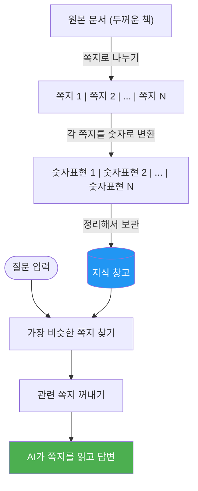
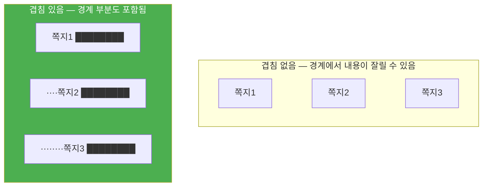
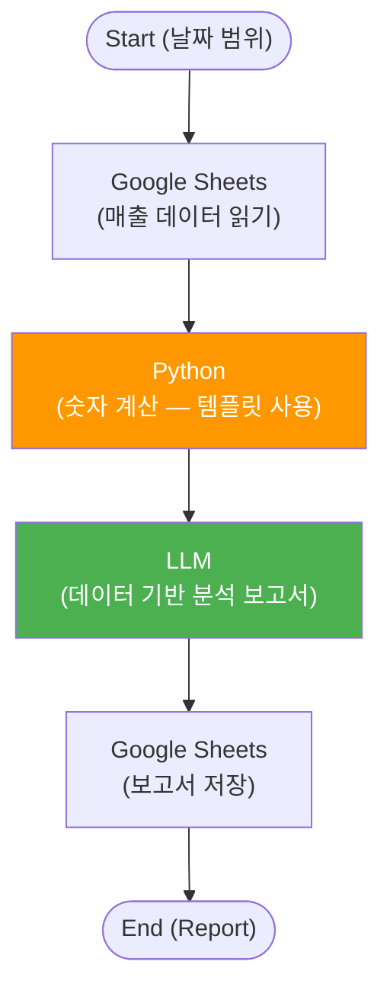
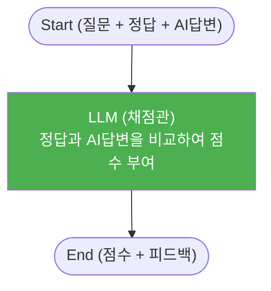
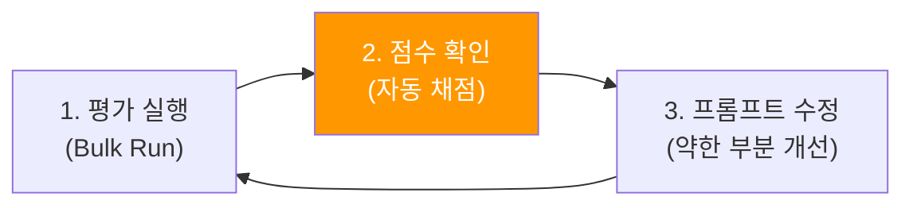

# Day 2 교안: RAG 심화, 데이터 파이프라인, Agent 평가
{: .no_toc }

## 전문과정 | 09:00-19:00 (9시간)
{: .no_toc }

---

## 일일 학습 목표

| 목표 | 핵심 키워드 |
|------|------------|
| RAG 지식베이스를 문서 나누기 전략과 프롬프트 최적화로 고도화한다 | 청킹, 할루시네이션 억제 |
| Python 템플릿 기반 데이터 파이프라인을 구축한다 | Python 노드, 시트 연동 |
| Agent 평가 프레임워크로 품질을 체계적으로 측정한다 | Bulk Run, 자동 채점 |

---

## 09:00-09:10 | Daily Standup (10분)

- 어제 배운 것 중 가장 기억에 남는 것
- 오늘 기대하는 것

## 09:10-09:20 | 전일 복습 퀴즈 (10분)

**Kahoot! 스타일 퀴즈 5문항**:
1. Ability와 Agent의 가장 큰 차이는? → 자율 판단 여부
2. ReAct에서 AI가 도구를 선택하는 과정을 확인할 수 있는 변수는? → reasonings
3. "단계별로 생각해 봅시다"는 어떤 프롬프트 기법? → Chain-of-Thought
4. 비싸지만 정확한 모델은 어떤 작업에 적합? → 복잡한 분석/보고서
5. ReAct의 도구 선택 정확도를 높이려면? → 도구 설명을 상세하게

---

# 4차시: RAG 심화 — 지식베이스 최적화

## 09:20-12:00 (2시간 40분)

---

### 09:20-10:00 이론 — 문서 나누기 전략 (40분)

#### 문서 나누기(Chunking) — "책을 쪽지로 나누는 법"

> **쉬운 설명**: RAG에서 문서를 검색하려면, 긴 문서를 작은 조각(chunk)으로 나눠야 합니다. 이것은 **두꺼운 백과사전을 쪽지 카드로 나누는 것**과 같습니다. 쪽지가 너무 작으면 내용이 잘리고, 너무 크면 관련 없는 내용까지 포함됩니다.



**쪽지 크기의 영향**:

| 쪽지 크기 | 비유 | 장점 | 단점 |
|-----------|------|------|------|
| **작은 쪽지** | "핵심만 적은 메모" | 정확한 내용만 찾아옴 | 맥락이 부족할 수 있음 |
| **중간 쪽지** | "요약 노트" | 균형잡힌 검색 | 범용적 |
| **큰 쪽지** | "한 페이지 전체 복사" | 풍부한 맥락 | 관련 없는 내용도 포함 |

> 💡 **Tip**: 대부분의 경우 **중간 크기**가 가장 좋은 결과를 냅니다. "문서를 잘 나누면 답변이 더 정확해요!"

**쪽지 겹치기(Overlap)**:

> **쉬운 설명**: 쪽지를 나눌 때, 앞뒤 쪽지가 약간 **겹치게** 만들면 경계에서 내용이 잘리는 문제를 막을 수 있습니다. 마치 퍼즐 조각이 약간 겹쳐야 그림이 끊기지 않는 것과 같습니다.



#### 할루시네이션(거짓말) 억제 전략

> **쉬운 설명**: AI가 문서에 없는 내용을 마치 있는 것처럼 답변하는 것을 **"할루시네이션"** 이라고 합니다. 이것을 줄이려면 AI에게 **"문서에 있는 내용만 말해"** 라고 강하게 지시해야 합니다.

```
System Prompt에 추가할 4가지 규칙:

1. 근거 제한 (가장 중요!)
   "반드시 검색된 문서에 포함된 내용만으로 답변하세요.
    문서에 없는 내용을 추가하거나 추측하지 마세요."

2. 출처 표시
   "답변의 각 핵심 문장 뒤에 [출처: 문서명]을 표시하세요."

3. 모르면 모른다고 하기
   "문서에 명확하지 않은 경우 '문서에서 확인되지 않습니다'라고
    답변하세요."

4. 대안 안내
   "검색 결과가 없는 경우:
    '해당 내용은 등록된 문서에서 찾을 수 없습니다.
     [담당 부서]로 문의해 주세요.'"
```

---

### 10:00-10:15 쉬는시간

---

### 10:15-11:15 실습 — RAG 최적화 (60분)

#### 실습 4.1: 멀티 문서 지식베이스 구축 (20분)

**따라하기 단계**:

1. Agentria 좌측 메뉴에서 **Storage** 를 클릭합니다
2. **새 지식베이스 만들기** 를 클릭합니다
3. 이름을 "Day2_멀티문서_KB"로 입력합니다
4. 아래 3개 문서를 업로드합니다 (강사가 제공):
   - `사내_규정집.pdf` (20페이지) — 근무, 휴가, 복리후생
   - `제품_FAQ.pdf` (10페이지) — 자주 묻는 질문 30가지
   - `환불_교환_정책.pdf` (5페이지) — 환불/교환 절차 상세
5. 기본 청크 설정으로 업로드를 완료합니다
6. 업로드 완료 후 **문서 목록**에 3개 파일이 보이는지 확인합니다

> ✅ **체크포인트**: Storage에 3개 문서가 정상 업로드되면 성공!

#### 실습 4.2: 설정 비교 실험 + 프롬프트 개선 (40분)

**동일 질문 5개로 설정별 비교**:

| 질문 | 정답 | 설정 A (기본값) | 설정 B (작은 쪽지) | 설정 C (큰 쪽지) |
|------|------|----------------|-------------------|-----------------|
| "연차 신청 절차는?" | 규정집 p.5 | | | |
| "14일 이내 환불이 가능한가요?" | 환불정책 p.2 | | | |
| "제품 A와 B의 차이점은?" | FAQ #12 | | | |
| "경조사 휴가는 며칠인가요?" | 규정집 p.8 | | | |
| "해외 배송 환불 절차는?" | 환불정책 p.4 | | | |

**프롬프트 Before/After 비교**:

**Before** (기본 프롬프트):
```
질문에 답변해 주세요.
```

**After** (최적화 프롬프트):
```
당신은 사내 규정 전문 상담원입니다.

## 응답 규칙
1. 검색된 문서의 내용만을 근거로 답변하세요
2. 답변의 각 핵심 정보 뒤에 [출처: 문서명]을 표시하세요
3. 여러 문서의 내용을 조합해야 하는 경우, 각각의 출처를 구분하세요
4. 문서에 없는 내용: "해당 정보는 등록된 문서에서 확인되지 않습니다"

## 응답 형식
### 답변
(간결하고 명확한 답변)

### 참고 문서
- [문서명] 해당 부분 요약
```

| 평가 기준 | Before | After |
|-----------|--------|-------|
| 정확도 (5문항 중 정답) | /5 | /5 |
| 출처 표시 정확도 | /5 | /5 |
| 할루시네이션(거짓말) 발생 | /5 | /5 |

> ✅ **체크포인트**: After 프롬프트에서 정확도와 출처 표시가 개선되면 성공!

---

### 11:15-11:45 RAG 정확도 챌린지 (30분)

> **팀 대항전!** 각 팀이 가장 정확한 답변을 내는 지식베이스를 구성합니다.

**규칙**:
1. 강사가 **테스트 질문 10개**를 공개합니다 (정답 포함)
2. 각 팀은 15분 동안 지식베이스 설정과 프롬프트를 최적화합니다
   - 청크 크기 조정
   - 프롬프트 수정
   - 문서 구성 변경
3. 10개 질문을 Bulk Run으로 일괄 실행합니다
4. 정답과 비교하여 **정확도 점수**를 계산합니다
5. 가장 높은 점수를 받은 팀이 승리!

**점수 기준**:
- 정확한 답변: 2점
- 부분 정확: 1점
- 틀린 답변: 0점
- 출처를 정확히 표시: 보너스 +1점

> 💡 **Tip**: 프롬프트만 잘 바꿔도 점수가 크게 올라갈 수 있습니다!

---

### 11:45-12:00 챌린지 결과 발표 + 우승팀 인정 (15분)

---

# 5차시: Python 템플릿 + 데이터 파이프라인

## 13:00-16:00 (3시간)

---

### 13:00-13:15 오후 에너자이저 (15분)

**미니 게임: "데이터 탐정"**
- 강사가 숫자 데이터 5개를 보여줌
- 팀별로 "이 데이터에서 이상한 점"을 가장 많이 찾기
- 데이터 분석의 첫걸음!

---

### 13:15-16:00 실습 — 데이터 파이프라인 구축 (165분)

> ⚠️ **주의**: Python 코드는 **모두 완성된 템플릿**으로 제공됩니다. 여러분은 코드를 **복사해서 붙여넣기**만 하면 됩니다. 필요한 부분만 값을 바꾸면 됩니다!

#### Python 노드란?

> **쉬운 설명**: Python 노드는 **"계산기 + 데이터 정리 도구"** 입니다. AI가 잘 못하는 정확한 숫자 계산이나 데이터 정리를 대신 해줍니다. 코드를 직접 쓸 필요는 없고, 제공된 템플릿을 붙여넣으면 됩니다.

#### 실습 5.1: 매출 데이터 분석 파이프라인 (90분)

**시나리오**: 구글 시트에서 주간 매출 데이터를 읽어와 → Python으로 계산 → AI로 분석 → 보고서를 시트에 저장

**워크플로우**:


**따라하기 단계**:

**Step 1: 구글 시트 준비 (15분)**

1. 강사가 공유한 **매출 데이터 템플릿 시트**를 내 드라이브에 복사합니다
2. 시트 구조를 확인합니다:

| 날짜 | 매출 | 주문수 | 카테고리 |
|------|------|--------|---------|
| 2026-07-01 | 1500000 | 45 | 전자제품 |
| 2026-07-02 | 980000 | 32 | 의류 |

**Step 2: Ability 구성 (20분)**

1. 새 Ability 프로젝트 만들기: "Day2_매출분석_파이프라인"
2. Start 노드 추가
3. Google Sheets Read 노드 추가 → 시트 연결
4. Python 노드 추가
5. LLM 노드 추가
6. Google Sheets Write 노드 추가
7. End 노드 연결

**Step 3: Python 노드 — 템플릿 붙여넣기 (20분)**

> 아래 코드를 **그대로 복사**해서 Python 노드에 붙여넣으세요. 수정할 필요 없습니다!

```python
import json  # JSON 데이터를 다루는 도구를 불러옵니다

# 시트에서 읽어온 데이터를 가져옵니다
data = json.loads(sheet_data)  # 시트 데이터를 Python이 이해할 수 있는 형태로 변환합니다

# ===== 기본 통계 계산 =====
# 전체 매출 합계를 계산합니다
total_sales = sum(float(row.get('sales', 0)) for row in data)  # 모든 행의 매출을 더합니다

# 평균 매출을 계산합니다
avg_sales = total_sales / len(data) if data else 0  # 합계를 행 수로 나눕니다

# 가장 매출이 높은 날을 찾습니다
max_day = max(data, key=lambda x: float(x.get('sales', 0)))  # 매출이 가장 큰 행을 찾습니다

# 가장 매출이 낮은 날을 찾습니다
min_day = min(data, key=lambda x: float(x.get('sales', 0)))  # 매출이 가장 작은 행을 찾습니다

# ===== 주간 증감률 계산 =====
# 최근 7일 데이터를 가져옵니다
recent = data[-7:] if len(data) >= 7 else data  # 마지막 7개 행

# 이전 7일 데이터를 가져옵니다
previous = data[-14:-7] if len(data) >= 14 else []  # 그 이전 7개 행

# 최근 7일 합계를 계산합니다
recent_total = sum(float(r.get('sales', 0)) for r in recent)

# 이전 7일 합계를 계산합니다
prev_total = sum(float(r.get('sales', 0)) for r in previous) if previous else 0

# 증감률을 계산합니다 (이전 대비 몇 % 변했는지)
if prev_total > 0:
    growth_rate = ((recent_total - prev_total) / prev_total) * 100  # 증감률 공식
else:
    growth_rate = 0  # 이전 데이터가 없으면 0%

# ===== 결과를 정리합니다 =====
summary = {
    "period": f"{data[0].get('date', '')} ~ {data[-1].get('date', '')}",  # 기간
    "total_sales": round(total_sales, 0),  # 총 매출 (소수점 제거)
    "average_daily": round(avg_sales, 0),  # 일 평균 매출
    "best_day": {"date": max_day.get('date', ''), "sales": max_day.get('sales', '')},  # 최고 매출일
    "worst_day": {"date": min_day.get('date', ''), "sales": min_day.get('sales', '')},  # 최저 매출일
    "weekly_growth": f"{growth_rate:.1f}%",  # 주간 증감률
    "total_records": len(data)  # 전체 데이터 수
}

# 결과를 다음 노드로 전달합니다
return {"output": json.dumps(summary, ensure_ascii=False)}
```

> 💡 **Tip**: 코드의 `#` 뒤에 있는 한국어 설명을 읽으면 각 줄이 무엇을 하는지 이해할 수 있습니다!

**Step 4: LLM 분석 노드 설정 (15분)**

System Prompt를 입력합니다:
```
당신은 비즈니스 데이터 분석가입니다.
주어진 매출 통계를 바탕으로 주간 분석 보고서를 작성하세요.

보고서 형식:
## 주간 매출 분석 보고서
### 1. 핵심 지표
### 2. 트렌드 분석
### 3. 주목할 점
### 4. 개선 제안 (2가지)
```

**Step 5: 실행 및 확인 (20분)**

1. 전체 파이프라인을 실행합니다
2. LLM이 생성한 보고서 내용을 확인합니다
3. 구글 시트에 보고서가 저장되었는지 확인합니다

> ✅ **체크포인트**: 시트에서 데이터를 읽어 → Python이 계산하고 → AI가 보고서를 쓰고 → 시트에 저장되면 성공!

#### 실습 5.2: 조건부 알림 확장 (45분)

**시나리오**: 매출이 크게 떨어지면 긴급 알림을 보내는 기능 추가

**따라하기 단계**:

1. Python 노드 뒤에 **새 Python 노드**를 추가합니다
2. 아래 코드를 **그대로 복사**해서 붙여넣습니다:

```python
import json  # JSON 데이터를 다루는 도구를 불러옵니다

# 이전 Python 노드에서 계산한 결과를 가져옵니다
summary = json.loads(analysis_summary)  # 분석 결과를 가져옵니다

# 증감률 숫자를 추출합니다 (예: "-15.3%" → -15.3)
growth = float(summary.get('weekly_growth', '0%').replace('%', ''))  # %를 제거하고 숫자로 변환합니다

# ===== 알림 조건을 판단합니다 =====
if growth < -10:  # 10% 이상 급감하면
    alert_level = "critical"  # 긴급 단계
    alert_message = f"긴급: 주간 매출 {growth:.1f}% 급감. 즉시 원인 분석 필요"  # 긴급 메시지
elif growth < -5:  # 5% 이상 하락하면
    alert_level = "warning"  # 주의 단계
    alert_message = f"주의: 주간 매출 {growth:.1f}% 하락. 모니터링 강화 권장"  # 주의 메시지
elif growth > 10:  # 10% 이상 상승하면
    alert_level = "positive"  # 호조 단계
    alert_message = f"호조: 주간 매출 {growth:.1f}% 상승. 성공 요인 분석 권장"  # 호조 메시지
else:  # 그 외에는
    alert_level = "normal"  # 정상 단계
    alert_message = f"정상: 주간 매출 {growth:.1f}% 변동"  # 정상 메시지

# 결과를 다음 노드로 전달합니다
return {"output": json.dumps({
    "alert_level": alert_level,  # 알림 단계
    "alert_message": alert_message  # 알림 메시지
}, ensure_ascii=False)}
```

3. **Branch 노드**를 추가하고 분기 조건을 설정합니다:
   - `alert_level == "critical"` → Slack 긴급 채널 + Gmail
   - `alert_level == "warning"` → Slack 일반 채널
   - 그 외 → 시트 기록만

#### 실습 5.3: 전체 파이프라인 테스트 (30분)

- 시트에 **정상/하락/급상승** 3가지 시나리오의 테스트 데이터를 입력합니다
- 각 시나리오에서 올바른 알림이 발송되는지 확인합니다

> ✅ **체크포인트**: 매출 하락 시나리오에서 Slack 알림이 발송되면 성공!

---

# 6차시: Agent 평가 프레임워크 (Bulk Run + 자동 평가)

## 16:15-18:30 (2시간 15분)

---

### 16:15-16:35 이론 — 왜 평가가 중요한가? (20분)

#### 에이전트 품질을 숫자로 측정하기

> **쉬운 설명**: 에이전트를 만들었는데, "이게 잘 동작하는 건가?" 어떻게 판단할까요? **시험을 보면 됩니다!** 여러 질문을 한꺼번에 던져보고, 정답률을 계산하면 에이전트의 실력을 숫자로 알 수 있습니다.

**평가가 필요한 이유**:

| 상황 | 평가 없이 | 평가 있으면 |
|------|----------|-----------|
| 프롬프트 수정 후 | "좋아진 것 같은데...?" | "정확도 72% → 85%로 개선!" |
| 모델 변경 후 | "비슷한 것 같은데...?" | "속도 2배, 정확도 동일" |
| 지식베이스 변경 후 | "잘 모르겠는데...?" | "인용 정확도 60% → 90%!" |

#### 평가 지표 — 쉬운 3가지

| 지표 | 비유 | 측정 방법 |
|------|------|----------|
| **정확도** | "시험 점수" | 정답과 얼마나 일치하는가 |
| **인용 정확도** | "출처를 제대로 밝혔는가" | 올바른 문서를 참조했는가 |
| **안전성** | "거짓말을 하지 않는가" | 할루시네이션이 발생하지 않는가 |

---

### 16:35-18:15 실습 — 자동 평가 파이프라인 구축 (100분)

#### 실습 6.1: 평가용 데이터셋 만들기 (20분)

**따라하기 단계**:

1. 구글 시트에 **평가 데이터셋**을 만듭니다:

| 번호 | 질문 | 정답 | 참조문서 |
|------|------|------|---------|
| 1 | "연차 신청 절차는?" | "연차는 3일 전까지 시스템에서 신청..." | 규정집 |
| 2 | "환불 기간은?" | "구매일로부터 14일 이내..." | 환불정책 |
| 3 | "제품 A의 무게는?" | "제품 A의 무게는 1.2kg..." | FAQ |
| ... | ... | ... | ... |
| 10 | "해외 배송 환불은?" | "해외 배송 제품은 30일 이내..." | 환불정책 |

2. 10개 행을 채웁니다 (강사가 제공하는 템플릿 활용)

#### 실습 6.2: Bulk Run으로 일괄 테스트 (30분)

> **쉬운 설명**: **Bulk Run**은 "모의고사를 한꺼번에 치르는 것"입니다. 10개 질문을 한 번에 에이전트에게 보내고, 모든 답변을 한꺼번에 받아볼 수 있습니다.

**따라하기 단계**:

1. Day2에서 만든 RAG Ability를 엽니다
2. 상단 메뉴에서 **Bulk Run** 을 클릭합니다
3. 평가 데이터셋의 **질문** 열을 입력으로 설정합니다
4. **실행** 버튼을 클릭합니다
5. 모든 질문에 대한 답변이 생성될 때까지 기다립니다
6. 결과를 **다운로드** 합니다

> ✅ **체크포인트**: 10개 질문에 대한 답변이 모두 생성되면 성공!

#### 실습 6.3: 자동 채점 파이프라인 (30분)

**시나리오**: LLM이 "채점관" 역할을 해서 답변의 정확도를 자동으로 점수를 매깁니다



**따라하기 단계**:

1. 새 Ability 프로젝트: "Day2_자동채점"
2. Start 노드: 입력 변수 3개 — `question`, `correct_answer`, `ai_answer`
3. LLM 노드에 아래 System Prompt를 입력합니다:

```
당신은 엄격한 채점관입니다.
질문, 정답, AI의 답변을 비교하여 점수를 매기세요.

## 채점 기준
- 정확도 (0-5): 정답의 핵심 내용을 포함하는가
- 완전성 (0-5): 필요한 정보를 빠짐없이 포함하는가
- 할루시네이션 (-3): 정답에 없는 거짓 정보를 추가했는가

## 출력 형식 (반드시 이 형식으로)
점수: [숫자]/10
정확도: [0-5]
완전성: [0-5]
할루시네이션: [있음/없음] (있으면 -3점)
한줄평: [개선 포인트]
```

4. End 노드를 연결합니다
5. Bulk Run에서 받은 결과를 하나씩 넣어 채점합니다

> 💡 **Tip**: 이 자동 채점을 활용하면, 프롬프트를 수정할 때마다 "진짜 좋아졌는지"를 숫자로 확인할 수 있습니다!

#### 실습 6.4: 개선 사이클 체험 (20분)

**3단계 개선 사이클**:



1. 현재 점수를 확인합니다 (10문항 평균)
2. 가장 점수가 낮은 질문 2개를 확인합니다
3. 해당 질문에서 무엇이 부족한지 분석합니다
4. System Prompt를 수정합니다
5. 다시 Bulk Run + 자동 채점을 실행합니다
6. 점수가 개선되었는지 확인합니다

> ✅ **체크포인트**: 개선 전/후 점수를 비교할 수 있으면 성공!

---

### 18:15-18:30 오늘의 정리 (15분)

**오늘 배운 핵심 3가지**:
1. 문서를 잘 나누면 RAG 답변이 더 정확해진다
2. Python 템플릿으로 데이터 분석 파이프라인을 만들 수 있다
3. Bulk Run + 자동 채점으로 에이전트 품질을 숫자로 측정할 수 있다

---

## 18:30-18:45 | TIL 카드 작성 + 공유 (15분)

**TIL (Today I Learned) 카드**:
- 카드 앞면: 오늘 배운 것 중 "이건 꼭 기억해야 해!"
- 카드 뒷면: 실습에서 가장 놀라웠던 순간
- 팀별 돌아가며 1분씩 공유

---

## 18:45-19:00 | Daily 과제 ② + 내일 예고 (15분)

### Daily 과제 ②

> **과제**: 오늘 만든 파이프라인 중 하나를 선택하여, 다음을 정리하여 제출:
>
> 1. 파이프라인 흐름 설명 (어떤 노드가 어떤 순서로 동작하는지):
> 2. Python 노드가 하는 일 설명 (코드를 이해한 대로):
> 3. 에이전트 평가에서 발견한 약점 1가지와 개선 방법:

### 내일 예고

> 내일은 **엔터프라이즈급 통합 파이프라인**과 **에이전트 메모리**를 배웁니다. 오후에는 팀별 **에이전트 배틀**이 있으니, 오늘 배운 것을 잘 정리해 두세요!

---

## Day 2 준비물 체크리스트 (강사용)

- [ ] RAG 실습용 PDF 문서 3종 (규정집, FAQ, 환불정책)
- [ ] 구글 시트 매출 데이터 템플릿 (테스트 시나리오 3종)
- [ ] RAG 정확도 챌린지 테스트 질문 10개 + 정답지
- [ ] 평가 데이터셋 템플릿 (구글 시트)
- [ ] Kahoot! 퀴즈 5문항 준비
- [ ] TIL 카드용 포스트잇/카드
