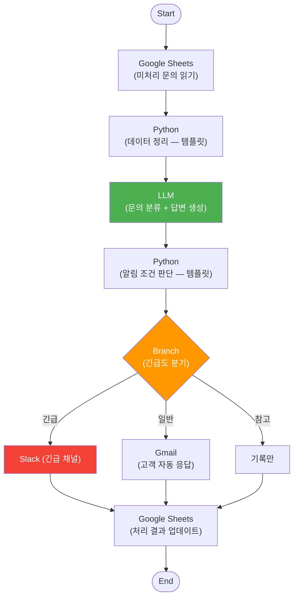
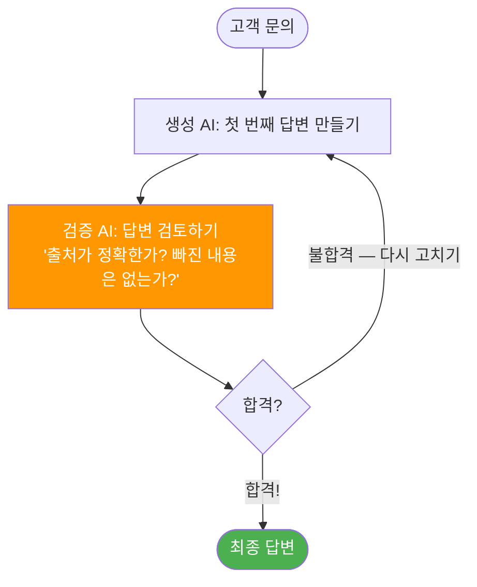
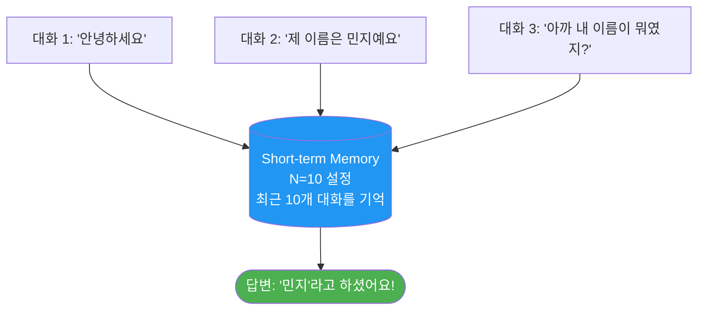
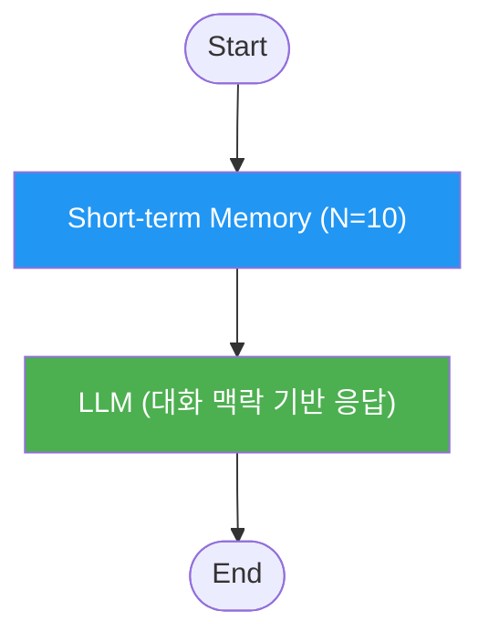
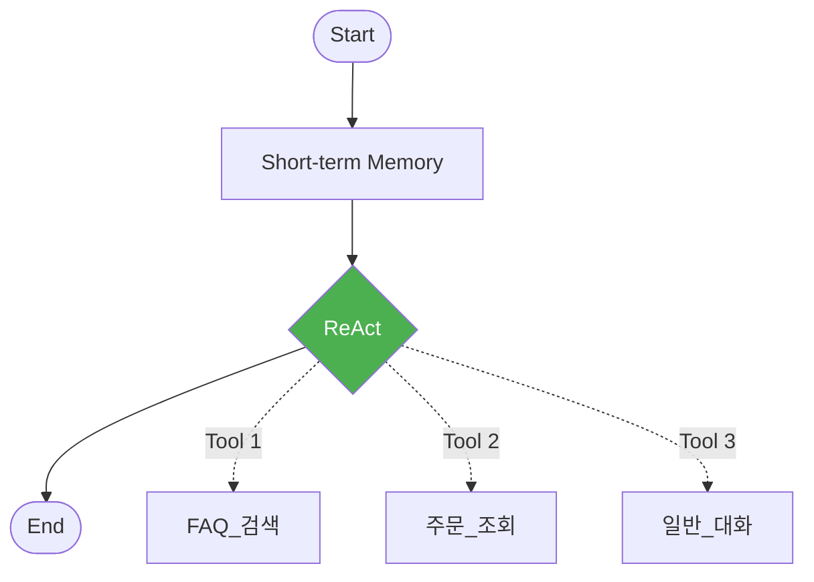
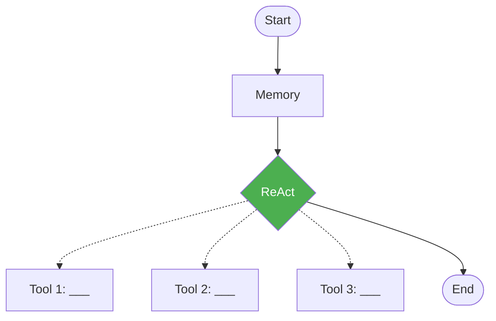

# Day 3 교안: 통합 파이프라인과 프로젝트 기획
{: .no_toc }

## 전문과정 | 09:00-19:00 (9시간)
{: .no_toc }

---

## 일일 학습 목표

| 목표 | 핵심 키워드 |
|------|------------|
| 시트→LLM→분기→알림의 멀티 플랫폼 파이프라인을 구성한다 | 통합 파이프라인, Slack, Gmail |
| Reflection 패턴(생성→검증→개선)을 이해하고 적용한다 | Reflection, 자기 검토 |
| 에이전트 메모리로 대화 맥락을 유지하는 에이전트를 만든다 | 메모리, 대화 맥락 |
| 팀 프로젝트 주제를 선정하고 Agent 수준의 설계안을 완성한다 | PBL, 기획 |

---

## 09:00-09:10 | Daily Standup (10분)

- 어제 배운 것 요약 (한 문장)
- 오늘의 개인 목표

## 09:10-09:20 | 전일 복습 퀴즈 (10분)

**Kahoot! 스타일 퀴즈 5문항**:
1. RAG에서 문서를 작은 조각으로 나누는 것을 무엇이라 하는가? → 청킹(Chunking)
2. AI가 문서에 없는 내용을 지어내는 것을 무엇이라 하는가? → 할루시네이션
3. 에이전트를 여러 질문으로 한꺼번에 테스트하는 기능은? → Bulk Run
4. Python 노드의 역할은? → 정확한 숫자 계산과 데이터 정리
5. 프롬프트에 "출처를 표시하세요"를 추가하면 무엇이 개선되는가? → 인용 정확도

---

# 7차시: 멀티 플랫폼 통합 파이프라인 + Reflection 패턴

## 09:20-12:00 (2시간 40분)

---

### 09:20-11:15 실습 — 고객 문의 자동 처리 시스템 (115분)

#### 시나리오: "고객 문의가 들어오면 자동으로 처리하는 시스템"

> **쉬운 설명**: 고객이 문의를 시트에 남기면, AI가 자동으로 읽고 분류하고, 긴급한 건은 Slack으로, 일반 건은 이메일로 알려주는 시스템을 만듭니다. 마치 **AI 비서가 우편물을 분류해서 긴급 편지는 바로 보고하고, 일반 편지는 정리해두는 것**과 같습니다.

**전체 워크플로우**:


#### Phase 1: 시트 데이터 조회 (20분)

**구글 시트 구조** (강사가 제공하는 템플릿):

| ID | 고객명 | 이메일 | 문의내용 | 등록일 | 상태 | 처리결과 |
|----|--------|--------|---------|--------|------|---------|
| 001 | 김철수 | kim@test.com | 제품이 고장났어요 | 2026-07-15 | 대기 | |
| 002 | 이영희 | lee@test.com | 환불 신청합니다 | 2026-07-15 | 대기 | |

**따라하기 단계**:
1. 새 Ability: "Day3_고객문의_자동처리"
2. Start 노드 추가
3. Google Sheets Read 노드 추가 → 상태="대기" 건만 필터링

#### Phase 2: LLM 분류 + 응답 생성 (25분)

LLM 노드에 아래 System Prompt를 입력합니다:

```
고객 문의를 분석하여 다음 JSON 형식으로 출력하세요:

{
  "id": "문의 ID",
  "category": "기술지원/결제/배송/환불/일반",
  "urgency": "critical/normal/info",
  "auto_response": "고객에게 보낼 정중한 자동 응답",
  "internal_note": "내부 담당자용 메모",
  "assigned_to": "기술팀/CS팀/결제팀"
}

긴급도 판단 기준:
- critical: 제품 안전 문제, 긴급 환불, 법적 이슈 언급
- normal: 일반 문의, 기능 질문, 교환 요청
- info: 감사 표현, 제안, 일반 정보 요청
```

#### Phase 3: Python 알림 조건 판단 (20분)

> 아래 코드를 **그대로 복사**해서 Python 노드에 붙여넣으세요!

```python
import json  # JSON 데이터를 다루는 도구를 불러옵니다

# LLM이 분류한 결과를 가져옵니다
result = json.loads(llm_output)  # LLM 출력을 가져옵니다

# 긴급도에 따라 알림 메시지를 만듭니다
if result["urgency"] == "critical":  # 긴급 문의인 경우
    slack_message = f"긴급 문의 [{result['id']}]\n"  # Slack 메시지 시작
    slack_message += f"카테고리: {result['category']}\n"  # 카테고리 추가
    slack_message += f"담당: {result['assigned_to']}\n"  # 담당팀 추가
    slack_message += f"내용: {result['internal_note']}"  # 내용 추가
    email_subject = f"[긴급] 고객 문의 #{result['id']} - {result['category']}"  # 이메일 제목
else:  # 긴급이 아닌 경우
    slack_message = ""  # Slack 메시지 없음
    email_subject = f"고객 문의 자동 처리 완료 #{result['id']}"  # 일반 이메일 제목

# 결과에 알림 정보를 추가합니다
result["slack_message"] = slack_message  # Slack 메시지 추가
result["email_subject"] = email_subject  # 이메일 제목 추가

# 결과를 다음 노드로 전달합니다
return {"output": json.dumps(result, ensure_ascii=False)}
```

#### Phase 4: Branch 분기 + 알림 발송 (25분)

**따라하기 단계**:
1. Branch 노드를 추가합니다
2. 조건을 설정합니다:
   - `urgency == "critical"` → Slack 노드 + Gmail 노드
   - `urgency == "normal"` → Gmail 노드 (고객 자동 응답)
   - `urgency == "info"` → 바로 시트 업데이트

#### Phase 5: 시트 업데이트 + 통합 테스트 (25분)

1. Google Sheets Write 노드 추가: 상태를 "대기" → "처리완료"로 변경
2. **테스트 시나리오 3건**을 실행합니다:

| 문의 | 예상 긴급도 | 예상 알림 채널 |
|------|-----------|-------------|
| "제품에서 연기가 나요" | critical | Slack + Gmail |
| "배송이 안 왔어요" | normal | Gmail |
| "좋은 제품 감사합니다" | info | 기록만 |

> ✅ **체크포인트**: 긴급 문의가 Slack으로 전송되고, 시트 상태가 업데이트되면 성공!

---

### 11:15-12:00 이론+실습 — Reflection 패턴 심화 (45분)

#### Reflection 패턴 = AI가 스스로 답변을 검토하고 고치기

> **쉬운 설명**: Reflection 패턴은 **"작문 → 퇴고"** 와 같습니다. 글을 쓴 후에 다시 읽어보면서 "이 부분이 좀 이상한데?" 하고 스스로 고치는 것입니다. AI도 처음 만든 답변을 **다시 검토하고 개선**할 수 있습니다.



**Reflection의 장점**:
- **답변 품질 향상**: 한 번에 완벽한 답변을 기대하기 어렵지만, 검토를 거치면 품질이 올라갑니다
- **할루시네이션 감소**: 검증 단계에서 "문서에 없는 내용이 있는가?"를 확인합니다
- **자동 품질 관리**: 사람이 매번 확인하지 않아도 AI끼리 품질을 관리합니다

#### 실습: Reflection 패턴 구현 (30분)

**따라하기 단계**:

1. 새 Ability: "Day3_Reflection_실습"
2. 워크플로우: Start → LLM(생성) → LLM(검증) → Branch → End

**생성 LLM System Prompt**:
```
고객 문의에 대한 답변을 작성하세요.
검색된 문서를 근거로, 출처를 포함하여 답변하세요.
```

**검증 LLM System Prompt**:
```
아래 답변을 검토하고 점수를 매기세요.

## 검토 기준
1. 질문에 정확히 답변했는가? (0-5)
2. 출처가 명시되었는가? (0-5)
3. 문서에 없는 내용(거짓말)이 포함되었는가? (있으면 -5)

## 출력 형식
총점: [숫자]/10
합격여부: 합격/불합격 (7점 이상이면 합격)
개선사항: [부족한 점]
개선된_답변: [7점 미만이면 직접 개선한 답변을 작성]
```

3. Branch 노드: 합격이면 바로 출력, 불합격이면 개선된 답변을 출력
4. 같은 질문을 **Reflection 있는 버전**과 **없는 버전**으로 비교합니다

> ✅ **체크포인트**: Reflection을 적용한 답변이 더 정확하고 출처가 잘 표시되면 성공!

---

# 8차시: 에이전트 메모리 + 에이전트 배틀

## 13:00-16:00 (3시간)

---

### 13:00-13:15 오후 에너자이저 (15분)

**미니 게임: "기억력 테스트"**
- 강사가 10개의 단어를 순서대로 보여줌
- 순서대로 가장 많이 기억한 팀 승리!
- "이것이 바로 AI 메모리의 원리입니다"

---

### 13:15-13:45 이론 — 에이전트 메모리 시스템 (30분)

#### 메모리 = "이전 대화를 기억하는 메모장"

> **쉬운 설명**: 메모리가 없는 AI는 **매번 기억을 잃는 사람**과 같습니다. "제 이름은 민지예요"라고 말해도, 다음 대화에서 "이름이 뭐예요?"라고 되물어봅니다. 메모리를 추가하면 AI가 **최근 대화를 메모장에 적어두고** 참고합니다.

| 메모리 유형 | 비유 | Agentria 구현 | 용도 |
|------------|------|-------------|------|
| **단기 기억** | "방금 전 대화를 기억하는 메모장" | Short-term Memory 노드 | 대화 맥락 유지 |
| **장기 기억** | "고객 정보를 적어둔 수첩" | Storage + 조회 | 사용자 선호도, 이력 |

#### 단기 기억 노드 동작 원리



**메모장 크기(N) 설정 가이드**:
- N이 너무 작으면 (예: 3): 금방 전 대화도 잊어버림
- N이 너무 크면 (예: 50): 비용이 올라가고 오래된 정보가 방해될 수 있음
- **권장**: 용도에 따라 **5~20개** 정도가 적당합니다

> 💡 **Tip**: N=10이면 "최근 10개의 주고받은 메시지를 기억해"라는 뜻입니다.

---

### 13:45-15:00 실습 — 메모리 기반 에이전트 (75분)

#### 실습 8.1: 기본 메모리 챗봇 (35분)

**목표**: 대화 맥락을 유지하는 상담 챗봇

**Agent 구성**:


**따라하기 단계**:

1. 새 프로젝트 → **Agent 컴포저** 선택
2. 프로젝트 이름: "Day3_메모리_챗봇"
3. Start → Short-term Memory (N=10) → LLM → End 연결
4. LLM System Prompt를 입력합니다:

```
당신은 친절한 고객 상담 어시스턴트입니다.

## 대화 원칙
1. 이전 대화 내용을 기억하고 자연스럽게 이어가세요
2. 사용자가 이전에 언급한 정보(이름, 주문번호 등)를 활용하세요
3. 같은 질문을 반복하지 마세요
4. 대화 흐름에 맞는 후속 질문을 제안하세요
```

5. **테스트** (연속 대화):
```
나: "안녕하세요, 주문 관련 문의입니다"
AI: "안녕하세요! 주문번호를 알려주시겠어요?"

나: "주문번호는 ORD-2024-001 이에요"
AI: "ORD-2024-001 확인했습니다. 어떤 부분이 궁금하신가요?"

나: "아까 말한 주문 배송 상태가 궁금해요"
AI: "네, ORD-2024-001의 배송 상태를 확인해 드리겠습니다..."
     (← 이전 대화에서 주문번호를 기억!)
```

> ✅ **체크포인트**: 3번째 질문에서 주문번호를 다시 묻지 않으면 성공!

#### 실습 8.2: 메모리 + ReAct 결합 에이전트 (30분)

**목표**: 대화 맥락을 유지하면서 도구를 자율 선택하는 에이전트



**따라하기 단계**:

1. 아까 만든 Agent에 ReAct 노드를 추가합니다
2. Day1에서 만든 도구 Ability를 Tool Pin에 연결합니다
3. 대화 중에 도구를 바꿔가며 사용하는 시나리오를 테스트합니다:

```
나: "안녕하세요" → 일반_대화
나: "환불 규정 알려줘" → FAQ_검색
나: "아 그리고 내 주문 ORD-001 배송은?" → 주문_조회
나: "아까 말한 환불 규정에서 14일 이내면 되는 거죠?" → FAQ_검색 (맥락 유지)
```

> ✅ **체크포인트**: 4번째 질문에서 "아까 말한 환불 규정"을 이해하고 답변하면 성공!

#### 실습 8.3: 메모장 크기 실험 (10분)

| 설정 | N=3 | N=10 | N=20 |
|------|-----|------|------|
| 5번째 대화에서 1번째 내용 기억? | | | |
| 응답 품질 | | | |
| 응답 속도 (체감) | | | |

---

### 15:00-15:30 에이전트 배틀 (30분)

> **팀 대항전!** 지금까지 배운 기술을 총동원하여 가장 뛰어난 에이전트를 시연합니다.

**규칙**:
1. 각 팀은 **Day1~Day3에서 만든 에이전트 중 하나**를 선택합니다
2. 강사가 **테스트 시나리오 5개**를 발표합니다
3. 각 팀이 시나리오를 실시간으로 시연합니다 (팀당 3분)
4. 청중(다른 팀들)이 **투표**합니다:
   - 가장 정확한 답변을 한 팀
   - 가장 자연스러운 대화를 한 팀
   - 가장 창의적인 에이전트를 만든 팀

**투표 기준**:
- 정확성 (정답을 잘 맞추는가)
- 자연스러움 (대화가 매끄러운가)
- 메모리 활용 (이전 대화를 잘 기억하는가)

> 💡 **Tip**: 도구 설명과 프롬프트를 미리 최적화해 두면 유리합니다!

---

### 15:30-16:00 배틀 결과 발표 + 쉬는 시간

---

# 9차시: [Project] 기획 + 아키텍처 설계

## 16:15-18:30 (2시간 15분)

---

### 16:15-16:30 프로젝트 카테고리 소개 (15분)

| 카테고리 | 설명 | 핵심 기술 | 추천 대상 |
|----------|------|-----------|----------|
| **A. 지능형 CS 에이전트** | 고객 문의 자율 분류 + 지식베이스 답변 + 에스컬레이션 | ReAct + RAG + Branch + Gmail/Slack | RAG에 자신 있는 팀 |
| **B. 데이터 분석 파이프라인** | 시트 데이터 분석 + 이상 탐지 + 보고서 자동 생성 + 알림 | Python 템플릿 + 시트 R/W + LLM + 알림 | 데이터 분석에 관심 있는 팀 |
| **C. 사내 지식 어시스턴트** | 멀티 문서 통합 검색 + 대화 맥락 유지 + 후속 질문 | RAG 멀티문서 + 메모리 + ReAct | 메모리에 흥미를 느낀 팀 |
| **D. 업무 자동화 봇** | 외부 API + 내부 데이터 조합 맞춤 정보 제공 | HTTP + Python 템플릿 + 시트 + 알림 | 외부 연동에 도전하고 싶은 팀 |

> 💡 **Tip**: 어떤 카테고리를 선택하든, Day1~3에서 배운 기술을 모두 활용합니다. 가장 **흥미로운** 주제를 고르세요!

---

### 16:30-17:50 팀 빌딩 + 기획 (80분)

**팀 구성**: 3-4명

**기획 산출물** (각 팀이 작성):

**1. 역할 카드** (10분):
- 에이전트 이름/역할
- 입력/출력 정의
- 성공 기준 3가지

**2. 기능 요구사항 문서** (20분):
- 핵심 기능 (Must Have) — 반드시 구현
- 추가 기능 (Nice to Have) — 시간이 되면 구현
- 제외 범위 (Out of Scope) — 이번에는 안 함

**3. 노드 설계도** (30분):


> 각 노드에 어떤 기능이 들어갈지, 어떤 순서로 연결할지 설계합니다.

**4. 마일스톤 계획** (20분):
- Day4 오전: MVP 핵심 기능 구현
- Day4 오후: 외부 연동 + 예외 처리
- Day4 저녁: 중간 발표
- Day5 오전: 리팩토링 + API 배포
- Day5 오후: 통합 테스트 + 발표 준비

---

### 17:50-18:20 팀별 기획 발표 (30분)

- 팀당 5분: 프로젝트 개요 + 설계도 + 마일스톤
- 멘토 피드백: 실현 가능성, 범위 조정 제안

> ⚠️ **주의**: 범위를 너무 크게 잡으면 Day4에서 고생합니다! 멘토의 "범위를 줄이세요" 피드백을 꼭 반영하세요.

---

### 18:20-18:30 개선 반영 시간 (10분)

- 멘토 피드백을 기반으로 기획 수정
- 내일 첫 스프린트에 바로 착수할 수 있도록 준비

---

## 18:30-18:45 | TIL 카드 작성 + 공유 (15분)

**TIL (Today I Learned) 카드**:
- 카드 앞면: 3일간 배운 것 중 프로젝트에 꼭 쓸 기술 1가지
- 카드 뒷면: 우리 팀 프로젝트의 핵심 한 줄
- 팀별 공유

---

## 18:45-19:00 | Daily 과제 ③ + 내일 예고 (15분)

### Daily 과제 ③

> **과제**: 팀 프로젝트 기획서를 다음 형식으로 정리하여 제출:
>
> 1. 프로젝트명:
> 2. 에이전트 역할 한 줄 설명:
> 3. 핵심 기능 3가지:
> 4. 사용할 노드 목록:
> 5. Day4 MVP에 포함할 최소 기능:

### 내일 예고

> 내일부터 **프로젝트 구현**을 시작합니다! 30분 단위 **마이크로 스프린트**로 빠르게 만들고, 오후에는 **LLM 보안 기초**와 팀 간 **버그 바운티**가 있습니다. 저녁에는 **중간 발표**가 있으니 열심히 구현해 주세요!

---

## Day 3 준비물 체크리스트 (강사용)

- [ ] 통합 파이프라인 실습용 구글 시트 (문의 데이터 5건)
- [ ] Slack 긴급/일반 채널 2개 준비
- [ ] 에이전트 배틀 테스트 시나리오 5개
- [ ] 투표 도구 (Slido, Google Forms 등)
- [ ] 기획 카드 템플릿 + A3 용지 + 포스트잇
- [ ] 프로젝트 카테고리별 참고 사례 자료
- [ ] Kahoot! 퀴즈 5문항 준비
- [ ] TIL 카드용 포스트잇/카드
