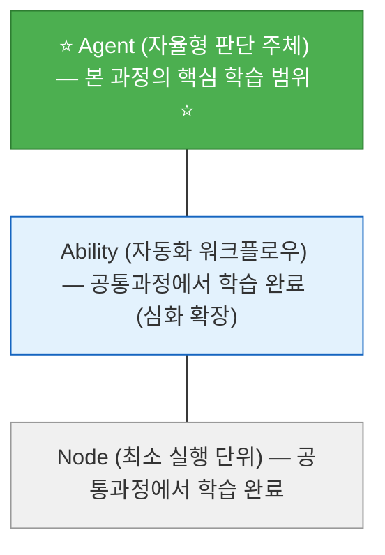

# 수업계획서 (Syllabus)

## [중급 전문1] Agentria 기반 자율형 AI Agent 구축

---

## 1. 과정 정보

| 항목 | 내용 |
|------|------|
| **과정명** | Agentria 기반 자율형 AI Agent 구축 |
| **과정 구분** | 중급 전문(1) 과정 |
| **교육 기간** | 2026년 7월 13일(월) ~ 7월 17일(금), 5일간 |
| **교육 시간** | 45시간 (1일 9시간 × 5일) |
| **학점** | 3학점 |
| **선수 과정** | 중급 공통과정 이수 |
| **강의 유형** | PBL (Project-Based Learning, 프로젝트 기반 학습) |
| **교육 대상** | 대학교 3-4학년 공통과정 이수자 (전공 무관) |
| **난이도** | 중급~고급 (비전공자 친화 설계) |
| **교육 장소** | 오프라인 실습실 |
| **필요 장비** | 1인 1PC (인터넷 연결), Agentria 계정, Google 계정 |

---

## 2. 과정 개요

본 과정은 공통과정에서 학습한 **Ability(워크플로우)** 를 넘어, Agentria의 최상위 계층인 **Agent(자율형 판단 주체)** 를 설계하고 구현하는 프로젝트 과정입니다. 공통과정을 이수한 비전공자도 따라올 수 있도록, 모든 개념을 일상 비유와 함께 설명하고 코드는 완성형 템플릿을 제공합니다.

ReAct 기반 자율형 에이전트, 에이전트 메모리 시스템, RAG 심화 최적화, 외부 API 연동, 그리고 Cloud API 배포까지의 전체 라이프사이클을 경험합니다.

> 💡 **Tip**: 프로그래밍 경험이 없어도 괜찮습니다! Python 코드는 완성된 템플릿을 제공하며, 여러분은 값을 바꾸거나 빈 칸을 채우는 수준으로 실습합니다.

### Agentria 3계층 중 본 과정의 위치

---

## 3. 교육 목표

본 과정을 이수한 수강생은 다음을 수행할 수 있다:

1. **Ability와 Agent의 차이**를 일상 비유로 설명하고, 목적에 맞는 컴포저를 선택할 수 있다.
2. **ReAct(추론-행동) 노드**를 활용하여 도구를 자율 선택하는 에이전트를 구축할 수 있다.
3. **에이전트 메모리 시스템**을 설정하여 대화 맥락을 유지하는 에이전트를 만들 수 있다.
4. **RAG 지식베이스를 최적화**(문서 나누기 전략, 검색 품질 튜닝)하여 응답 정확도를 개선할 수 있다.
5. **Python 노드**(템플릿 기반)를 활용한 데이터 파이프라인을 구성하고 외부 API를 연동할 수 있다.
6. **멀티 플랫폼 통합 파이프라인**(시트+LLM+분기+알림)을 설계하여 실무급 자동화 흐름을 구현할 수 있다.
7. 완성된 에이전트를 **Cloud API로 배포**하고 동작을 검증할 수 있다.
8. **PBL 프로젝트**를 통해 기획부터 발표까지 전체 개발 라이프사이클을 경험할 수 있다.

---

## 4. 사전 요구사항

| 항목 | 필수/권장 | 설명 |
|------|----------|------|
| **중급 공통과정 이수** | 필수 | Ability 구축, 프롬프트 엔지니어링, 외부 연동 경험 |
| Agentria 계정 | 필수 | 공통과정에서 사용하던 계정 그대로 사용 |
| Google OAuth 설정 | 필수 | 공통과정에서 설정 완료 |
| 기본 PC 활용 능력 | 필수 | 웹 브라우저, 구글 시트 등 기본 활용 |

> ⚠️ **주의**: Python, REST API 등 프로그래밍 사전 지식은 **필요하지 않습니다**. 본 과정에서 필요한 코드는 모두 완성형 템플릿으로 제공됩니다.

---

## 5. 일일 운영 시간표

| 시간 | 구분 | 내용 |
|------|------|------|
| 09:00-09:10 | Daily Standup | 어제 진행 상황, 오늘 목표, 막힌 점 공유 |
| 09:10-09:20 | 전일 복습 퀴즈 | Kahoot! 스타일 퀴즈 (10분) |
| 09:20-12:00 | **오전 세션** (차시 1) | 신규 기술 학습 + 핵심 실습 |
| 12:00-13:00 | 점심 | - |
| 13:00-13:15 | 오후 에너자이저 | 팀 활동 / 미니 게임 / 스트레칭 |
| 13:15-16:00 | **오후 세션 A** (차시 2) | 심화 실습 / PBL 작업 |
| 16:00-16:15 | 쉬는 시간 | - |
| 16:15-18:30 | **오후 세션 B** (차시 3) | PBL 프로젝트 / 발표 / 리뷰 |
| 18:30-18:45 | TIL 카드 작성 + 공유 | 오늘 배운 것 카드에 정리 + 팀별 공유 |
| 18:45-19:00 | Daily 과제 안내 + 내일 예고 | 과제 설명 + 내일 미리보기 |

---

## 6. 상세 교육 일정

### Day 1 (7/13 월) — Agent 아키텍처와 자율형 에이전트 기초

| 차시 | 시간 | 주제 | 학습 목표 | 학습 활동 |
|------|------|------|-----------|-----------|
| 1 | 09:00-12:00 | **에이전트 생태계 + Ability vs Agent** | AI 에이전트란 무엇인지 이해하고, Ability와 Agent의 차이를 체감한다 | [이론 60분] AI 에이전트 시장 동향(일상 비유), No-Code/Low-Code/Code 비교, Agentria 3계층 심화 / [실습 100분] Ability vs Agent 컴포저 비교 실습 — 동일 기능을 각각으로 구현 |
| 2 | 13:00-16:00 | **프롬프트 엔지니어링 실전 + 모델 비교** | 프롬프트 기법을 실전 적용하고, 모델별 성능/비용 차이를 체험한다 | [이론 30분] 핵심 프롬프트 기법(일상 비유) + 모델 선택("빠르지만 비싼 vs 느리지만 저렴") / [실습 135분] 동일 프롬프트 다중 모델 실행 비교 + Bulk Run 정량 평가 |
| 3 | 16:15-19:00 | **ReAct 자율형 에이전트 + Planning 패턴** | ReAct와 Planning 패턴을 이해하고, 도구를 자율 선택하는 에이전트를 구축한다 | [이론 25분] ReAct = "비서가 스스로 판단" + Planning = "복잡한 일을 단계로 나누기" / [실습 95분] ReAct 에이전트 구축 + Planning 패턴 적용 / TIL + 과제 안내 30분 |

### Day 2 (7/14 화) — RAG 심화, 데이터 파이프라인, Agent 평가

| 차시 | 시간 | 주제 | 학습 목표 | 학습 활동 |
|------|------|------|-----------|-----------|
| 4 | 09:00-12:00 | **RAG 심화: 지식베이스 최적화** | 문서 나누기 전략과 프롬프트 최적화로 응답 정확도를 개선한다 | [이론 40분] 문서 나누기 전략(비유: "책을 쪽지로 나누는 법"), 할루시네이션 억제 / [실습 120분] 3종 문서 업로드 → 설정 비교 → 정확도 Before/After 측정 / **RAG 정확도 챌린지** (30분) |
| 5 | 13:00-16:00 | **Python 템플릿 + 데이터 파이프라인** | Python 템플릿으로 데이터 처리 파이프라인을 구축한다 (코드는 복사+수정 방식) | [실습 165분] CSV 데이터 전처리(템플릿 제공) → LLM 분석 → 결과 시트 자동 기록 파이프라인 완성 |
| 6 | 16:15-19:00 | **Agent 평가 프레임워크 (Bulk Run + 자동 평가)** | 에이전트 품질을 체계적으로 측정하고 개선하는 방법을 익힌다 | [이론 20분] 왜 평가가 중요한가 + 평가 지표 소개 / [실습 100분] Bulk Run으로 10개 테스트 일괄 실행 → 자동 평가 파이프라인 구축 → 점수 기반 개선 / TIL + 과제 안내 30분 |

### Day 3 (7/15 수) — 통합 파이프라인과 프로젝트 기획

| 차시 | 시간 | 주제 | 학습 목표 | 학습 활동 |
|------|------|------|-----------|-----------|
| 7 | 09:00-12:00 | **멀티 플랫폼 통합 파이프라인 + Reflection 패턴** | 엔터프라이즈급 파이프라인을 구성하고 Reflection 패턴(생성→검증→개선)을 적용한다 | [실습 135분] 시트 조회 → LLM 분류 → Slack/Gmail 분기 발송 → 시트 업데이트 / [이론+실습 45분] Reflection 패턴 = "AI가 스스로 답변을 검토하고 고치기" |
| 8 | 13:00-16:00 | **에이전트 메모리 + 에이전트 배틀** | 메모리로 대화 맥락을 유지하는 에이전트를 만들고, 팀별 시연 경쟁을 한다 | [이론 30분] 메모리 = "이전 대화를 기억하는 메모장" / [실습 105분] 메모리 기반 챗봇 구현 + ReAct 결합 / **에이전트 배틀** (30분) — 팀별 에이전트 시연 + 청중 투표 |
| 9 | 16:15-19:00 | **[Project] 기획 + 아키텍처 설계** | 팀별 프로젝트 주제를 선정하고, Agent 수준의 설계안을 완성한다 | [PBL] 팀 구성 → 프로젝트 카테고리 선택 → 역할 카드 + 기능 요구사항 + 노드 설계도 작성 / [발표] 팀별 기획 5분 공유 + 멘토 피드백 / TIL + 과제 안내 30분 |

### Day 4 (7/16 목) — 프로젝트 구현과 중간 발표

| 차시 | 시간 | 주제 | 학습 목표 | 학습 활동 |
|------|------|------|-----------|-----------|
| 10 | 09:00-12:00 | **[Project] MVP 구현 (핵심 Agent 흐름)** | ReAct + Ability 조합으로 Agent 수준의 핵심 기능을 구현한다 | [PBL] 마이크로 스프린트(30분 사이클) × 5회: 설계안 기반 노드 배치 → ReAct 도구 연결 → 1차 동작 확인 / [멘토링] 순회 코칭 |
| 11 | 13:00-16:00 | **[Project] 외부 연동 + LLM 보안 기초** | 외부 서비스를 연동하고, Prompt Injection 위험을 이해하고 방어한다 | [PBL] 시트/API/알림 연동 + 예외처리 (120분) / [이론+실습] LLM 보안 기초 — Prompt Injection 체험 + 방어 기법 (30분) / **버그 바운티** (30분) — 다른 팀 에이전트 약점 찾기 |
| 12 | 16:15-19:00 | **중간 발표 + 피드백** | 현재 구현 상태를 시연하고, 피드백을 받아 개선 계획을 수립한다 | [발표] 팀별 5분 시연 + 3분 Q&A / [피드백] 멘토 + 동료 피드백 → 개선 항목 3개 이상 도출 / TIL + 과제 안내 30분 |

### Day 5 (7/17 금) — 완성, 배포, 최종 발표

| 차시 | 시간 | 주제 | 학습 목표 | 학습 활동 |
|------|------|------|-----------|-----------|
| 13 | 09:00-12:00 | **[Project] 리팩토링 + API 배포 + Agent Observability** | 노드 구조를 정리하고, Agent를 Cloud API로 배포하며, 실행 로그를 분석한다 | [PBL] 리팩토링 + Cloud API 배포 + Postman 테스트 (120분) / [이론+실습] Agent Observability — 실행 로그 분석, reasonings 추적 (30분) / 배포 옵션(Cloud/On-premise) 안내 (10분) |
| 14 | 13:00-16:00 | **[Project] 통합 테스트 + 최종 완성** | 다양한 시나리오로 에이전트를 테스트하고 발표 자료를 최종 완성한다 | [PBL] 7+ 시나리오 테스트 → 버그 수정 → 발표 자료 최종 완성 (설계 요약 + 시연 + 한계/개선안) |
| 15 | 16:15-19:00 | **최종 발표 + AI 에이전트 커리어 로드맵** | 팀별 결과물을 발표하고, AI 에이전트 분야의 커리어 경로를 탐색한다 | [발표] 팀당 10분 시연 + 5분 Q&A + 라이브 API 호출 시연 / [시상] 우수 프로젝트 선정 / [특강] AI 에이전트 커리어 로드맵 + 포트폴리오 작성 가이드 |

---

## 7. 프로젝트 카테고리 (팀별 선택)

| 카테고리 | 설명 | 핵심 기술 |
|----------|------|-----------|
| **A. 지능형 CS 에이전트** | 고객 문의를 자율 분류하고, 지식베이스 기반으로 답변하며, 미해결 건을 담당자에게 에스컬레이션 | ReAct + RAG + Branch + Gmail/Slack |
| **B. 데이터 분석 파이프라인** | 구글 시트 데이터를 주기적으로 분석하고, 이상 징후 발견 시 알림 + 보고서 자동 생성 | Python 템플릿 + 시트 R/W + LLM 분석 + 알림 |
| **C. 사내 지식 어시스턴트** | 여러 문서(규정, FAQ, 매뉴얼)를 통합 검색하고, 대화 맥락을 유지하며 후속 질문에 답변 | RAG 멀티문서 + 메모리 + ReAct |
| **D. 업무 자동화 봇** | 외부 API(날씨, 뉴스, 환율 등) + 내부 데이터를 조합하여 맞춤 정보를 제공하고 기록 | HTTP + Python 템플릿 + 시트 + 알림 |

---

## 8. 평가 기준

### 8.1 배점 구성

| 평가 항목 | 배점 | 평가 방법 |
|-----------|------|-----------|
| 출석 및 참여 | 10% | 일별 출석 + Standup 참여 + 수업 기여도 |
| Daily 과제 (4회) | 15% | 매일 Wrap-up 시간에 제출 |
| 중간 발표 (Day4) | 15% | 12차시 발표 + 구현 진행도 |
| 최종 팀 프로젝트 | 50% | 기획서 + 구현 + 배포 + 발표 종합 (아래 루브릭 참조) |
| 동료 평가 | 10% | 팀 내 기여도 상호 평가 |
| **합계** | **100%** | |

### 8.2 최종 프로젝트 루브릭

| 평가 기준 (각 10점) | 상 (8-10점) | 중 (5-7점) | 하 (1-4점) |
|----------------------|------------|------------|------------|
| **문제 정의 + 설계** | 구체적 업무 문제 + Agent 수준 설계도 완전 | 문제 정의됨 + Ability 수준 설계 | 문제 모호 + 설계 불완전 |
| **Agent 구현** | ReAct/메모리 활용 + 5개+ 노드 정상 동작 | Ability 수준 + 3-4개 노드 동작 | 기본 흐름만 구현 |
| **외부 연동 + UX** | 2개+ 서비스 연동 + 예외/폴백 처리 완비 | 1개 서비스 + 기본 예외 처리 | 연동 실패 |
| **배포** | Cloud API 배포 + Postman 테스트 성공 | 배포 시도했으나 불완전 | 배포 미시도 |
| **발표/시연** | 라이브 시연 + API 호출 시연 + 비즈니스 가치 수치 | 시연 성공 + 기본 설명 | 시연 실패 |

### 8.3 성적 등급

| 등급 | 점수 범위 |
|------|----------|
| A+ | 95-100 |
| A | 90-94 |
| B+ | 85-89 |
| B | 80-84 |
| C+ | 75-79 |
| C | 70-74 |
| F | 70 미만 |

---

## 9. 참고 자료

### Agentria 공식 문서
- Agent 가이드: https://agentria.ai/docs/agent-guide-ko
- ReAct 노드: https://agentria.ai/docs/react-node-ko
- 단기 기억 노드: https://agentria.ai/docs/shortterm-node-ko
- Storage/RAG: https://agentria.ai/docs/storage-ko
- API 배포: https://agentria.ai/docs/api-ko

### 프롬프트 엔지니어링
- OpenAI Prompt Engineering Guide
- Anthropic Prompt Engineering Best Practices

### AI 에이전트 아키텍처
- ReAct: Synergizing Reasoning and Acting in Language Models (Google Research)
- LangChain/LangGraph Documentation (비교 참고용)
- CrewAI Documentation (비교 참고용)

---

## 10. 강사 정보

| 항목 | 내용 |
|------|------|
| **강사명** | (TBD) |
| **소속** | (TBD) |
| **연락처** | (TBD) |
| **오피스 아워** | 매일 점심시간 12:00-13:00 (개별 질문/멘토링) |

---

> **본 수업계획서는 교육 진행 상황에 따라 일부 내용이 조정될 수 있습니다.**  
> **선수 과정(중급 공통과정)을 반드시 이수한 후 수강하시기 바랍니다.**
