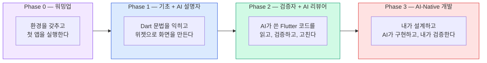

# AI-Native Flutter — 비전공자를 위한 AI 시대의 모바일 앱 개발
{: .no_toc }

AI와 함께 Flutter를 배우는 과정입니다. 스마트폰 앱을 한 번도 만들어본 적 없어도 괜찮습니다.
{: .fs-6 .fw-300 }

---

## 이 과정이 특별한 이유

기존의 앱 개발 교육은 Android와 iOS를 따로 배워야 했습니다. 각각 다른 언어, 다른 도구, 두 배의 시간이 필요했죠.  
이 과정은 다릅니다. **Flutter 하나로 Android, iOS, Web을 모두 만들고**, AI를 학습 파트너로 활용하되, 기초 역량은 반드시 직접 만들어갑니다.

> AI는 "거의 맞는" 코드를 빠르게 만들지만,  
> "정확히 맞는" 앱을 만드는 건 여전히 사람의 몫입니다.  
> — AI-Native 개발의 핵심 원칙

## 학습 대상

- 스마트폰 앱을 만들고 싶은 **비전공자**
- 프로그래밍 경험이 전혀 없어도 괜찮습니다
- "앱 하나 만들어보고 싶다"는 마음이 있으면 충분합니다

## 학습 형식

- **5일 집중 대면 교육** (1일 8시간 × 5일 = 40시간)
- 강사 시연을 보고 따라하며, 매일 하나의 완성된 앱을 만들어갑니다
- 매일의 학습 속도와 이해도에 따라 유연하게 진행합니다

| Day | 핵심 주제 | 오늘의 산출물 |
|-----|----------|-------------|
| **Day 1** | 환경 구축 + Dart 기초 | 첫 Flutter 앱 실행 |
| **Day 2** | Dart 심화 + 위젯 기초 | 나만의 자기소개 카드 앱 |
| **Day 3** | 레이아웃 + 상태 관리 | 인터랙티브 카운터/ToDo 앱 |
| **Day 4** | API 연동 + AI-Native 워크플로우 | 날씨 조회 앱 |
| **Day 5** | 캡스톤 프로젝트 + 발표 | 자유 주제 모바일 앱 |

## 전체 흐름

## 과정 구조

### Phase 0: 워밍업
{: .text-purple-000 }

| 장 | 제목 | 핵심 내용 |
|----|------|-----------|
| 00 | [모바일 앱이란? + 환경 구축](/ai-native-flutter/setup) | Flutter/Dart 소개, SDK 설치, 에뮬레이터 설정 |
| 01 | [첫 Flutter 앱 만들기](/ai-native-flutter/first-app) | flutter create, Hot Reload, 프로젝트 구조 이해 |

### Phase 1: 기초 + AI 설명자
{: .text-blue-000 }

AI 사용 규칙: **설명 모드만** — 코드는 직접 쓰고, 모르는 개념만 AI에게 질문
{: .label .label-blue }

| 장 | 제목 | 핵심 내용 |
|----|------|-----------|
| 02 | [Dart — 변수와 데이터 타입](/ai-native-flutter/dart-variables) | var/int/String/bool, const/final, Null Safety |
| 03 | [Dart — 조건문과 반복문](/ai-native-flutter/dart-control-flow) | if/else, switch, for, while |
| 04 | [Dart — 함수](/ai-native-flutter/dart-functions) | 선언, 매개변수, Named Parameters, 화살표 함수 |
| 05 | [Dart — 컬렉션](/ai-native-flutter/dart-collections) | List, Map, 반복/변환 메서드 |
| 06 | [Dart — 클래스와 객체](/ai-native-flutter/dart-classes) | class, constructor, extends, StatelessWidget |
| 07 | [Flutter 위젯 기초](/ai-native-flutter/widgets-basics) | Text, Container, Button, 위젯 트리 |

Phase 1 관문: AI 없이 Dart 변수, 함수, 클래스를 작성할 수 있어야 합니다.
{: .label .label-yellow }

### Phase 2: 검증자 + AI 리뷰어
{: .text-green-000 }

AI 사용 규칙: **생성 + 검증 모드** — AI가 코드를 만들고, 내가 읽고 고치고 테스트한다
{: .label .label-green }

| 장 | 제목 | 핵심 내용 |
|----|------|-----------|
| 08 | 레이아웃 위젯 | Row, Column, Stack, Expanded |
| 09 | 상태 관리 입문 | StatefulWidget, setState, 카운터 앱 |
| 10 | 리스트 UI + 네비게이션 | ListView, Navigator, 화면 이동 |
| 11 | 미니 프로젝트: ToDo 앱 | 요구사항 → AI 생성 → 테스트 → 수정 |

Phase 2 관문: AI가 생성한 Flutter 코드에서 버그 2개 이상을 찾아 설명할 수 있어야 합니다.
{: .label .label-yellow }

### Phase 3: AI-Native 개발
{: .text-red-000 }

AI 사용 규칙: **완전 페어 프로그래밍** — 내가 설계하고 AI가 구현, 테스트로 검증
{: .label .label-red }

| 장 | 제목 | 핵심 내용 |
|----|------|-----------|
| 12 | API 연동 + http 패키지 | Future, async/await, JSON 파싱 |
| 13 | 상태 관리 심화 (Provider) | 전역 상태, ChangeNotifier |
| 14 | flutter_test + AI TDD | 위젯 테스트, 골든 테스트 |
| 15 | 통합 프로젝트: 날씨 앱 | 전체 AI-Native 파이프라인 |
| 16 | 캡스톤: 자유 주제 앱 | 독립 AI-Native 실행 |

## 사용 도구

| 도구 | 용도 | 도입 시점 |
|------|------|----------|
| VS Code | 코드 편집기 | 00장부터 |
| Flutter SDK | Flutter/Dart 실행 환경 | 00장부터 |
| Android Studio / Xcode | 에뮬레이터/시뮬레이터 | 00장부터 |
| DartPad | 브라우저 기반 Dart 연습 | 02장부터 |
| GitHub Copilot (Free) | AI 코드 어시스턴트 | 09장부터 |
| flutter_test | 위젯 테스트 프레임워크 | 14장부터 |

## AI 사용 규칙 — 단계별 가이드

| Phase | AI 역할 | 허용 | 금지 |
|-------|---------|------|------|
| 0 | 선생님 | 개념 질문 | 코드 생성 요청 |
| 1 | 설명자 | 코드/에러 설명 요청 | 코드 생성 요청 |
| 2 | 리뷰어 | 코드 생성 + 학습자 검증 | 검증 없이 복붙 |
| 3 | 파트너 | 전체 AI-Native 워크플로우 | — |

## 콘텐츠 로드맵

각 챕터에는 다음과 같은 표시가 있습니다:

| 표시 | 의미 |
|------|------|
| ⭐ **핵심** | 반드시 다루는 내용 |
| 🚀 **도전** | 여유가 있을 때 도전하면 좋은 내용 |
| 📖 **더 알아보기** | 수업 후 스스로 더 탐구할 수 있는 내용 |
| 💪 **보너스 챌린지** | 빠른 학습자를 위한 추가 과제 |

---
