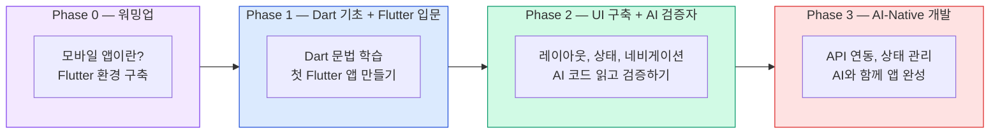

# AI-Native Flutter 교육설계 — 다중 페르소나 비판적 분석 보고서

## 비전공자 대상 Flutter 과정 설계를 위한 종합 분석

> **목적:** 비전공자를 대상으로 한 AI-Native Flutter 교육과정 신규 설계  
> **참조 모델:** 12_ai_native_javascript (4 Phase, 프로젝트 기반, AI 점진적 도입)  
> **대상:** 프로그래밍 경험 없는 비전공자  
> **환경:** Windows + macOS 동시 지원  
> **분석일:** 2026-04-19

---

## 1. 리서치 요약

### Flutter/Dart 현황 (2026년 4월 기준)

| 항목 | 내용 |
|------|------|
| Flutter 안정 버전 | 3.41.5 (분기별 릴리스) |
| Dart 안정 버전 | 3.11.0 |
| Material Design | Material 3 기본값 |
| 상태 관리 트렌드 | setState → Provider → Riverpod 3.0 |
| AI 도구 지원 | Copilot/Cursor Dart 지원 우수, Flutter MCP 서버 실험적 |
| 테스트 | flutter_test (Unit+Widget), integration_test (E2E) |

### 기존 교육 시장 벤치마크

| 플랫폼 | 특징 | 대상 |
|--------|------|------|
| App Brewery (Angela Yu) | 12주 부트캠프, 경험 제로부터 | 비전공자 |
| 노마드 코더 | 프로젝트 기반 (투두, 뽀모도로, 틱톡 클론) | 초급자 |
| FastCampus | 90시간, 15개 프로젝트 | 초중급자 |
| CompileCamp | 8주 무료, 4개 실전 앱 | 초급자 |

### Windows vs macOS 환경 차이

| 항목 | Windows | macOS |
|------|---------|-------|
| Android 빌드 | ✅ | ✅ |
| iOS 빌드 | ❌ | ✅ (Xcode 필요) |
| Web 빌드 | ✅ | ✅ |
| 에뮬레이터 | Android 에뮬레이터 | Android + iOS 시뮬레이터 |
| IDE | Android Studio / VS Code | 동일 |

> **교육과정 핵심 결정:** Android + Web을 공통 타겟으로 설정. iOS는 macOS 사용자만 선택적 추가.

---

## 2. 커리큘럼 초안 — 19개 챕터, 4 Phase

### Phase 구조



### 전체 챕터 구성

| 장 | 제목 | Phase | 핵심 내용 |
|----|------|-------|-----------|
| **00** | AI-Native Flutter 과정 소개 | - | 과정 구조, 도구 소개, Phase 설명 |
| **01** | 모바일 앱이란? + 환경 구축 | P0 | Flutter/Dart 소개, SDK 설치, 에뮬레이터 설정 |
| **02** | 첫 Flutter 앱 실행하기 | P0 | flutter create, Hot Reload, 프로젝트 구조 이해 |
| **03** | Dart 기초 — 변수와 데이터 타입 | P1 | var, int, double, String, bool, const/final |
| **04** | Dart 기초 — 조건문과 반복문 | P1 | if/else, switch, for, while |
| **05** | Dart 기초 — 함수 | P1 | 함수 선언, 매개변수, 반환값, 화살표 함수 |
| **06** | Dart 기초 — 컬렉션 | P1 | List, Map, Set, 반복, spread 연산자 |
| **07** | Dart 기초 — 클래스와 객체 | P1 | 클래스, 생성자, 속성, 메서드, 상속 기초 |
| **08** | Flutter 위젯 기초 | P1 | Text, Container, Icon, Image, MaterialApp, Scaffold |
| **09** | 레이아웃 — Row, Column, Expanded | P2 | Flex 레이아웃, MainAxis/CrossAxis, SizedBox, Padding |
| **10** | 상태 관리 입문 — StatefulWidget + setState | P2 | Stateless vs Stateful, setState, 카운터 앱 |
| **11** | AI 도구 설정 + AI 코드 평가법 | P2 | Copilot 설치, AI 코드 읽기, Bug Hunt |
| **12** | 사용자 입력과 폼 | P2 | TextField, Form, TextEditingController, 유효성 검사 |
| **13** | 미니 프로젝트 — BMI 계산기 | P2 | 요구사항 → AI 생성 → 검증 → 테스트 |
| **14** | 네비게이션과 라우팅 | P2 | Navigator.push/pop, Named Routes, 화면 간 데이터 전달 |
| **15** | ListView와 GridView | P2 | 스크롤 목록, ListView.builder, GridView, 카드 UI |
| **16** | 비동기와 API 호출 | P3 | async/await, Future, http 패키지, JSON 파싱 |
| **17** | Custom Instructions + Prompt Files | P3 | AI에게 Flutter 규칙 알려주기, 프롬프트 템플릿 |
| **18** | 테스트 입문 + TDD | P3 | flutter_test, Widget 테스트, TDD 사이클 |
| **19** | Provider 상태 관리 | P3 | ChangeNotifier, Consumer, 전역 상태 관리 |
| **20** | 통합 프로젝트 — 날씨 앱 | P3 | API + Provider + 네비게이션 + 테스트 전체 파이프라인 |
| **21** | 통합 프로젝트 — 할일 관리 앱 | P3 | CRUD + 로컬 저장소 + Provider + 독립 AI-Native 실행 |

---

## 3. 다중 페르소나 비판적 검토

### 페르소나 A: 모바일 앱 부트캠프 강사 (비전공자 대상 5년 경력)

> *"Flutter는 JavaScript보다 진입 장벽이 높습니다. Dart + OOP + 위젯 트리를 한 번에 소화시키면 Day 2에 절반이 포기합니다."*

#### 핵심 지적

1. **Dart 기초에 5개 챕터(03-07)는 적절하나, OOP(07장)가 관건**
   - JavaScript 과정에서는 OOP를 다루지 않았음 → Flutter에서는 피할 수 없음
   - `class Widget extends StatelessWidget`을 이해하려면 클래스/상속이 필수
   - 비전공자에게 OOP는 **가장 높은 벽** — "왜 필요한지"를 먼저 보여줘야 함
   - **제안:** 07장을 "이론 먼저"가 아닌 "Flutter 위젯이 왜 class인지"와 연결하여 설명. 추상적 OOP 용어(다형성, 캡슐화)는 제거하고, `class = 설계도`, `객체 = 실제 물건` 비유만 사용

2. **환경 설정이 JavaScript보다 10배 복잡**
   - JavaScript: VS Code + Node.js → 15분
   - Flutter: SDK + Android Studio + 에뮬레이터 + HAXM/Hyper-V → **최소 1-2시간**
   - Windows에서 HAXM 설치 실패, 에뮬레이터 느림 등 트러블슈팅 빈발
   - **제안:** 01장을 **절대 압축하지 말고 충분한 분량** 배정. 트러블슈팅 섹션 필수. 백업으로 DartPad + Flutter Web 사용

3. **프로젝트 배치가 핵심 — BMI 계산기(13장)가 첫 프로젝트로 적절**
   - BMI 계산기: 입력 → 계산 → 결과 표시 → 간단한 UI
   - 날씨 앱(20장)보다 훨씬 단순하여 성취감 확보에 적합
   - **제안:** 더 이른 챕터에 "초미니 프로젝트"(카운터 앱 커스터마이징) 배치 권장

4. **Widget 트리의 중첩(nesting)이 공포감을 유발**
   ```dart
   // 이런 코드가 비전공자에게는 "괄호 지옥"
   Scaffold(
     appBar: AppBar(title: Text('Hello')),
     body: Center(
       child: Column(
         children: [
           Text('Welcome'),
           ElevatedButton(onPressed: () {}, child: Text('Click')),
         ],
       ),
     ),
   )
   ```
   - **제안:** "위젯 트리 = 레고 블록 조립"으로 비유. 한 번에 깊이 3단계 이상 보여주지 않기. Copilot이 생성한 위젯 트리를 "읽는 연습"부터 시작

5. **Provider(19장)가 비전공자에게 과도할 수 있음**
   - setState로 충분한 범위를 먼저 확인하고, Provider는 "여러 화면에서 같은 데이터를 쓸 때" 필요성을 체감시킨 후 도입
   - **제안:** Provider는 🚀 도전 또는 통합 프로젝트 내에서 "필요할 때 배우기"로 전환 가능

---

### 페르소나 B: 비전공자 수강생 (대학교 2학년 디자인과)

> *"앱을 만들고 싶어서 왔는데, Dart 문법만 5개 챕터나 하면 지루해서 포기할 것 같아요."*

#### 핵심 지적

1. **"내 폰에서 돌아간다"가 최고의 동기부여**
   - 웹 개발은 브라우저에서만 결과 확인 → Flutter는 **실제 폰에서 실행** 가능
   - 이 장점을 **과정 초반에 극대화**해야 함
   - **제안:** 02장에서 에뮬레이터뿐 아니라 **실기기 연결** 방법도 안내. "내 폰에 내가 만든 앱이 뜨는 순간"이 전환점

2. **Dart 문법 5챕터(03-07) 연속은 "코딩 학원" 느낌**
   - "변수 → 조건문 → 반복문 → 함수 → 클래스" 순서는 CS 전공과 동일
   - 디자인과 학생 입장: "이걸 왜 배우는 건지 안 보여요"
   - **제안:** 각 Dart 챕터마다 **Flutter 미리보기**를 1개씩 넣기
     - 03장(변수): "앱 제목을 변수로 바꿔보기"
     - 04장(조건문): "버튼 색상을 조건에 따라 바꾸기"
     - 05장(함수): "버튼 클릭 시 동작하는 함수 만들기"
     - 이렇게 하면 "이 문법이 앱에서 이렇게 쓰이는구나" 연결

3. **디자인과 출신의 강점 — UI 구축에서 흥미 폭발**
   - 09장(레이아웃)부터 시각적 결과물이 바로 보임 → 동기 급상승
   - Material 3의 색상, 폰트, 아이콘 커스터마이징이 디자인 전공자에게 매력적
   - **제안:** 09장에 "나만의 프로필 카드 꾸미기" 미니 과제 추가

4. **"에뮬레이터가 너무 느려요" — 학습 흐름 끊김의 주범**
   - Android 에뮬레이터 첫 실행: 2-5분 (저사양 PC에서 10분+)
   - Hot Reload는 빠르지만 에뮬레이터 자체가 느리면 의미 없음
   - **제안:** 수업 시작 전 에뮬레이터 미리 실행 안내. 대안으로 실기기 USB 연결 또는 Flutter Web(`flutter run -d chrome`) 제공

5. **할일 관리 앱(21장)보다 "인스타 피드" 같은 프로젝트가 더 끌림**
   - 할일 앱은 모든 프로그래밍 강의에서 나옴 → "또 ToDo?"
   - **제안:** 21장을 "할일 앱" 대신 **"나만의 갤러리/포트폴리오 앱"**으로 변경 고려. GridView + 이미지 + 좋아요 기능 → 디자인 전공자에게 더 매력적

---

### 페르소나 C: Flutter 실무 개발자 (스타트업 3년차)

> *"비전공자에게 Provider까지 가르치는 건 훌륭합니다. 다만 Dart 기초에서 null safety를 빠뜨리면 안 됩니다."*

#### 핵심 지적

1. **Dart의 Null Safety는 실무 필수 — 반드시 포함**
   - Dart 3.x에서 null safety는 기본
   - `String?`, `!`, `??`, `late` 등을 이해하지 못하면 Copilot이 생성한 코드도 읽을 수 없음
   - **제안:** 03장(변수)에서 `String?`과 `??`를 간단히 소개. 깊은 이론은 불필요하지만 "?는 비어있을 수 있다는 표시"는 필수

2. **`pubspec.yaml` 의존성 관리를 반드시 다뤄야**
   - JavaScript의 `package.json`에 해당
   - 16장(API 호출) 이전에 `flutter pub add http` 를 자연스럽게 경험시켜야 함
   - **제안:** 01장 또는 02장에서 pubspec.yaml 구조를 간단히 소개하고, 이후 필요할 때마다 패키지 추가 실습

3. **Hot Reload vs Hot Restart 차이를 명확히**
   - 비전공자가 "왜 내 변경이 반영 안 돼요?"라고 자주 질문
   - `r` = Hot Reload (UI 변경), `R` = Hot Restart (상태 초기화)
   - **제안:** 02장에서 명확히 구분하고, 이후 챕터에서 반복 강조

4. **async/await + FutureBuilder 조합이 Flutter의 핵심**
   - JavaScript의 `fetch + .then()`보다 Flutter의 `FutureBuilder`가 더 직관적일 수 있음
   - 하지만 `snapshot.hasData`, `snapshot.error` 패턴이 처음에는 낯선 구문
   - **제안:** 16장에서 FutureBuilder를 "데이터 로딩 패턴"이라는 레시피로 제공. 이론보다 패턴 암기 우선

5. **테스트(18장) 위치가 적절**
   - flutter_test의 Widget 테스트가 Unit 테스트보다 직관적
   - `find.text('Hello')`, `tester.tap()` 같은 API가 비전공자도 이해하기 쉬움
   - **제안:** Widget 테스트 중심으로 진행. Unit 테스트는 순수 Dart 로직에만 적용. Integration 테스트는 심화로 분류

6. **SharedPreferences로 로컬 저장을 다뤄야**
   - 날씨 앱의 검색 기록, 할일 앱의 데이터 유지에 필수
   - SQLite(sqflite)는 비전공자에게 과도 → SharedPreferences가 적절
   - **제안:** 21장(할일 앱)에서 SharedPreferences 도입. JSON encode/decode와 함께 사용

---

### 페르소나 D: 교육공학 전문가 (Instructional Design)

> *"JavaScript 과정의 Phase 시스템은 훌륭했지만, Flutter에서는 Phase 1이 더 길어져야 합니다."*

#### 핵심 지적

1. **Phase 1(Dart 기초)의 비중이 JavaScript 과정보다 커야 하는 이유**

   | 비교 | JavaScript 과정 | Flutter 과정 |
   |------|---------------|-------------|
   | 언어 학습 | HTML/CSS/JS 동시 (6챕터) | **Dart만 5챕터 필요** |
   | OOP | 불필요 | **필수** (위젯 = 클래스) |
   | 결과 확인 | 브라우저 즉시 | **에뮬레이터 실행 대기** |
   | 타입 시스템 | 동적 타입 (느슨) | **정적 타입 + Null Safety** |

   - JavaScript는 `console.log("Hello")`로 바로 시작 가능
   - Flutter는 `void main() => runApp(MaterialApp(...))`이 최소 코드 → 진입 장벽이 높음
   - **제안:** Phase 0를 확장하여 02장에서 "flutter create로 자동 생성된 코드를 수정해보기"로 시작. 코드를 처음부터 작성하지 않고 **기존 코드를 수정하는 것**부터 시작

2. **"I Do → We Do → You Do" 패턴의 Flutter 적용**
   - **I Do (강사 시연)**: 위젯 트리 구조를 시각적으로 보여주기 (Flutter Inspector 활용)
   - **We Do (함께)**: 기존 앱의 색상/텍스트/레이아웃을 함께 변경
   - **You Do (혼자)**: 유사한 화면을 독립적으로 구성
   - **제안:** 모든 실습에 "시작 코드(starter code)"를 제공. 빈 파일에서 시작하면 비전공자가 위젯 트리를 처음부터 쓰는 것이 불가능

3. **스캐폴딩 전략 — Flutter는 더 강화해야**

   | 레벨 | 방식 | 예시 |
   |------|------|------|
   | 기본 | 빈칸 채우기 | `Text(/* 여기에 이름 입력 */)` |
   | 도전 | 속성 수정 | `Container`의 색상, 크기, 패딩 변경 |
   | 심화 | 처음부터 작성 | 프로필 카드 위젯 전체 작성 |

   - JavaScript의 `<button onclick="">` 보다 Flutter의 `ElevatedButton(onPressed: () {})`이 구문적으로 복잡 → 스캐폴딩 필수

4. **인지 부하 관리 — "위젯 3개씩" 규칙**
   - 한 챕터에서 새로운 위젯을 **최대 3개**만 소개
   - 08장: Text, Container, Icon (3개)
   - 09장: Row, Column, Expanded (3개)
   - 한 번에 5개 이상 소개하면 비전공자는 혼동

5. **DartPad를 Phase 0-1의 백업 환경으로 활용**
   - [dartpad.dev](https://dartpad.dev)에서 Dart + Flutter 코드를 브라우저에서 바로 실행 가능
   - 환경 설정 없이 Dart 문법 학습 가능
   - **제안:** 03-07장(Dart 기초)은 DartPad로도 진행 가능하도록 설계. 에뮬레이터 문제 시 즉시 전환

---

### 페르소나 E: AI-Native 개발 전도사 (Vibe Coding 전문가)

> *"Flutter야말로 AI-Native 개발의 최적 대상입니다. 위젯 트리는 구조화되어 있어서 AI가 생성하기 가장 쉬운 코드입니다."*

#### 핵심 지적

1. **Flutter 위젯 = AI 코드 생성의 이상적 구조**
   - HTML/CSS는 구조와 스타일이 분리 → AI가 맥락 유지 어려움
   - Flutter 위젯 트리는 **구조, 스타일, 로직이 하나의 트리에 통합** → AI 생성 정확도 높음
   - Copilot의 Flutter 코드 생성 품질이 JavaScript보다 높다는 평가
   - **제안:** Phase 2부터 "위젯 트리를 프롬프트로 설명하고 AI가 생성"하는 패턴 적극 활용

2. **AI 사용 규칙의 Phase별 차별화**

   | Phase | AI 역할 | Flutter에서의 구체적 활용 |
   |-------|---------|------------------------|
   | 0 | 설명자 | "Flutter란 무엇인가" 질문만 |
   | 1 | 코드 설명자 | Dart 문법 질문, 에러 메시지 해석 |
   | 2 | 위젯 생성자 | AI가 위젯 트리 생성 → 학생이 읽고 수정 |
   | 3 | 구현 파트너 | 요구사항 작성 → AI가 전체 화면 구현 → 테스트로 검증 |

3. **Flutter MCP 서버가 2026년에 실험적으로 사용 가능**
   - Dart팀이 개발한 MCP 서버: AI 에이전트가 `flutter run`, `flutter pub add`, `flutter analyze` 직접 실행
   - 아직 실험적이지만, 심화 과제로 소개할 가치 있음
   - **제안:** 17장(Custom Instructions)에서 Flutter용 Instructions 작성 + MCP 서버 맛보기(📖 더 알아보기)

4. **Widget 테스트가 AI-Native TDD의 최적 시나리오**
   ```dart
   // AI에게 이 테스트를 주고 구현을 요청
   testWidgets('카운터 증가 테스트', (tester) async {
     await tester.pumpWidget(MyApp());
     expect(find.text('0'), findsOneWidget);
     await tester.tap(find.byIcon(Icons.add));
     await tester.pump();
     expect(find.text('1'), findsOneWidget);
   });
   ```
   - Widget 테스트의 `find.text()`, `tester.tap()` 문법이 **자연어에 가까움**
   - 비전공자도 "0이라는 텍스트가 있어야 하고, + 버튼을 누르면 1이 되어야 한다"를 이해 가능
   - **제안:** 18장(테스트)에서 Widget 테스트 중심 TDD를 핵심으로 배치

5. **Cursor IDE가 Flutter 개발에 특히 유리**
   - Cursor의 Composer 기능으로 "로그인 화면 만들어줘" → 전체 위젯 트리 생성
   - VS Code + Copilot보다 **대화형 코드 생성**에 강점
   - **제안:** VS Code + Copilot을 주 도구로 유지하되, Cursor를 📖 더 알아보기로 소개

---

## 4. 페르소나 간 교차 합의

### 5개 페르소나 공통 합의 TOP 5

| 순위 | 합의 사항 | 동의 | 비고 |
|------|----------|------|------|
| 1 | **환경 설정(01장)에 충분한 시간 배정 + DartPad 백업** | A,B,D,E | JavaScript보다 10배 복잡 |
| 2 | **Dart 기초 챕터마다 Flutter 미리보기를 연결** | A,B,D | "왜 이걸 배우는지" 동기부여 |
| 3 | **OOP(07장)는 Flutter 위젯과 연결하여 설명** | A,C,D | 추상 이론 제거, 실용 중심 |
| 4 | **위젯 트리 스캐폴딩(starter code) 필수** | A,B,D | 빈 파일 시작은 비전공자 불가능 |
| 5 | **Widget 테스트 중심 TDD가 Flutter AI-Native의 핵심** | C,E | find.text() 문법이 직관적 |

### 페르소나 간 의견 충돌 및 조율

| 쟁점 | 찬성 측 | 반대 측 | 조율안 |
|------|---------|---------|--------|
| Provider 포함 여부 | C(실무 필수), E(AI 활용) | A(시간), B(어려움) | 19장에 포함하되 🚀 도전으로. 통합 프로젝트에서 선택적 사용 |
| IDE 선택 (AS vs VSC) | A(AS의 Inspector) | B(가벼움), E(Cursor) | **VS Code + Copilot** 기본, AS의 에뮬레이터만 활용. Cursor는 참고 |
| Dart 기초 챕터 수 (5개 vs 3개) | C(null safety 등 필수), D(충분한 기초) | B(지루함) | 5개 유지, 각 챕터에 Flutter 실습 1개씩 연결하여 지루함 방지 |
| 21장 프로젝트 (할일 vs 갤러리) | C(CRUD 학습에 최적) | B(흥미) | **할일 앱 유지** — CRUD + SharedPreferences 학습에 필수. "나만의 스타일로 꾸미기"로 흥미 보완 |
| Firebase 포함 여부 | 기존 벤치마크 과정 | A,D(분량 과다) | **미포함** — 이 과정은 "기초 ~ AI-Native 입문"까지. Firebase는 별도 심화 과정 |

---

## 5. 최종 커리큘럼 설계안

### 5.1 확정 챕터 구성 (19챕터 + 개요 + 강사 가이드)

#### Phase 0: 워밍업 (2챕터)

| 장 | 제목 | 핵심 내용 | 비고 |
|----|------|-----------|------|
| 00 | 과정 소개 | 과정 구조, Phase 설명, 도구 소개 | 개요 |
| 01 | 모바일 앱이란? + 환경 구축 | Flutter/Dart 소개, SDK + VS Code 설치, 에뮬레이터 설정, DartPad 백업 | Win+Mac 동시 안내 |
| 02 | 첫 Flutter 앱 만들기 | flutter create, 자동 생성 코드 구조 이해, Hot Reload 체험, 텍스트/색상 수정 | "내 폰에서 실행" 체험 |

#### Phase 1: Dart 기초 + Flutter 입문 (6챕터)

| 장 | 제목 | 핵심 내용 | Flutter 연결 실습 |
|----|------|-----------|------------------|
| 03 | Dart — 변수와 데이터 타입 | var, int, String, bool, const/final, Null Safety(?/??) 기초 | 앱 제목을 변수로 변경 |
| 04 | Dart — 조건문과 반복문 | if/else, for, while, switch | 버튼 색상 조건부 변경 |
| 05 | Dart — 함수 | 선언, 매개변수, 반환값, 화살표 함수 | onPressed 콜백 작성 |
| 06 | Dart — 컬렉션 | List, Map, Set, spread, where/map | 리스트 데이터로 UI 생성 |
| 07 | Dart — 클래스와 객체 | 클래스 = 위젯의 설계도, 생성자, 속성, 상속 기초 | StatelessWidget 직접 만들기 |
| 08 | Flutter 위젯 기초 | Text, Container, Icon, Image, AppBar, Scaffold, MaterialApp | 자기소개 카드 만들기 |

#### Phase 2: UI 구축 + AI 검증자 (7챕터)

| 장 | 제목 | 핵심 내용 |
|----|------|-----------|
| 09 | 레이아웃 — Row, Column, Expanded | Flex 레이아웃, MainAxis/CrossAxis, SizedBox, Padding, 위젯 트리 읽기 |
| 10 | 상태 관리 입문 — setState | Stateless vs Stateful, setState, 카운터 앱 커스터마이징 |
| 11 | AI 도구 설정 + AI 코드 평가법 | Copilot 설치, AI 위젯 생성, Bug Hunt, 코드 리딩 체크리스트 |
| 12 | 사용자 입력과 폼 | TextField, Form, TextEditingController, 유효성 검사, 키보드 처리 |
| 13 | **미니 프로젝트 — BMI 계산기** | 요구사항 → AI 생성 → 검증 → 테스트 (Phase 2 관문) |
| 14 | 네비게이션과 라우팅 | Navigator.push/pop, 화면 전환, 화면 간 데이터 전달 |
| 15 | ListView와 GridView | 스크롤 목록, ListView.builder, GridView, 카드 UI, 이미지 표시 |

#### Phase 3: AI-Native 개발 (6챕터)

| 장 | 제목 | 핵심 내용 |
|----|------|-----------|
| 16 | 비동기와 API 호출 | async/await, Future, http 패키지, JSON 파싱, FutureBuilder |
| 17 | Custom Instructions + Prompt Files | Flutter용 AI 규칙 설정, 프롬프트 템플릿, Context Engineering |
| 18 | 테스트 입문 + TDD | flutter_test, Widget 테스트, Red-Green-Refactor, AI TDD |
| 19 | 🚀 Provider 상태 관리 | ChangeNotifier, Consumer, MultiProvider (도전/선택) |
| 20 | **통합 프로젝트 — 날씨 앱** | API + FutureBuilder + 네비게이션 + Instructions + 테스트 |
| 21 | **통합 프로젝트 — 할일 관리 앱** | CRUD + SharedPreferences + (Provider) + 독립 AI-Native 실행 |

### 5.2 JavaScript 과정 대비 주요 차이점

| 항목 | JavaScript 과정 (17챕터) | Flutter 과정 (21챕터) | 차이 이유 |
|------|------------------------|---------------------|----------|
| 언어 기초 | 6챕터 (변수~객체심화) | **5챕터 + OOP 필수** | Dart의 정적 타입 + OOP 필수 |
| 환경 설정 | 15분 (Node.js) | **1-2시간** (SDK+에뮬레이터) | 모바일 개발 환경의 복잡성 |
| UI 구축 | DOM 조작 (1챕터) | **위젯+레이아웃 (3챕터)** | 위젯 트리 개념이 더 복잡 |
| 상태 관리 | localStorage만 | **setState + Provider** | 앱 상태 관리가 핵심 |
| 테스트 | Vitest | **flutter_test** | Widget 테스트가 직관적 |
| 프로젝트 | ToDo + 날씨 + 영화 | **BMI + 날씨 + 할일** | 난이도 단계별 차별화 |

### 5.3 파일 구조

```
docs/14_ai_native_flutter/
├── 00_ai_native_flutter.md          ← 과정 개요
├── 01_모바일앱과_환경구축.md
├── 02_첫_Flutter_앱.md
├── 03_Dart_변수와_타입.md
├── 04_Dart_조건문과_반복문.md
├── 05_Dart_함수.md
├── 06_Dart_컬렉션.md
├── 07_Dart_클래스와_객체.md
├── 08_Flutter_위젯_기초.md
├── 09_레이아웃.md
├── 10_상태관리_입문.md
├── 11_AI_도구와_코드평가.md
├── 12_사용자_입력과_폼.md
├── 13_미니프로젝트_BMI계산기.md
├── 14_네비게이션.md
├── 15_ListView와_GridView.md
├── 16_비동기와_API.md
├── 17_Custom_Instructions.md
├── 18_테스트와_TDD.md
├── 19_Provider_상태관리.md
├── 20_통합프로젝트_날씨앱.md
├── 21_통합프로젝트_할일앱.md
├── _강사용_운영가이드.md             ← nav_exclude
├── 교육설계_다중페르소나_분석보고서.md ← nav_exclude (이 파일)
└── img/
```

### 5.4 AI 사용 규칙 (Phase별)

| Phase | AI 역할 | 허용 | 금지 |
|-------|---------|------|------|
| 0 | 선생님 | Flutter/Dart 개념 질문 | 코드 생성 요청 |
| 1 | 설명자 | Dart 문법 질문, 에러 해석 | 코드 생성 요청 |
| 2 | 위젯 생성자 | AI가 위젯 트리 생성 → 학생 검증 | 검증 없이 복붙 |
| 3 | 구현 파트너 | 전체 AI-Native 워크플로우 | — |

### 5.5 사용 도구

| 도구 | 용도 | 도입 시점 |
|------|------|----------|
| VS Code | 코드 편집기 | 01장 |
| Flutter SDK | 앱 빌드 및 실행 | 01장 |
| DartPad | Dart 문법 연습 (브라우저) | 01장 (백업) |
| Android 에뮬레이터 | 앱 실행/테스트 | 01장 |
| GitHub Copilot (Free) | AI 코드 어시스턴트 | 11장 |
| flutter_test | 테스트 프레임워크 | 18장 |

---

## 6. 위험 관리

| 위험 | 확률 | 심각도 | 대응 |
|------|------|--------|------|
| 환경 설정 실패 (Flutter SDK/에뮬레이터) | 높음 | Critical | DartPad 백업 + 트러블슈팅 가이드 + 조교 순회 |
| 에뮬레이터 너무 느림 (저사양 PC) | 높음 | Major | 실기기 USB 연결 또는 Flutter Web 대체 |
| OOP 개념 이해 실패 | 중 | Major | "클래스 = 설계도" 비유, Flutter 위젯과 즉시 연결 |
| 위젯 트리 중첩 공포감 | 중 | Major | starter code 제공, 깊이 3단계 제한, "레고 비유" |
| Copilot 라이선스 미승인 | 중 | Minor | ChatGPT 또는 Cursor Free 백업 |
| Provider 이해 실패 | 중 | Minor | 🚀 도전으로 배치, setState만으로도 프로젝트 완성 가능 |
| Windows에서 iOS 테스트 불가 | 확실 | Minor | Android + Web 타겟으로 충분, iOS는 시연만 |

---

## 7. 결론

### 핵심 설계 원칙 3가지

1. **Dart 기초 ↔ Flutter 실습을 매 챕터 연결**
   - "문법만 5챕터" 대신 "문법 배우고 바로 앱에 적용"
   - 각 Dart 챕터 끝에 Flutter 미니 실습 1개씩 배치

2. **위젯 트리는 "읽기"부터 시작, "쓰기"는 Phase 2부터**
   - Phase 0-1: 자동 생성된 코드를 수정하기
   - Phase 2: AI가 생성한 위젯을 읽고 검증하기
   - Phase 3: 요구사항을 쓰고 AI가 위젯 트리를 생성, 테스트로 검증

3. **환경 설정의 안전망 — DartPad + Flutter Web + 실기기**
   - 에뮬레이터 실패 시 DartPad로 Dart 학습 계속
   - 에뮬레이터 느릴 때 Flutter Web 또는 USB 실기기 연결
   - **절대 환경 때문에 학습이 멈추지 않도록 설계**

### JavaScript 과정과의 관계

```
12_ai_native_javascript (웹 개발)          14_ai_native_flutter (모바일 개발)
├── Phase 0-1: JS 기초                     ├── Phase 0-1: Dart 기초 + OOP
├── Phase 2: DOM + AI 검증                 ├── Phase 2: 위젯 + AI 검증  
├── Phase 3: API + TDD + AI-Native         ├── Phase 3: API + TDD + AI-Native
├── 프로젝트: ToDo → 날씨 → 영화            ├── 프로젝트: BMI → 날씨 → 할일
└── 공통: Custom Instructions, Prompt Files, AI 사용 규칙 Phase 시스템
```

> **작성 방법론**: 5개 독립 페르소나(모바일 부트캠프 강사, 비전공자 수강생, Flutter 실무 개발자, 교육공학 전문가, AI-Native 전도사)가 각자의 관점에서 커리큘럼 초안을 독립 분석 후, 교차 합의를 통해 최종 설계안을 도출하였습니다.  
> **벤치마크**: App Brewery, Zero To Mastery, CompileCamp, FastCampus, 노마드 코더, Flutter 공식 문서, Dart 공식 문서를 비교 분석하였습니다.
