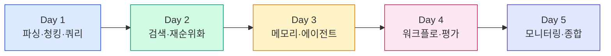
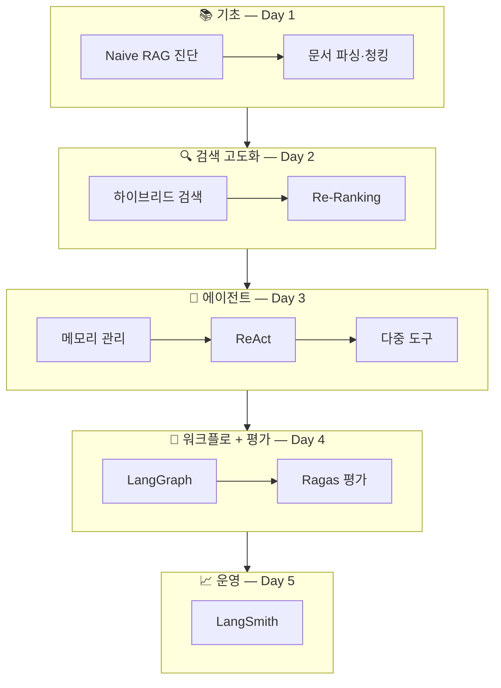

# RAG 시스템 구축 실전 (35hr)
{: .no_toc }

Naive RAG의 한계를 넘어, 프로덕션급 RAG 파이프라인을 직접 설계하고 평가·운영하는 5일 집중 과정입니다.
{: .fs-6 .fw-300 }

---

## 학습 목표

이 과정을 마치면 다음을 할 수 있습니다.

- Naive RAG의 한계를 진단하고, 적절한 기법으로 개선할 수 있다.
- 복잡한 행정 문서를 **문맥 보존 청킹**으로 파싱하고 메타데이터를 설계할 수 있다.
- **하이브리드 검색**(BM25 + Dense)과 **Re-Ranking**으로 검색 정확도를 끌어올릴 수 있다.
- **LangGraph**로 상태 관리·조건부 라우팅·자기검증(Self-RAG)을 갖춘 에이전트를 설계할 수 있다.
- **Ragas**로 RAG 시스템의 신뢰성을 정량 평가하고, **LangSmith**로 프로덕션을 모니터링할 수 있다.

## 대상과 선수지식

- **대상**: 고성능 AI 서비스를 직접 설계하여 RAG 기반 업무 자동화를 구현하고 싶은 엔지니어 (20명)
- **선수지식**: AI 챗봇 개발 경험 또는 관련 교육 수료자, 벡터 DB·임베딩 개념 이해자
- **방식**: 강의 20% / 실습 80%, 집합교육 5일(35hr)
- **장소**: 본사 교육관 Smart룸(2층)
- **비고**: 고용보험 환급과정(출석 80% 미만 미수료) · 개인별 구글 계정 필요

## 활용 도구 스택

| 영역 | 도구 |
|:---|:---|
| 언어/IDE | Python, VSCode, Google Colab |
| LLM API | OpenAI(GPT-4o), Anthropic Claude API |
| RAG 프레임워크 | LangChain, LangGraph |
| 벡터 DB | ChromaDB |
| 평가/모니터링 | Ragas, LangSmith |
| 보조 | scikit-learn, ChatGPT |

## 5일 커리큘럼



| 일자 | 시간 | 주제 | 챕터 | 비율 |
|:---:|:---:|:---|:---:|:---:|
| 1일차 (8H) | 09–12 | Naive RAG 한계점과 기술적 해결책 | Ch.01 | 강의30/실습70 |
|  | 13–18 | 복잡한 행정 문서 파싱 + HyDe·Semantic 청킹 | Ch.02 | 강의20/실습80 |
| 2일차 (8H) | 09–12 | 하이브리드 검색 구현 | Ch.03 | 강의20/실습80 |
|  | 13–15 | Re-Ranking으로 정확도 향상 | Ch.04 | 강의20/실습80 |
|  | 15–18 | Tool Calling과 다중 도구 에이전트 | Ch.05 | 강의20/실습80 |
| 3일차 (8H) | 09–12 | 대화 메모리와 챗봇 상태 관리 | Ch.06 | 강의20/실습80 |
|  | 13–15 | ReAct 패턴 AI 에이전트 | Ch.07 | 강의15/실습85 |
|  | 15–18 | 다중 도구 에이전트 심화 (실습 중심) | Ch.05/Ch.07 | 강의10/실습90 |
| 4일차 (8H) | 09–12 | LangGraph 워크플로우 제어 | Ch.08 | 강의25/실습75 |
|  | 13–15 | Ragas 기반 RAG 평가 | Ch.09 | 강의25/실습75 |
|  | 15–18 | 종합 프로젝트 (자기 도메인 RAG + Ragas 평가) | Ch.09 | 강의0/실습100 |
| 5일차 (3H) | 09–12 | LangSmith 모니터링 + 종합 프로젝트 발표 | Ch.10 | 강의10/실습+발표90 |

> 📝 **시간 배분 가이드** — 각 챕터는 일반적으로 다음 비율로 진행됩니다:
> 🧑‍🏫 강의 ~20% · 💻 함께 코딩 ~30% · 🔬 독립 실습 ~40% · 🗣 회고/Q&A ~10%

## 진행 흐름



## 환경 준비

수업 시작 전에 아래를 준비합니다.

### 1. uv 설치 (한 번만)

본 과정은 **[uv](https://docs.astral.sh/uv/)** 패키지 매니저를 사용합니다. pip보다 10–100배 빠르고, 가상환경·의존성 lockfile을 한 도구로 관리합니다.

```bash
# macOS / Linux
curl -LsSf https://astral.sh/uv/install.sh | sh

# Windows (PowerShell)
powershell -ExecutionPolicy ByPass -c "irm https://astral.sh/uv/install.ps1 | iex"

# 또는 Homebrew
brew install uv
```

설치 확인:

```bash
uv --version   # uv 0.5.x 이상 권장
```

### 2. 프로젝트 초기화 + 가상환경

```bash
# 작업 폴더 생성
mkdir rag-bootcamp && cd rag-bootcamp

# pyproject.toml + .venv 자동 생성 (Python 3.11)
uv init --python 3.11

# 가상환경은 uv가 자동 활성화하지만, 셸에서 직접 쓰려면:
source .venv/bin/activate           # macOS / Linux
# .venv\Scripts\activate             # Windows
```

> 💡 `uv run <명령>`을 쓰면 활성화 없이도 자동으로 `.venv`에서 실행됩니다.

### 3. 핵심 패키지 설치

본 과정은 **LangChain 1.2.x** + **LangGraph 1.1.x**(2026-05 기준 최신 stable)을 사용합니다.

```bash
uv add \
  "langchain>=1.2,<2.0" \
  "langchain-core>=1.3,<2.0" \
  "langchain-openai>=0.3" "langchain-anthropic>=0.3" "langchain-community>=0.3" \
  "langchain-chroma>=0.2" "langchain-text-splitters>=0.3" "langchain-experimental>=0.3" \
  "langchain-huggingface>=0.1" "langchain-cohere>=0.4" \
  "langgraph>=1.1,<2.0" "langgraph-checkpoint>=2.0" "langgraph-checkpoint-sqlite>=2.0" \
  "langsmith>=0.2" \
  chromadb datasets \
  "ragas>=0.2,<0.3" \
  rank-bm25 sentence-transformers kiwipiepy \
  pypdf python-docx unstructured pdfplumber \
  tavily-python python-dotenv \
  scikit-learn pandas
```

> 📌 **버전 호환 정리**
> - LangChain 1.2 ↔ LangGraph 1.1: 두 패키지의 메이저 버전 진행이 다릅니다. LangGraph는 현재 1.1.x가 stable이며 1.2는 미발매 상태입니다.
> - LangGraph 1.x에서 **`MemorySaver` → `InMemorySaver`** 권장(구 이름은 alias로 유지). 본 핸드북 Ch.06·08의 코드는 모두 작동하지만, 새 코드는 `InMemorySaver`를 사용하세요.
> - 버전 변경 가능성에 대비해 `uv.lock`을 git에 커밋하면 재현성이 보장됩니다.

`uv add`는 `pyproject.toml`에 의존성을 기록하고 `uv.lock` 파일을 생성·갱신합니다. 동일 환경 재현 시:

```bash
uv sync   # pyproject.toml + uv.lock 기반으로 .venv 재구성
```

> 💡 **pip가 익숙하다면**: `uv pip install ...` 형태도 지원됩니다. 단, `uv add`가 lockfile까지 관리해 권장됩니다.

### 3. API 키 설정

`.env` 파일을 만들어 다음 키를 등록합니다.

```bash
OPENAI_API_KEY=sk-...
ANTHROPIC_API_KEY=sk-ant-...
LANGCHAIN_API_KEY=lsv2_...
LANGCHAIN_TRACING_V2=true
LANGCHAIN_PROJECT=rag-system-bootcamp
COHERE_API_KEY=...           # Re-Ranking 실습용 (선택)
TAVILY_API_KEY=tvly-...      # Ch.05 웹 검색 도구 (무료 1000회/월)
```

코드 시작부에서 다음 한 줄로 로드합니다.

```python
from dotenv import load_dotenv
load_dotenv()  # .env의 키를 os.environ에 주입
```

> ⚠️ `.env` 파일은 절대 Git에 커밋하지 않습니다. `.gitignore`에 반드시 추가하세요.

### 5. 예상 API 비용

| 항목 | 인당(5일) | 비고 |
|:---|---:|:---|
| OpenAI (gpt-4o-mini + 임베딩) | $5–15 | 실습 반복 시 증가 |
| Cohere Rerank | $0–2 | 무료 크레딧 내 가능 |
| Tavily Web Search | $0 | 무료 1000회/월 |
| LangSmith | $0 | Developer 무료 티어 |
| **합계** | **약 $10–20** | OpenAI 조직에 daily limit 설정 권장 |

> 🔒 **사내 문서 → 외부 API 전송 주의**
>
> 실습용 샘플 데이터는 무방하지만, 실제 사내 문서로 작업할 경우:
> - OpenAI **Zero Data Retention(ZDR)** 옵션 또는 Azure OpenAI 사용 검토
> - **DPA(Data Processing Agreement)** 체결 확인
> - 개인정보·내부 기밀이 포함된 문서는 사전 마스킹 (PII 필터링)
> - API 키는 권한 최소화·정기 로테이션·접근 감사 로그

### 4. Colab을 사용하는 경우

Colab 환경에선 매 세션마다 패키지를 설치해야 합니다. 이때도 uv가 빠릅니다:

```python
!pip install -q uv
!uv pip install --system -q \
  langchain langchain-openai langchain-chroma langchain-text-splitters \
  langgraph langsmith chromadb datasets "ragas>=0.2" python-dotenv

from google.colab import userdata
import os
os.environ["OPENAI_API_KEY"] = userdata.get("OPENAI_API_KEY")
os.environ["LANGCHAIN_API_KEY"] = userdata.get("LANGCHAIN_API_KEY")
os.environ["LANGCHAIN_TRACING_V2"] = "true"
```

> Colab은 `--system` 플래그로 시스템 파이썬에 직접 설치 (.venv 불필요).

## 학습 산출물

각 챕터는 다음 형식으로 구성됩니다.

- **🎯 학습 목표** — 챕터 종료 시 도달할 능력
- **📖 핵심 개념** — 이론과 다이어그램
- **💻 실습** — 직접 실행 가능한 Python 코드
- **🧪 평가 체크포인트** — 이해도 점검 문제
- **🚀 Stretch Goal** — 더 나아가기 위한 도전 과제

## 챕터 목록

1. [Ch.01 RAG 개요와 Naive RAG 한계](./01_RAG_개요와_Naive_RAG_한계)
2. [Ch.02 문서 파싱과 청킹 전략](./02_문서_파싱과_청킹_전략)
3. [Ch.03 하이브리드 검색 구현](./03_하이브리드_검색)
4. [Ch.04 Re-Ranking으로 정확도 향상](./04_Re_Ranking)
5. [Ch.05 다중 도구 통합 AI 에이전트](./05_다중_도구_에이전트)
6. [Ch.06 대화 메모리와 챗봇 상태 관리](./06_대화_메모리)
7. [Ch.07 ReAct 패턴 AI 에이전트](./07_ReAct_패턴)
8. [Ch.08 LangGraph 워크플로우 제어](./08_LangGraph_워크플로우)
9. [Ch.09 Ragas 기반 RAG 평가와 자동화 파이프라인](./09_Ragas_평가)
10. [Ch.10 LangSmith 모니터링과 최적화](./10_LangSmith_모니터링)

---

## 평가와 수료 기준

### 점수 구성 (총 100점)

| 항목 | 배점 | 평가 방법 |
|:---|---:|:---|
| 출석 | 30 | 일자별 6점 × 5일 (지각 ½ 차감) |
| 챕터 체크포인트 | 30 | 10챕터 × 3점, 객관식 + 주관식 자기 답변 제출 |
| 실습 결과물 | 20 | 챕터 실습 코드 노트북 제출 (10챕터 × 2점) |
| 종합 프로젝트 | 20 | 5점 × 4항목 (아래 rubric) |

**수료 기준**: 출석 80% 이상 + 총점 60점 이상.

### 종합 프로젝트 Rubric

자기 도메인 문서 5건 이상으로 RAG를 구축하고 Ragas로 평가, Jupyter 노트북 1개 + 5분 발표.

| 항목 | 5점 | 3점 | 1점 |
|:---|:---|:---|:---|
| 데이터 준비 | 5건+ 다양한 형식, 메타데이터 설계 | 3건, 단일 형식 | 1건 |
| 검색 파이프라인 | Hybrid + Re-Ranking 적용 | Dense만 | Naive |
| 평가 | Ragas 4메트릭 + 진단 분석 | Ragas 일부 | 정성 평가만 |
| LangSmith 운영 | 트레이싱 + 데이터셋 + 알림 | 트레이싱만 | 미적용 |

### 행정 안내 (수료 및 환급)

- 본 과정은 **고용보험 환급과정**으로 운영됩니다.
- HRD-Net 등록 과정 번호 및 수료증 발급은 운영 담당자가 안내합니다.
- 출석 80% 미만 시 미수료 처리되며 환급이 제한됩니다.

성공적인 5일을 위해, 사전에 환경 준비를 마치고 시작하시기 바랍니다.
