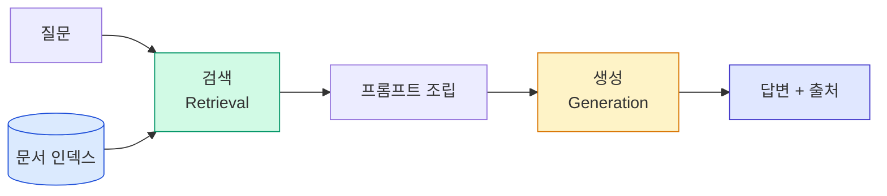
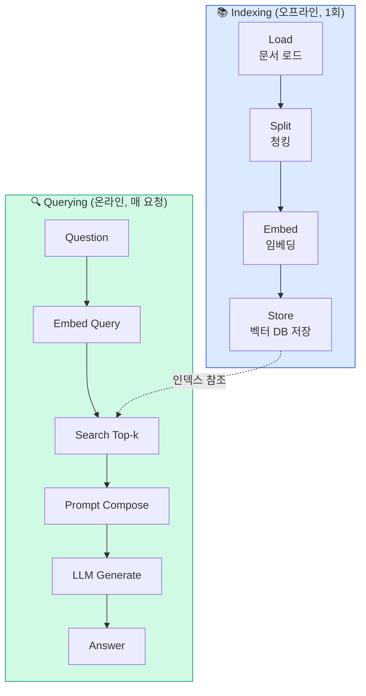
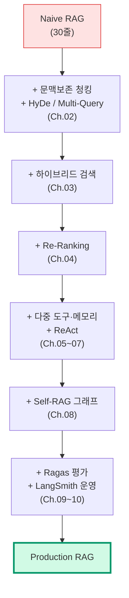

# 1. RAG 개요와 Naive RAG 한계
{: .no_toc }

LLM은 강력하지만, 회사 내부 문서를 모릅니다. RAG가 그 간극을 메웁니다. 하지만 가장 단순한 RAG(Naive RAG)는 4가지 한계를 가집니다. 이 챕터는 그 한계를 진단하고, 본 과정 5일에 걸쳐 어떻게 해결할지 지도를 그립니다.
{: .fs-6 .fw-300 }

---

## ⏱ 타임테이블 (3H — Day 1 09:00–12:00)

| 시간 | 활동 | 도구 |
|:---:|:---|:---|
| 0:00–0:20 | Opening + 환경 점검 | 강의·시연 |
| 0:20–0:50 | Part 1~2 강의 (RAG 개념·파이프라인) | 칠판·다이어그램 |
| 0:50–1:00 | 휴식 | — |
| 1:00–1:40 | 5.3 30줄 Naive RAG 라이브 코딩 시연 | 강사 시연 |
| 1:40–2:10 | 수강생 직접 실행 + 결과 확인 | 실습 |
| 2:10–2:20 | 휴식 | — |
| 2:20–2:50 | Part 3~4 강의 (4대 한계·해결책 매핑) | 강의·토론 |
| 2:50–3:00 | 평가 체크포인트 + Day 1 baseline 기록 | 평가 |

> 🎤 강사 노트는 [99_INSTRUCTOR_GUIDE Ch.01](./99_INSTRUCTOR_GUIDE#chapters) 참고.

## 학습 목표

- RAG의 동작 원리를 **Indexing**과 **Retrieval+Generation** 두 단계로 설명할 수 있다.
- LangChain으로 30줄짜리 Naive RAG를 직접 만들 수 있다.
- Naive RAG가 실패하는 4가지 시나리오를 식별하고, 어느 챕터에서 해결되는지 매핑할 수 있다.
- 자기 도메인 문서로 Naive RAG를 만들고 한계를 직접 측정할 수 있다.

<a id="toc"></a>

## 진행 순서

1. [RAG가 왜 필요한가](#part1)
2. [Naive RAG 파이프라인 해부](#part2)
3. [Naive RAG의 4대 한계점](#part3)
4. [기술적 해결책 매핑](#part4)
5. [실습: 30줄 Naive RAG 만들기](#practice)
6. [평가 체크포인트](#check)
7. [Stretch Goal](#stretch)

<a id="part1"></a>

## 1. RAG가 왜 필요한가 [↑](#toc)

### 1.1 LLM의 세 가지 한계

LLM은 학습 시점까지의 인터넷 데이터로 만들어집니다. 그래서 다음 세 상황에서 무력합니다.

| 한계 | 증상 | 비즈니스 영향 |
|:---|:---|:---|
| **지식 컷오프** | 학습 이후 사건을 모름 | 최신 정책·뉴스에 답할 수 없음 |
| **도메인 지식 부재** | 사내 문서·고객 데이터 모름 | 사내 봇으로 못 씀 |
| **환각(Hallucination)** | 모르면 그럴듯하게 지어냄 | 신뢰성·법적 리스크 |

> 💡 LLM의 환각은 "모른다"고 말하지 않는 것입니다. RAG는 LLM이 출처를 보고 답하게 만들어 환각을 줄입니다.

### 1.2 RAG의 직관 — "오픈북 시험"



핵심은 두 가지입니다.

1. **검색(Retrieval)** — 질문과 관련된 문서 조각을 인덱스에서 찾는다.
2. **생성(Generation)** — 찾은 조각을 컨텍스트로 LLM이 답을 만든다.

LLM은 학습 데이터에 의존하는 대신, 우리가 준 자료를 보고 답합니다. 시험장에 교과서를 들고 들어가는 셈입니다.

### 1.3 RAG가 푸는 문제 vs 못 푸는 문제

| ✅ RAG가 잘 푸는 문제 | ❌ RAG가 못 푸는 문제 |
|:---|:---|
| 사내 문서 기반 Q&A | 복잡한 수치 계산 (도구 필요) |
| 최신 뉴스/정책 반영 | 다단계 추론 (에이전트 필요) |
| 출처 인용 응답 | 문서에 없는 사실 추정 |
| 도메인 용어 처리 | 실시간 데이터 조회 |

> 본 과정 후반부(Ch.05~08)에서 **에이전트**와 **도구**로 위 ❌ 영역도 다룹니다.

[↑](#toc)

<a id="part2"></a>

## 2. Naive RAG 파이프라인 해부 [↑](#toc)

### 2.1 두 단계 — Indexing과 Querying



- **Indexing**: 문서를 한 번 처리해 벡터 DB에 저장합니다. 문서가 바뀌면 다시.
- **Querying**: 사용자 질문이 올 때마다 검색 → 생성을 수행합니다.

### 2.2 LangChain 구성 요소 매핑

| 단계 | LangChain 클래스 | 역할 |
|:---|:---|:---|
| Load | `DirectoryLoader`, `PyPDFLoader`, `WebBaseLoader` | 원천 문서 → `Document` 객체 |
| Split | `RecursiveCharacterTextSplitter` | 긴 문서 → 작은 청크 |
| Embed | `OpenAIEmbeddings`, `HuggingFaceEmbeddings` | 텍스트 → 벡터 |
| Store | `Chroma`, `FAISS`, `Pinecone` | 벡터 + 메타데이터 인덱스 |
| Retrieve | `VectorStore.as_retriever()` | 질문 → 유사 청크 |
| Generate | `ChatOpenAI`, `ChatAnthropic` | 컨텍스트 + 질문 → 답변 |

### 2.3 최소 코드 골격

```python
# 1. 문서 로드
from langchain_community.document_loaders import TextLoader
docs = TextLoader("company_policy.txt", encoding="utf-8").load()

# 2. 청킹
from langchain_text_splitters import RecursiveCharacterTextSplitter
splitter = RecursiveCharacterTextSplitter(chunk_size=500, chunk_overlap=50)
chunks = splitter.split_documents(docs)

# 3. 임베딩 + 벡터 DB
from langchain_openai import OpenAIEmbeddings
from langchain_chroma import Chroma
vectordb = Chroma.from_documents(chunks, OpenAIEmbeddings(model="text-embedding-3-small"))

# 4. 검색기
retriever = vectordb.as_retriever(search_kwargs={"k": 4})

# 5. LLM + 프롬프트 + 체인
from langchain_openai import ChatOpenAI
from langchain_core.prompts import ChatPromptTemplate
from langchain_core.runnables import RunnablePassthrough
from langchain_core.output_parsers import StrOutputParser

prompt = ChatPromptTemplate.from_template(
    "다음 컨텍스트만 참고해서 한국어로 답하세요. 모르면 '문서에 없습니다'라고 답하세요.\n\n"
    "컨텍스트:\n{context}\n\n질문: {question}"
)
llm = ChatOpenAI(model="gpt-4o-mini", temperature=0)

def format_docs(docs):
    return "\n\n".join(d.page_content for d in docs)

chain = (
    {"context": retriever | format_docs, "question": RunnablePassthrough()}
    | prompt
    | llm
    | StrOutputParser()
)

print(chain.invoke("연차 휴가는 며칠인가요?"))
```

이게 **Naive RAG**의 전부입니다. 이 골격은 5일 동안 우리가 단계별로 강화할 출발점입니다.

[↑](#toc)

<a id="part3"></a>

## 3. Naive RAG의 4대 한계점 [↑](#toc)

위 30줄로 데모는 됩니다. 그런데 실제 사용자에게 풀어주면 곧 4가지 문제가 드러납니다.

### 한계 1 — 검색 정확도 부족

**증상**

- 사용자: "휴가 신청 어떻게 해?"
- 문서: "연차 사용 절차는…" (단어가 다름)
- 결과: 임베딩이 의미를 잡지 못해 엉뚱한 청크 반환

**원인**

| 유형 | 설명 |
|:---|:---|
| Lexical mismatch | "휴가" vs "연차" — 동의어를 임베딩이 항상 잡진 못함 |
| 고유명사 매칭 | "K-2 차장" 같은 사내 코드는 의미 검색에 약함 |
| 짧은 질문 | 키워드가 부족해 의미 임베딩이 모호 |

**해결**: **Ch.03 하이브리드 검색** (BM25 키워드 + Dense 의미)

### 한계 2 — 문맥 손실

**증상**

- 표 가운데가 잘려 행/열이 깨짐
- 조항이 두 청크에 걸쳐 잘림
- 코드 블록이 반토막

**원인**

문자 단위 분할(`CharacterTextSplitter`)이나 단순 토큰 분할은 **문서 구조**를 무시합니다. 표, 헤더, 목록은 의미 단위로 묶여야 합니다.

**해결**: **Ch.02 문맥 보존 청킹** (`MarkdownHeaderTextSplitter`, `SemanticChunker`, 표 인식 파서)

### 한계 3 — 환각·근거 부재

**증상**

- 컨텍스트에 없는 사실을 답에 끼워 넣음
- 출처 표시 없음
- "문서에 없다"고 안 함

**원인**

- 프롬프트가 LLM에게 "추측하지 마"를 강제하지 않음
- 검색 결과가 부적합해도 그대로 답 생성
- 답변 후 검증 단계 없음

**해결**: **Ch.08 Self-RAG** (검색 결과 평가 → 부적합 시 재검색, 답변 후 환각 검증)

### 한계 4 — 평가·관찰 부재

**증상**

- 모델·청크 크기·k 값을 바꿨는데 좋아졌는지 모름
- 어제까지 잘 되던 답변이 오늘 이상해진 이유 모름
- 어디가 병목(검색? 생성?)인지 모름

**원인**

정량 메트릭과 트레이싱이 없으면 모든 개선이 추측입니다.

**해결**: **Ch.09 Ragas** (정량 평가) + **Ch.10 LangSmith** (트레이싱·모니터링)

[↑](#toc)

<a id="part4"></a>

## 4. 기술적 해결책 매핑 [↑](#toc)

5일 커리큘럼은 위 4가지 한계를 단계별로 해결하는 여정입니다.

### 4.1 한계 → 챕터 매핑

| 한계 | 해결 기법 | 챕터 |
|:---|:---|:---:|
| 검색 정확도 (Lexical mismatch) | BM25 + Dense 하이브리드 + RRF | Ch.03 |
| 검색 정확도 (Top-k 노이즈) | Cross-Encoder Re-Ranking | Ch.04 |
| 문맥 손실 (구조 무시) | MarkdownHeader/Semantic 청킹, 표 인식 파싱 | Ch.02 |
| 짧은 질문 모호성 | HyDe, Multi-Query 쿼리 변환 | Ch.02 |
| 도메인 외 질문 | RAG + 외부 도구 (검색·계산·DB) | Ch.05 |
| 다단계 추론 부족 | ReAct 패턴 | Ch.07 |
| 멀티턴 대화 망각 | History-Aware RAG | Ch.06 |
| 분기·재시도 부재 | LangGraph Self-RAG / Corrective RAG | Ch.08 |
| 환각·근거 부재 | Self-RAG 환각 검증 + 출처 표시 | Ch.08 |
| 평가·관찰 부재 | Ragas 메트릭, LangSmith 트레이싱 | Ch.09, Ch.10 |

### 4.2 5일 진화 도식



각 단계마다 메트릭으로 개선을 확인하며, 마지막엔 LangSmith로 프로덕션을 모니터링합니다.

[↑](#toc)

<a id="practice"></a>

## 5. 실습: 30줄 Naive RAG 만들기 [↑](#toc)

### 5.1 환경 준비

```bash
uv add langchain langchain-openai langchain-community langchain-chroma langchain-text-splitters python-dotenv
```

`.env` 파일에 키 등록 후 (Ch.00 §3 참고):

```python
from dotenv import load_dotenv
load_dotenv()  # .env에서 OPENAI_API_KEY 등을 자동 로드

# Colab을 쓴다면:
# from google.colab import userdata
# import os; os.environ["OPENAI_API_KEY"] = userdata.get("OPENAI_API_KEY")
```

> 🔒 **보안**: 키를 코드에 직접 하드코딩하지 마세요. `.env`는 `.gitignore`에 반드시 포함.

### 5.2 샘플 문서 만들기

```python
sample = """
[휴가 정책 v2.1]
1. 연차 휴가는 입사일로부터 1년 후부터 15일이 부여된다.
2. 미사용 연차는 익년 6월까지 이월 가능하며, 이후 자동 소멸된다.
3. 반차는 오전·오후 각 4시간 단위로 사용 가능하다.
4. 경조사 휴가는 직계가족 사망 5일, 본인 결혼 5일, 자녀 결혼 1일이다.
5. 병가는 의사 진단서 제출 시 연 10일까지 유급으로 인정된다.

[근무 정책]
- 출근 시간: 09:00, 점심 12:00~13:00, 퇴근 18:00.
- 유연근무제 신청은 매월 1일까지 인사팀에 제출.
- 재택근무는 월 4일까지 허용.
"""

with open("policy.txt", "w", encoding="utf-8") as f:
    f.write(sample)
```

### 5.3 30줄 Naive RAG

```python
from langchain_community.document_loaders import TextLoader
from langchain_text_splitters import RecursiveCharacterTextSplitter
from langchain_openai import ChatOpenAI, OpenAIEmbeddings
from langchain_chroma import Chroma
from langchain_core.prompts import ChatPromptTemplate
from langchain_core.runnables import RunnablePassthrough
from langchain_core.output_parsers import StrOutputParser

# 1. Load
docs = TextLoader("policy.txt", encoding="utf-8").load()

# 2. Split
splitter = RecursiveCharacterTextSplitter(chunk_size=200, chunk_overlap=20)
chunks = splitter.split_documents(docs)
print(f"청크 수: {len(chunks)}")

# 3. Embed + Store
vectordb = Chroma.from_documents(
    chunks,
    OpenAIEmbeddings(model="text-embedding-3-small"),
)

# 4. Retriever
retriever = vectordb.as_retriever(search_kwargs={"k": 3})

# 5. Chain
prompt = ChatPromptTemplate.from_template(
    "당신은 사내 정책 안내 도우미입니다. 아래 컨텍스트만 참고해 한국어로 정확히 답하세요. "
    "컨텍스트에 없으면 '문서에 없는 내용입니다'라고 답하세요.\n\n"
    "컨텍스트:\n{context}\n\n질문: {question}\n답변:"
)
llm = ChatOpenAI(model="gpt-4o-mini", temperature=0)
chain = (
    {"context": retriever | (lambda ds: "\n\n".join(d.page_content for d in ds)),
     "question": RunnablePassthrough()}
    | prompt | llm | StrOutputParser()
)

# 6. 질의
for q in ["연차는 며칠?", "재택근무 제한은?", "장례 휴가 며칠?", "주식 보너스 정책은?"]:
    print(f"\nQ: {q}\nA: {chain.invoke(q)}")
```

### 5.4 예상 출력

```
청크 수: 5

Q: 연차는 며칠?
A: 입사일로부터 1년 후부터 15일이 부여됩니다.

Q: 재택근무 제한은?
A: 재택근무는 월 4일까지 허용됩니다.

Q: 장례 휴가 며칠?
A: 직계가족 사망 시 경조사 휴가로 5일이 부여됩니다.

Q: 주식 보너스 정책은?
A: 문서에 없는 내용입니다.
```

### ✅ 완료 체크 (TA용)

다음이 모두 충족되면 Ch.01 실습 완료:
- `policy.txt`로 인덱싱 성공 (청크 수 ≥ 4)
- "연차는 며칠?" 질의에 "15일" 포함된 답 출력
- "주식 보너스 정책은?" 질의에 "문서에 없는 내용입니다" 응답
- 자기 도메인 질문 1개 시도

### 5.5 한계 직접 관찰하기

다음 질문들로 Naive RAG가 어디서 무너지는지 확인해 봅니다.

| 질문 | 예상 문제 | 어느 한계? |
|:---|:---|:---:|
| `휴가 신청 어떻게 해?` (절차 단어) | "휴가" → "연차" 매칭 약함 | 한계 1 |
| `유연근무 누구한테 내?` | 표가 깨졌으면 "인사팀" 누락 | 한계 2 |
| `오늘 며칠 휴가 쓸 수 있어?` | 컨텍스트에 없는 계산 시도 → 환각 | 한계 3 |
| `1번 답이 정확한지 어떻게 알아?` | 평가 없음 | 한계 4 |

> 💪 직접 5~10개 질문을 만들어 답변 품질을 1~5점으로 매겨보세요. **이 점수가 5일 동안 우리의 baseline**입니다.

[↑](#toc)

<a id="check"></a>

## 6. 평가 체크포인트 [↑](#toc)

### 객관식

**Q1.** Naive RAG의 **Indexing 단계**에 포함되지 **않는** 것은?

1. Load
2. Split
3. Embed
4. **Generate**

{::nomarkdown}
<details><summary>정답 보기</summary>
<div class="answer-body"><strong>4. Generate</strong>. Generate는 Querying 단계에 속합니다. Indexing은 오프라인에서 한 번 수행하고, Generate는 매 질의마다 수행합니다.</div>
</details>
{:/nomarkdown}

**Q2.** 사용자가 "휴가 신청"이라 묻고 문서엔 "연차 사용"이라 적혀 있을 때 발생하는 한계는?

1. 문맥 손실
2. **검색 정확도 부족 (Lexical mismatch)**
3. 환각
4. 평가 부재

{::nomarkdown}
<details><summary>정답 보기</summary>
<div class="answer-body"><strong>2</strong>. 의미는 비슷하지만 단어가 다른 경우 Dense 임베딩만으로는 잡기 어렵습니다. Ch.03 하이브리드 검색(BM25 + Dense)으로 해결합니다.</div>
</details>
{:/nomarkdown}

**Q3.** Naive RAG의 환각을 줄이기 위해 **즉시 적용할 수 있는 가장 단순한** 방법은?

1. 더 큰 모델 사용
2. **프롬프트에 "컨텍스트에 없으면 모른다고 답하라" 지시 추가**
3. 청크 크기 늘리기
4. k 값 늘리기

{::nomarkdown}
<details><summary>정답 보기</summary>
<div class="answer-body"><strong>2</strong>. 시스템 프롬프트의 강제 지시만으로도 환각이 크게 감소합니다. 더 견고한 해결은 Ch.08 Self-RAG의 환각 검증 노드입니다.</div>
</details>
{:/nomarkdown}

### 주관식

**Q4.** Naive RAG 4대 한계 중 **자기 도메인에서 가장 큰 위험**은 무엇이고, 왜 그렇게 생각합니까? 본 과정 어느 챕터에서 해결되는지도 적어보세요.

{::nomarkdown}
<details><summary>모범 응답 예</summary>
<div class="answer-body">도메인에 따라 다르나 흔한 응답:<br><br>• <strong>법률·의료</strong> → 한계 3 (환각). 잘못된 정보 = 법적 책임. 해결: Ch.08 Self-RAG.<br>• <strong>사내 헬프데스크</strong> → 한계 1 (검색 정확도). 사용자가 정책 명칭 대신 일상어로 물음. 해결: Ch.03 하이브리드 검색.<br>• <strong>분석 리포트</strong> → 한계 2 (문맥 손실). 표·그래프 캡션이 깨지면 무용지물. 해결: Ch.02 청킹.</div>
</details>
{:/nomarkdown}

**Q5.** 5.3 코드를 자기 도메인 문서로 바꿔 실행하고, 한계가 드러나는 질문 3개를 찾아 적어보세요.

{::nomarkdown}
<details><summary>채점 기준</summary>
<div class="answer-body">각 질문에 대해 (a) 문제가 된 답, (b) 어느 한계 유형인지, (c) 어느 챕터에서 해결될지를 적었으면 만점.</div>
</details>
{:/nomarkdown}

[↑](#toc)

<a id="stretch"></a>

## 7. 🚀 Stretch Goal [↑](#toc)

> 난이도 표기: ★☆☆ 30분 / ★★☆ 1시간 / ★★★ 2시간 이상

### 도전 1 — 자기 도메인 baseline 구축 ★☆☆ (45분)

자기 회사·프로젝트 문서 5~10개로 5.3 코드를 돌려보세요.

```python
# DirectoryLoader로 폴더 통째 인덱싱
from langchain_community.document_loaders import DirectoryLoader, TextLoader
loader = DirectoryLoader("./my_docs", glob="**/*.md", loader_cls=TextLoader,
                         loader_kwargs={"encoding": "utf-8"})
docs = loader.load()
```

10개 질문에 대해 답변을 1~5점으로 채점하고, 그 점수를 baseline으로 저장하세요. **5일 끝에 같은 질문으로 점수가 얼마나 올랐는지 비교**합니다.

### 도전 2 — 4가지 한계 시나리오 의도적으로 만들기 ★☆☆ (30분)

자기 도메인에서 4가지 한계가 각각 드러나는 질문을 1개씩, 총 4개 만들어 봅니다. 만들면서 "어떤 데이터·구조가 그 한계를 유발하는가"를 적어두세요. 이 메모는 Ch.09 평가에서 그대로 테스트셋으로 활용됩니다.

### 도전 3 — 질문 카테고리 분류 ★★☆ (1시간)

Naive RAG에서 사용자 질문을 **사실 질의 / 절차 질의 / 비교 질의 / 추론 질의 / 외부 데이터 질의**로 분류해 보고, 각 유형에서 RAG가 잘 동작하는지 비율을 적어보세요. Ch.05 다중 도구 에이전트의 출발점이 됩니다.

[↑](#toc)

---

## 다음 챕터

다음 시간에는 첫 번째 한계인 **문맥 손실**을 해결합니다.

→ [Ch.02 문서 파싱과 청킹 전략](./02_문서_파싱과_청킹_전략)

복잡한 행정 문서(PDF·HWP·표)를 어떻게 파싱하고, Recursive·Semantic·문맥 보존 청킹을 어떻게 선택하며, HyDe와 Multi-Query로 짧은 질문을 어떻게 풍부하게 변환하는지 다룹니다.
