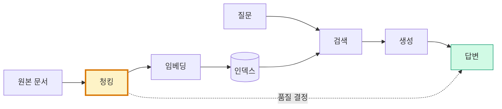
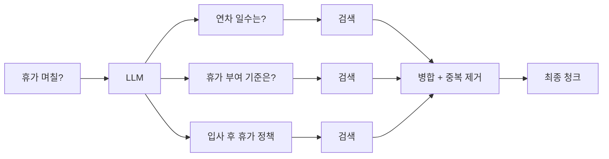

# 2. 문서 파싱과 청킹 전략
{: .no_toc }

RAG 품질의 80%는 청킹에서 결정됩니다. 표가 깨지면 답이 깨지고, 청크가 너무 크면 검색 노이즈가, 너무 작으면 문맥이 잘립니다. 이 챕터는 행정 문서(PDF·HWP·표)를 어떻게 파싱하고, 4가지 청킹 전략 중 어떤 것을 언제 쓰며, HyDe·Multi-Query로 짧은 질문을 어떻게 풍부하게 변환하는지 다룹니다.
{: .fs-6 .fw-300 }

---

## ⏱ 타임테이블 (5H — Day 1 13:00–18:00)

| 시간 | 활동 |
|:---:|:---|
| 0:00–0:30 | Part 1~2 강의 (왜 청킹·행정문서 파싱) |
| 0:30–1:30 | PDF·HWP 파싱 실습 |
| 1:30–1:40 | 휴식 |
| 1:40–2:40 | Part 3 청킹 4가지 비교 (강의 20분 + 실습 40분) |
| 2:40–2:50 | 휴식 |
| 2:50–3:30 | Part 4~5 강의·데모 (메타데이터·HyDe) |
| 3:30–4:30 | Multi-Query + 4-way 통합 실습 |
| 4:30–5:00 | 평가 체크포인트 + Day 1 회고 |

> 🎤 강사 노트: [99_INSTRUCTOR_GUIDE Ch.02](./99_INSTRUCTOR_GUIDE#chapters)

## 학습 목표

- PDF·HWP·DOCX·표 포함 문서를 LangChain 로더로 파싱할 수 있다.
- Recursive·Markdown·HTML·Semantic 청킹의 차이를 설명하고 상황에 맞게 선택할 수 있다.
- 메타데이터를 설계해 필터링·자기쿼리(SelfQuery)에 활용할 수 있다.
- HyDe와 Multi-Query Retriever로 짧고 모호한 질문의 검색 품질을 끌어올릴 수 있다.
- 동일 문서를 4가지 전략으로 분할해 검색 정확도를 정량 비교할 수 있다.

<a id="toc"></a>

## 진행 순서

1. [왜 청킹이 RAG의 80%를 결정하는가](#part1)
2. [행정 문서 파싱](#part2)
3. [청킹 전략 비교](#part3)
4. [메타데이터 설계](#part4)
5. [쿼리 변환 — HyDe](#part5)
6. [Multi-Query Retriever](#part6)
7. [실습: 4가지 청킹 비교](#practice)
8. [평가 체크포인트](#check)
9. [Stretch Goal](#stretch)

<a id="part1"></a>

## 1. 왜 청킹이 RAG의 80%를 결정하는가 [↑](#toc)

### 1.1 청크 → 검색 → 답변의 인과 사슬



- 청크가 **너무 크면** → 임베딩에 노이즈가 섞여 검색이 부정확.
- 청크가 **너무 작으면** → 문맥이 잘려 LLM이 답을 만들지 못함.
- 청크가 **구조를 무시하면** → 표·헤더·목록이 깨져 정보 단위가 망가짐.

### 1.2 나쁜 청킹의 3가지 사례

| 사례 | 무엇이 깨지나 | 결과 |
|:---|:---|:---|
| **단순 길이 분할** | 문장 가운데 절단 | "연차는 입사 후 1년이 지나면 부여..." 잘림 |
| **표 무시** | `\| 헤더 \|` 가운데 자름 | 행/열 매핑 실종 → 표 답변 불가 |
| **고정 토큰 분할** | 코드·리스트 분리 | 5단계 절차의 3단계가 다른 청크로 |

### 1.3 좋은 청킹의 4가지 원칙

1. **의미 단위로 분할** — 문장·문단·섹션의 자연스러운 경계 우선.
2. **구조 보존** — Markdown 헤더, HTML 섹션, 표 행을 단위로.
3. **적당한 오버랩** — 경계에서 정보 손실을 막는 안전망.
4. **메타데이터 풍부화** — 출처·페이지·섹션을 항상 함께.

[↑](#toc)

<a id="part2"></a>

## 2. 행정 문서 파싱 [↑](#toc)

### 2.1 파일 형식별 도구

| 형식 | 추천 도구 | 특이점 |
|:---|:---|:---|
| `.pdf` (텍스트) | `PyPDFLoader` (`pypdf`) | 페이지 메타 자동, 빠름 |
| `.pdf` (스캔본) | `UnstructuredFileLoader` + OCR(Tesseract) | OCR 품질이 청킹 품질 |
| `.pdf` (표 풍부) | `pdfplumber`, `unstructured`(hi_res) | 표 추출에 강함 |
| `.docx` | `Docx2txtLoader`, `python-docx` | 스타일 무시 vs 보존 선택 |
| `.hwp` | LibreOffice 변환 → PDF/DOCX, 또는 `pyhwp` | 표·도형 손실 주의 |
| `.md`, `.html` | `UnstructuredMarkdownLoader`, `BSHTMLLoader` | 헤더 보존이 핵심 |
| 폴더 일괄 | `DirectoryLoader` | glob 패턴으로 필터 |

### 2.2 PDF 로딩 — 페이지 단위 메타데이터

```python
from langchain_community.document_loaders import PyPDFLoader

loader = PyPDFLoader("./policies.pdf")
pages = loader.load()  # 한 페이지가 한 Document
print(pages[0].metadata)
# {'source': './policies.pdf', 'page': 0}
print(pages[0].page_content[:200])
```

페이지 번호가 자동으로 메타데이터에 들어갑니다. 나중에 사용자에게 출처를 보여줄 때 유용합니다.

### 2.3 표가 풍부한 PDF — `unstructured` hi_res

```python
from langchain_community.document_loaders import UnstructuredFileLoader

loader = UnstructuredFileLoader(
    "./report_with_tables.pdf",
    mode="elements",          # 요소 단위(제목·문단·표)로 분리
    strategy="hi_res",        # 표·이미지 인식 (느리지만 정확)
)
elements = loader.load()
for el in elements[:5]:
    print(el.metadata.get("category"), "|", el.page_content[:80])
# Title | Q3 영업 보고서
# NarrativeText | 본 보고서는…
# Table | <html>...</html>
```

`category`로 표(`Table`)·제목(`Title`)·본문(`NarrativeText`)을 구분할 수 있습니다.

### 2.4 HWP 처리 — 변환 우회

HWP는 한국 행정 문서의 사실상 표준입니다. 직접 파싱하는 라이브러리(`pyhwp`)도 있지만 표·이미지 손실이 큽니다. **실무에서 가장 안정적인 방법은 변환**입니다.

```bash
# 명령행에서 hwp → pdf 일괄 변환 (LibreOffice 필요)
soffice --headless --convert-to pdf *.hwp
```

변환 후 `PyPDFLoader`나 `UnstructuredFileLoader`로 처리합니다. 또는 텍스트만 필요하면:

```bash
uv add pyhwp
uv run hwp5txt mydoc.hwp > mydoc.txt
```

### 2.5 폴더 일괄 로드

```python
from langchain_community.document_loaders import DirectoryLoader, PyPDFLoader

loader = DirectoryLoader(
    "./docs",
    glob="**/*.pdf",
    loader_cls=PyPDFLoader,
    show_progress=True,
)
docs = loader.load()
print(f"총 {len(docs)} 페이지 로드")
```

[↑](#toc)

<a id="part3"></a>

## 3. 청킹 전략 비교 [↑](#toc)

### 3.1 4가지 전략 한눈에

| 전략 | 분할 기준 | 장점 | 단점 | 언제 쓰나 |
|:---|:---|:---|:---|:---|
| Character | 문자 수 | 단순·빠름 | 의미 무시 | (거의 사용 X) |
| **Recursive** | 줄·문단·문장 우선순위 | 균형·범용 | 헤더 무시 | **기본값** |
| MarkdownHeader / HTMLHeader | 헤더 구조 | 섹션 보존 | 헤더 없으면 무용 | 마크다운·HTML 문서 |
| **Semantic** | 임베딩 유사도 변화점 | 의미 단위 분할 | 비용·시간 ↑ | 긴 산문, 보고서 |

### 3.2 RecursiveCharacterTextSplitter — 기본기

```python
from langchain_text_splitters import RecursiveCharacterTextSplitter

splitter = RecursiveCharacterTextSplitter(
    chunk_size=500,        # 목표 청크 크기 (문자 수)
    chunk_overlap=50,      # 인접 청크 간 겹침
    separators=["\n\n", "\n", "。", ".", " ", ""],  # 우선순위
    length_function=len,
)
chunks = splitter.split_text(long_text)
```

**왜 Recursive가 기본인가**:

1. 문단(`\n\n`) → 줄(`\n`) → 문장 → 단어 → 글자 순으로 나누어 가장 큰 의미 단위 우선.
2. 한국어는 `"。"` 대신 `"."`, `" "`를 쓰지만, 위처럼 추가하면 일본어·중국어 혼재 문서도 OK.
3. `chunk_size`는 문자 수. 토큰 단위로 정확히 맞추려면 `length_function=lambda x: len(tokenizer.encode(x))`.

### 3.3 청크 크기 결정 가이드

| 사용 사례 | chunk_size | overlap | 비고 |
|:---|---:|---:|:---|
| 짧은 정책·FAQ | 200~400 | 20~50 | 한 문단이 한 청크 |
| 일반 매뉴얼 | 500~800 | 50~100 | **기본 추천** |
| 학술/보고서 | 1000~1500 | 100~200 | 긴 논증 보존 |
| 코드 + 설명 | 1500~2000 | 0~100 | `Language.PYTHON` 분할기 사용 |

> 💡 **임베딩 모델의 컨텍스트 한계와 LLM 입력 토큰 예산**을 함께 고려합니다. `text-embedding-3-small`은 8191 토큰까지 받지만, 작은 청크가 검색 정확도에 더 유리합니다.

### 3.4 MarkdownHeaderTextSplitter — 구조 보존

문서가 마크다운이면 헤더 구조 자체가 의미 단위입니다.

```python
from langchain_text_splitters import MarkdownHeaderTextSplitter

md = """
# 휴가 정책
## 연차
1년 후 15일 부여.
## 반차
오전·오후 4시간.

# 근무 정책
## 출퇴근
09:00 - 18:00
"""

splitter = MarkdownHeaderTextSplitter(
    headers_to_split_on=[("#", "h1"), ("##", "h2")],
)
chunks = splitter.split_text(md)
for c in chunks:
    print(c.metadata, "|", c.page_content[:40])
# {'h1': '휴가 정책', 'h2': '연차'} | 1년 후 15일 부여.
# {'h1': '휴가 정책', 'h2': '반차'} | 오전·오후 4시간.
# {'h1': '근무 정책', 'h2': '출퇴근'} | 09:00 - 18:00
```

헤더가 메타데이터에 자동 추가되어 필터링·자기쿼리에 사용 가능합니다.

`HTMLHeaderTextSplitter`도 동일한 사상으로 `<h1>`, `<h2>` 단위 분할.

### 3.5 SemanticChunker — 의미 변화점에서 자르기

문장 단위로 임베딩을 계산해 **의미가 크게 변하는 지점**을 경계로 삼습니다. 산문·보고서에 강력합니다.

```python
from langchain_experimental.text_splitter import SemanticChunker
from langchain_openai import OpenAIEmbeddings

splitter = SemanticChunker(
    OpenAIEmbeddings(model="text-embedding-3-small"),
    breakpoint_threshold_type="percentile",  # 또는 "standard_deviation", "interquartile"
    breakpoint_threshold_amount=95,          # 상위 5% 변화 지점에서 분할
)
chunks = splitter.split_text(long_essay)
```

**비용 주의**: 모든 문장에 임베딩을 호출하므로 인덱싱 비용이 ~10배. 자주 갱신되지 않는 핵심 자료에만 권장.

### 3.6 표·코드·리스트 처리 팁

- **표**는 줄 단위로 자르지 말고 **표 단위로 한 청크**. `unstructured` `mode="elements"`가 도움.
- **코드**는 `Language.PYTHON` 등 언어별 분할기 사용:
  ```python
  from langchain_text_splitters import RecursiveCharacterTextSplitter, Language
  splitter = RecursiveCharacterTextSplitter.from_language(
      language=Language.PYTHON, chunk_size=1500, chunk_overlap=100
  )
  ```
- **리스트**는 항목별 자르지 말고 헤더와 함께 묶기.

[↑](#toc)

<a id="part4"></a>

## 4. 메타데이터 설계 [↑](#toc)

### 4.1 왜 메타데이터인가

검색은 두 축을 가질 수 있습니다.

1. **벡터 유사도** (임베딩) — 의미적 매칭
2. **메타데이터 필터** — 출처·날짜·부서·문서종류

좋은 메타데이터는 검색을 빠르고 정확하게 만들고, 사용자에게 출처를 표시할 수 있게 합니다.

### 4.2 권장 필드

```python
from langchain_core.documents import Document

doc = Document(
    page_content="연차 사용 절차는...",
    metadata={
        "source": "policies/2025_hr.pdf",   # 파일 경로
        "page": 12,                          # 페이지
        "section": "휴가 > 연차",            # 섹션 경로
        "doc_type": "policy",                # 분류
        "department": "HR",                  # 부서
        "date": "2025-01-01",                # 발효일
        "version": "v2.1",                   # 버전
    },
)
```

### 4.3 ChromaDB 메타데이터 필터링

```python
retriever = vectordb.as_retriever(
    search_kwargs={
        "k": 4,
        "filter": {"department": "HR", "doc_type": "policy"},
    }
)
```

### 4.4 SelfQueryRetriever — 자연어로 메타데이터 필터

LLM이 사용자 질문을 분석해 **자연어 → 메타데이터 필터**로 변환합니다.

```python
from langchain.retrievers.self_query.base import SelfQueryRetriever
from langchain.chains.query_constructor.base import AttributeInfo
from langchain_openai import ChatOpenAI

metadata_field_info = [
    AttributeInfo(name="department", description="부서명. HR/IT/Finance 중 하나", type="string"),
    AttributeInfo(name="date", description="문서 발효일 ISO 형식", type="string"),
]

retriever = SelfQueryRetriever.from_llm(
    ChatOpenAI(model="gpt-4o-mini", temperature=0),
    vectordb,
    document_contents="회사 정책 문서",
    metadata_field_info=metadata_field_info,
)

# 자연어 질문 → 자동 필터 생성
retriever.invoke("2025년 이후 HR 정책에서 연차 관련 내용")
# 내부적으로 filter={"department": "HR", "date": ">=2025-01-01"}로 변환됨
```

[↑](#toc)

<a id="part5"></a>

## 5. 쿼리 변환 — HyDe [↑](#toc)

### 5.1 문제: 짧은 질문이 검색에 약하다

사용자: `"휴가 며칠?"` (3음절)

이 짧은 질문의 임베딩은 **너무 일반적**이라 정책 문서의 풍부한 청크와 의미적으로 멀 수 있습니다.

### 5.2 HyDe (Hypothetical Document Embeddings)의 직관

> **질문 대신, 그 질문에 대한 가상 답변을 생성해서 그 답변으로 검색한다.**


가상 답변은 **사실 여부보다 어휘 풍부도**가 중요합니다. 도메인 용어가 자연스레 들어가면서 검색이 좋아집니다.

### 5.3 직접 구현

```python
from langchain_openai import ChatOpenAI, OpenAIEmbeddings
from langchain_core.prompts import ChatPromptTemplate
from langchain_core.output_parsers import StrOutputParser

llm = ChatOpenAI(model="gpt-4o-mini", temperature=0)
hyde_prompt = ChatPromptTemplate.from_template(
    "당신은 사내 정책 전문가입니다. 다음 질문에 200자 내외로 가상 답변을 작성하세요.\n질문: {q}"
)
hyde_chain = hyde_prompt | llm | StrOutputParser()

def hyde_search(question, vectordb, k=4):
    pseudo = hyde_chain.invoke({"q": question})
    docs = vectordb.similarity_search(pseudo, k=k)
    return docs, pseudo

docs, pseudo = hyde_search("휴가 며칠?", vectordb)
print("가상 답변:", pseudo)
print("검색 청크:", [d.page_content[:50] for d in docs])
```

### 5.4 적용 시나리오와 주의점

| ✅ 좋음 | ❌ 주의 |
|:---|:---|
| 짧고 모호한 질문 | 사실 검증이 중요한 경우 → 가상 답변이 오답이면 검색도 빗나감 |
| 도메인 용어가 풍부한 코퍼스 | 매우 짧은 코퍼스 (어차피 짧으면 효과 작음) |
| Multi-Query와 함께 사용 | 비용 증가 (LLM 호출 1회 추가) |

[↑](#toc)

<a id="part6"></a>

## 6. Multi-Query Retriever [↑](#toc)

### 6.1 직관 — 한 질문을 여러 각도로



LLM이 같은 질문을 N개 변형으로 생성 → 각 변형으로 검색 → 결과를 합치고 중복 제거.

### 6.2 사용법

```python
from langchain.retrievers.multi_query import MultiQueryRetriever
from langchain_openai import ChatOpenAI

retriever = MultiQueryRetriever.from_llm(
    retriever=vectordb.as_retriever(search_kwargs={"k": 3}),
    llm=ChatOpenAI(model="gpt-4o-mini", temperature=0),
)

docs = retriever.invoke("휴가 며칠?")
```

생성된 변형 질문을 보려면 로깅 활성화:

```python
import logging
logging.basicConfig()
logging.getLogger("langchain.retrievers.multi_query").setLevel(logging.INFO)
```

### 6.3 커스텀 프롬프트 — 도메인 적합화

기본 프롬프트는 영어 중심입니다. 한국어 도메인에 맞게:

```python
from langchain_core.prompts import PromptTemplate
from langchain_core.output_parsers import BaseOutputParser

class LineListOutputParser(BaseOutputParser):
    def parse(self, text: str):
        return [t.strip() for t in text.strip().split("\n") if t.strip()]

prompt = PromptTemplate(
    input_variables=["question"],
    template=(
        "당신은 사내 정책 검색 도우미입니다. 다음 질문을 다른 표현으로 3가지 만들어 주세요.\n"
        "동의어, 절차 단어, 격식체 등 어휘를 다양화하세요.\n"
        "각 줄에 하나씩 쓰세요.\n\n질문: {question}"
    ),
)

retriever = MultiQueryRetriever(
    retriever=vectordb.as_retriever(search_kwargs={"k": 3}),
    llm_chain=prompt | ChatOpenAI(model="gpt-4o-mini", temperature=0) | LineListOutputParser(),
    parser_key="lines",
)
```

### 6.4 비용 트레이드오프

| 옵션 | 추가 비용 | 효과 |
|:---|:---|:---|
| Naive 검색 | 0 | baseline |
| Multi-Query (3 변형) | LLM 1회 + 임베딩 3회 | recall ↑↑ |
| HyDe | LLM 1회 + 임베딩 1회 | recall ↑ |
| HyDe + Multi-Query | LLM 2회 + 임베딩 4회 | recall ↑↑↑ |

요청 빈도가 높으면 캐싱(`set_llm_cache`)을 반드시 적용하세요.

[↑](#toc)

<a id="practice"></a>

## 7. 실습: 4가지 청킹 비교 [↑](#toc)

### 7.1 목표

같은 PDF를 4가지 전략으로 분할하고 동일 질문 셋으로 검색 정확도를 비교합니다.

### 7.2 코드

```python
from langchain_community.document_loaders import PyPDFLoader
from langchain_text_splitters import (
    CharacterTextSplitter,
    RecursiveCharacterTextSplitter,
    MarkdownHeaderTextSplitter,
)
from langchain_experimental.text_splitter import SemanticChunker
from langchain_openai import OpenAIEmbeddings
from langchain_chroma import Chroma

# 0. 문서 로드
docs = PyPDFLoader("./policies.pdf").load()
text = "\n\n".join(d.page_content for d in docs)

emb = OpenAIEmbeddings(model="text-embedding-3-small")

# 1. 4가지 전략으로 분할
strategies = {}

strategies["character"] = CharacterTextSplitter(chunk_size=500, chunk_overlap=50).split_text(text)
strategies["recursive"] = RecursiveCharacterTextSplitter(chunk_size=500, chunk_overlap=50).split_text(text)

# 마크다운으로 변환되어 있다고 가정한 텍스트가 있을 때만 사용
md_splitter = MarkdownHeaderTextSplitter([("#", "h1"), ("##", "h2")])
strategies["markdown"] = [d.page_content for d in md_splitter.split_text(text)]

semantic = SemanticChunker(emb, breakpoint_threshold_type="percentile", breakpoint_threshold_amount=95)
strategies["semantic"] = semantic.split_text(text)

# 2. 각 전략별 벡터 DB 구축
dbs = {name: Chroma.from_texts(chunks, emb, collection_name=name) for name, chunks in strategies.items()}

# 3. 평가 질문 + 정답 키워드
questions = [
    ("연차는 며칠?", ["15", "연차"]),
    ("재택근무 한도는?", ["재택", "월 4"]),
    ("경조사 휴가 종류는?", ["경조", "결혼", "사망"]),
    ("출근 시간은?", ["09", "출근"]),
    ("미사용 연차는 어떻게?", ["이월", "소멸"]),
]

# 4. recall 측정 (정답 키워드가 top-3 청크 안에 있으면 hit)
def recall_at_k(db, question, keywords, k=3):
    docs = db.similarity_search(question, k=k)
    joined = " ".join(d.page_content for d in docs)
    return all(kw in joined for kw in keywords)

import pandas as pd
rows = []
for name, db in dbs.items():
    hits = sum(recall_at_k(db, q, kw) for q, kw in questions)
    rows.append({"strategy": name, "recall@3": f"{hits}/{len(questions)}", "chunks": len(strategies[name])})

print(pd.DataFrame(rows))
```

### 7.3 예상 결과 (참고용)

```
   strategy recall@3  chunks
0 character    3/5      18
1 recursive    4/5      15
2  markdown    5/5       8
3  semantic    5/5      12
```

> 결과는 문서 특성에 크게 의존합니다. **본인 문서로 직접 측정해 본인의 baseline**을 만드세요.

[↑](#toc)

<a id="check"></a>

### ✅ 완료 체크 (TA용)

- 4가지 전략(Character/Recursive/Markdown/Semantic)으로 청크 수 출력
- recall@3 비교 표 출력 (4 행)
- HyDe·Multi-Query 중 1개 이상 직접 호출 성공

## 8. 평가 체크포인트 [↑](#toc)

### 객관식

**Q1.** 다음 중 한국 행정 문서(HWP) 처리에 **권장되는** 흐름은?

1. `pyhwp`로 직접 파싱 → 그대로 인덱싱
2. **LibreOffice로 PDF 변환 → `UnstructuredFileLoader(strategy="hi_res")`로 표 보존 파싱**
3. 한 줄씩 `\n`으로만 분할
4. HWP는 RAG에 못 씀

{::nomarkdown}
<details><summary>정답</summary>
<div class="answer-body"><strong>2</strong>. <code>pyhwp</code>도 가능하지만 표·도형 손실이 큽니다. 변환 후 <code>unstructured</code>의 hi_res가 표·이미지 보존에 가장 안정적입니다.</div>
</details>
{:/nomarkdown}

**Q2.** `RecursiveCharacterTextSplitter`가 기본 추천인 이유는?

1. 가장 빠르기 때문
2. **문단 → 줄 → 문장 → 단어 → 글자 순으로 큰 의미 단위를 우선 보존하기 때문**
3. 비용이 가장 낮기 때문 (Character도 동일)
4. 한국어에만 특화돼 있기 때문

{::nomarkdown}
<details><summary>정답</summary>
<div class="answer-body"><strong>2</strong>. <code>separators</code> 우선순위로 인해 자연스러운 의미 경계를 따르려고 시도합니다.</div>
</details>
{:/nomarkdown}

**Q3.** HyDe의 핵심 아이디어는?

1. 질문을 여러 변형으로 만들어 검색
2. **질문에 대한 가상 답변을 생성해 그 답변으로 검색**
3. 임베딩을 두 번 평균
4. 답변을 미리 캐싱

{::nomarkdown}
<details><summary>정답</summary>
<div class="answer-body"><strong>2</strong>. 답변 형식의 텍스트가 문서 청크와 의미적으로 더 가깝기 때문에 짧은 질문의 검색 약점을 보완합니다.</div>
</details>
{:/nomarkdown}

### 주관식

**Q4.** 자기 도메인 문서에서 표·코드·리스트가 깨지는 사례를 1개 찾고, 어떤 청킹 전략으로 해결할지 적어보세요.

{::nomarkdown}
<details><summary>모범 응답 예</summary>
<div class="answer-body"><br>• "사내 보고서 PDF의 손익 표가 가운데 잘려 분기별 매출이 다른 청크에 흩어짐."<br>• 해결: <code>unstructured</code> <code>mode="elements"</code>로 표를 한 요소로 추출 + 표 전체를 한 청크로 보존.</div>
</details>
{:/nomarkdown}

**Q5.** Multi-Query Retriever와 HyDe를 동시에 써야 한다면 어떤 순서로 결합할지 설계하고 비용을 추정해보세요.

{::nomarkdown}
<details><summary>모범 응답 예</summary>
<div class="answer-body">순서: 질문 → Multi-Query로 3개 변형 → 각 변형마다 HyDe로 가상 답변 → 4개 임베딩(원본 + 3 변형의 가상 답변)으로 검색 → RRF 병합.<br>비용: LLM 4회(Multi-Query 1 + HyDe 3) + 임베딩 4회. 캐싱 적용 시 반복 질의는 0.</div>
</details>
{:/nomarkdown}

[↑](#toc)

<a id="stretch"></a>

## 9. 🚀 Stretch Goal [↑](#toc)

> 난이도: ★☆☆ 30분 / ★★☆ 1시간 / ★★★ 2시간+

1. **자기 도메인 정량 비교** ★☆☆ (45분): 자기 문서 폴더로 7.2 코드를 돌려 4가지 전략의 recall@3을 측정.
2. **표 전용 청킹** ★★☆ (1시간): `unstructured`의 `Table` 요소만 따로 모아 별도 컬렉션 + 표 질문 라우팅.
3. **HyDe + Multi-Query 결합** ★★☆ (1시간): 가장 어려운 질문 3개에 4가지 옵션 비교.
4. **메타데이터 자동 추출** ★★★ (2시간+): LLM으로 `topic`·`date`·`actor` 자동 추출 + SelfQueryRetriever 검증.

[↑](#toc)

---

## 다음 챕터

청킹과 쿼리 변환으로 검색 입력을 다듬었습니다. 다음 시간에는 검색 자체의 정확도를 높입니다.

→ [Ch.03 하이브리드 검색 구현](./03_하이브리드_검색)

BM25(키워드 검색)와 Dense Embedding(의미 검색)을 EnsembleRetriever로 결합하고, RRF로 순위를 융합합니다. 한국어 토크나이저까지 적용합니다.
