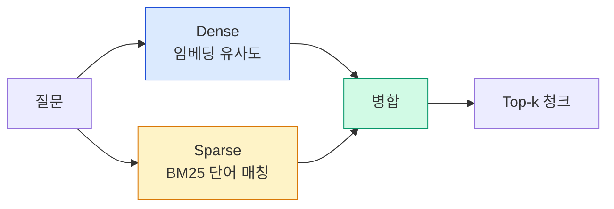

# 3. 하이브리드 검색 구현
{: .no_toc }

Dense Embedding은 의미를 잡고 BM25는 단어를 잡습니다. 한쪽만 쓰면 한쪽이 약합니다. 이 챕터에서 두 방식을 EnsembleRetriever로 결합하고, RRF로 순위를 융합하며, 한국어 토크나이저까지 적용해 한국어 RAG의 함정을 우회합니다.
{: .fs-6 .fw-300 }

---

## ⏱ 타임테이블 (3H — Day 2 09:00–12:00)

| 시간 | 활동 |
|:---:|:---|
| 0:00–0:10 | 어제 회고 + 오늘 목표 |
| 0:10–0:40 | Part 1~2 강의 (Dense vs Sparse, BM25) |
| 0:40–1:10 | Kiwi 토크나이저 시연·실습 |
| 1:10–1:20 | 휴식 |
| 1:20–2:00 | EnsembleRetriever 실습 |
| 2:00–2:30 | 한국어 BM25 강화 실습 |
| 2:30–2:45 | 가중치 sweep 실험 |
| 2:45–3:00 | 평가 체크포인트 |

> 🎤 강사 노트: [99_INSTRUCTOR_GUIDE Ch.03](./99_INSTRUCTOR_GUIDE#chapters)

## 학습 목표

- Dense vs Sparse 검색의 강·약점을 사례로 설명할 수 있다.
- BM25 알고리즘의 직관과 한국어 토크나이저 이슈를 이해한다.
- LangChain `EnsembleRetriever`와 RRF로 두 검색을 결합할 수 있다.
- 가중치 튜닝과 recall@k / MRR로 정량 비교할 수 있다.
- 한국어 행정 문서에 대한 실용적 하이브리드 검색기를 구축한다.

<a id="toc"></a>

## 진행 순서

1. [Dense vs Sparse — 왜 둘 다 필요한가](#part1)
2. [BM25 알고리즘 직관](#part2)
3. [Dense Retrieval 복습](#part3)
4. [Ensemble + RRF](#part4)
5. [한국어 RAG의 함정과 대응](#part5)
6. [평가 — recall@k / MRR](#part6)
7. [실습: 한국어 하이브리드 검색기](#practice)
8. [평가 체크포인트](#check)
9. [Stretch Goal](#stretch)

<a id="part1"></a>

## 1. Dense vs Sparse — 왜 둘 다 필요한가 [↑](#toc)

### 1.1 두 패러다임



| 축 | Dense (임베딩) | Sparse (BM25) |
|:---|:---|:---|
| 표현 | 고차원 실수 벡터 | 단어 빈도 가중치 |
| 매칭 | 의미 유사도 | 정확 단어 매칭 |
| 강점 | 동의어, 의역 | 고유명사, 숫자, 코드 |
| 약점 | 고유명사 약함 | 의미 검색 불가 |
| 비용 | 임베딩 비용 + 벡터 DB | 토큰 인덱스만 |

### 1.2 한국어 사례

| 질문 | Dense 결과 | BM25 결과 | 정답 |
|:---|:---|:---|:---|
| "휴가 신청 절차" | ✅ "연차 사용 절차" 매칭 | ❌ "휴가" 단어 없으면 0점 | Dense 우세 |
| "K-2 차장 권한" | ❌ 사내 코드는 의미 약함 | ✅ "K-2" 정확 매칭 | BM25 우세 |
| "2024-Q3 매출" | ❌ 숫자 의미가 모호 | ✅ "2024-Q3" 정확 매칭 | BM25 우세 |
| "재택 가능?" | ✅ "재택근무 허용" 매칭 | △ 단어 부분 매칭 | Dense 우세 |

**결론**: 둘 다 쓰면 양쪽 강점을 가져갈 수 있습니다.

[↑](#toc)

<a id="part2"></a>

## 2. BM25 알고리즘 직관 [↑](#toc)

### 2.1 핵심 수식

문서 D와 질의 Q에 대해:

```
BM25(D, Q) = Σ_{q in Q}  IDF(q) · (f(q,D) · (k1+1)) / (f(q,D) + k1 · (1 - b + b · |D|/avgdl))
```

말로 풀면:

- **IDF(q)** — 흔한 단어는 점수 적게, 희귀 단어는 점수 크게.
- **f(q,D)** — 그 단어가 문서에 몇 번 나왔나 (단, 너무 많이 나오면 추가 보너스 줄어듦, k1).
- **|D|/avgdl** — 문서 길이 보정 (긴 문서가 단순히 많이 매칭되는 효과 억제, b).

### 2.2 한국어 토크나이저 이슈

BM25는 **단어 단위 매칭**이 핵심입니다. 영어는 공백으로 단어가 잘 나뉘지만 **한국어는 조사·어미 때문에 공백 분리만으론 부족**합니다.

| 입력 | 공백 토큰화 | 형태소 분석 |
|:---|:---|:---|
| "휴가를" | `["휴가를"]` | `["휴가", "를"]` |
| "휴가는" | `["휴가는"]` | `["휴가", "는"]` |
| "휴가입니다" | `["휴가입니다"]` | `["휴가", "입니다"]` |

공백 토큰화로 인덱싱하면 "휴가를"과 "휴가는"이 다른 단어로 취급되어 검색이 누락됩니다. **형태소 분석기**(Kiwi, Mecab, Okt)로 명사·동사 어간만 추출해 인덱싱해야 합니다.

[↑](#toc)

<a id="part3"></a>

## 3. Dense Retrieval 복습 [↑](#toc)

### 3.1 임베딩 모델 선택

| 모델 | 차원 | 비용/1M 토큰 | 한국어 | 메모 |
|:---|---:|---:|:---:|:---|
| OpenAI `text-embedding-3-small` | 1536 | $0.02 | 양호 | 가성비 기본 |
| OpenAI `text-embedding-3-large` | 3072 | $0.13 | 좋음 | 높은 정확도 |
| BAAI `BGE-M3` | 1024 | 로컬 | 좋음 | 다국어, 무료 |
| ko-sroberta | 768 | 로컬 | 매우 좋음 | 한국어 특화 |

### 3.2 코드

```python
from langchain_openai import OpenAIEmbeddings
from langchain_chroma import Chroma

emb = OpenAIEmbeddings(model="text-embedding-3-small")
vectordb = Chroma.from_documents(chunks, emb)
dense_retriever = vectordb.as_retriever(search_kwargs={"k": 5})
```

로컬 한국어 임베딩이 필요하면:

```python
from langchain_huggingface import HuggingFaceEmbeddings
emb = HuggingFaceEmbeddings(model_name="jhgan/ko-sroberta-multitask")
```

### 3.3 차원·비용·정확도 트레이드오프

- 차원이 높을수록 표현력 ↑ but 저장·검색 비용 ↑.
- `text-embedding-3-large`는 `dimensions=` 옵션으로 차원 축소 가능 (Matryoshka). `dimensions=1024`로 비용 절감하면서 정확도 일부 보존.
- **검색 정확도가 임계점에 다다랐다면, 임베딩 모델 업그레이드보다 청킹·하이브리드·Re-Ranking이 ROI가 높습니다.**

[↑](#toc)

<a id="part4"></a>

## 4. Ensemble + RRF [↑](#toc)

### 4.1 EnsembleRetriever 사용법

```python
from langchain_community.retrievers import BM25Retriever
from langchain.retrievers import EnsembleRetriever

bm25 = BM25Retriever.from_documents(chunks)
bm25.k = 5

dense = vectordb.as_retriever(search_kwargs={"k": 5})

ensemble = EnsembleRetriever(
    retrievers=[bm25, dense],
    weights=[0.5, 0.5],   # 합이 1이 아니어도 됨; 상대 가중치
)

docs = ensemble.invoke("재택근무 한도")
```

### 4.2 Reciprocal Rank Fusion (RRF) 직관

`EnsembleRetriever`는 내부적으로 **순위 기반 융합**을 사용합니다(LangChain 구현은 weighted RRF 변형).

```
RRF_score(d) = Σ_i  weight_i / (k + rank_i(d))
```

- 각 retriever에서 청크 d의 순위를 가져와, 순위가 낮을수록(=상위일수록) 점수 큼.
- `k`는 보통 60. 너무 작으면 1·2위 차이가 과대평가, 너무 크면 평탄화.
- 점수 절댓값이 retriever마다 달라도 **순위는 비교 가능**해서 정규화 없이 결합.

### 4.3 가중치 튜닝 가이드

| 도메인 | 추천 weights (BM25, Dense) | 이유 |
|:---|:---|:---|
| 사내 코드·고유명사 많음 | (0.6, 0.4) | 정확 매칭 우세 |
| 일반 매뉴얼·정책 | (0.5, 0.5) | 균형 |
| 산문·블로그·요약 | (0.3, 0.7) | 의미 우세 |

> 정답은 도메인이 정합니다. **자기 데이터에 0.1 단위 sweep으로 측정**하세요.

[↑](#toc)

<a id="part5"></a>

## 5. 한국어 RAG의 함정과 대응 [↑](#toc)

### 5.1 Kiwi 형태소 분석기로 BM25 강화

`rank-bm25`의 BM25Okapi에 Kiwi 토크나이저를 연결합니다.

```bash
uv add kiwipiepy rank-bm25
```

**방법 A — LangChain `BM25Retriever` 사용** (LangChain Community 0.3+):

```python
from kiwipiepy import Kiwi
from langchain_community.retrievers import BM25Retriever

kiwi = Kiwi()

def kiwi_tokenize(text: str):
    # 명사·동사·형용사 어간만 추출 (조사·어미 제거)
    return [t.form for t in kiwi.tokenize(text) if t.tag.startswith(("N", "V", "SL"))]

bm25 = BM25Retriever.from_documents(
    chunks,
    preprocess_func=kiwi_tokenize,   # ← 토큰화 함수 주입
)
bm25.k = 5
```

> ⚠️ `preprocess_func` 파라미터는 LangChain Community 버전에 따라 동작이 다를 수 있습니다. 호환성 문제가 있으면 방법 B를 사용하세요.

**방법 B — `rank_bm25` 직접 래핑 (버전 독립)**:

```python
from rank_bm25 import BM25Okapi
from langchain_core.retrievers import BaseRetriever
from langchain_core.documents import Document
from typing import List

class KiwiBM25Retriever(BaseRetriever):
    docs: List[Document]
    bm25: object
    k: int = 5

    @classmethod
    def from_documents(cls, docs, k=5):
        tokenized = [kiwi_tokenize(d.page_content) for d in docs]
        return cls(docs=docs, bm25=BM25Okapi(tokenized), k=k)

    def _get_relevant_documents(self, query, *, run_manager=None):
        scores = self.bm25.get_scores(kiwi_tokenize(query))
        top = sorted(range(len(scores)), key=lambda i: scores[i], reverse=True)[:self.k]
        return [self.docs[i] for i in top]

bm25 = KiwiBM25Retriever.from_documents(chunks, k=5)
```

### 5.2 토크나이저별 비교

| 분석기 | 설치 난이도 | 속도 | 정확도 |
|:---|:---:|:---:|:---:|
| 공백 토큰화 | 매우 쉬움 | 빠름 | 낮음 (조사 분리 안 됨) |
| **Kiwi** | 쉬움 (`pip`) | 빠름 | **권장** |
| Mecab(은전한닢) | 보통 (시스템 의존) | 매우 빠름 | 우수 |
| Okt(KoNLPy) | 쉬움 | 보통 | 양호 |

### 5.3 다국어 임베딩 활용

영어·한국어 혼재 문서면 다국어 임베딩(`BGE-M3`, `text-embedding-3-large`)이 안전합니다. ko-sroberta는 한국어만 다룰 때 강력.

[↑](#toc)

<a id="part6"></a>

## 6. 평가 — recall@k / MRR [↑](#toc)

### 6.1 메트릭 정의

- **recall@k**: 정답 청크가 상위 k개 안에 들어왔는가 (binary).
- **MRR (Mean Reciprocal Rank)**: 정답 청크의 첫 등장 순위의 역수 평균. `1/rank`.

```python
def evaluate(retriever, eval_set, k=5):
    """eval_set: [(question, set_of_correct_chunk_ids), ...]"""
    recalls, rr = 0, 0.0
    for q, gold_ids in eval_set:
        docs = retriever.invoke(q)[:k]
        ids = [d.metadata.get("id") for d in docs]
        if any(i in gold_ids for i in ids):
            recalls += 1
            rank = next(r for r, i in enumerate(ids, 1) if i in gold_ids)
            rr += 1.0 / rank
    n = len(eval_set)
    return {"recall@k": recalls / n, "MRR": rr / n}
```

### 6.2 baseline → 하이브리드 비교 흐름

1. eval_set 구축: 질문 10~30개 + 정답 청크 ID
2. Dense, BM25, Ensemble 각각 평가
3. 표로 정리 → 어느 retriever가 어느 질문 유형에 강한지 분석

[↑](#toc)

<a id="practice"></a>

## 7. 실습: 한국어 하이브리드 검색기 [↑](#toc)

### 7.1 시나리오

회사 정책 문서로 BM25 / Dense / Ensemble 세 retriever를 만들고, 5개 질문에 대해 recall과 응답 품질을 비교합니다.

### 7.2 코드

```python
from kiwipiepy import Kiwi
from langchain_core.documents import Document
from langchain_community.retrievers import BM25Retriever
from langchain.retrievers import EnsembleRetriever
from langchain_openai import OpenAIEmbeddings
from langchain_chroma import Chroma

# 1. 샘플 청크
chunks = [
    Document(page_content="연차는 입사일로부터 1년 후부터 15일이 부여됩니다.", metadata={"id": "c1"}),
    Document(page_content="반차는 오전·오후 4시간 단위로 사용 가능합니다.", metadata={"id": "c2"}),
    Document(page_content="재택근무는 월 4일까지 허용됩니다.", metadata={"id": "c3"}),
    Document(page_content="K-2 차장 결재는 5천만원 이하 지출에 한합니다.", metadata={"id": "c4"}),
    Document(page_content="경조사 휴가는 본인 결혼 5일, 직계가족 사망 5일이 부여됩니다.", metadata={"id": "c5"}),
    Document(page_content="유연근무제 신청은 매월 1일까지 인사팀에 제출합니다.", metadata={"id": "c6"}),
]

# 2. Kiwi 토크나이저 + BM25
kiwi = Kiwi()
def tokenize(t): return [x.form for x in kiwi.tokenize(t) if x.tag.startswith(("N","V","SL"))]
bm25 = BM25Retriever.from_documents(chunks, preprocess_func=tokenize)
bm25.k = 3

# 3. Dense (Chroma + OpenAI)
emb = OpenAIEmbeddings(model="text-embedding-3-small")
vectordb = Chroma.from_documents(chunks, emb, collection_name="hybrid_demo")
dense = vectordb.as_retriever(search_kwargs={"k": 3})

# 4. Ensemble
ensemble = EnsembleRetriever(retrievers=[bm25, dense], weights=[0.5, 0.5])

# 5. 평가 셋 (질문, 정답 청크 ID)
eval_set = [
    ("재택 가능 일수?",        {"c3"}),
    ("K-2 차장 결재 한도?",    {"c4"}),
    ("결혼 휴가 며칠?",        {"c5"}),
    ("유연근무 누구한테 내?",   {"c6"}),
    ("연차 부여 기준?",        {"c1"}),
]

# 6. 비교
def recall(retriever, k=3):
    hits = 0
    for q, gold in eval_set:
        docs = retriever.invoke(q)[:k]
        if any(d.metadata.get("id") in gold for d in docs):
            hits += 1
    return hits / len(eval_set)

print(f"BM25     recall@3: {recall(bm25):.0%}")
print(f"Dense    recall@3: {recall(dense):.0%}")
print(f"Ensemble recall@3: {recall(ensemble):.0%}")
```

### 7.3 예상 출력

```
BM25     recall@3: 80%
Dense    recall@3: 80%
Ensemble recall@3: 100%
```

> Ensemble은 BM25가 잘하는 "K-2"·"인사팀" 같은 고유명사와 Dense가 잘하는 의역·동의어를 모두 가져옵니다.

### 7.4 가중치 sweep

```python
for w_bm25 in [0.2, 0.3, 0.5, 0.7, 0.8]:
    e = EnsembleRetriever(retrievers=[bm25, dense], weights=[w_bm25, 1 - w_bm25])
    print(f"BM25={w_bm25:.1f}, Dense={1-w_bm25:.1f}: recall@3 = {recall(e):.0%}")
```

[↑](#toc)

<a id="check"></a>

### ✅ 완료 체크 (TA용)

- BM25/Dense/Ensemble 3 retriever recall@3 비교 표 출력
- "K-2 차장 결재 한도?" 같은 고유명사 질의에서 BM25/Ensemble이 정답 반환
- 가중치 sweep 결과 출력 (최소 3개 조합)

## 8. 평가 체크포인트 [↑](#toc)

### 객관식

**Q1.** 한국어 BM25에 Kiwi 같은 형태소 분석기를 쓰는 이유는?

1. 속도가 빠르기 때문
2. **조사·어미 때문에 공백 토큰화로는 같은 단어를 다른 단어로 인식하기 때문**
3. 메모리 절약
4. 영어 호환성

{::nomarkdown}
<details><summary>정답</summary>
<div class="answer-body"><strong>2</strong>. "휴가를"·"휴가는"이 다르게 인덱싱되면 검색 누락이 생깁니다.</div>
</details>
{:/nomarkdown}

**Q2.** RRF에서 상수 k(보통 60)의 역할은?

1. 검색하는 문서 수
2. **순위 차이의 영향력을 평탄화·증폭하는 스무딩 상수**
3. retriever 개수
4. 임베딩 차원

{::nomarkdown}
<details><summary>정답</summary>
<div class="answer-body"><strong>2</strong>. k가 작을수록 1·2위 차이가 커지고, 클수록 평탄화됩니다.</div>
</details>
{:/nomarkdown}

**Q3.** Dense보다 BM25가 강한 질문 유형은?

1. 의역된 자연어 질문
2. 동의어가 많은 질문
3. **사내 코드·번호·고유명사가 포함된 질문**
4. 추상적 요약 질문

{::nomarkdown}
<details><summary>정답</summary>
<div class="answer-body"><strong>3</strong>. 정확 매칭이 BM25의 강점.</div>
</details>
{:/nomarkdown}

### 주관식

**Q4.** 자기 도메인에서 Dense·BM25 가중치를 어떻게 정할지 절차를 적어보세요.

{::nomarkdown}
<details><summary>모범 응답</summary>
<div class="answer-body">(1) 평가 질문 20개 + 정답 청크 ID 작성. (2) <code>weights=(w, 1-w)</code>를 0.1 단위 sweep. (3) recall@3·MRR을 표로. (4) 최고 성능의 w를 선택하되, 단일 retriever의 강점이 큰 질문 유형은 별도 분석.</div>
</details>
{:/nomarkdown}

**Q5.** 7.2 코드를 자기 문서로 돌리고, Ensemble이 단일 retriever보다 좋은 질문과 그렇지 않은 질문을 각 1개씩 적고 이유를 분석하세요.

{::nomarkdown}
<details><summary>채점 기준</summary>
<div class="answer-body">이유 분석에 (a) 질문의 어휘 특성 (b) 정답 청크의 단어/의미 분포 (c) 가중치 조정 시사점이 들어 있으면 만점.</div>
</details>
{:/nomarkdown}

[↑](#toc)

<a id="stretch"></a>

## 9. 🚀 Stretch Goal [↑](#toc)

> 난이도: ★☆☆ 30분 / ★★☆ 1시간 / ★★★ 2시간+

1. **토크나이저 비교** ★★☆ (1시간): Kiwi vs Mecab vs Okt로 동일 데이터 BM25 3개, recall 비교.
2. **다중 임베딩 앙상블** ★★☆ (1시간): ko-sroberta + OpenAI 두 retriever를 EnsembleRetriever로.
3. **Hard query 셋** ★★★ (2시간+): 사용자 로그에서 실패 30개 → 평가 셋 → weights sweep 최적값.

[↑](#toc)

---

## 다음 챕터

검색의 입력(Ch.02)과 검색 자체(Ch.03)를 다듬었습니다. 그래도 top-k에는 노이즈가 섞일 수 있습니다. Cross-Encoder Re-Ranking으로 마지막 정제를 합니다.

→ [Ch.04 Re-Ranking으로 정확도 향상](./04_Re_Ranking)
