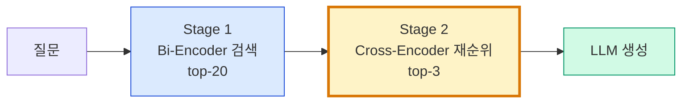
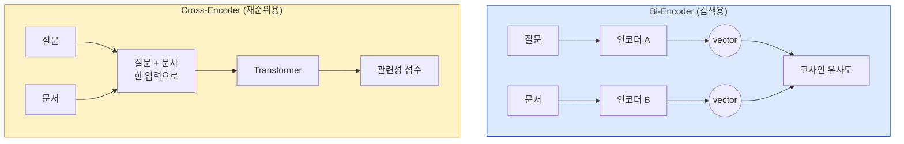

# 4. Re-Ranking으로 정확도 향상
{: .no_toc }

하이브리드 검색으로 top-20을 가져왔어도, 정작 정답은 12위에 있을 수 있습니다. Cross-Encoder Re-Ranking은 LLM에게 넘기기 전 마지막으로 순위를 다시 매겨 top-3에 정답을 끌어옵니다. 정확도와 지연시간의 트레이드오프를 측정 가능한 형태로 다룹니다.
{: .fs-6 .fw-300 }

---

## ⏱ 타임테이블 (2H — Day 2 13:00–15:00)

| 시간 | 활동 |
|:---:|:---|
| 0:00–0:20 | Part 1~2 강의 (2-Stage, Bi vs Cross) |
| 0:20–0:50 | Cohere Rerank 실습 |
| 0:50–1:00 | 휴식 |
| 1:00–1:30 | 로컬 HuggingFace reranker (옵션) |
| 1:30–1:55 | 4-way 비교 실험 |
| 1:55–2:00 | 정리 + Ch.05 예고 |

> 🎤 강사 노트: [99_INSTRUCTOR_GUIDE Ch.04](./99_INSTRUCTOR_GUIDE#chapters)

## 학습 목표

- 2-Stage Retrieval(Bi-Encoder + Cross-Encoder)이 왜 필요한지 설명할 수 있다.
- Cohere Rerank API와 로컬 HuggingFace 리랭커를 둘 다 사용할 수 있다.
- LangChain `ContextualCompressionRetriever`로 기존 retriever 위에 Re-Ranking을 얹을 수 있다.
- precision@k와 지연시간을 측정해 자신의 RAG에 맞는 설정을 정한다.

<a id="toc"></a>

## 진행 순서

1. [2-Stage Retrieval의 필요성](#part1)
2. [Bi-Encoder vs Cross-Encoder](#part2)
3. [Cohere Rerank API](#part3)
4. [로컬 리랭커 (HuggingFace)](#part4)
5. [정확도 vs 지연시간](#part5)
6. [하이브리드 + Re-Ranking 통합](#part6)
7. [실습: 4-way 비교](#practice)
8. [평가 체크포인트](#check)
9. [Stretch Goal](#stretch)

<a id="part1"></a>

## 1. 2-Stage Retrieval의 필요성 [↑](#toc)

### 1.1 검색의 역설

벡터 검색은 빠릅니다(수백만 청크에서 ms). 하지만 **정확도는 한계**가 있습니다. top-3을 LLM에게 바로 넘기면 정답이 6위에 있는 경우 놓칩니다.

해결: **top-20을 가져와 다시 정렬**해서 top-3을 만든다.



### 1.2 효과 예시

| 단계 | precision@3 | 지연시간 |
|:---|:---:|:---:|
| Bi-Encoder만 (top-3) | 60% | 50ms |
| Hybrid (Ch.03) | 78% | 80ms |
| **Hybrid + Re-Ranking** | **92%** | 350ms |

> 수치는 도메인에 의존합니다. **자기 데이터에 측정해 본인 trade-off 곡선**을 그리세요.

[↑](#toc)

<a id="part2"></a>

## 2. Bi-Encoder vs Cross-Encoder [↑](#toc)

### 2.1 두 구조의 차이



| 축 | Bi-Encoder | Cross-Encoder |
|:---|:---|:---|
| 입력 | 질문·문서 따로 | 질문+문서 함께 |
| 표현 | 사전 임베딩 가능 | 매번 forward pass |
| 속도 | 매우 빠름 | 느림 (top-N에만) |
| 정확도 | 양호 | 매우 우수 |
| 용도 | **1차 검색** | **2차 재순위** |

핵심은 **Cross-Encoder는 인덱싱이 불가능**하다는 점입니다. 그래서 모든 청크를 채점할 수 없고 top-N에만 적용합니다.

[↑](#toc)

<a id="part3"></a>

## 3. Cohere Rerank API [↑](#toc)

### 3.1 가입과 키

[cohere.com](https://cohere.com)에서 가입하고 API 키 발급. 무료 크레딧 제공.

```bash
uv add langchain-cohere
```

```python
import os
os.environ["COHERE_API_KEY"] = "..."
```

### 3.2 단독 사용

```python
from langchain_cohere import CohereRerank

reranker = CohereRerank(model="rerank-multilingual-v3.0", top_n=3)

# 입력: List[Document], 출력: 재정렬된 List[Document]
reranked = reranker.compress_documents(docs, query="재택근무 한도?")
for d in reranked:
    print(d.metadata.get("relevance_score"), d.page_content[:60])
```

`rerank-multilingual-v3.0`은 한국어 포함 100+ 언어 지원.

### 3.3 LangChain Retriever와 결합

```python
from langchain.retrievers.contextual_compression import ContextualCompressionRetriever

compression_retriever = ContextualCompressionRetriever(
    base_compressor=reranker,        # Re-Ranker
    base_retriever=ensemble,         # Ch.03의 Hybrid retriever
)

docs = compression_retriever.invoke("재택근무 한도?")
```

`ContextualCompressionRetriever`는 base retriever의 결과를 compressor가 처리하는 일반 패턴이며, Reranker도 compressor의 한 종류입니다.

### 3.4 Cohere의 트레이드오프

| 항목 | Cohere Rerank |
|:---|:---|
| 한국어 정확도 | 우수 (multilingual-v3) |
| 응답 시간 | ~200ms (네트워크 포함) |
| 비용 | $1 / 1000 검색 (rerank-3) |
| 인터넷 의존 | O (보안 정책 확인 필요) |
| top-N 제한 | 1000 docs / call |

[↑](#toc)

<a id="part4"></a>

## 4. 로컬 리랭커 (HuggingFace) [↑](#toc)

보안·비용·오프라인 이유로 로컬이 필요할 때.

### 4.1 패키지

```bash
uv add sentence-transformers
```

### 4.2 BAAI bge-reranker-v2-m3 (다국어)

```python
from langchain.retrievers.document_compressors import CrossEncoderReranker
from langchain_community.cross_encoders import HuggingFaceCrossEncoder

model = HuggingFaceCrossEncoder(model_name="BAAI/bge-reranker-v2-m3")
reranker = CrossEncoderReranker(model=model, top_n=3)

from langchain.retrievers.contextual_compression import ContextualCompressionRetriever
compression_retriever = ContextualCompressionRetriever(
    base_compressor=reranker,
    base_retriever=ensemble,
)
```

### 4.3 한국어 특화 — Dongjin-kr/ko-reranker

```python
model = HuggingFaceCrossEncoder(model_name="Dongjin-kr/ko-reranker")
reranker = CrossEncoderReranker(model=model, top_n=3)
```

### 4.4 모델 비교 가이드

| 모델 | 크기 | 한국어 | GPU 필요 | 메모 |
|:---|:---:|:---:|:---:|:---|
| BAAI/bge-reranker-v2-m3 | 568M | 우수 | 권장 | 다국어 SOTA급 |
| BAAI/bge-reranker-base | 278M | 양호 | 선택 | 가벼움, 영어 위주 |
| Dongjin-kr/ko-reranker | 568M | 매우 우수 | 권장 | 한국어 fine-tuned |
| jina-reranker-v2-multilingual | 278M | 우수 | 선택 | 빠름·다국어 |

### 4.5 CPU vs GPU 성능

| 환경 | top-20 재순위 시간 |
|:---|:---|
| Apple M2 (CPU) | ~600ms |
| RTX 3060 (GPU) | ~80ms |
| A100 (GPU) | ~30ms |

CPU에서도 작동하지만 프로덕션은 GPU 권장. 가용 메모리 ~2GB.

[↑](#toc)

<a id="part5"></a>

## 5. 정확도 vs 지연시간 [↑](#toc)

### 5.1 결정 변수

| 변수 | 영향 |
|:---|:---|
| top-k (Stage 1 반환) | 클수록 recall↑ but 재순위 비용↑ |
| top-n (Stage 2 출력) | LLM 토큰·환각 트레이드오프 |
| 모델 크기 | 큰 모델일수록 정확하지만 느림 |
| 배치/캐싱 | 같은 (q, doc) 쌍은 캐싱 가능 |

### 5.2 권장 출발점

| 사용 사례 | top-k | top-n | 모델 |
|:---|---:|---:|:---|
| 인터랙티브 챗봇 | 20 | 4 | Cohere or jina v2 |
| 정밀도 우선 | 50 | 3 | bge-reranker-v2-m3 |
| 비용 최우선 | 10 | 3 | 리랭커 생략(또는 Cohere만) |

### 5.3 캐싱 전략

같은 질문에 반복 답할 가능성이 있으면, **(query, doc_id) → score**를 키-값 캐시. 자주 나오는 FAQ 패턴에서 50% 이상 절감 가능.

[↑](#toc)

<a id="part6"></a>

## 6. 하이브리드 + Re-Ranking 통합 [↑](#toc)

Ch.03의 EnsembleRetriever 위에 Re-Ranking을 얹는 한 줄 패턴:

```python
from langchain.retrievers import EnsembleRetriever
from langchain.retrievers.contextual_compression import ContextualCompressionRetriever
from langchain_cohere import CohereRerank
# from langchain.retrievers.document_compressors import CrossEncoderReranker
# from langchain_community.cross_encoders import HuggingFaceCrossEncoder

# 1. Hybrid (Ch.03)
ensemble = EnsembleRetriever(retrievers=[bm25, dense], weights=[0.5, 0.5])

# 2. Reranker
reranker = CohereRerank(model="rerank-multilingual-v3.0", top_n=4)
# 또는 로컬:
# model = HuggingFaceCrossEncoder(model_name="BAAI/bge-reranker-v2-m3")
# reranker = CrossEncoderReranker(model=model, top_n=4)

# 3. 통합 retriever
final_retriever = ContextualCompressionRetriever(
    base_compressor=reranker,
    base_retriever=ensemble,
)

docs = final_retriever.invoke("재택근무 한도?")
```

이제 LLM 입력은 `final_retriever.invoke(question)` 한 줄로.

[↑](#toc)

<a id="practice"></a>

## 7. 실습: 4-way 비교 [↑](#toc)

### 7.1 시나리오

같은 질문 셋에 대해 (Dense Only / Hybrid / Hybrid+Cohere / Hybrid+Local) 네 retriever를 precision@3과 지연시간으로 비교.

### 7.2 코드

```python
import time
from langchain.retrievers.contextual_compression import ContextualCompressionRetriever
from langchain_cohere import CohereRerank
from langchain.retrievers.document_compressors import CrossEncoderReranker
from langchain_community.cross_encoders import HuggingFaceCrossEncoder

# 가정: ensemble, dense, eval_set은 Ch.03에서 만든 것 사용

# 4-way retrievers
cohere_re = ContextualCompressionRetriever(
    base_compressor=CohereRerank(model="rerank-multilingual-v3.0", top_n=3),
    base_retriever=ensemble,
)

local_model = HuggingFaceCrossEncoder(model_name="BAAI/bge-reranker-v2-m3")
local_re = ContextualCompressionRetriever(
    base_compressor=CrossEncoderReranker(model=local_model, top_n=3),
    base_retriever=ensemble,
)

retrievers = {
    "Dense": dense,
    "Hybrid": ensemble,
    "Hybrid+Cohere": cohere_re,
    "Hybrid+Local(bge-v2-m3)": local_re,
}

def precision_at_3(retriever):
    hits, latencies = 0, []
    for q, gold in eval_set:
        t0 = time.time()
        docs = retriever.invoke(q)[:3]
        latencies.append((time.time() - t0) * 1000)
        if any(d.metadata.get("id") in gold for d in docs):
            hits += 1
    return hits / len(eval_set), sum(latencies) / len(latencies)

import pandas as pd
rows = []
for name, r in retrievers.items():
    p, lat = precision_at_3(r)
    rows.append({"retriever": name, "precision@3": f"{p:.0%}", "latency_ms": f"{lat:.0f}"})

print(pd.DataFrame(rows))
```

### 7.3 예상 출력

```
              retriever precision@3 latency_ms
0                 Dense        60%         55
1                Hybrid        80%         95
2         Hybrid+Cohere       100%        290
3 Hybrid+Local(bge-v2-m3)     100%        650
```

> Cohere가 빠른 건 GPU 클러스터를 쓰기 때문. 로컬은 GPU에서 200~300ms로 떨어집니다.

[↑](#toc)

<a id="check"></a>

### ✅ 완료 체크 (TA용)

- 4-way (Dense/Hybrid/Hybrid+Cohere/Hybrid+Local) precision@3 + latency 표 출력
- Cohere 또는 로컬 reranker 중 1개 이상 성공
- 본인 데이터에 적용해 best 옵션 선정

## 8. 평가 체크포인트 [↑](#toc)

### 객관식

**Q1.** Cross-Encoder가 Bi-Encoder보다 정확한 이유는?

1. 모델이 더 크기 때문
2. **질문과 문서를 함께 입력해 토큰 간 attention으로 관계를 직접 모델링하기 때문**
3. 더 많은 데이터로 학습돼서
4. 임베딩이 정규화돼서

{::nomarkdown}
<details><summary>정답</summary>
<div class="answer-body"><strong>2</strong>. Bi-Encoder는 사후에 코사인만 계산하지만, Cross-Encoder는 두 입력을 한 번에 처리합니다.</div>
</details>
{:/nomarkdown}

**Q2.** Cross-Encoder를 인덱싱 단계에서 모든 청크에 못 쓰는 이유는?

1. **질문이 들어와야 점수를 계산할 수 있어 사전 계산이 불가능**
2. 정확도가 낮아서
3. 라이선스 문제
4. 한국어 미지원

{::nomarkdown}
<details><summary>정답</summary>
<div class="answer-body"><strong>1</strong>. 그래서 1차로 빠른 Bi-Encoder가 top-N을 가져오고 2차로 Cross가 채점합니다.</div>
</details>
{:/nomarkdown}

**Q3.** `ContextualCompressionRetriever`의 역할은?

1. 청크를 압축해 토큰 수 줄이기 (그것만)
2. **base_retriever의 결과를 base_compressor가 후처리(필터/재순위/요약)하는 일반 래퍼**
3. 임베딩 차원 축소
4. 중복 제거

{::nomarkdown}
<details><summary>정답</summary>
<div class="answer-body"><strong>2</strong>. Reranker, LLMFilter, EmbeddingsFilter 등 다양한 compressor를 끼울 수 있습니다.</div>
</details>
{:/nomarkdown}

### 주관식

**Q4.** 자기 시스템이 SLA로 응답 1초 이내를 요구한다면, top-k와 모델을 어떻게 정할지 근거와 함께 설계하세요.

{::nomarkdown}
<details><summary>모범 응답</summary>
<div class="answer-body">LLM 생성 시간 ~600ms 가정 시 검색+재순위에 400ms 예산. CPU 환경이면 Cohere(~290ms)·jina v2(~150ms) 권장. GPU면 bge-reranker-v2-m3 + top-k=20 OK. top-k가 50이면 재순위 비용↑이므로 20으로 제한.</div>
</details>
{:/nomarkdown}

**Q5.** 자기 데이터로 7.2 실험을 돌려 표를 채우고, 어느 옵션을 프로덕션에 채택할지 정하고 이유를 적으세요.

{::nomarkdown}
<details><summary>채점 기준</summary>
<div class="answer-body">(1) 측정 표 (2) 비용·SLA·보안 제약 명시 (3) 결정 근거가 명확하면 만점.</div>
</details>
{:/nomarkdown}

[↑](#toc)

<a id="stretch"></a>

## 9. 🚀 Stretch Goal [↑](#toc)

> 난이도: ★☆☆ 30분 / ★★☆ 1시간 / ★★★ 2시간+

1. **한국어 reranker 비교 벤치마크** ★★★ (2시간+): bge-v2-m3 vs ko-reranker vs jina-v2 본인 데이터로 비교.
2. **캐싱 도입** ★☆☆ (30분): `(query, doc_id) -> score` 캐시 + 반복 질의 latency 변화 측정.
3. **top-k sweep** ★☆☆ (45분): top-k 5/10/20/50 precision·latency 곡선.
4. **MMR과 비교** ★★☆ (1시간): MMR 다양성 vs Re-Ranking LLM 답변 품질 비교.

[↑](#toc)

---

## 다음 챕터

검색이 충분히 정확해졌습니다. 이제 RAG를 한 도구로 두고 **다른 도구들과 함께 쓰는 에이전트**를 만듭니다.

→ [Ch.05 다중 도구 통합 AI 에이전트](./05_다중_도구_에이전트)
