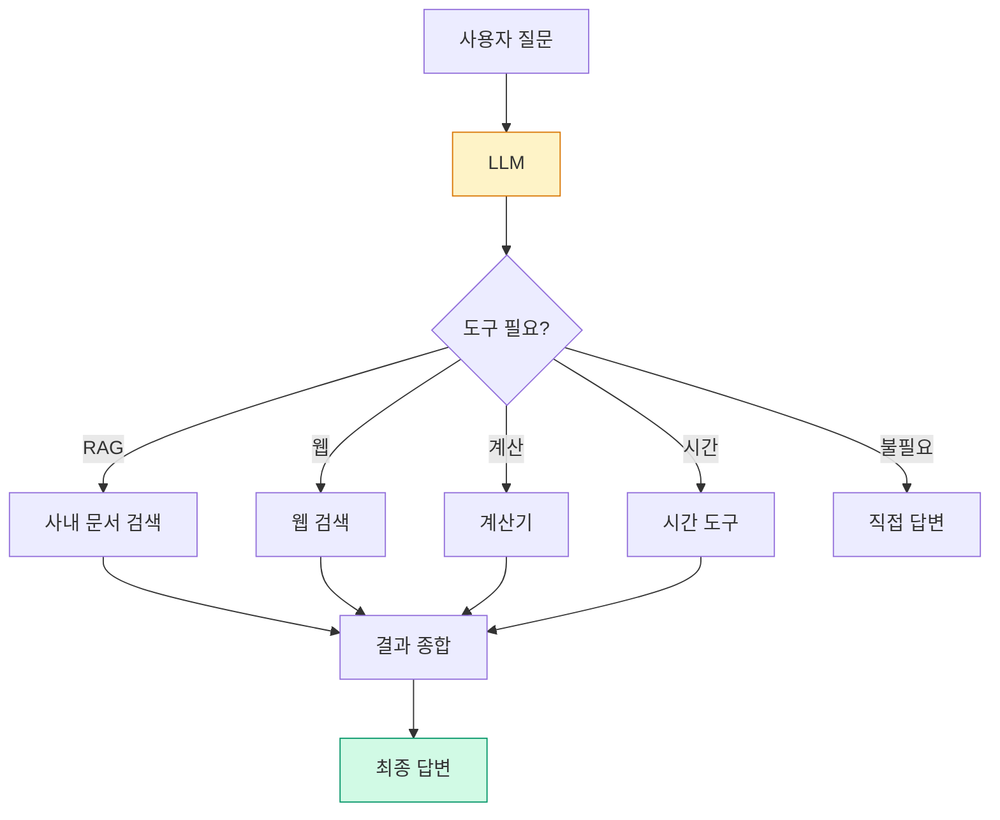

# 5. 다중 도구 통합 AI 에이전트
{: .no_toc }

RAG는 강력하지만 한 가지 도구일 뿐입니다. 사내 문서 + 웹 검색 + 계산 + 시간을 함께 쓰는 에이전트를 만들면, "오늘 우리 회사 휴가 며칠 남아있고 그 기간 환율 어떻게 되지?" 같은 복합 질문도 답할 수 있습니다.
{: .fs-6 .fw-300 }

---

## ⏱ 타임테이블 (3H — Day 2 15:00–18:00)

| 시간 | 활동 |
|:---:|:---|
| 0:00–0:30 | Part 1~3 강의 (왜 도구·Tool Calling·RAG-as-Tool) |
| 0:30–1:00 | calculator + now_kst 실습 |
| 1:00–1:10 | 휴식 |
| 1:10–1:50 | RAG 도구 + Tavily 통합 |
| 1:50–2:30 | create_react_agent + 5시나리오 |
| 2:30–3:00 | 도구 선택 정확도 + 회고 |

> 🎤 강사 노트: [99_INSTRUCTOR_GUIDE Ch.05](./99_INSTRUCTOR_GUIDE#chapters)

## 학습 목표

- LLM Tool Calling의 동작 원리를 설명할 수 있다.
- LangChain `@tool` 데코레이터로 직접 도구를 정의할 수 있다.
- RAG 검색을 도구(Tool)로 감싸 다른 도구와 결합할 수 있다.
- LangGraph `create_react_agent`로 다중 도구 에이전트를 한 줄에 만든다.
- 도구 설명문(docstring)을 잘 써서 도구 선택 정확도를 높일 수 있다.

<a id="toc"></a>

## 진행 순서

1. [왜 RAG만으로 부족한가](#part1)
2. [Tool Calling 기초](#part2)
3. [RAG를 Tool로 만들기](#part3)
4. [다중 도구 통합 예제](#part4)
5. [LangGraph 미리보기](#part5)
6. [도구 설명문 베스트 프랙티스](#part6)
7. [실습: 회사 비서 에이전트](#practice)
8. [평가 체크포인트](#check)
9. [Stretch Goal](#stretch)

<a id="part1"></a>

## 1. 왜 RAG만으로 부족한가 [↑](#toc)

| 사용자 질문 | RAG가 잘하나? | 추가로 필요한 것 |
|:---|:---:|:---|
| "휴가 정책 알려줘" | ✅ | — |
| "오늘 며칠 휴가 남아있어?" | ❌ | 직원 DB 조회 |
| "내년 1월 1일 무슨 요일?" | ❌ | 시간 도구 |
| "프로젝트 예산 1.2억의 8.5%는?" | ❌ | 계산기 |
| "최근 우리 업계 트렌드?" | ❌ | 웹 검색 |



[↑](#toc)

<a id="part2"></a>

## 2. Tool Calling 기초 [↑](#toc)

### 2.1 메커니즘

OpenAI·Anthropic 모델은 **함수 시그니처와 설명을 보고 호출 여부와 인자를 결정**합니다.

1. 사용자 질문 + 도구 목록을 LLM에게 전달
2. LLM이 응답 대신 `tool_call`을 반환 (함수명, 인자 JSON)
3. 우리는 그 함수를 실제로 실행
4. 실행 결과를 다시 LLM에 전달
5. LLM이 최종 답변 생성

LangChain은 이 흐름을 추상화합니다.

### 2.2 `@tool` 데코레이터

```python
from langchain_core.tools import tool

@tool
def calculator(expression: str) -> str:
    """수식을 계산해서 결과를 반환합니다.
    예: '1.2e8 * 0.085' -> '10200000.0'
    오직 사칙연산과 거듭제곱(**)만 허용됩니다.
    """
    try:
        # 안전을 위해 eval 대신 제한된 평가
        import ast, operator as op
        ops = {ast.Add: op.add, ast.Sub: op.sub, ast.Mult: op.mul,
               ast.Div: op.truediv, ast.Pow: op.pow, ast.USub: op.neg}
        def _eval(node):
            if isinstance(node, ast.Constant): return node.value
            if isinstance(node, ast.BinOp): return ops[type(node.op)](_eval(node.left), _eval(node.right))
            if isinstance(node, ast.UnaryOp): return ops[type(node.op)](_eval(node.operand))
            raise ValueError("허용되지 않은 식")
        return str(_eval(ast.parse(expression, mode="eval").body))
    except Exception as e:
        return f"계산 오류: {e}"
```

핵심:

- **docstring이 LLM에 전달**됩니다. 잘 써야 함.
- **타입 힌트**(`expression: str`)도 LLM이 봅니다.
- 함수 이름 자체도 신호.

### 2.3 `bind_tools` — LLM에 도구 연결

```python
from langchain_openai import ChatOpenAI
from langchain_core.messages import HumanMessage

llm = ChatOpenAI(model="gpt-4o-mini", temperature=0)
llm_with_tools = llm.bind_tools([calculator])

response = llm_with_tools.invoke([HumanMessage("1.2억의 8.5%는?")])
print(response.tool_calls)
# [{'name': 'calculator', 'args': {'expression': '1.2e8 * 0.085'}, 'id': '...', 'type': 'tool_call'}]
```

LLM은 `tool_calls`만 돌려주고, 실제 실행은 우리가 합니다.

[↑](#toc)

<a id="part3"></a>

## 3. RAG를 Tool로 만들기 [↑](#toc)

### 3.1 `create_retriever_tool` — 한 줄

```python
from langchain.tools.retriever import create_retriever_tool

# Ch.04에서 만든 final_retriever (Hybrid + Re-Ranking)
rag_tool = create_retriever_tool(
    final_retriever,
    name="search_company_policy",
    description=(
        "사내 정책·규정·인사·복지 관련 질문에 사용하세요. "
        "예: 휴가 일수, 재택근무 한도, 경조사 휴가, 결재 한도. "
        "외부 트렌드나 실시간 데이터에는 사용하지 마세요."
    ),
)
```

`name`과 `description`이 LLM의 도구 선택 정확도를 결정합니다.

### 3.2 `@tool`로 직접 만들기 — 후처리가 필요할 때

```python
@tool
def search_company_policy(query: str) -> str:
    """사내 정책·규정·인사·복지 문서를 검색합니다.
    인자 query에는 자연어 질의를 넣으세요.
    출력은 출처 표시와 함께 검색된 본문 발췌입니다.
    """
    docs = final_retriever.invoke(query)
    return "\n\n".join(
        f"[출처: {d.metadata.get('source')}, p.{d.metadata.get('page')}]\n{d.page_content}"
        for d in docs[:3]
    )
```

직접 정의하면 출처 포맷팅·필터링 등 자유로워집니다.

[↑](#toc)

<a id="part4"></a>

## 4. 다중 도구 통합 예제 [↑](#toc)

### 4.1 4개 도구 정의

```python
from datetime import datetime
from langchain_core.tools import tool
from langchain_community.tools.tavily_search import TavilySearchResults

# 1) 사내 문서 RAG (위에서 만든 것)
# rag_tool

# 2) 웹 검색 — Tavily (https://tavily.com 가입 후 무료 1000회/월)
# .env에 TAVILY_API_KEY=tvly-... 등록 필요
web_tool = TavilySearchResults(
    max_results=3,
    name="web_search",
    description="실시간 뉴스, 환율, 경쟁사 정보, 일반 상식 등 최신·외부 정보가 필요할 때 사용하세요. 사내 정책에는 사용하지 마세요.",
)

# 3) 계산기 (위에서 만든 것)
# calculator

# 4) 시간/날짜
@tool
def now_kst() -> str:
    """현재 한국시간(KST)을 'YYYY-MM-DD HH:MM:SS (요일)' 형식으로 반환합니다.
    상대 날짜를 절대 날짜로 변환할 때 먼저 호출하세요.
    """
    from zoneinfo import ZoneInfo
    n = datetime.now(ZoneInfo("Asia/Seoul"))
    return n.strftime("%Y-%m-%d %H:%M:%S") + f" ({['월','화','수','목','금','토','일'][n.weekday()]})"

tools = [search_company_policy, web_tool, calculator, now_kst]
```

### 4.2 수동 ReAct 루프 (작동 원리 이해용)

```python
from langchain_core.messages import HumanMessage, ToolMessage, AIMessage
import json

llm_with_tools = ChatOpenAI(model="gpt-4o-mini", temperature=0).bind_tools(tools)
tool_map = {t.name: t for t in tools}

def run(question, max_steps=5):
    messages = [HumanMessage(question)]
    for _ in range(max_steps):
        ai = llm_with_tools.invoke(messages)
        messages.append(ai)
        if not ai.tool_calls:
            return ai.content
        for call in ai.tool_calls:
            result = tool_map[call["name"]].invoke(call["args"])
            messages.append(ToolMessage(content=str(result), tool_call_id=call["id"]))
    return "최대 반복 초과"

print(run("내일 결재 한도가 얼만큼인지 알려주고, 그 금액의 8.5% 부가세도 계산해줘"))
```

이 루프가 ReAct의 본질입니다. Ch.07에서 더 자세히 다룹니다.

[↑](#toc)

<a id="part5"></a>

## 5. LangGraph 미리보기 [↑](#toc)

위 수동 루프를 LangGraph가 한 줄로 만들어줍니다.

```python
from langgraph.prebuilt import create_react_agent
from langchain_openai import ChatOpenAI

agent = create_react_agent(
    model=ChatOpenAI(model="gpt-4o-mini", temperature=0),
    tools=tools,
)

result = agent.invoke({
    "messages": [("user", "재택근무 한도 알려주고 한 달 출근 일수가 며칠인지 계산해줘")]
})
print(result["messages"][-1].content)
```

스트리밍으로 단계별 출력:

```python
for chunk in agent.stream({"messages": [("user", "결재 한도와 8.5%")]}):
    print(chunk)
```

본격적인 그래프 제어(분기·재시도·HITL)는 Ch.08.

[↑](#toc)

<a id="part6"></a>

## 6. 도구 설명문 베스트 프랙티스 [↑](#toc)

### 6.1 좋은 vs 나쁜 docstring

| ❌ 나쁨 | ✅ 좋음 |
|:---|:---|
| `"""검색"""` | `"""사내 정책 문서를 검색합니다. 휴가·재택·경조사 등 인사 관련 질문에 사용."""` |
| `"""계산기"""` | `"""사칙연산과 거듭제곱(**)만 허용. expression='1+2*3'."""` |
| 사용 사례 누락 | "예: '휴가 며칠?'" 같은 호출 예 포함 |
| 사용 금지 사례 누락 | "외부 데이터에는 사용 금지" 명시 |

### 6.2 체크리스트

- [ ] **무엇을 하는 도구인가** 한 문장 요약.
- [ ] **언제 사용해야 하는가** 사용 예 1~2개.
- [ ] **언제 쓰지 말아야 하는가** 안티 사용 사례.
- [ ] **인자 형식**과 예시.
- [ ] **출력 형식** 간단 묘사.

### 6.3 매개변수 타입 힌트

```python
from typing import Literal
from pydantic import BaseModel, Field

class CalcArgs(BaseModel):
    expression: str = Field(..., description="평가할 산술식. 예: '1.2e8*0.085'")

@tool(args_schema=CalcArgs)
def calculator(expression: str) -> str:
    """사칙연산과 거듭제곱만 허용하는 안전 계산기."""
    ...
```

`args_schema`로 Pydantic 모델을 주면 LLM에 풍부한 스키마를 보낼 수 있습니다.

[↑](#toc)

<a id="practice"></a>

## 7. 실습: 회사 비서 에이전트 [↑](#toc)

### 7.1 5가지 시나리오

```python
agent = create_react_agent(ChatOpenAI(model="gpt-4o-mini", temperature=0), tools=tools)

scenarios = [
    "재택근무 한도가 며칠이지?",                                     # RAG만
    "오늘 한국 시간 알려줘",                                          # 시간만
    "1.2억의 8.5%는?",                                               # 계산만
    "최근 AI 챗봇 트렌드 한 줄 요약 해줘",                             # 웹만
    "결재 한도 알려주고, 그 금액의 8.5% 부가세 계산해줘",               # RAG + 계산
]

for s in scenarios:
    print(f"\n[Q] {s}")
    out = agent.invoke({"messages": [("user", s)]})
    print(f"[A] {out['messages'][-1].content}")
```

### 7.2 도구 선택 추적

```python
for s in scenarios:
    print(f"\n=== {s} ===")
    for chunk in agent.stream({"messages": [("user", s)]}):
        for node, payload in chunk.items():
            for m in payload["messages"]:
                if hasattr(m, "tool_calls") and m.tool_calls:
                    for tc in m.tool_calls:
                        print(f"  도구 호출: {tc['name']}({tc['args']})")
```

### 7.3 도구 선택 정확도 측정

```python
expected = ["search_company_policy", "now_kst", "calculator", "web_search", "search_company_policy"]
correct = 0
for s, exp in zip(scenarios, expected):
    used = []
    for chunk in agent.stream({"messages": [("user", s)]}):
        for node, payload in chunk.items():
            for m in payload["messages"]:
                if hasattr(m, "tool_calls"):
                    used.extend(tc["name"] for tc in (m.tool_calls or []))
    if exp in used:
        correct += 1
print(f"도구 선택 정확도: {correct}/{len(scenarios)}")
```

[↑](#toc)

<a id="check"></a>

### ✅ 완료 체크 (TA용)

- 4개 도구(RAG/web/calc/time) 정의 + create_react_agent 동작
- 5가지 시나리오 모두 정답 또는 합리적 응답
- 도구 호출 로그 stream 출력 확인 + 도구 선택 정확도 ≥ 4/5

## 8. 평가 체크포인트 [↑](#toc)

### 객관식

**Q1.** `@tool` 데코레이터에서 LLM에게 가장 큰 영향을 주는 요소는?

1. 함수 본문 코드
2. **함수 이름 + docstring + 타입 힌트**
3. 반환 타입
4. 모듈 위치

{::nomarkdown}
<details><summary>정답</summary>
<div class="answer-body"><strong>2</strong>. LLM은 본문을 못 보고 시그니처와 설명만 봅니다.</div>
</details>
{:/nomarkdown}

**Q2.** RAG를 도구로 만들 때 `description`을 풍부하게 써야 하는 이유는?

1. 보안상 필요
2. **여러 도구가 있을 때 LLM이 어느 것을 선택할지 결정하는 핵심 정보**
3. UI 표시용
4. 토큰 절약

{::nomarkdown}
<details><summary>정답</summary>
<div class="answer-body"><strong>2</strong>. 다른 도구와 구분되는 사용·비사용 사례를 명시해야 정확히 라우팅됩니다.</div>
</details>
{:/nomarkdown}

**Q3.** `create_react_agent`와 직접 작성한 ReAct 루프의 관계는?

1. 다른 알고리즘
2. **본질은 같으며 prebuilt가 표준 구현을 제공**
3. prebuilt는 더 느림
4. prebuilt는 도구 사용 불가

{::nomarkdown}
<details><summary>정답</summary>
<div class="answer-body"><strong>2</strong>. 코드 줄 수만 다르고 동작은 동일.</div>
</details>
{:/nomarkdown}

### 주관식

**Q4.** 자기 도메인에 추가하면 좋을 도구 3개를 정의하고 docstring을 작성하세요.

{::nomarkdown}
<details><summary>예</summary>
<div class="answer-body">(1) <code>lookup_employee(name)</code> - 직원 정보 (2) <code>query_calendar(date)</code> - 회의실 예약 조회 (3) <code>send_slack(channel, message)</code> - 알림 전송. 각각 사용/비사용 사례를 docstring에 명시.</div>
</details>
{:/nomarkdown}

**Q5.** 도구가 5개 이상 늘어나면 LLM이 잘못된 선택을 할 수 있습니다. 어떻게 대응하시겠습니까?

{::nomarkdown}
<details><summary>모범 응답</summary>
<div class="answer-body">(a) 도구를 카테고리로 묶고 1단계는 카테고리 라우터, 2단계는 카테고리 내 도구 선택. (b) 시스템 프롬프트에 결정 트리 명시. (c) Few-shot 예시 추가. (d) Ch.08 LangGraph 조건부 라우팅으로 명시적 분기.</div>
</details>
{:/nomarkdown}

[↑](#toc)

<a id="stretch"></a>

## 9. 🚀 Stretch Goal [↑](#toc)

> 난이도: ★☆☆ 30분 / ★★☆ 1시간 / ★★★ 2시간+

1. **SQL 도구** ★★☆ (1.5시간): SQLite 직원 DB 접근 + 자연어 휴가 조회 도구.
2. **메모리 결합** ★★☆ (1시간): 7.1 에이전트 + Ch.06 메모리 → 멀티턴 비서.
3. **도구 선택 평가 셋** ★★☆ (1.5시간): 30개 질문 expected_tool 라벨링 + 정확도.
4. **권한 분리** ★★★ (2시간): 사용자/관리자별 도구 set 동적 노출.

[↑](#toc)

---

## 다음 챕터

도구 사용을 배웠습니다. 그런데 위 에이전트는 **단발 질문**만 잘 처리합니다. 다음 시나리오를 시도해 보세요:

```
사용자: "결재 한도 알려줘"
에이전트: "5천만원 이하 지출에 한합니다."
사용자: "아까 그게 누구에게 적용돼?"
에이전트: "'그게'가 무엇인지 명확히 해주세요."  ← 메모리가 없어서 못 함
```

대화의 연속성을 위해선 **메모리**가 필요합니다.

→ [Ch.06 대화 메모리와 챗봇 상태 관리](./06_대화_메모리)
