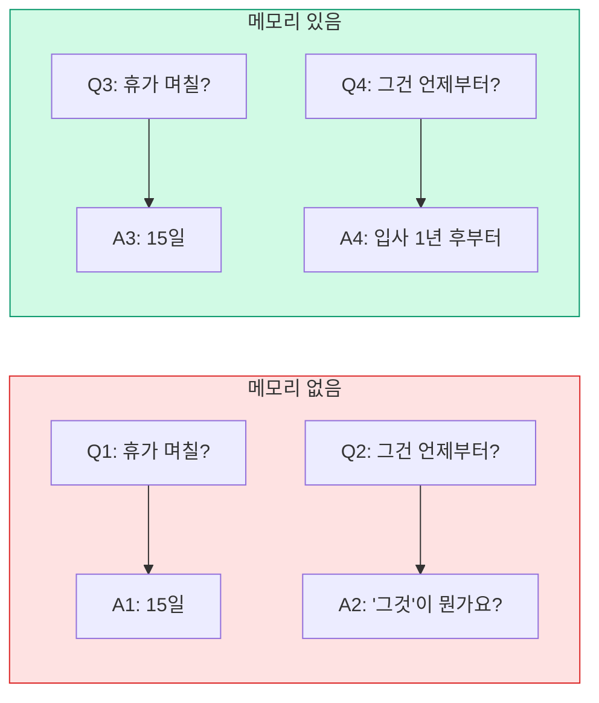
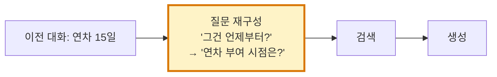

# 6. 대화 메모리와 챗봇 상태 관리
{: .no_toc }

LLM은 매 호출이 처음입니다. 우리가 직접 대화 이력을 관리해야 합니다. 이 챕터에선 4가지 메모리 전략, LangGraph로의 영속화, 그리고 대화형 RAG에서 후속 질문을 어떻게 처리하는지(History-Aware Retriever) 다룹니다.
{: .fs-6 .fw-300 }

---

## ⏱ 타임테이블 (3H — Day 3 09:00–12:00)

| 시간 | 활동 |
|:---:|:---|
| 0:00–0:10 | Day 2 회고 + 후속 질문 시연 |
| 0:10–0:40 | Part 1~3 강의 (stateless·ChatHistory·Runnable) |
| 0:40–1:30 | 4가지 메모리 전략 실습 |
| 1:30–1:40 | 휴식 |
| 1:40–2:20 | LangGraph InMemorySaver/SqliteSaver |
| 2:20–2:50 | History-Aware RAG 멀티턴 실습 |
| 2:50–3:00 | 평가 체크포인트 |

> 🎤 강사 노트: [99_INSTRUCTOR_GUIDE Ch.06](./99_INSTRUCTOR_GUIDE#chapters)

## 학습 목표

- LLM이 stateless인 이유와 메모리 필요성을 설명할 수 있다.
- Buffer / Window / Summary / Trim 4가지 전략을 구현하고 비교할 수 있다.
- LangGraph `InMemorySaver`/`SqliteSaver`로 세션을 영속화할 수 있다.
- History-Aware Retriever로 멀티턴 후속 질문을 정확히 검색할 수 있다.

<a id="toc"></a>

## 진행 순서

1. [LLM이 대화를 기억하지 못하는 이유](#part1)
2. [ChatMessageHistory](#part2)
3. [RunnableWithMessageHistory](#part3)
4. [메모리 전략 4가지](#part4)
5. [LangGraph 영속 메모리](#part5)
6. [Conversational RAG](#part6)
7. [실습: 멀티턴 RAG 챗봇](#practice)
8. [평가 체크포인트](#check)
9. [Stretch Goal](#stretch)

<a id="part1"></a>

## 1. LLM이 대화를 기억하지 못하는 이유 [↑](#toc)

LLM API는 **호출마다 독립**입니다. 첫 호출의 컨텍스트가 두 번째 호출에 자동으로 따라가지 않습니다.



대화를 이어가려면 **이전 메시지들을 매번 LLM에 같이 보내야** 합니다.

[↑](#toc)

<a id="part2"></a>

## 2. ChatMessageHistory [↑](#toc)

### 2.1 메시지 타입

```python
from langchain_core.messages import SystemMessage, HumanMessage, AIMessage

messages = [
    SystemMessage("당신은 사내 정책 도우미입니다."),
    HumanMessage("연차 며칠?"),
    AIMessage("입사 1년 후 15일이 부여됩니다."),
    HumanMessage("그건 언제부터?"),
]
```

`SystemMessage`는 행동 지침, `HumanMessage`/`AIMessage`는 대화 턴.

### 2.2 In-Memory 히스토리

```python
from langchain_core.chat_history import InMemoryChatMessageHistory

history = InMemoryChatMessageHistory()
history.add_user_message("연차 며칠?")
history.add_ai_message("입사 1년 후 15일")
print(history.messages)
```

서버 재시작 시 사라집니다. 영속화는 §5에서.

[↑](#toc)

<a id="part3"></a>

## 3. RunnableWithMessageHistory [↑](#toc)

체인에 히스토리를 자동 주입하는 래퍼입니다.

```python
from langchain_core.runnables.history import RunnableWithMessageHistory
from langchain_core.prompts import ChatPromptTemplate, MessagesPlaceholder
from langchain_openai import ChatOpenAI

prompt = ChatPromptTemplate.from_messages([
    ("system", "당신은 사내 정책 도우미입니다."),
    MessagesPlaceholder(variable_name="history"),
    ("human", "{question}"),
])
chain = prompt | ChatOpenAI(model="gpt-4o-mini", temperature=0)

# 세션별 히스토리 저장소 (메모리 dict; 실제론 DB)
store = {}
def get_history(session_id: str):
    if session_id not in store:
        store[session_id] = InMemoryChatMessageHistory()
    return store[session_id]

with_history = RunnableWithMessageHistory(
    chain,
    get_history,
    input_messages_key="question",
    history_messages_key="history",
)

cfg = {"configurable": {"session_id": "user-42"}}
print(with_history.invoke({"question": "연차 며칠?"}, config=cfg).content)
print(with_history.invoke({"question": "그건 언제부터?"}, config=cfg).content)
# 두 번째 호출에서도 첫 번째 답이 컨텍스트로 들어감
```

`session_id`별로 히스토리가 분리됩니다.

[↑](#toc)

<a id="part4"></a>

## 4. 메모리 전략 4가지 [↑](#toc)

### 4.1 비교 표

| 전략 | 동작 | 비용 | 정확도 | 언제 쓰나 |
|:---|:---|:---:|:---:|:---|
| Buffer | 전체 보관 | ↑↑↑ | ↑↑↑ | 짧은 대화 |
| Window | 최근 N턴 | ↓ | ↑↑ | 일반적 |
| Summary | LLM 요약 | ↑(요약 호출) | ↑ (요약 품질 의존) | 장기 대화 |
| Trim | 토큰 한도 기반 | ↓ | ↑↑ | **권장 기본** |

### 4.2 Window — 최근 N턴

`RunnableWithMessageHistory`로 가져온 히스토리에서 최근 N개만 슬라이싱:

```python
from langchain_core.runnables import RunnableLambda

def take_last(messages, k=6):
    # SystemMessage는 항상 보존, 나머지는 마지막 k개
    sys = [m for m in messages if isinstance(m, SystemMessage)]
    rest = [m for m in messages if not isinstance(m, SystemMessage)]
    return sys + rest[-k:]
```

### 4.3 Summary — LLM 요약 메모리

긴 히스토리를 LLM이 한 단락으로 요약해 그 요약 + 최근 몇 턴을 함께 보냅니다.

```python
from langchain_core.prompts import ChatPromptTemplate

summarize_prompt = ChatPromptTemplate.from_template(
    "다음 대화 이력을 200자 이내로 요약하세요. 핵심 사실만 남기고, 사용자 질문 의도를 보존하세요.\n\n{history}"
)
summarizer = summarize_prompt | ChatOpenAI(model="gpt-4o-mini", temperature=0)

def summarize(messages):
    text = "\n".join(f"{m.type}: {m.content}" for m in messages)
    return summarizer.invoke({"history": text}).content
```

### 4.4 Trim — 토큰 한도 기반

LangChain의 `trim_messages` 헬퍼가 가장 안전합니다. 토큰 단위로 잘라 시스템 메시지·도구 메시지 일관성도 지킵니다.

```python
from langchain_core.messages import trim_messages

trimmed = trim_messages(
    history.messages,
    max_tokens=2000,
    strategy="last",          # 최근부터 보존
    token_counter=ChatOpenAI(model="gpt-4o-mini"),  # 토큰 카운터
    include_system=True,
    allow_partial=False,
    start_on="human",         # human 메시지로 시작 보장
)
```

[↑](#toc)

<a id="part5"></a>

## 5. LangGraph 영속 메모리 [↑](#toc)

### 5.1 InMemorySaver (인메모리)

```python
from langgraph.checkpoint.memory import InMemorySaver  # LangGraph 1.x 권장 이름
from langgraph.prebuilt import create_react_agent

agent = create_react_agent(
    model=ChatOpenAI(model="gpt-4o-mini"),
    tools=[],
    checkpointer=InMemorySaver(),
)

cfg = {"configurable": {"thread_id": "user-42"}}
agent.invoke({"messages": [("user", "연차 며칠?")]}, config=cfg)
agent.invoke({"messages": [("user", "그건 언제부터?")]}, config=cfg)
# 같은 thread_id면 이전 messages가 자동으로 따라옴
```

### 5.2 SqliteSaver (영속)

```python
from langgraph.checkpoint.sqlite import SqliteSaver

with SqliteSaver.from_conn_string("./checkpoints.db") as saver:
    agent = create_react_agent(model=..., tools=[...], checkpointer=saver)
    agent.invoke({"messages": [("user", "...")]}, config={"configurable": {"thread_id": "user-42"}})
```

서버 재시작 후에도 thread_id로 복원 가능.

> 💡 thread_id = 사용자/세션 식별자. JWT subject·세션 토큰 등과 매핑.

[↑](#toc)

<a id="part6"></a>

## 6. Conversational RAG [↑](#toc)

### 6.1 후속 질문의 함정

대화 이력이 있어도, **검색 단계는 현재 질문만 받습니다**. "그건 언제부터?"를 그대로 검색하면 의미가 너무 모호합니다.



### 6.2 History-Aware Retriever

```python
from langchain.chains.history_aware_retriever import create_history_aware_retriever

contextualize_prompt = ChatPromptTemplate.from_messages([
    ("system", "주어진 대화 이력과 후속 질문을 보고, 이력 없이도 이해할 수 있는 독립 질문으로 재작성하세요. 답변하지 말고 질문만 반환하세요."),
    MessagesPlaceholder("chat_history"),
    ("human", "{input}"),
])

history_aware = create_history_aware_retriever(
    ChatOpenAI(model="gpt-4o-mini"),
    final_retriever,                  # Ch.04
    contextualize_prompt,
)
```

### 6.3 Retrieval Chain

```python
from langchain.chains.retrieval import create_retrieval_chain
from langchain.chains.combine_documents import create_stuff_documents_chain

qa_prompt = ChatPromptTemplate.from_messages([
    ("system", "다음 컨텍스트를 참고해 한국어로 답하세요. 모르면 '모릅니다'라고 답하세요.\n\n{context}"),
    MessagesPlaceholder("chat_history"),
    ("human", "{input}"),
])
qa_chain = create_stuff_documents_chain(ChatOpenAI(model="gpt-4o-mini"), qa_prompt)

rag_chain = create_retrieval_chain(history_aware, qa_chain)
```

### 6.4 호출

```python
chat_history = []
for q in ["연차 며칠?", "그건 언제부터 부여돼?", "이월은 가능해?"]:
    out = rag_chain.invoke({"input": q, "chat_history": chat_history})
    print(f"\nQ: {q}\nA: {out['answer']}")
    chat_history.extend([HumanMessage(q), AIMessage(out["answer"])])
```

[↑](#toc)

<a id="practice"></a>

## 7. 실습: 멀티턴 RAG 챗봇 [↑](#toc)

```python
# 0. 준비: Ch.04의 final_retriever 사용
# 1. 위 6.2~6.4의 rag_chain 구성
# 2. 4턴 시나리오

scenario = [
    "재택근무 한도가 며칠?",
    "그게 모든 직급에 적용돼?",
    "신청은 어떻게?",
    "기각될 수도 있어?",
]

# 메모리 없이 (대조군)
print("=== 메모리 없음 ===")
for q in scenario:
    docs = final_retriever.invoke(q)[:2]
    ctx = "\n".join(d.page_content for d in docs)
    out = ChatOpenAI(model="gpt-4o-mini").invoke(
        f"컨텍스트:\n{ctx}\n질문: {q}"
    )
    print(f"\nQ: {q}\nA: {out.content}")

# 메모리 있음
print("\n=== History-Aware RAG ===")
chat_history = []
for q in scenario:
    out = rag_chain.invoke({"input": q, "chat_history": chat_history})
    print(f"\nQ: {q}\nA: {out['answer']}")
    chat_history.extend([HumanMessage(q), AIMessage(out["answer"])])
```

대명사("그게")·생략("신청은 어떻게?")이 어떻게 처리되는지 비교하세요.

[↑](#toc)

<a id="check"></a>

### ✅ 완료 체크 (TA용)

- 멀티턴 4턴 대화에서 2번째 턴부터 대명사("그건") 정상 해석
- SqliteSaver로 thread 영속화 + Python 재시작 후 복원 확인
- Buffer/Window/Summary/Trim 중 2개 이상 직접 비교

## 8. 평가 체크포인트 [↑](#toc)

### 객관식

**Q1.** LLM API가 stateless라는 말의 의미는?

1. 응답이 무작위
2. **각 호출이 독립적이며 이전 호출 정보가 자동으로 따라가지 않음**
3. 비결정적
4. 캐시 사용 안 함

{::nomarkdown}
<details><summary>정답</summary>
<div class="answer-body"><strong>2</strong>.</div>
</details>
{:/nomarkdown}

**Q2.** Trim 메모리(`trim_messages`)가 단순 슬라이싱보다 안전한 이유는?

1. 더 빠름
2. **토큰 단위 한도와 SystemMessage·도구 메시지 일관성을 지키며 잘라줌**
3. 비동기 지원
4. 압축 지원

{::nomarkdown}
<details><summary>정답</summary>
<div class="answer-body"><strong>2</strong>.</div>
</details>
{:/nomarkdown}

**Q3.** History-Aware Retriever의 핵심은?

1. 더 큰 모델 사용
2. **대화 이력을 보고 후속 질문을 독립 질문으로 재작성한 뒤 검색**
3. 질문을 임베딩 평균
4. top-k 증가

{::nomarkdown}
<details><summary>정답</summary>
<div class="answer-body"><strong>2</strong>.</div>
</details>
{:/nomarkdown}

### 주관식

**Q4.** Buffer와 Trim 메모리의 비용·정확도를 자기 사용 사례에 적용해 비교 분석하세요.

{::nomarkdown}
<details><summary>예</summary>
<div class="answer-body">장기 대화·개인 어시스턴트 → Trim 권장(토큰 폭증 방지). 단발 Q&A → Buffer로 충분. 장시간 상담 → Summary + Trim 결합.</div>
</details>
{:/nomarkdown}

**Q5.** Conversational RAG에서 환각이 늘어나기 쉬운 시나리오를 1개 떠올리고 대응을 적으세요.

{::nomarkdown}
<details><summary>예</summary>
<div class="answer-body">후속 질문이 이력에 의존하는데 history_aware의 재작성이 잘못되면 엉뚱한 청크 검색 → 환각. 대응: 재작성 결과를 로깅하고 평가 셋 만들어 정확도 측정. Self-RAG(Ch.08)로 검증 노드 추가.</div>
</details>
{:/nomarkdown}

[↑](#toc)

<a id="stretch"></a>

## 9. 🚀 Stretch Goal [↑](#toc)

> 난이도: ★☆☆ 30분 / ★★☆ 1시간 / ★★★ 2시간+

1. **Summary vs Window 정량 비교** ★★☆ (1.5시간): 30턴 대화에서 비용·정확도 비교 표.
2. **다중 사용자 영속화** ★★☆ (1시간): SqliteSaver + thread_id 격리 + 동시 접속 테스트.
3. **재작성 품질 평가** ★★★ (2시간): history_aware 재작성 100개 사람 검수 + 정확도.

[↑](#toc)

---

## 다음 챕터

대화는 됐습니다. 이제 **추론하면서 도구를 쓰는** ReAct 패턴을 본격적으로 배웁니다.

→ [Ch.07 ReAct 패턴 AI 에이전트](./07_ReAct_패턴)
