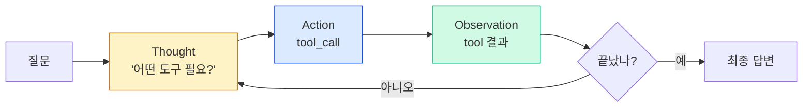

# 7. ReAct 패턴 AI 에이전트
{: .no_toc }

ReAct는 *Reasoning + Acting*입니다. LLM이 "생각 → 행동 → 관찰"을 반복하며 문제를 풉니다. Ch.05의 도구 사용 위에, 이 챕터에선 ReAct의 실제 추론 흐름을 직접 추적하고, 무한 루프·잘못된 도구 선택 같은 함정에 대응합니다.
{: .fs-6 .fw-300 }

---

## ⏱ 타임테이블 (2H — Day 3 13:00–15:00)

| 시간 | 활동 |
|:---:|:---|
| 0:00–0:20 | Part 1~2 강의 (ReAct 논문·TAO) |
| 0:20–0:50 | create_react_agent + stream 실습 |
| 0:50–1:00 | 휴식 |
| 1:00–1:30 | 함정 시연 (무한 루프·잘못된 도구) |
| 1:30–1:55 | 5시나리오 헬프데스크 실습 |
| 1:55–2:00 | 정리 |

> 🎤 강사 노트: [99_INSTRUCTOR_GUIDE Ch.07](./99_INSTRUCTOR_GUIDE#chapters)

## 학습 목표

- ReAct의 Thought-Action-Observation 사이클을 설명할 수 있다.
- LangGraph `create_react_agent`로 다중 도구 ReAct 에이전트를 만들 수 있다.
- `agent.stream()`으로 에이전트의 추론 과정을 단계별로 추적할 수 있다.
- 무한 루프·잘못된 도구 선택 같은 실패 모드를 진단하고 막을 수 있다.

<a id="toc"></a>

## 진행 순서

1. [ReAct란?](#part1)
2. [Thought-Action-Observation 사이클](#part2)
3. [create_react_agent 한 줄 시작](#part3)
4. [추론 과정 추적](#part4)
5. [ReAct의 함정과 대응](#part5)
6. [ReAct vs Plan-and-Execute](#part6)
7. [실습: 사내 헬프데스크 에이전트](#practice)
8. [평가 체크포인트](#check)
9. [Stretch Goal](#stretch)

<a id="part1"></a>

## 1. ReAct란? [↑](#toc)

Yao et al. (2022)의 ReAct 논문은 LLM에게 **추론(Thought)과 행동(Action)을 명시적으로 교차시키는 프롬프트 패턴**을 제안했습니다. 단순히 "답해라"가 아니라, "생각하고 → 도구를 쓰고 → 관찰하고 → 다시 생각하라"라고 시키는 것입니다.



핵심 아이디어:

- **Thought** — 다음에 무엇을 할지 LLM이 자기 자신에게 설명.
- **Action** — 도구 호출.
- **Observation** — 도구 결과.
- 위 3개를 충분할 때까지 반복.

[↑](#toc)

<a id="part2"></a>

## 2. Thought-Action-Observation 사이클 [↑](#toc)

### 2.1 의사 코드

```
while not done:
    thought = LLM("주어진 도구로 다음에 뭘 할지 생각")
    if thought.has_action:
        observation = run_tool(thought.action)
        history.append((thought, observation))
    else:
        return thought.final_answer
```

### 2.2 실제 ReAct 트레이스 예

> 사용자: "다음 주 월요일 회의 가능한 사람이 5명 이상이면 회의실 예약하고, 아니면 일정만 잡아줘."

| Step | Thought | Action | Observation |
|:---:|:---|:---|:---|
| 1 | 다음 주 월요일 날짜 필요 | `now_kst()` | "2026-05-11 (월)" |
| 2 | 그날 가능자 조회 | `query_calendar("2026-05-11")` | 7명 가능 |
| 3 | 5명 초과 → 회의실 예약 | `book_room("2026-05-11", count=7)` | "예약 완료 #1234" |
| 4 | 더 할 일 없음 | (final) | "예약 완료. 일자: 5/11(월), 7명, 회의실 #1234." |

### 2.3 일반 prompting vs ReAct

| 일반 prompting | ReAct |
|:---|:---|
| LLM이 한 번에 모든 추론 | 단계별 추론 + 외부 도구 활용 |
| 외부 데이터 못 봄 | 도구로 실시간 데이터 |
| 환각이 누적되면 답까지 잘못 | 매 단계 결과를 관찰하므로 자가 교정 가능 |

[↑](#toc)

<a id="part3"></a>

## 3. create_react_agent 한 줄 시작 [↑](#toc)

```python
from langgraph.prebuilt import create_react_agent
from langchain_openai import ChatOpenAI

agent = create_react_agent(
    model=ChatOpenAI(model="gpt-4o-mini", temperature=0),
    tools=[search_company_policy, calculator, now_kst, web_tool],   # Ch.05의 도구
    prompt="당신은 사내 비서입니다. 모르면 도구를 적극 활용하고, 출처를 답변에 포함하세요.",
)

result = agent.invoke({"messages": [("user", "내일 결재 한도와 8.5% 부가세 계산해줘")]})
print(result["messages"][-1].content)
```

핵심 포인트:

- 입력: `{"messages": [...]}` 형태. (튜플도 허용 — `("user", "...")`).
- 출력: 동일하게 `messages` 리스트. 마지막이 최종 답변.
- `prompt`는 시스템 메시지 역할.

[↑](#toc)

<a id="part4"></a>

## 4. 추론 과정 추적 [↑](#toc)

### 4.1 stream으로 단계별 보기

```python
for chunk in agent.stream(
    {"messages": [("user", "재택근무 한도 알려주고, 평일 22일 중 출근일 며칠인지 계산")]},
    stream_mode="updates",
):
    for node, payload in chunk.items():
        for m in payload["messages"]:
            kind = type(m).__name__
            if hasattr(m, "tool_calls") and m.tool_calls:
                for tc in m.tool_calls:
                    print(f"[{node}] AI tool_call: {tc['name']}({tc['args']})")
            elif kind == "ToolMessage":
                print(f"[{node}] Tool result: {str(m.content)[:80]}")
            elif kind == "AIMessage" and m.content:
                print(f"[{node}] AI message: {m.content[:120]}")
```

`stream_mode="updates"`는 노드별로 변경된 상태만 흘려보냅니다. 다른 모드:

| stream_mode | 내용 |
|:---|:---|
| `"updates"` | 노드별 상태 변화 (디버깅 추천) |
| `"values"` | 매 단계 전체 상태 |
| `"messages"` | 토큰 단위 스트리밍 |

### 4.2 시각화

복잡한 그래프(Ch.08)에선 다음으로 구조 확인:

```python
print(agent.get_graph().draw_mermaid())
```

[↑](#toc)

<a id="part5"></a>

## 5. ReAct의 함정과 대응 [↑](#toc)

### 5.1 무한 루프

도구가 늘 같은 결과를 반환하거나, LLM이 "이번엔 다를 거야"라며 같은 호출 반복.

**대응**:

```python
agent = create_react_agent(..., debug=True)  # 단계 로깅

# 또는 recursion_limit 설정
result = agent.invoke({"messages": [...]}, config={"recursion_limit": 10})
```

`recursion_limit`을 넘으면 `GraphRecursionError`. 비즈니스 로직에서 catch해 안전한 fallback 답변.

### 5.2 잘못된 도구 선택

전형적 원인:

| 원인 | 대응 |
|:---|:---|
| docstring이 모호 | Ch.05의 docstring 베스트 프랙티스 적용 |
| 도구 이름이 비슷 | `search_policy` vs `search_web` 처럼 명확히 |
| 도구 너무 많음 | 카테고리 라우터로 1단계 압축 |
| 시스템 프롬프트가 약함 | "정책은 search_company_policy로만"처럼 명시 |

### 5.3 환각된 인자

LLM이 도구 인자에 존재하지 않는 ID나 형식을 만들어 넣음.

**대응**:

- Pydantic `args_schema`로 형식 강제
- 도구 내부에서 입력 검증 후 명확한 에러 반환 (LLM이 자가 교정 가능)
- Ch.08 LangGraph의 검증 노드 추가

```python
@tool
def lookup_employee(employee_id: str) -> str:
    """사번(EMP-숫자 형식)으로 직원 정보를 조회합니다. 예: EMP-1042"""
    if not employee_id.startswith("EMP-"):
        return "오류: employee_id는 'EMP-숫자' 형식이어야 합니다."
    ...
```

### 5.4 도구 결과의 토큰 폭증

웹 검색이 긴 본문을 반환하면 다음 LLM 호출 비용·환각이 증가합니다.

**대응**:

- 도구 내부에서 요약·필터링 후 반환
- Ch.06 `trim_messages`로 컨텍스트 관리

[↑](#toc)

<a id="part6"></a>

## 6. ReAct vs Plan-and-Execute [↑](#toc)

| 축 | ReAct | Plan-and-Execute |
|:---|:---|:---|
| 의사결정 | 한 단계씩 즉흥적 | 처음에 전체 계획 수립 |
| 적응성 | 중간 결과에 즉시 반응 | 계획 후 실행 (재계획 노드 가능) |
| 비용 | 매 단계 LLM | 계획 1회 + 실행 N회 |
| 적합 사례 | 탐색·검색·HITL | 명확한 다단계 작업 |
| LangChain | `create_react_agent` | 직접 그래프 (Ch.08) |

소규모·인터랙티브 챗봇에는 ReAct, 다단계 자동화 워크플로엔 Plan-and-Execute가 흔합니다. 둘을 결합한 하이브리드도 가능 (Ch.08).

[↑](#toc)

<a id="practice"></a>

## 7. 실습: 사내 헬프데스크 에이전트 [↑](#toc)

### 7.1 도구 셋

```python
from langchain_core.tools import tool

@tool
def lookup_employee(employee_id: str) -> str:
    """사번(EMP-숫자)으로 직원 정보(이름·부서·잔여 연차)를 조회합니다.
    예: 'EMP-1042'.
    """
    db = {
        "EMP-1042": {"name": "김선조", "dept": "Eng", "vacation_left": 7},
        "EMP-1043": {"name": "이지은", "dept": "HR",  "vacation_left": 12},
    }
    info = db.get(employee_id)
    return str(info) if info else "사번을 찾을 수 없습니다."

# search_company_policy, calculator 등 Ch.05의 도구 재사용
tools = [search_company_policy, lookup_employee, calculator, now_kst]
```

### 7.2 5가지 시나리오

```python
agent = create_react_agent(
    model=ChatOpenAI(model="gpt-4o-mini", temperature=0),
    tools=tools,
    prompt=(
        "당신은 사내 헬프데스크입니다. 정책 질문은 search_company_policy, "
        "직원 정보는 lookup_employee를 사용하세요. 모르면 모른다고 답하세요."
    ),
)

scenarios = [
    "재택근무 한도가 며칠?",                                       # 단일: 정책
    "EMP-1042 잔여 연차 알려줘",                                   # 단일: DB
    "오늘 며칠?",                                                  # 단일: 시간
    "오늘 우리 회사 정책상 외부 발표하는 거 가능해?",                  # 단일: 정책
    "EMP-1042가 잔여 연차의 80%를 쓰면 며칠? 그리고 오늘로부터 그 일수를 더하면?",  # 다중
]

for s in scenarios:
    print(f"\n[Q] {s}")
    out = agent.invoke({"messages": [("user", s)]}, config={"recursion_limit": 12})
    print(f"[A] {out['messages'][-1].content}")
```

### 7.3 추론 과정 시각화

```python
print(f"\n=== 시나리오 5의 추론 과정 ===")
for chunk in agent.stream(
    {"messages": [("user", scenarios[4])]},
    stream_mode="updates",
):
    for node, payload in chunk.items():
        for m in payload["messages"]:
            if hasattr(m, "tool_calls") and m.tool_calls:
                for tc in m.tool_calls:
                    print(f"  → {tc['name']}({tc['args']})")
            elif type(m).__name__ == "ToolMessage":
                print(f"  ← {str(m.content)[:80]}")
```

[↑](#toc)

<a id="check"></a>

### ✅ 완료 체크 (TA용)

- agent.stream 출력에서 Thought-Action-Observation 사이클 확인
- 5시나리오 중 4개 이상 정답 (특히 다단계 시나리오 5)
- recursion_limit·docstring 개선 중 1가지 직접 적용

## 8. 평가 체크포인트 [↑](#toc)

### 객관식

**Q1.** ReAct의 핵심 아이디어는?

1. 더 큰 모델
2. **추론(Thought)과 행동(Action)을 명시적으로 교차하며 외부 도구로 검증**
3. 더 긴 프롬프트
4. 멀티 에이전트

{::nomarkdown}
<details><summary>정답</summary>
<div class="answer-body"><strong>2</strong>.</div>
</details>
{:/nomarkdown}

**Q2.** 무한 루프 방지에 가장 직접적인 설정은?

1. temperature 낮추기
2. **`recursion_limit`**
3. top-p 조정
4. 도구 줄이기

{::nomarkdown}
<details><summary>정답</summary>
<div class="answer-body"><strong>2</strong>.</div>
</details>
{:/nomarkdown}

**Q3.** 도구 인자에 환각이 잘 일어날 때 효과적 대응은?

1. 모델 다운사이즈
2. **Pydantic args_schema로 형식 강제 + 도구 내부 검증 후 명확한 에러 메시지**
3. 도구 docstring 삭제
4. 시스템 프롬프트 제거

{::nomarkdown}
<details><summary>정답</summary>
<div class="answer-body"><strong>2</strong>.</div>
</details>
{:/nomarkdown}

### 주관식

**Q4.** 본인의 ReAct 에이전트가 무한 루프에 빠진 가상 시나리오를 만들고 3가지 방어 장치를 적으세요.

{::nomarkdown}
<details><summary>예</summary>
<div class="answer-body">(시나리오) 검색 결과가 없을 때 같은 질의 반복. (방어) recursion_limit, 도구 결과 캐싱·동일 인자 검출, 시스템 프롬프트에 "결과 없으면 사용자에게 되묻기" 명시.</div>
</details>
{:/nomarkdown}

**Q5.** Plan-and-Execute가 더 적합한 사용 사례를 자기 도메인에서 1개 찾아 설계하세요.

{::nomarkdown}
<details><summary>예</summary>
<div class="answer-body">월말 보고서 자동 생성: 데이터 수집 → 분석 → 시각화 → 초안 → 검수. 단계가 명확하고 재실행 비용이 큼 → 사전 계획 후 실행이 효율적.</div>
</details>
{:/nomarkdown}

[↑](#toc)

<a id="stretch"></a>

## 9. 🚀 Stretch Goal [↑](#toc)

> 난이도: ★☆☆ 30분 / ★★☆ 1시간 / ★★★ 2시간+

1. **도구 선택 정확도 평가셋** ★★☆ (1.5시간): 30개 질문 expected_tool 라벨링 + 정확도.
2. **Self-correction 프롬프트** ★☆☆ (45분): "다른 도구 시도, 없으면 모른다" 지시 추가 + 변화 측정.
3. **HITL** ★★★ (2시간): Ch.08 interrupt 선행 사용 — 결재성 도구 사용자 승인 패턴.

[↑](#toc)

---

## 다음 챕터

ReAct는 즉흥적입니다. 명시적 분기·재시도·검증이 필요하면 **그래프**로 갑니다.

→ [Ch.08 LangGraph 워크플로우 제어](./08_LangGraph_워크플로우)
