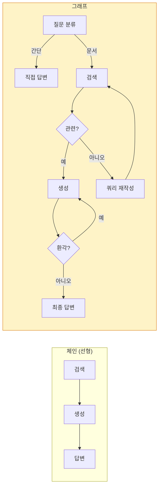
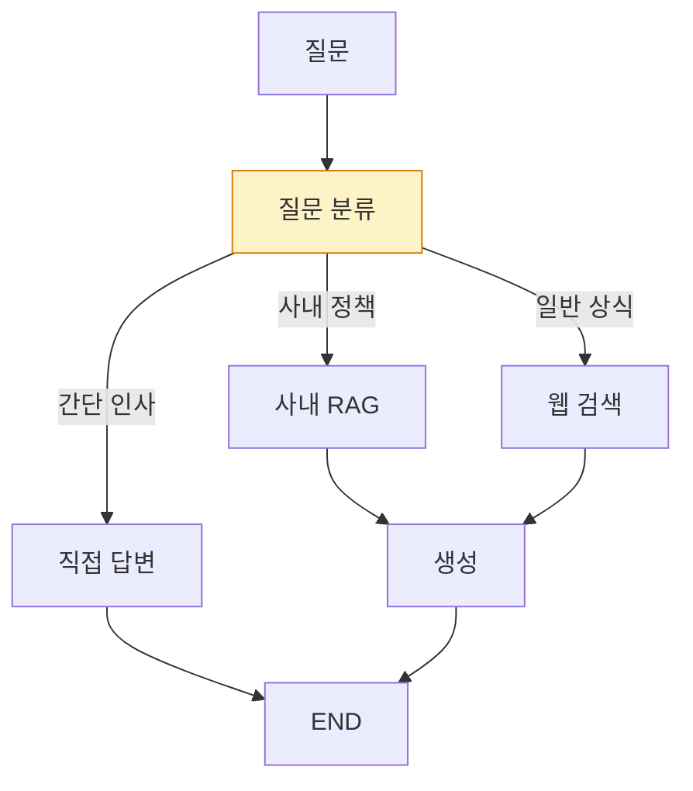
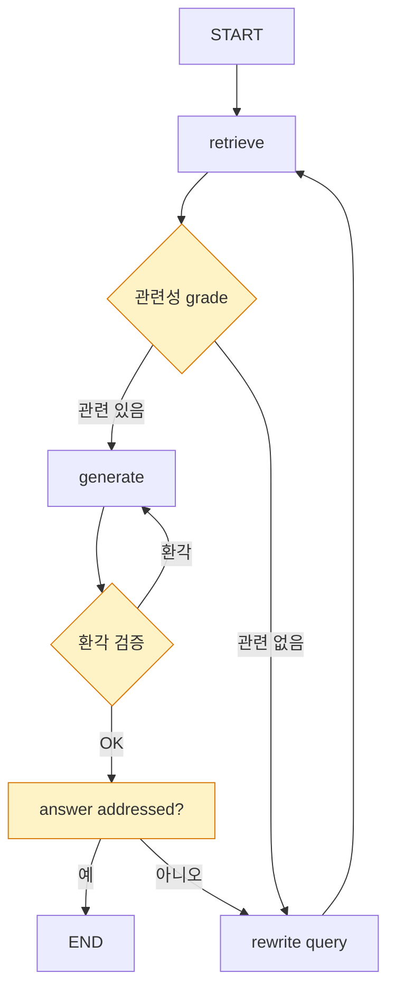

# 8. LangGraph 워크플로우 제어
{: .no_toc }

ReAct는 즉흥적입니다. "검색 결과가 부적합하면 쿼리를 다시 써서 검색하고, 답변에 환각이 있으면 다시 생성하라"처럼 명시적 분기·재시도가 필요하면 **그래프**가 답입니다. 이 챕터에서 StateGraph로 Adaptive RAG, Self-RAG, Corrective RAG를 직접 만듭니다.
{: .fs-6 .fw-300 }

---

## ⏱ 타임테이블 (3H — Day 4 09:00–12:00)

| 시간 | 활동 |
|:---:|:---|
| 0:00–0:30 | Part 1~2 강의 (왜 그래프·StateGraph 기본) |
| 0:30–1:00 | 8.0 환경 복원 + 간단 그래프 실습 |
| 1:00–1:10 | 휴식 |
| 1:10–1:40 | Part 3~4 강의 (조건부 라우팅·Adaptive RAG) |
| 1:40–2:20 | Self-RAG skeleton 실습 |
| 2:20–2:50 | 그래프 시각화 + stream |
| 2:50–3:00 | 평가 체크포인트 |

> ⚠️ **5일 중 가장 어려운 챕터.** 페이스 조절 필수. [99_INSTRUCTOR_GUIDE Ch.08](./99_INSTRUCTOR_GUIDE#chapters) 참조.

## 학습 목표

- StateGraph의 노드·엣지·조건부 라우팅을 이해하고 코드로 만들 수 있다.
- TypedDict로 state schema를 정의하고 reducer로 누적 동작을 제어한다.
- Adaptive RAG / Self-RAG / Corrective RAG 패턴을 구현할 수 있다.
- 체크포인터(InMemorySaver/SqliteSaver)로 그래프 상태를 영속화한다.

<a id="toc"></a>

## 진행 순서

1. [왜 그래프인가](#part1)
2. [StateGraph 기본](#part2)
3. [조건부 라우팅](#part3)
4. [Adaptive RAG 패턴](#part4)
5. [Self-RAG / Corrective RAG](#part5)
6. [체크포인터로 영속화](#part6)
7. [그래프 시각화](#part7)
8. [실습: Self-RAG 직접 만들기](#practice)
9. [평가 체크포인트](#check)
10. [Stretch Goal](#stretch)

<a id="part1"></a>

## 1. 왜 그래프인가 [↑](#toc)

### 1.1 단순 chain의 한계



체인은 **분기·반복·재시도**가 어렵습니다. 그래프는 노드 간 임의 연결이 가능합니다.

### 1.2 LangGraph의 위치

| 도구 | 적합 |
|:---|:---|
| LangChain LCEL | 선형 파이프라인 |
| LangChain AgentExecutor (legacy) | 단순 ReAct |
| **LangGraph** | **분기·반복·HITL·다중 에이전트** |

[↑](#toc)

<a id="part2"></a>

## 2. StateGraph 기본 [↑](#toc)

### 2.1 4가지 구성 요소

1. **State** — 그래프를 흐르는 데이터 구조 (TypedDict)
2. **Node** — 상태를 입력받아 변경분을 반환하는 함수
3. **Edge** — 노드 간 연결 (정적 또는 조건부)
4. **START / END** — 시작·종료 마커

### 2.2 TypedDict로 State 정의

```python
from typing_extensions import TypedDict
from typing import Annotated, List
from langgraph.graph import add_messages

class RAGState(TypedDict):
    question: str
    documents: List[str]
    generation: str
    # messages 필드는 reducer로 누적
    # messages: Annotated[list, add_messages]
```

기본은 **덮어쓰기**입니다. 누적이 필요한 필드는 `Annotated[..., reducer]`로 reducer 명시.

### 2.3 노드 함수

```python
def retrieve(state: RAGState) -> dict:
    docs = final_retriever.invoke(state["question"])  # Ch.04
    return {"documents": [d.page_content for d in docs]}

def generate(state: RAGState) -> dict:
    ctx = "\n\n".join(state["documents"])
    prompt = f"컨텍스트:\n{ctx}\n\n질문: {state['question']}\n답변:"
    answer = ChatOpenAI(model="gpt-4o-mini").invoke(prompt).content
    return {"generation": answer}
```

노드는 **변경할 필드만** 담은 dict를 반환. State의 다른 필드는 보존.

### 2.4 그래프 조립

```python
from langgraph.graph import StateGraph, START, END

builder = StateGraph(RAGState)
builder.add_node("retrieve", retrieve)
builder.add_node("generate", generate)
builder.add_edge(START, "retrieve")
builder.add_edge("retrieve", "generate")
builder.add_edge("generate", END)

graph = builder.compile()
result = graph.invoke({"question": "재택근무 한도?"})
print(result["generation"])
```

[↑](#toc)

<a id="part3"></a>

## 3. 조건부 라우팅 [↑](#toc)

`add_conditional_edges`는 source 노드 출력에 따라 여러 destination 중 선택합니다.

```python
def route_on_relevance(state: RAGState) -> str:
    """검색 결과 평가 후 다음 노드 이름 반환."""
    if state.get("documents"):
        return "generate"
    return "rewrite"

builder.add_conditional_edges(
    "retrieve",
    route_on_relevance,
    {"generate": "generate", "rewrite": "rewrite_query"},  # path_map
)
```

`route_on_relevance`가 `"generate"` 또는 `"rewrite"` 문자열을 반환 → path_map에서 실제 노드로 매핑.

[↑](#toc)

<a id="part4"></a>

## 4. Adaptive RAG 패턴 [↑](#toc)

질문 유형에 따라 검색·도구를 다르게 선택합니다.



```python
from typing import Literal

def classify(state: RAGState) -> dict:
    q = state["question"]
    prompt = f"질문을 'policy', 'web', 'direct' 중 하나로 분류하세요. 단어만 답하세요. 질문: {q}"
    label = ChatOpenAI(model="gpt-4o-mini").invoke(prompt).content.strip().lower()
    if label not in {"policy", "web", "direct"}:
        label = "policy"
    return {"route": label}

class AdaptiveState(RAGState):
    route: Literal["policy", "web", "direct"]

builder = StateGraph(AdaptiveState)
builder.add_node("classify", classify)
builder.add_node("rag", retrieve)
builder.add_node("web", web_search_node)
builder.add_node("generate", generate)
builder.add_node("direct", direct_answer)

builder.add_edge(START, "classify")
builder.add_conditional_edges(
    "classify",
    lambda s: s["route"],
    {"policy": "rag", "web": "web", "direct": "direct"},
)
builder.add_edge("rag", "generate")
builder.add_edge("web", "generate")
builder.add_edge("direct", END)
builder.add_edge("generate", END)
```

[↑](#toc)

<a id="part5"></a>

## 5. Self-RAG / Corrective RAG [↑](#toc)

### 5.1 Self-RAG의 핵심 아이디어

검색 결과와 생성 답변을 **LLM이 스스로 평가**하고, 부적합하면 재시도합니다.



### 5.2 평가 노드

```python
from pydantic import BaseModel, Field

class GradeDocs(BaseModel):
    score: Literal["yes", "no"] = Field(description="문서가 질문과 관련이 있는가")

structured = ChatOpenAI(model="gpt-4o-mini", temperature=0).with_structured_output(GradeDocs)

def grade_documents(state: RAGState) -> dict:
    q = state["question"]
    relevant = []
    for d in state["documents"]:
        prompt = f"질문: {q}\n\n문서:\n{d}\n\n위 문서가 질문에 답하는 데 직접 도움이 되나요?"
        if structured.invoke(prompt).score == "yes":
            relevant.append(d)
    return {"documents": relevant}

def decide_after_grade(state: RAGState) -> str:
    return "generate" if state["documents"] else "rewrite"
```

### 5.3 쿼리 재작성

```python
def rewrite_query(state: RAGState) -> dict:
    prompt = (
        f"이 질문을 검색에 더 적합하도록 다른 표현으로 재작성하세요. "
        f"동의어를 더하고 도메인 어휘를 풍부하게 하세요.\n원 질문: {state['question']}"
    )
    new_q = ChatOpenAI(model="gpt-4o-mini").invoke(prompt).content
    return {"question": new_q}
```

### 5.4 환각 검증

```python
class GradeHallucination(BaseModel):
    grounded: Literal["yes", "no"] = Field(description="답변이 컨텍스트에 근거하는가")

hallu = ChatOpenAI(model="gpt-4o-mini", temperature=0).with_structured_output(GradeHallucination)

def check_hallucination(state: RAGState) -> str:
    ctx = "\n\n".join(state["documents"])
    res = hallu.invoke(f"컨텍스트:\n{ctx}\n\n답변:\n{state['generation']}\n\n답변이 컨텍스트에서 도출되나요?")
    return "end" if res.grounded == "yes" else "regenerate"
```

### 5.5 그래프 연결

```python
builder = StateGraph(RAGState)
builder.add_node("retrieve", retrieve)
builder.add_node("grade", grade_documents)
builder.add_node("rewrite", rewrite_query)
builder.add_node("generate", generate)

builder.add_edge(START, "retrieve")
builder.add_edge("retrieve", "grade")
builder.add_conditional_edges("grade", decide_after_grade,
                              {"generate": "generate", "rewrite": "rewrite"})
builder.add_edge("rewrite", "retrieve")
builder.add_conditional_edges("generate", check_hallucination,
                              {"end": END, "regenerate": "generate"})

graph = builder.compile()
```

### 5.6 Corrective RAG (CRAG)

검색 grading이 "낮음"일 때 **웹 검색으로 fallback**:

```python
def decide_with_web(state: RAGState) -> str:
    if state["documents"]:
        return "generate"
    return "web_search"   # 사내 정책 부족 시 웹 검색
```

[↑](#toc)

<a id="part6"></a>

## 6. 체크포인터로 영속화 [↑](#toc)

### 6.1 InMemorySaver — 인메모리

```python
from langgraph.checkpoint.memory import InMemorySaver  # LangGraph 1.x 권장 이름

graph = builder.compile(checkpointer=InMemorySaver())
cfg = {"configurable": {"thread_id": "user-42"}}
graph.invoke({"question": "재택 한도?"}, config=cfg)
```

### 6.2 SqliteSaver — 영속

```python
from langgraph.checkpoint.sqlite import SqliteSaver

with SqliteSaver.from_conn_string("./rag_state.db") as saver:
    graph = builder.compile(checkpointer=saver)
    graph.invoke({"question": "..."}, config={"configurable": {"thread_id": "user-42"}})
```

### 6.3 Human-in-the-Loop (HITL)

특정 노드 전 인간 승인:

```python
graph = builder.compile(
    checkpointer=InMemorySaver(),
    interrupt_before=["generate"],   # generate 전에 멈춤
)

# 첫 호출은 generate 직전에 멈춤
graph.invoke({"question": "..."}, config=cfg)

# 사람이 검토 후 재개
graph.invoke(None, config=cfg)
```

[↑](#toc)

<a id="part7"></a>

## 7. 그래프 시각화 [↑](#toc)

```python
print(graph.get_graph().draw_mermaid())
# 또는 PNG:
# graph.get_graph().draw_mermaid_png(output_file_path="graph.png")
```

생성된 Mermaid 코드를 README나 문서에 그대로 붙여넣을 수 있습니다.

[↑](#toc)

<a id="practice"></a>

## 8. 실습: Self-RAG 직접 만들기 [↑](#toc)

### 8.0 환경 빠른 복원

새 노트북에서 시작하는 경우, Ch.04까지의 핵심 변수를 먼저 복원하세요.

```python
# 0-1. 환경 변수
from dotenv import load_dotenv; load_dotenv()

# 0-2. Ch.01~04의 retriever 재구성 (간이 버전)
from langchain_community.document_loaders import TextLoader
from langchain_text_splitters import RecursiveCharacterTextSplitter
from langchain_openai import ChatOpenAI, OpenAIEmbeddings
from langchain_chroma import Chroma
from langchain_community.retrievers import BM25Retriever
from langchain.retrievers import EnsembleRetriever

docs = TextLoader("policy.txt", encoding="utf-8").load()
chunks = RecursiveCharacterTextSplitter(chunk_size=300, chunk_overlap=30).split_documents(docs)
emb = OpenAIEmbeddings(model="text-embedding-3-small")
vectordb = Chroma.from_documents(chunks, emb, collection_name="ch08")

bm25 = BM25Retriever.from_documents(chunks); bm25.k = 5
dense = vectordb.as_retriever(search_kwargs={"k": 5})
final_retriever = EnsembleRetriever(retrievers=[bm25, dense], weights=[0.5, 0.5])
# Re-Ranking을 추가하려면 Ch.04의 ContextualCompressionRetriever 코드를 더하세요.
```

### 8.1 통합 코드

```python
from typing import List, Literal
from typing_extensions import TypedDict
from pydantic import BaseModel, Field
from langgraph.graph import StateGraph, START, END
from langchain_openai import ChatOpenAI

class State(TypedDict):
    question: str
    documents: List[str]
    generation: str

llm = ChatOpenAI(model="gpt-4o-mini", temperature=0)

class GradeDocs(BaseModel):
    score: Literal["yes", "no"]

class GradeHallu(BaseModel):
    grounded: Literal["yes", "no"]

doc_grader = llm.with_structured_output(GradeDocs)
hallu_grader = llm.with_structured_output(GradeHallu)

def retrieve(s: State):
    docs = final_retriever.invoke(s["question"])
    return {"documents": [d.page_content for d in docs]}

def grade(s: State):
    rel = []
    for d in s["documents"]:
        if doc_grader.invoke(f"Q: {s['question']}\nDoc: {d}\n관련 있나요?").score == "yes":
            rel.append(d)
    return {"documents": rel}

def rewrite(s: State):
    nq = llm.invoke(f"검색이 잘 되도록 다음을 다르게 표현: {s['question']}").content
    return {"question": nq}

def generate(s: State):
    ctx = "\n\n".join(s["documents"]) or "(컨텍스트 없음)"
    a = llm.invoke(f"컨텍스트:\n{ctx}\n\n질문: {s['question']}\n답변:").content
    return {"generation": a}

def route_after_grade(s: State):
    return "generate" if s["documents"] else "rewrite"

def route_after_gen(s: State):
    if not s["documents"]:
        return "end"
    res = hallu_grader.invoke(f"Ctx:\n{chr(10).join(s['documents'])}\n\nAns:\n{s['generation']}")
    return "end" if res.grounded == "yes" else "generate"

b = StateGraph(State)
b.add_node("retrieve", retrieve)
b.add_node("grade", grade)
b.add_node("rewrite", rewrite)
b.add_node("generate", generate)
b.add_edge(START, "retrieve")
b.add_edge("retrieve", "grade")
b.add_conditional_edges("grade", route_after_grade,
                        {"generate": "generate", "rewrite": "rewrite"})
b.add_edge("rewrite", "retrieve")
b.add_conditional_edges("generate", route_after_gen,
                        {"end": END, "generate": "generate"})

graph = b.compile()
print(graph.get_graph().draw_mermaid())
```

### 8.2 실행 + 트레이스

```python
qs = [
    "재택근무 한도가 며칠?",                # 정상 흐름
    "휴가 신청은 어떻게 해?",               # 동의어 → rewrite 가능
    "최신 AI 트렌드 알려줘",                 # 정책 RAG에 없음 → 반복 후 종료
]

for q in qs:
    print(f"\n=== {q} ===")
    for chunk in graph.stream({"question": q}, stream_mode="updates"):
        for node, payload in chunk.items():
            print(f"  [{node}]", {k: v if k != 'documents' else f"{len(v)} docs" for k, v in payload.items()})
    final = graph.invoke({"question": q})
    print("  →", final["generation"][:120])
```

[↑](#toc)

<a id="check"></a>

### ✅ 완료 체크 (TA용)

- Self-RAG 그래프 컴파일 + `draw_mermaid()` 출력
- 5질문 중 1개 이상에서 grade → rewrite → retrieve 분기 발생 (stream으로 확인)
- 환각 검증 노드(check_hallucination)가 1회 이상 작동 (재생성 또는 종료)

## 9. 평가 체크포인트 [↑](#toc)

### 객관식

**Q1.** State에서 누적이 필요한 필드를 만들 때 사용하는 것은?

1. `Required[...]`
2. **`Annotated[..., reducer]`**
3. `Optional[...]`
4. `Union[...]`

{::nomarkdown}
<details><summary>정답</summary>
<div class="answer-body"><strong>2</strong>. reducer가 누적 방식을 정합니다.</div>
</details>
{:/nomarkdown}

**Q2.** `add_conditional_edges`의 두 번째 인자 `path` 함수의 반환값은?

1. 최종 답변
2. **다음 노드를 결정하는 키 (path_map의 키)**
3. State 전체
4. boolean

{::nomarkdown}
<details><summary>정답</summary>
<div class="answer-body"><strong>2</strong>.</div>
</details>
{:/nomarkdown}

**Q3.** 인터럽트(HITL)를 설정하는 옵션은?

1. `breakpoints=[...]`
2. **`interrupt_before=[...]` 또는 `interrupt_after=[...]`**
3. `pause_at=[...]`
4. `human_node=[...]`

{::nomarkdown}
<details><summary>정답</summary>
<div class="answer-body"><strong>2</strong>.</div>
</details>
{:/nomarkdown}

### 주관식

**Q4.** 본인 도메인에서 Adaptive RAG로 분기할 라우터를 3가지 분류로 설계하세요.

{::nomarkdown}
<details><summary>예</summary>
<div class="answer-body">(1) policy_qa → 사내 RAG (2) data_lookup → SQL/DB 도구 (3) external → 웹 검색. 분류기 LLM 프롬프트는 한국어 클래스명 단어만 답하도록 강제.</div>
</details>
{:/nomarkdown}

**Q5.** Self-RAG가 무한 루프에 빠지는 시나리오를 가정하고 해결책을 설계하세요.

{::nomarkdown}
<details><summary>예</summary>
<div class="answer-body">답변이 항상 환각으로 판정되면 무한 재생성. 해결: 재시도 카운트 필드 추가 → 임계값 초과 시 "모릅니다" 답으로 종료.</div>
</details>
{:/nomarkdown}

[↑](#toc)

<a id="stretch"></a>

## 10. 🚀 Stretch Goal [↑](#toc)

> 난이도: ★☆☆ 30분 / ★★☆ 1시간 / ★★★ 2시간+

1. **CRAG with Web Fallback** ★★☆ (1.5시간): grade 실패 시 Tavily fallback 노드.
2. **Plan-and-Execute 그래프** ★★★ (2시간+): 계획→실행→검증 패턴 직접 구현.
3. **HITL 결재** ★★☆ (1시간): `interrupt_before=["execute_action"]` 데모.
4. **재시도 카운터** ★☆☆ (30분): State에 `attempts` 추가 → 임계 초과 시 안전 종료.

[↑](#toc)

---

## 다음 챕터

이제 RAG가 충분히 정교해졌습니다. 그런데 **얼마나 좋은가?** 정량 평가가 없으면 모든 개선이 추측입니다.

→ [Ch.09 Ragas 기반 RAG 평가와 자동화 파이프라인](./09_Ragas_평가)
