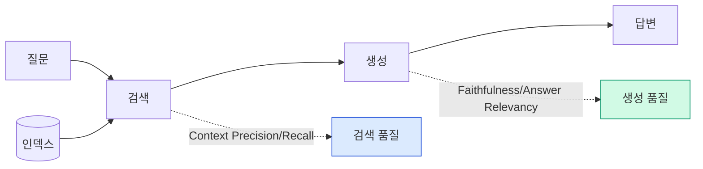
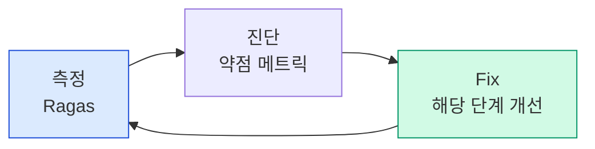

# 9. Ragas 기반 RAG 평가와 자동화 파이프라인
{: .no_toc }

평가 없는 개선은 추측입니다. Ragas는 RAG에 특화된 LLM-as-a-judge 메트릭을 제공해 검색 품질과 생성 품질을 분리해 측정합니다. 이 챕터에서 4대 메트릭, 합성 테스트셋, CI 자동화를 다루고, 마지막엔 **5일간 빌드한 RAG 3개 버전을 정량 비교**합니다.
{: .fs-6 .fw-300 }

---

## ⏱ 타임테이블 (Day 4 13:00–18:00, 5H — 평가 2H + 종합 프로젝트 3H)

### 13:00–15:00 (Ragas 강의·실습)

| 시간 | 활동 |
|:---:|:---|
| 0:00–0:30 | Part 1~2 강의 (왜 어렵나·4메트릭 직관) |
| 0:30–1:00 | Ragas 첫 평가 실행 |
| 1:00–1:10 | 휴식 |
| 1:10–1:40 | TestsetGenerator 합성 셋 |
| 1:40–2:00 | 진단표 사용 + Ch.10 예고 |

### 15:00–18:00 (종합 프로젝트 개인 작업)

| 시간 | 활동 |
|:---:|:---|
| 0:00–0:15 | 종합 프로젝트 안내 + Rubric 설명 |
| 0:15–0:30 | 데이터셋 선택 (자기 도메인 or 공통) |
| 0:30–2:30 | 개인 작업 (Hybrid+Rerank+Self-RAG + Ragas + LangSmith) |
| 2:30–3:00 | 중간 진척 공유 + Day 5 발표 안내 |

> 🎤 강사 노트: [99_INSTRUCTOR_GUIDE Ch.09](./99_INSTRUCTOR_GUIDE#chapters)

## 학습 목표

- Faithfulness / Answer Relevancy / Context Precision / Context Recall를 정의하고 어느 단계 문제를 잡는지 안다.
- Ragas로 RAG를 평가하고 결과를 pandas로 분석할 수 있다.
- TestsetGenerator로 합성 테스트셋을 만들고 검수할 수 있다.
- GitHub Actions에서 RAG 평가를 PR마다 자동 실행하도록 구성할 수 있다.

<a id="toc"></a>

## 진행 순서

1. [RAG 평가가 어려운 이유](#part1)
2. [Ragas 4대 메트릭](#part2)
3. [Ragas 사용 코드](#part3)
4. [합성 테스트셋 생성](#part4)
5. [진단 — 어느 단계를 고칠까](#part5)
6. [자동 평가 파이프라인](#part6)
7. [실습: 종합 평가 (Naive vs Hybrid+Rerank vs Self-RAG)](#practice)
8. [평가 체크포인트](#check)
9. [Stretch Goal](#stretch)

<a id="part1"></a>

## 1. RAG 평가가 어려운 이유 [↑](#toc)

### 1.1 분류와의 차이

분류는 정답 라벨이 명확합니다. RAG의 답변은 같은 의미를 다양한 문장으로 표현 가능 → 단순 매칭으론 평가 불가.

### 1.2 단계별 분리 평가가 필요



검색이 좋아도 생성이 환각하면 답이 나쁘고, 생성이 좋아도 검색이 틀리면 답이 무관해집니다. **두 영역을 분리해야 어디를 고칠지 보입니다**.

[↑](#toc)

<a id="part2"></a>

## 2. Ragas 4대 메트릭 [↑](#toc)

| 메트릭 | 무엇을 측정 | 어느 영역 | 어떤 문제를 잡나 |
|:---|:---|:---|:---|
| **Faithfulness** | 답변이 컨텍스트에서 derive 가능한가 | 생성 | 환각 |
| **Answer Relevancy** | 답이 질문에 답하는가 | 생성 | 동문서답 |
| **Context Precision** | top-k 컨텍스트가 관련성 있는가 (순위 가중) | 검색 | 노이즈/순위 |
| **Context Recall** | 정답에 필요한 정보가 컨텍스트에 다 들어있나 | 검색 | 누락 |

### 2.1 Faithfulness 직관

답변을 statements로 쪼갠 뒤, 각 statement가 컨텍스트에서 도출되는지 LLM이 채점.

```
faithfulness = (#derivable statements) / (#total statements)
```

### 2.2 Answer Relevancy 직관

LLM이 답변에서 역으로 가능한 질문 N개를 생성 → 원 질문과의 유사도 평균.

### 2.3 Context Precision 직관

상위 k개 컨텍스트 중 정답 생성에 기여하는 비율을 **순위 가중**(상위에 좋은 게 있어야 더 점수↑)으로 계산.

### 2.4 Context Recall 직관

정답(`ground_truth`) 안에 필요한 정보가 컨텍스트에 다 들어 있나. **ground_truth 없으면 측정 불가**.

[↑](#toc)

<a id="part3"></a>

## 3. Ragas 사용 코드 [↑](#toc)

### 3.1 설치

```bash
uv add "ragas>=0.2" datasets
```

> ⚠️ Ragas는 v0.1 → v0.2에서 API가 크게 변경됐습니다. 본 챕터는 **v0.2+ 기준**입니다.

### 3.2 데이터셋 구조

Ragas v0.2에서는 `EvaluationDataset`을 권장하지만, `datasets.Dataset`도 호환됩니다. 컬럼명도 v0.2에서 통일됐습니다:

- `user_input` (구 `question`)
- `response` (구 `answer`)
- `retrieved_contexts` (구 `contexts`, list[str])
- `reference` (구 `ground_truth`)

```python
from ragas import EvaluationDataset

samples = [
    {
        "user_input": "재택근무 한도?",
        "response": "월 4일까지 허용됩니다.",
        "retrieved_contexts": ["재택근무는 월 4일까지 허용됩니다."],
        "reference": "월 4일",
    },
    {
        "user_input": "연차 며칠?",
        "response": "입사 1년 후 15일.",
        "retrieved_contexts": ["연차는 입사일로부터 1년 후 15일이 부여됩니다."],
        "reference": "입사 1년 후 15일",
    },
]
eval_dataset = EvaluationDataset.from_list(samples)
```

> 💡 v0.1 데이터(`question`/`answer`/`contexts`/`ground_truth`)도 자동 변환됩니다만 새 코드는 v0.2 컬럼 사용을 권장.

### 3.3 평가 실행

```python
from ragas import evaluate
from ragas.metrics import Faithfulness, AnswerRelevancy, LLMContextPrecisionWithReference, LLMContextRecall
from ragas.llms import LangchainLLMWrapper
from ragas.embeddings import LangchainEmbeddingsWrapper
from langchain_openai import ChatOpenAI, OpenAIEmbeddings

# v0.2: judge LLM·임베딩을 wrapper로 감싸 메트릭에 주입
judge_llm = LangchainLLMWrapper(ChatOpenAI(model="gpt-4o-mini", temperature=0))
judge_emb = LangchainEmbeddingsWrapper(OpenAIEmbeddings(model="text-embedding-3-small"))

metrics = [
    Faithfulness(llm=judge_llm),
    AnswerRelevancy(llm=judge_llm, embeddings=judge_emb),
    LLMContextPrecisionWithReference(llm=judge_llm),
    LLMContextRecall(llm=judge_llm),
]

result = evaluate(dataset=eval_dataset, metrics=metrics)

df = result.to_pandas()
print(df[["user_input", "faithfulness", "answer_relevancy",
          "llm_context_precision_with_reference", "context_recall"]])
print("\n평균:")
print(df.select_dtypes("number").mean())
```

> 📝 메트릭 이름이 컬럼으로 출력됩니다(예: `llm_context_precision_with_reference`). 자기 평가 스크립트에선 매핑 dict로 짧은 이름으로 변환하는 것이 편합니다.

### 3.4 RAG 체인에서 데이터 수집

```python
def run_rag_collect(rag_chain, retriever, questions, ground_truths):
    rows = []
    for q, gt in zip(questions, ground_truths):
        docs = retriever.invoke(q)
        ans = rag_chain.invoke(q)
        rows.append({
            "user_input": q,
            "response": ans,
            "retrieved_contexts": [d.page_content for d in docs],
            "reference": gt,
        })
    return EvaluationDataset.from_list(rows)
```

[↑](#toc)

<a id="part4"></a>

## 4. 합성 테스트셋 생성 [↑](#toc)

### 4.1 TestsetGenerator로 자동 생성 (v0.2)

```python
from ragas.testset import TestsetGenerator
from ragas.llms import LangchainLLMWrapper
from ragas.embeddings import LangchainEmbeddingsWrapper
from langchain_openai import ChatOpenAI, OpenAIEmbeddings

generator_llm = LangchainLLMWrapper(ChatOpenAI(model="gpt-4o-mini", temperature=0))
generator_emb = LangchainEmbeddingsWrapper(OpenAIEmbeddings(model="text-embedding-3-small"))

generator = TestsetGenerator(
    llm=generator_llm,
    embedding_model=generator_emb,
)

# Ch.01에서 만든 원본 LangChain Document 리스트(청크 아님) 사용 권장
testset = generator.generate_with_langchain_docs(
    documents=docs,
    testset_size=20,
)
testset_df = testset.to_pandas()
print(testset_df.head())
```

### 4.2 질문 분포 조정

v0.2에서는 `query_distribution` 파라미터로 simple/reasoning/multi-context 비율 제어:

```python
from ragas.testset.synthesizers import default_query_distribution

dist = default_query_distribution(generator_llm)
# dist는 (synthesizer, weight) 튜플 리스트. weight를 조정해 비율 변경.

testset = generator.generate_with_langchain_docs(
    documents=docs, testset_size=20, query_distribution=dist,
)
```

> ⚠️ Ragas는 활발히 개발 중이라 마이너 버전 간에도 API 차이가 있습니다. 실패 시 `ragas.__version__` 확인 후 [공식 문서](https://docs.ragas.io/en/stable/)의 동일 버전 가이드 참조.

### 4.3 검수의 중요성

자동 생성은 **출발점**일 뿐입니다. 사람이 (a) 질문이 자연스러운가 (b) ground_truth가 정확한가 (c) 도메인 분포가 맞는가를 검수해야 합니다. 검수 후 80% 이상이 살아남으면 양호.

[↑](#toc)

<a id="part5"></a>

## 5. 진단 — 어느 단계를 고칠까 [↑](#toc)

### 5.1 진단표

| 약점 메트릭 | 문제 영역 | 본 과정 해결책 |
|:---|:---|:---|
| **Context Recall ↓** | 정답이 검색에 못 들어옴 | Ch.02 청킹·HyDe·Multi-Query, Ch.03 하이브리드 |
| **Context Precision ↓** | 노이즈가 상위에 섞임 | Ch.04 Re-Ranking |
| **Faithfulness ↓** | 답이 컨텍스트 밖 사실 사용 | 프롬프트 강화, Ch.08 Self-RAG 환각 검증 |
| **Answer Relevancy ↓** | 동문서답 | 생성 프롬프트, 답변 길이 제한 |

### 5.2 개선 사이클



> 한 번에 하나만 바꾸세요. 두 가지를 동시에 바꾸면 무엇이 효과 있었는지 모릅니다.

[↑](#toc)

<a id="part6"></a>

## 6. 자동 평가 파이프라인 [↑](#toc)

### 6.1 GitHub Actions로 매 PR 평가

`.github/workflows/rag-eval.yml`

```yaml
name: RAG Eval
on:
  pull_request:
    paths:
      - "rag/**"
      - "tests/eval/**"

jobs:
  evaluate:
    runs-on: ubuntu-latest
    env:
      OPENAI_API_KEY: ${{ secrets.OPENAI_API_KEY }}
    steps:
      - uses: actions/checkout@v4
      - name: Install uv
        uses: astral-sh/setup-uv@v3
        with:
          enable-cache: true
      - name: Set up Python
        run: uv python install 3.11
      - name: Sync dependencies (uv.lock 기반)
        run: uv sync --frozen
      - name: Run Ragas evaluation
        run: uv run python tests/eval/run_eval.py --threshold 0.75
      - name: Upload results
        if: always()
        uses: actions/upload-artifact@v4
        with:
          name: ragas-report
          path: tests/eval/results.csv
```

### 6.2 임계값 미달 시 실패

`tests/eval/run_eval.py`

```python
import sys, json, pandas as pd
from datasets import Dataset
from ragas import evaluate
from ragas.metrics import faithfulness, answer_relevancy, context_precision, context_recall

# 평가 셋 로드 (테스트셋이 git 저장소에 고정돼 있어야 재현 가능)
ds = Dataset.from_csv("tests/eval/testset.csv")
# RAG 체인 로드 + 답변 수집은 생략
result = evaluate(ds, metrics=[faithfulness, answer_relevancy, context_precision, context_recall])
df = result.to_pandas()
df.to_csv("tests/eval/results.csv", index=False)

THRESHOLDS = {
    "faithfulness": 0.85,
    "answer_relevancy": 0.80,
    "context_precision": 0.70,
    "context_recall": 0.75,
}
means = df[list(THRESHOLDS)].mean()
print(means)
fails = [m for m, t in THRESHOLDS.items() if means[m] < t]
if fails:
    print("실패한 메트릭:", fails)
    sys.exit(1)
```

### 6.3 결과 추적

- `results.csv`를 매 빌드 artifact로 보관
- 시간 흐름에 따른 추세는 LangSmith(Ch.10)로 시각화

[↑](#toc)

<a id="practice"></a>

## 7. 실습: 종합 평가 [↑](#toc)

### 7.1 비교 대상

본 과정에서 만든 세 가지 RAG를 같은 테스트셋으로 평가:

1. **Naive RAG** (Ch.01)
2. **Hybrid + Re-Rank RAG** (Ch.03 + Ch.04)
3. **Self-RAG** (Ch.08)

### 7.2 코드

```python
def collect(name, retriever, generate_fn, eval_questions):
    rows = {"question": [], "answer": [], "contexts": [], "ground_truth": []}
    for q, gt in eval_questions:
        docs = retriever.invoke(q)
        rows["question"].append(q)
        rows["answer"].append(generate_fn(q, docs))
        rows["contexts"].append([d.page_content for d in docs])
        rows["ground_truth"].append(gt)
    return name, Dataset.from_dict(rows)

def gen(q, docs):
    ctx = "\n\n".join(d.page_content for d in docs)
    return ChatOpenAI(model="gpt-4o-mini").invoke(
        f"컨텍스트:\n{ctx}\n\n질문: {q}\n답변:"
    ).content

eval_qs = [
    ("재택근무 한도?",        "월 4일까지 허용"),
    ("연차 부여 기준?",        "입사 1년 후 15일"),
    ("결혼 휴가 며칠?",        "본인 결혼 5일"),
    ("유연근무 누구한테 내?",   "인사팀"),
    ("미사용 연차는?",         "익년 6월까지 이월 후 자동 소멸"),
    # 30개 권장
]

results = {}
for name, ds in [
    collect("naive",  naive_retriever,  gen, eval_qs),
    collect("hybrid", final_retriever,  gen, eval_qs),
    collect("self_rag", final_retriever, lambda q, d: graph.invoke({"question": q})["generation"], eval_qs),
]:
    r = evaluate(ds, metrics=[faithfulness, answer_relevancy, context_precision, context_recall])
    results[name] = r.to_pandas()

import pandas as pd
summary = pd.DataFrame({
    name: df[["faithfulness", "answer_relevancy", "context_precision", "context_recall"]].mean()
    for name, df in results.items()
}).T
print(summary.round(3))
```

### 7.3 예상 출력

```
          faithfulness  answer_relevancy  context_precision  context_recall
naive            0.78              0.82               0.55            0.62
hybrid           0.84              0.86               0.81            0.84
self_rag         0.93              0.89               0.81            0.86
```

> 숫자는 도메인·평가셋에 강하게 의존. **본인 데이터로 직접 측정**.

[↑](#toc)

<a id="check"></a>

### ✅ 완료 체크 (TA용)

- Ragas 4메트릭 평균값 출력 (df.select_dtypes("number").mean())
- 3-way 비교 표 (Naive vs Hybrid+Rerank vs Self-RAG)
- 자기 데이터로 evaluate 1회 실행 + 개선 단계 1개 식별

## 8. 평가 체크포인트 [↑](#toc)

### 객관식

**Q1.** Faithfulness가 잡는 문제는?

1. 동문서답
2. **환각 (컨텍스트 외 사실)**
3. 검색 누락
4. 노이즈

{::nomarkdown}
<details><summary>정답</summary>
<div class="answer-body"><strong>2</strong>.</div>
</details>
{:/nomarkdown}

**Q2.** Context Recall을 측정하려면 반드시 필요한 것은?

1. 답변
2. **ground_truth (정답 문장)**
3. embedding 모델
4. 큰 LLM

{::nomarkdown}
<details><summary>정답</summary>
<div class="answer-body"><strong>2</strong>.</div>
</details>
{:/nomarkdown}

**Q3.** 합성 테스트셋의 가장 큰 함정은?

1. 너무 길다
2. **사람 검수 없이 사용하면 노이즈가 평가 결과를 왜곡**
3. 비용
4. 한국어 미지원

{::nomarkdown}
<details><summary>정답</summary>
<div class="answer-body"><strong>2</strong>. 자동 생성은 출발점, 검수가 필수.</div>
</details>
{:/nomarkdown}

### 주관식

**Q4.** 본인의 RAG에서 어느 메트릭부터 개선할지 우선순위와 근거를 적으세요.

{::nomarkdown}
<details><summary>예</summary>
<div class="answer-body">Context Recall이 가장 낮으면 청킹·검색을 먼저. Faithfulness가 가장 낮으면 Self-RAG 환각 검증을 먼저. 한 번에 하나씩.</div>
</details>
{:/nomarkdown}

**Q5.** CI에 평가를 넣을 때 임계값을 어떻게 정할지 설계하세요.

{::nomarkdown}
<details><summary>예</summary>
<div class="answer-body">(1) 현재 baseline 측정 → 평균 −5% 정도를 임계로 (regression 방지). (2) 시간이 지나면서 점진적으로 상향. (3) 메트릭별 임계값을 분리.</div>
</details>
{:/nomarkdown}

[↑](#toc)

<a id="stretch"></a>

## 9. 🚀 Stretch Goal [↑](#toc)

> 난이도: ★☆☆ 30분 / ★★☆ 1시간 / ★★★ 2시간+

1. **본인 도메인 합성 테스트셋** ★★★ (2시간+): 50개 생성 → 검수 → git 커밋 baseline.
2. **메트릭 맞춤화** ★★★ (2시간+): custom critic으로 도메인 특화 메트릭 (예: 숫자 일치).
3. **A/B** ★★☆ (1시간): 두 retriever 버전 평가 + 메트릭별 이득 표.
4. **GitHub Actions 통합** ★★☆ (1.5시간): 워크플로 적용 + 임계값 미달 PR 차단.

[↑](#toc)

---

## 다음 챕터

평가는 됐습니다. 마지막은 **운영**입니다. 사용자 트레이스 추적, 비용·지연시간 모니터링, 프로덕션 디버깅까지.

→ [Ch.10 LangSmith 모니터링과 최적화](./10_LangSmith_모니터링)
