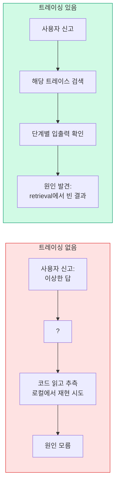

# 10. LangSmith 모니터링과 최적화
{: .no_toc }

프로덕션 RAG의 마지막 퍼즐은 **트레이싱**입니다. "사용자가 이상한 답을 받았다"는 신고가 들어왔을 때, 어디가 잘못됐는지(검색? 생성? 도구?) 보지 못하면 디버깅이 불가능합니다. LangSmith가 그 눈을 만들어 줍니다.
{: .fs-6 .fw-300 }

---

## ⏱ 타임테이블 (3H — Day 5 09:00–12:00)

| 시간 | 활동 |
|:---:|:---|
| 0:00–0:20 | Part 1~2 강의 (왜 트레이싱·5분 셋업) |
| 0:20–0:50 | 자기 RAG에 LangSmith 연결 + UI 워크스루 |
| 0:50–1:00 | 휴식 |
| 1:00–1:40 | 데이터셋 + A/B 평가 실습 |
| 1:40–2:00 | 비용·지연시간 최적화 + 케이스 스터디 |
| 2:00–2:40 | **종합 프로젝트 발표** (5분 × 8명, 시간 부족 시 우수자 4명) |
| 2:40–3:00 | 수료식 + 회고 + 다음 학습 추천 |

> 🎤 강사 노트: [99_INSTRUCTOR_GUIDE Ch.10](./99_INSTRUCTOR_GUIDE#chapters)

## 학습 목표

- LangSmith 자동 트레이싱을 5분 안에 셋업할 수 있다.
- 트레이스 UI에서 retrieval → llm → tool 단계별 입출력을 검사할 수 있다.
- 데이터셋을 빌드하고 두 RAG 버전을 A/B 비교 평가할 수 있다.
- 비용·지연시간을 모니터링하고 캐싱·다운사이즈로 최적화한다.
- 프로덕션 RAG 운영 체크리스트로 마무리한다.

<a id="toc"></a>

## 진행 순서

1. [왜 트레이싱이 마지막 퍼즐인가](#part1)
2. [LangSmith 5분 셋업](#part2)
3. [트레이스 UI 워크스루](#part3)
4. [데이터셋과 평가](#part4)
5. [비용·지연시간 최적화](#part5)
6. [프로덕션 케이스 스터디](#part6)
7. [프로덕션 RAG 체크리스트](#part7)
8. [실습: 종합 트레이싱 + A/B](#practice)
9. [평가 체크포인트](#check)
10. [Stretch Goal](#stretch)
11. [마무리 — 5일을 마치며](#wrap)

<a id="part1"></a>

## 1. 왜 트레이싱이 마지막 퍼즐인가 [↑](#toc)



트레이싱은 **재현 비용**을 0에 수렴시킵니다. 모든 호출이 자동으로 기록되므로 사후 분석이 가능합니다.

[↑](#toc)

<a id="part2"></a>

## 2. LangSmith 5분 셋업 [↑](#toc)

### 2.1 가입 + API 키

[smith.langchain.com](https://smith.langchain.com)에서 가입 (무료 티어 있음). 프로젝트를 하나 만들고 API 키 발급.

### 2.2 환경 변수

```bash
LANGCHAIN_TRACING_V2=true
LANGCHAIN_API_KEY=lsv2_...
LANGCHAIN_PROJECT=rag-system-bootcamp
LANGCHAIN_ENDPOINT=https://api.smith.langchain.com
```

`.env`에 넣고 `python-dotenv` 또는 셸 export.

### 2.3 자동 트레이싱

LangChain·LangGraph로 만든 모든 체인·그래프·도구는 위 환경 변수만 있으면 **자동 추적**됩니다. 코드 변경 0줄.

```python
# 그냥 평소처럼 실행하면 LangSmith에 기록됨
agent.invoke({"messages": [("user", "재택근무 한도?")]})
```

### 2.4 임의 함수 추적 — `@traceable`

LangChain 외부 코드에도 트레이싱 추가:

```python
from langsmith import traceable

@traceable(run_type="tool", name="custom_lookup")
def custom_lookup(employee_id: str) -> str:
    # ... 임의 코드 ...
    return result
```

[↑](#toc)

<a id="part3"></a>

## 3. 트레이스 UI 워크스루 [↑](#toc)

### 3.1 Run Tree

한 트레이스는 **루트 → 자식 → 손자** 트리로 표시됩니다.

```
agent.invoke (5.2s, $0.012)
├── retrieve (1.1s)
│   ├── BM25Retriever (0.05s)
│   ├── Chroma similarity_search (0.4s)
│   └── CohereRerank (0.6s, $0.001)
├── ChatOpenAI (gpt-4o-mini, 2.8s, $0.008)
└── tool: calculator (0.01s)
```

각 노드 클릭 → 입력·출력·메타데이터·에러 확인.

### 3.2 필터 — 실패 트레이스 빠르게 찾기

UI 상단 필터에서:

- `status:error` — 예외 발생만
- `latency_ms > 5000` — 5초 초과
- `tags:user-12345` — 특정 사용자
- `feedback:thumbs_down` — 사용자 부정 피드백

### 3.3 사용자 피드백 수집

UI에서 직접 점수를 매기거나, 코드로 자동:

```python
from langsmith import Client
from langchain_core.tracers.context import collect_runs

client = Client()

# collect_runs로 실행 중 생성된 run_id를 수집
with collect_runs() as cb:
    result = agent.invoke({"messages": [("user", "재택근무 한도?")]})

run_id = cb.traced_runs[0].id   # 최상위 run id

client.create_feedback(
    run_id=run_id,
    key="user_thumbs",
    score=1,  # 1=좋음, 0=나쁨
)
```

> 💡 UI에서 직접 thumbs up/down 클릭으로도 동일한 피드백이 기록됩니다. 프로덕션에서는 사용자 UI의 평가 버튼이 위 코드를 호출하도록 연결하세요.

[↑](#toc)

<a id="part4"></a>

## 4. 데이터셋과 평가 [↑](#toc)

### 4.1 프로덕션 트레이스 → 데이터셋

UI에서 좋은 트레이스/나쁜 트레이스를 데이터셋에 추가하거나, 코드로:

```python
from langsmith import Client
client = Client()

dataset = client.create_dataset(name="rag-eval-v1", description="사내 RAG 평가셋")
client.create_examples(
    dataset_id=dataset.id,
    inputs=[{"question": q} for q, _ in eval_qs],
    outputs=[{"ground_truth": gt} for _, gt in eval_qs],
)
```

### 4.2 LangSmith로 평가 실행

```python
from langsmith.evaluation import evaluate as ls_evaluate

def my_app(inputs: dict) -> dict:
    return {"answer": rag_chain.invoke(inputs["question"])}

results = ls_evaluate(
    my_app,
    data="rag-eval-v1",
    evaluators=[...],          # 내장 LLM-as-judge 또는 custom
    experiment_prefix="hybrid-rerank",
)
```

UI에서 같은 데이터셋으로 만든 두 실험을 나란히 두면 **메트릭 diff**가 자동으로 그려집니다.

### 4.3 Ragas와 결합

LangSmith의 evaluator로 Ragas 메트릭을 감싸면 트레이싱과 정량 평가를 한 군데서 봅니다.

```python
from ragas.metrics import faithfulness

def faithfulness_eval(run, example):
    df = ragas_evaluate_one(run, example)   # Ch.09 평가 함수 래핑
    return {"key": "faithfulness", "score": df["faithfulness"].mean()}

ls_evaluate(my_app, data="rag-eval-v1", evaluators=[faithfulness_eval])
```

[↑](#toc)

<a id="part5"></a>

## 5. 비용·지연시간 최적화 [↑](#toc)

### 5.1 LangSmith 대시보드에서 확인

프로젝트 → Monitoring 탭에서 시간대별 호출 수·평균 지연시간·평균 비용·실패율을 시계열로.

### 5.2 병목 식별

트레이스 트리에서 **가장 긴 자식 노드**가 병목. 흔한 패턴:

| 병목 | 대응 |
|:---|:---|
| Reranker (>500ms) | top-k 축소, 모델 다운사이즈, GPU 이전 |
| LLM (>3s) | gpt-4o → gpt-4o-mini, prompt 단축, streaming |
| Retrieval (>1s) | 인덱스 분리, 임베딩 캐싱 |
| Tool 외부 API | 캐싱, 비동기 |

### 5.3 LLM 응답 캐싱

```python
from langchain.globals import set_llm_cache
from langchain_community.cache import SQLiteCache

set_llm_cache(SQLiteCache(database_path=".langchain.db"))
```

같은 prompt → 캐시 hit. FAQ에 30%+ 절감.

### 5.4 임베딩 캐싱

```python
from langchain.embeddings import CacheBackedEmbeddings
from langchain.storage import LocalFileStore

cached = CacheBackedEmbeddings.from_bytes_store(
    OpenAIEmbeddings(model="text-embedding-3-small"),
    LocalFileStore("./cache/emb"),
    namespace="text-embedding-3-small",
)
```

같은 청크는 다시 임베딩하지 않음 → 인덱스 재구축 시 비용 절감.

### 5.5 모델 다운사이즈

LLM-as-judge·재작성·grading처럼 **추론이 비교적 단순한 노드**는 `gpt-4o-mini`로 충분. 최종 답변만 `gpt-4o`. 30~50% 비용 절감.

### 5.6 Streaming으로 체감 지연 줄이기

생성이 2~3초 걸려도 첫 토큰이 200ms에 시작되면 사용자 체감은 빠름.

```python
async for chunk in agent.astream({"messages": [...]}, stream_mode="messages"):
    print(chunk[0].content, end="", flush=True)
```

[↑](#toc)

<a id="part6"></a>

## 6. 프로덕션 케이스 스터디 [↑](#toc)

### 케이스 1 — "어제부터 답변 품질이 떨어졌어요"

**증상**: 사용자 부정 피드백이 어제 14:00부터 급증.

**LangSmith로 진단**:

1. `feedback:thumbs_down AND time>=어제 14:00` 필터
2. 트레이스 10개 열어보면 retrieval 결과가 모두 빈 리스트
3. 새로 인덱싱된 문서가 누락된 것 발견 → 인덱싱 작업 실패 로그 확인

**교훈**: 인덱싱 파이프라인에도 알림과 healthcheck 필요.

### 케이스 2 — 토큰 비용 3배 폭증

**증상**: 일일 토큰 사용량이 평소의 3배.

**LangSmith로 진단**:

1. Monitoring 탭에서 평균 입력 토큰이 어제부터 급증
2. 트레이스 보면 chat history가 누적돼 50턴 이상이 컨텍스트로 들어가고 있음
3. `trim_messages` 미적용 발견 (Ch.06 참조)

**해결**: 메모리에 `trim_messages(max_tokens=2000)` 적용.

### 케이스 3 — 응답 30초

**증상**: P95 지연시간이 5s → 30s.

**진단**: 트레이스에서 reranker 노드가 25s 차지. top-k=20 → 100으로 누군가 늘렸음.

**해결**: top-k=20으로 복귀, 캐시 추가, 임계값 알림 추가.

[↑](#toc)

<a id="part7"></a>

## 7. 프로덕션 RAG 체크리스트 [↑](#toc)

### 7.1 운영 (Reliability)

| 항목 | 도구 |
|:---|:---|
| ☐ 모든 호출 트레이싱 | LangSmith 환경 변수 |
| ☐ 정기 평가 (Ragas + LangSmith) | CI + dataset |
| ☐ 임계값 알림 (실패율·지연시간·비용) | LangSmith Alerts / 외부 모니터링 |
| ☐ 사용자 피드백 수집 | UI thumbs + create_feedback |
| ☐ 데이터셋 정기 업데이트 | 프로덕션 트레이스에서 추가 |
| ☐ 인덱싱 파이프라인 healthcheck | 별도 cron + 알림 |
| ☐ LLM·임베딩 캐싱 | SQLiteCache + CacheBackedEmbeddings |
| ☐ Streaming UX | astream + UI 반영 |
| ☐ 비용 가드레일 | 일일 예산 알람 |
| ☐ 문서/코드 분리 + 버전 관리 | 인덱스 버전 메타데이터 |

### 7.2 보안·컴플라이언스 (Security & Compliance)

| 항목 | 도구·방법 |
|:---|:---|
| ☐ PII 마스킹 파이프라인 | 인덱싱 전 정규식·NER 기반 가명처리 |
| ☐ DPA/ZDR 체결 확인 | OpenAI Zero Data Retention 또는 Azure OpenAI |
| ☐ API 키 권한 최소화 + 정기 로테이션 | KMS/Vault, 90일 로테이션 |
| ☐ 사용자별 접근 제어 | thread_id ↔ JWT subject, 행 단위 권한 |
| ☐ 감사 로그 | LangSmith 트레이스 + 별도 audit DB |
| ☐ Prompt Injection 방어 | 시스템 프롬프트 격리, 도구 인자 검증 |
| ☐ 데이터 보존 정책 | 트레이스·체크포인트 보관 기간 명시 |

### 7.3 비즈니스 메트릭 매핑 (KPI)

기술 메트릭을 경영진이 이해할 수 있는 비즈니스 지표로 변환합니다.

| 기술 메트릭 | 비즈니스 KPI | 측정 방법 |
|:---|:---|:---|
| Faithfulness ↑ | **법적 리스크 건수 ↓** | 환각으로 인한 컴플레인 월별 집계 |
| Answer Relevancy ↑ | **헬프데스크 에스컬레이션 비율 ↓** | "사람 상담" 전환율 추적 |
| P50 latency ↓ | **직원 대기 시간 절감 (분/일)** | 평균 응답 시간 × 일일 질의 수 |
| 일일 사용자 수 ↑ | **도구 정착률** | DAU/MAU 추적 |
| 비용/요청 ↓ | **운영 ROI** | (절감된 인건비 − API 비용) / API 비용 |

[↑](#toc)

<a id="practice"></a>

## 8. 실습: 종합 트레이싱 + A/B [↑](#toc)

### 8.1 환경 변수 설정

```python
import os
os.environ["LANGCHAIN_TRACING_V2"] = "true"
os.environ["LANGCHAIN_API_KEY"] = "lsv2_..."
os.environ["LANGCHAIN_PROJECT"] = "rag-bootcamp-final"
```

### 8.2 두 버전 등록

```python
from langsmith import Client
client = Client()

# 1. 데이터셋 (Ch.09의 eval_qs)
ds = client.create_dataset(name="rag-bootcamp-eval")
client.create_examples(
    dataset_id=ds.id,
    inputs=[{"question": q} for q, _ in eval_qs],
    outputs=[{"ground_truth": gt} for _, gt in eval_qs],
)

# 2. 두 RAG 버전을 함수로
def rag_naive(inputs):
    return {"answer": naive_chain.invoke(inputs["question"])}

def rag_self(inputs):
    return {"answer": self_rag_graph.invoke({"question": inputs["question"]})["generation"]}

# 3. LangSmith evaluate
from langsmith.evaluation import evaluate as ls_evaluate
ls_evaluate(rag_naive, data=ds.name, experiment_prefix="naive")
ls_evaluate(rag_self,  data=ds.name, experiment_prefix="self-rag")
```

UI에서 두 experiment를 비교하면 메트릭과 트레이스가 나란히 표시됩니다.

### 8.3 알림 설정

LangSmith 프로젝트 설정 → Alerts:

- 평균 latency > 3s → Slack
- 실패율 > 5% → Email
- 일일 비용 > $X → Slack

[↑](#toc)

<a id="check"></a>

### ✅ 완료 체크 (TA용)

- LangSmith UI에서 본인 트레이스 1개 이상 확인
- 데이터셋 1개 생성 + experiment 2개(naive vs self_rag) 실행
- 종합 프로젝트 발표 슬라이드 또는 노트북 제출 완료

## 9. 평가 체크포인트 [↑](#toc)

### 객관식

**Q1.** LangChain·LangGraph 코드에서 트레이싱을 활성화하는 가장 단순한 방법은?

1. 모든 호출에 `@traceable` 추가
2. **`LANGCHAIN_TRACING_V2=true`와 API 키 환경 변수 설정**
3. 별도 SDK 호출
4. 컴파일 옵션 변경

{::nomarkdown}
<details><summary>정답</summary>
<div class="answer-body"><strong>2</strong>. 프레임워크가 자동 통합.</div>
</details>
{:/nomarkdown}

**Q2.** 토큰 폭증의 흔한 원인은?

1. 모델 크기
2. **메모리 누적 (trim 미적용)**
3. 임베딩 차원
4. 캐시 hit ratio

{::nomarkdown}
<details><summary>정답</summary>
<div class="answer-body"><strong>2</strong>. Ch.06 메모리 전략 복습.</div>
</details>
{:/nomarkdown}

**Q3.** Streaming이 P95 지연을 직접 줄이지 않는데도 도입하는 이유는?

1. 비용 절감
2. **첫 토큰까지의 체감 지연 단축으로 UX 개선**
3. 정확도 향상
4. 캐시 효율

{::nomarkdown}
<details><summary>정답</summary>
<div class="answer-body"><strong>2</strong>.</div>
</details>
{:/nomarkdown}

### 주관식

**Q4.** 자기 시스템에서 가장 중요한 알림 3개를 정의하고 임계값을 정하세요.

{::nomarkdown}
<details><summary>예</summary>
<div class="answer-body">(1) P95 latency > 3s → Slack #ai-alerts (2) 실패율 > 2% → 즉시 페이지 (3) 일일 비용 > $50 → 이메일.</div>
</details>
{:/nomarkdown}

**Q5.** 프로덕션에서 사용자 부정 피드백이 들어왔을 때, LangSmith를 사용하는 디버깅 5단계를 정리하세요.

{::nomarkdown}
<details><summary>예</summary>
<div class="answer-body">(1) 피드백 트레이스 ID 확인 (2) Run Tree로 단계별 입출력 검사 (3) retrieval 결과·prompt·LLM 응답 비교 (4) 데이터셋에 케이스 추가 (5) 수정 후 같은 데이터셋으로 재평가.</div>
</details>
{:/nomarkdown}

[↑](#toc)

<a id="stretch"></a>

## 10. 🚀 Stretch Goal [↑](#toc)

> 난이도: ★☆☆ 30분 / ★★☆ 1시간 / ★★★ 2시간+

1. **본인 도메인 프로덕션 배포** ★★★ (2시간+): FastAPI/Streamlit + LangSmith 연결.
2. **부정 피드백 자동 데이터셋** ★★☆ (1.5시간): cron으로 매일 자동 추가.
3. **A/B 실험** ★★☆ (1.5시간): 두 retriever 50:50 노출 + 피드백·메트릭 판정.
4. **비용 가드레일** ★★☆ (1시간): 예산 80% 도달 시 mini 다운사이즈 미들웨어.

[↑](#toc)

<a id="wrap"></a>

## 11. 마무리 — 5일을 마치며 [↑](#toc)

### 11.1 학습 요약 (각 챕터 한 줄)

| 챕터 | 한 줄 |
|:---|:---|
| 01 | Naive RAG의 4대 한계는 5일 전체의 지도다. |
| 02 | 청킹과 쿼리 변환(HyDe, Multi-Query)이 RAG 품질의 80%다. |
| 03 | BM25 + Dense 하이브리드는 한국어 RAG에서 양쪽 약점을 메운다. |
| 04 | Cross-Encoder Re-Ranking이 정확도의 마지막 한 끗을 잡는다. |
| 05 | Tool Calling으로 RAG를 다른 도구와 함께 쓰는 에이전트가 된다. |
| 06 | 메모리 전략과 History-Aware Retriever로 멀티턴이 가능해진다. |
| 07 | ReAct는 추론과 행동을 교차하며 외부 데이터로 자가 교정한다. |
| 08 | LangGraph로 분기·재시도·검증·HITL이 명시적 제어 가능하다. |
| 09 | Ragas로 RAG 품질을 정량 측정하고 개선의 사이클을 만든다. |
| 10 | LangSmith로 운영을 가시화해 추측 없이 디버깅·최적화한다. |

### 11.2 다음 학습 추천

- **Multi-modal RAG** — 이미지·표·오디오를 임베딩 (CLIP, BLIP, ColPali).
- **GraphRAG** — 지식 그래프 + LLM. 복잡한 관계 질의에 강력.
- **Long-context vs RAG** — 200K+ 컨텍스트 모델과 RAG의 trade-off.
- **Streaming Search** — 실시간 데이터 RAG (예: Slack, 메일).
- **Agentic RAG 평가** — 다단계 에이전트 평가 메트릭(LangSmith trajectory eval).

### 11.3 학습 리소스

- [LangChain Docs](https://docs.langchain.com)
- [LangGraph Docs](https://langchain-ai.github.io/langgraph/)
- [Ragas Docs](https://docs.ragas.io/)
- [LangSmith Docs](https://docs.smith.langchain.com/)
- [Awesome RAG](https://github.com/awesome-rag/awesome-rag)

### 11.4 마지막 말

RAG는 **데이터·검색·생성·평가·운영**의 문제입니다. 한 단계가 약하면 전체가 약해집니다. 5일을 거치며 단계마다 측정하고, 가장 약한 곳을 고치는 사이클을 익히셨습니다. 이제 본인 도메인에 적용하면서 같은 사이클을 돌리세요. 그게 진짜 시작입니다.

수료를 축하드립니다. 🎉

[↑](#toc)
